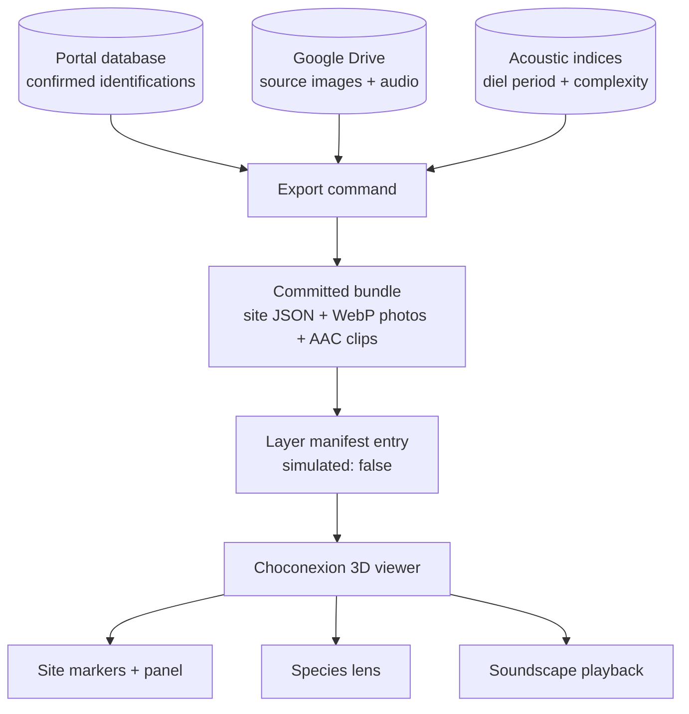

# BioChoco Results in the Choconexión 3D Viewer — Requirements

## Summary

A portal-side export produces a committed data bundle that the Choconexión LiDAR viewer
loads as a real layer: one marker per BioChoco monitoring site at its true camera position,
opening a panel with the plot's treatment, its human-confirmed species, and a scrollable
strip of camera-trap photos. A species lens highlights the plots where a chosen species was
confirmed, and a per-site soundscape clip plays the recorder's liveliest dawn minute as
atmosphere rather than as a species claim.

---

## Problem Frame

The Choconexión viewer already reserves the space this data would fill. Its layer manifest
declares five layers, and two of them — camera traps and bird observations — are flagged
`simulated: true`, carrying twelve invented camera stations and fabricated species counts.
The note in the file says the real data collection is ongoing. It has been ongoing for
two years.

Meanwhile the portal holds the matching real data and no way to show it in this context.
The three existing public surfaces — the BioChoco overview page, the token-gated site
galleries, the donor occupancy view — are all scoped to BioChoco as a whole. The
reforestation experiment is a different question with a different audience, and none of
them answer it.

The two systems turn out to line up almost exactly. Every one of the 16 Choconexión plots
contains exactly one BioChoco deployment, and the numbering matches for the treatment plots
(REF-001 sits in P01, REF-002 in P02, and so on through P13). The four control plots carry
sites coded by their actual habitat instead — PRI-003, SEC-001, PRI-002, SEC-002 — which is
why the correspondence is invisible from either side alone. Nobody has spent that join yet.

The scientific payload is modest and should be treated as such. There are 339 human-confirmed
camera identifications across the whole experiment, drawn from a design that already
standardizes effort — eleven of the twelve closed deployments ran 29 to 31 days. This is a way
to see and share what has been collected, and a test bed for putting monitoring results into a
3D landscape. It is not an analysis.

---

## Key Decisions

- **Camera detections carry every species claim; audio carries atmosphere only.** The
  339 camera identifications at these sites are all human-verified. The 377,429 BirdNET
  identifications have zero human review and no species has an applied confidence threshold,
  so filtering at the global 0.70 fallback still reports 177 species across a 1.5 km cluster.
  Presenting that as "species detected" would be a false claim in a public artifact. A
  soundscape clip makes the acoustic monitoring visible without asserting anything about
  what is singing.

- **The bundle is committed to the Choconexión repo, not fetched at runtime.** Committed data
  is diffable, hand-correctable, and keeps the public site working when the portal is down.
  This also matches how every other dataset in that repo arrives. The bundle *format* is the
  real contract: if manual refresh becomes tiresome, moving to a build-time fetch or a shared
  volume on the droplet swaps the transport without touching the format or the viewer.

- **Markers sit at true camera coordinates rather than becoming a plot property.** A marker
  inside its plot polygon preserves the plot association while also showing where the camera
  actually stood, which colouring the plot polygons by species richness would throw away. The
  marker also keeps the result attached to a device at a point rather than implying the whole
  15 m plot was surveyed uniformly.

- **Media is copied into Choconexión, not proxied from the portal.** A static site should
  serve its own assets. The portal is the only system with Google Drive credentials, and the
  source images have no local path or thumbnail, so the export must run portal-side and pull
  from Drive.

- **WebP for photos, AAC for audio.** Measured on the repo's own dense-foliage photographs,
  WebP at quality 72 saves 14–46% over mozjpeg while AVIF's further 10–20% costs three to
  four times the encode and a slower decode on a page already running Potree. WebP is also
  already the repo's convention. Audio must be AAC because compressed FLAC does not play in
  iOS Safari.

- **The soundscape layer takes the placeholder bird-observations slot.** Shipping real camera
  data beside a `simulated: true` bird layer would make the fake data conspicuous. There is no
  real point-count data in the portal to replace it with, so the layer is retired and the
  soundscape takes its place in the manifest.

---

## Data Inventory

The join, with data readiness as of 2026-08-12 production. Species counts are human-confirmed
camera identifications, excluding the `Aves` / `Unknown` / `Rodentia` bucket classes and
domestic animals. The retained-image count is what survived verification, not what the camera
captured.

| Plot | Treatment | Site | Days | Confirmed species | Detections | Retained images |
|---|---|---|---|---|---|---|
| P01 | LOW / LOW / 30M | REF-001 | 12 | 0 | 0 | 3 |
| P02 | HIGH / HIGH / 30M | REF-002 | 30 | 1 | 3 | 22 |
| P03 | LOW / HIGH / 30M | REF-003 | 30 | 2 | 11 | 13 |
| P04 | LOW / HIGH / 10M | REF-004 | open | 5 | 19 | 21 |
| P05 | HIGH / LOW / 10M | REF-005 | 31 | 4 | 23 | 25 |
| P06 | HIGH / HIGH / 20M | REF-006 | open | 4 | 11 | 23 |
| P07 | HIGH / LOW / 20M | REF-007 | 31 | 5 | 86 | 102 |
| P08 | control | SEC-002 | open | — | — | 0 (nothing uploaded) |
| P09 | LOW / LOW / 10M | REF-009 | 30 | 2 | 16 | 18 |
| P10 | HIGH / LOW / 30M | REF-010 | 29 | 1 | 17 | 29 |
| P11 | LOW / HIGH / 20M | REF-011 | 30 | 4 | 83 | 71 |
| P12 | HIGH / HIGH / 10M | REF-012 | open | — | — | 259 (unprocessed) |
| P13 | LOW / LOW / 20M | REF-013 | 31 | 1 | 3 | 5 |
| P14 | control | PRI-003 | 31 | 2 | 50 | 39 |
| P15 | control | SEC-001 | 30 | 4 | 65 | 27 |
| P16 | control | PRI-002 | 31 | 12 | 169 | 173 |

Fourteen species are confirmed across the experiment: agouti (*Dasyprocta punctata*, 246
detections in 11 plots), collared peccary (*Dicotyles tajacu*, 112 in 4), armadillo
(*Dasypus fenestratus*, 57 in 5), coati (*Nasua narica*, 38 in 2), paca (*Cuniculus paca*,
29 in 5), tayra (*Eira barbara*, 21 in 3), ocelot (*Leopardus pardalis*, 18 in 5), common
opossum (*Didelphis marsupialis*, 10 in 3), spiny rat (*Proechimys semispinosus*, 8 in 3),
crested guan (*Penelope purpurascens*, 6 in 2), and one plot each for tamandua (*Tamandua
mexicana*), crab-eating raccoon (*Procyon cancrivorus*), little tinamou (*Crypturellus
soui*), and four-eyed opossum (*Philander* sp.).

---

## Actors

- A1. **Portal operator** — an FCAT admin who runs the export, reviews the bundle, and commits
  it. Has portal admin rights and can push to the Choconexión repo.
- A2. **Visitor** — a prospective collaborator, scientist, or member of the public who opens
  the viewer with no login and no prior context.
- A3. **Portal export process** — the server-side job that reads the database, pulls media
  from Drive, transcodes, and writes the bundle.

---

## Key Flows

- F1. Produce a bundle
  - **Trigger:** A1 runs the export command against the portal.
  - **Actors:** A1, A3
  - **Steps:** A3 resolves the 16 plot↔site pairs; collects human-confirmed identifications
    per site; ranks candidate photos, starred first; downloads each chosen image from Drive
    and writes two WebP sizes; selects one dawn recording per site by acoustic complexity,
    cuts it and encodes AAC; writes the site JSON. A1 reviews the output, corrects or drops
    anything unsuitable, commits, and deploys.
  - **Outcome:** The Choconexión repo holds a self-contained bundle with no runtime dependency
    on the portal.
  - **Covered by:** R1, R2, R3, R4, R14, R15, R18, R19

- F2. Explore a site
  - **Trigger:** A2 clicks a site marker in the viewer.
  - **Actors:** A2
  - **Steps:** The panel opens with the plot identifier, its treatment combination, the site
    code, and the deployment window with its duration. Confirmed species are listed with
    counts. A2 scrolls the photo strip and enlarges a frame. A2 plays the soundscape clip.
  - **Outcome:** A2 can say what was recorded in that plot and see the evidence.
  - **Covered by:** R7, R8, R9, R16, R17, R20, R22

- F3. Follow a species
  - **Trigger:** A2 selects a species from the species list.
  - **Actors:** A2
  - **Steps:** Markers for plots where that species was confirmed are emphasised and labelled
    with their detection count; the rest recede. A2 clicks through to any highlighted site.
  - **Outcome:** A2 sees the distribution of one animal across the experiment.
  - **Covered by:** R10, R11, R12

---

## Requirements

**The bundle**

- R1. The export produces a single versioned bundle containing site records, photo assets, and
  audio assets, sufficient for the viewer to render the layer with no network call to the portal.
- R2. Each site record carries the plot identifier, the plot's treatment combination or control
  status, the site code, the deployment start and end dates, the site's position in the viewer's
  coordinate system, and the confirmed species with per-species detection counts.
- R3. Site records carry the deployment window and its duration in days, which is how this design
  standardizes effort.
- R4. Only human-confirmed identifications (verified or corrected) reach the bundle; unreviewed
  model output never does.
- R5. Bucket classes that are not species — `Aves`, `Unknown`, `Rodentia` — and domestic animals
  are excluded from species lists and counts.
- R6. The bundle carries site codes and never landowner names, consistent with the portal's
  existing public-output rule.

**The viewer layer**

- R7. A marker renders at each site's true recorded position, which falls inside its plot polygon.
- R8. Selecting a marker opens a panel naming the plot, its treatment or control status, the
  deployment window and its duration, and the confirmed species with counts.
- R9. The panel presents a scrollable strip of that site's camera-trap photographs, each
  enlargeable.
- R10. A species list, drawn from every species confirmed anywhere in the experiment, records how
  many plots each was confirmed in.
- R11. Selecting a species emphasises the markers for plots where it was confirmed and labels each
  with its detection count at that plot.
- R12. Deselecting returns the layer to its default state with all markers equally visible.
- R13. The layer registers in the viewer's layer manifest as real data, and the placeholder
  camera-trap and bird-observation layers are removed.

**Photographs**

- R14. Photographs are exported as WebP at two sizes: a strip size and an enlarged size.
- R15. Photo selection for a site prefers starred images, then images carrying a confirmed
  identification, up to eight per site. Sites with fewer qualifying images ship fewer.
- R16. Each photograph displays the species confirmed in it and the date it was taken.
- R17. Photographs load only when their site panel is opened, so the layer costs nothing on
  initial page load.

**Soundscape**

- R18. Each site with processed audio carries one clip, selected reproducibly as a dawn-period
  recording with high acoustic complexity for that site.
- R19. Clips are encoded as AAC, which plays in mobile Safari.
- R20. The soundscape is presented as a recording from that site at a stated date and time, and
  makes no claim about which species are audible.
- R21. The soundscape occupies the manifest slot vacated by the placeholder bird-observations
  layer.

**Coverage honesty**

- R22. Plots whose site has produced no results render as markers in a visibly distinct state and
  state why — no data uploaded, or uploaded but not yet processed.
- R23. Plots with no results are never omitted from the layer.
- R24. Photograph counts are never presented as a measure of survey effort, since they count only
  images retained through verification.
- R25. The layer states, where a visitor will encounter it, that the display is a record of what
  was detected and not a treatment comparison.
- R26. The bundle records the date it was generated, and the viewer surfaces it.

**Language**

- R27. Species names travel in the bundle as scientific, English common, and Spanish common, taken
  from the portal's species lookup.
- R28. The layer's own copy — panel labels, treatment names, empty-state reasons, the honesty
  statement — exists in English and Spanish and follows the host site's locale.
- R29. A species with no Spanish name falls back to its English common name, and a species with
  neither falls back to the scientific name.

---

## Acceptance Examples

- AE1. **Covers R22, R23.** A2 opens the viewer and sees 16 markers. Clicking P08's marker shows
  a panel stating that no data has been uploaded from this site yet. Clicking P12's shows that
  259 images are awaiting processing. Neither panel shows an empty species list without a reason.

- AE2. **Covers R5.** A2 clicks P16, the richest plot. The panel lists 12 species; the `Aves` and
  `Unknown` entries recorded there do not appear. Clicking P10 shows one species, not two — the
  horse recorded there is excluded — and P02 shows one, not four.

- AE3. **Covers R10, R11.** A2 selects ocelot from the species list. Five markers are emphasised —
  P04, P11, P13, P15, P16 — labelled 2, 1, 3, 9, and 3. The other eleven recede.

- AE4. **Covers R3, R8, R24, R25.** A2 compares P16 (control, 12 species) with P13 (treatment, 1
  species). Both panels show a 31-day deployment window, so the comparison rests on equal survey
  time. Neither panel labels its photograph count as effort. Clicking P01 shows a 12-day window,
  making the one genuinely short deployment visible.

- AE5. **Covers R4, R19, R20.** A2 opens the viewer on an iPhone, taps a site marker, and plays its
  soundscape clip. It plays. The clip is labelled with its site, date, and time of day and lists
  no species — none of the site's ~30,000 unreviewed BirdNET identifications reach the bundle.

- AE6. **Covers R1.** The portal is stopped. A2 loads the viewer and the full layer renders —
  markers, panels, photographs, and soundscape.

- AE7. **Covers R27, R28, R29.** A2 opens the viewer on a Spanish route and clicks P05. The panel
  reads Guatusa, Guanta and Pava crestada, with Spanish labels around them. Clicking P07 shows
  *Crypturellus soui* as "Little tinamou", since it has no Spanish name yet.

---

## Scope Boundaries

**Deferred for later**

- Occupancy model predictions draped over the LiDAR surface. The models run BioChoco-wide across
  seven habitat strata; 16 sites within one stratum will not support a per-plot fit. This is the
  most interesting eventual use of the viewer and it needs its own brainstorm.
- An audio species layer. It becomes possible once species carry applied confidence thresholds
  from the validation module. Today zero do.
- Detection rates, richness estimators, or any statistical comparison between treatments and
  controls. The deployment design standardizes survey time; turning that into a result is a
  separate piece of work.
- Automatic or scheduled refresh of the bundle.
- Other result types in the viewer — vegetation surveys, seed rain, acoustic indices as a mapped
  layer. The bundle format should not preclude them; this brainstorm does not specify them.

**Outside this scope**

- A live API from the portal to the public site. The portal's existing public-report decision is
  that the database is never exposed to the public internet, and the refresh cadence here does not
  justify revisiting it.
- Replacing or duplicating the portal's existing public BioChoco surfaces. Those answer a
  BioChoco-wide question; this answers a reforestation-experiment question.

---

## Dependencies / Assumptions

- Deployments run a standard month: eleven of the twelve closed windows are 29–31 days. REF-001
  (P01) is the exception at 12 days, and it is also the plot with the fewest images and no
  confirmed species. Four deployments are still open, so their windows are incomplete.
- Retained image counts are what survived verification, not what the cameras captured. They are
  not a survey-effort measure and must not be displayed as one.
- Source images are on Google Drive only. All 866 images at these 16 sites have no local file
  path and no generated thumbnail, so the export must fetch each chosen image from Drive using
  the portal's credentials.
- Eleven images across these sites are starred, giving the photo ranking a human signal to lead
  with. It is not enough to fill every site's strip, so the ranking must degrade gracefully.
- Acoustic indices, including diel period and acoustic complexity, are computed for essentially
  every audio file at 14 of the 16 sites (~66,000 files). P08 has no audio and P12's is
  unprocessed, so those two sites ship without a soundscape clip.
- The viewer places markers at a height above ground, and the portal stores no elevation for a
  deployment. Marker height must be derived — from the containing plot's recorded elevation, or
  by sampling the point cloud — and will be approximate either way.
- Plot geometry and the viewer's coordinate system come from the Choconexión repo and are UTM
  zone 17N; the portal stores WGS84 decimal degrees. The export owns the reprojection.
- P12's 259 images can be processed at any time, which would fill that plot without any change to
  this design. It is an operational task, not a dependency.
- The portal's species lookup (`biochoco_species`, 607 rows, 560 with a Spanish name) covers 12 of
  the 14 species in both languages. Little tinamou and *Philander* sp. have English only; both are
  single-plot species with 3 and 2 detections.

---

## Outstanding Questions

**Deferred to planning**

- How marker ground height is derived, and whether the approximation is good enough at the
  viewer's default camera distance.
- Whether the species lens emphasises the markers, the plot polygons, or both.
- Where the export command lives and how it writes into a checkout of the other repository.
- Whether the bundle carries one file or splits site records from per-site detail for lazy loading.

---

## Sources / Research

Portal (`fcat-portal`):

- `src/db/schema.ts` — `biochoco_deployments` (latitude/longitude, no elevation),
  `biochoco_images` (path and thumbnail_path both null for these sites; `starred`),
  `biochoco_identifications` (`verification_status`, `corrected_species`),
  `audio_identifications`, `acoustic_indices` (`diel_period`, `acoustic_complexity_index`).
- `src/app/public/biochoco-overview/lib/habitat-map.json` — the site-code to habitat mapping that
  identifies `REF-*` as the reforestation stratum.
- `src/app/public/biochoco-overview/lib/build-snapshot.ts` — the existing pattern for computing an
  outward-safe payload, including the site-codes-not-landowner-names rule.
- `src/lib/public-report-snapshot.ts` — slug-keyed snapshot storage, the natural home if the
  transport later moves from a committed bundle to a published snapshot.
- `docs/brainstorms/2026-07-14-biochoco-public-report-requirements.md` — the prior decision that
  public output is cached rather than live.
- `CLAUDE.md`, BirdNET threshold validation section — why unfiltered BirdNET species counts are
  not usable as results.

Choconexión (`fcat-choconexion`):

- `public/data/layers.json` — the layer manifest, including the two `simulated: true` entries this
  work replaces.
- `public/data/plots.json` — 16 plot polygons with treatments, `crs: EPSG:32617`.
- `public/js/app.js` — layer loading by `fetch` of static JSON, marker construction, and the
  per-layer z-offset convention.
- `scripts/generate-thumbs.mjs` — the WebP convention (width 700, quality 72, effort 6) and the
  reasoning for committing generated images.
- `scripts/intake-project.mjs` and `scripts/intake/*.json` — the existing precedent for data
  arriving as committed JSON produced by a script.
- `docker-compose.yml`, `server/index.js` — the read-only volume mount pattern used for point
  clouds, which is the model for a future shared-volume transport.

Measurements taken against production on 2026-08-12: the 16/16 plot↔site point-in-polygon join;
339 confirmed camera identifications, all verified; 377,429 audio identifications with zero human
verification and zero active species thresholds; 61,487 surviving a 0.70 filter across 177 species;
866 retained images with no local path; 11 starred; deployment durations of 29–31 days for eleven
of twelve closed windows; codec sizes and encode times on the repo's own foliage photographs.
