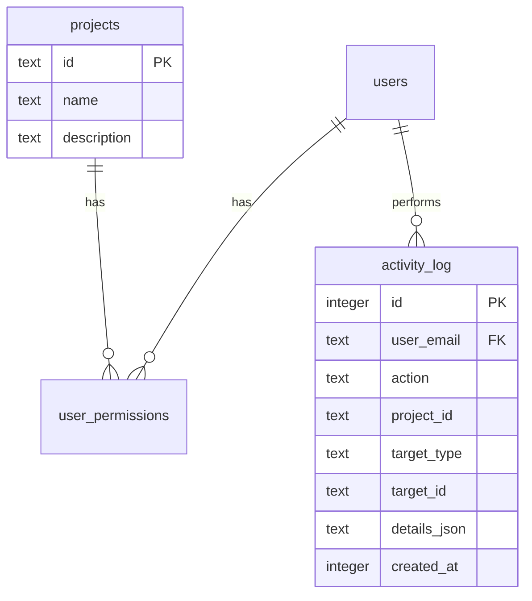

# Port GIZ and BioChoco Dashboards

## Overview

Port the four internal Streamlit dashboards (GIZ Tree Planting, GIZ Cacao Monitoring, BioChoco Scheduling Overview, BioChoco Herramientas) from `fcat-dashboards` into `fcat-portal`. This is **Phase 2** of the portal roadmap, as defined in the [2026-02-08 brainstorm](/Users/luke/apps/nextjs-test/docs/brainstorms/2026-02-08-fcat-portal-internal-platform-brainstorm.md).

The GIZ Tree Planting page was already prototyped in `nextjs-test` and will be ported with refinements. The remaining three pages are new implementations based on the Streamlit originals.

## Problem Statement / Motivation

FCAT currently runs two separate Streamlit apps behind oauth2-proxy at `internal.dashboards.fcat-ecuador.org`. These dashboards are:

- **Fragile**: Python Streamlit with `sys.path.insert` hacks, Google Sheets credentials in `secrets.toml`, manual Docker restarts.
- **Disconnected**: Separate auth database from the portal, no shared user management.
- **Limited**: No tests, no type safety, Streamlit's interactivity constraints (full re-run on every widget change).
- **Duplicated**: Two auth systems, two Docker services, two sets of credentials for the same ODK Central server.

The portal already has auth, permissions, Docker, and tests. Moving the dashboards into the portal:

1. Eliminates the separate Streamlit infrastructure
2. Unifies user management (admin page already handles per-project permissions)
3. Adds type safety and testability
4. Enables richer interactivity (Leaflet maps, TanStack Table, Recharts)

## Proposed Solution

Add four pages under two new route groups:

| Route | Source | Permission |
|-------|--------|------------|
| `/giz/tree-planting` | Streamlit `siembra_arboles.py` + nextjs-test prototype | `giz:viewer` |
| `/giz/cacao-monitoring` | Streamlit `monitoreo_cacao.py` | `giz:viewer` |
| `/biochoco/overview` | Streamlit `overview.py` | `biochoco:viewer` |
| `/biochoco/tools` | Streamlit `herramientas.py` | `biochoco:editor` |

### Data Sources (unchanged)

| Source | Integration | Used By |
|--------|-------------|---------|
| ODK Central (project 2) | TypeScript API client | GIZ (both) |
| ODK Central (project 8) | TypeScript API client | BioChoco (sites, submissions) |
| Google Sheets | `googleapis` TypeScript client | BioChoco (schedule CRUD) |
| ODK attachments | Proxy API route | GIZ tree planting (photos) |

### Key Decisions

| Decision | Choice | Rationale |
|----------|--------|-----------|
| Map library | **react-leaflet** (all dashboards) | Proven in prototype, no API key needed |
| Charts | **Recharts** | Already used in prototype, good React integration |
| Tables | **TanStack React Table** | Sorting, pagination, search — proven in prototype |
| Google Sheets auth | **Service account** | No user interaction, server-side only |
| Google Sheets data | **Keep in Sheets** | Team already uses the spreadsheet; no migration risk |
| BioChoco schedule cache | **Next.js `revalidate: 60`** | 1-minute staleness acceptable for schedule viewing |
| ODK data cache | **Next.js `revalidate: 300`** | 5-minute staleness matches Streamlit's `@st.cache_data(ttl=300)` |
| After Herramientas edit | **`revalidatePath()`** | Immediately reflect changes on Overview page |
| ODK pagination | **Fetch all pages** | Loop `$skip`/`$top` to avoid 250-record truncation |
| Audit trail | **Log edits to SQLite** | `activity_log` table records who did what, when |

## Architecture

### Route Structure

```
src/app/
├── giz/
│   ├── page.tsx                        # Redirect to /giz/tree-planting
│   ├── tree-planting/
│   │   ├── page.tsx                    # Server Component — fetch ODK data
│   │   ├── actions.ts                  # fetchTreeData server action
│   │   ├── dashboard-shell.tsx         # Client — filters, state management
│   │   ├── filter-sidebar.tsx          # Client — multi-select dropdowns
│   │   ├── metrics-row.tsx             # Client — 4 metric cards
│   │   ├── tree-map.tsx                # Client — Leaflet map wrapper (dynamic import)
│   │   ├── tree-map-inner.tsx          # Client — Leaflet CircleMarkers
│   │   ├── tree-charts.tsx             # Client — Recharts bar charts (by species, by farm)
│   │   ├── tree-table.tsx              # Client — TanStack table with search, sort, CSV
│   │   ├── photo-viewer.tsx            # Client — Dialog with 3-photo grid
│   │   └── loading.tsx                 # Skeleton loader
│   └── cacao-monitoring/
│       ├── page.tsx                    # Server Component — fetch ODK cacao data
│       ├── actions.ts                  # fetchCacaoData server action
│       ├── dashboard-shell.tsx         # Client — filters, state management
│       ├── filter-sidebar.tsx          # Client — community, farm, fertilization, survival range
│       ├── metrics-row.tsx             # Client — 5 metric cards
│       ├── cacao-map.tsx               # Client — Leaflet map (survival color-coding)
│       ├── cacao-charts.tsx            # Client — survival by farm/community, management analysis
│       ├── cacao-table.tsx             # Client — monitoring records table
│       ├── observations.tsx            # Client — expandable notes per farm
│       └── loading.tsx                 # Skeleton loader
├── biochoco/
│   ├── page.tsx                        # Redirect to /biochoco/overview
│   ├── overview/
│   │   ├── page.tsx                    # Server — fetch Sheets schedule + ODK sites
│   │   ├── actions.ts                  # fetchSchedule, fetchSites server actions
│   │   ├── overview-shell.tsx          # Client — month navigation, state
│   │   ├── month-nav.tsx               # Client — forward/back month buttons
│   │   ├── site-map.tsx                # Client — Leaflet map (color by activity)
│   │   ├── schedule-table.tsx          # Client — deployment schedule with links
│   │   ├── metrics-row.tsx             # Client — summary metrics
│   │   ├── habitat-chart.tsx           # Client — stacked bar (habitat × status)
│   │   ├── workload-chart.tsx          # Client — monthly workload preview
│   │   ├── deployment-summary.tsx      # Client — V1/V2/V3 per-site table
│   │   └── loading.tsx                 # Skeleton loader
│   └── tools/
│       ├── page.tsx                    # Server — requirePermission("biochoco", "editor")
│       ├── actions.ts                  # Server actions for all tools (shift, swap, add, sync)
│       ├── tools-shell.tsx             # Client — tab layout for tools
│       ├── bulk-shift.tsx              # Client — bulk date shift with preview
│       ├── date-swap.tsx               # Client — swap two deployments
│       ├── add-site.tsx                # Client — add site from ODK entities
│       ├── add-deployment.tsx          # Client — manual single deployment
│       ├── validate-schedule.tsx       # Client — run validation checks
│       ├── sync-odk.tsx                # Client — sync statuses from ODK
│       └── loading.tsx                 # Skeleton loader
└── api/
    └── odk/
        └── photos/
            └── route.ts                # Proxy ODK attachments (replaces /api/giz/photos)
```

### New Library Files

```
src/lib/
├── odk-client.ts          # Parameterized ODK Central client (multi-project, multi-form)
├── odk-types.ts           # Types for all ODK forms (tree, cacao, biochoco)
├── sheets-client.ts       # Google Sheets API client (service account auth)
└── schedule-utils.ts      # BioChoco schedule logic (shift, swap, validate, add site)
```

### Data Flow

```
┌─────────────────────────────────────────────┐
│                  GIZ Pages                   │
│                                              │
│  page.tsx (Server)                           │
│    └─ fetchSubmissions("2", "siembra_arboles") │
│       └─ odk-client.ts (session token cache) │
│          └─ ODK Central API (paginated)      │
│    └─ transformSubmissions() → TreeRecord[]   │
│    └─ DashboardShell (Client)                │
│       └─ useMemo filtering                   │
│       └─ Leaflet map / Recharts / Table      │
│       └─ PhotoViewer → /api/odk/photos       │
│                                              │
├─────────────────────────────────────────────┤
│              BioChoco Overview               │
│                                              │
│  page.tsx (Server)                           │
│    └─ fetchSchedule() → sheets-client.ts     │
│       └─ Google Sheets API (service account) │
│    └─ fetchSites("8", "monitoring_sites")    │
│       └─ odk-client.ts (getEntities)         │
│    └─ fetchDeploymentSubmissions()            │
│       └─ odk-client.ts (getSubmissions)      │
│    └─ OverviewShell (Client)                 │
│       └─ month state, filtering              │
│       └─ Leaflet map / schedule table        │
│                                              │
├─────────────────────────────────────────────┤
│              BioChoco Tools                  │
│                                              │
│  tools-shell.tsx (Client)                    │
│    └─ Each tool: form → preview → confirm    │
│    └─ Server Actions (actions.ts)            │
│       └─ Read Google Sheets (preview)        │
│       └─ schedule-utils.ts (compute changes) │
│       └─ Write Google Sheets (commit)        │
│       └─ revalidatePath("/biochoco/overview") │
│       └─ Log to activity_log table           │
│                                              │
└─────────────────────────────────────────────┘
```

### ERD — New Schema Additions



Only one new table needed: `activity_log`. GIZ and BioChoco data lives in ODK Central and Google Sheets, not in the portal database. The existing `projects` table gets two new seed rows (`giz`, `biochoco`).

### Navigation Changes

The nav currently has:
- Inicio
- Cámaras Trampa (if `camera-trap` permission)
- Administración (if `super_admin`)

After this work:
- Inicio
- Cámaras Trampa (if `camera-trap` permission)
- **GIZ** (if `giz` permission) — links to `/giz/tree-planting`
- **BioChoco** (if `biochoco` permission) — links to `/biochoco/overview`
- Administración (if `super_admin`)

Sub-navigation within `/giz` and `/biochoco` will use a secondary nav bar or tabs within the page layout, not the main nav.

## Technical Approach

### Phase 1: Foundation (Steps 1–3)

Set up shared infrastructure: ODK client refactor, Google Sheets client, new dependencies, project seeds, activity log schema.

### Phase 2: GIZ Dashboards (Steps 4–5)

Port GIZ Tree Planting from `nextjs-test` prototype, then build GIZ Cacao Monitoring from Streamlit source.

### Phase 3: BioChoco Dashboards (Steps 6–7)

Build BioChoco Overview (read-only), then BioChoco Herramientas (editor tools).

### Phase 4: Polish (Steps 8–9)

Navigation updates, home page cards, E2E tests, final review.

---

## Implementation Phases

### Step 1: Dependencies and ODK Client Refactor

**Goal**: Install all new dependencies and refactor the ODK client from single-form to multi-project/multi-form.

**New dependencies**:
```bash
npm install leaflet react-leaflet recharts @tanstack/react-table googleapis
npm install -D @types/leaflet
```

**Files to create/modify**:

- `src/lib/odk-client.ts` — New parameterized ODK Central client:
  ```typescript
  // Key changes from nextjs-test prototype:
  // 1. Accept projectId + formId as params (not env vars)
  // 2. Add pagination ($skip/$top) for >250 submissions
  // 3. Add getEntities() for BioChoco entity lists
  // 4. Add 401 retry (re-authenticate once on token expiry)
  // 5. Keep module-level token cache (shared across projects)

  export async function fetchSubmissions(
    projectId: string,
    formId: string,
    options?: { since?: string }
  ): Promise<Record<string, unknown>[]>

  export async function fetchEntities(
    projectId: string,
    datasetName: string
  ): Promise<Record<string, unknown>[]>

  export async function fetchAttachment(
    projectId: string,
    formId: string,
    instanceId: string,
    filename: string
  ): Promise<Response>

  // Repeat group support (for cacao photos if needed)
  export async function fetchRepeatData(
    projectId: string,
    formId: string,
    repeatName: string
  ): Promise<Record<string, unknown>[]>
  ```

- `src/lib/odk-types.ts` — Types for all ODK forms:
  ```typescript
  // Existing (from nextjs-test):
  export interface OdkGeoPoint { ... }
  export interface OdkTreeSubmission { ... }
  export interface TreeRecord { ... }
  export interface DashboardMetrics { ... }
  export interface FilterState { ... }

  // New for Cacao Monitoring:
  export interface OdkCacaoSubmission { ... }
  export interface CacaoRecord { ... }
  export interface CacaoMetrics { ... }
  export interface CacaoFilterState { ... }

  // New for BioChoco:
  export interface OdkSiteEntity { ... }
  export interface OdkDeploySubmission { ... }
  export interface OdkRetrieveSubmission { ... }
  ```

- `.env.example` — Add new env vars:
  ```
  ODK_CENTRAL_URL=https://central.fcat-ecuador.org
  ODK_CENTRAL_EMAIL=
  ODK_CENTRAL_PASSWORD=
  GOOGLE_SERVICE_ACCOUNT_KEY=  # Base64-encoded service account JSON
  BIOCHOCO_SHEET_ID=           # Google Sheets spreadsheet ID
  ```

**Acceptance criteria**:
- [x] `fetchSubmissions("2", "siembra_arboles")` returns tree data
- [x] `fetchSubmissions("2", "monitoreo_cacao_v1")` returns cacao data
- [x] `fetchEntities("8", "monitoring_sites_v0_14")` returns site list
- [x] Pagination works for datasets >250 records
- [x] 401 retry works (token refresh on expiry)
- [x] All types compile with no errors

### Step 2: Google Sheets Client

**Goal**: Create a TypeScript Google Sheets client for BioChoco schedule data.

**Files to create**:

- `src/lib/sheets-client.ts`:
  ```typescript
  // Service account auth using googleapis
  // Read schedule data from the main sheet tab
  // Read slot template from SlotTemplate tab
  // Write schedule changes back to main sheet
  // Update individual rows efficiently

  export async function loadSchedule(): Promise<ScheduleRow[]>
  export async function saveSchedule(rows: ScheduleRow[]): Promise<void>
  export async function updateScheduleRows(updates: ScheduleRowUpdate[]): Promise<void>
  export async function loadSlotTemplate(): Promise<SlotRow[]>
  ```

- `src/lib/schedule-types.ts`:
  ```typescript
  export interface ScheduleRow {
    deploymentId: string;
    siteId: string;
    siteName: string;
    habitatType: string;
    visitNumber: number;
    season: string;
    plannedDeployDate: string | null;
    plannedRetrieveDate: string | null;
    actualDeployDate: string | null;
    actualRetrieveDate: string | null;
    status: "scheduled" | "deployed" | "retrieved";
    deploySlotId: number | null;
    retrieveSlotId: number | null;
    notes: string;
  }

  export interface SlotRow {
    slotId: number;
    slotDate: string;
    yearMonth: string;
    dayOfMonth: number;
  }

  export interface ScheduleChange {
    deploymentId: string;
    field: string;
    oldValue: string;
    newValue: string;
  }
  ```

**Acceptance criteria**:
- [x] `loadSchedule()` returns typed schedule data
- [x] `saveSchedule()` writes back correctly
- [x] `updateScheduleRows()` updates specific rows
- [x] `loadSlotTemplate()` returns slot mapping
- [x] Service account credentials work from `.env.local`
- [x] Error handling for quota limits and auth failures

### Step 3: Schema Updates and Project Seeds

**Goal**: Add `activity_log` table, seed `giz` and `biochoco` projects, update nav.

**Files to modify**:

- `src/db/schema.ts` — Add `activity_log` table:
  ```typescript
  export const activityLog = sqliteTable("activity_log", {
    id: integer("id").primaryKey({ autoIncrement: true }),
    userEmail: text("user_email").notNull(),
    action: text("action").notNull(), // "schedule_shift", "schedule_swap", "sync_odk", etc.
    projectId: text("project_id"),
    targetType: text("target_type"), // "deployment", "site", etc.
    targetId: text("target_id"),
    details: text("details"), // JSON string with change details
    createdAt: integer("created_at", { mode: "timestamp" })
      .notNull()
      .default(sql`(unixepoch())`),
  });
  ```

- `scripts/push-schema.mjs` — Already handles all tables (auto-creates from schema)

- `scripts/seed-dev.ts` — Add:
  ```typescript
  insertProject.run("giz", "GIZ", "Proyecto GIZ - Siembra de árboles y monitoreo de cacao");
  insertProject.run("biochoco", "BioChoco", "Programa de monitoreo de biodiversidad BioChoco");

  // Grant super admin permissions for new projects
  db.prepare("INSERT OR IGNORE INTO user_permissions (user_email, project_id, role) VALUES (?, ?, ?)")
    .run(superAdminEmail, "giz", "admin");
  db.prepare("INSERT OR IGNORE INTO user_permissions (user_email, project_id, role) VALUES (?, ?, ?)")
    .run(superAdminEmail, "biochoco", "admin");
  ```

**Acceptance criteria**:
- [x] `node scripts/push-schema.mjs` creates `activity_log` table
- [x] `npx tsx scripts/seed-dev.ts` seeds `giz` and `biochoco` projects
- [x] Super admin has permissions for both projects
- [x] Admin page shows the new projects in permission dropdowns

### Step 4: GIZ Tree Planting Dashboard

**Goal**: Port the prototype from `nextjs-test/src/app/giz/tree-planting/` into `fcat-portal`.

**Source files** (from `/Users/luke/apps/nextjs-test/src/app/giz/tree-planting/`):
- `page.tsx`, `actions.ts`, `dashboard-shell.tsx`, `filter-sidebar.tsx`, `metrics-row.tsx`
- `tree-map.tsx`, `tree-map-inner.tsx`, `tree-charts.tsx`, `tree-table.tsx`, `photo-viewer.tsx`
- `loading.tsx`

**Porting changes** (same approach as camera-trap Phase 1 port):
1. Spanish UI — prototype already uses Spanish
2. Remove any learning comments
3. Use `ActionResult<T>` for server action returns
4. Add `requirePermission("giz", "viewer")` at top of `page.tsx`
5. Update imports to use new `odk-client.ts` (parameterized)
6. Update photo API route from `/api/giz/photos` to `/api/odk/photos`
7. Add Leaflet CSS import in the map component

**New API route**:
- `src/app/api/odk/photos/route.ts` — Generic ODK attachment proxy (not GIZ-specific):
  ```typescript
  // Params: projectId, formId, instanceId, filename
  // Auth: Call getCurrentUser() + verify permission for the project
  // Proxy: Fetch from ODK Central, stream response
  // Cache: max-age=3600
  ```

**Acceptance criteria**:
- [x] `/giz/tree-planting` loads with real ODK data
- [x] Metrics, map, charts, table all render
- [x] Filters work (farm, species, extensionista, survival, date range)
- [x] Photo viewer shows 3 photos per tree
- [x] CSV export works
- [x] Loading skeleton shows during data fetch
- [x] Unauthorized users get redirected

### Step 5: GIZ Cacao Monitoring Dashboard

**Goal**: New implementation based on Streamlit `monitoreo_cacao.py`.

**Data source**: ODK Central project 2, form `monitoreo_cacao_v1`. GPS is in WKT format (`POINT(lon lat elevation)`) — need a WKT parser.

**Types to add** (in `odk-types.ts`):
```typescript
export interface OdkCacaoSubmission {
  __id: string;
  identificacion_codigo_finca: string | null;
  identificacion_nombre_propietario: string | null;
  identificacion_comunidad: string | null;
  identificacion_fecha_siembra: string | null;
  metadata_fecha_monitoreo: string | null;
  metadata_ubicacion: string | null; // WKT POINT format
  datos_plantas_num_plantas_sembradas: number | null;
  datos_plantas_num_plantas_vivas: number | null;
  datos_plantas_tasa_sobrevivencia: number | null;
  manejo_num_limpiezas: number | null;
  manejo_realizo_fertilizacion: string | null;
  observaciones_comentarios_propietario: string | null;
  observaciones_notas_monitor: string | null;
  num_plantas_muertas: number | null;
  dias_desde_siembra: number | null;
}

export interface CacaoRecord {
  id: string;
  farmCode: string;
  ownerName: string;
  community: string;
  plantingDate: string | null;
  monitoringDate: string | null;
  lat: number | null;
  lng: number | null;
  plantsPlanted: number | null;
  plantsAlive: number | null;
  survivalRate: number | null;
  numCleanings: number | null;
  fertilized: string | null;
  ownerComments: string | null;
  monitorNotes: string | null;
  plantsDead: number | null;
  daysSincePlanting: number | null;
}

export interface CacaoMetrics {
  totalFarms: number;
  totalPlants: number;
  plantsAlive: number;
  avgSurvivalRate: number;
  communities: number;
}
```

**Components**:
- `page.tsx` — Server Component, fetches and transforms cacao data
- `dashboard-shell.tsx` — Client Component, manages filter state
- `filter-sidebar.tsx` — Filters: community, farm code, fertilization, survival range (slider)
- `metrics-row.tsx` — 5 cards: farms, total plants, alive plants, avg survival, communities
- `cacao-map.tsx` — Leaflet map with CircleMarkers color-coded by survival rate
- `cacao-charts.tsx` — 4 charts:
  1. Survival by farm (horizontal bar, color gradient red→green)
  2. Survival by community (vertical bar, color gradient)
  3. Fertilization impact (grouped bar: fertilized vs not)
  4. Cleanings vs survival (scatter plot with trendline)
- `cacao-table.tsx` — Monitoring records table (all key columns)
- `observations.tsx` — Expandable per-farm notes (owner comments + monitor notes)

**WKT parsing** (add to `odk-client.ts` or a utility):
```typescript
export function parseWktPoint(wkt: string | null): { lat: number; lng: number } | null {
  if (!wkt) return null;
  const match = wkt.match(/POINT\s*\(\s*([-\d.]+)\s+([-\d.]+)/i);
  if (!match) return null;
  return { lat: parseFloat(match[2]), lng: parseFloat(match[1]) };
}
```

**Acceptance criteria**:
- [x] `/giz/cacao-monitoring` loads with real ODK data
- [x] 5 metric cards render correctly
- [x] Map shows color-coded markers (green ≥80%, orange ≥50%, red <50%)
- [x] All 4 chart types render with real data
- [x] Filters work (community, farm, fertilization, survival range)
- [x] Data table shows all records with proper column labels
- [x] Observations section shows expandable farm notes
- [x] Unauthorized users get redirected

### Step 6: BioChoco Overview Dashboard

**Goal**: New implementation based on Streamlit `overview.py`.

**Data sources**:
- Google Sheets → `loadSchedule()` → typed `ScheduleRow[]`
- ODK Central project 8 → `fetchEntities("8", "monitoring_sites_v0_14")` → site metadata with coordinates
- ODK Central project 8 → `fetchSubmissions("8", "instalar_sensores")` → actual deploy dates
- ODK Central project 8 → `fetchSubmissions("8", "retrieve_sensors")` → actual retrieve dates

**Constants** (in a `biochoco/constants.ts` or inline):
```typescript
const ODK_PROJECT_ID = "8";
const ODK_ENTITY_LIST = "monitoring_sites_v0_14";
const ODK_FORM_INSTALL = "instalar_sensores";
const ODK_FORM_RETRIEVE = "retrieve_sensors";
const HABITAT_NAMES: Record<string, string> = {
  primary_forest: "Bosque Primario",
  secondary_forest: "Bosque Secundario",
  cacao_nacional: "Cacao Nacional",
  cacao_giz: "Cacao GIZ",
  cacao_ccn: "Cacao CCN",
  reforestation: "Reforestacion",
  pasture: "Potrero",
};
const SPANISH_MONTHS = { 1: "Enero", 2: "Febrero", ... };
```

**Components**:
- `page.tsx` — Server Component, fetches schedule + sites + submissions, joins data
- `overview-shell.tsx` — Client Component, manages month state
- `month-nav.tsx` — Previous/next month buttons with month name display
- `site-map.tsx` — Leaflet map:
  - Green markers: deployment scheduled this month
  - Orange markers: retrieval scheduled this month
  - Blue markers: active (sensor deployed)
  - Gray markers: no activity this month
  - Emoji overlays: 📷 deployed, ✅ completed
  - Popups with site details + links to Google Drive/ArcGIS
- `schedule-table.tsx` — Deployment schedule table:
  - Columns: site, habitat, planned deploy, planned retrieve, actual deploy, actual retrieve, status
  - Links to Google Drive folders and ArcGIS map views
  - Styled status badges
- `metrics-row.tsx` — Summary cards: total sites, scheduled this month, deployed, retrieved, completion %
- `habitat-chart.tsx` — Stacked bar chart: habitats × status (scheduled/deployed/retrieved)
- `workload-chart.tsx` — Monthly workload bar chart showing deployments + retrievals per month
- `deployment-summary.tsx` — Wide table: one row per site, V1/V2/V3 planned + actual dates, intervals

**Join strategy**: The Google Sheets `site_id` column matches ODK entity `site_id` property. Both use the same site identifier.

**Acceptance criteria**:
- [x] `/biochoco/overview` loads with real Sheets + ODK data
- [x] Month navigation works (forward/back)
- [x] Map shows all sites with correct color-coding
- [x] Marker popups show site details with external links
- [x] Schedule table renders with correct dates and statuses
- [x] Metrics cards show accurate counts
- [x] Habitat chart shows correct stacked bars
- [x] Workload chart shows monthly distribution
- [x] Deployment summary shows V1/V2/V3 tracking per site
- [x] Partial failure handling: if ODK fails, show Sheets data with warning

### Step 7: BioChoco Herramientas (Tools)

**Goal**: Editor-only schedule editing tools with preview-before-commit workflow.

**Permission**: `requirePermission("biochoco", "editor")` — stricter than overview.

**Schedule logic** (in `src/lib/schedule-utils.ts`):
Port the Python `schedule_utils.py` to TypeScript:
```typescript
// Working day constraints
const WORK_DAY_START = 11;
const WORK_DAY_END = 30;
const MAX_DEPLOYS_PER_MONTH = 20;
const MAX_RETRIEVES_PER_MONTH = 20;
const DEPLOYMENT_DURATION_DAYS = 30;
const MONTHS_BETWEEN_VISITS = 6;
const VISITS_PER_SITE = 3;

export function getWorkingDays(year: number, month: number): Date[]
export function isValidWorkDay(date: Date): boolean
export function findNextValidWorkDay(target: Date, used: Set<string>, monthlyCounts: Map<string, number>, maxPerMonth: number): Date
export function shiftSchedule(rows: ScheduleRow[], shiftDays: number): { rows: ScheduleRow[]; changes: ScheduleChange[] }
export function shiftScheduleBySlots(rows: ScheduleRow[], slots: SlotRow[], shiftSlots: number): { rows: ScheduleRow[]; changes: ScheduleChange[] }
export function swapDeploymentDates(rows: ScheduleRow[], id1: string, id2: string): { rows: ScheduleRow[]; changes: ScheduleChange[] }
export function addSiteToSchedule(rows: ScheduleRow[], siteInfo: { siteId: string; siteName: string; habitatType: string }): { rows: ScheduleRow[]; newDeployments: ScheduleRow[] }
export function validateSchedule(rows: ScheduleRow[]): string[]
export function assignSeason(date: Date): "wet_peak" | "wet_transition" | "dry"
```

**Server actions** (in `biochoco/tools/actions.ts`):
```typescript
"use server";

// Each tool follows the same pattern:
// 1. Validate inputs
// 2. Load current schedule from Sheets
// 3. Compute changes using schedule-utils
// 4. Return preview (ActionResult<PreviewData>)
// ... user reviews preview ...
// 5. On confirm: apply changes to Sheets, log to activity_log, revalidatePath

export async function previewBulkShift(shiftSlots: number): Promise<ActionResult<ShiftPreview>>
export async function commitBulkShift(shiftSlots: number): Promise<ActionResult<void>>

export async function previewDateSwap(id1: string, id2: string): Promise<ActionResult<SwapPreview>>
export async function commitDateSwap(id1: string, id2: string): Promise<ActionResult<void>>

export async function getAvailableSites(): Promise<ActionResult<OdkSiteEntity[]>>
export async function previewAddSite(siteInfo: SiteInfo): Promise<ActionResult<AddSitePreview>>
export async function commitAddSite(siteInfo: SiteInfo): Promise<ActionResult<void>>

export async function previewSyncOdk(): Promise<ActionResult<SyncPreview>>
export async function commitSyncOdk(): Promise<ActionResult<void>>

export async function runValidation(): Promise<ActionResult<string[]>>
```

**Tool components** — Each tool follows this UI pattern:
1. Input form (number of slots, deployment IDs, site selection)
2. "Vista Previa" (Preview) button → calls `preview*` action → shows diff table
3. "Confirmar Cambios" (Confirm) button → calls `commit*` action → shows success/error
4. All inputs disabled during preview/commit

**Audit logging**: After each commit, write to `activity_log`:
```typescript
await db.insert(activityLog).values({
  userEmail: user.email,
  action: "schedule_shift",
  projectId: "biochoco",
  targetType: "schedule",
  details: JSON.stringify({ shiftSlots, changesCount: changes.length }),
});
```

**Acceptance criteria**:
- [x] `/biochoco/tools` only accessible to editors (viewers redirected)
- [x] Bulk shift: preview shows affected deployments, confirm writes to Sheets
- [x] Date swap: select two deployments, preview shows swap, confirm writes
- [x] Add site: fetch sites from ODK, preview shows 3 new visits, confirm writes
- [x] Validate: shows list of constraint violations (or "all valid")
- [x] Sync ODK: preview shows status diff, confirm writes
- [x] After any commit, `/biochoco/overview` reflects changes immediately
- [x] All edits logged to `activity_log` table

### Step 8: Navigation and Home Page

**Goal**: Add GIZ and BioChoco to navigation and home page module cards.

**Files to modify**:

- `src/components/nav.tsx` — Add entries:
  ```typescript
  { href: "/giz/tree-planting", label: "GIZ", show: hasProjectAccess(user, "giz") },
  { href: "/biochoco/overview", label: "BioChoco", show: hasProjectAccess(user, "biochoco") },
  ```

- `src/app/page.tsx` — Add module cards for GIZ and BioChoco with permission gating

- `src/app/giz/page.tsx` — Redirect to `/giz/tree-planting`
- `src/app/biochoco/page.tsx` — Redirect to `/biochoco/overview`

- Sub-navigation within `/giz` and `/biochoco` layouts:
  - `src/app/giz/layout.tsx` — Secondary tabs: "Siembra Árboles" | "Monitoreo Cacao"
  - `src/app/biochoco/layout.tsx` — Secondary tabs: "Resumen" | "Herramientas" (editor only)

**Acceptance criteria**:
- [x] Nav shows GIZ link for users with `giz` permission
- [x] Nav shows BioChoco link for users with `biochoco` permission
- [x] Home page cards link to correct modules
- [x] Sub-nav tabs work within each module
- [x] `/giz` redirects to `/giz/tree-planting`
- [x] `/biochoco` redirects to `/biochoco/overview`
- [x] BioChoco "Herramientas" tab hidden from viewers

### Step 9: Tests and Polish

**Goal**: Add E2E smoke tests, fix any remaining issues, update docs.

**E2E tests** (Playwright):
- `tests/e2e/giz.spec.ts`:
  - GIZ tree planting page loads
  - Map renders with markers
  - Filters change displayed data
  - Photo viewer opens

- `tests/e2e/biochoco.spec.ts`:
  - BioChoco overview page loads
  - Month navigation works
  - Tools page accessible for editors
  - Tool preview workflow works

**Unit tests** (Vitest):
- `tests/unit/odk-client.test.ts` — Token caching, pagination, 401 retry
- `tests/unit/schedule-utils.test.ts` — Shift, swap, validate, add site logic
- `tests/unit/sheets-client.test.ts` — Read/write operations (mocked)

**Documentation updates**:
- `CLAUDE.md` — Add GIZ and BioChoco module descriptions
- `README.md` — Add env vars for ODK and Google Sheets
- `.env.example` — Add new env vars

**Acceptance criteria**:
- [x] All E2E tests pass
- [x] All unit tests pass
- [x] `npm run build` succeeds
- [x] `npm run test:run` succeeds
- [x] Documentation reflects new modules

## Alternative Approaches Considered

| Alternative | Rejected Because |
|------------|-----------------|
| **Keep Streamlit alongside portal** | Defeats the purpose — two auth systems, two deployments, maintenance burden |
| **Migrate schedule to SQLite** | High risk: team uses Google Sheets actively; workflow change during migration |
| **Server-side caching in SQLite** | Adds complexity for marginal benefit; Next.js `revalidate` is sufficient |
| **Mapbox instead of Leaflet** | Requires API key, commercial license; Leaflet is sufficient and already proven |
| **Chart.js instead of Recharts** | Recharts has better React integration and is already in the prototype |
| **Incremental adoption (one dashboard at a time)** | The ODK client and Sheets client are shared infrastructure; building them enables all dashboards |

## Dependencies & Prerequisites

- **ODK Central access**: Existing credentials work for both project 2 (GIZ) and project 8 (BioChoco)
- **Google Sheets service account**: Need to create or reuse a GCP service account with Sheets API access, share the spreadsheet with the service account email
- **BioChoco spreadsheet ID**: Need the actual Google Sheet ID (from the existing Streamlit secrets)
- **`monitoreo_cacao_v1` form structure**: Need to verify field names against real ODK Central data (the types above are based on the Streamlit code, but should be validated)

## Risk Analysis & Mitigation

| Risk | Likelihood | Impact | Mitigation |
|------|-----------|--------|------------|
| ODK Central API changes | Low | High | Pin to known working OData endpoints, test with real data |
| Google Sheets API quota limits | Low | Medium | Cache schedule reads, batch writes, show user-friendly quota error |
| Concurrent schedule edits | Medium | Medium | Read-then-verify pattern on commit; warn if sheet changed |
| Large ODK datasets | Medium | Low | Pagination already planned; client-side filtering viable up to ~5K records |
| Leaflet SSR crashes | Low | Medium | Dynamic import with `ssr: false` (already proven in prototype) |
| WKT GPS parsing failures | Low | Low | Graceful fallback to null coordinates, skip points without GPS |
| Missing Google Sheets credentials in dev | Medium | Low | Show clear error "BIOCHOCO_SHEET_ID not configured" rather than crash |

## Success Metrics

- All four Streamlit dashboards accessible in the portal
- Same or better data freshness (≤5 min for reads, immediate after edits)
- All team members can be granted per-project access via admin page
- E2E tests cover critical flows (page load, filters, tool workflow)
- Streamlit dashboards can be decommissioned after verification

## References

### Internal
- Brainstorm: `/Users/luke/apps/nextjs-test/docs/brainstorms/2026-02-08-fcat-portal-internal-platform-brainstorm.md`
- GIZ prototype: `/Users/luke/apps/nextjs-test/src/app/giz/tree-planting/`
- ODK client prototype: `/Users/luke/apps/nextjs-test/src/lib/odk-client.ts`
- ODK types prototype: `/Users/luke/apps/nextjs-test/src/lib/odk-types.ts`

### Streamlit Source
- GIZ Siembra: `/Users/luke/apps/fcat-dashboards/internal/projects/giz/siembra_arboles.py`
- GIZ Cacao: `/Users/luke/apps/fcat-dashboards/internal/projects/giz/monitoreo_cacao.py`
- BioChoco Overview: `/Users/luke/apps/fcat-dashboards/internal/projects/biochoco/overview.py`
- BioChoco Herramientas: `/Users/luke/apps/fcat-dashboards/internal/projects/biochoco/herramientas.py`
- Schedule Utils: `/Users/luke/apps/fcat-dashboards/internal/projects/biochoco/schedule_utils.py`
- Sheets Client: `/Users/luke/apps/fcat-dashboards/internal/projects/biochoco/sheets_client.py`
- ODK Utils (GIZ): `/Users/luke/apps/fcat-dashboards/internal/projects/giz/odk_utils.py`
- Shared ODK Client: `/Users/luke/apps/fcat-dashboards/shared/odk_client.py`

### Portal Codebase
- Schema: `src/db/schema.ts`
- Auth: `src/lib/auth.ts`
- Nav: `src/components/nav.tsx`
- Types: `src/lib/types.ts`
- Seed: `scripts/seed-dev.ts`

### External
- [ODK Central API Docs](https://docs.getodk.org/central-api/)
- [Google Sheets API (Node.js)](https://developers.google.com/sheets/api/quickstart/nodejs)
- [react-leaflet docs](https://react-leaflet.js.org/)
- [Recharts docs](https://recharts.org/)
- [TanStack Table docs](https://tanstack.com/table/latest)
