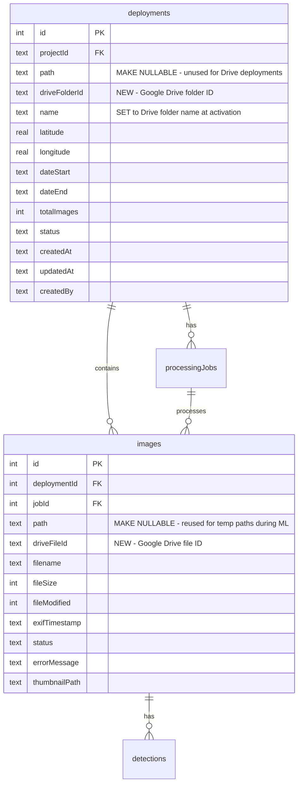

# feat: Google Drive Camera Trap Workflow

## Overview

Replace the local-filesystem-based camera trap workflow with a Google Drive API-backed architecture. Deployments live as folders on a central FCAT Shared Drive. The portal auto-discovers deployments, recursively scans for images via the Drive API, downloads them to a temp directory for ML processing, and serves images through a proxy API with local thumbnail caching.

This makes the system machine-agnostic (works identically in Docker, local dev, any server) and enables external collaborators to upload images by adding files to a shared Drive folder.

## Problem Statement

The current workflow requires users to point to a local filesystem path via `FolderScanner`. This fundamentally breaks when:
- The app runs in Docker (no access to arbitrary host directories)
- External collaborators need to contribute images (they can't access the server filesystem)
- The app is deployed to a different server (paths are not portable)

## Proposed Solution

Use the Google Drive API (already working for BioChoco) as the sole storage backend for camera trap images. No rclone, no FUSE mounts, no local filesystem dependencies.

**Key architectural decisions** (from brainstorm + review):
- Google Drive API Direct — reuse existing service account and `drive-client.ts`
- Auto-discover deployment folders from a configured root folder ID
- Recursive image scanning (handles flat + nested folder layouts)
- Store Drive file IDs in DB; reuse `images.path` for temp paths during ML (zero changes to `ml-runner.ts`)
- Pre-sync to temp directory for ML processing (no Python changes needed)
- Proxy image serving through portal API with local thumbnail cache
- Image proxy uses DB image ID as route parameter (not Drive file ID or filesystem path)
- Image proxy uses `getCurrentUser()` + manual permission checks (not `requirePermission()` which calls `redirect()`)

## Technical Approach

### Architecture

```
Google Shared Drive (CameraTraps/)
    |
    +-- DeploymentA/         <-- top-level folder = deployment
    |   +-- IMG_001.jpg      <-- flat layout
    |   +-- IMG_002.jpg
    |
    +-- DeploymentB/
        +-- camaras_trampas/ <-- nested layout
        |   +-- IMG_001.jpg
        |   +-- IMG_002.jpg
        +-- audio/           <-- non-image files ignored
            +-- rec_001.wav
```

```
Browser --> /api/ct-images/[id]?size=thumb --> Check thumbnail cache
                                                  |
                                          hit <---|---> miss
                                           |             |
                                     serve cached    Download from Drive
                                                     Generate thumbnail
                                                     Cache + serve
```

### Database Schema Changes



**Migration details:**
- `deployments.path`: Make nullable (SQLite: recreate column or add new nullable column). Add `drive_folder_id TEXT`. Add unique index on `(projectId, drive_folder_id)`. Keep existing `(projectId, path)` index for any legacy data.
- `images.path`: Make nullable. Add `drive_file_id TEXT`. Add unique index on `(deploymentId, drive_file_id)` to prevent duplicate scans.
- Use existing `deployments.name` column for the human-readable folder name (no separate `driveFolderName` column).
- No changes to `processingJobs` table (download progress shown via simple spinner, not tracked in DB).
- Migration is additive — safe for idempotent `push-schema.mjs` pattern.

### Implementation Phases

#### Phase 1: Schema Migration + Drive Client + Server Actions

Extend the database schema, Drive client, and create server actions in one pass.

**Tasks:**

**Schema:**
- [ ] Make `deployments.path` nullable in `scripts/push-schema.mjs` and `src/db/schema.ts`
- [ ] Make `images.path` nullable in `scripts/push-schema.mjs` and `src/db/schema.ts`
- [ ] Add `deployments.drive_folder_id TEXT` column
- [ ] Add `images.drive_file_id TEXT` column
- [ ] Add unique index on `(projectId, drive_folder_id)` for deployments
- [ ] Add unique index on `(deploymentId, drive_file_id)` for images
- [ ] Add `CAMERA_TRAP_ROOT_FOLDER_ID` to `.env.example` with documentation

**Drive client (`src/lib/drive-client.ts`):**
- [ ] `listDeploymentFolders(rootFolderId)` — list top-level folders in root. Use `do...while` loop with `nextPageToken`. `pageSize: 1000`.
- [ ] `listImagesRecursive(folderId)` — recursively list all image files with metadata. Filter by MIME type prefix `image/`, then post-filter by supported extensions. Handle pagination inline with `do...while` + `nextPageToken`.
- [ ] `downloadFile(fileId, destPath)` — download a single file to a local path via `drive.files.get({ fileId, alt: 'media' })`. Retry once on failure.
- [ ] `downloadDeploymentImages(folderId, destDir)` — download all images to destDir using batches of 10 with `Promise.all`. Retry once per file on failure; skip and log on second failure. Return `{ downloaded: number, failed: number, pathMap: Map<string, number> }`.
- [ ] Validate folder ID format (`/^[a-zA-Z0-9_-]+$/`) before using in Drive API queries
- [ ] All Drive API calls include `supportsAllDrives: true` and `includeItemsFromAllDrives: true`

**Server actions (`src/app/camera-trap/drive-actions.ts`):**
- [ ] `discoverDeployments()` — calls `listDeploymentFolders()`, compares with DB by `driveFolderId`, returns `{ known: Deployment[], discovered: DriveFolder[] }`. Requires `requirePermission("camera-trap", "viewer")`.
- [ ] `activateDeployment(folderId, folderName, metadata)` — validates folderId format, creates deployment row with `driveFolderId` and `name` set to folderName, status `unscanned`. Requires `"editor"`. Catches unique constraint violation → friendly Spanish error.
- [ ] `scanDeploymentImages(deploymentId)` — calls `listImagesRecursive()`, inserts image rows with `driveFileId` + `filename` (use `INSERT OR IGNORE` on `(deploymentId, driveFileId)` for idempotency), updates deployment `totalImages` and status → `scanned`. Requires `"editor"`.

**Tests:**
- [ ] Unit tests for Drive client functions (mock googleapis)

**Key files:**
- `scripts/push-schema.mjs` — ALTER TABLE statements
- `src/db/schema.ts` — column definitions
- `src/lib/drive-client.ts` — new functions
- `src/app/camera-trap/drive-actions.ts` — new file
- `src/lib/__tests__/drive-client.test.ts` — new tests
- `.env.example` — new env var

**Acceptance criteria:**
- [ ] `push-schema.mjs` adds new columns and indexes idempotently
- [ ] `path` columns are nullable (Drive deployments work without filesystem paths)
- [ ] Drive client can list folders, list images recursively, download files
- [ ] Pagination handles >1000 items per folder via `do...while` loop
- [ ] All Shared Drive calls include `supportsAllDrives: true` and `includeItemsFromAllDrives: true`
- [ ] Discovery correctly identifies new vs already-activated folders
- [ ] Activation creates a deployment; duplicate activation returns friendly error
- [ ] Scanning stores Drive file ID + filename for each image; idempotent on re-run

---

#### Phase 2: Image Proxy API + Thumbnail Caching

New API route for serving images from Google Drive with local thumbnail caching.

**Tasks:**

- [ ] Create `src/app/api/ct-images/[id]/route.ts` — image proxy route using DB image ID
  - Query parameter: `?size=thumb|full` (default: full)
  - Auth: use `getCurrentUser()` + manual permission check (NOT `requirePermission()` which calls `redirect()`). Match the pattern in `src/app/api/odk/photos/route.ts`. Return `NextResponse.json({ error }, { status: 403 })` on failure.
  - Validate image ID exists in DB and belongs to a registered deployment (prevents open proxy)
  - For `size=thumb`: check local cache at `data/thumbnails/{deploymentId}/{imageId}.jpg` (use imageId, not filename, to avoid collisions from same-named files in subfolders). Serve if exists. Otherwise download from Drive, generate thumbnail with `sharp` (400px wide, 80% JPEG), cache to disk, serve.
  - For `size=full`: download from Google Drive and buffer in memory (images are <10MB; streaming adds complexity for no benefit at this scale). Serve with Content-Type inferred from filename extension in DB.
  - Set cache headers: `Cache-Control: public, max-age=31536000, immutable`
  - Support `?download=true` for `Content-Disposition: attachment`
- [ ] Handle Drive errors gracefully: 404 if file deleted from Drive, 502 if Drive API error
- [ ] Remove auth-less old image proxy at `src/app/api/images/[...path]/route.ts` (or add auth check if keeping for legacy)

**Key files:**
- `src/app/api/ct-images/[id]/route.ts` — new file
- `src/app/api/images/[...path]/route.ts` — remove or patch

**Acceptance criteria:**
- [ ] Thumbnails are generated on first request and cached locally (keyed by imageId)
- [ ] Subsequent thumbnail requests serve from cache (no Drive API call)
- [ ] Full images served with correct Content-Type
- [ ] Auth check prevents unauthorized access (returns 403, not redirect)
- [ ] Image ID is validated against DB (prevents open proxy)
- [ ] Appropriate cache headers are set
- [ ] Drive errors return proper HTTP status codes

---

#### Phase 3: ML Processing Pipeline + Thumbnail Pre-generation

Modify the processing workflow to download images from Drive before running ML. Generate thumbnails during the download pass.

**Tasks:**

- [ ] Create `src/lib/drive-downloader.ts` — extracted download module for testability:
  - `downloadDeploymentForProcessing(deploymentId, jobId)` → `Promise<{ tempDir: string, pathMap: Map<string, number> }>`
  - Creates temp directory at `data/tmp/ct-job-{jobId}/` (inside data volume — survives container restarts, same filesystem as DB)
  - Pre-flight check: estimate required space (sum of `file_size` from images table) and warn if disk space might be tight
  - Downloads all images via `downloadDeploymentImages()`
  - Generates thumbnails during download (images already in memory from download → resize with sharp → save to `data/thumbnails/{deploymentId}/{imageId}.jpg`)
  - Writes temp paths into `images.path` for each downloaded image (so ML runner picks them up unchanged)
  - Returns the temp dir path and a path→imageId map
- [ ] Update `src/app/camera-trap/actions.ts` — `processJob()`:
  1. Call `downloadDeploymentForProcessing()` (handles download + thumbnails)
  2. Pass temp file paths to `runMLPredictions()` — **zero changes to ml-runner.ts** (it reads `images.path` which now contains temp paths)
  3. On completion/failure: delete temp directory, clear `images.path` back to null
  4. On cancellation (`cancelJob`): also delete temp directory and clear paths
- [ ] Add startup cleanup in `src/db/index.ts` `recoverStuckJobs()`:
  - After marking stuck jobs as failed, clean up any leftover `data/tmp/ct-job-*` directories
  - Clear `images.path` for images belonging to failed jobs
- [ ] Show a simple "Preparando imagenes..." spinner during download phase (no granular download progress — downloads take <2 min at this scale)

**Key files:**
- `src/lib/drive-downloader.ts` — new file
- `src/app/camera-trap/actions.ts` — modify `processJob()`, `cancelJob()`
- `src/db/index.ts` — extend `recoverStuckJobs()` for temp dir cleanup

**Acceptance criteria:**
- [ ] Images are downloaded from Drive to temp dir before ML starts
- [ ] Thumbnails are generated during download (no separate pass)
- [ ] `images.path` is set to temp paths before ML runs → ML runner works unchanged
- [ ] `images.path` is cleared after processing completes
- [ ] ML results are correctly matched back to image DB records
- [ ] Temp directory is cleaned up on success, failure, and cancellation
- [ ] Orphaned temp directories are cleaned up on server restart
- [ ] Python `predict.py` is NOT modified
- [ ] `ml-runner.ts` is NOT modified

---

#### Phase 4: UI Overhaul + Cleanup

Replace the folder-picker UI with Drive-aware deployment discovery and management.

**Tasks:**

- [ ] Create `src/app/camera-trap/deployment-discovery.tsx` (Client Component):
  - "Buscar Nuevas Carpetas" button triggers `discoverDeployments()` server action
  - Displays discovered (unregistered) folders as cards with folder name
  - Each card has an "Activar" button that opens a metadata form (name defaulted to folder name, lat/lon, date range)
  - After activation, auto-scan images and redirect to deployment detail page
  - Empty state when `CAMERA_TRAP_ROOT_FOLDER_ID` is not configured: clear message explaining setup required
  - Error state when service account can't access root folder: clear Spanish error
- [ ] Update `src/app/camera-trap/page.tsx`:
  - Replace `FolderScanner` with `DeploymentDiscovery`
  - Keep existing deployments list
- [ ] Update `src/app/camera-trap/[id]/page.tsx` (deployment detail):
  - Display deployment `name` (which is the Drive folder name) instead of filesystem path
  - Show "Preparando imagenes..." during download phase, then ML processing progress
- [ ] Update `src/components/image-grid.tsx`:
  - Change image `src` URLs from `/api/images${image.path}?size=thumb` to `/api/ct-images/${image.id}?size=thumb`
  - Update full-size image URLs too
- [ ] Update annotation/verification UI image sources to use new proxy route
- [ ] Remove `src/app/camera-trap/folder-scanner.tsx`
- [ ] Remove `src/app/camera-trap/folder-browser.tsx`
- [ ] Remove `scanFolder` server action from `actions.ts`
- [ ] Update Docker compose env documentation
- [ ] Update `.env.example` with all new env vars

**Key files:**
- `src/app/camera-trap/deployment-discovery.tsx` — new component
- `src/app/camera-trap/page.tsx` — update
- `src/app/camera-trap/[id]/page.tsx` — update
- `src/components/image-grid.tsx` — update image URLs
- `src/app/camera-trap/folder-scanner.tsx` — remove
- `src/app/camera-trap/folder-browser.tsx` — remove
- `docker-compose.yml` — update env documentation
- `.env.example` — finalize

**Acceptance criteria:**
- [ ] Discovery button lists available Drive folders
- [ ] Users can activate a folder with metadata (name defaults to folder name)
- [ ] Activation triggers automatic image scanning
- [ ] Deployment detail shows Drive folder name (not filesystem path)
- [ ] Image grid loads thumbnails from new proxy route
- [ ] Old folder picker components are removed
- [ ] Clear error messages when Drive is not configured or inaccessible
- [ ] `npm run build` passes
- [ ] `npm run lint` passes

## Acceptance Criteria

### Functional Requirements

- [ ] Auto-discovery lists all deployment folders from the configured Shared Drive root
- [ ] Users can activate discovered folders as deployments with metadata
- [ ] Image scanning recursively finds images in flat and nested folder layouts
- [ ] ML processing downloads images, runs pipeline, stores results, cleans up temp files
- [ ] Thumbnails are generated during the download pass (eager, not lazy)
- [ ] Image proxy serves thumbnails (cached) and full images with auth
- [ ] All server actions enforce `requirePermission()`; image proxy uses `getCurrentUser()`

### Non-Functional Requirements

- [ ] No changes to Python `predict.py` script
- [ ] No changes to `ml-runner.ts`
- [ ] All Drive API calls include `supportsAllDrives: true` and `includeItemsFromAllDrives: true`
- [ ] Folder IDs validated (`/^[a-zA-Z0-9_-]+$/`) before use in Drive API queries
- [ ] Download concurrency: batches of 10 with `Promise.all`, retry once per file
- [ ] Temp files cleaned up on success, failure, cancellation, and server restart
- [ ] Image proxy validates image ID belongs to a registered deployment (prevents open proxy)

### Quality Gates

- [ ] Unit tests for Drive client functions (pagination, error handling)
- [ ] Manual test: end-to-end flow from discovery -> activation -> scan -> process -> verify
- [ ] `npm run build` passes
- [ ] `npm run lint` passes

## Decisions (from brainstorm + review)

1. **Thumbnail storage**: Local only. Simpler and faster.
2. **Sync caching**: Clean up temp files after ML. Thumbnails cover the common browsing case.
3. **Collaborator onboarding**: Manual sharing via Google Drive UI by FCAT admin. No automated provisioning.
4. **Image proxy auth**: `getCurrentUser()` + manual checks (not `requirePermission()` which redirects).
5. **ML pipeline integration**: Write temp paths to `images.path` → ML runner works unchanged → clear paths after.
6. **Full image serving**: Buffer in memory (<10MB per image, small team). No streaming complexity.
7. **Download progress**: Simple spinner ("Preparando imagenes..."). No granular tracking.
8. **Re-scan**: Not in v1. Run `scanDeploymentImages` again (idempotent via `INSERT OR IGNORE` on unique constraint). Add diff detection later if needed.

## Dependencies & Prerequisites

- Service account must have Viewer access to the Camera Trap Shared Drive
- `CAMERA_TRAP_ROOT_FOLDER_ID` must be configured with the root folder's Drive ID
- DigitalOcean droplet needs sufficient disk for temp downloads (~5GB per job) + thumbnail cache
- Existing `GOOGLE_SERVICE_ACCOUNT_KEY` env var (already configured for BioChoco)

## Risk Analysis & Mitigation

| Risk | Impact | Mitigation |
|---|---|---|
| Disk exhaustion from temp files | Portal crashes (SQLite WAL mode sensitive to disk-full) | Cleanup on all exit paths + startup; pre-flight space check |
| Service account loses Shared Drive access | Silent empty results (known gotcha) | Verify access on first discovery call; clear error message |
| Slow full-image loading in annotation view | Poor UX for species verification | Aggressive browser caching (1yr immutable); preload next image |
| Concurrent users activate same folder | Duplicate deployment error | Catch unique constraint violation, return friendly error |
| Single image download failure during ML prep | Job fails partially | Retry once; skip on second failure; ML handles per-image failures |

## References

### Internal References
- Brainstorm: `docs/brainstorms/2026-02-11-camera-trap-google-drive-workflow-brainstorm.md`
- Drive client: `src/lib/drive-client.ts`
- Camera trap schema: `src/db/schema.ts:82-249`
- Image scanner: `src/lib/image-scanner.ts`
- ML runner: `src/lib/ml-runner.ts`
- Image serving API: `src/app/api/images/[...path]/route.ts`
- Camera trap actions: `src/app/camera-trap/actions.ts`
- Photo proxy security pattern: `src/app/api/odk/photos/route.ts`
- Image grid component: `src/components/image-grid.tsx`
- Push schema script: `scripts/push-schema.mjs`

### Institutional Learnings
- Shared Drive gotcha (`supportsAllDrives`): `docs/solutions/security-issues/phase2-code-review-12-findings.md`
- Photo proxy security pattern (allowlisting, auth): same file, P2-4
- Server action auth requirements: same file, P1-1
- Proxy matcher must include API routes: `docs/solutions/integration-issues/proxy-matcher-excludes-api-routes.md`
