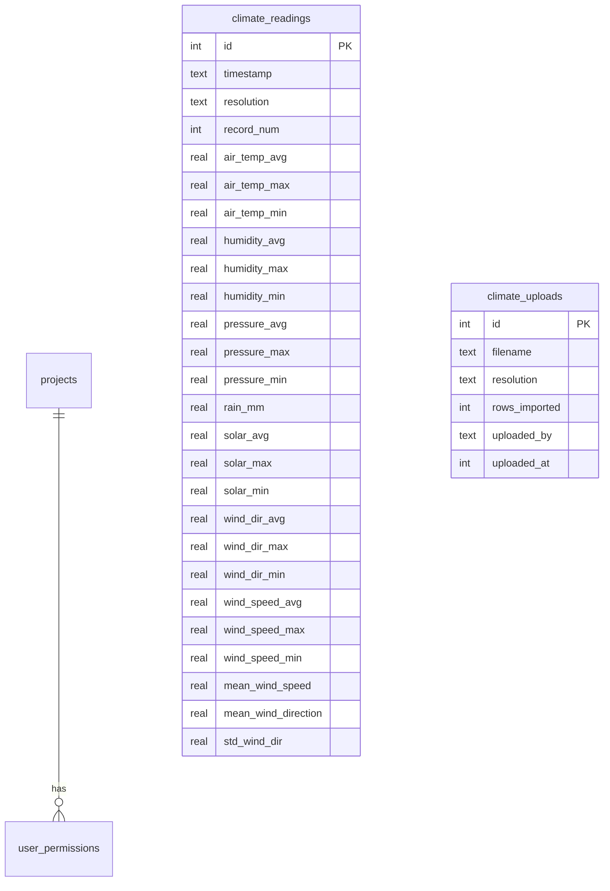

# feat: Add Climate/Weather Station Data Dashboard

## Overview

Add a new "Datos Climaticos" project module to the FCAT Portal that displays meteorological data from the central Campbell Scientific weather station at the FCAT biological station (Zone 17N 648522E 41272N). Users can upload raw `.dat` files from quarterly field downloads, view interactive dashboards with annual/monthly summaries, download data as CSV, and access citation guidelines for the FCAT-USFQ collaborative data agreement.

Data has been collected since December 2, 2021 at hourly and 15-minute intervals. The central station records: air temperature, relative humidity, atmospheric pressure, precipitation, solar radiation, wind direction, and wind speed.

## Problem Statement / Motivation

FCAT's central weather station has been collecting valuable meteorological data since Dec 2021, but this data currently lives in raw `.dat` files on Google Drive with no interactive way to explore or share it. Field staff download data quarterly from the Campbell Scientific CS300 datalogger, but there's no centralized dashboard for visualizing trends, generating summaries, or providing citation-ready access to collaborators (per the FCAT-USFQ data agreement).

## Proposed Solution

A new `climate` project module following existing portal patterns (like `giz` and `finance`), with:

1. **Data upload page** — Parse Campbell Scientific TOA5 `.dat` files into SQLite (following the finance upload pattern)
2. **Dashboard page** — Interactive Recharts visualizations with monthly/annual summary cards, time-series line charts, and filterable data tables
3. **Information page** — Project description, station details, data citation guidelines per the FCAT-USFQ agreement

## Technical Approach

### Data Format: Campbell Scientific TOA5 `.dat` Files

Both file types share the same 4-row header structure:

```
Row 1: TOA5 metadata (station info, logger model, program name)
Row 2: Column names (TIMESTAMP, RECORD, AirTC_Avg, AirTC_Max, ...)
Row 3: Units (TS, RN, Deg C, Deg C, %, %, mm, w/m2, ...)
Row 4: Aggregation type (Avg, Max, Min, Tot, WVc, ...)
Row 5+: Data (CSV, quoted strings)
```

**Hourly file** (`9.1 Registro_*.dat`): 23 columns — includes `mean_wind_speed`, `mean_wind_direction`, `std_wind_dir` wind vector columns.

**15-minute file** (`9.2 Registromin15_*.dat`): 21 columns — same measurements minus the 3 wind vector columns.

**Volume**: ~7,344 hourly rows + ~29,376 fifteen-minute rows per quarterly file. Total dataset since Dec 2021: ~35K hourly rows, ~140K fifteen-minute rows. SQLite handles this easily.

### Architecture

```
src/app/climate/
  page.tsx                    # Redirect to /climate/dashboard
  layout.tsx                  # Pass-through layout
  dashboard/
    page.tsx                  # Server: requirePermission("climate","viewer"), fetch data
    actions.ts                # Server actions: fetchClimateSummary, fetchClimateReadings
    dashboard-shell.tsx       # Client: orchestrates filters, charts, table
    climate-charts.tsx        # Recharts: temperature, humidity, precip, solar, wind
    metrics-row.tsx           # Summary cards: latest readings, period totals/averages
    climate-table.tsx         # @tanstack/react-table with search, sort, pagination, CSV export
    filter-bar.tsx            # Date range picker, resolution selector (hourly/15-min)
  upload/
    page.tsx                  # Server: requirePermission("climate","editor") for uploads
    actions.ts                # Server actions: parseAndCommitDatFile
    upload-shell.tsx          # Client: file upload UI (following finance pattern)
    parser.ts                 # TOA5 .dat file parser (shared between hourly/15-min)
  about/
    page.tsx                  # Server: requirePermission("climate","viewer")
    about-content.tsx         # Station info, data collection methods, citation guidelines
```

### Database Schema

Two new tables in SQLite:

```sql
-- Hourly and 15-min readings stored together with a resolution column
CREATE TABLE climate_readings (
  id INTEGER PRIMARY KEY AUTOINCREMENT,
  timestamp TEXT NOT NULL,            -- ISO 8601: "2025-03-01 11:00:00"
  resolution TEXT NOT NULL,           -- "hourly" or "15min"
  record_num INTEGER,                 -- RECORD column from datalogger
  air_temp_avg REAL,                  -- AirTC_Avg (°C)
  air_temp_max REAL,                  -- AirTC_Max (°C)
  air_temp_min REAL,                  -- AirTC_Min (°C)
  humidity_avg REAL,                  -- RH_Avg (%)
  humidity_max REAL,                  -- RH_Max (%)
  humidity_min REAL,                  -- RH_Min (%)
  pressure_avg REAL,                  -- Pressure_Avg
  pressure_max REAL,                  -- Pressure_Max
  pressure_min REAL,                  -- Pressure_Min
  rain_mm REAL,                       -- Rain_mm_Tot (mm)
  solar_avg REAL,                     -- Slrw_Avg (W/m²)
  solar_max REAL,                     -- Slrw_Max (W/m²)
  solar_min REAL,                     -- Slrw_Min (W/m²)
  wind_dir_avg REAL,                  -- WindDir_Avg (degrees)
  wind_dir_max REAL,                  -- WindDir_Max (degrees)
  wind_dir_min REAL,                  -- WindDir_Min (degrees)
  wind_speed_avg REAL,                -- WS_ms_Avg (m/s)
  wind_speed_max REAL,                -- WS_ms_Max (m/s)
  wind_speed_min REAL,                -- WS_ms_Min (m/s)
  mean_wind_speed REAL,               -- mean_wind_speed (m/s) — hourly only, NULL for 15min
  mean_wind_direction REAL,           -- mean_wind_direction (deg) — hourly only
  std_wind_dir REAL,                  -- std_wind_dir (deg) — hourly only
  UNIQUE(timestamp, resolution)       -- Prevent duplicate imports
);

-- Compound index for the primary query pattern: WHERE resolution = ? AND timestamp BETWEEN ? AND ?
CREATE INDEX idx_climate_readings_res_ts ON climate_readings(resolution, timestamp);

-- Track upload history
CREATE TABLE climate_uploads (
  id INTEGER PRIMARY KEY AUTOINCREMENT,
  filename TEXT NOT NULL,
  resolution TEXT NOT NULL,           -- "hourly" or "15min"
  rows_imported INTEGER NOT NULL,
  date_range_start TEXT,              -- earliest timestamp in the uploaded file
  date_range_end TEXT,                -- latest timestamp in the uploaded file
  uploaded_by TEXT NOT NULL,           -- user email
  uploaded_at INTEGER NOT NULL DEFAULT (unixepoch())
);
```

**Key design decisions**:
- Store both resolutions in a single table with a `resolution` discriminator + `UNIQUE(timestamp, resolution)` constraint
- **Upsert strategy**: Use `ON CONFLICT(timestamp, resolution) DO UPDATE SET air_temp_avg = excluded.air_temp_avg, ...` — preserves row IDs while allowing corrections from re-uploaded files (neither `INSERT OR REPLACE` which changes IDs, nor `INSERT OR IGNORE` which silently drops corrections)
- **NaN handling**: Campbell Scientific writes the string `"NAN"` for missing sensor readings. Parser converts these to `NULL` in the database. Charts use `connectNulls={false}` (line breaks at gaps). Table displays `"--"` for nulls. CSV exports empty string.
- **Timestamps**: Stored as local Ecuador time (UTC-5) as received from the datalogger — no timezone conversion. Documented on the About page.

### ERD



### Dashboard Design

**Data fetching architecture**: Server-side fetching via server actions. With ~35K hourly + ~140K fifteen-minute total rows, client-side filtering is not feasible. Each filter change (date range, resolution) triggers a server action call. The dashboard-shell maintains filter state in client state (or URL search params) and calls server actions to fetch data.

**Default state**: Last 30 days, hourly resolution.

**Chart downsampling strategy** (to prevent Recharts choking on too many data points):
- < 2,000 data points: show raw readings
- 2,000–10,000 data points: aggregate to daily averages (SQL `GROUP BY date(timestamp)`)
- > 10,000 data points: aggregate to monthly averages (SQL `GROUP BY strftime('%Y-%m', timestamp)`)
- Show a note below charts: "Datos agregados por día" or "Datos agregados por mes" when aggregation is active

**Empty state**: When no data has been uploaded, show a centered message: "No hay datos climáticos. Un editor puede subir archivos .dat desde la página de carga de datos." with a link to `/climate/upload`.

**Data staleness indicator**: Show "Últimos datos: [date] — los datos se actualizan trimestralmente" on the dashboard, derived from the latest `climate_uploads.date_range_end`.

**Metrics Row** (top summary cards):
- Latest reading timestamp
- Current temperature (avg/max/min)
- Current humidity (avg)
- Total precipitation (selected period)
- Average solar radiation (selected period)
- Average wind speed (selected period)

**Filter Bar**:
- Date range picker (start/end, with presets: last 30 days, last year, all time)
- Resolution toggle: hourly / 15-minute

**Charts** — Tabbed by variable group (one group visible at a time, tabs: Temperatura / Humedad / Precipitación / Radiación Solar / Viento / Presión):
1. **Temperatura** — Line chart with avg/max/min bands (3 lines), Recharts `LineChart`
2. **Humedad** — Line chart with avg/max/min
3. **Precipitación** — Bar chart (daily/monthly totals aggregated from the current resolution's `rain_mm`). Always aggregate from the selected resolution — never mix resolutions.
4. **Radiación Solar** — Line chart with avg/max/min
5. **Viento** — Line chart for speed (avg/max) + separate line chart for direction. **Wind direction is NOT aggregated** in downsampled views (circular averaging is mathematically incorrect without sin/cos decomposition, which SQLite lacks). Wind direction chart only shows raw data; when downsampling is active, wind direction chart is hidden with a note.
6. **Presión Atmosférica** — Line chart with avg/max/min

All charts use `ResponsiveContainer`, `Tooltip` on hover, `CartesianGrid`. `connectNulls={false}` for NaN gaps.

**Data Table** (below charts, always visible):
- Server-side pagination: server action accepts `{ page, pageSize, sortColumn, sortDirection, dateStart, dateEnd, resolution }` and returns paginated results + total count
- **Security**: `sortColumn` must be constrained to a union type of allowed column names (e.g., `"timestamp" | "air_temp_avg" | "humidity_avg" | ...`) and validated against an allowlist on the server before interpolation into SQL. Never interpolate bare user strings into ORDER BY.
- `@tanstack/react-table` UI with 50 rows/page, sort indicators, page navigation
- CSV download exports ALL rows matching current filters (via a separate server action that streams/returns full dataset), not just the visible page
- Column headers in CSV use descriptive English names matching the About page (e.g., `air_temp_avg_c`, `humidity_avg_pct`)

### About / Citation Page

Static content page with:
- Station location and equipment description
- Data collection methodology
- Data variables table (name, unit, description)
- Citation guidelines (both FCAT-station and USFQ-station citations)
- Data usage agreement summary
- Contact information for data requests

### Upload Workflow

**UI**: Two separate upload cards (following finance pattern) — one for "Datos por Hora" (hourly) and one for "Datos cada 15 Minutos" (15-min). Each card shows last upload info. Upload link hidden from viewers in sidebar nav (following the `isBiochocoEditor` pattern).

**Flow per card**:
1. User navigates to `/climate/upload` (requires `editor` role)
2. Selects a `.dat` file for that resolution
3. Parser validates TOA5 header and auto-detects resolution from Row 1 metadata ("Registro" vs "Registromin15")
4. If resolution doesn't match the card, show error: "Este archivo parece ser datos [detected], no [expected]"
5. Preview: shows row count, date range, resolution, and count of rows with parse errors (if any)
6. User confirms commit
7. All upserts + upload metadata wrapped in a single `db.transaction()` to prevent partial writes
8. `ON CONFLICT(timestamp, resolution) DO UPDATE SET ...` upserts rows in batches of ~39 (SQLite has a 999 variable limit; with 23 columns per row, max batch = `Math.floor(900 / 23)` = 39)
9. Records upload metadata in `climate_uploads` (including `date_range_start`, `date_range_end`) — inside the same transaction
10. `revalidatePath("/climate")` to bust cache

**File validation**:
- Reject non-TOA5 files: check Row 1 starts with `"TOA5"`
- Reject files over 10MB (generous limit — a year of 15-min data is ~3MB)
- For malformed rows: skip them, count errors, show in preview. Let user decide whether to commit partial data.

**Parser logic** (`parser.ts`):
- Read Row 1: validate starts with `"TOA5"`, extract table name for resolution detection
- Read Row 2: column names → build mapping to DB columns
- Skip Rows 3-4 (units and aggregation type)
- Parse each data row as CSV (handle quoted fields)
- Convert `"NAN"` string → `null`. Convert numeric strings with `Number()` + `isNaN()` check → `null` for NaN
- Map column names to DB column names
- Return `{ resolution, rows, errors, dateRange }`

## Implementation Phases

### Phase 1: Project Registration + Git Worktree Setup
- [x] Create git worktree on branch `feat/climate-dashboard`
- [x] Add `["climate", "Datos Climáticos", "Datos de la estación meteorológica central de FCAT"]` to `coreProjects` in `scripts/push-schema.mjs`
- [x] Add same to `scripts/seed-dev.ts`
- [x] Add `climate_readings` and `climate_uploads` table CREATE statements to `push-schema.mjs`
- [x] Add Drizzle table definitions to `src/db/schema.ts`
- [x] Run `node scripts/push-schema.mjs` to create tables locally

### Phase 2: Navigation + Route Shell
- [x] Add `"cloud-sun"` icon to `IconName` type in `src/components/sidebar-nav.tsx`
- [x] Add icon mapping in `src/components/sidebar-shell.tsx` ICONS record (`import { CloudSun } from "lucide-react"`)
- [x] Add climate nav entry under "Proyectos" section with `hasProjectAccess(user, "climate")` check
- [x] Nav children: "Panel" (`/climate/dashboard`), "Cargar Datos" (`/climate/upload`, editor+ only — hidden for viewers), "Acerca de" (`/climate/about`)
- [x] Add climate module card to `src/app/page.tsx` modules array
- [x] Create route files: `src/app/climate/page.tsx` (redirect to `/climate/dashboard`), `layout.tsx` (pass-through)
- [x] Create stub pages for `/climate/dashboard`, `/climate/upload`, `/climate/about` with `requirePermission()`

### Phase 3: Data Upload + Parser
- [x] Implement TOA5 `.dat` file parser in `src/app/climate/upload/parser.ts` (validates TOA5 header, handles "NAN" → null, detects resolution)
- [x] Create upload server actions in `src/app/climate/upload/actions.ts`: `previewDatFile()` and `commitDatFile()` with `requirePermission("climate", "editor")`
- [x] Build upload UI in `src/app/climate/upload/upload-shell.tsx`: two separate UploadCard components (hourly + 15-min), following finance pattern
- [x] Preview step shows: row count, date range, detected resolution, error count for malformed rows
- [x] Batch upsert with `ON CONFLICT(timestamp, resolution) DO UPDATE SET ...` (batches of ~39 rows — SQLite 999 variable limit / 23 columns)
- [x] Wrap all upserts + upload metadata insert in a single `db.transaction()` to prevent partial writes
- [x] Record upload metadata in `climate_uploads` including `date_range_start`/`date_range_end`
- [x] File validation: reject non-TOA5 files, enforce 10MB limit, resolution mismatch warning
- [x] **Unit tests for parser** in `src/app/climate/upload/__tests__/parser.test.ts`: rejects non-TOA5 files, detects hourly vs 15-min resolution, converts "NAN" to null, handles quoted CSV fields, maps columns correctly, returns errors for malformed rows, extracts correct date range
- [ ] Upload initial data files (hourly + 15-min) to populate the database

### Phase 4: Dashboard — Summary + Charts
- [x] Server actions to fetch aggregated data: `fetchClimateSummary()`, `fetchClimateReadings()`
- [x] SQL aggregations for monthly/annual summaries (`GROUP BY strftime(...)`)
- [x] Metrics row with latest readings and period summaries in `src/app/climate/dashboard/metrics-row.tsx`
- [x] Filter bar with date range and resolution selector in `src/app/climate/dashboard/filter-bar.tsx`
- [x] Line charts for temperature, humidity, pressure, solar, wind in `src/app/climate/dashboard/climate-charts.tsx`
- [x] Bar chart for precipitation (monthly totals)
- [x] Dashboard shell to orchestrate state + pass data to charts in `src/app/climate/dashboard/dashboard-shell.tsx`

### Phase 5: Dashboard — Data Table + Export
- [x] Server-side paginated data table in `src/app/climate/dashboard/climate-table.tsx`
- [x] Server action `fetchClimateTablePage({ page, pageSize, sort, dateStart, dateEnd, resolution })` returning paginated rows + total count
- [x] @tanstack/react-table UI with column definitions, sort indicators, page navigation (50 rows/page)
- [x] Server action `fetchClimateExportData({ dateStart, dateEnd, resolution })` for full CSV export (all matching rows)
- [x] Client-side CSV generation from export data with BOM prefix, descriptive column headers

### Phase 6: About / Citation Page
- [x] Static content in `src/app/climate/about/about-content.tsx`
- [x] Station description, equipment, location (with optional Leaflet map of station coordinates)
- [x] Data variables table (parameter name, column name, unit, description)
- [x] Citation text blocks (central station vs USFQ stations, per FCAT-USFQ agreement)
- [x] Data usage guidelines summary
- [x] Contact info for data access requests

## Acceptance Criteria

### Functional Requirements
- [ ] New "Datos Climáticos" project appears in sidebar nav and home page for permitted users
- [ ] Users with `editor`+ role can upload Campbell Scientific `.dat` files (hourly and 15-min)
- [ ] Parser correctly handles the 4-row TOA5 header and auto-detects resolution
- [ ] Re-uploading the same file does not create duplicate records (upsert behavior)
- [ ] Dashboard shows interactive Recharts line/bar charts for all 7 variable groups
- [ ] Users can filter by date range and switch between hourly/15-min resolution
- [ ] Monthly and annual summary aggregations display correctly
- [ ] Data table shows all readings with search, sort, pagination
- [ ] CSV download works with proper encoding (BOM for Excel)
- [ ] About page displays station info and citation guidelines in both formats
- [ ] All server actions call `requirePermission()`
- [ ] `viewer` role can see dashboard + about; `editor`+ role can upload data

### Non-Functional Requirements
- [ ] No new npm dependencies (Recharts, @tanstack/react-table, lucide-react all already installed)
- [ ] Dashboard loads quickly with ~35K hourly rows (SQL aggregation, not client-side)
- [ ] Wide data table works with sidebar open (apply `min-w-0` per learnings)

## Dependencies & Risks

- **Data file availability**: Quarterly field downloads mean data can be up to 3 months stale. No live connection to the datalogger.
- **File format changes**: If Campbell Scientific firmware is updated, the TOA5 format could change. Parser should validate header structure.
- **Multiple file uploads**: Over time, multiple quarterly files will be uploaded. The UNIQUE constraint prevents duplicates, but users need to understand they should upload each new quarterly file.
- **No existing chart pattern for time-series**: Existing Recharts usage is mostly bar/pie charts. Line charts with date axes will be new (but straightforward with Recharts).

## Git Worktree Setup

This feature will be developed in a git worktree to test that workflow:

```bash
# From the main repo
git worktree add ../fcat-portal-climate feat/climate-dashboard
cd ../fcat-portal-climate
npm install
npm run dev
```

The worktree creates an isolated working directory where we can develop without affecting the main branch. When ready, we merge or create a PR from `feat/climate-dashboard`.

## References & Research

### Internal References
- Finance upload pattern: `src/app/finance/data/` (upload-shell, actions, page)
- GIZ dashboard pattern: `src/app/giz/tree-planting/` (dashboard-shell, charts, table, metrics)
- Sidebar nav: `src/components/sidebar-nav.tsx` (icon types, permission checks)
- DB schema: `src/db/schema.ts` + `scripts/push-schema.mjs`
- Permission system: `src/lib/auth.ts` (`requirePermission`, `hasProjectAccess`)
- Brainstorm: `docs/brainstorms/2026-02-10-analysis-modules-brainstorm.md` (nav architecture)

### Institutional Learnings Applied
- Apply `min-w-0` to flex children for wide tables (`docs/solutions/ui-bugs/biochoco-overview-horizontal-scroll-map-overlap.md`)
- All server actions MUST call `requirePermission()` (`docs/solutions/security-issues/phase2-code-review-12-findings.md`)
- Numeric coercion: use `Number()` + `isNaN()` check for parsed values (`docs/solutions/integration-issues/odk-nested-json-flattening.md`)

### Data Files
- Hourly: `9.1 Registro_2026-01-07T11-19.dat` (~7,344 rows, 23 columns)
- 15-min: `9.2 Registromin15_2026-01-07T11-19.dat` (~29,376 rows, 21 columns)
- Date range in files: 2025-03-01 to 2026-01-01 (one quarterly download period)
- Full collection period: Dec 2, 2021 to present
