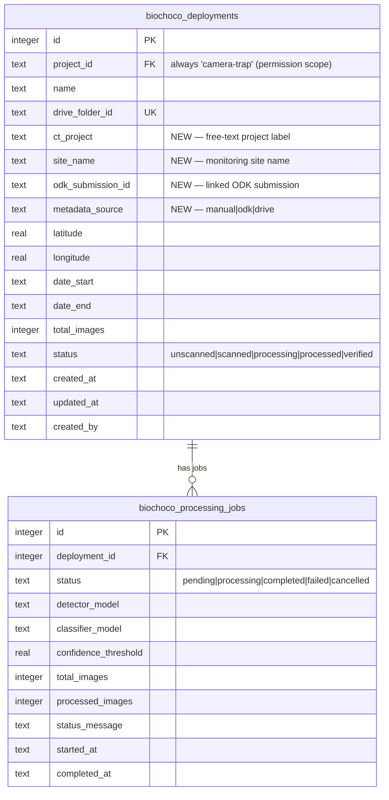

# Camera Trap Table UI Redesign

## Overview

Replace the card-based camera trap dashboard with a table-driven interface featuring multi-select batch operations, a slide-over detail panel, ODK auto-matching for metadata enrichment, and a sequential processing queue. The goal is to eliminate the multi-step activation ceremony and let users manage all deployments from a single page.

## Problem Statement

The current UX requires too many steps: Sync → click folder → fill metadata form → activate → navigate to deployment detail → click process. Users cannot see all deployments at a glance, cannot batch-process multiple deployments, and must manually enter metadata that could be auto-populated from ODK submissions.

## Proposed Solution

A single `/camera-trap` page with:
- **TanStack React Table** with sortable/filterable columns, checkbox multi-select, and search
- **Sheet side panel** (slide-over from right) for deployment details, inline editing, and processing history
- **Simplified Drive sync** that auto-creates deployment rows (no activation ceremony)
- **ODK auto-match** that enriches new deployments with GPS, site name, and dates from `instalar_sensores` submissions
- **Batch operations**: process selected (sequential queue), edit selected, delete selected
- **Processing queue** with auto-advance and FloatingJobProgress queue display

## Technical Approach

### Architecture

The redesign follows existing codebase patterns:
- **TanStack React Table** (`@tanstack/react-table`) — already used in 10+ tables (best reference: `src/app/biochoco/overview/schedule-table.tsx`)
- **Sheet component** (`src/components/ui/sheet.tsx`) — already available, first use as a content panel
- **ODK client** (`src/lib/odk-client.ts`) — `fetchSubmissions()` and `fetchEntities()` for ODK data
- **ActionResult<T>** pattern for all server actions
- **requirePermission()** on all server actions

Key architectural decisions:
1. **Server-side queue**: Jobs created as `pending` rows in DB. `processJob()` auto-advances to next pending job on completion. Survives page close but not server restart (acceptable — orphaned pending jobs can be re-triggered manually).
2. **ODK match by deployment_id**: Match ODK `site_selection.deployment_id` against Drive folder name (normalized). GPS resolved via `monitoring_sites` entity list using `site_id`.
3. **Per-row metadata_source**: ODK auto-match only fills NULL/empty fields. Never overwrites user-edited data.
4. **Queue continues on failure**: Failed jobs are marked `failed`, next job starts automatically.
5. **ct_project is free-text with autocomplete**: Start simple, add managed list later if needed.
6. **Client-side pagination**: TanStack handles sorting/filtering/pagination client-side. Load all deployments (expected <500).

### Implementation Phases

#### Phase 1: Schema Migration & Data Layer

Add new columns to `biochoco_deployments` and create server actions for the new operations.

**Schema changes** (`src/db/schema.ts`):

```typescript
// Add to biochoco_deployments table definition
ctProject: text("ct_project"),           // Camera trap project label (free-text)
siteName: text("site_name"),             // Monitoring site name
odkSubmissionId: text("odk_submission_id"), // Linked ODK instalar_sensores submission ID
metadataSource: text("metadata_source"), // "manual" | "odk" | "drive"
```

**Migration script** (`scripts/push-schema.mjs`):
- Drizzle push will add columns as nullable (safe for existing data)
- No backfill needed — existing rows will show blank project/site until manually edited or ODK-matched

**New/modified server actions** (`src/app/camera-trap/actions.ts`):

| Action | Description | Permission |
|--------|-------------|------------|
| `getDeploymentsWithStats()` | Fetch all deployments with last job date, species count via subquery | viewer |
| `updateDeploymentMetadata(id, fields)` | Update single deployment metadata | editor |
| `bulkUpdateMetadata(ids[], fields)` | Batch update metadata (only non-null fields apply) | editor |
| `deleteDeployments(ids[])` | Delete deployments + cascade. Cancel active jobs first. | editor |
| `queueProcessing(deploymentIds[])` | Create pending jobs for each, start first one | editor |

**Modified Drive actions** (`src/app/camera-trap/drive-actions.ts`):

| Action | Change | Permission |
|--------|--------|------------|
| `syncWithDrive()` | Replaces `discoverDeployments()` + `activateDeployment()`. Auto-creates rows for new folders. Returns `{ created: Deployment[], existing: Deployment[] }` | editor (was viewer) |

**Files to create/modify:**
- `src/db/schema.ts` — add 4 columns to `biochoco_deployments`
- `src/app/camera-trap/actions.ts` — add `getDeploymentsWithStats()`, `updateDeploymentMetadata()`, `bulkUpdateMetadata()`, `deleteDeployments()`, `queueProcessing()`
- `src/app/camera-trap/drive-actions.ts` — rewrite `syncWithDrive()` to auto-create rows

#### Phase 2: ODK Auto-Match

Fetch `instalar_sensores` submissions and `monitoring_sites` entities to enrich deployments with metadata.

**ODK data flow:**
1. Fetch submissions: `fetchSubmissions(BIOCHOCO_PROJECT_ID, BIOCHOCO_FORM_DEPLOY)`
2. Extract per submission: `site_selection.deployment_id`, `site_selection.site_id`, `site_selection.fecha_instalacion`
3. Fetch sites: `fetchEntities(BIOCHOCO_PROJECT_ID, BIOCHOCO_DATASET_SITES)`
4. Build lookup: `site_id` → `{ name, latitude, longitude }`
5. For each new deployment row: normalize folder name and compare against `deployment_id` values
6. On match: fill `siteName`, `latitude`, `longitude`, `dateStart` from ODK data (only NULL fields)
7. Set `odkSubmissionId` and `metadataSource: "odk"`

**Matching algorithm:**
- Normalize both strings: lowercase, strip whitespace, strip common prefixes/suffixes
- Try exact match first, then substring match
- If ambiguous (multiple matches), skip and leave for manual linking
- Log matches and skips for user feedback

**New ODK types** (`src/lib/odk-types.ts`):
- Expand `OdkDeploySubmission` to include full `site_selection` group fields
- Add `OdkMonitoringSite` entity type if not already defined

**Files to create/modify:**
- `src/app/camera-trap/odk-actions.ts` (new) — `matchOdkDeployments(deploymentIds[])`, `getOdkDeploySubmissions()`
- `src/lib/odk-types.ts` — expand types
- `src/lib/odk-constants.ts` — already has constants, no changes needed

#### Phase 3: Table UI

Replace the card dashboard with a TanStack React Table.

**Page structure:**
- `src/app/camera-trap/page.tsx` (Server Component) — fetches deployments, renders page shell
- `src/app/camera-trap/deployments-table.tsx` (new Client Component) — TanStack table with all interactive features

**Table columns** (defined as `ColumnDef<DeploymentRow>[]`):

| Column | Field | Sortable | Notes |
|--------|-------|----------|-------|
| Checkbox | — | No | Row selection, hidden for viewers |
| Nombre | `name` | Yes | Primary identifier |
| Proyecto | `ctProject` | Yes | Filterable dropdown |
| Sitio | `siteName` | Yes | From ODK or manual |
| Estado | `status` | Yes | StatusBadge component, filterable dropdown |
| Imagenes | `totalImages` | Yes | Number or "—" if unscanned |
| Ultimo Proceso | `lastProcessedAt` | Yes | Computed from latest job `completedAt` |
| Fechas | `dateStart`/`dateEnd` | Yes | Date range display |
| Ubicacion | `latitude`/`longitude` | No | GPS coordinates or "—" |

**Table features:**
- Global search filter (by name, project, site)
- Dropdown filters for project and status
- Column sorting (ArrowUpDown pattern from schedule-table.tsx)
- Pagination (10/25/50 per page)
- Row selection with `getRowSelectionModel()` from TanStack
- Selection toolbar: "X seleccionados" + action buttons

**New UI component needed:**
- `src/components/ui/checkbox.tsx` — add via `npx shadcn@latest add checkbox`

**Viewer role handling:**
- Hide checkbox column entirely (not disabled — hidden)
- Hide selection toolbar
- Table is read-only but clickable for side panel

**Files to create/modify:**
- `src/app/camera-trap/page.tsx` — rewrite to table layout
- `src/app/camera-trap/deployments-table.tsx` (new) — TanStack table client component
- `src/components/ui/checkbox.tsx` (new) — shadcn checkbox

**Files to delete:**
- `src/app/camera-trap/sync-and-activate.tsx` — replaced by sync button + auto-create
- `src/app/camera-trap/deployment-discovery.tsx` — legacy, unused

#### Phase 4: Side Panel

Add a Sheet slide-over that opens when clicking a deployment row.

**Panel content (read mode):**
- Deployment name + status badge
- Metadata grid: project, site, GPS, date range, image count, Drive link
- Action buttons: "Editar", "Procesar", "Escanear" (if unscanned)
- Processing history mini-table: date, status badge, models, detections, species count, "Ver Resultados" link

**Panel content (edit mode):**
- Toggle via "Editar" button
- Form fields: name, ct_project (text input with datalist autocomplete), site_name, latitude, longitude, dateStart, dateEnd
- Save/Cancel buttons
- Uses `updateDeploymentMetadata()` action

**Sheet configuration:**
- Side: `"right"`
- Width: override default `sm:max-w-sm` with `sm:max-w-lg` (need wider for content)
- Close on Escape, overlay click, or X button (Sheet defaults)

**Row click vs checkbox click:**
- Checkbox click: toggles selection (no panel)
- Row click (not on checkbox): opens side panel
- If panel is open and user clicks different row: panel updates to new row
- If panel is open and user checks checkbox: panel closes, selection mode activates

**Files to create/modify:**
- `src/app/camera-trap/deployment-panel.tsx` (new) — Sheet-based side panel client component
- `src/app/camera-trap/deployment-edit-form.tsx` (new) — inline edit form client component
- `src/app/camera-trap/deployments-table.tsx` — integrate panel open/close with row clicks

#### Phase 5: Batch Operations

Implement multi-select actions: process, edit, delete.

**Batch Process ("Procesar Seleccionados"):**
1. Validate selection: skip deployments already `processing`, warn about `unscanned` (will auto-scan first)
2. Call `queueProcessing(selectedIds)` server action
3. Action creates a `pending` job for each eligible deployment
4. Starts processing first job via `processJob()`
5. `processJob()` modified: on completion/failure, check for next `pending` job and auto-start it
6. FloatingJobProgress updated to show queue position

**Batch Edit ("Editar Seleccionados"):**
1. Opens a dialog/modal with metadata fields (project, site, location, dates)
2. Each field has a checkbox: "Aplicar este campo" — unchecked fields are not changed
3. Preview: "Se actualizarán X instalaciones"
4. Calls `bulkUpdateMetadata(ids, fieldsToApply)` action
5. Table refreshes via `revalidatePath`

**Batch Delete ("Eliminar"):**
1. Confirmation dialog showing: deployment count, total images, total detections, verified identifications
2. If any selected deployment is `processing`: "1 instalacion esta procesando y sera cancelada"
3. Calls `deleteDeployments(ids)` action which cancels active jobs first, then cascading delete

**Files to create/modify:**
- `src/app/camera-trap/actions.ts` — `queueProcessing()`, modify `processJob()` for auto-advance
- `src/app/camera-trap/batch-edit-dialog.tsx` (new) — bulk metadata editor dialog
- `src/app/camera-trap/batch-delete-dialog.tsx` (new) — delete confirmation with cascade counts
- `src/app/camera-trap/deployments-table.tsx` — selection toolbar with action buttons

#### Phase 6: Processing Queue & Progress

Modify the ML processing pipeline to support sequential queue execution and update the progress UI.

**Queue mechanism:**
- No new table needed. Use existing `biochoco_processing_jobs` with status `pending`
- `queueProcessing()` creates all jobs as `pending`, then calls `processJob()` on the first
- At the end of `processJob()` (success or failure), add: `processNextInQueue()`
- `processNextInQueue()`: query for oldest `pending` job, if found call `processJob()` (fire-and-forget)
- Auto-scan unscanned deployments before processing (call `scanDeploymentImages()` if status is `unscanned`)

**Queue cancellation:**
- "Cancelar Cola" button on FloatingJobProgress cancels current job AND marks all remaining `pending` jobs as `cancelled`
- Individual job cancellation still works via side panel

**FloatingJobProgress updates** (`src/components/floating-job-progress.tsx`):
- Poll `/api/active-jobs` — now returns both `processing` and `pending` jobs
- Display: "Procesando [name] (2 de 5)" when queue has multiple jobs
- Expandable section showing queue list with status per item
- "Cancelar Cola" button when queue has >1 item

**Files to create/modify:**
- `src/app/camera-trap/actions.ts` — add `processNextInQueue()`, modify `processJob()` completion handler
- `src/components/floating-job-progress.tsx` — queue display
- `src/app/api/active-jobs/route.ts` — return pending jobs count/list

### Deployment Status State Machine

```
                    ┌─────────────┐
   Drive Sync ───→  │  unscanned  │
                    └──────┬──────┘
                           │ scanDeploymentImages()
                    ┌──────▼──────┐
                    │   scanned   │
                    └──────┬──────┘
                           │ processJob() starts
                    ┌──────▼──────┐
              ┌──── │  processing │ ────┐
              │     └─────────────┘     │
              │ success                 │ failure
       ┌──────▼──────┐          ┌──────▼──────┐
       │  processed  │          │   scanned   │ (reverts)
       └──────┬──────┘          └─────────────┘
              │ all identifications verified
       ┌──────▼──────┐
       │  verified   │
       └─────────────┘
```

Reprocessing: `processed` or `verified` → `processing` is allowed (creates new job, resets status).

### ERD: Schema Changes



## Alternative Approaches Considered

1. **Accordion rows instead of side panel**: Rejected because row expansion gets cramped with 9 columns and metadata + job history content. Side panel gives more room.

2. **Server-side pagination**: Deferred. Client-side TanStack pagination is simpler and sufficient for <500 deployments. Can add server-side later if data grows.

3. **Per-field metadata_source tracking**: Too complex for the value it provides. Per-row tracking with "only fill NULL fields" rule is simpler and handles 95% of cases. If a user edits a single field, they can re-run ODK match without fear — it won't overwrite non-NULL values.

4. **Dedicated queue table**: Unnecessary. Existing `processing_jobs` table with `pending` status serves as the queue. Order by `createdAt` determines queue position.

5. **Drive subfolder structure per project**: Rejected. Adding `ct_project` as a metadata field is more flexible and doesn't require reorganizing existing Drive content.

## Acceptance Criteria

### Functional Requirements

- [x] Table displays all deployments with columns: name, project, site, status, images, last processed, dates, location
- [x] Table supports sorting, filtering (by project, status), and global search
- [x] "Sync with Drive" discovers new folders and auto-creates deployment rows
- [x] ODK auto-match enriches new deployments with GPS, site name, dates from `instalar_sensores`
- [x] Clicking a row opens side panel with deployment details and processing history
- [x] Side panel supports inline metadata editing
- [x] Multi-select with checkboxes enables batch process, edit, and delete
- [x] Batch process queues jobs and runs them sequentially
- [x] FloatingJobProgress shows queue position ("2 de 5")
- [x] Queue continues on individual job failure
- [x] Viewers see read-only table without checkboxes or action buttons
- [x] Editors can sync, process, edit, and delete
- [x] All server actions call `requirePermission()`

### Non-Functional Requirements

- [x] Page loads in <2s with 200 deployments
- [x] Table is usable at 1366px width (minimum supported)
- [x] Side panel works on tablet-width screens

### Quality Gates

- [x] All new server actions have `requirePermission()` calls
- [x] Batch operations handle edge cases: empty selection, mixed statuses, active processing
- [x] Delete confirms cascade impact (image count, detection count)
- [x] ODK match only fills NULL fields, never overwrites

## Gotchas from Institutional Learnings

1. **`min-w-0` on flex children** (`docs/solutions/ui-bugs/biochoco-overview-horizontal-scroll-map-overlap.md`): When the side panel opens, the table must shrink. Apply `min-w-0` to every flex child in the chain to prevent horizontal overflow.

2. **ODK nested JSON groups** (`docs/solutions/integration-issues/odk-nested-json-flattening.md`): `instalar_sensores` fields are nested under `site_selection` group, not flat. Access as `sub.site_selection.deployment_id`.

3. **Server→Client serialization**: Don't pass Lucide icons or functions as props from the Server Component page to the Client Component table. Pass data only.

4. **Drive Shared Drive flags**: All Drive API calls must include `supportsAllDrives: true` and `includeItemsFromAllDrives: true`.

5. **Drizzle `sql` template + undefined**: Use `?? null` for optional fields in SQL templates to prevent silent placeholder drops.

## References & Research

### Internal References
- Best table reference: `src/app/biochoco/overview/schedule-table.tsx`
- Sheet component: `src/components/ui/sheet.tsx`
- ODK client: `src/lib/odk-client.ts`
- ODK constants: `src/lib/odk-constants.ts:14-17`
- Current camera trap page: `src/app/camera-trap/page.tsx`
- Current actions: `src/app/camera-trap/actions.ts`
- Drive actions: `src/app/camera-trap/drive-actions.ts`
- Schema: `src/db/schema.ts:82-120`
- FloatingJobProgress: `src/components/floating-job-progress.tsx`
- ML runner: `src/lib/ml-runner.ts`
- StatusBadge: `src/components/status-badge.tsx`

### Brainstorm
- `docs/brainstorms/2026-02-13-camera-trap-ui-redesign-brainstorm.md`
