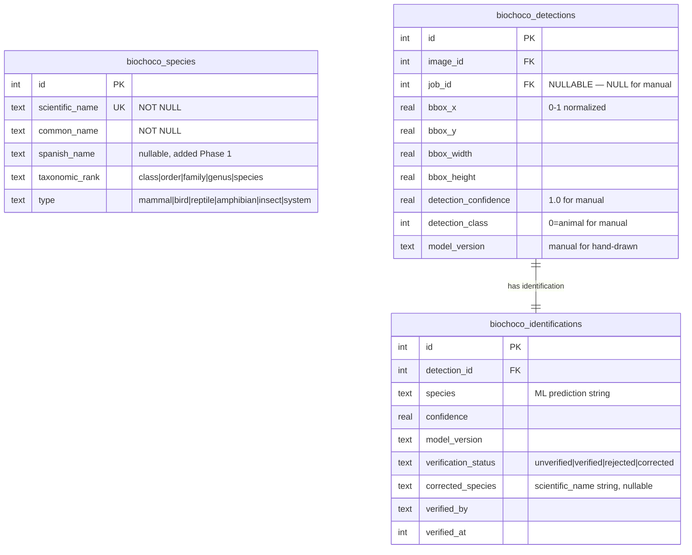

# Camera Trap Annotation & Verification UX Improvements

## Enhancement Summary

**Deepened on:** 2026-02-14
**Research agents used:** TypeScript reviewer, architecture strategist, data migration expert, frontend race condition reviewer, security sentinel, simplicity reviewer, performance oracle, combobox best practices, SVG interaction patterns, keyboard shortcut patterns, institutional learnings

### Key Improvements from Deepening

1. **Simplified from 4 phases to 3** — cut bbox resize (delete+redraw instead), name display toggle (v2), floating shortcut card (extend inline hint), and species_usage table (derive from existing data)
2. **Fixed 3 blocking data integrity issues** — manual detection orphaning on job delete, bulkVerify overwriting corrected status, and race conditions on rapid Enter key
3. **Concrete implementation patterns** — Popover+Command combobox with `keywords` prop, Pointer Events for SVG drawing, `useRef` for drag state, centralized keyboard hook
4. **Eliminated riskiest migration** — type enum table recreation replaced with storing "person" as `type="system"`

### Blocking Issues Discovered and Resolved

- `detections.job_id NOT NULL + CASCADE DELETE` would destroy manual annotations when a job is deleted/re-processed — resolved by making `job_id` nullable for manual detections
- `bulkVerify` overwrites `corrected` status back to `verified` — resolved by adding mandatory `WHERE verification_status = 'unverified'` guard
- Double-Enter fires duplicate bulkVerify + navigation — resolved with `useRef` guard pattern
- Species combobox allows double-selection before first save returns — resolved with optimistic close pattern

---

## Overview

Overhaul the camera trap annotation and verification experience across 3 phases to make reviewing 100s of model predictions per deployment fast, intuitive, and field-team friendly. The existing `biochoco_species` table gets enhanced with Spanish names and taxonomic ranks, the species correction picker becomes a searchable combobox, bounding boxes become drawable, and keyboard-driven workflow shortcuts speed up the review process.

## Problem Statement

The current annotation workflow has several friction points for the field team:
1. **Species correction** uses a flat dropdown with no search — painful with 64+ species
2. **No species database management** — species come from ML output strings with no master list maintenance
3. **No Spanish names** — field team speaks Spanish but all names are English/scientific
4. **Bounding boxes are display-only** — can't fix missed detections
5. **No quick-verify shortcut** — every image requires multiple clicks even when the prediction is obviously correct
6. **No keyboard shortcut reference** — new team members don't discover shortcuts
7. **Table overflow issues** — annotation cards extend beyond containers on some screens

## Architecture Decisions

| Decision | Choice | Rationale |
|----------|--------|-----------|
| `correctedSpecies` column | **Keep as text** (store `scientific_name` string) | Avoids risky FK migration. Species table is a reference/lookup table. Existing corrections remain valid. |
| ML predictions not in species table | Display raw ML string, constrain only corrections to species table entries | ML model vocabulary may drift from species table. Don't auto-insert unknown predictions. |
| Manual bbox sentinel values | `detectionConfidence=1.0`, `detectionClass=0`, `modelVersion="manual"`, `jobId=NULL` | Distinguishes human-drawn boxes from ML predictions. NULL jobId prevents cascade deletion. |
| Click vs draw mode | Click on existing box = select; click-drag on empty canvas = draw; min 5px drag threshold | No explicit mode toggle needed. Pointer Events for touch support. |
| Type enum | **Keep existing** (`mammal, bird, reptile, amphibian, insect, system`) — no expansion | The "person" entry already uses `detectionClass=1`. Store human as `type="system"`. Avoids risky table recreation migration. |
| Enter on multi-detection images | Verify ALL unverified detections on current image and advance | Skips already-verified/rejected/corrected. Single server action `verifyAndAdvance()`. |
| "Next image" after Enter | Next **unverified** image with **wrap-around** | Saves time on large deployments. Wraps from end to beginning. |
| Bbox resize | **Cut** — delete (reject) and redraw instead | Resize handles add ~120 LOC of complex interaction for marginal benefit. |
| Name display toggle | **Deferred to v2** — always show scientific + common name inline | All 64 species start with NULL `spanish_name`. Toggle is useless until populated. |
| Recent species | **Derive from `identifications` table** — no new `species_usage` table | Query `correctedSpecies` joined through detections/images/jobs WHERE deployment matches. Zero schema additions. |
| Shortcut reference | **Extend existing inline hint** — no floating card component | The annotation toolbar already has `v verificar · r rechazar` text. Just add new shortcuts there. |
| Species deletion with references | Soft-prevent with **re-checked** usage count at delete time | TOCTOU protection: don't trust the preview count. |
| Keyboard shortcuts | **Single centralized hook** in `image-detail-client.tsx` | Remove keyboard handler from `annotation-toolbar.tsx`. Prevents dual-listener conflicts. |
| Species data to client | Pass `Species[]` array, build `Map` on client via `useMemo` | `Map` objects don't serialize across server/client boundary. Runtime-only error. |

## Implementation Phases

### Phase 1 — Species Foundation

Enhance the existing `biochoco_species` table, build management UI, and replace the flat dropdown with a searchable combobox.

#### 1.1 Schema Changes

**File: `src/db/schema.ts`** — Add columns to existing `species` table:

```typescript
export const species = sqliteTable("biochoco_species", {
  id: integer("id").primaryKey({ autoIncrement: true }),
  scientificName: text("scientific_name").notNull().unique(),
  commonName: text("common_name").notNull(),
  spanishName: text("spanish_name"),  // NEW — nullable, added over time
  taxonomicRank: text("taxonomic_rank", {
    enum: ["class", "order", "family", "genus", "species"],
  }).notNull().default("species"),  // NEW
  type: text("type", {
    enum: ["mammal", "bird", "reptile", "amphibian", "insect", "system"],
  }).notNull().default("mammal"),  // UNCHANGED — no table recreation needed
});
```

**File: `scripts/push-schema.mjs`** — Add ALTER TABLE migrations:

```javascript
// Migrations array — ORDER MATTERS: run these before any table recreation
`ALTER TABLE biochoco_species ADD COLUMN spanish_name TEXT`,
`ALTER TABLE biochoco_species ADD COLUMN taxonomic_rank TEXT NOT NULL DEFAULT 'species' CHECK(taxonomic_rank IN ('class', 'order', 'family', 'genus', 'species'))`,
```

**File: `src/db/schema.ts`** — Make `detections.jobId` nullable for manual detections:

```typescript
jobId: integer("job_id")
  .references(() => processingJobs.id, { onDelete: "set null" }),  // nullable, SET NULL on job delete
```

**File: `scripts/push-schema.mjs`** — Table recreation for `biochoco_detections` to change `job_id` from NOT NULL to nullable with ON DELETE SET NULL (follow existing pattern at lines 336-406).

**File: `src/lib/types.ts`** — Add shared types:

```typescript
export type VerificationStatus = "unverified" | "verified" | "rejected" | "corrected";
export type TaxonomicRank = "class" | "order" | "family" | "genus" | "species";
```

> **Research insight (data migration):** Test all migrations against a copy of the production DB (from backup), not just a freshly-created dev DB. `CREATE TABLE IF NOT EXISTS` is a no-op on existing tables, so ALTER TABLE is the only way to add columns. The NOT NULL + DEFAULT on `taxonomic_rank` is safe for SQLite ALTER TABLE.

> **Research insight (architecture):** Making `job_id` nullable prevents CASCADE DELETE from destroying manual annotations when a job is deleted/re-processed. The `deleteJob` action must be updated to handle NULL `job_id` detections — they survive job deletion. Update all queries filtering by `detections.jobId` to handle NULL.

#### 1.2 CSV Import Script

**New file: `scripts/import-species-csv.mjs`**

- Read `western_ecuador.csv` (provided externally, not in repo)
- Map fields: `species_id` → ignored (use auto-increment), `common_name` → `common_name`, `scientific_name` → `scientific_name`, `type` → `type`
- Infer `taxonomic_rank` from the data:
  - Entries with "sp." in scientific name → `"genus"`
  - Entries with "unidentified" in common name and family-level scientific names (e.g., "Aves", "Rodentia", "Tinamidae") → `"class"`, `"order"`, or `"family"` based on known taxonomy
  - Specific binomial names → `"species"`
- Use `INSERT ... ON CONFLICT(scientific_name) DO UPDATE SET common_name = excluded.common_name, type = excluded.type` (not `INSERT OR IGNORE` — allows re-import with corrections)
- Log skipped/updated rows for operator visibility
- Run: `node scripts/import-species-csv.mjs path/to/western_ecuador.csv`

> **Research insight (data migration):** `INSERT OR IGNORE` silently skips re-imports with corrected data. `ON CONFLICT DO UPDATE` allows the CSV to be the source of truth for re-imports.

#### 1.3 Species Management UI

**New page: `src/app/camera-trap/species/page.tsx`** (server component)

- Route: `/camera-trap/species`
- Permission: `requirePermission("camera-trap", "editor")` at BOTH page AND action level
- Server-rendered `<table>` — no client-side sorting needed for ~64 rows (browser Ctrl+F is sufficient)
- Link from main camera trap nav

**New component: `src/app/camera-trap/species/species-client.tsx`** (small client component for dialogs only)

- "Agregar Especie" button → Dialog with form fields:
  - Scientific name (required, validated unique)
  - English common name (required)
  - Spanish common name (optional)
  - Taxonomic rank (select: Species/Genus/Family/Order/Class)
  - Type (select: mammal/bird/reptile/amphibian/insect/system)
- "Editar" button per row → Same dialog pre-filled
- "Eliminar" button per row → Confirmation dialog showing usage count
- Follow existing admin-client.tsx dialog pattern (lines 145-227)

**New server actions in `src/app/camera-trap/actions.ts`:**

```typescript
// ALL actions MUST call requirePermission and return ActionResult from @/lib/types
export async function createSpecies(data: NewSpecies): Promise<ActionResult<Species>>
export async function updateSpecies(id: number, data: Partial<NewSpecies>): Promise<ActionResult<Species>>
export async function deleteSpecies(id: number): Promise<ActionResult>  // re-checks usage count at delete time
export async function getSpeciesUsageCount(id: number): Promise<ActionResult<number>>
```

> **Research insight (security):** `deleteSpecies` must re-check usage count at delete time (TOCTOU protection). Don't trust the count from the confirmation dialog. Query `biochoco_identifications.corrected_species` by matching the species' `scientific_name` text, not by FK ID.

> **Research insight (security):** `updateSpecies` when changing `scientific_name` should warn if existing `correctedSpecies` values reference the old name. Offer to update them or block the rename.

> **Research insight (simplicity):** Skip TanStack Table, client-side sorting, and filter bar. A server-rendered `<table>` with a small client dialog component handles 64 rows perfectly. Ctrl+F works.

#### 1.4 Typeahead Species Picker (Combobox)

**Install:** `npx shadcn@latest add command popover` (adds `cmdk` package + Radix Popover)

**New component: `src/components/species-combobox.tsx`**

Build using shadcn Popover + Command pattern:

```typescript
<Popover>
  <PopoverTrigger asChild>
    <Button variant="outline" role="combobox">
      {selectedSpecies?.scientificName ?? "Seleccionar especie..."}
    </Button>
  </PopoverTrigger>
  <PopoverContent className="w-[320px] p-0">
    <Command loop filter={multiFieldFilter}>
      <CommandInput placeholder="Buscar por nombre..." />
      <CommandList>
        <CommandEmpty>No se encontraron especies.</CommandEmpty>

        {/* Recientes — hidden during search to avoid duplicates */}
        {recentSpecies.length > 0 && !search && (
          <CommandGroup heading="Recientes">
            {recentSpecies.map(s => (
              <CommandItem
                key={`recent-${s.id}`}
                value={`recent-${s.scientificName}`}
                keywords={[s.commonName, s.spanishName ?? ""]}
                onSelect={() => handleSelect(s.scientificName)}
              >
                <SpeciesItemContent species={s} />
              </CommandItem>
            ))}
          </CommandGroup>
        )}

        {/* Category groups */}
        {groupedSpecies.map(([type, items]) => (
          <CommandGroup key={type} heading={TYPE_LABELS[type]}>
            {items.map(s => (
              <CommandItem
                key={s.id}
                value={s.scientificName}
                keywords={[s.commonName, s.spanishName ?? ""]}
                onSelect={() => handleSelect(s.scientificName)}
              >
                <SpeciesItemContent species={s} />
              </CommandItem>
            ))}
          </CommandGroup>
        ))}
      </CommandList>
    </Command>
  </PopoverContent>
</Popover>
```

- **Multi-field search**: Use `keywords` prop on `CommandItem` — pass English and Spanish names as keywords, scientific name as value. cmdk searches across value + keywords automatically.
- **Custom filter for ranking**: Scientific name prefix match → rank 1, substring match anywhere → rank 0.5. Strip `recent-` prefix in filter function.
- **Recents hidden during search**: When user types, recents group disappears to avoid duplicates.
- **Rank badge**: Small colored `<Badge variant="outline">` next to each species name (sp./gen./fam./ord./cl.)
- **Selection**: Returns `scientific_name` string → stored in `correctedSpecies` column
- **100 items is trivially fast**: cmdk hides items via CSS `hidden` attribute, no virtualization needed below ~1000 items.

**Each item shows**: `scientific_name` (italic, primary) + rank badge + `common_name` (secondary text)

**Integration in `src/components/annotation-toolbar.tsx`:**

Replace the existing `<Select>` dropdown (lines 205-216) with `<SpeciesCombobox>`. **Optimistic close pattern**: Close combobox immediately on selection, before server response. Re-open with error toast on failure.

```typescript
const handleCorrect = (identificationId: number, newSpecies: string) => {
  setCorrectingId(null);  // close combobox IMMEDIATELY, not after response
  startTransition(async () => {
    const result = await correctIdentification(identificationId, newSpecies);
    if (!result.success) {
      toast.error(result.error);
    }
    onActionComplete?.();
  });
};
```

> **Research insight (combobox):** `cmdk`'s `keywords` prop is purpose-built for multi-field search. Do NOT implement custom filtering unless you need ranking control. The default fuzzy match across value + keywords works well. Use `recent-` prefix on value to avoid cmdk's internal deduplication for items in both "Recientes" and their type group.

> **Research insight (race conditions):** Without the optimistic close, users can select a second species before the first correction saves, causing last-write-wins with potential wrong species stored.

#### 1.5 Recent Species (Derived from Identifications)

Instead of a new `species_usage` table, derive recent species from existing data:

```typescript
export async function getRecentSpecies(
  deploymentId: number,
  limit = 8
): Promise<ActionResult<Species[]>> {
  await requirePermission("camera-trap", "viewer");

  const recent = await db
    .selectDistinct({ scientificName: identifications.correctedSpecies })
    .from(identifications)
    .innerJoin(detections, eq(detections.id, identifications.detectionId))
    .innerJoin(images, eq(images.id, detections.imageId))
    .innerJoin(processingJobs, eq(processingJobs.id, images.jobId))
    .where(
      and(
        eq(processingJobs.deploymentId, deploymentId),
        isNotNull(identifications.correctedSpecies)
      )
    )
    .orderBy(desc(identifications.verifiedAt))
    .limit(limit);

  const recentNames = recent.map(r => r.scientificName).filter(Boolean);
  if (recentNames.length === 0) return { success: true, data: [] };

  const speciesList = await db
    .select()
    .from(species)
    .where(inArray(species.scientificName, recentNames as string[]));

  return { success: true, data: speciesList };
}
```

> **Research insight (simplicity):** The data already exists in `identifications.correctedSpecies` + `verifiedAt`. A JOIN query gives the same "recent species per deployment" result with zero schema additions, zero new table, zero extra writes on every correction.

#### 1.6 Update Results Page Species Resolution

**File: `src/app/camera-trap/results/[id]/page.tsx`**

- Still display the raw ML prediction string as-is (don't resolve against species table)
- When showing `correctedSpecies`, resolve against species table for display
- Pass `Species[]` array (from `getSpeciesList()`) to client components — NOT a `Map`

**File: `src/app/camera-trap/results/[id]/images/[imageId]/image-detail-client.tsx`**

- Build `speciesMap` on client side in `useMemo`:

```typescript
const speciesMap = useMemo(
  () => new Map(speciesList.map(s => [s.scientificName, s])),
  [speciesList]
);
```

> **Research insight (serialization):** `Map` objects do NOT serialize across the server/client boundary in React Server Components. They arrive as empty objects on the client. This is a runtime-only error — `npm run build` does not catch it. Always pass plain arrays/objects from server to client.

### Phase 2 — Bbox Interaction + Selection

#### 2.1 Click-to-Highlight Sync

**File: `src/components/annotation-toolbar.tsx`**

- When `selectedDetectionId` changes, scroll the matching annotation card into view using `scrollIntoView({ block: "nearest", behavior: "instant" })` — "nearest" only scrolls if target is outside visible area, "instant" prevents fighting user's manual scroll
- Add a visual highlight ring/border to the selected card (e.g., `ring-2 ring-primary`)
- Add number badges (1, 2, 3...) to each detection card matching the bbox numbers on the image

**File: `src/components/bbox-overlay.tsx`**

- Add number labels (1, 2, 3...) inside each bbox
- Ensure selected bbox has prominent visual distinction (already has 3px stroke at opacity 1.0 — may need stronger)

#### 2.2 Centralized Keyboard Shortcuts

**New hook: `src/hooks/use-annotation-shortcuts.ts`**

Consolidate ALL keyboard handling into a single hook. Remove the existing `useEffect` from `annotation-toolbar.tsx` (lines 99-125). The toolbar becomes a pure display/click component.

```typescript
export const SHORTCUTS = [
  { key: '←/→', description: 'Imagen anterior/siguiente', category: 'navigation' },
  { key: '1-9', description: 'Seleccionar detección', category: 'navigation' },
  { key: 'Esc', description: 'Deseleccionar', category: 'navigation' },
  { key: 'Enter', description: 'Verificar todo y avanzar', category: 'annotation' },
  { key: 'v', description: 'Verificar detección', category: 'annotation' },
  { key: 'r', description: 'Rechazar detección', category: 'annotation' },
] as const;

export function useAnnotationShortcuts(opts: {
  enabled?: boolean;
  onVerify?: () => void;
  onReject?: () => void;
  onQuickVerifyAll?: () => void;
  onNext?: () => void;
  onPrev?: () => void;
  onSelectDetection?: (index: number) => void;
  onDeselect?: () => void;
  detectionCount?: number;
}) {
  const optsRef = useRef(opts);
  optsRef.current = opts;  // stable ref avoids re-registering listener

  useEffect(() => {
    if (!opts.enabled) return;

    function handleKeyDown(e: KeyboardEvent) {
      // Guard: skip in editable fields
      if (e.target instanceof HTMLInputElement ||
          e.target instanceof HTMLTextAreaElement ||
          e.target instanceof HTMLSelectElement ||
          (e.target as HTMLElement).isContentEditable ||
          (e.target as HTMLElement).getAttribute('role') === 'combobox') return;

      // Allow Escape everywhere
      if (e.key === 'Escape') { optsRef.current.onDeselect?.(); return; }

      const hasModifier = e.metaKey || e.ctrlKey || e.altKey;

      switch (e.key) {
        case 'ArrowLeft': e.preventDefault(); optsRef.current.onPrev?.(); break;
        case 'ArrowRight': e.preventDefault(); optsRef.current.onNext?.(); break;
        case 'Enter': if (!hasModifier) { e.preventDefault(); optsRef.current.onQuickVerifyAll?.(); } break;
        case 'v': if (!hasModifier) { e.preventDefault(); optsRef.current.onVerify?.(); } break;
        case 'r': if (!hasModifier) { e.preventDefault(); optsRef.current.onReject?.(); } break;
        default:
          if (!hasModifier && /^[1-9]$/.test(e.key)) {
            const index = parseInt(e.key, 10) - 1;
            if (optsRef.current.detectionCount && index < optsRef.current.detectionCount) {
              e.preventDefault();
              optsRef.current.onSelectDetection?.(index);
            }
          }
      }
    }

    window.addEventListener('keydown', handleKeyDown);
    return () => window.removeEventListener('keydown', handleKeyDown);
  }, [opts.enabled]);
}
```

**Extend existing shortcut hint** in `annotation-toolbar.tsx` (lines 233-238):

```tsx
<div className="text-xs text-muted-foreground text-center pt-2 border-t">
  <span className="font-mono">v</span> verificar ·{" "}
  <span className="font-mono">r</span> rechazar ·{" "}
  <span className="font-mono">Enter</span> verificar todo ·{" "}
  <span className="font-mono">1-9</span> seleccionar ·{" "}
  <span className="font-mono">Esc</span> deseleccionar
</div>
```

> **Research insight (keyboard):** Use `event.key` for character shortcuts (handles Spanish keyboard layout). Guard all bare-letter shortcuts with `!e.metaKey && !e.ctrlKey && !e.altKey` to prevent conflicts with Ctrl+V paste etc. Use a `useRef` for the options to avoid re-registering the listener on every render. Single centralized handler prevents dual-listener bugs.

> **Research insight (simplicity):** The existing inline hint text at the bottom of the annotation toolbar is the right place for shortcuts — zero new components, zero z-index issues. A floating card with toggle is YAGNI.

#### 2.3 Bbox Drawing (New Detections)

**File: `src/components/bbox-overlay.tsx`** — Add drawing mode using Pointer Events:

**Key implementation patterns from research:**

1. **Use Pointer Events** (`onPointerDown/Move/Up`) not mouse events — unified mouse/touch/pen support, plus `setPointerCapture` prevents lost events during fast drags
2. **Use `useRef` for drag state** — avoid 60Hz re-renders during drawing. Only `setState` for the visual preview rect.
3. **Use `getScreenCTM()`** for SVG coordinate conversion — automatically handles viewBox scaling, scroll offsets, CSS transforms
4. **Use `ResizeObserver`** instead of `window.addEventListener("resize")` — fires on actual element size change (sidebar toggle, accordion expansion), not just window resize

```typescript
interface DragState {
  startX: number; startY: number;
  currentX: number; currentY: number;
  hasDragged: boolean;
}

const DRAG_THRESHOLD = 5;
const MIN_BOX_PX = 10;
const dragRef = useRef<DragState | null>(null);

// onPointerDown on empty SVG area (not on existing box): start drawing
// onPointerMove: if distance > 5px, set hasDragged, update preview via setState
// onPointerUp: if hasDragged && size > MIN_BOX_PX, create detection; else cancel

// IMPORTANT: set cursor to 'crosshair' when editable
// IMPORTANT: set draggable={false} on the  to prevent browser image drag
```

**New preview rectangle**: Dashed border, semi-transparent blue fill while drawing.

**After draw completes, auto-focus combobox ONLY if interaction state is still idle:**

```typescript
// State machine guard: only auto-focus if user hasn't started another draw
if (interactionStateRef.current === 'saving') {
  interactionStateRef.current = 'idle';
  if (result.success) {
    onDetectionSelect(result.data.detectionId);
    // Open combobox for species selection
  }
} else {
  // User moved on to another draw. Accept save silently.
}
```

**New server action:**

```typescript
export async function createManualDetection(
  imageId: number,
  bbox: { x: number; y: number; width: number; height: number }
): Promise<ActionResult<{ detectionId: number; identificationId: number }>>
```

- Permission: `requirePermission("camera-trap", "editor")`
- **Server-side bbox validation**: All values must be numbers, `0 ≤ x,y ≤ 1`, `width > 0`, `height > 0`, `x + width ≤ 1.01`, `y + height ≤ 1.01` (small epsilon for float precision)
- Creates `detections` row: `jobId=NULL`, `detectionConfidence=1.0`, `detectionClass=0`, `modelVersion="manual"`
- Creates `identifications` row: `species="unknown"`, `confidence=1.0`, `modelVersion="manual"`, `verificationStatus="unverified"`
- Does NOT call `revalidatePath` — client will `router.refresh()` after selection

> **Research insight (architecture):** `jobId=NULL` for manual detections is critical. With `ON DELETE SET NULL`, manual detections survive job deletion. Without this, every manually-drawn bbox is destroyed when the associated job is re-run — catastrophic loss of human annotation work.

> **Research insight (race conditions):** The auto-focus combobox after draw must be gated by interaction state. If the user starts a second draw before the first save returns, the combobox opening would interrupt the second draw mid-stroke.

> **Research insight (SVG):** `normalizeRect()` handles drawing in any direction (right-to-left, bottom-to-top) by flipping negative width/height. Always clamp to image bounds. The 5px threshold on Euclidean distance (not just dx/dy) feels most natural.

### Phase 3 — Speed + Polish

#### 3.1 Quick Verify (Enter Key)

**New combined server action** (eliminates one round-trip):

```typescript
export async function verifyAndAdvance(
  identificationIds: number[],
  jobId: number,
  currentImageId: number
): Promise<ActionResult<{ nextImageId: number | null }>> {
  const user = await requirePermission("camera-trap", "editor");

  if (identificationIds.length > 0) {
    await db
      .update(identifications)
      .set({
        verificationStatus: "verified",
        verifiedBy: user.email,
        verifiedAt: new Date(),
      })
      .where(
        and(
          inArray(identifications.id, identificationIds),
          eq(identifications.verificationStatus, "unverified")  // MANDATORY guard
        )
      );
  }

  // Get next unverified — FORWARD first, then WRAP AROUND
  const forward = await db
    .select({ id: images.id })
    .from(images)
    .innerJoin(detections, eq(detections.imageId, images.id))
    .innerJoin(identifications_alias, eq(identifications_alias.detectionId, detections.id))
    .where(and(
      eq(images.jobId, jobId),
      eq(identifications_alias.verificationStatus, "unverified"),
      sql`${images.id} > ${currentImageId}`
    ))
    .orderBy(images.id)
    .limit(1);

  if (forward.length > 0) return { success: true, data: { nextImageId: forward[0].id } };

  // Wrap around from beginning
  const wrapped = await db
    .select({ id: images.id })
    .from(images)
    .innerJoin(detections, eq(detections.imageId, images.id))
    .innerJoin(identifications_alias, eq(identifications_alias.detectionId, detections.id))
    .where(and(
      eq(images.jobId, jobId),
      eq(identifications_alias.verificationStatus, "unverified"),
    ))
    .orderBy(images.id)
    .limit(1);

  const nextId = wrapped[0]?.id === currentImageId ? null : (wrapped[0]?.id ?? null);
  return { success: true, data: { nextImageId: nextId } };
}
```

**Client-side handler with double-press guard:**

```typescript
const isVerifyingRef = useRef(false);

function handleQuickVerifyAll() {
  if (isVerifyingRef.current) return;  // hard gate — ref is synchronous
  const unverifiedIds = detections
    .filter(d => d.identification?.verificationStatus === "unverified")
    .map(d => d.identification!.id);
  if (unverifiedIds.length === 0) return;

  isVerifyingRef.current = true;
  startTransition(async () => {
    try {
      const result = await verifyAndAdvance(unverifiedIds, jobId, currentImageId);
      if (result.success && result.data.nextImageId) {
        router.push(`/camera-trap/results/${jobId}/images/${result.data.nextImageId}`);
      } else if (result.success) {
        toast("Todas las imagenes verificadas");
      }
    } finally {
      isVerifyingRef.current = false;
    }
  });
}
```

> **Research insight (performance):** Combining `bulkVerify` + `getNextUnverifiedImageId` into one action eliminates a full round-trip per Enter press. On a 200ms connection, this saves ~400ms per image — significant for rapid-fire verification of hundreds of images.

> **Research insight (race conditions):** Use `useRef` for the double-press guard, NOT `useState`. `useState` updates are async and won't prevent the second invocation within the same event loop tick when Enter is held.

> **Research insight (data integrity):** The `WHERE verification_status = 'unverified'` guard is MANDATORY, not optional. Without it, pressing Enter overwrites `corrected` status back to `verified`, losing the correction. It also prevents overwriting another user's `verifiedBy` audit trail.

#### 3.2 Table Overflow Fixes

- Audit the CSS flex chain from `layout.tsx` → `SidebarInset` → `<main>` → results page → annotation-toolbar. Add `min-w-0` to any intermediate flex child that lacks it.
- Add `overflow-hidden`, `truncate`, and `max-w-*` where needed in annotation cards
- Species names: `truncate max-w-[200px]` with `title` tooltip. Rank badge uses `flex-shrink-0`.
- Test at viewport widths: desktop with sidebar open (768px available), sidebar closed, tablet (768px), mobile (375px)
- Constrain combobox dropdown width to `max-w-sm` or parent width

> **Research insight (learnings):** From `docs/solutions/ui-bugs/biochoco-overview-horizontal-scroll-map-overlap.md`: flex children default to `min-width: auto` and refuse to shrink below content width. Must add `min-w-0` at EVERY flex child in the chain. `overflow-y-auto` alone allows horizontal scroll — need explicit `overflow-x-hidden`.

#### 3.3 Responsive Layout

- Image detail page: stack image above annotation panel on mobile (`flex-col` below `lg:`)
- Species combobox: ensure dropdown doesn't overflow viewport on mobile
- Hide keyboard shortcut hints on mobile (irrelevant for touch)

#### 3.4 Rank Tags in Species Picker

In `SpeciesCombobox`, show a small colored badge next to each species:
- Species → green badge "sp."
- Genus → blue badge "gen."
- Family → purple badge "fam."
- Order → orange badge "ord."
- Class → gray badge "cl."

#### 3.5 Also Update Existing Verification Actions

Add `WHERE verification_status = 'unverified'` guard to existing actions:

- `verifyIdentification` (actions.ts:1339)
- `rejectIdentification` (actions.ts:1363)
- `correctIdentification` (actions.ts:1388) — guard WHERE status IN ('unverified', 'verified') to allow re-correction

Return the count of rows actually modified so the UI can show feedback if another user already processed the detection.

## Acceptance Criteria

### Phase 1 — Species Foundation
- [ ] `biochoco_species` table has `spanish_name` and `taxonomic_rank` columns
- [ ] `detections.job_id` is nullable with ON DELETE SET NULL
- [ ] `VerificationStatus` union type in `src/lib/types.ts`, used in all components
- [ ] CSV import script imports ~64 species with inferred ranks (re-runnable with updates)
- [ ] `/camera-trap/species` page shows all species in a server-rendered table
- [ ] Editors can add, edit, and delete species via dialog forms
- [ ] Deleting a species re-checks usage count at delete time and blocks if > 0
- [ ] Species combobox uses Popover+Command with `keywords` for multi-field search
- [ ] Species combobox shows grouped results by type with rank badges
- [ ] Corrections via combobox store `scientific_name` string in `correctedSpecies`
- [ ] Combobox closes immediately on selection (optimistic close pattern)
- [ ] Species data passed to client as `Species[]` array, Map built on client via useMemo
- [ ] Recent species derived from identifications data (no new table)
- [ ] All new server actions have `requirePermission` and return `ActionResult`
- [ ] All new server actions validate input (bbox coordinates, species name uniqueness)

### Phase 2 — Bbox Interaction + Selection
- [ ] Clicking a bbox highlights the corresponding annotation card (`scrollIntoView({ block: "nearest" })`)
- [ ] Clicking an annotation card highlights the corresponding bbox
- [ ] Detection numbers (1, 2, 3...) shown on both bboxes and cards
- [ ] All keyboard shortcuts in single `useAnnotationShortcuts` hook (removed from annotation-toolbar)
- [ ] `1-9` keys select detection by number
- [ ] `Escape` deselects current detection
- [ ] Click-drag on empty canvas creates new bbox (Pointer Events, min 5px drag)
- [ ] New bbox: `jobId=NULL`, `modelVersion="manual"`, `detectionConfidence=1.0`
- [ ] Server-side bbox validation: 0 ≤ values ≤ 1, positive dimensions
- [ ] Auto-focus combobox gated by interaction state (doesn't interrupt second draw)
- [ ] Inline shortcut hints extended with new keys

### Phase 3 — Speed + Polish
- [ ] `Enter` calls `verifyAndAdvance` (single round-trip: verify + get next)
- [ ] `verifyAndAdvance` has `WHERE verification_status = 'unverified'` guard
- [ ] Enter wraps around from end to beginning for unverified images
- [ ] Double-Enter prevented by `useRef` guard
- [ ] If all images verified, shows toast and stays
- [ ] Existing verify/reject/correct actions have verification status guards
- [ ] No annotation card content overflows its container
- [ ] `min-w-0` on all flex children in the containment chain
- [ ] Mobile layout stacks image above annotation panel
- [ ] Species combobox shows rank badges (sp./gen./fam./ord./cl.)

## ERD — Schema Changes



## Key Files to Modify

| File | Changes |
|------|---------|
| `src/db/schema.ts` | Add `spanishName`, `taxonomicRank` to species. Make `detections.jobId` nullable. |
| `src/lib/types.ts` | Add `VerificationStatus`, `TaxonomicRank` union types. |
| `scripts/push-schema.mjs` | ALTER TABLE for species columns. Table recreation for detections jobId. |
| `src/app/camera-trap/actions.ts` | Species CRUD, `createManualDetection`, `verifyAndAdvance`, `getRecentSpecies`. Add WHERE guards to existing verify/reject/correct. |
| `src/components/annotation-toolbar.tsx` | Replace `<Select>` with `<SpeciesCombobox>`. Remove keyboard useEffect. Add highlight ring, number badges, extended shortcut hints. |
| `src/components/bbox-overlay.tsx` | Add Pointer Event drawing mode, number labels, ResizeObserver. |
| `src/app/camera-trap/results/[id]/images/[imageId]/image-detail-client.tsx` | Use `useAnnotationShortcuts` hook. Build speciesMap via useMemo. Add verifyAndAdvance handler. |
| `src/app/camera-trap/results/[id]/images/[imageId]/page.tsx` | Fetch `getSpeciesList()` instead of `getJobSpecies()`. Pass Species[] to client. |

## New Files to Create

| File | Purpose |
|------|---------|
| `scripts/import-species-csv.mjs` | CSV import with ON CONFLICT DO UPDATE |
| `src/app/camera-trap/species/page.tsx` | Species management page (server-rendered table) |
| `src/app/camera-trap/species/species-client.tsx` | Small client component for add/edit/delete dialogs |
| `src/components/species-combobox.tsx` | Searchable species picker (Popover + Command) |
| `src/hooks/use-annotation-shortcuts.ts` | Centralized keyboard shortcut hook + shortcut definitions |
| `src/components/ui/command.tsx` | shadcn Command component (from `npx shadcn add command`) |
| `src/components/ui/popover.tsx` | shadcn Popover component (from `npx shadcn add popover`) |

## Risk Analysis

| Risk | Mitigation |
|------|-----------|
| ML predictions not matching species table | Keep `identifications.species` as raw string display. Only corrections use species table. |
| Drawing accidentally triggered | 5px minimum drag threshold distinguishes click from draw. Pointer Events for proper capture. |
| Concurrent verification race condition | **MANDATORY** `WHERE verification_status = 'unverified'` guard on all verify/reject actions. |
| Double-Enter rapid pressing | `useRef` synchronous guard prevents duplicate `verifyAndAdvance` calls. |
| Manual detections lost on job delete | `job_id` is nullable with ON DELETE SET NULL. Manual detections survive. |
| Auto-focus combobox interrupts second draw | State machine gate: only auto-focus if interaction state is still 'saving'. |
| Species combobox double-selection | Optimistic close: combobox closes immediately on selection before server response. |
| Backspace triggers browser back | **Not applicable** — cut Delete/Backspace as reject alias (keep only `r`). |
| Server/client Map serialization | Pass `Species[]` array, build Map on client. Documented in MEMORY.md. |
| Table overflow with new badges | `min-w-0` on flex chain, `truncate` on species names, `flex-shrink-0` on badges. |

## References

- Brainstorm: `docs/brainstorms/2026-02-14-camera-trap-annotation-ux-brainstorm.md`
- Species CSV source: `western_ecuador.csv` (64 entries, provided externally)
- Existing schema: `src/db/schema.ts:257-266`
- Existing verification actions: `src/app/camera-trap/actions.ts:1339-1525`
- Existing bbox overlay: `src/components/bbox-overlay.tsx`
- Existing annotation toolbar: `src/components/annotation-toolbar.tsx`
- Migration patterns: `scripts/push-schema.mjs:318-406`
- Admin dialog patterns: `src/app/admin/admin-client.tsx:84-336`
- Learnings: `docs/solutions/database-issues/missing-alter-table-migrations-push-schema.md`
- Learnings: `docs/solutions/ui-bugs/biochoco-overview-horizontal-scroll-map-overlap.md`
- Learnings: `docs/solutions/security-issues/phase2-code-review-12-findings.md`
- shadcn/ui Combobox: Popover + Command (cmdk) pattern
- cmdk `keywords` prop for multi-field search
- Pointer Events + `setPointerCapture` for SVG drag interactions
- `ResizeObserver` for responsive SVG overlay sizing
