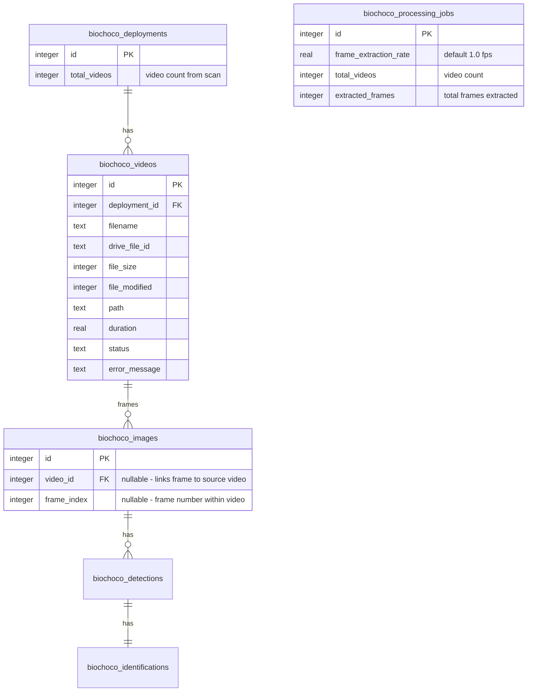

# Camera Trap Video Processing

## Overview

Add support for processing camera trap videos alongside images. Videos (~50/50 mix with images) are short motion-triggered clips (5-30s) in the same Google Drive deployment folders. Frames are extracted with ffmpeg at a configurable rate (default 1fps) and fed into the unchanged ML pipeline. Results are grouped by source video in the UI.

## Approach

**Pre-extract frames with ffmpeg, feed as images to unchanged ML pipeline.** The Python model server, ML runner, detection storage, and verification workflow require zero changes — extracted frames are just JPEG images with file paths.

New work concentrates in:
1. Schema additions (videos table + frame linking columns)
2. Drive scanning (detect video files)
3. Video download + frame extraction (new module)
4. Processing orchestration (extraction phase between download and ML)
5. UI (frame rate config + video grouping in results)

## Schema Changes

### New table: `biochoco_videos`



### Columns added to existing tables

**`biochoco_images`:**
- `video_id INTEGER REFERENCES biochoco_videos(id) ON DELETE CASCADE` — nullable, links extracted frame to its source video
- `frame_index INTEGER` — nullable, 0-based frame number within the video

**`biochoco_processing_jobs`:**
- `frame_extraction_rate REAL DEFAULT 1.0` — frames per second for extraction
- `total_videos INTEGER DEFAULT 0` — number of videos in the job
- `extracted_frames INTEGER DEFAULT 0` — total frames extracted from all videos

**`biochoco_deployments`:**
- `total_videos INTEGER DEFAULT 0` — number of video files discovered during scan

### Migration (in `scripts/push-schema.mjs`)

```javascript
// New table
`CREATE TABLE IF NOT EXISTS biochoco_videos (
  id INTEGER PRIMARY KEY AUTOINCREMENT,
  deployment_id INTEGER NOT NULL REFERENCES biochoco_deployments(id) ON DELETE CASCADE,
  filename TEXT NOT NULL,
  drive_file_id TEXT,
  file_size INTEGER,
  file_modified INTEGER,
  path TEXT,
  duration REAL,
  status TEXT NOT NULL DEFAULT 'pending',
  error_message TEXT
)`,
`CREATE UNIQUE INDEX IF NOT EXISTS biochoco_videos_deployment_drive_idx ON biochoco_videos(deployment_id, drive_file_id)`,
`CREATE INDEX IF NOT EXISTS biochoco_videos_deployment_idx ON biochoco_videos(deployment_id)`,

// ALTER TABLE migrations for existing tables
`ALTER TABLE biochoco_images ADD COLUMN video_id INTEGER REFERENCES biochoco_videos(id) ON DELETE CASCADE`,
`ALTER TABLE biochoco_images ADD COLUMN frame_index INTEGER`,
`ALTER TABLE biochoco_processing_jobs ADD COLUMN frame_extraction_rate REAL DEFAULT 1.0`,
`ALTER TABLE biochoco_processing_jobs ADD COLUMN total_videos INTEGER DEFAULT 0`,
`ALTER TABLE biochoco_processing_jobs ADD COLUMN extracted_frames INTEGER DEFAULT 0`,
`ALTER TABLE biochoco_deployments ADD COLUMN total_videos INTEGER DEFAULT 0`,
```

> **Gotcha**: `CREATE TABLE IF NOT EXISTS` is a no-op on existing databases for adding columns. All new columns on existing tables MUST use `ALTER TABLE ADD COLUMN` in the migrations array (per `docs/solutions/database-issues/missing-alter-table-migrations-push-schema.md`).

## Implementation Phases

### Phase 1: Schema + Drive Scanning

**Goal**: Videos are discovered during sync and stored in the database.

#### 1.1 Schema changes

**`src/db/schema.ts`** — Add `biochoco_videos` table definition and new columns:

```typescript
// New table
export const videos = sqliteTable("biochoco_videos", {
  id: integer("id").primaryKey({ autoIncrement: true }),
  deploymentId: integer("deployment_id").notNull().references(() => deployments.id, { onDelete: "cascade" }),
  filename: text("filename").notNull(),
  driveFileId: text("drive_file_id"),
  fileSize: integer("file_size"),
  fileModified: integer("file_modified", { mode: "timestamp" }),
  path: text("path"),
  duration: real("duration"),
  status: text("status", { enum: ["pending", "processed", "failed"] }).notNull().default("pending"),
  errorMessage: text("error_message"),
});

// Add to biochoco_images:
//   videoId: integer("video_id").references(() => videos.id, { onDelete: "cascade" }),
//   frameIndex: integer("frame_index"),

// Add to processingJobs:
//   frameExtractionRate: real("frame_extraction_rate").default(1.0),
//   totalVideos: integer("total_videos").default(0),
//   extractedFrames: integer("extracted_frames").default(0),

// Add to deployments:
//   totalVideos: integer("total_videos").default(0),
```

**`scripts/push-schema.mjs`** — Add migrations (see Migration section above).

#### 1.2 Drive scanning for videos

**`src/lib/drive-client.ts`** — Extend file discovery:

```typescript
const VIDEO_EXTENSIONS = new Set([".mp4", ".avi", ".mov"]);

// In listImagesRecursive() (rename to listMediaRecursive()):
// Add a parallel branch for video MIME types
} else if (file.mimeType?.startsWith("video/")) {
  const ext = path.extname(file.name).toLowerCase();
  if (VIDEO_EXTENSIONS.has(ext)) {
    videoFiles.push({ id, name, size, modifiedTime, relativePath });
  }
}
```

Return type becomes `{ images: DriveImageFile[], videos: DriveVideoFile[] }` (or rename to `DriveMediaFile` with a `type` discriminator).

**`src/app/camera-trap/drive-actions.ts`** — Update `scanDeploymentImages()`:
- Call the extended listing function
- Insert video rows into `biochoco_videos` with `onConflictDoNothing` on `(deploymentId, driveFileId)`
- Update `deployments.totalVideos` alongside `totalImages`

#### 1.3 UI: Show video count on deployment cards

Update the deployments table/cards to show "X imagenes, Y videos" instead of just "X imagenes".

---

### Phase 2: Video Download + Frame Extraction

**Goal**: Videos are downloaded from Drive and frames are extracted with ffmpeg.

#### 2.1 Install ffmpeg in Docker

**`Dockerfile`** — Add `ffmpeg` to both dev and runner `apt-get install` lines:

```dockerfile
# Dev stage (line ~12)
RUN apt-get update && apt-get install -y --no-install-recommends \
    python3-venv curl libgl1 libglib2.0-0 ffmpeg \
    && rm -rf /var/lib/apt/lists/*

# Runner stage (line ~32)
RUN apt-get update && apt-get install -y --no-install-recommends \
    python3 python3-venv curl wget libgl1 libglib2.0-0 cron ffmpeg \
    && rm -rf /var/lib/apt/lists/*
```

For local dev on macOS: `brew install ffmpeg`.

#### 2.2 Frame extraction module

**New file: `src/lib/frame-extractor.ts`**

Core function:

```typescript
interface FrameExtractionResult {
  videoId: number;
  frames: { path: string; index: number }[];
  duration: number;  // seconds, from ffprobe
  error?: string;
}

export async function extractFrames(
  videoPath: string,
  outputDir: string,
  fps: number,           // e.g. 1.0 = 1 frame/sec, 0.5 = 1 frame every 2 sec
  maxFrames?: number,     // cap, default 300
): Promise<FrameExtractionResult>
```

Implementation:
1. Run `ffprobe` to get video duration and validate the file
2. Run `ffmpeg -i {videoPath} -vf "fps={fps}" -q:v 2 {outputDir}/{videoFilename}_f%04d.jpg`
3. Collect output frame paths
4. Cap at `maxFrames` (default 300 = 5 min at 1fps)
5. Return frame paths and metadata

Error handling:
- If ffprobe fails → video is corrupt, return error
- If ffmpeg fails mid-extraction → return whatever frames were extracted + error
- Spawn ffmpeg as child process of Node.js so it's killed on parent exit

The ffmpeg subprocess PID should be trackable for cancellation.

#### 2.3 Video download in drive-downloader

**`src/lib/drive-downloader.ts`** — Extend `downloadDeploymentForProcessing()`:

- Query `biochoco_videos` for the deployment (in addition to images)
- Download video files to `data/cache/ct-images/{deploymentId}/` (same cache dir)
- Write cache path into `videos.path`
- After download, optionally delete the original video file after frame extraction to save cache space (configurable — start with keeping it)

---

### Phase 3: Processing Pipeline Integration

**Goal**: Frame extraction runs between download and ML, extracted frames flow through the existing pipeline.

#### 3.1 Update `processJobInternal()` in `src/app/camera-trap/actions.ts`

Add a frame extraction phase between download and ML:

```
1. Download images from Drive              (existing)
2. Download videos from Drive              (new)
3. Extract frames from videos with ffmpeg  (new)
4. Create image rows for extracted frames   (new)
5. Update job totalImages to include frames (new)
6. Check ML availability                   (existing)
7. Run ML predictions on all image paths    (existing - no changes)
```

Frame extraction step:
- For each video in the deployment:
  - Call `extractFrames(video.path, cacheDir, job.frameExtractionRate)`
  - Insert `biochoco_images` rows for each extracted frame with `videoId` and `frameIndex`
  - Generate thumbnails for each frame with `sharp` (same as images)
  - Mark video as `processed` or `failed`
  - Update progress: "Extrayendo cuadros de video... (X de Y)"
- After all videos: update job `extractedFrames` count, recalculate `totalImages`

#### 3.2 Update `createProcessingJob()`

- Accept `frameExtractionRate` in the model config parameter
- Store it on the `processingJobs` row
- Count videos separately: set `totalVideos` from the deployment's video count

#### 3.3 Progress UI messages

Add Spanish status messages for the new phases:

```typescript
"Descargando videos de Drive... ({current} de {total})"
"Extrayendo cuadros de video... ({current} de {total})"
```

#### 3.4 Cancellation

- Track the ffmpeg child process PID
- In `cancelJob()`, if a frame extraction is running, kill the ffmpeg process
- Clean up any partially-extracted frames

---

### Phase 4: Results UI

**Goal**: Video frames are distinguishable from standalone images and grouped by source video.

#### 4.1 Frame rate config in processing UI

Add a simple control to the "Procesar" button/dialog for setting the frame extraction rate. Default 1fps. Options: 1 frame/second, 1 frame/2 seconds, 1 frame/5 seconds (or a numeric input).

Only show this control when the deployment has videos (`totalVideos > 0`).

#### 4.2 Results grid grouping

In the job results page (`src/app/camera-trap/results/[id]/`):
- Query videos for the job alongside images
- Group images by `videoId` (null = standalone image)
- Render standalone images first, then each video group with a header: "📹 {filename} ({frameCount} cuadros)"
- Frames within a group shown in `frameIndex` order

Keep it simple — flat grid with section headers, no accordion/collapse for now.

#### 4.3 Image detail page context

When viewing a video frame in the detail page:
- Show "Cuadro {frameIndex} de {videoFilename}" in the header
- Prev/next navigation stays global (all images in job), not scoped to video

## Edge Cases and Error Handling

| Scenario | Behavior |
|----------|----------|
| Corrupt video (ffmpeg fails) | Mark video as `failed` with error message. Continue processing other files. Job can still complete. |
| Deployment with only videos, no images | Works — after frame extraction, image rows exist and flow through ML normally. |
| Very long video (10+ min) | Cap at 300 extracted frames. Log a warning. |
| Re-processing with same frame rate | Extracted frame files already in cache — ffmpeg skips or overwrites. New image/detection rows created for new job. |
| Re-processing with different frame rate | New set of frames extracted. Old frame image rows belong to old job (preserved). |
| Re-scan of deployment | Videos table uses `onConflictDoNothing` on `(deploymentId, driveFileId)`. Existing video rows untouched. Frame rows are processing artifacts, not touched by scan. |
| Video with unsupported codec | ffprobe check fails → video marked as `failed` with descriptive error. |
| Cancel during frame extraction | Kill ffmpeg subprocess. Clean up partial frames. Mark job as cancelled. |
| Cache eviction | Videos + frames in same cache dir. Evicted together with deployment. Re-download + re-extract needed on next process. |

## Files to Create or Modify

### New files
- `src/lib/frame-extractor.ts` — ffmpeg wrapper for frame extraction
- `src/lib/video-constants.ts` — video extensions, max frames cap, default FPS (or add to existing constants)

### Modified files
- `src/db/schema.ts` — add `biochoco_videos` table + new columns on images/jobs/deployments
- `scripts/push-schema.mjs` — add CREATE TABLE + ALTER TABLE migrations
- `src/lib/drive-client.ts` — extend listing to detect videos, add VIDEO_EXTENSIONS
- `src/app/camera-trap/drive-actions.ts` — insert video rows during scan, update totalVideos
- `src/lib/drive-downloader.ts` — download video files to cache
- `src/app/camera-trap/actions.ts` — frame extraction phase in processJobInternal(), frameExtractionRate in createProcessingJob()
- `src/app/camera-trap/results/[id]/page.tsx` — query videos, pass grouping data
- `src/app/camera-trap/results/[id]/results-client.tsx` — render grouped grid with video headers
- `src/app/camera-trap/results/[id]/images/[imageId]/image-detail-client.tsx` — show frame context
- `Dockerfile` — add ffmpeg to apt-get install
- Deployment cards/table — show video count

### Unchanged (by design)
- `scripts/model-server.py` — no changes, receives image paths
- `scripts/predict.py` — no changes
- `src/lib/ml-runner.ts` — no changes, sends image paths
- `src/components/image-grid.tsx` — works as-is for frame thumbnails
- `src/components/bbox-overlay.tsx` — works as-is
- `src/components/annotation-toolbar.tsx` — works as-is
- `src/app/api/ct-images/[id]/route.ts` — works as-is for frame images

## Out of Scope (MVP)

- Video playback in the results UI
- Video-level aggregated summaries (species counts, best frame selection)
- Audio analysis from videos
- Streaming video from Drive without downloading
- Export format changes for video metadata

## References

- Brainstorm: `docs/brainstorms/2026-02-14-camera-trap-video-processing-brainstorm.md`
- PytorchWildlife video demo: https://cameratraps.readthedocs.io/en/latest/demo/video_detection_demo.html
- Institutional learning (schema migrations): `docs/solutions/database-issues/missing-alter-table-migrations-push-schema.md`
- Institutional learning (Docker ML setup): `docs/solutions/build-errors/pytorchwildlife-docker-install-failures.md`
