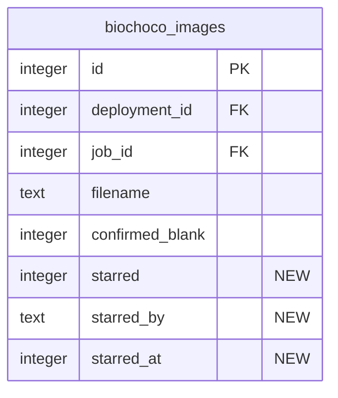

# Camera Trap Image Favorites/Starring

## Overview

Add ability to star/favorite standout camera trap images for curation — collecting the best wildlife photos for reports, presentations, social media, and outreach. Stars are shared across the team with attribution. Users can browse starred images within a job's results or across all deployments via a dedicated gallery page.

## Motivation

FCAT staff reviewing thousands of camera trap detections occasionally encounter exceptional wildlife photos. Currently there's no way to flag these for later use. Staff resort to screenshots or manual note-taking, which is error-prone and disconnects the photo from its metadata (species, location, date).

## Proposed Solution

Add a boolean flag on `biochoco_images` following the established `confirmedBlank` pattern: three new columns (`starred`, `starred_by`, `starred_at`), a server action toggle, and UI in the annotation view. Add a filter in the job results sidebar and a new cross-deployment gallery page.

## Design Decisions

| Decision | Choice | Rationale |
|----------|--------|-----------|
| Data model | Boolean flag on `biochoco_images` | Matches `confirmedBlank` pattern; simplest approach |
| Attribution | `starred_by` (email) + `starred_at` (timestamp) | Shows who starred; single-attribution is fine for small team |
| Where to star | Annotation view only | Where users are already reviewing individual images |
| Who can star/un-star | Editors only | Consistent with `confirmedBlank` permission model |
| Star badge position | Top-left corner of grid cards | Avoids conflict with existing top-right badges |
| Keyboard shortcut | `s` key | Intuitive, available, matches annotation workflow |
| starred vs confirmedBlank | Independent (both allowed) | Trust user judgment; no auto-clearing |
| Favorites gallery pagination | Load all (client-side) initially | Starred images are a small subset; matches existing results pattern |
| Activity log | No | `starred_by`/`starred_at` provide sufficient attribution |
| Camtrap DP export | Out of scope | Follow-up feature if needed |

## Schema Changes

### New columns on `biochoco_images`

```typescript
// src/db/schema.ts — add after confirmedBlank (line ~196)
starred: integer("starred", { mode: "boolean" }).notNull().default(false),
starredBy: text("starred_by"),  // email of user who starred
starredAt: integer("starred_at", { mode: "timestamp" }),  // when starred
```

### Migration in `scripts/push-schema.mjs`

```javascript
// Add to migrations array
`ALTER TABLE biochoco_images ADD COLUMN starred INTEGER NOT NULL DEFAULT 0`,
`ALTER TABLE biochoco_images ADD COLUMN starred_by TEXT`,
`ALTER TABLE biochoco_images ADD COLUMN starred_at INTEGER`,
```

### Index for favorites gallery query

```javascript
// Add to migrations array
`CREATE INDEX IF NOT EXISTS idx_biochoco_images_starred ON biochoco_images(starred) WHERE starred = 1`,
```



## Implementation Phases

### Phase 1: Schema + Server Action

**Files:**
- `src/db/schema.ts` — add 3 columns to `images` table
- `scripts/push-schema.mjs` — add ALTER TABLE migrations + index
- `src/app/camera-trap/actions.ts` — add `toggleStarred(imageId)` action

`toggleStarred` server action:

```typescript
// src/app/camera-trap/actions.ts
export async function toggleStarred(
  imageId: number
): Promise<ActionResult<{ starred: boolean }>> {
  const user = await requirePermission("camera-trap", "editor");

  // Fetch current state
  const [image] = await db
    .select({ id: images.id, starred: images.starred })
    .from(images)
    .where(eq(images.id, imageId));

  if (!image) {
    return { success: false, error: "Imagen no encontrada" };
  }

  const newValue = !image.starred;
  await db
    .update(images)
    .set({
      starred: newValue,
      starredBy: newValue ? user.email : null,
      starredAt: newValue ? new Date() : null,
    })
    .where(eq(images.id, imageId));

  revalidatePath(CAMERA_TRAP_PATH);
  return { success: true, data: { starred: newValue } };
}
```

### Phase 2: Annotation View Star Toggle

**Files:**
- `src/app/camera-trap/results/[id]/images/[imageId]/page.tsx` — pass `starred`, `starredBy` props
- `src/app/camera-trap/results/[id]/images/[imageId]/image-annotation-client.tsx` — add star toggle button with `useOptimistic`
- `src/hooks/use-annotation-shortcuts.ts` — add `s` keyboard shortcut

Star toggle placement: In the header area of the annotation view, next to the image filename and navigation arrows. A star icon (from Lucide: `Star` filled when active, outline when not) with "Destacada por [email]" tooltip when starred.

```tsx
// In image-annotation-client.tsx
const [isStarred, setOptimisticStarred] = useOptimistic(starred);

const handleToggleStarred = useCallback(() => {
  setOptimisticStarred(!isStarred);
  startTransition(async () => {
    await toggleStarred(imageId);
    router.refresh();
  });
}, [imageId, isStarred, router]);
```

### Phase 3: Image Grid Star Badge + Results Filter

**Files:**
- `src/components/image-grid.tsx` — add `starred?: boolean` to `ImageGridItem`, render star icon in top-left corner of `ImageCard`
- `src/app/camera-trap/results/[id]/page.tsx` — add `starred: img.starred ?? false` to `gridImages` mapping
- `src/app/camera-trap/results/[id]/results-client.tsx` — add "Solo destacadas" checkbox filter

Star badge in grid: Small filled star icon (`Star` from Lucide) at `absolute top-2 left-2 z-10` with yellow/amber color. Always visible (not hover-only). Independent of the existing top-right badge if/else chain.

Filter: New checkbox below the existing "Mostrar imagenes sin detecciones" toggle:

```tsx
<label className="flex items-center gap-2 text-sm cursor-pointer">
  <input
    type="checkbox"
    checked={showStarredOnly}
    onChange={(e) => setShowStarredOnly(e.target.checked)}
    className="accent-primary"
  />
  Solo destacadas
</label>
```

Filter logic (AND with existing filters):
```typescript
if (showStarredOnly && !img.starred) return false;
```

### Phase 4: Cross-Deployment Favorites Gallery

**Files:**
- `src/app/camera-trap/favorites/page.tsx` — new Server Component
- `src/app/camera-trap/actions.ts` — add `getStarredImages()` query function
- `src/components/sidebar-nav.tsx` — add "Destacadas" nav item

**Gallery page** (`/camera-trap/favorites`):
- Server Component with `requirePermission("camera-trap", "viewer")`
- Queries all images where `starred = true`, joined with deployments (for name/site) and detections+identifications (for species)
- Reuses `ImageGrid` component
- Shows deployment name, species, "Destacada por [email]" and date
- Sorted by `starredAt` descending (most recently starred first)
- Empty state: "No hay imagenes destacadas. Marca tus fotos favoritas desde la vista de anotacion."
- Clicking an image navigates to its annotation page (`/camera-trap/results/[jobId]/images/[imageId]`) — images without a `jobId` (deleted job) show the thumbnail but link is disabled with a tooltip "El trabajo de procesamiento fue eliminado"

**Sidebar nav entry**: Add `{ label: "Destacadas", href: "/camera-trap/favorites" }` after "Resultados" in the camera trap children. Visible to all roles (viewers can browse).

**`getStarredImages` query:**

```typescript
// src/app/camera-trap/actions.ts
export async function getStarredImages() {
  await requirePermission("camera-trap", "viewer");

  return db
    .select({
      id: images.id,
      filename: images.filename,
      path: images.path,
      thumbnailPath: images.thumbnailPath,
      starred: images.starred,
      starredBy: images.starredBy,
      starredAt: images.starredAt,
      jobId: images.jobId,
      deploymentId: images.deploymentId,
      deploymentName: deployments.name,
      siteName: deployments.siteName,
    })
    .from(images)
    .innerJoin(deployments, eq(images.deploymentId, deployments.id))
    .where(eq(images.starred, true))
    .orderBy(desc(images.starredAt));
}
```

## Acceptance Criteria

- [x] `starred`, `starred_by`, `starred_at` columns added to `biochoco_images` with migration
- [x] Partial index on `starred` column for gallery query performance
- [x] `toggleStarred` server action with editor permission check
- [x] Star toggle button in annotation view header with `useOptimistic` instant feedback
- [x] `s` keyboard shortcut toggles star in annotation view
- [x] Filled star badge (amber) on top-left of image cards in grid when starred
- [x] "Solo destacadas" checkbox filter in job results sidebar (AND logic with existing filters)
- [x] `/camera-trap/favorites` gallery page showing all starred images across deployments
- [x] "Destacadas" sidebar nav entry visible to all roles
- [x] Empty state on favorites page with guidance message
- [x] Images with deleted jobs shown in gallery but with disabled link
- [x] Schema migration is idempotent (safe to run multiple times)

## References

- Brainstorm: `docs/brainstorms/2026-02-18-camera-trap-favorite-images-brainstorm.md`
- `confirmedBlank` pattern: `src/db/schema.ts:194-196`, `src/app/camera-trap/actions.ts:2576-2642`
- Image grid badges: `src/components/image-grid.tsx:161-179`
- Results filter sidebar: `src/app/camera-trap/results/[id]/results-client.tsx:30-69`
- Annotation view: `src/app/camera-trap/results/[id]/images/[imageId]/image-annotation-client.tsx`
- Keyboard shortcuts: `src/hooks/use-annotation-shortcuts.ts`
- Sidebar nav: `src/components/sidebar-nav.tsx:129-142`
- Migration gotcha: `docs/solutions/database-issues/missing-alter-table-migrations-push-schema.md`
