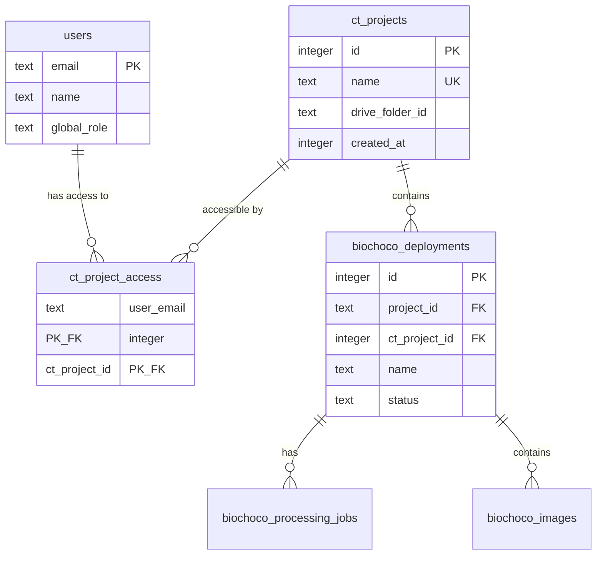

# Camera Trap Project-Level Permissions

## Overview

Scope camera trap data access by project. Instead of all-or-nothing access to the entire camera trap module, users are assigned to specific camera trap projects (e.g., "Canande", "BioChoco") and only see deployments, results, images, and favorites belonging to their assigned projects. Users keep one camera-trap role (viewer/editor/admin) that applies uniformly across all their assigned projects.

Each camera trap project gets its own Google Drive root folder. When a collaborator uploads to that folder and syncs, deployments are automatically assigned to the correct project — no manual selection needed.

## Problem Statement

Currently, any user with `viewer` on `"camera-trap"` sees ALL deployments, ALL results, ALL images. The `projectLabel` field on deployments is purely cosmetic — used for a filter dropdown but not a permission boundary. As the system grows with more collaborators working on different geographic areas, users need scoped access to only their relevant data.

## Proposed Solution

1. Create a `cameraTrapProjects` table with name + Google Drive folder ID per project
2. Create a `cameraTrapProjectAccess` join table linking users to camera trap projects
3. Migrate `deployments.projectLabel` to a proper FK `cameraTrapProjectId`
4. Make Drive sync per-project (each project scans its own Drive folder)
5. Add a centralized `getUserCameraTrapProjects()` helper
6. Filter ALL read queries and validate ALL write mutations by user's accessible projects
7. Extend the `/admin` page with camera trap project management + user assignment UI
8. Update BioChoco module to use CT project's `driveFolderId` instead of the global env var

## Technical Approach

### Schema Changes

#### New tables in `src/db/schema.ts`

```typescript
// Camera trap project entities (formalized from projectLabel)
export const cameraTrapProjects = sqliteTable("ct_projects", {
  id: integer("id").primaryKey({ autoIncrement: true }),
  name: text("name").notNull().unique(),
  driveFolderId: text("drive_folder_id"),  // Google Drive root folder for this project
  createdAt: integer("created_at", { mode: "timestamp" })
    .notNull()
    .default(sql`(unixepoch())`),
});

// User access to camera trap projects
export const cameraTrapProjectAccess = sqliteTable("ct_project_access", {
  userEmail: text("user_email")
    .notNull()
    .references(() => users.email, { onDelete: "cascade" }),
  cameraTrapProjectId: integer("ct_project_id")
    .notNull()
    .references(() => cameraTrapProjects.id, { onDelete: "cascade" }),
}, (table) => [
  primaryKey({ columns: [table.userEmail, table.cameraTrapProjectId] }),
]);
```

#### Deployment table change

```typescript
// Add FK to camera trap project (alongside existing projectLabel for rollback safety)
cameraTrapProjectId: integer("ct_project_id")
  .references(() => cameraTrapProjects.id, { onDelete: "set null" }),
```

Keep the old `projectLabel` column temporarily for rollback safety. Remove in a follow-up after confirming production stability.

#### ERD



### Authorization Pattern

#### New helper: `src/lib/camera-trap-auth.ts`

```typescript
/**
 * Returns array of camera trap project IDs the user can access,
 * or "all" for super admins (bypass filtering).
 */
export async function getUserCameraTrapProjects(
  user: AuthUser
): Promise<number[] | "all"> {
  if (user.globalRole === "super_admin") return "all";
  const rows = await db
    .select({ id: cameraTrapProjectAccess.cameraTrapProjectId })
    .from(cameraTrapProjectAccess)
    .where(eq(cameraTrapProjectAccess.userEmail, user.email));
  return rows.map((r) => r.id);
}

/**
 * Verify user has access to a specific deployment's project.
 * Used by mutation actions that take an entity ID.
 */
export async function requireDeploymentAccess(
  user: AuthUser,
  deploymentId: number
): Promise<void> {
  if (user.globalRole === "super_admin") return;
  const deployment = await db
    .select({ ctProjectId: deployments.cameraTrapProjectId })
    .from(deployments)
    .where(eq(deployments.id, deploymentId))
    .get();
  if (!deployment) throw new Error("Instalación no encontrada");
  const projects = await getUserCameraTrapProjects(user);
  if (projects === "all") return;
  if (!deployment.ctProjectId || !projects.includes(deployment.ctProjectId)) {
    throw new Error("No tienes acceso a este proyecto");
  }
}
```

#### Query filter helper

```typescript
/**
 * Build a WHERE clause for filtering deployments by user's projects.
 * Returns undefined for super admins (no filter).
 */
export function projectFilter(
  projects: number[] | "all"
): SQL | undefined {
  if (projects === "all") return undefined;
  if (projects.length === 0) return sql`1 = 0`; // no access → no results
  return inArray(deployments.cameraTrapProjectId, projects);
}
```

### Drive Sync: Per-Project Folder Mapping

#### Current behavior
- Single `CAMERA_TRAP_ROOT_FOLDER_ID` env var
- `syncWithDrive()` scans this one root folder, creates deployments with `projectLabel: null`
- BioChoco `createSingleDriveFolder()` also uses this root, sets `projectLabel: "BioChoco"`

#### New behavior
- Each `cameraTrapProject` has a `driveFolderId` column storing its own Drive root folder
- The existing `CAMERA_TRAP_ROOT_FOLDER_ID` env var becomes the "General" project's `driveFolderId` (set during migration)
- `syncWithDrive(cameraTrapProjectId)` scans only that project's Drive folder
- Deployments auto-inherit `cameraTrapProjectId` from the sync context — no manual selection needed
- BioChoco `createSingleDriveFolder()` reads the "BioChoco" CT project's `driveFolderId` instead of the env var

#### Collaborator onboarding workflow
1. Admin creates CT project "Canande" with a new Google Drive folder
2. Admin shares the Drive folder link with the collaborator
3. Admin assigns the collaborator to the "Canande" CT project with editor role
4. Collaborator uploads camera trap folders to the shared Drive folder
5. Collaborator clicks "Sincronizar con Drive" → system scans only "Canande"'s folder → deployments auto-assigned
6. Collaborator only sees their own data throughout the system

### Implementation Phases

#### Phase 1: Schema + Migration + Auth Helper

**Files:** `src/db/schema.ts`, `scripts/push-schema.mjs`, `src/lib/camera-trap-auth.ts`

**Tasks:**

- [x] Add `cameraTrapProjects` table to `src/db/schema.ts` (with `driveFolderId` column)
- [x] Add `cameraTrapProjectAccess` table to `src/db/schema.ts`
- [x] Add `cameraTrapProjectId` column to `deployments` table in schema
- [x] Add migration to `scripts/push-schema.mjs`:
  - `CREATE TABLE IF NOT EXISTS ct_projects` (with `drive_folder_id TEXT`)
  - `CREATE TABLE IF NOT EXISTS ct_project_access`
  - `ALTER TABLE biochoco_deployments ADD COLUMN ct_project_id INTEGER REFERENCES ct_projects(id) ON DELETE SET NULL`
  - Data migration: INSERT distinct `projectLabel` values into `ct_projects`
  - Data migration: INSERT a "General" project with `drive_folder_id` = current `CAMERA_TRAP_ROOT_FOLDER_ID` env var value
  - Data migration: UPDATE deployments SET `ct_project_id` = matching `ct_projects.id` WHERE `project_label` IS NOT NULL
  - Data migration: UPDATE deployments SET `ct_project_id` = General project id WHERE `ct_project_id` IS NULL
  - Bootstrap: INSERT into `ct_project_access` all current camera-trap users → all existing ct_projects
- [x] Create `src/lib/camera-trap-auth.ts` with `getUserCameraTrapProjects()`, `requireDeploymentAccess()`, `projectFilter()`, and entity resolution helpers
- [x] Write tests for the auth helpers

**Migration SQL for `push-schema.mjs`:**

```javascript
// Table creation
`CREATE TABLE IF NOT EXISTS ct_projects (
  id INTEGER PRIMARY KEY AUTOINCREMENT,
  name TEXT NOT NULL UNIQUE,
  drive_folder_id TEXT,
  created_at INTEGER NOT NULL DEFAULT (unixepoch())
)`,
`CREATE TABLE IF NOT EXISTS ct_project_access (
  user_email TEXT NOT NULL REFERENCES users(email) ON DELETE CASCADE,
  ct_project_id INTEGER NOT NULL REFERENCES ct_projects(id) ON DELETE CASCADE,
  PRIMARY KEY (user_email, ct_project_id)
)`,
`ALTER TABLE biochoco_deployments ADD COLUMN ct_project_id INTEGER REFERENCES ct_projects(id) ON DELETE SET NULL`,

// Data migration (idempotent, run in the seeding section):
// 1. INSERT OR IGNORE each distinct projectLabel as a ct_project
// 2. INSERT OR IGNORE "General" ct_project (with drive_folder_id from env var)
// 3. UPDATE biochoco_deployments SET ct_project_id = (SELECT id FROM ct_projects WHERE name = project_label) WHERE project_label IS NOT NULL AND ct_project_id IS NULL
// 4. UPDATE biochoco_deployments SET ct_project_id = (SELECT id FROM ct_projects WHERE name = 'General') WHERE ct_project_id IS NULL
// 5. For each user with camera-trap permission: INSERT OR IGNORE ct_project_access rows for all ct_projects
```

**Critical:** Per learnings from `docs/solutions/database-issues/missing-alter-table-migrations-push-schema.md`, always add ALTER TABLE migrations for new columns. Test on existing DB, not just fresh.

**Entity resolution helpers in `src/lib/camera-trap-auth.ts`:**

```typescript
// Resolve entity → deploymentId for deep authorization chains
async function getDeploymentIdForImage(imageId: number): Promise<number | null>
async function getDeploymentIdForDetection(detectionId: number): Promise<number | null>
async function getDeploymentIdForIdentification(identificationId: number): Promise<number | null>
```

#### Phase 2: Filter Read Queries (Server Actions)

**File:** `src/app/camera-trap/actions.ts`

Update all read actions to filter by user's camera trap projects.

**Actions needing project filtering (join through deployment):**

| Action | Line | Filter strategy |
|--------|------|----------------|
| `getDeploymentsWithStats()` | ~942 | Add `AND cameraTrapProjectId IN (...)` to main query |
| `getDeployments()` | ~1075 | Same filter |
| `getDeployment(id)` | ~1536 | Verify deployment's project is in user's list |
| `getDistinctProjects()` | ~1523 | Replace: query `ct_projects` filtered by user's access |
| `getRecentJobs()` | ~1560 | Join jobs → deployments, filter by project |
| `getResultsStats()` | ~1627 | Scope aggregates to accessible deployments |
| `getJobWithDetails()` | ~varies | Verify job's deployment project is accessible |
| `getImageWithDetections()` | ~1676 | Verify image's deployment project is accessible |
| `getJobImageIds()` | ~varies | Filter through deployment |
| `getJobSpecies()` | ~varies | Filter through deployment → images → detections |
| `getJobVerificationStats()` | ~varies | Filter through deployment |
| `getDeploymentVerificationStats()` | ~varies | Verify deployment access |
| `getStarredImages()` | ~2690 | Join images → deployments, filter by project |
| `getJobDeleteStats()` | ~varies | Verify deployment access |
| `getDeploymentsCascadeStats()` | ~varies | Verify all deployments accessible |

**Actions that stay unfiltered (shared data):**

| Action | Reason |
|--------|--------|
| `getSpeciesList()` | Species are shared across all projects |
| `getMLStatus()` | System-level status, no project data |
| `getRecentSpecies()` | Shared reference data |
| `getSpeciesUsageCount()` | Shared reference data |

**Pattern for single-entity access checks:**

```typescript
// Example: getJobWithDetails(jobId)
const user = await requirePermission("camera-trap", "viewer");
const job = await db.select().from(processingJobs).where(eq(processingJobs.id, jobId)).get();
if (!job) return { success: false, error: "Trabajo no encontrado" };
await requireDeploymentAccess(user, job.deploymentId);
```

#### Phase 3: Guard Write/Mutation Actions

**File:** `src/app/camera-trap/actions.ts`

Add object-level authorization to all write actions. Each mutation that takes an entity ID must verify the entity belongs to an accessible project.

**Actions needing object-level auth:**

| Action | Entity traversal |
|--------|-----------------|
| `createProcessingJob(deploymentId)` | deployment → project |
| `processJob(jobId)` | job → deployment → project |
| `cancelJob(jobId)` | job → deployment → project |
| `deleteJob(jobId)` | job → deployment → project |
| `deleteJobs(jobIds)` | jobs → deployments → projects |
| `updateDeploymentMetadata(id)` | deployment → project |
| `bulkUpdateMetadata(ids)` | deployments → projects |
| `deleteDeployments(ids)` | deployments → projects |
| `markVerifiedEmpty(id)` | deployment → project |
| `undoVerifiedEmpty(id)` | deployment → project |
| `queueProcessing(deploymentIds)` | deployments → projects |
| `verifyIdentification(id)` | identification → detection → image → deployment → project |
| `rejectIdentification(id)` | same chain |
| `correctIdentification(id)` | same chain |
| `bulkVerify(jobId)` | job → deployment → project |
| `bulkVerifyByThreshold(jobId)` | job → deployment → project |
| `deleteDetection(id)` | detection → image → deployment → project |
| `assignSpecies(detectionId)` | detection → image → deployment → project |
| `createManualDetection(imageId)` | image → deployment → project |
| `verifyAndAdvance(imageId)` | image → deployment → project |
| `toggleConfirmedBlank(imageId)` | image → deployment → project |
| `toggleStarred(imageId)` | image → deployment → project |

**Species CRUD actions stay unguarded** (shared across projects):
- `createSpecies()`, `updateSpecies()`, `deleteSpecies()` — require `editor` role only

#### Phase 4: Drive Sync + BioChoco Integration

**Files:** `src/app/camera-trap/drive-actions.ts`, `src/app/biochoco/data/drive-folder-actions.ts`

**Camera trap Drive sync changes:**

- [ ] Update `syncWithDrive()` to accept `cameraTrapProjectId` parameter
- [ ] Look up CT project's `driveFolderId` from DB instead of reading `CAMERA_TRAP_ROOT_FOLDER_ID` env var
- [ ] Set `cameraTrapProjectId` on newly created deployments
- [ ] Update `scanDeploymentImages()` to verify deployment access
- [ ] Update Drive scan UI: if user has 1 project, auto-select; if multiple, show project dropdown before syncing

**BioChoco integration changes:**

- [ ] Update `createSingleDriveFolder()` in `drive-folder-actions.ts` (line ~193):
  - Instead of reading `CAMERA_TRAP_ROOT_FOLDER_ID`, look up the "BioChoco" CT project's `driveFolderId` from DB
  - Set `cameraTrapProjectId` on created deployment instead of `projectLabel: "BioChoco"`
- [ ] Update `recreateDriveFolder()` (line ~287): same change — read folder ID from CT project
- [ ] Update `getMissingDriveFolders()` (line ~125): scope query to BioChoco CT project's deployments
- [ ] Remove hardcoded `projectLabel: "BioChoco"` references

**Fallback:** If a CT project has no `driveFolderId` set, show an error "Este proyecto no tiene una carpeta de Drive configurada. Contacta al administrador."

#### Phase 5: API Routes + Image Proxy

**Files:** `src/app/api/camera-trap/export/route.ts`, `src/app/api/ct-images/[id]/route.ts`

- [x] Update `/api/camera-trap/export/route.ts`: validate each requested deployment ID belongs to an accessible project
- [x] Update `/api/ct-images/[id]/route.ts`: resolve image → deployment → project, verify access
- [x] Update ODK actions (`odk-actions.ts`): scope `matchOdkDeployments()` to accessible deployments

#### Phase 6: Admin UI

**Files:** `src/app/admin/actions.ts`, `src/app/admin/admin-client.tsx`, `src/app/admin/page.tsx`

Extend the existing `/admin` page with camera trap project management.

**New admin actions in `src/app/admin/actions.ts`:**

```typescript
// CRUD for camera trap projects (super admin only)
export async function getCameraTrapProjects(): Promise<CameraTrapProject[]>
export async function createCameraTrapProject(
  name: string, driveFolderId?: string
): Promise<ActionResult<CameraTrapProject>>
export async function updateCameraTrapProject(
  id: number, data: { name?: string; driveFolderId?: string }
): Promise<ActionResult<void>>
export async function deleteCameraTrapProject(id: number): Promise<ActionResult<void>>
  // Prevent deletion if project has deployments

// User ↔ CT project assignments
export async function getUserCameraTrapProjectAccess(): Promise<Record<string, number[]>>
  // Returns { "user@email.com": [1, 3, 5], ... }
export async function setCameraTrapProjectAccess(
  email: string, projectIds: number[]
): Promise<ActionResult<void>>
  // Replace all access rows for this user with the new set
```

**Admin UI changes in `src/app/admin/admin-client.tsx`:**

Add a new section below the existing permissions matrix:

- **"Proyectos de Cámaras Trampa"** section header
- Table listing CT projects with: name, Drive folder ID (truncated), edit/delete actions
- "Agregar Proyecto" button to create new CT projects (name + optional Drive folder ID)
- Per-user: multi-select checkboxes for which CT projects they can access

**UI mockup (admin page):**

```
┌────────────────────────────────────────────────────────────────┐
│ Administración de Usuarios                                     │
├────────────────────────────────────────────────────────────────┤
│                                                                │
│ [Existing user × project role matrix]                          │
│                                                                │
│ ─── Proyectos de Cámaras Trampa ───                           │
│                                                                │
│ Proyectos:                                                     │
│ ┌──────────────────┬────────────────────┬─────────┐            │
│ │ Nombre           │ Carpeta Drive      │         │            │
│ │ General          │ 1-oYvxb...fgqo     │ ✏️ 🗑️  │            │
│ │ BioChoco         │ (sin configurar)   │ ✏️ 🗑️  │            │
│ │ Historico 2014-15│ (sin configurar)   │ ✏️ 🗑️  │            │
│ └──────────────────┴────────────────────┴─────────┘            │
│ [+ Agregar Proyecto]                                           │
│                                                                │
│ Acceso por usuario:                                            │
│ Usuario          │ General │ BioChoco │ Historico │            │
│ ─────────────────┼─────────┼──────────┼───────────┤            │
│ user@fcat.org    │   ☑     │    ☑     │    ☑      │            │
│ collab@ext.org   │   ☐     │    ☑     │    ☐      │            │
│ viewer@ext.org   │   ☐     │    ☑     │    ☐      │            │
│                                                                │
└────────────────────────────────────────────────────────────────┘
```

**Conditional visibility:** Only show the CT project access section for users who have a camera-trap role. Users with "Sin acceso" on camera-trap don't need CT project assignments.

#### Phase 7: Deployment Creation UI

**Files:** `src/app/camera-trap/deployment-edit-form.tsx`, `src/app/camera-trap/batch-edit-dialog.tsx`

- [x] Replace free-text `projectLabel` input in `deployment-edit-form.tsx` with a dropdown of user's accessible CT projects
- [x] Replace free-text `projectLabel` in `batch-edit-dialog.tsx` with same dropdown
- [x] Show confirmation warning when reassigning a deployment to a different project ("Esta instalación desaparecerá de tu vista si cambias el proyecto")
- [x] Update historical import script (`scripts/import-historical-camera-data.ts`): use `cameraTrapProjectId` instead of `projectLabel`

#### Phase 8: Page-Level Access Guards

**Files:** `src/app/camera-trap/[id]/page.tsx`, `src/app/camera-trap/results/[id]/page.tsx`, `src/app/camera-trap/results/[id]/images/[imageId]/page.tsx`

For pages that load a specific entity by URL param, add project access verification:

- [x] `/camera-trap/[id]/page.tsx`: verify deployment's project is accessible (already protected via `getDeployment()` → `requireDeploymentAccess`)
- [x] `/camera-trap/results/[id]/page.tsx`: verify job's deployment's project is accessible
- [x] `/camera-trap/results/[id]/images/[imageId]/page.tsx`: verify image's deployment's project is accessible (already protected via `getImageWithDetections()` → `requireDeploymentAccess`)
- [x] Return 404 (not 403) when user doesn't have access — avoids leaking entity existence

## Edge Cases

1. **User with camera-trap role but zero project assignments**: Show empty deployments table with message "No tienes proyectos asignados. Contacta al administrador."
2. **Deployment with null `cameraTrapProjectId`**: Visible only to super admins. Migration assigns all existing deployments to projects (null → "General").
3. **Editor reassigns deployment to a project they can't access**: Dropdown only shows projects they're assigned to. Show confirmation warning that it will disappear from their view.
4. **Admin deletes a CT project with deployments**: Prevent deletion. Show error "Este proyecto tiene N instalaciones. Reasígnalas antes de eliminar."
5. **Concurrent access revocation**: If admin removes user's project access while they're annotating, the next mutation fails with "No tienes acceso a este proyecto". UI shows error toast.
6. **Queue processing**: Remains global (shared ML resource). `processNextInQueue()` is system-level, not user-scoped.
7. **Species management**: Shared across all projects. No project filtering on species CRUD.
8. **CT project with no Drive folder ID**: Show error on sync attempt. Admin must configure the Drive folder first.
9. **Drive sync creates folders in wrong project**: Not possible — each project scans its own root folder.

## Acceptance Criteria

### Functional Requirements

- [ ] Users only see deployments belonging to their assigned camera trap projects
- [ ] Processing results (jobs list) are filtered by accessible projects
- [ ] Favorites page only shows starred images from accessible projects
- [ ] Results stats are scoped to accessible projects
- [ ] Direct URL access to inaccessible entities returns 404
- [ ] Image proxy API rejects requests for images in inaccessible projects
- [ ] Camtrap DP export filters deployment IDs by access
- [ ] Drive sync scans only the selected project's Drive folder
- [ ] BioChoco folder creation uses CT project's Drive folder ID
- [ ] Deployments auto-inherit the project from their Drive sync context
- [ ] Admin can create/rename/delete camera trap projects (with Drive folder ID)
- [ ] Admin can assign/revoke user access to specific camera trap projects
- [ ] Super admins see all projects without explicit assignments
- [ ] Species management remains shared (no project filtering)

### Non-Functional Requirements

- [ ] No measurable performance regression on deployments table load
- [ ] Migration is idempotent and safe to re-run
- [ ] All existing deployments remain visible after migration (via "General" catch-all)
- [ ] Rollback possible by reverting to `projectLabel` column (kept during transition)

## Dependencies & Risks

**Dependencies:**
- Existing `projectLabel` data on deployments (used to seed CT projects)
- Current `CAMERA_TRAP_ROOT_FOLDER_ID` env var value (becomes "General" project's `driveFolderId`)
- Admin must assign users to CT projects at launch (manual step)

**Risks:**
- **Data visibility loss**: If migration mishandles null projectLabel deployments, users lose access to data. Mitigated by "General" catch-all project + bootstrap assignment.
- **Performance**: Additional JOINs on every query. Mitigated by SQLite's speed on small datasets and by fetching user's project IDs once per request.
- **Incomplete action coverage**: Missing project checks on even one action creates a data leak. Mitigated by systematic audit of all 54 actions.
- **BioChoco breakage**: If "BioChoco" CT project has no `driveFolderId` set, folder creation fails. Mitigated by migration setting it from the env var, and by clear error message if missing.

## References

- Brainstorm: `docs/brainstorms/2026-02-21-camera-trap-project-permissions-brainstorm.md`
- Auth system: `src/lib/auth.ts`
- Camera trap actions: `src/app/camera-trap/actions.ts` (~2700 lines, 54 exported functions)
- Camera trap Drive sync: `src/app/camera-trap/drive-actions.ts`
- BioChoco Drive folders: `src/app/biochoco/data/drive-folder-actions.ts`
- Admin page: `src/app/admin/admin-client.tsx`, `src/app/admin/actions.ts`
- Schema: `src/db/schema.ts`
- Migration script: `scripts/push-schema.mjs`
- Learning: `docs/solutions/database-issues/missing-alter-table-migrations-push-schema.md`
- Learning: `docs/solutions/security-issues/phase2-code-review-12-findings.md`
