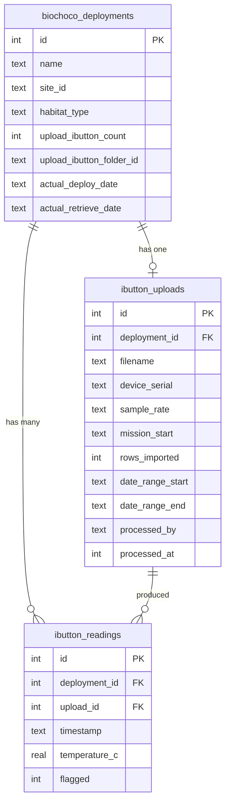

# feat: iButton Temperature Data Processing & Dashboard

## Overview

Add a temperature data processing pipeline and visualization dashboard for iButton sensor data collected during BIOCHOCO deployments. The system pulls `.xlsx` files from Google Drive iButton subfolders, parses and stores readings in the database (truncated to deployment time windows), and displays a `/biochoco/temperature` page with habitat-level summaries and per-deployment drill-down charts.

Brainstorm: `docs/brainstorms/2026-02-24-ibutton-temperature-dashboard-brainstorm.md`

## Problem Statement

iButton temperature loggers are deployed alongside camera traps and audio recorders at BIOCHOCO monitoring sites. The raw `.xlsx` files are already being uploaded to Google Drive, but there is no way to visualize, summarize, or quality-check the temperature data within the portal. Researchers need to:

- See temperature patterns across habitat types (primary forest vs cacao vs pasture)
- Drill into individual deployment time-series to spot data quality issues
- Truncate readings to the actual deployment window (iButtons record continuously, including in backpacks)
- Flag suspect readings manually

## Technical Approach

### Architecture

Follow the established climate module pattern:
- **Parser** (`parser.ts`): Parse `.xlsx` files → structured rows
- **Actions** (`actions.ts`): Server actions for batch processing, reprocessing, flagging
- **Dashboard** (`temperature-shell.tsx`): Client shell with summary + drill-down views
- **Charts** (`temperature-charts.tsx`): Recharts line charts for time-series

Data flow: Drive `.xlsx` → parser → truncate to deployment window → DB insert (sync transaction) → Recharts dashboard

### ERD



### Implementation Phases

#### Phase 1: Schema & Parser

Database tables and file parser — the foundation everything else builds on.

**Tasks:**

- [x] Add `ibutton_readings` table to `src/db/schema.ts`
  - `id` integer PK auto-increment
  - `deploymentId` integer FK → biochoco_deployments, NOT NULL
  - `uploadId` integer FK → ibutton_uploads, NOT NULL
  - `timestamp` text NOT NULL (Ecuador local time, format `YYYY-MM-DD HH:mm:ss`)
  - `temperatureC` real NOT NULL
  - `flagged` integer (boolean mode), default false
  - UNIQUE index on `(deploymentId, timestamp)` for upsert
  - Index on `deploymentId` for per-deployment queries

- [x] Add `ibutton_uploads` table to `src/db/schema.ts`
  - `id` integer PK auto-increment
  - `deploymentId` integer FK → biochoco_deployments, NOT NULL, UNIQUE (one upload per deployment)
  - `filename` text NOT NULL
  - `deviceSerial` text
  - `sampleRate` text
  - `missionStart` text
  - `rowsImported` integer NOT NULL
  - `dateRangeStart` text
  - `dateRangeEnd` text
  - `processedBy` text NOT NULL
  - `processedAt` integer (timestamp mode), default `unixepoch()`

- [x] Add `CREATE TABLE IF NOT EXISTS` + indexes to `scripts/push-schema.mjs`

- [x] Create `src/app/biochoco/ibutton/parser.ts`
  - `parseIbuttonXlsx(buffer: Buffer): ParseResult`
  - Use existing `xlsx` library (v0.18.5, already in package.json)
  - Parse header rows: extract `deviceSerial`, `sampleRate`, `missionStart`, `dataUnit`
  - Parse data rows: `Date`, `Time`, `Value` → `{ timestamp: string, temperatureC: number }[]`
  - Return `IbuttonParseResult { metadata: IbuttonMetadata, readings: IbuttonReading[], errors: string[] }`
  - Handle edge cases: empty files, missing headers, non-numeric values

**Files to create/modify:**
- `src/db/schema.ts` — add two table definitions
- `scripts/push-schema.mjs` — add CREATE TABLE statements
- `src/app/biochoco/ibutton/parser.ts` — new file

**References:**
- Climate readings schema: `src/db/schema.ts:522-559`
- Climate uploads schema: `src/db/schema.ts:565-576`
- Climate parser: `src/app/climate/upload/parser.ts`
- Push schema pattern: `scripts/push-schema.mjs:29-395`

---

#### Phase 2: Drive Integration & Processing Pipeline

Server actions to fetch files from Drive, parse, truncate, and store.

**Tasks:**

- [x] Add `listFolderFiles(folderId: string, extensions: Set<string>)` to `src/lib/drive-client.ts`
  - Lists files in a Drive folder matching extensions
  - Returns `{ id: string, name: string, mimeType: string }[]`
  - Must include `supportsAllDrives: true`, `includeItemsFromAllDrives: true`

- [x] Create `src/app/biochoco/ibutton/actions.ts` with server actions:

  - `fetchIbuttonStatus(): ActionResult<IbuttonStatus>`
    - `requirePermission("biochoco", "viewer")`
    - Query deployments with `upload_ibutton_count > 0`
    - Left join `ibutton_uploads` to determine processed vs unprocessed
    - Return counts: `{ total, processed, unprocessed, totalReadings }`

  - `processAllIbutton(): ActionResult<ProcessingResult>`
    - `requirePermission("biochoco", "editor")`
    - Find unprocessed deployments (have iButton files, no upload record)
    - For each deployment:
      1. Get `uploadIbuttonFolderId` from `biochoco_deployments`
      2. Call `listFolderFiles()` to find the `.xlsx` file
      3. Call `downloadFileToBuffer(fileId)` to get file contents
      4. Call `parseIbuttonXlsx(buffer)` to parse
      5. Look up deploy/retrieve dates from ODK submissions (use existing fallback chain pattern from `src/app/biochoco/data/actions.ts:53-73`)
      6. Truncate readings to `[deployDate, retrieveDate]` window
      7. Insert via synchronous `db.transaction()`:
         ```
         tx.run(sql`INSERT INTO ibutton_uploads ...`)
         for (reading of truncatedReadings) {
           tx.run(sql`INSERT INTO ibutton_readings ...`)
         }
         ```
      8. Track progress: `{ processed: n, failed: n, errors: string[] }`
    - `revalidatePath("/biochoco/ibutton")`
    - Return summary of what was processed

  - `reprocessDeployment(deploymentId: number): ActionResult<{ rowsImported: number }>`
    - `requirePermission("biochoco", "editor")`
    - Delete existing readings + upload record for this deployment
    - Re-fetch from Drive, re-parse, re-insert
    - `revalidatePath("/biochoco/ibutton")`

  - `toggleReadingFlag(readingId: number): ActionResult<{ flagged: boolean }>`
    - `requirePermission("biochoco", "editor")`
    - Toggle the `flagged` boolean on a single reading

  - `fetchDeploymentReadings(deploymentId: number): ActionResult<DeploymentDetail>`
    - `requirePermission("biochoco", "viewer")`
    - Return all readings + upload metadata + deployment info for drill-down view

  - `fetchHabitatSummary(): ActionResult<HabitatSummary[]>`
    - `requirePermission("biochoco", "viewer")`
    - Aggregate across all processed deployments grouped by habitat type
    - Return per-habitat: `{ habitatType, deploymentCount, readingCount, tempMin, tempMax, tempMean, tempStdDev }`

**Files to create/modify:**
- `src/lib/drive-client.ts` — add `listFolderFiles()`
- `src/app/biochoco/ibutton/actions.ts` — new file
- `src/app/biochoco/ibutton/types.ts` — new file (shared types)

**Gotchas (from institutional learnings):**
- `db.transaction()` callback MUST be synchronous — never `async` (`src/db/schema.ts` gotcha)
- Use `?? null` for all optional fields in `sql` templates (Drizzle drops `undefined` silently)
- Drive API: `supportsAllDrives: true` + `includeItemsFromAllDrives: true` (BIOCHOCO Shared Drive)
- ODK deploy date fallback chain: `deployment_info?.deploy_date ?? site_selection?.fecha_instalacion ?? sub.fecha_instalacion`

**References:**
- Drive download: `src/lib/drive-client.ts:485` (`downloadFileToBuffer`)
- Climate commit pattern: `src/app/climate/upload/actions.ts:97-160`
- ODK date extraction: `src/app/biochoco/data/actions.ts:53-73`
- Camera-trap batch processing: `src/app/camera-trap/actions.ts:1667`

---

#### Phase 3: Dashboard UI — Summary View

The main `/biochoco/temperature` page with summary cards, habitat comparison, and deployments table.

**Tasks:**

- [x] Add nav item in `src/components/sidebar-nav.tsx`
  - Add `{ label: "Temperatura", href: "/biochoco/ibutton" }` to `biochocoChildren` array
  - Add `"thermometer"` to `IconName` type and icon map in `sidebar-shell.tsx` (Lucide `Thermometer` icon)

- [x] Create `src/app/biochoco/ibutton/page.tsx` — server page
  - `requirePermission("biochoco", "viewer")`
  - Fetch iButton status, habitat summary, processed deployments list
  - Pass to `<TemperatureShell />` client component
  - Check if user is editor for showing process/reprocess buttons

- [x] Create `src/app/biochoco/ibutton/temperature-shell.tsx` — client shell
  - "use client" component managing dashboard state
  - Two views: summary (default) and drill-down (selected deployment)
  - Processing state: idle / processing / success / error
  - "Procesar iButton" button (editor only) — calls `processAllIbutton()`
  - Processing progress display (count of processed/total)

- [x] Create `src/app/biochoco/ibutton/summary-cards.tsx`
  - Grid of metric cards (following `climate/dashboard/metrics-row.tsx` pattern)
  - Cards: Despliegues procesados, Lecturas totales, Rango de fechas, Temp. promedio general

- [x] Create `src/app/biochoco/ibutton/habitat-chart.tsx`
  - Grouped bar chart: temperature min/mean/max by habitat type
  - Use Recharts `BarChart` with `ResponsiveContainer`
  - Habitat colors from `src/app/biochoco/habitat/types.ts`
  - Spanish habitat labels

- [x] Create `src/app/biochoco/ibutton/deployments-table.tsx`
  - Sortable, searchable table of processed deployments
  - Columns: Sitio, Habitat, F. Instalación, F. Recuperación, Lecturas, Temp Min/Max/Prom, Estado
  - Click row → drill-down view
  - "Reprocesar" button per row (editor only)
  - Sparkline column showing temperature range (optional, can defer)

**Files to create/modify:**
- `src/components/sidebar-nav.tsx` — add nav item
- `src/components/sidebar-shell.tsx` — add icon mapping
- `src/app/biochoco/ibutton/page.tsx` — new
- `src/app/biochoco/ibutton/temperature-shell.tsx` — new
- `src/app/biochoco/ibutton/summary-cards.tsx` — new
- `src/app/biochoco/ibutton/habitat-chart.tsx` — new
- `src/app/biochoco/ibutton/deployments-table.tsx` — new

**References:**
- Climate dashboard shell: `src/app/climate/dashboard/dashboard-shell.tsx`
- Climate metrics: `src/app/climate/dashboard/metrics-row.tsx`
- Habitat chart colors: `src/app/biochoco/habitat/types.ts`
- Sidebar nav: `src/components/sidebar-nav.tsx:61-74`

---

#### Phase 4: Dashboard UI — Deployment Drill-Down

Detailed view for a single deployment with time-series chart and manual flagging.

**Tasks:**

- [x] Create `src/app/biochoco/ibutton/[id]/page.tsx` — deployment detail server page
  - `requirePermission("biochoco", "viewer")`
  - Fetch deployment readings via `fetchDeploymentReadings(id)`
  - Pass to `<DeploymentDetailShell />` client component

- [x] Create `src/app/biochoco/ibutton/[id]/deployment-detail-shell.tsx` — client shell
  - Back button to summary view
  - Layout: chart on top, stats + device info below, readings table at bottom

- [x] Create `src/app/biochoco/ibutton/[id]/temperature-line-chart.tsx`
  - `ResponsiveContainer` + `LineChart` for temperature time-series
  - Single line: temperature (°C) over time
  - `dot={false}` for dense data (~1600 points)
  - Flagged readings highlighted in red
  - Tooltip showing timestamp + temperature + flagged status
  - X-axis: date labels, Y-axis: temperature °C

- [x] Create `src/app/biochoco/ibutton/[id]/stats-panel.tsx`
  - Grid of cards: Min, Max, Promedio, Desv. Estándar, Lecturas, Lecturas marcadas
  - Device info: Serial, Tasa de muestreo, Inicio de misión
  - Upload info: Archivo, Procesado por, Fecha de procesamiento

- [x] Create `src/app/biochoco/ibutton/[id]/readings-table.tsx`
  - Paginated table of all readings for the deployment
  - Columns: Fecha/Hora, Temperatura (°C), Marcado
  - Click to toggle flag on a reading (editor only, calls `toggleReadingFlag()`)
  - Visual indicator for flagged rows (red background or icon)
  - "Reprocesar" button at top (editor only)

**Files to create:**
- `src/app/biochoco/ibutton/[id]/page.tsx`
- `src/app/biochoco/ibutton/[id]/deployment-detail-shell.tsx`
- `src/app/biochoco/ibutton/[id]/temperature-line-chart.tsx`
- `src/app/biochoco/ibutton/[id]/stats-panel.tsx`
- `src/app/biochoco/ibutton/[id]/readings-table.tsx`

**References:**
- Climate chart pattern: `src/app/climate/dashboard/climate-charts.tsx`
- Camera-trap detail: `src/app/camera-trap/results/[id]/page.tsx`

---

## Acceptance Criteria

### Functional Requirements

- [ ] Clicking "Procesar iButton" downloads and parses all unprocessed iButton files from Drive
- [ ] Readings are truncated to deployment install/retrieve date window
- [ ] Summary cards show correct aggregate statistics
- [ ] Habitat comparison chart displays temperature distribution grouped by habitat type
- [ ] Deployments table is sortable and searchable
- [ ] Clicking a deployment shows time-series chart with all readings
- [ ] Users can flag/unflag individual readings (editor role)
- [ ] "Reprocesar" deletes old data and re-imports from Drive
- [ ] All server actions enforce `requirePermission()`
- [ ] UI strings are in Spanish

### Non-Functional Requirements

- [ ] Batch processing handles 50+ deployments without timeout
- [ ] Dashboard loads in <2s for 50 processed deployments
- [ ] Drill-down chart renders smoothly with ~1600 data points
- [ ] Synchronous DB transactions for data integrity
- [ ] Proper error handling with `ActionResult<T>` pattern

### Quality Gates

- [ ] `npm run build` passes (no Server/Client import issues)
- [ ] `npm run lint` passes
- [ ] Schema pushed successfully via `push-schema.mjs`
- [ ] Manual test: process a real iButton file from Drive
- [ ] Manual test: verify truncation to deployment window
- [ ] Manual test: verify habitat summary aggregation

## Edge Cases

1. **No iButton files in Drive** — Deployment has `upload_ibutton_count = 0`. Skip gracefully.
2. **Empty or corrupted .xlsx file** — Parser returns errors, skip deployment, report in results.
3. **Missing ODK deploy/retrieve dates** — Can't truncate. Store all readings but warn user.
4. **Deploy date after retrieve date** — Data error in ODK. Skip truncation, flag for review.
5. **All readings outside deployment window** — Truncation yields 0 readings. Report as warning.
6. **Reprocessing while viewing** — Optimistic UI update after revalidatePath.
7. **Drive API rate limits** — Sequential processing (not parallel) to avoid 429s.
8. **Duplicate timestamps** — UNIQUE constraint handles via upsert (ON CONFLICT DO UPDATE).

## Dependencies

- `xlsx` v0.18.5 (already installed)
- `recharts` (already installed)
- Google Drive API access (already configured for BIOCHOCO)
- ODK Central access (already configured)

## References

### Internal
- Climate readings schema: `src/db/schema.ts:522-576`
- Climate upload pipeline: `src/app/climate/upload/actions.ts`
- Climate dashboard: `src/app/climate/dashboard/`
- Drive client: `src/lib/drive-client.ts`
- ODK date extraction: `src/app/biochoco/data/actions.ts:53-73`
- Sidebar nav: `src/components/sidebar-nav.tsx:61-74`
- Habitat types: `src/app/biochoco/habitat/types.ts`
- Push schema: `scripts/push-schema.mjs`

### Institutional Learnings
- Sync transactions only: `docs/solutions/runtime-errors/async-transaction-better-sqlite3-CameraTrap-20260223.md`
- Schema migrations: `docs/solutions/database-issues/missing-alter-table-migrations-push-schema.md`
- Drive Shared Drives: `MEMORY.md` — always use `supportsAllDrives: true`
- Drizzle undefined: `MEMORY.md` — always use `?? null` for optional fields
