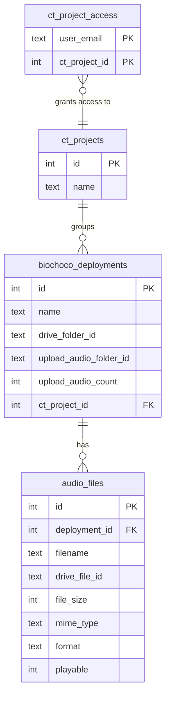

# feat: Passive Audio Recorder Module MVP

## Overview

Add a top-level `/audio/` module ("Grabaciones" in nav) for browsing and playing passive audio recordings from field deployments. Audio recorders are paired with camera traps at the same sites — they share the same deployments, Drive folders, and ODK metadata. This MVP covers file discovery, browsing, and in-browser playback. BirdNET species identification is a future phase.

## Architectural Decisions

### AD-1: Streaming proxy with Range request support

Audio files are streamed through the portal via `/api/audio/stream` (not signed Drive URLs). This keeps access control centralized and matches the existing image proxy pattern. **Critical difference from images**: audio files can be 100-500+ MB, so the proxy must **pipe the Drive API response stream directly to the client** — never buffer the entire file in memory. The proxy must also support HTTP Range requests (`Range` header passthrough to Drive API) to enable seeking in the `<audio>` element.

**New function needed**: `downloadFileAsStream()` in `src/lib/drive-client.ts` using `responseType: "stream"`.

### AD-2: `audio_files` DB table for persisted file metadata

File metadata is synced from Drive to a local `audio_files` table (not fetched live on every page load). With potentially hundreds of files per deployment, live Drive listing would be 2-5 seconds per page load and consume API quota. Follow the `biochoco_images` pattern: scan once, serve from DB, rescan on demand.

### AD-3: Same permission model as camera traps (two layers)

1. **Module access**: `requirePermission("camera-trap", "viewer")` gates entry to `/audio/`
2. **Deployment filtering**: `getUserCameraTrapProjects()` + `ctProjectFilter()` filters which deployments appear
3. **Per-file access**: Audio proxy API checks `requireDeploymentAccess()` before streaming

### AD-4: Manual scan with bulk option

Users trigger a "Escanear" action per deployment (or "Escanear Todo" for bulk). This queries the Drive API for files in `grabadores_de_audio/` and persists metadata to the `audio_files` table. Follow the iButton "Procesar Todo" pattern.

### AD-5: Flat file listing for MVP

Assume audio files are flat in the `grabadores_de_audio/` subfolder (not nested). The existing `listFolderFiles()` handles this. If nested structures are discovered later, add recursive listing.

### AD-6: Unsupported formats shown with badge

`.wac` and `.w4v` (Wildlife Acoustics proprietary) files are listed in the table with a "No compatible" badge and no play button. Only browser-native formats (`.wav`, `.mp3`, `.flac`, `.ogg`, `.aac`) get play/download buttons.

## Database Schema

### New table: `audio_files`

```
┌─────────────────────────────────────────────────┐
│ audio_files                                     │
├─────────────────────────────────────────────────┤
│ id            INTEGER PK AUTOINCREMENT          │
│ deployment_id INTEGER NOT NULL → deployments.id │
│ filename      TEXT NOT NULL                     │
│ drive_file_id TEXT                              │
│ file_size     INTEGER          (bytes)          │
│ mime_type     TEXT                              │
│ modified_at   INTEGER          (Drive timestamp)│
│ format        TEXT             (extension)      │
│ playable      INTEGER BOOLEAN  (browser-native?)│
│ created_at    INTEGER NOT NULL DEFAULT now      │
├─────────────────────────────────────────────────┤
│ INDEX idx_audio_files_deployment_id             │
│ UNIQUE idx_audio_files_deployment_drive_file    │
│   (deployment_id, drive_file_id)                │
└─────────────────────────────────────────────────┘
```



**No changes to existing tables.** The `biochoco_deployments` table already has `uploadAudioCount`, `uploadAudioFolderId`, and `uploadAudioFolderId` columns.

## Implementation Phases

### Phase 1: Schema & Drive Integration

**Files to create/modify:**

- [x] Add `audioFiles` table to `src/db/schema.ts`
- [x] Add `CREATE TABLE IF NOT EXISTS` + migration to `scripts/push-schema.mjs`
- [x] Add `downloadFileAsStream()` to `src/lib/drive-client.ts` — pipe Drive response as a readable stream, support Range headers
- [x] Extend `listFolderFiles()` in `src/lib/drive-client.ts` to return `size` and `modifiedTime` (add to `fields` parameter)

<details>
<summary>Schema definition sketch</summary>

```typescript
// src/db/schema.ts
export const audioFiles = sqliteTable(
  "audio_files",
  {
    id: integer("id").primaryKey({ autoIncrement: true }),
    deploymentId: integer("deployment_id")
      .notNull()
      .references(() => deployments.id, { onDelete: "cascade" }),
    filename: text("filename").notNull(),
    driveFileId: text("drive_file_id"),
    fileSize: integer("file_size"),
    mimeType: text("mime_type"),
    modifiedAt: integer("modified_at", { mode: "timestamp" }),
    format: text("format"), // e.g. "wav", "mp3", "wac"
    playable: integer("playable", { mode: "boolean" }).notNull().default(true),
    createdAt: integer("created_at", { mode: "timestamp" })
      .notNull()
      .default(sql`(unixepoch())`),
  },
  (table) => [
    index("idx_audio_files_deployment_id").on(table.deploymentId),
    uniqueIndex("idx_audio_files_deployment_drive_file").on(
      table.deploymentId,
      table.driveFileId
    ),
  ]
);
```

</details>

<details>
<summary>Streaming download sketch</summary>

```typescript
// src/lib/drive-client.ts
export async function downloadFileAsStream(
  fileId: string,
  rangeHeader?: string
): Promise<{ stream: Readable; contentType: string; contentLength?: number; contentRange?: string }> {
  const drive = getDrive();
  const headers: Record<string, string> = {};
  if (rangeHeader) headers["Range"] = rangeHeader;

  const res = await drive.files.get(
    { fileId, alt: "media", supportsAllDrives: true },
    { responseType: "stream", headers }
  );

  return {
    stream: res.data as Readable,
    contentType: res.headers["content-type"] ?? "application/octet-stream",
    contentLength: res.headers["content-length"] ? parseInt(res.headers["content-length"]) : undefined,
    contentRange: res.headers["content-range"],
  };
}
```

</details>

### Phase 2: Audio Streaming API Route

**Files to create:**

- [x] Create `src/app/api/audio/stream/route.ts` — streaming proxy with auth, ct_project access, Range header support, MIME type mapping, download mode

**Security checklist (from learnings):**
- `getCurrentUser()` for auth
- Validate `fileId` param (no path traversal: reject `/`, `\`, `..`)
- Look up audio file in DB to get `deploymentId`
- Call `requireDeploymentAccess(user, deploymentId)` for ct_project check
- Pipe stream directly to response (never buffer in memory)
- Pass `Range` header through to Drive API, forward `Content-Range` response header
- Support `?download=true` for `Content-Disposition: attachment` (project convention)
- Cache-Control: `public, max-age=31536000, immutable` (audio files never change)

<details>
<summary>API route sketch</summary>

```typescript
// src/app/api/audio/stream/route.ts
const AUDIO_MIME_TYPES: Record<string, string> = {
  wav: "audio/wav",
  mp3: "audio/mpeg",
  flac: "audio/flac",
  ogg: "audio/ogg",
  aac: "audio/aac",
  m4a: "audio/mp4",
};

const PLAYABLE_FORMATS = new Set(Object.keys(AUDIO_MIME_TYPES));

export async function GET(request: NextRequest) {
  const user = await getCurrentUser();
  if (!user) return NextResponse.json({ error: "Unauthorized" }, { status: 401 });

  const fileId = request.nextUrl.searchParams.get("fileId");
  const download = request.nextUrl.searchParams.get("download") === "true";

  if (!fileId || !isSafeParam(fileId)) {
    return NextResponse.json({ error: "Invalid fileId" }, { status: 400 });
  }

  // Look up audio file in DB
  const [audioFile] = await db
    .select()
    .from(audioFiles)
    .where(eq(audioFiles.driveFileId, fileId));

  if (!audioFile) {
    return NextResponse.json({ error: "Archivo no encontrado" }, { status: 404 });
  }

  // Check ct_project access
  await requireDeploymentAccess(user, audioFile.deploymentId);

  // Stream from Drive with Range support
  const rangeHeader = request.headers.get("range") ?? undefined;
  const { stream, contentType, contentLength, contentRange } =
    await downloadFileAsStream(fileId, rangeHeader);

  const headers: Record<string, string> = {
    "Content-Type": contentType,
    "Cache-Control": "public, max-age=31536000, immutable",
    "Accept-Ranges": "bytes",
  };

  if (contentLength) headers["Content-Length"] = String(contentLength);
  if (contentRange) headers["Content-Range"] = contentRange;
  if (download) {
    headers["Content-Disposition"] = `attachment; filename="${audioFile.filename}"`;
  }

  const status = contentRange ? 206 : 200;

  return new Response(stream as unknown as ReadableStream, { status, headers });
}
```

</details>

### Phase 3: Server Actions

**Files to create:**

- [x] Create `src/app/audio/actions.ts` — server actions for:
  - `fetchAudioDeployments()` — list deployments with audio file counts, filtered by ct_project access
  - `scanDeploymentAudio(deploymentId)` — query Drive for files in `grabadores_de_audio/`, upsert to `audio_files` table
  - `scanAllAudio()` — bulk scan all deployments with `uploadAudioFolderId`
  - `fetchAudioFiles(deploymentId)` — get audio files from DB for a deployment
  - `getAudioStats()` — aggregate stats (total files, total deployments with audio, total size)

**Gotchas to remember:**
- Every action starts with `requirePermission("camera-trap", "viewer")`
- Scan actions need `requirePermission("camera-trap", "editor")` (write operation)
- Use sequential `await db.insert().returning()` for bulk inserts (no async in transactions)
- Use `?? null` for optional Drizzle fields (never leave `undefined`)
- Always `supportsAllDrives: true` and `includeItemsFromAllDrives: true` for Drive API

### Phase 4: Pages & UI

**Files to create:**

- [x] Create `src/app/audio/page.tsx` — deployment list (Server Component)
  - Table with: deployment name, site name, audio file count, date range, ct_project, scan status
  - "Escanear Todo" button for bulk scan
  - Conditional on `requirePermission("camera-trap", "viewer")`
  - Filter by ct_project access via `getUserCameraTrapProjects()` + `ctProjectFilter()`

- [x] Create `src/app/audio/audio-deployments-shell.tsx` — Client Component
  - Table with sorting, filtering, search
  - Row click navigates to `/audio/[id]`
  - "Escanear" button per row to trigger single deployment scan
  - Show audio count, last scan time

- [x] Create `src/app/audio/[id]/page.tsx` — deployment detail (Server Component)
  - Shows deployment metadata (name, location, dates)
  - Lists audio files from DB
  - Conditional on `requireDeploymentAccess()`

- [x] Create `src/app/audio/[id]/audio-files-shell.tsx` — Client Component
  - File list with: filename, size (formatted), format badge, modified date
  - Play button (inline `<audio>` element) for playable formats
  - Download button per file (using shared pattern)
  - "No compatible" badge for `.wac`/`.w4v` files
  - Sorting by filename, size, date

- [x] Create `src/app/audio/[id]/audio-player.tsx` — Client Component
  - Inline `<audio>` element with controls
  - Source URL: `/api/audio/stream?fileId={driveFileId}`
  - Show filename, format, file size
  - Download button

### Phase 5: Navigation

**Files to modify:**

- [x] Add `"audio-lines"` to `IconName` type in `src/components/sidebar-nav.tsx`
- [x] Add `AudioLines` import and mapping in `src/components/sidebar-shell.tsx`
- [x] Add "Grabaciones" nav item under "Análisis" section, gated on `hasCameraTrap`:

```typescript
// After camera trap entry in sidebar-nav.tsx
if (hasCameraTrap) {
  analysisItems.push({
    label: "Grabaciones",
    icon: "audio-lines",
    children: [
      { label: "Instalaciones", href: "/audio" },
    ],
  });
}
```

## Acceptance Criteria

### Functional

- [ ] `/audio/` page lists deployments with audio data, filtered by ct_project access
- [ ] Users without `camera-trap` permission are redirected away from `/audio/`
- [ ] "Escanear" syncs audio file metadata from Drive to DB for a single deployment
- [ ] "Escanear Todo" syncs all deployments with audio folders
- [ ] `/audio/[id]` shows list of audio files with filename, size, format, date
- [ ] Playable audio files (wav, mp3, flac, ogg, aac) have a working play button
- [ ] Audio streams in-browser without downloading the entire file first (Range support)
- [ ] `.wac`/`.w4v` files shown with "No compatible" badge, no play button
- [ ] Download button on each file (sets `Content-Disposition: attachment`)
- [ ] "Grabaciones" appears in sidebar nav under "Análisis" for users with camera-trap access

### Non-Functional

- [ ] Audio streaming does not buffer entire files in server memory (pipe stream)
- [ ] All server actions call `requirePermission()` as first line
- [ ] Audio proxy validates `fileId` against path traversal
- [ ] Audio proxy checks `requireDeploymentAccess()` per file

## Key File References

| File | Purpose |
|---|---|
| `src/db/schema.ts:83-109` | `ct_projects` + `ct_project_access` schema to reuse |
| `src/db/schema.ts:115-177` | `biochoco_deployments` table (already has audio upload columns) |
| `src/db/schema.ts:217-261` | `biochoco_images` table (pattern for `audio_files`) |
| `src/lib/camera-trap-auth.ts` | `getUserCameraTrapProjects()`, `ctProjectFilter()`, `requireDeploymentAccess()` — reuse as-is |
| `src/lib/drive-client.ts:82-126` | `countFilesRecursive()` — already counts audio files |
| `src/lib/drive-client.ts:132-166` | `listFolderFiles()` — needs `size`/`modifiedTime` added to fields |
| `src/lib/drive-client.ts:307-309` | `AUDIO_EXTENSIONS` — already defined |
| `src/components/sidebar-nav.tsx:128-157` | Camera trap nav pattern to follow |
| `src/components/sidebar-shell.tsx:6,29-40` | Icon mapping (add `AudioLines`) |
| `src/app/api/odk/photos/route.ts` | Photo proxy pattern (auth, allowlisting, path traversal check) |
| `src/app/biochoco/ibutton/actions.ts` | `processAllIbutton()` — pattern for "Escanear Todo" bulk action |

## Gotchas (from institutional learnings)

1. **Drive Shared Drives**: Always include `supportsAllDrives: true` and `includeItemsFromAllDrives: true`
2. **Case-sensitive extensions**: Always `.toLowerCase()` before comparing
3. **Async in transactions**: Never use `async` callbacks in `db.transaction()` — use sequential awaits
4. **ALTER TABLE migrations**: Add `audio_files` CREATE TABLE to `push-schema.mjs`, test on existing DB
5. **Drizzle sql + undefined**: Use `?? null` for optional fields, never pass `undefined`
6. **requirePermission on every action**: Not just pages — actions are public endpoints
