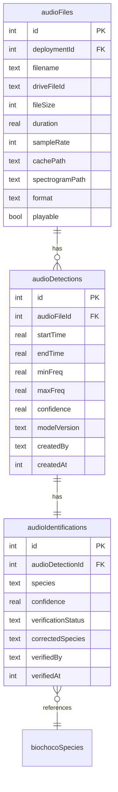

# Audio Annotation Interface with Spectrograms

## Overview

Build a bioacoustics annotation interface where users view full-file spectrograms and draw time-frequency bounding boxes to label species calls. Mirrors the camera trap annotation workflow (detections → identifications → verification), reusing the shared species list and SpeciesSidebar component. Server-side spectrogram generation via Python/librosa, with audio files cached locally from Google Drive.

**Brainstorm:** `docs/brainstorms/2026-02-25-audio-annotation-spectrogram-brainstorm.md`

## Key Design Decisions

- **Coordinate system**: Store real-world units (seconds, Hz) in the DB, not normalized pixel coords. The spectrogram metadata (duration, fmin, fmax, image dimensions) is stored per-file and used for pixel↔real-unit conversion on the client
- **Spectrogram generation**: Python/librosa via `execFile` (one-shot, not persistent server). Returns JSON metadata alongside the PNG. ~1-1.5s per 60s file
- **Page load strategy**: Two-phase — render layout immediately with loading skeleton, then poll an API endpoint that triggers cache+spectrogram on first request and returns status/metadata
- **Cascade deletion safety**: Scan action soft-marks files missing from Drive (`driveFileId = null`) instead of hard-deleting rows that have annotations
- **Keyboard shortcuts**: ArrowLeft/Right = prev/next file (matching camera trap). `[` / `]` = audio seek ±5s. Space = play/pause
- **Spectrogram scrolling**: Single static image, horizontally scrollable. No zoom in v1 — files are typically 60s which produces a ~6000px-wide image at 100px/s

## Schema Changes

### New columns on `audioFiles`

```sql
ALTER TABLE audio_files ADD COLUMN duration REAL;
ALTER TABLE audio_files ADD COLUMN sample_rate INTEGER;
ALTER TABLE audio_files ADD COLUMN cache_path TEXT;
ALTER TABLE audio_files ADD COLUMN spectrogram_path TEXT;
```

### New table: `audio_detections`

```sql
CREATE TABLE IF NOT EXISTS audio_detections (
  id INTEGER PRIMARY KEY AUTOINCREMENT,
  audio_file_id INTEGER NOT NULL REFERENCES audio_files(id) ON DELETE CASCADE,
  start_time REAL NOT NULL,        -- seconds from file start
  end_time REAL NOT NULL,          -- seconds from file start
  min_freq REAL NOT NULL,          -- Hz
  max_freq REAL NOT NULL,          -- Hz
  confidence REAL,                 -- nullable (ML)
  model_version TEXT,              -- nullable (ML), "manual" for human
  created_by TEXT,
  created_at INTEGER NOT NULL DEFAULT (unixepoch())
);
CREATE INDEX idx_audio_detections_file ON audio_detections(audio_file_id);
```

### New table: `audio_identifications`

```sql
CREATE TABLE IF NOT EXISTS audio_identifications (
  id INTEGER PRIMARY KEY AUTOINCREMENT,
  audio_detection_id INTEGER NOT NULL REFERENCES audio_detections(id) ON DELETE CASCADE,
  species TEXT NOT NULL,
  confidence REAL,
  model_version TEXT,
  verification_status TEXT NOT NULL DEFAULT 'unverified'
    CHECK(verification_status IN ('unverified','verified','rejected','corrected')),
  corrected_species TEXT,
  verified_by TEXT,
  verified_at INTEGER
);
CREATE INDEX idx_audio_identifications_detection ON audio_identifications(audio_detection_id);
```

### ERD



## Implementation Phases

### Phase 1: Schema + Python Pipeline + File Caching

Foundation work — no UI yet.

**Files to modify:**

- [x] `src/db/schema.ts` — add `duration`, `sampleRate`, `cachePath`, `spectrogramPath` columns to `audioFiles`. Add `audioDetections` and `audioIdentifications` tables with Drizzle definitions
- [x] `scripts/push-schema.mjs` — add ALTER TABLE migrations for new `audioFiles` columns. Add CREATE TABLE statements for new tables
- [x] `scripts/generate-spectrogram.py` — NEW Python script:
  - Input: `python generate-spectrogram.py <input.wav> <output.png>`
  - Uses librosa fast PIL path (no matplotlib savefig)
  - Params: sr=48000, n_fft=2048, hop_length=512, n_mels=128, fmin=200, fmax=12000, height=512px, cmap=magma
  - Outputs JSON metadata to stdout: `{ duration, sampleRate, width, height, pixelsPerSecond, hzPerPixel, fmin, fmax }`
  - Handles errors with non-zero exit code + stderr message
- [x] `scripts/ensure-ml-venv.sh` — add `librosa soundfile numpy matplotlib Pillow` to pip install
- [x] `Dockerfile` — add `libsndfile1` to apt-get install
- [x] `src/lib/audio-cache.ts` — NEW module:
  - `ensureAudioCached(audioFileId)`: downloads WAV from Drive to `data/cache/audio/{deploymentId}/{filename}`, updates `cachePath` in DB. Skips if already cached. Returns cache path
  - `ensureSpectrogramGenerated(audioFileId)`: runs Python script on cached WAV, saves PNG alongside, updates `spectrogramPath` and `duration`/`sampleRate` in DB. Skips if already generated. Returns spectrogram path + metadata
  - `evictAudioCacheIfOverLimit(skipDeploymentId)`: LRU eviction mirroring `drive-downloader.ts` pattern. Nulls `cachePath` and `spectrogramPath` on evicted files
  - Cache base: `data/cache/audio/`
  - Size limit: env `AUDIO_CACHE_MAX_GB` (default 50)
- [x] `src/app/audio/actions.ts` — modify `scanDeploymentAudio()`:
  - When a DB file's `driveFileId` is no longer found on Drive, check if it has any `audioDetections`. If yes, set `driveFileId = null` instead of deleting. If no annotations, delete as before

**Gotchas (from learnings):**
- `db.transaction()` callback must be synchronous (no async). Use `.run()` inside transactions
- `ALTER TABLE ADD COLUMN` statements go in `push-schema.mjs` migrations array (idempotent with try/catch)
- Google Drive API: always `supportsAllDrives: true` + `includeItemsFromAllDrives: true`
- Python matplotlib: `matplotlib.use("Agg")` required for headless Docker
- Docker: `MPLCONFIGDIR=/tmp/matplotlib-config` env var for writable matplotlib config

### Phase 2: Spectrogram API + Annotation Page Layout

Serve spectrograms and build the annotation page shell.

**Files to create/modify:**

- [x] `src/app/api/audio/spectrogram/route.ts` — NEW API route:
  - `GET /api/audio/spectrogram?fileId=<audioFileId>`
  - Auth: `requirePermission("camera-trap", "viewer")` + deployment access check
  - Calls `ensureAudioCached()` + `ensureSpectrogramGenerated()`
  - Returns the PNG file with `Cache-Control: public, max-age=31536000, immutable`
  - Returns 202 with `{ status: "generating" }` if spectrogram is being created (client polls)
  - Returns 400 for non-WAV/FLAC/MP3 formats with error message
- [x] `src/app/api/audio/spectrogram/meta/route.ts` — NEW API route:
  - `GET /api/audio/spectrogram/meta?fileId=<audioFileId>`
  - Returns JSON: `{ ready: boolean, duration, sampleRate, width, height, pixelsPerSecond, hzPerPixel, fmin, fmax }`
  - Client uses this for coordinate mapping and to know when the spectrogram is ready
- [x] `src/app/audio/[id]/annotate/[fileId]/page.tsx` — NEW Server Component:
  - Auth: `requirePermission("camera-trap", "viewer")` + `requireDeploymentAccess`
  - Fetches: audio file row, existing detections+identifications, species list, recent species, prev/next file IDs
  - Determines `isEditor`
  - Passes serializable props to client shell
- [x] `src/app/audio/[id]/annotate/[fileId]/annotation-client.tsx` — NEW Client Component:
  - Layout: `flex h-[calc(100vh-4rem)]` with SpeciesSidebar (left, w-56) + main content (flex-1, min-w-0)
  - Main content: DetectionCardStrip (top) + spectrogram container (center, overflow-x-auto) + playback controls (bottom)
  - State: `selectedDetectionId`, `isPlaying`, `currentTime`, detection list (from server, refreshed via `router.refresh()`)
  - Loading: polls `/api/audio/spectrogram/meta` until `ready: true`, shows skeleton meanwhile
  - Two-phase render: layout + skeleton → spectrogram loaded → interactive

### Phase 3: Spectrogram Overlay + Box Drawing

The core annotation interaction.

**Files to create/modify:**

- [x] `src/app/audio/[id]/annotate/[fileId]/spectrogram-overlay.tsx` — NEW component (adapted from BBoxOverlay):
  - Props: `spectrogramUrl`, `metadata` (from meta endpoint), `boxes: AudioBoxData[]`, `selectedBoxId`, `editable`, `onBoxClick`, `onDrawComplete`
  - `AudioBoxData` interface: `{ id, startTime, endTime, minFreq, maxFreq, species?, displayLabel?, verificationStatus? }`
  - Renders: `` with spectrogram PNG + SVG overlay sized to match
  - Coordinate conversion (pixel ↔ real):
    - `timeSeconds = (pixelX / metadata.width) * metadata.duration`
    - `freqHz = metadata.fmax - (pixelY / metadata.height) * (metadata.fmax - metadata.fmin)`
  - Box rendering: SVG rects positioned using real→pixel conversion, colored by species (reuse SPECIES_COLORS palette)
  - Box drawing: pointer events with drag threshold (5px), minimum box size (0.05s × 100Hz)
  - Playback cursor: vertical line at `currentTimePixel = (currentTime / metadata.duration) * metadata.width`, animated via `requestAnimationFrame`
  - Container: `overflow-x-auto` with auto-scroll to follow playback cursor
- [x] `src/app/audio/[id]/annotate/[fileId]/audio-detection-strip.tsx` — inline in annotation-client (adapted from DetectionCardStrip):
  - Shows cards for each detection: time range, species label
  - Click to select → highlights box on spectrogram
  - Delete button and "Play selection" deferred to Phase 4/5

### Phase 4: Server Actions + Annotation Workflow

Wire up all mutation operations.

**Files to create/modify:**

- [x] `src/app/audio/annotation-actions.ts` — NEW server actions file:
  - `getAudioFileWithDetections(audioFileId)` — fetch file + detections + identifications (joined)
  - `getAudioFileIds(deploymentId)` — ordered list for prev/next navigation
  - `createAudioDetection(audioFileId, { startTime, endTime, minFreq, maxFreq })` — creates detection + unverified "unknown" identification. Returns `{ detectionId, identificationId }`
  - `deleteAudioDetection(detectionId)` — hard delete with CASCADE
  - `assignAudioSpecies(identificationId, scientificName)` — same logic as camera trap `assignSpecies` (verified vs corrected)
  - `verifyAudioIdentification(identificationId)` — set verified + verifiedBy + verifiedAt
  - `rejectAudioIdentification(identificationId)` — set rejected
  - `verifyAllAndAdvance(identificationIds[], deploymentId, currentFileId)` — batch verify + find next file
  - `getRecentAudioSpecies(deploymentId, limit=8)` — distinct species from recent audio identifications
  - All actions: `requirePermission("camera-trap", "editor")` + deployment access check via new entity resolution helpers
- [x] `src/lib/camera-trap-auth.ts` — add entity resolution helpers:
  - `getDeploymentIdForAudioDetection(detectionId)` — audioDetections → audioFiles → deploymentId
  - `getDeploymentIdForAudioIdentification(identificationId)` — audioIdentifications → audioDetections → audioFiles → deploymentId

### Phase 5: Playback Integration + Keyboard Shortcuts

Audio playback synced with the spectrogram.

**Files to modify:**

- [ ] `src/app/audio/[id]/annotate/[fileId]/annotation-client.tsx` — add playback:
  - Hidden `<audio>` element with src from `/api/audio/stream?fileId=<driveFileId>`
  - Track `currentTime` via `timeupdate` event → pass to spectrogram overlay for cursor position
  - Play/pause toggle button in controls bar
  - "Play selection" on selected detection: `audio.currentTime = det.startTime`, play, stop at `det.endTime`
  - Click on spectrogram seeks: convert pixelX → time, set `audio.currentTime`
- [ ] `src/hooks/use-audio-annotation-shortcuts.ts` — NEW hook (adapted from `use-annotation-shortcuts.ts`):
  - Space = play/pause
  - `[` / `]` = seek audio ±5s
  - ArrowLeft/Right = prev/next file
  - Number keys 1-9/0 = select detection or assign species (context-dependent, same as camera trap)
  - Enter = verify-all-and-advance
  - v/r = verify/reject selected
  - d/Delete/Backspace = delete selected detection
  - Escape = deselect
  - Guard: suppress when typing in search input or dialog open

### Phase 6: Entry Points + Polish

Wire everything together and handle edge cases.

**Files to modify:**

- [ ] `src/app/audio/[id]/audio-files-shell.tsx` — add "Anotar" button per file row:
  - Link to `/audio/${deploymentId}/annotate/${file.id}`
  - Show for playable WAV/FLAC/MP3 files only (librosa-compatible)
  - Small icon button next to the play button
- [ ] `src/app/audio/[id]/annotate/[fileId]/annotation-client.tsx` — polish:
  - Loading skeleton while spectrogram generates (pulsing gray rectangle)
  - Error state if Python fails: show stderr, "Reintentar" button
  - Error state for non-supported formats: "Formato no compatible para espectrogramas"
  - Error state for ML venv not ready: "Entorno ML no disponible. Espere unos minutos."
  - Back button → `/audio/[deploymentId]`
  - Header: deployment name + filename
  - Annotation count badge on file rows in the files page
- [ ] `src/app/audio/[id]/annotate/[fileId]/spectrogram-overlay.tsx` — polish:
  - Time axis labels (every 5s or 10s) rendered in HTML below the spectrogram
  - Frequency axis labels (every 2000Hz) rendered in HTML to the left
  - Tooltip on box hover showing species + time range + freq range
- [ ] `src/components/species-sidebar.tsx` — no changes needed (already reusable). The audio annotation page passes the same props as camera trap
- [ ] Verify `min-w-0` applied at every flex level in the annotation layout
- [ ] Verify build passes (`npm run build`)

## Spectrogram Python Script

```python
# scripts/generate-spectrogram.py
# Usage: python generate-spectrogram.py <input.wav> <output.png>
# Outputs JSON metadata to stdout

import sys, json, librosa
import matplotlib; matplotlib.use("Agg")
import matplotlib.cm as cm
import numpy as np
from PIL import Image

SR = 48000
N_FFT = 2048
HOP = 512
N_MELS = 128
FMIN = 200.0
FMAX = 12000.0
HEIGHT = 512
CMAP = "magma"

def main(wav_path, output_path):
    y, sr = librosa.load(wav_path, sr=SR, mono=True)
    duration = librosa.get_duration(y=y, sr=sr)
    S = librosa.feature.melspectrogram(
        y=y, sr=sr, n_fft=N_FFT, hop_length=HOP,
        n_mels=N_MELS, fmin=FMIN, fmax=FMAX, power=2.0
    )
    S_dB = librosa.power_to_db(S, ref=np.max)
    S_norm = (S_dB - S_dB.min()) / (S_dB.max() - S_dB.min() + 1e-10)
    S_rgb = (cm.get_cmap(CMAP)(S_norm)[:, :, :3] * 255).astype(np.uint8)
    S_rgb = np.flipud(S_rgb)
    img = Image.fromarray(S_rgb, "RGB")
    aspect = img.width / img.height
    new_w = int(HEIGHT * aspect)
    img = img.resize((new_w, HEIGHT), Image.LANCZOS)
    img.save(output_path, "PNG", optimize=True)
    print(json.dumps({
        "duration": round(duration, 3),
        "sampleRate": sr,
        "width": new_w, "height": HEIGHT,
        "pixelsPerSecond": round(new_w / duration, 2),
        "hzPerPixel": round((FMAX - FMIN) / HEIGHT, 2),
        "fmin": FMIN, "fmax": FMAX,
        "nFft": N_FFT, "hopLength": HOP, "nMels": N_MELS,
    }))

if __name__ == "__main__":
    main(sys.argv[1], sys.argv[2])
```

## Acceptance Criteria

### Functional

- [ ] `/audio/[id]` file rows show "Anotar" link for WAV/FLAC/MP3 files
- [ ] `/audio/[id]/annotate/[fileId]` loads with spectrogram + species sidebar + detection strip
- [ ] Spectrogram generates server-side on first visit, cached for subsequent visits
- [ ] Loading skeleton shown while spectrogram generates (~1-2s)
- [ ] Users can draw time-frequency bounding boxes on the spectrogram
- [ ] Box coordinates stored in real units (seconds, Hz) in `audio_detections`
- [ ] Species assignment works via sidebar click or number hotkeys
- [ ] Verification workflow: verify, reject, correct (same as camera trap)
- [ ] Prev/next file navigation with ArrowLeft/Right
- [ ] Audio playback with cursor synced to spectrogram position
- [ ] "Play selection" plays only the selected detection's time range
- [ ] Keyboard shortcuts: Space (play/pause), `[`/`]` (seek), Enter (verify+advance), v/r (verify/reject), d (delete)

### Non-Functional

- [ ] Spectrogram generation < 3s for 60s WAV file
- [ ] Spectrogram PNG < 500KB for 60s file
- [ ] No layout regressions with sidebar open/closed (`min-w-0` applied)
- [ ] Scan action preserves annotations when Drive files are removed
- [ ] Schema migration is idempotent (safe to run multiple times)
- [ ] Build passes (`npm run build`)

## References

- Camera trap annotation UI: `src/app/camera-trap/results/[id]/images/[imageId]/image-annotation-client.tsx`
- Camera trap annotation page: `src/app/camera-trap/results/[id]/images/[imageId]/page.tsx`
- BBoxOverlay: `src/components/bbox-overlay.tsx`
- SpeciesSidebar: `src/components/species-sidebar.tsx`
- DetectionCardStrip: `src/components/detection-card-strip.tsx`
- Annotation shortcuts: `src/hooks/use-annotation-shortcuts.ts`
- Camera trap actions (detection/identification): `src/app/camera-trap/actions.ts`
- Drive downloader (cache pattern): `src/lib/drive-downloader.ts`
- Audio streaming API: `src/app/api/audio/stream/route.ts`
- Audio files shell: `src/app/audio/[id]/audio-files-shell.tsx`
- Audio player: `src/app/audio/[id]/audio-player.tsx`
- DB schema: `src/db/schema.ts`
- Push schema migrations: `scripts/push-schema.mjs`
- ML venv setup: `scripts/ensure-ml-venv.sh`
- Flex min-w-0 learning: `docs/solutions/ui-bugs/biochoco-overview-horizontal-scroll-map-overlap.md`
- SQLite transaction learning: `docs/solutions/runtime-errors/async-transaction-better-sqlite3-CameraTrap-20260223.md`
- Schema migration learning: `docs/solutions/database-issues/missing-alter-table-migrations-push-schema.md`
- Drive Shared Drives learning: `docs/solutions/integration-issues/google-drive-recursive-file-counting-20260224.md`
