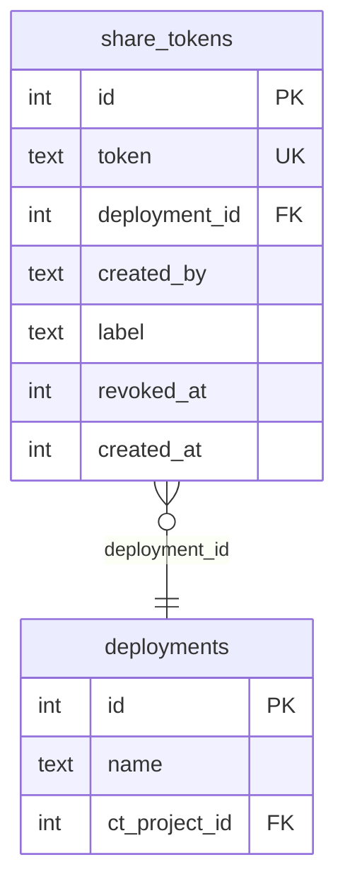

# Public Pages & Landowner Share Links

## Overview

Add public-facing capabilities to the FCAT Portal, which currently requires Google OAuth for all access. Two features:

1. **Public path infrastructure** — `/public/*` routes bypass all three auth layers (nginx `auth_request`, oauth2-proxy, proxy.ts), enabling unauthenticated access to specific pages
2. **Landowner share links** — Token-based URLs (`/public/share/[token]`) let landowners view camera trap deployment images and species detections from their farm without needing a Google account

## Problem Statement

Landowners whose properties host FCAT camera traps have no way to see the footage from their land. The portal requires Google OAuth login, and many landowners don't have Google accounts. Staff currently have no mechanism to share results externally except by manually exporting screenshots or spreadsheets.

## Proposed Solution

Add a `/public/*` path prefix that bypasses authentication at all three layers. Share tokens (cryptographically random, revocable) tie a URL to a specific deployment. CT editors+ generate share links from the deployment page and share them via WhatsApp or email. Landowners open the link and see a read-only view of deployment images with species labels.

## Technical Approach

### Architecture

```
Landowner clicks link
  → nginx: location /public/ (NO auth_request, direct proxy to Next.js)
  → proxy.ts: /public/* excluded from matcher (no 401)
  → /public/share/[token]/page.tsx: validates token in DB, renders read-only view
  → /api/public/ct-images/[token]/[id]: validates token, serves thumbnail
```

Three layers need coordinated changes:

| Layer | Current | Change |
|-------|---------|--------|
| nginx | `auth_request` on all routes | New `location /public/` + `location /api/public/` blocks without `auth_request` |
| proxy.ts | Returns 401 without email header | Exclude `public` and `api/public` from matcher regex |
| Route handlers | All call `requirePermission()` | Public routes validate share token instead |

### Database Schema

New `share_tokens` table:

```sql
CREATE TABLE IF NOT EXISTS share_tokens (
  id INTEGER PRIMARY KEY AUTOINCREMENT,
  token TEXT NOT NULL UNIQUE,
  deployment_id INTEGER NOT NULL REFERENCES deployments(id) ON DELETE CASCADE,
  created_by TEXT NOT NULL,
  label TEXT,
  revoked_at INTEGER,
  created_at INTEGER NOT NULL DEFAULT (unixepoch())
);
CREATE INDEX IF NOT EXISTS idx_share_tokens_token ON share_tokens(token);
CREATE INDEX IF NOT EXISTS idx_share_tokens_deployment ON share_tokens(deployment_id);
```

- `token`: UUID v4 via `crypto.randomUUID()` — 122 bits of randomness, standard format
- `deployment_id`: FK with cascade delete (if deployment is removed, tokens go too)
- `created_by`: Email of the staff member who created the link
- `label`: Optional note (e.g., "Sr. Garcia - Finca El Cedro")
- `revoked_at`: Soft-delete — `null` = active, timestamp = revoked (preserves audit trail)
- No expiration column in v1 (can add later)



### Implementation Phases

#### Phase 1: Infrastructure — Auth Bypass for `/public/*`

**Goal:** Make `/public/*` paths accessible without authentication.

**Tasks:**

- [x] Add `location /public/` and `location /api/public/` blocks to `nginx/portal.fcat-ecuador.org` — proxy to port 3003 without `auth_request`, without setting `X-Forwarded-Email`
- [x] Update `src/proxy.ts` matcher to exclude `public` and `api/public` paths: `/((?!_next/static|_next/image|favicon.ico|public|api/public).*)`
- [x] Create `src/app/public/layout.tsx` — clean public layout with FCAT logo header, no sidebar, no nav, no job progress widget. Standalone branding for external visitors
- [ ] Create a test page at `src/app/public/page.tsx` (temporary) to verify the bypass works end-to-end in Docker

**Files:**
- `nginx/portal.fcat-ecuador.org`
- `src/proxy.ts`
- `src/app/public/layout.tsx`

**Verification:** Deploy to Docker, visit `https://portal.fcat-ecuador.org/public/` in a private/incognito window (no session) — page loads without redirect to Google login.

#### Phase 2: Database — Share Tokens Table

**Goal:** Schema and data layer for share tokens.

**Tasks:**

- [x] Add `shareTokens` table definition to `src/db/schema.ts` with proper types, indexes, and foreign key to `deployments`
- [x] Export `ShareToken` and `NewShareToken` types (`$inferSelect` / `$inferInsert`)
- [x] Add `CREATE TABLE IF NOT EXISTS share_tokens` + indexes to `scripts/push-schema.mjs` statements array

**Files:**
- `src/db/schema.ts`
- `scripts/push-schema.mjs`

**Verification:** Run `node scripts/push-schema.mjs` — table created without errors.

#### Phase 3: Server Actions — Create & Revoke Share Links

**Goal:** Backend logic for managing share tokens.

**Tasks:**

- [x] Add `createShareLink(deploymentId: number, label?: string)` action to `src/app/camera-trap/actions.ts`
  - Call `requirePermission("camera-trap", "editor")`
  - Call `requireDeploymentAccess(user, deploymentId)` to enforce CT sub-project access
  - Generate token via `crypto.randomUUID()`
  - Insert into `share_tokens`
  - Return `ActionResult<{ token: string; url: string }>`
  - Log to `activity_log`
- [x] Add `revokeShareLink(tokenId: number)` action
  - Call `requirePermission("camera-trap", "editor")`
  - Verify the token's deployment is accessible to the user
  - Set `revokedAt = unixepoch()` (soft delete)
  - Return `ActionResult<void>`
  - Log to `activity_log`
- [x] Add `getDeploymentShareLinks(deploymentId: number)` query function
  - Returns active (non-revoked) share tokens for a deployment
  - Used by the deployment detail page UI

**Files:**
- `src/app/camera-trap/actions.ts`

#### Phase 4: Public Share Page

**Goal:** Read-only deployment view accessible via share token.

**Tasks:**

- [x] Create `src/app/public/share/[token]/page.tsx` — Server Component
  - Look up token in DB, check not revoked
  - If invalid/revoked → render friendly error: "Este enlace ya no es válido"
  - If valid → fetch deployment metadata + latest completed job's detections
  - Render: deployment name, date range, species summary (spanishName preferred, fallback to commonName), image grid with thumbnails
  - **Hide sensitive data**: no coordinates, no site name, no Drive links, no QA notes
  - Species shown from latest completed processing job
  - Images paginated (50 per page with "Cargar más" button)
  - No edit actions, no verification buttons — purely read-only
- [x] Add dynamic OG meta tags via `generateMetadata()` — deployment name + species count for WhatsApp link previews
- [x] Create a shared `PublicImageGrid` component (or reuse `ImageGrid` in read-only mode) for the thumbnail grid
  - Image src: `/api/public/ct-images/[token]/[imageId]?size=thumb`
  - No click-to-annotate — clicking opens a simple lightbox with the thumbnail (no full-size in v1)

**Files:**
- `src/app/public/share/[token]/page.tsx`
- `src/app/public/share/[token]/components/` (if needed)

**Security decisions baked in:**
- No coordinates or GPS data exposed
- No site name (could reveal location)
- Thumbnails only (400px), no full-size image download
- No download button on public view
- Token-to-deployment validation on every request

#### Phase 5: Public Image API

**Goal:** Serve camera trap thumbnails authenticated by share token instead of user session.

**Tasks:**

- [x] Create `src/app/api/public/ct-images/[token]/[id]/route.ts`
  - Validate token is active (not revoked)
  - Look up image by ID, verify it belongs to the token's deployment
  - Serve thumbnail from cache (`data/thumbnails/{deploymentId}/{imageId}.jpg`) or generate from Drive
  - Reuse thumbnail generation logic (extract to shared utility if not already)
  - Only support `?size=thumb` — no full-size serving on public routes
  - Same aggressive caching: `Cache-Control: public, max-age=31536000, immutable`
  - No `?download=true` support on public route

**Files:**
- `src/app/api/public/ct-images/[token]/[id]/route.ts`

**Security:**
- Token validates that the requested image belongs to the correct deployment (join through `share_tokens → deployments → images`)
- Prevents cross-deployment image access via token reuse with different image IDs

#### Phase 6: Share Link Management UI

**Goal:** Let CT editors+ create, view, and revoke share links from the deployment page.

**Tasks:**

- [x] Add "Compartir" section to `src/app/camera-trap/[id]/page.tsx`
  - Only visible to users with editor+ role on camera-trap AND access to the deployment's CT project
  - Shows list of active share links with: partial token, label, creation date, creator email
  - "Crear enlace" button — optional label input, generates link, copies URL to clipboard
  - "Revocar" button per link — with confirmation dialog ("Este enlace dejará de funcionar")
  - Clipboard fallback: if Clipboard API unavailable, show URL in a selectable text input
- [x] Use `useTransition` for the create/revoke actions
- [x] `revalidatePath` after create/revoke to refresh the share link list

**Files:**
- `src/app/camera-trap/[id]/page.tsx` (or a new `ShareLinksSection` client component)

## Acceptance Criteria

### Functional Requirements

- [ ] Visiting `/public/share/[valid-token]` in an incognito browser (no session) shows the deployment's images and species summary
- [ ] Visiting `/public/share/[invalid-token]` shows a friendly Spanish error message, not a 401 or 500
- [ ] CT editors can create share links from the deployment detail page
- [ ] CT viewers cannot see or create share links
- [ ] CT editors can only create share links for deployments within their assigned CT projects
- [ ] Revoking a share link immediately prevents access (next page load shows error)
- [ ] Share links work in WhatsApp's in-app browser on both iOS and Android
- [ ] WhatsApp link previews show deployment name and species count (OG tags)
- [ ] Deleting a deployment cascades to delete its share tokens
- [ ] Multiple share tokens can exist for the same deployment (different landowners)

### Non-Functional Requirements

- [ ] Share tokens use UUID v4 (122 bits of randomness) — brute force infeasible
- [ ] No GPS coordinates, site names, or Drive links exposed on public pages
- [ ] Public image API serves thumbnails only (no full-size)
- [ ] Public pages work without JavaScript (Server Components, progressive enhancement)
- [ ] Image grid paginates at 50 images to handle slow mobile connections

### Security Requirements

- [ ] Public image API validates image belongs to the token's deployment (no cross-deployment access)
- [ ] Server actions for create/revoke call `requirePermission()` AND `requireDeploymentAccess()`
- [ ] No path traversal possible via token or image ID parameters
- [ ] Public routes do not expose the internal user system (no email headers, no user data)

## Dependencies & Prerequisites

- nginx config must be deployed to the DigitalOcean server (not just Docker)
- `scripts/push-schema.mjs` must be run on production after deploy to create the table
- Existing thumbnail cache infrastructure (`data/thumbnails/`) must be working

## Risk Analysis & Mitigation

| Risk | Impact | Mitigation |
|------|--------|------------|
| Share link forwarded to unintended recipients | Moderate — species location exposure | No coordinates shown, thumbnails only, revocation available |
| Brute-force token guessing | Low — UUID v4 has 122 bits | Effectively impossible; add rate limiting later if needed |
| Public route accidentally exposes internal data | High | Public layout has no sidebar/nav; public routes don't call `getCurrentUser()` |
| Thumbnail cache miss causes Drive API burst on first share view | Medium — slow first load | Acceptable for v1; thumbnails get cached after first access |
| nginx config misconfigured, leaking auth to public or vice versa | High | Test in Docker before production deploy; verify with incognito browser |

## Out of Scope (v1)

- Public dashboard (`/public/dashboard`) — infrastructure supports it, content TBD
- Full-size image serving on public routes
- Image download on public routes
- Share link expiration dates
- Access analytics (view counts, IP tracking)
- Landowner comments or feedback on images
- Sharing groups of deployments (farm-level sharing)
- Rate limiting on public routes (add if abuse observed)

## References

### Internal
- Brainstorm: `docs/brainstorms/2026-02-28-public-pages-brainstorm.md`
- nginx config: `nginx/portal.fcat-ecuador.org`
- Proxy: `src/proxy.ts`
- DB schema: `src/db/schema.ts`
- Camera trap auth: `src/lib/camera-trap-auth.ts`
- CT image API: `src/app/api/ct-images/[id]/route.ts`
- Deployment page: `src/app/camera-trap/[id]/page.tsx`
- Results page: `src/app/camera-trap/results/[id]/page.tsx`
- Server action pattern: `src/app/camera-trap/actions.ts` (`createSpecies` ~line 2469)
- Schema push: `scripts/push-schema.mjs`

### Learnings Applied
- `docs/solutions/integration-issues/proxy-matcher-excludes-api-routes.md` — proxy matcher exclusion patterns are silent failures; test thoroughly
- `docs/solutions/security-issues/phase2-code-review-12-findings.md` — image API must validate against allowlist + check path traversal
- `docs/solutions/integration-issues/nextjs16-middleware-to-proxy-migration.md` — proxy.ts runs Node.js runtime, header forwarding only
