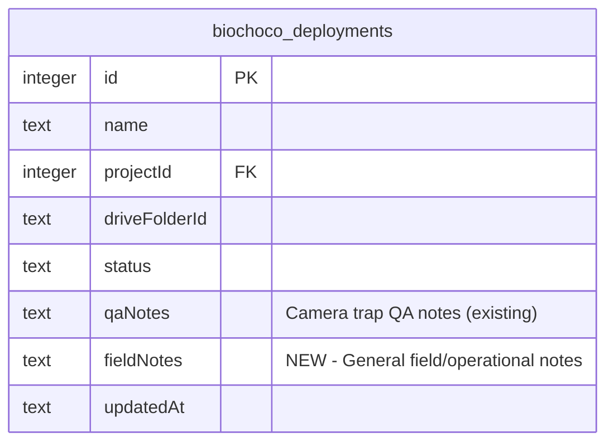

# feat: Add deployment field notes to Biochoco

## Overview

Add a `fieldNotes` text field to Biochoco deployments so staff can record field context — equipment issues, missing data explanations, environmental conditions — that currently lives in emails and chat. Editable in both the overview schedule table and data upload table via a popover editor. Displayed read-only in the camera trap deployment detail page alongside existing QA notes.

## Problem Statement

When field issues occur (e.g., a horse displaces an audio recorder's batteries at POT-009-V001), the explanation lives in emails/WhatsApp. Anyone reviewing data later has no way to know why data is missing. The portal needs a place to capture this context, tied to specific deployments.

## Proposed Solution

Simple `fieldNotes` text column on `biochoco_deployments`, matching the existing `qaNotes` pattern. A shared popover editor component for the two Biochoco tables. Read-only display in camera trap.

Key design decisions (from brainstorm):
- **Per deployment** (not per site) — data gaps are time-bound
- **Single text field** (not threaded log) — low-frequency editing
- **Separate from qaNotes** — field context vs camera QA concerns
- **SQLite DB** (not Google Sheet) — portal is source of truth
- **Auto-create deployment record** if none exists when saving a note

## Technical Approach

### Phase 1: Schema & Server Action

#### 1a. Add `fieldNotes` column to schema

**`src/db/schema.ts`** (~line 158, after `qaNotes`):
```ts
fieldNotes: text("field_notes"),
```

**`scripts/push-schema.mjs`** (add to migrations array ~line 496+):
```sql
ALTER TABLE biochoco_deployments ADD COLUMN field_notes TEXT
```

#### 1b. Server action: `updateDeploymentFieldNotes`

**New file: `src/app/biochoco/field-notes/actions.ts`**

```ts
"use server"

async function updateDeploymentFieldNotes(
  deploymentName: string,
  notes: string | null
): Promise<ActionResult> {
  // 1. requirePermission("biochoco", "editor")
  // 2. Validate: notes?.length <= 2000
  // 3. Trim whitespace, convert empty string to null
  // 4. Look up deployment by name + biochoco projectId
  // 5. If no record exists → create minimal record:
  //    { name: deploymentName, projectId: biochocoProjectId, fieldNotes: notes }
  // 6. If record exists → update fieldNotes + updatedAt
  // 7. revalidatePath for both /biochoco/overview and /biochoco/data
  // 8. Return ActionResult
}
```

**Identifying deployments by name**: The schedule table only has the string deployment name (e.g., `POT-009-V001`), not the DB integer id. The action accepts the name string and looks up via `(projectId, name)`. The `biochocoProjectId` is resolved via `getBiochocoProjectId()` (existing helper in resultados actions — may need to extract to shared location).

**Auto-create behavior**: When no DB record exists, create a minimal `biochoco_deployments` row with just `name`, `projectId`, and `fieldNotes`. All other fields (`driveFolderId`, `path`, `status`, etc.) remain null/default. Must audit that downstream queries handle null `driveFolderId` gracefully — see Audit section below.

#### 1c. Audit: null driveFolderId safety

Before implementing auto-create, verify these queries don't break with null `driveFolderId`:
- `src/app/biochoco/data/actions.ts` — Drive upload status queries
- `src/app/biochoco/data/drive-folder-actions.ts` — Drive folder operations
- `src/app/camera-trap/actions.ts` — deployment listing/filtering queries
- `src/app/biochoco/resultados/actions.ts` — site results aggregation

Expected: most queries filter on `status` or `cameraTrapProjectId`, so a minimal record with defaults should be safe. But verify before shipping.

### Phase 2: Data Flow

#### 2a. Extend enrichment query in overview actions

**`src/app/biochoco/overview/actions.ts`** (~line 25-39):

The existing DB query fetches `name` and `driveFolderId` to enrich schedule rows. Extend to also select `id` and `fieldNotes`:

```ts
// Current: SELECT name, drive_folder_id FROM biochoco_deployments WHERE project_id = ?
// New: SELECT id, name, drive_folder_id, field_notes FROM biochoco_deployments WHERE project_id = ?
```

Add `dbId?: number` and `fieldNotes?: string | null` to the enriched row data. This can be added to the `CombinedRow` type used internally by the schedule table, or to `ScheduleRow` in `src/lib/schedule-types.ts`.

**Recommendation**: Add to `ScheduleRow` since both the schedule table and data table consume it. Add as optional fields so other consumers aren't affected.

**`src/lib/schedule-types.ts`** (~line 23):
```ts
dbId?: number;
fieldNotes?: string | null;
```

#### 2b. Extend data page actions

**`src/app/biochoco/data/actions.ts`**: Same enrichment pattern — include `fieldNotes` in the DB query that populates upload status rows.

### Phase 3: UI Components

#### 3a. Shared popover editor component

**New file: `src/app/biochoco/field-notes/field-notes-popover.tsx`**

Client component. Reused in both tables.

```
Props:
  - deploymentName: string
  - initialNotes: string | null
  - canEdit: boolean

Behavior:
  - Icon button: MessageSquare (Lucide) — filled amber when notes exist, outline gray when empty
  - Click opens a Popover (use @radix-ui/react-popover or shadcn Popover)
  - Read-only mode (canEdit=false): shows note text, no textarea
  - Edit mode: textarea (maxLength=2000) + character counter + "Guardar" button (only when dirty)
  - Save calls updateDeploymentFieldNotes server action
  - On success: update local state, close popover
  - On error: show error message in popover
  - Label: "Notas de campo"
```

**Follow QA section patterns**: dirty state tracking, `useTransition` for save, Spanish labels.

#### 3b. Overview schedule table integration

**`src/app/biochoco/overview/schedule-table.tsx`**:

Add a new column (or augment an existing one) with the `FieldNotesPopover`. Pass `deploymentName`, `fieldNotes` from the row data, and `canEdit` based on user permissions.

**Permission flow**: The overview page currently checks `requirePermission("biochoco", "viewer")`. To determine `canEdit`, either:
- Pass user permission level from the server component page to the client table as a prop (preferred — matches camera-trap pattern at `page.tsx:42-46`)
- Or check permission in the server action only (simpler but no visual cue that editing is unavailable)

**Recommendation**: Pass `canEdit` boolean from the page server component. Compute via `getCurrentUser()` + permission check.

#### 3c. Data upload table integration

**`src/app/biochoco/data/upload-status-table.tsx`**:

Same `FieldNotesPopover` component. Add as a new column. Same `canEdit` prop pattern.

#### 3d. Camera trap detail page (read-only)

**`src/app/camera-trap/[id]/page.tsx`** (~line 154-184):

In the "Detalles" collapsible section, add a read-only field notes display if `deployment.fieldNotes` is non-null. Style similarly to the read-only QA notes (amber background, "Notas de campo" label, `whitespace-pre-wrap`). No new component needed — just a conditional `<div>` block.

Display regardless of biochoco permissions (the data is already on the deployment record which the user has access to view).

### Phase 4: CSV Export

**`src/app/biochoco/overview/schedule-table.tsx`** (CSV download function):

Add "Notas de campo" column to the CSV export, pulling from `row.fieldNotes`.

## ERD Changes



## Acceptance Criteria

- [x] New `field_notes` TEXT column on `biochoco_deployments` table
- [x] Migration in `scripts/push-schema.mjs` adds column to existing DBs
- [x] Server action `updateDeploymentFieldNotes` with `requirePermission("biochoco", "editor")`
- [x] Server action auto-creates minimal deployment record if none exists
- [x] Server action validates 2000 char limit server-side
- [x] Overview schedule table: note icon indicator (filled when notes exist)
- [x] Overview schedule table: click icon opens popover with editable textarea
- [x] Data upload table: same note icon + editable popover
- [x] Camera trap detail page: read-only field notes display alongside QA notes
- [x] Viewer-only users see notes but cannot edit (no textarea, no save button)
- [x] CSV export includes "Notas de campo" column
- [x] All UI labels in Spanish

## Files to Create/Modify

| File | Action | Description |
|---|---|---|
| `src/db/schema.ts` | Modify | Add `fieldNotes` column (~line 158) |
| `scripts/push-schema.mjs` | Modify | Add ALTER TABLE migration |
| `src/lib/schedule-types.ts` | Modify | Add `dbId` and `fieldNotes` optional fields |
| `src/app/biochoco/field-notes/actions.ts` | **Create** | Server action for saving field notes |
| `src/app/biochoco/field-notes/field-notes-popover.tsx` | **Create** | Shared popover editor component |
| `src/app/biochoco/overview/actions.ts` | Modify | Extend DB query to include `id` + `fieldNotes` |
| `src/app/biochoco/overview/schedule-table.tsx` | Modify | Add notes column with popover |
| `src/app/biochoco/overview/page.tsx` | Modify | Pass `canEdit` prop to schedule table |
| `src/app/biochoco/data/actions.ts` | Modify | Extend DB query to include `fieldNotes` |
| `src/app/biochoco/data/upload-status-table.tsx` | Modify | Add notes column with popover |
| `src/app/biochoco/data/page.tsx` | Modify | Pass `canEdit` prop to upload table |
| `src/app/camera-trap/[id]/page.tsx` | Modify | Add read-only field notes display |

## Dependencies & Risks

**Risk: Auto-created minimal deployment records**
Records with null `driveFolderId`, `path`, `status` etc. could surface unexpectedly in other queries (camera trap listing, data upload status, Drive operations). Mitigation: audit all queries against `biochoco_deployments` before shipping. Most filter on `status` or `cameraTrapProjectId` which would exclude these minimal records.

**Risk: Deployment name uniqueness**
There's no unique constraint on `(projectId, name)`. If duplicate names exist, the lookup-by-name could match the wrong record. Mitigation: check production data for duplicates. Add a unique index if safe.

**Dependency: Popover component**
Need `@radix-ui/react-popover` or shadcn Popover. Check if already in dependencies — if not, install.

## References

- **Brainstorm**: `docs/brainstorms/2026-04-04-deployment-field-notes-brainstorm.md`
- **QA notes pattern (model)**: `src/app/camera-trap/[id]/qa-section.tsx`, `src/app/camera-trap/actions.ts:1363`
- **Schema migrations learning**: `docs/solutions/database-issues/missing-alter-table-migrations-push-schema.md`
- **Security action patterns**: `docs/solutions/security-issues/phase2-code-review-12-findings.md`
- **Layout overflow learning**: `docs/solutions/ui-bugs/biochoco-overview-horizontal-scroll-map-overlap.md`
