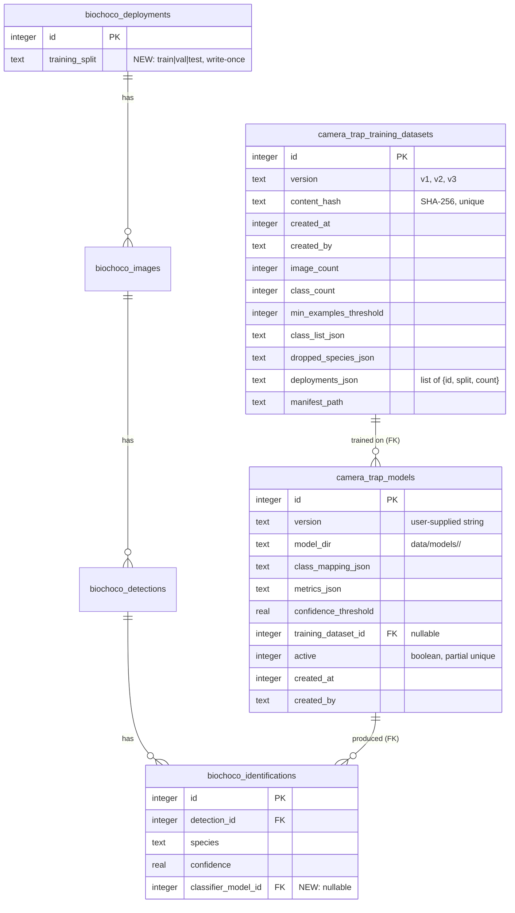

# Custom Chocó Species Classifier — Training Infrastructure

> **Plan-review revisions** (2026-04-08): cut ~40% scope after parallel review by DHH/Kieran/Simplicity reviewers. Notable changes vs. the brainstorm: (1) **monotonic versions** (`v1, v2, v3`) instead of semver — no auto-bump engine; (2) **confidence threshold applied at display time**, not in the Python model server, with a new `classifier_model_id` FK on `biochoco_identifications`; (3) join table for dataset↔deployment dropped in favor of a `deployments_json` column; (4) external training-repo work removed from this plan (will be a separate effort, contract documented here); (5) registration-by-directory instead of tar/zip upload; (6) phases collapsed 6→4. Brainstorm decisions on splits, class threshold, W&B-metrics-only, and "Sin identificar" surface label are unchanged.

## Overview

Build the infrastructure to fine-tune a Chocó-specific species classifier on human-verified camera trap images, replacing `AI4GAmazonRainforest` at the classification stage. MegaDetector stays as the class-agnostic detector; only the classifier is swapped.

**Portal scope** — three things:

1. **Dataset export** — versioned, reproducible training dataset derived from verified detections.
2. **Model registry** — DB of trained model versions with metrics, class list, confidence threshold, and active flag.
3. **Inference swap** — ML runner loads the active custom timm model when one exists.

**Out of scope** for this plan: the actual external training script. The portal defines a `metrics.json` contract that the future training repo must produce, but no portal-repo work is spent on training code, W&B setup, or skeleton training scripts. That happens when someone sits down to train the first model.

See the [brainstorm](../brainstorms/2026-04-08-custom-species-classifier-training-brainstorm.md) for the full decision history.

## Problem Statement

The current pipeline uses MegaDetector for detection and AI4GAmazonRainforest for classification. AI4G was trained on Amazon rainforest species and is a poor match for Chocó biodiversity. FCAT has accumulated thousands of human-verified identifications via the existing verification UI, and a classifier fine-tuned on that data should dramatically outperform AI4G for Chocó species.

This is an iterative system: as monitoring data and collaborator data arrive, the classifier should be retrained periodically. Train/val/test splits must stay stable across years so model-version comparisons remain honest. Eventually FCAT plans to release the trained classifier publicly; the registry records provenance from day one.

## Architecture

```
┌──────────────────────────────────────────────────────────────┐
│                    fcat-portal (Next.js)                     │
│                                                              │
│   Verification UI ──────────► biochoco_identifications       │
│   (existing)                  (verified + corrected labels)  │
│                                       │                      │
│                                       ▼                      │
│   /camera-trap/training-exports                              │
│   "Export" → exporter action ─►  camera_trap_training_       │
│                                  datasets (manifest + hash)  │
│                                       │                      │
│                                       ▼                      │
│                              data/training-exports/          │
│                                v1/                           │
│                                ├── manifest.json             │
│                                ├── train/<species>/*.jpg     │
│                                ├── val/<species>/*.jpg       │
│                                └── test/<species>/*.jpg      │
│                                                              │
│                                       │  (user rsync)        │
└───────────────────────────────────────┼──────────────────────┘
                                        ▼
                  ┌──────────────────────────────────────┐
                  │  External training repo (NOT this plan)
                  │  Mac MPS or GPU droplet              │
                  │  Produces:                           │
                  │   - weights.pt                       │
                  │   - metrics.json   (CONTRACT below)  │
                  │   - class_mapping.json               │
                  └───────────────┬──────────────────────┘
                                  │ rsync to data/models/<version>/
                                  ▼
┌──────────────────────────────────────────────────────────────┐
│                    fcat-portal (Next.js)                     │
│                                                              │
│   /admin/ct-models   ─────►  camera_trap_models              │
│   (lists unregistered                                        │
│    dirs + Register button)                                   │
│         │                                                    │
│         │  "Set active"                                      │
│         ▼                                                    │
│   ML runner → spawnModelServer reads active model row        │
│             → passes weights path + class mapping via env    │
│                                                              │
│   model-server.py:                                           │
│     load_models("custom_timm") → TimmClassifier wrapper      │
│     Stores raw species + confidence on identifications.      │
│                                                              │
│   biochoco_identifications.classifier_model_id ◄─ FK         │
│                                                              │
│   Display layer: displaySpecies(ident, model)                │
│     If confidence < model.confidence_threshold,              │
│       render "Sin identificar — baja confianza"              │
│     Else render species name.                                │
└──────────────────────────────────────────────────────────────┘
```

### ERD (new + changed objects only)



## Schema Changes

### Edits to `src/db/schema.ts`

**1. Add `trainingSplit` to `deployments`** (after line ~187):

```ts
trainingSplit: text("training_split", { enum: ["train", "val", "test"] }),
```

Nullable. Set once by the exporter via `sha256(deploymentId) % 100` (0–69 train, 70–84 val, 85+ test). Never overwritten. No admin UI for overrides in v1 — if a manual override is ever needed, run a one-line SQL update.

**2. Add `classifierModelId` to `identifications`**:

```ts
classifierModelId: integer("classifier_model_id").references(
  () => cameraTrapModels.id,
  { onDelete: "set null" }
),
```

Nullable so existing AI4G-produced identifications keep working with `null`. New identifications produced under a custom model get the FK populated.

**3. New table `cameraTrapTrainingDatasets`**:

```ts
export const cameraTrapTrainingDatasets = sqliteTable(
  "camera_trap_training_datasets",
  {
    id: integer("id").primaryKey({ autoIncrement: true }),
    version: text("version").notNull().unique(),
    contentHash: text("content_hash").notNull().unique(),
    createdAt: integer("created_at", { mode: "timestamp" })
      .notNull()
      .default(sql`(unixepoch())`),
    createdBy: text("created_by").notNull(),
    imageCount: integer("image_count").notNull(),
    classCount: integer("class_count").notNull(),
    minExamplesThreshold: integer("min_examples_threshold").notNull(),
    classListJson: text("class_list_json").notNull(),
    droppedSpeciesJson: text("dropped_species_json").notNull(),
    deploymentsJson: text("deployments_json").notNull(),
    manifestPath: text("manifest_path").notNull(),
  }
);
```

Note: no join table. Dataset↔deployment relationships live in `deploymentsJson` as a serialized array of `{id, split, imageCount}` objects. The manifest on disk is the canonical record; this column is for fast UI rendering of the history table.

**4. New table `cameraTrapModels`**:

```ts
export const cameraTrapModels = sqliteTable(
  "camera_trap_models",
  {
    id: integer("id").primaryKey({ autoIncrement: true }),
    version: text("version").notNull().unique(),
    modelDir: text("model_dir").notNull(),
    classMappingJson: text("class_mapping_json").notNull(),
    metricsJson: text("metrics_json").notNull(),
    confidenceThreshold: real("confidence_threshold").notNull(),
    trainingDatasetId: integer("training_dataset_id").references(
      () => cameraTrapTrainingDatasets.id,
      { onDelete: "set null" }
    ),
    active: integer("active", { mode: "boolean" }).notNull().default(false),
    createdAt: integer("created_at", { mode: "timestamp" })
      .notNull()
      .default(sql`(unixepoch())`),
    createdBy: text("created_by").notNull(),
  },
  (table) => [
    uniqueIndex("idx_camera_trap_models_active")
      .on(table.active)
      .where(sql`active = 1`),
  ]
);
```

The partial unique index enforces at most one active model.

**5. Type exports** at the bottom:

```ts
export type CameraTrapTrainingDataset = typeof cameraTrapTrainingDatasets.$inferSelect;
export type NewCameraTrapTrainingDataset = typeof cameraTrapTrainingDatasets.$inferInsert;
export type CameraTrapModel = typeof cameraTrapModels.$inferSelect;
export type NewCameraTrapModel = typeof cameraTrapModels.$inferInsert;
```

### Edits to `scripts/push-schema.mjs`

- Add `CREATE TABLE IF NOT EXISTS` for both new tables.
- Add to the `migrations` array (per `docs/solutions/database-issues/missing-alter-table-migrations-push-schema.md`):
  ```js
  `ALTER TABLE biochoco_deployments ADD COLUMN training_split TEXT`,
  `ALTER TABLE biochoco_identifications ADD COLUMN classifier_model_id INTEGER REFERENCES camera_trap_models(id) ON DELETE SET NULL`,
  ```
- Test against both a fresh DB and a copy of production DB before merging.

## Versioning Strategy (Revised)

**Versions are monotonic, not semver.** The exporter produces `v1`, `v2`, `v3`, etc., bumped by 1 each time the `contentHash` changes. The history table renders sort-by-`createdAt` and shows image counts and class counts so the user can see what changed at a glance — no need to encode change-type in the version string.

**Reproducibility**: if a new export's `contentHash` matches an existing row, return early with `{ status: "unchanged", version: existing.version }`. No new files written, no new row.

**Why this differs from the brainstorm**: the brainstorm landed on semver after the user requested it mid-conversation. Plan review surfaced that auto-bumping MAJOR/MINOR/PATCH is a meaningful subsystem (rules + helper file + 4 acceptance tests) for ~10 datasets over the project's lifetime. The information value of "v3 bumped MAJOR because the class list grew" is fully captured by `class_count` + `created_at` in the history table at zero implementation cost. Cut.

## Content Hash (Revised)

Deterministic SHA-256 over a **JSON-serialized** canonical structure (not pipe-joined strings — `correctedSpecies` is user-typed and could contain `|`). Includes a `splitStrategyVersion` constant so any future change to the split-assignment algorithm bumps the hash deliberately.

```ts
function computeContentHash(input: {
  rows: Array<{ imageId: number; finalLabel: string; deploymentId: number; split: "train" | "val" | "test" }>;
  minExamples: number;
  classList: string[];
}): string {
  const sortedRows = [...input.rows]
    .sort((a, b) => a.imageId - b.imageId)
    .map((r) => [r.imageId, r.finalLabel, r.deploymentId, r.split]); // tuple form, smaller
  const canonical = JSON.stringify({
    splitStrategyVersion: 1,
    minExamples: input.minExamples,
    classList: [...input.classList].sort(),
    rows: sortedRows,
  });
  return crypto.createHash("sha256").update(canonical).digest("hex");
}
```

Pure function, fully unit-testable, no escaping ambiguity.

## Confidence Threshold at Display Time

This is the biggest correctness change vs. the original plan and the brainstorm.

**Old plan**: rewrite `species="Sin identificar"` inside `model-server.py:detections_from_result` based on a confidence threshold. Persist the rewritten label.

**Problems**:
1. Re-tuning the threshold requires reprocessing every deployment.
2. The original top-1 prediction is lost forever — can't audit what the model actually thought.
3. Future "show me detections where the model guessed jaguar but confidence was 0.3–0.55" queries become impossible.

**New plan**: store the raw top-1 prediction and raw confidence on `biochoco_identifications` (as today). Add a `classifier_model_id` FK so each identification knows which model produced it. Apply the threshold at **read time** via a small helper:

```ts
// src/lib/display-species.ts
export function displaySpecies(
  ident: { species: string; confidence: number; classifierModelId: number | null },
  modelById: Map<number, { confidenceThreshold: number }>,
): { label: string; lowConfidence: boolean } {
  if (ident.classifierModelId == null) {
    // Legacy AI4G ident — no per-model threshold, return as-is
    return { label: ident.species, lowConfidence: false };
  }
  const model = modelById.get(ident.classifierModelId);
  if (!model || ident.confidence >= model.confidenceThreshold) {
    return { label: ident.species, lowConfidence: false };
  }
  return { label: "Sin identificar", lowConfidence: true };
}
```

Used by both the results view and the verification UI. **The threshold becomes a tunable parameter** — admin can change `camera_trap_models.confidence_threshold` and the display updates immediately, no reprocessing.

## Implementation Phases

### Phase 1 — Schema + migrations

**Files**:
- `src/db/schema.ts` (edit — new column on deployments, new column on identifications, two new tables, type exports)
- `scripts/push-schema.mjs` (edit — CREATE TABLE for two new tables, ALTER TABLE for two new columns in the migrations array)
- `tests/unit/schema-migrations.test.ts` (new — assert idempotent runs against fresh DB and a copy of an existing DB)

**Acceptance**:
- [x] `node scripts/push-schema.mjs` succeeds against a fresh DB.
- [x] Same script succeeds against a snapshot of production DB without errors.
- [x] Inserting a second `camera_trap_models` row with `active=true` while another active row exists fails with the partial unique index.
- [x] `npm run lint` and `npm run build` pass.

### Phase 2 — Dataset exporter (backend + minimal trigger UI)

**Files**:
- `src/app/camera-trap/training-exports/actions.ts` (new) — single file containing:
  - `exportTrainingDataset(formData)` server action — `requireAdmin()`, returns `ActionResult<{datasetId, version, status}>`.
  - Internal helpers: `assignSplit`, `computeContentHash`, `speciesSlug`, `cropFromBbox`, `buildManifest`. Inlined, not split into a separate folder. Pure helpers exported for unit testing.
  - Reuses `processing_jobs` with `jobType='training_export'` for progress surfacing. Spell out: `totalImages` = number of crops to write, `processedImages` = crops written so far, cancellation by setting `status='cancelled'` and exiting the loop on next check.
- `src/app/camera-trap/training-exports/page.tsx` (new) — server component, lists prior datasets with version, createdAt, imageCount, classCount, and a download link to the manifest. Includes a small form (`minExamples` input + Export button) at the top. `requireAdmin()`.
- `src/app/camera-trap/training-exports/export-form.tsx` (new) — client component for the form.
- `tests/unit/training-export.test.ts` (new) — pure helpers.
- `tests/integration/training-export.test.ts` (new) — full export round trip on a fixture DB.

**Exporter steps** (prose, not code):

1. Query verified animal detections (`verificationStatus IN ('verified','corrected')` AND `detectionClass = 0` AND `excluded = 0`). Effective label = `correctedSpecies ?? species`.
2. Auto-assign `training_split` for any deployment where it's still null. Use `sha256(String(deploymentId))[0..3] % 100`. Persist write-once.
3. Group by effective label; drop labels below `minExamples`. Compute `classList` (sorted, ≥threshold) and `droppedSpecies` (label → count, < threshold).
4. Filter rows to only those whose label is in `classList`.
5. Compute `contentHash` (see Content Hash section above). If a row with this hash already exists, return `status: "unchanged"` with that version. Done.
6. Compute next version: `v${maxId + 1}` (or `v1` if none exist).
7. Crop images: for each row, resolve image bytes (local path first, Drive fallback via existing `fetchImageBuffer` path), crop with `sharp` using normalized bbox + 5% padding, resize long-edge to 512px, save as JPEG quality 90 to `data/training-exports/<version>/<split>/<speciesSlug>/<detectionId>.jpg`. Skip and increment a warning counter on failures; don't abort.
8. Build slim manifest (no `perImage` array — the filesystem layout is the index). Write to `data/training-exports/<version>/manifest.json`.
9. Insert the dataset row using a **synchronous** transaction (per the better-sqlite3 gotcha). Update `processing_jobs` row to `status='completed'`.
10. Return `{ datasetId, version, status: "created" }`.

**Manifest schema** (slim):

```json
{
  "version": "v1",
  "contentHash": "sha256:...",
  "createdAt": "2026-04-08T14:23:01Z",
  "createdBy": "luke@fcat-ecuador.org",
  "splitStrategyVersion": 1,
  "minExamplesThreshold": 50,
  "classList": ["leopardus_pardalis", "puma_concolor", "..."],
  "droppedSpecies": { "puma_yagouaroundi": 12, "tapirus_bairdii": 7 },
  "counts": {
    "total": 12450,
    "train": 8730,
    "val": 1870,
    "test": 1850,
    "perClass": { "leopardus_pardalis": { "train": 1840, "val": 395, "test": 388 } }
  },
  "deployments": [
    { "id": 42, "split": "train", "imageCount": 234 }
  ],
  "warnings": []
}
```

**`speciesSlug` is its own exported function with a unit test** because three places (filesystem, class mapping, manifest) must agree byte-for-byte. Drift = silent training failures.

**Acceptance**:
- [ ] Fixture export of 200 detections / 4 deployments / 6 species produces correct file tree. *(deferred — manual end-to-end verification only; no integration test fixture in v1)*
- [x] Re-running with no changes → `status: "unchanged"`. *(implemented via contentHash short-circuit; covered by hash-determinism unit tests)*
- [x] Correcting a label → new version, hash differs. *(unit-tested via "changes when a label changes")*
- [x] Adding new deployment → new version, splits stable for old deployments. *(write-once persisted before hash; new deployments get fresh assignSplit)*
- [x] Lowering `minExamples` so a new species crosses threshold → new version, `classList` grows. *(unit-tested via "changes when minExamples changes")*
- [x] `dropped_species_json` correctly lists below-threshold species and their counts.
- [x] `speciesSlug("Leopardus pardalis") === "leopardus_pardalis"` (and unit-tested for edge cases — multi-word, hyphens, accents).
- [x] Hash function is deterministic across 10 consecutive runs on identical input.
- [x] Hash function rejects label-collision attempt: a label containing `|` does not collide with another label.
- [x] Admin-only access enforced (`requireAdmin()` in both action and page).

### Phase 3 — Model registry (register from directory + activate)

**Files**:
- `src/app/admin/ct-models/page.tsx` (new) — server component, `requireAdmin()`. Two sections:
  - Registered models table: version, training dataset version, top1 accuracy, confidence threshold, active status, "Set active" / "Delete" buttons.
  - Unregistered model directories: scans `data/models/` for subdirs not yet in `camera_trap_models`, lists them with a "Register" button per directory.
- `src/app/admin/ct-models/actions.ts` (new):
  - `registerModelFromDir(dirName)` — reads `data/models/<dirName>/{weights.pt, metrics.json, class_mapping.json}`. Validates the contract (see below). Inserts row with `active=false`.
  - `setActiveModel(modelId)` — refuses if any `processing_jobs.status` is `running`. Otherwise, in a sync transaction: UPDATE all rows SET active=false, then UPDATE target SET active=true. Calls `shutdownModelServer()` so the next job re-spawns with the new env vars. Logs to `activity_log`.
  - `deleteModel(modelId)` — refuses if active.
- `src/app/admin/ct-models/models-table.tsx` (new) — client component for the table.
- `src/app/admin/ct-models/register-button.tsx` (new) — small client component.
- `tests/integration/ct-models-register.test.ts` (new).

**`metrics.json` contract** (validated at registration time, hard-fail on any mismatch):

```json
{
  "modelVersion": "v1",
  "trainingDatasetVersion": "v3",
  "trainingDatasetContentHash": "sha256:...",
  "backbone": "efficientnet_b0",
  "transform": {
    "imageSize": 224,
    "mean": [0.485, 0.456, 0.406],
    "std": [0.229, 0.224, 0.225]
  },
  "recommendedConfidenceThreshold": 0.55,
  "overall": {
    "top1Accuracy": 0.873,
    "macroF1": 0.812
  },
  "perClass": {
    "leopardus_pardalis": { "precision": 0.91, "recall": 0.88, "f1": 0.895, "support": 388 }
  },
  "classListOrdered": ["leopardus_pardalis", "puma_concolor"]
}
```

**Validation rules** (all hard-fail):
1. All required fields present.
2. `class_mapping.json[i] === metrics.classListOrdered[i]` for every `i` (silent class drift = catastrophic).
3. `modelVersion` is unique vs. existing rows.
4. `weights.pt` exists and is non-empty.
5. `trainingDatasetContentHash` matches an existing `camera_trap_training_datasets.contentHash`. **Hard-fail with override**: an `--allow-untracked` form-field checkbox lets an admin register a model trained on an ad-hoc dataset, but the default is reject. (Per Kieran's review — provenance is a headline feature and shouldn't be soft.)

**Why register-from-directory instead of upload**: weights files are large, model uploads happen quarterly at most, and the existing portal has no other multipart-upload paths. SCP'ing files into `data/models/<version>/` and clicking Register is simpler than building a tar parser, validation, extraction logic, and error UX. Add `data/models/` to the existing Docker volume mount (already covered by the `data:` volume).

**Acceptance**:
- [x] Admin can `scp` a model directory to `data/models/v1/`, see it in the unregistered list, click Register, and see it appear in the registered table as inactive.
- [x] Validation fails loudly on missing files, invalid JSON, class mapping mismatch, untracked dataset hash (without override), or duplicate version.
- [x] "Set active" with a running job is refused with a clear error.
- [x] "Set active" with no running jobs deactivates others and triggers `shutdownModelServer()`.
- [x] Deleting an active model is refused.

### Phase 4 — Inference swap + low-confidence display

**Files**:
- `src/lib/ml-runner.ts` (edit) — `spawnModelServer()` queries `camera_trap_models` for the active row, passes env vars (`CLASSIFIER_MODEL=custom_timm`, `CUSTOM_CLASSIFIER_WEIGHTS`, `CUSTOM_CLASSIFIER_CLASS_MAPPING`, `CUSTOM_CLASSIFIER_BACKBONE`, `CUSTOM_CLASSIFIER_TRANSFORM_JSON`). When persisting new identifications in the line handler, set `classifierModelId` to the active model's id.
- `scripts/model-server.py` (edit) — new branch in `load_models()` for `classifier_name == "custom_timm"`. New `TimmClassifier` wrapper class (renamed from `CustomTimmClassifier` per Kieran review) matching the existing `single_image_classification(cropped_array) → {prediction, confidence}` shape. **Loads transform config from env-supplied JSON** (image size + mean + std), not from `timm.data.resolve_model_data_config` defaults — this prevents silent accuracy regression when fine-tuning with non-default augs. Uses `model.load_state_dict(state, strict=True)` to fail loudly on any key mismatch.
- `scripts/ensure-ml-venv.sh` (edit) — add `timm` to the install. `timm` is pure-Python on top of torch; no new native deps. Verify import after install (per the `pytorchwildlife-docker-install-failures` lesson).
- `src/lib/display-species.ts` (new) — the `displaySpecies(ident, modelById)` helper described above. Pure function, unit tested.
- `src/app/camera-trap/results/[id]/results-client.tsx` (edit) — call `displaySpecies` instead of rendering `species` directly. Pre-fetch the active model row in the page server component and pass it through. When `lowConfidence === true`, render with a muted color and a "Baja confianza" badge.
- `src/app/camera-trap/results/[id]/page.tsx` (edit) — query active model and pass to client.
- (No changes to verification UI in this PR — the existing flow already surfaces low-confidence predictions in the unverified queue. The display helper makes them visually distinct, which is enough for v1.)
- `tests/unit/display-species.test.ts` (new).
- `tests/unit/ml-runner-env-assembly.test.ts` (new) — pure test of the env-var assembly logic, no Python spawn.

**No toy-model integration test in this phase.** Per Simplicity review: spawning a Python server with a fake torch model and asserting code paths is a full day of fixture plumbing for a brittle test. Replace with: (a) pure unit test of the env-var assembly, (b) manual end-to-end verification with a real model from the external training repo when one exists.

**Acceptance**:
- [x] With no active model, the ML pipeline behaves identically to current (`buildClassifierEnv(null)` falls back to AI4G default; existing ml-runner unit tests still pass).
- [x] With an active custom model, `spawnModelServer` env vars include the right paths and JSON. *(Unit-tested in `ml-runner-env.test.ts`.)*
- [x] `displaySpecies` returns `lowConfidence: true` when `confidence < threshold` AND `classifierModelId` is set.
- [x] `displaySpecies` returns the raw species when `classifierModelId` is null (legacy AI4G compatibility).
- [x] Setting a new active model triggers `shutdownModelServer()` so the next job picks up the new weights. *(Phase 3 — already wired in `setActiveModel` action.)*
- [x] Verification UI continues to work — low-confidence identifications collapse into "Sin identificar" in the species filter and remain in the unverified queue.
- [ ] Manual verification: with a real model loaded, run inference on a test deployment, confirm raw predictions land in `biochoco_identifications` with `classifier_model_id` set, and the results UI renders "Sin identificar" for sub-threshold predictions. *(Deferred — pending the first trained model from the external training repo.)*

## Acceptance Criteria (overall)

### Functional
- [ ] Admin can export a versioned training dataset from the web UI.
- [ ] Exports are reproducible — same verified data → same `contentHash` → `status: "unchanged"`.
- [ ] Splits are locked at the deployment level and survive re-exports.
- [ ] Admin can `scp` a trained model directory and register it from the UI.
- [ ] "Set active" swaps the model into the inference pipeline (next job).
- [ ] MegaDetector detections continue to appear when a custom model is active.
- [ ] Low-confidence custom-classifier predictions render as "Sin identificar — baja confianza" and flow into human verification.
- [ ] Confidence threshold can be tuned by editing `camera_trap_models.confidence_threshold` and the display updates immediately, no reprocessing.

### Non-Functional
- [ ] Only new dependency: `timm` in the Python venv. No new Node deps.
- [ ] Dataset export of 10K images completes in < 10 minutes on a 4-vCPU droplet.
- [ ] Model registration UI requires `requireAdmin()`.
- [ ] No regression in inference latency when no custom model is active.

### Quality Gates
- [ ] All pure helpers (hash, split, slug, env assembly, display) have unit tests.
- [ ] Schema migration tested against fresh + production-snapshot DBs.
- [ ] Class-mapping ↔ classListOrdered hard-fail validation tested.
- [ ] `npm run lint` and `npm run test:run` clean.

## Dependencies & Risks

| Risk | Severity | Mitigation |
|---|---|---|
| **Sparse class distribution** — many Chocó species have < 50 verified examples | High | Exporter reports `dropped_species` counts with current values. Iterative retraining is the plan. Lower `minExamples` for the first model if needed — it's a parameter, not a constant. |
| **Confidence calibration is hard** — softmax probs are over-confident | Medium | Store the threshold per-model. With the display-time-threshold change, re-tuning is a single UPDATE, not a reprocess. Admin can iterate freely. |
| **Class-mapping drift** ("ocelot" labeled as "jaguar") | Critical | Hard-fail validation at registration time: `class_mapping.json[i] === metrics.classListOrdered[i]` for every `i`. `strict=True` on `load_state_dict`. |
| **Transform-config drift** (training augs differ from inference) | High | Transform stored in `metrics.json` and read at inference time. Don't depend on `timm.data.resolve_model_data_config` defaults. |
| **Async transaction crash** at runtime | High | Per `docs/solutions/runtime-errors/async-transaction-better-sqlite3-CameraTrap-20260223.md`, collect values first, then run synchronous `db.transaction(() => {...})`. |
| **Missing ALTER TABLE migration** breaks production deploys | High | Per `docs/solutions/database-issues/missing-alter-table-migrations-push-schema.md`, both new column migrations added and tested against a copy of production DB. |
| **Server/Client component serialization** — passing class instances breaks at runtime | Medium | All registry data resolved on the server, passed as plain POJOs. No Drizzle row objects across the boundary. |
| **Set active during running job** | Low | Refused with clear error. Admin retries after job completes. |

## What's Deferred (Explicitly Out of Scope)

- **External training repo** — separate work, contract documented in this plan via `metrics.json` schema.
- **In-portal training UI** — never. Training happens externally.
- **Eval dashboard in portal** — registry stores `metricsJson` so this can be added later with no schema change.
- **Collaborator data import workflow.**
- **Manual split override admin action** — if needed, run SQL.
- **"Delete old exports" / retention policy** — `rm -rf` works fine for the first year.
- **Tar/zip upload UI** — register-from-directory pattern instead.
- **Auto-computed semver bumps** — monotonic versions are sufficient.
- **Multi-model A/B inference.**
- **Detector retraining.**
- **Model card / public release packaging** — registry stores enough metadata that this can be added later.
- **Toy-model spawn integration test in Phase 4** — manual verification with a real model is sufficient.

## References

### Internal
- Brainstorm: [docs/brainstorms/2026-04-08-custom-species-classifier-training-brainstorm.md](../brainstorms/2026-04-08-custom-species-classifier-training-brainstorm.md)
- Schema: `src/db/schema.ts` (deployments `128-199`, identifications `359-381`, species `387-402`)
- ML runner: `src/lib/ml-runner.ts` (env vars `345-346`, spawn `314-360`, identification insert `447-461`)
- Python model server: `scripts/model-server.py` (`load_models` `64-123`, `detections_from_result` `151-220`)
- Existing camtrap export pattern: `src/app/api/camera-trap/export/route.ts` (label resolution `338-341`)
- Schema migration runner: `scripts/push-schema.mjs`
- ML defaults: `src/lib/ml-defaults.ts:5-11`
- Sharp usage pattern: `src/lib/thumbnail.ts`
- Verification UI: `src/app/camera-trap/results/[id]/results-client.tsx`

### Learnings to apply
- [Async transaction with better-sqlite3](../solutions/runtime-errors/async-transaction-better-sqlite3-CameraTrap-20260223.md) — synchronous transactions only.
- [Missing ALTER TABLE migrations](../solutions/database-issues/missing-alter-table-migrations-push-schema.md) — migrations array entries required for new columns.
- [PytorchWildlife Docker install failures](../solutions/build-errors/pytorchwildlife-docker-install-failures.md) — verify imports after install (`uv pip install --reinstall-package` if needed).

### External (no external research — well-understood tech)
- [timm docs](https://huggingface.co/docs/timm/index)
- [torchvision ImageFolder](https://pytorch.org/vision/stable/generated/torchvision.datasets.ImageFolder.html)

## Implementer Notes

- **Phases 1-3 ship with no inference changes** — the registry can fill up with models that nobody is using yet. Phase 4 flips the switch.
- **No external training repo work in this plan.** When someone wants to train the first model, they consume `manifest.json` from a Phase 2 export and produce the artifacts the Phase 3 validator expects. That's a different repo and a different effort.
- **When in doubt about complexity, defer.** Brainstorm + plan review both deferred a lot of things deliberately. Resist re-adding them.
