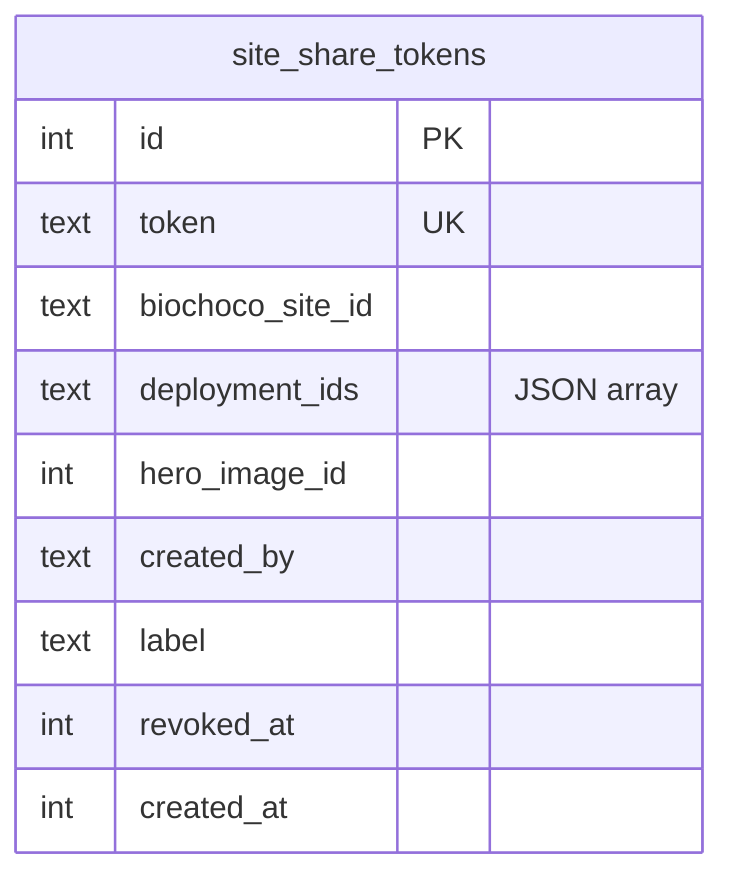

# Biochoco Site Landowner Share Links

## Overview

A WhatsApp-friendly public share link for the biochoco per-site results page (`/biochoco/resultados/[siteId]`, e.g. `NAC-005`). FCAT staff generate one URL per site and send it to the landowner; the landowner opens it on their phone, browses every verified camera trap image from their farm, and saves individual photos to their device. The public view aggregates camera trap fauna, habitat data, and temperature across all deployments at that site. Audio is hidden in v1 (no annotations yet).

This builds on the `/public/*` infrastructure already shipped in the 2026-02-28 plan (nginx bypass, public layout, `share_tokens` table, public CT image API). This plan adds a **site-scoped parallel path** without touching the existing CT-deployment-scoped share feature.

## Problem Statement

FCAT monitors biodiversity on private farms in the Chocó region. Landowners host the camera traps, ARUs, iButton loggers, and habitat plots but have no way to see what was captured on their own land. Staff currently send screenshots manually — high friction, low engagement. The existing CT-deployment share link is scoped to one camera + one visit; a landowner cares about "what happened on my farm this season," which spans multiple deployments plus habitat and temperature. The right unit of sharing is the **site**, not a single deployment.

Constraints:
- Mobile-first: must render in WhatsApp's in-app browser on iOS and Android, **JS disabled friendly**
- Unauthenticated: landowners don't have Google accounts
- Save-to-phone: landowners want to download photos to share with friends
- Moderate sensitivity: hide GPS coordinate text, strip EXIF GPS, don't expose Drive links or staff emails
- Browse everything: full paginated gallery of every verified image, not curated highlights

## Proposed Solution

Add a new `/public/biochoco/[token]` route backed by a single new table `site_share_tokens`. At token creation time the staff action resolves the current deployments at the site (via the existing `deploymentToSiteId()` helper) and stores their IDs as a JSON array on the token row. The public image API validates each request by looking up the token, parsing the deployment list, and checking that the requested image belongs to one of them.

The public page composes a new lightweight shell (`PublicSiteShell`) from a freshly-extracted presentational `SiteResultsContent` component. The existing internal `SiteDetailShell` is refactored to compose the same `SiteResultsContent` — no `isPublic` prop, no scattered conditional chrome.

Browsing a species' full image set happens on a **server-rendered sub-route** (`/public/biochoco/[token]/especies/[slug]`), not a client modal. Plain `` grid, `<a>` pagination, `<a href="?size=large&download=true" download>` per tile. Works with JS disabled in WhatsApp's in-app browser.

A "Compartir" button on the internal site detail page (biochoco editors+) creates/copies/revokes the link via a server-rendered form.

## Technical Approach

### Architecture

```
Landowner taps link
  → nginx: location /public/ (NO auth_request)        ← already in place
  → proxy.ts: /public/ excluded from matcher          ← already in place
  → /public/biochoco/[token]/page.tsx
      ├─ fetchPublicSiteDetail(token)     (wrapped in React cache())
      ├─ token validated + deployment_ids parsed from JSON column
      └─ Renders <PublicSiteShell>
            └─ <SiteResultsContent>
                  ├─ <Fauna top-20 per species + link to /especies/[slug]>
                  ├─ <Habitat>
                  └─ <Temperature>

  → /public/biochoco/[token]/especies/[slug]/page.tsx
      ├─ Token validated, deployment_ids parsed
      ├─ Fetches all verified images for species across deployments
      └─ Renders server-side  grid + <a?page=N> pagination + <a download> per tile

  → /api/public/site-images/[token]/[id]
      ├─ Token validated (UUID v4, not revoked)
      ├─ Image row fetched; deployment_id checked against token's deployment_ids
      ├─ ?size=thumb → existing thumbnail pipeline
      ├─ ?size=large → on-the-fly sharp resize (≤1600px, q85), EXIF stripped
      ├─ ?download=true → Content-Disposition: attachment
      └─ Cache-Control: public, max-age=31536000, immutable
```

### Database Schema

One new table. Existing `share_tokens` (CT-deployment-scoped) is untouched.

```sql
CREATE TABLE IF NOT EXISTS site_share_tokens (
  id INTEGER PRIMARY KEY AUTOINCREMENT,
  token TEXT NOT NULL UNIQUE,
  biochoco_site_id TEXT NOT NULL,          -- ODK site_id, e.g. "NAC-005"
  deployment_ids TEXT NOT NULL,            -- JSON array, materialized at creation
  hero_image_id INTEGER,                   -- best image for OG preview
  created_by TEXT NOT NULL,
  label TEXT,
  revoked_at INTEGER,
  created_at INTEGER NOT NULL DEFAULT (unixepoch())
);
CREATE INDEX IF NOT EXISTS idx_site_share_tokens_token ON site_share_tokens(token);
CREATE UNIQUE INDEX IF NOT EXISTS idx_site_share_tokens_site_active
  ON site_share_tokens(biochoco_site_id) WHERE revoked_at IS NULL;
```

Key changes vs revision 1 (per plan_review):
- **No `site_share_token_deployments` join table.** `deployment_ids` is a JSON array on the token row. Handles the `deployments.siteName`-null fallback case correctly (some deployments map via name-pattern extraction, not `siteName`), which a pure SQL join would miss.
- **UNIQUE partial index** enforces one active token per site at the DB level. The create action handles the conflict by revoking the existing token first in the same transaction.
- **`hero_image_id` stored on the token** so OG image generation is deterministic and cache-friendly.
- **No FK cascade weirdness.** If a deployment is deleted, its ID still sits in `deployment_ids` harmlessly — the image lookup just 404s. Staff regenerates the link if they care.



### Shared utility: `src/lib/public-tokens.ts`

Extract the UUID v4 regex **now** (three copies incoming otherwise):

```ts
export const UUID_V4_REGEX = /^[0-9a-f]{8}-[0-9a-f]{4}-4[0-9a-f]{3}-[89ab][0-9a-f]{3}-[0-9a-f]{12}$/i;
export function isValidShareToken(token: unknown): token is string {
  return typeof token === "string" && UUID_V4_REGEX.test(token);
}
```

Migrate the existing inline copies at `src/app/public/share/[token]/page.tsx:20` and `src/app/api/public/ct-images/[token]/[id]/route.ts:27` in the same commit.

### Implementation Phases

#### Phase 1: Schema + Server Actions

**Goal:** DB table + create/revoke actions + token utility.

Tasks:
- [x] Add `siteShareTokens` table to `src/db/schema.ts` with the shape above and the unique partial index
- [x] Add matching `CREATE TABLE IF NOT EXISTS` + indexes to `scripts/push-schema.mjs`
- [x] Create `src/lib/public-tokens.ts` with `UUID_V4_REGEX` + `isValidShareToken`; migrate the two existing inline copies
- [x] Add to `src/app/biochoco/resultados/actions.ts`:
  - `createSiteShareLink(siteId: string, label?: string): Promise<ActionResult<{ token: string; url: string }>>`
  - `revokeSiteShareLink(siteId: string): Promise<ActionResult<void>>`
  - `getSiteShareLink(siteId: string)` — used by the internal page to populate the share button
  - `fetchSiteDetailByToken(token: string)` — wrapped in React `cache()`, returns site detail + deployment ID list + hero image ID
  - `fetchSpeciesImagesForDeployments(depIds, speciesName, page, pageSize)` and a token-gated wrapper `fetchSpeciesImagesByToken`
- [x] Unit tests:
  - `tests/unit/public-tokens.test.ts` — 10 tests covering token validation
  - `tests/unit/site-share-tokens-schema.test.ts` — 6 tests locking in the unique partial index behavior (one active token per site, allows revoke+recreate, allows different sites simultaneously, token uniqueness across revoked rows)

Files:
- `src/db/schema.ts`
- `scripts/push-schema.mjs`
- `src/lib/public-tokens.ts` (new)
- `src/app/biochoco/resultados/actions.ts`
- `src/app/public/share/[token]/page.tsx` (migrate UUID regex)
- `src/app/api/public/ct-images/[token]/[id]/route.ts` (migrate UUID regex)
- Tests alongside `actions.ts`

**Pre-flight check:** verify deployment deletion is hard-delete (not soft). `grep -rn "delete.*deployments\|deployments.*delete" src/` — if soft-delete is used, the null-safety on missing IDs already holds (nothing references them), so the JSON-array approach still works.

#### Phase 2: Shell Extraction + Public Image API

**Goal:** Refactor `SiteDetailShell` to expose `SiteResultsContent`, and serve public images.

**2a. Extract `SiteResultsContent` (pure, behavior-preserving)**

- [x] Create `src/app/biochoco/resultados/[siteId]/site-results-content.tsx` — presentational, accepts:
  ```ts
  type Props = {
    data: SiteDetail;
    resolveImageUrl: (imageId: number, size: "thumb" | "large") => string;
    speciesHref: (speciesName: string) => string | null;  // null = no link (internal view can omit)
    variant: "internal" | "public";  // controls section ORDER only
  };
  ```
  Internal variant: Habitat → Fauna → Temperatura → Audio placeholder (current order, unchanged for safety)
  Public variant: **Fauna → Hábitat → Temperatura** (no Audio)
- [x] `SiteDetailShell` now composes `<SiteResultsContent variant="internal" resolveImageUrl={(id, size) => \`/api/ct-images/\${id}?size=\${size}\`} speciesHref={null} ... />` and keeps its own chrome: breadcrumb, header with GPS, share button slot
- [x] No behavior change to the internal page in this sub-phase
- [x] `resolveImageUrl` is passed as a function, not an `{isPublic, token}` tuple — child components never learn about "public"
- [x] `SpeciesCards`, `HabitatSection`, `TemperatureOverlay` updated with optional `resolveImageUrl` / `speciesHref` / `showPhotos` / `showChart` / `showDeploymentLinks` props (each defaults to current behavior, so the internal page is unchanged)

**2b. Public image API**

- [x] Create `src/app/api/public/site-images/[token]/[id]/route.ts`:
  - Validate token via `isValidShareToken`
  - Parse `id` as integer
  - Parse `?size=thumb|large` (default `thumb`), `?download=1`
  - Query 1: `SELECT deployment_ids FROM site_share_tokens WHERE token = ? AND revoked_at IS NULL`
  - Parse `deployment_ids` JSON
  - Query 2: `SELECT id, deployment_id, path, drive_file_id FROM images WHERE id = ? AND deployment_id IN (...)` — returns empty on cross-site attempts
  - `thumb` → reuse `getOrGenerateThumbnail()` (same pipeline as the existing CT public API)
  - `large` → **on-the-fly** `sharp` resize (max edge 1600, JPEG q85, `rotate()` to honor orientation, no metadata output). No new disk cache directory — HTTP cache + nginx handles it. If perf is an issue later, add caching then.
  - `?download=1` → `Content-Disposition: attachment; filename="<sanitized>.jpg"`
    - Filename: `FCAT-${siteId}-${imageId}.jpg` — simple, deterministic, no multi-species ambiguity. (Open question #4 resolved: don't try to embed species name, since one image can have multiple verified identifications.)
  - Headers: `Cache-Control: public, max-age=31536000, immutable`, `Content-Type: image/jpeg`, `X-Content-Type-Options: nosniff`
- [x] Test: create a token for site A, request an image ID from site B's deployment → 404 (`tests/unit/api-public-site-images.test.ts` — 13 tests covering token validation, JSON parsing, cross-site rejection, thumb happy path, large+download)

Files:
- `src/app/biochoco/resultados/[siteId]/site-results-content.tsx` (new)
- `src/app/biochoco/resultados/[siteId]/site-detail-shell.tsx` (delegate to new component)
- `src/app/api/public/site-images/[token]/[id]/route.ts` (new)
- `package.json` — verify `sharp` is present (Phase 1 pre-flight)

**Naming note (per Kieran):** the new API lives at `/api/public/site-images/…`, parallel to the existing `/api/public/ct-images/…`. No `biochoco-` prefix in the URL — that's a domain leak.

#### Phase 3: Public Page + Species Sub-route

**Goal:** Ship the public-facing pages. Both fully server-rendered.

**3a. Public landing page**

- [ ] Create `src/app/public/biochoco/[token]/public-site-shell.tsx` — simple component:
  - Header: site name, site code (`NAC-005`), date range, compact stat line (`🐾 8 especies · 📷 54 días · 🌡️ 21.4°C promedio · 🌳 85% dosel`) — reuses whatever inline formatting is convenient. **No separate `StatBar` component** (out of scope — follow-up if staff want a dashboard-wide refactor).
  - No breadcrumb, no GPS text, no `SiteLocationMap`, no share button
  - `<SiteResultsContent variant="public" resolveImageUrl={(id, size) => \`/api/public/site-images/${token}/${id}?size=${size}\`} speciesHref={(name) => \`/public/biochoco/${token}/especies/${slugify(name)}\`} />`
- [ ] Create `src/app/public/biochoco/[token]/page.tsx`:
  - `const data = await fetchSiteDetailByToken(token)` (already `cache()`-wrapped)
  - If null/revoked/invalid → friendly Spanish error: "Este enlace ya no es válido"
  - Renders `<PublicSiteShell data={data} token={token} />`
- [ ] `generateMetadata({ params })`:
  - Same cached call
  - `title`: `${siteName} — Portal FCAT`
  - `description`: `${speciesCount} especies detectadas en ${deploymentCount} visitas` (Kieran's suggestion — don't parade `totalImages`)
  - `openGraph.images`: `[\`/api/public/site-images/${token}/${heroImageId}?size=large\`]`
- [ ] No `loading.tsx` — page is one query; renders or 404s

**3b. Species gallery sub-route (replaces the rejected modal)**

- [ ] Create `src/app/public/biochoco/[token]/especies/[slug]/page.tsx`:
  - Cached token lookup (reuses `fetchSiteDetailByToken`)
  - Resolves slug → species name via the site's species list on the token data
  - Calls `fetchSpeciesImagesForDeployments(depIds, speciesName, page, 50)` (`?page` from `searchParams`)
  - Renders:
    ```jsx
    <h1>{spanishName || speciesName}</h1>
    <p>{detectionCount} detecciones</p>
    <div className="grid grid-cols-2 sm:grid-cols-3 md:grid-cols-4 gap-2">
      {images.map(img => (
        <div key={img.id} className="relative aspect-[4/3]">
          
          <a href={`${resolveImageUrl(img.id, "large")}&download=1`}
             download={`FCAT-${siteId}-${img.id}.jpg`}
             className="absolute bottom-2 right-2 bg-black/50 text-white p-1.5 rounded">
            <Download className="w-4 h-4" />
          </a>
        </div>
      ))}
    </div>
    <nav>
      {page > 1 && <a href={`?page=${page - 1}`}>← Anterior</a>}
      {hasMore && <a href={`?page=${page + 1}`}>Siguiente →</a>}
    </nav>
    ```
  - Zero client components. `<a download>` natively triggers save. Works in WhatsApp in-app browser with JS disabled.
- [ ] Back link: `<a href={\`/public/biochoco/${token}\`}>← Volver al sitio</a>`

Files:
- `src/app/public/biochoco/[token]/public-site-shell.tsx` (new)
- `src/app/public/biochoco/[token]/page.tsx` (new)
- `src/app/public/biochoco/[token]/especies/[slug]/page.tsx` (new)
- `src/lib/slugify.ts` (only if not already present — trivial, inline if you prefer)

**JS-disabled acceptance:** open the public page and the species sub-route in a browser with JS disabled. Everything must work: species list, click through to a gallery, paginate, download an image.

#### Phase 4: Share Button

**Goal:** One server-rendered button with copy / WhatsApp / revoke.

Tasks:
- [ ] In `src/app/biochoco/resultados/[siteId]/page.tsx`, fetch the active share link alongside the site detail and pass both to the shell. Also fetch the user's biochoco role on the server.
- [ ] Conditionally render `<SiteShareButton siteId={siteId} existingLink={link} canShare={role === "editor" || role === "admin"} />` in the shell's header row.
- [ ] `src/app/biochoco/resultados/[siteId]/site-share-button.tsx` (client, minimal):
  - If no link: `<form action={createSiteShareLinkAction}>` with a hidden `siteId` input and a "Compartir" submit button. On success, revalidate + redirect back (URL now rendered in the UI).
  - If link exists: show the URL in a readonly input with three buttons:
    - "Copiar" — `navigator.clipboard.writeText(url)` with selection fallback on unsupported browsers
    - "WhatsApp" — `<a href={\`https://wa.me/?text=${encodeURIComponent("Hola, aquí están los resultados del monitoreo de biodiversidad en su finca: " + url)}\`} target="_blank">`
    - "Revocar" — `<form action={revokeSiteShareLinkAction}>` with `confirm()` in an `onClick`
  - `useTransition` only for the copy button's toast feedback
- [ ] Server-side permission gate: `SiteShareButton` is only rendered when `canShare` is true. Unit test the gate (viewer role → button absent).

Files:
- `src/app/biochoco/resultados/[siteId]/site-share-button.tsx` (new)
- `src/app/biochoco/resultados/[siteId]/page.tsx` (fetch link + role, pass to shell)
- `src/app/biochoco/resultados/[siteId]/site-detail-shell.tsx` (slot for the button)

## Acceptance Criteria

### Functional
- [ ] Biochoco editors+ see "Compartir" on `/biochoco/resultados/[siteId]`; viewers do not
- [ ] Clicking "Compartir" creates a token, displays + copies the URL, and revokes any prior active token for that site atomically (enforced by unique partial index)
- [ ] Opening `/public/biochoco/[valid-token]` in an incognito browser renders site name, site code, date range, compact stat line, **Fauna → Hábitat → Temperatura** sections
- [ ] Invalid or revoked token → Spanish "Este enlace ya no es válido" page (never 401 or 500)
- [ ] Each species on the public page links to `/public/biochoco/[token]/especies/[slug]` showing every verified image for that species, paginated 50 per page
- [ ] Each gallery image has a download link that serves a ≤1600px EXIF-stripped JPEG with `Content-Disposition: attachment; filename="FCAT-<siteId>-<imageId>.jpg"`
- [ ] WhatsApp button opens WhatsApp with a pre-filled Spanish message containing the URL
- [ ] Deleting a deployment does not break the token (the deleted deployment's images simply 404); the rest of the site's images still work
- [ ] No GPS coordinate text anywhere on the public pages
- [ ] No `SiteLocationMap` on the public pages
- [ ] No Audio section on the public pages

### Non-Functional
- [ ] Tokens are UUID v4 (`crypto.randomUUID()`)
- [ ] UUID regex lives in `src/lib/public-tokens.ts`; existing inline copies migrated
- [ ] EXIF GPS metadata absent from every served image (verify with `exiftool` on a downloaded sample)
- [ ] Public image API serves no byte-for-byte originals
- [ ] Public pages render correctly with JavaScript disabled — including pagination, species navigation, and download
- [ ] `fetchSiteDetailByToken` wrapped in React `cache()` — page + `generateMetadata` share one DB hit

### Security
- [ ] Cross-site image access test: token for site A + image ID from site B's deployment → 404
- [ ] Server actions call `requirePermission("biochoco", "editor")`
- [ ] No email headers, user data, Drive links, or internal URLs leak into public responses
- [ ] Image ID parsed as integer; token guarded by UUID regex

### Quality Gates
- [ ] Unit tests: `createSiteShareLink` (happy path, no-deployments, revoke-then-create idempotency under the unique index)
- [ ] Unit test: public image API cross-site rejection
- [ ] Integration test: revoked token returns the friendly error page
- [ ] Manual device check (PR checklist, not a separate phase): iOS Safari private tab, Android Chrome incognito, WhatsApp in-app browser on both, with JS disabled

## Cuts Applied (from plan_review)

For the record — these were in revision 1 and removed:

| Cut | Rationale |
|---|---|
| `site_share_token_deployments` join table | `deployment_ids` JSON on the token row is simpler and handles the `deploymentToSiteId()` name-pattern fallback correctly |
| `isPublic` prop on `SiteDetailShell` | Six hide/show branches = two components. Extract `SiteResultsContent`; internal and public get their own shells. |
| `SpeciesGalleryModal` client component | Replaced with a server-rendered `/especies/[slug]` sub-route. Works JS-disabled in WhatsApp. Removes the "WhatsApp JS quirks" open question. |
| `StatBar` refactor | Out of scope — hitchhiking UI refactor. Inline the compact stat line in `PublicSiteShell`. |
| `SiteLocationMap` on public view | Contradicted the plan's own "hide coords" stance for zero landowner value. |
| `large` image disk cache (`data/thumbnails/large/`) | On-the-fly `sharp` + HTTP cache. Add disk caching later if measurement says so. |
| Separate `PublicSiteDetail` type | Reuse `SiteDetail`; hide GPS fields at render time. |
| Separate `src/app/public/biochoco/[token]/actions.ts` | One actions file in `resultados/actions.ts`. `fetchSiteDetailByToken` lives alongside `fetchSiteDetail`. |
| `resolveImageUrl` helper in `src/lib/` | Pass a resolver function as a prop. Children stay dumb about public-vs-internal. No shared helper file needed. |
| Dedicated `getSiteShareLink` action | Fetched inline in the server page's data load. |
| `loading.tsx` for the public page | Single query; page renders or 404s. |
| Phase 8 (manual device check) as a phase | PR checklist item. |
| OG image pre-warm step | `sharp` + HTTP cache on the first WhatsApp crawler hit is fast enough. `hero_image_id` makes the URL deterministic. |
| Application-level "one active token per site" with race accepted | Replaced with a real `UNIQUE` partial index + revoke-in-transaction. Correct or don't ship. |
| Filename with species name | An image can have multiple verified identifications. Simple `FCAT-<siteId>-<imageId>.jpg` instead. |

## Alternative Approaches Considered

1. **SQL-only join via `deployments.site_name = token.biochoco_site_id`.** Cleanest if it worked, but `deploymentToSiteId()` has a name-pattern fallback (`SEC-006_V1` → `SEC-006`) that populates the site mapping in application code; some deployments have null `siteName`. Materializing the resolved ID list at token creation captures the fallback correctly.

2. **Nullable `biochoco_site_id` + `deployment_ids` column on the existing `share_tokens` table.** Rejected: mixing two share subjects in one table adds NULL-handling across callers and makes the existing `deployment_id` FK awkward. Separate table costs nothing at runtime.

3. **Materialized join table (revision 1).** Rejected per plan_review: the JSON column does the same job with one fewer table, one fewer cascade edge case, and one fewer set of indexes.

4. **Client `SpeciesGalleryModal` with `useTransition` + lightbox.** Rejected: WhatsApp's in-app browser has spotty JS support; sub-route is more robust and removes the open question.

5. **Serve full-size originals with EXIF-strip-on-serve.** Rejected: originals are 8-12 MB on mobile data, and strip-on-serve pays the cost every request. Re-encoded 1600px JPEG is smaller, safer, and HTTP-cacheable.

## Dependencies & Prerequisites

- `/public/*` infrastructure from the 2026-02-28 plan (**verified present**: `src/app/public/layout.tsx`, `src/proxy.ts:37`, nginx config)
- `sharp` must be in `package.json` — verify in Phase 1 pre-flight
- `scripts/push-schema.mjs` must be run on prod after deploy

## Risk Analysis & Mitigation

| Risk | Impact | Mitigation |
|---|---|---|
| Link forwarded beyond the intended landowner | Moderate | No coord text, EXIF stripped, map hidden, link revocable |
| Brute-force token guessing | Very low (UUID v4, 122 bits) | None needed |
| On-the-fly `sharp` resize slow on large originals | Medium | `sharp.limitInputPixels()` safety; measure against the largest image in prod; add disk cache if p95 > 2s |
| Cross-site image access via crafted image ID | High if exploitable | SQL `IN (deployment_ids)` gate; unit test this specifically |
| New visit added after token issued is invisible | Low | Documented behavior; staff regenerates link after a new visit |
| WhatsApp crawler times out on OG image | Medium | `hero_image_id` deterministic URL; `sharp` + cache after first hit; static fallback if the image 404s |
| Deployment deleted after token issued | Low | Image lookup 404s; rest of gallery works |
| Concurrent "Crear enlace" double-click | Low | Unique partial index on `(biochoco_site_id) WHERE revoked_at IS NULL`; transaction revokes-then-inserts atomically |
| Share button visible to biochoco viewers | High (permission leak) | Server-side role check; unit test the render gate |
| `deploymentToSiteId()` fallback misses a deployment | Low | Staff sees incomplete gallery; fix by setting `siteName` on the deployment row and regenerating the link |

## Out of Scope (v1)

- Audio section (no annotations yet)
- Habitat field photos on the public view
- Multi-site sharing (one link per farm with multiple sites)
- Labeled multi-token per site ("Sr. García" vs "Sra. Ruiz")
- Access analytics (view counts, IPs)
- Landowner comments / feedback
- Link expiration dates
- Bulk zip download
- Spanish-English toggle
- Dashboard-wide `StatBar` refactor
- Disk cache for the `large` image variant

## Open Questions (remaining after plan_review)

1. **Image count on NAC-005.** Before merging, measure: how many verified images exist for the top species at a completed site? Informs whether `sharp` on-the-fly is acceptable or the disk cache needs to come with v1. Quick check: `sqlite3 data/portal.db "SELECT COUNT(*) FROM identifications i JOIN detections d ON d.id = i.detection_id JOIN images im ON im.id = d.image_id JOIN deployments dep ON dep.id = im.deployment_id WHERE dep.site_name = 'NAC-005' AND i.verification_status IN ('verified','corrected')"`.
2. **Species-by-visit breakdown.** Aggregate in v1; add a "Historial de visitas" collapsible later if landowners ask.
3. **WhatsApp share message copy.** `"Hola, aquí están los resultados del monitoreo de biodiversidad en su finca:"` — confirm with staff. Translations for Kichwa / other local languages out of scope.
4. **Deployment hard-delete vs soft-delete.** Pre-flight `grep` in Phase 1 to confirm hard-delete so the "deleted deployment = 404" risk statement is accurate.

## References

### Internal
- Brainstorm: `docs/brainstorms/2026-04-09-biochoco-site-results-share-brainstorm.md`
- Plan review discussion: see conversation on 2026-04-09 (DHH, Kieran, Simplicity reviewers — consensus cuts applied above)
- Prior plan (infrastructure we reuse): `docs/plans/2026-02-28-feat-public-pages-landowner-share-links-plan.md`
- Current internal page: `src/app/biochoco/resultados/[siteId]/site-detail-shell.tsx:1`
- Current site detail data: `src/app/biochoco/resultados/actions.ts:216` (`fetchSiteDetail`)
- Site ↔ deployment mapping: `src/app/biochoco/resultados/actions.ts:66` (`deploymentToSiteId`)
- Species aggregation pattern: `src/app/biochoco/resultados/actions.ts:353`
- Existing public share page (pattern to mirror): `src/app/public/share/[token]/page.tsx:1`
- Existing public image API: `src/app/api/public/ct-images/[token]/[id]/route.ts:1`
- Public layout: `src/app/public/layout.tsx:1`
- Existing share token schema: `src/db/schema.ts:829`
- Proxy matcher bypass: `src/proxy.ts:37`
- Thumbnail pipeline: `src/lib/thumbnail.ts`
- Schema push script: `scripts/push-schema.mjs`

### Learnings Applied
- `docs/solutions/security-issues/phase2-code-review-12-findings.md` — public APIs must validate cross-scope access with a query-level gate, not trust client IDs
- `docs/solutions/runtime-errors/async-transaction-better-sqlite3-CameraTrap-20260223.md` + MEMORY.md — `db.transaction()` callbacks must be sync; all writes inside the create action's transaction are sync (no `.returning()` await)
- `docs/solutions/ui-bugs/biochoco-overview-horizontal-scroll-map-overlap.md` — mobile layout is fragile on biochoco pages; test every breakpoint
- **Server→Client serialization** (MEMORY.md): no Lucide icon components passed from server to client; resolve on the client
- **Next.js 16 proxy** (MEMORY.md): don't touch `src/proxy.ts` — already configured for `/public/`
