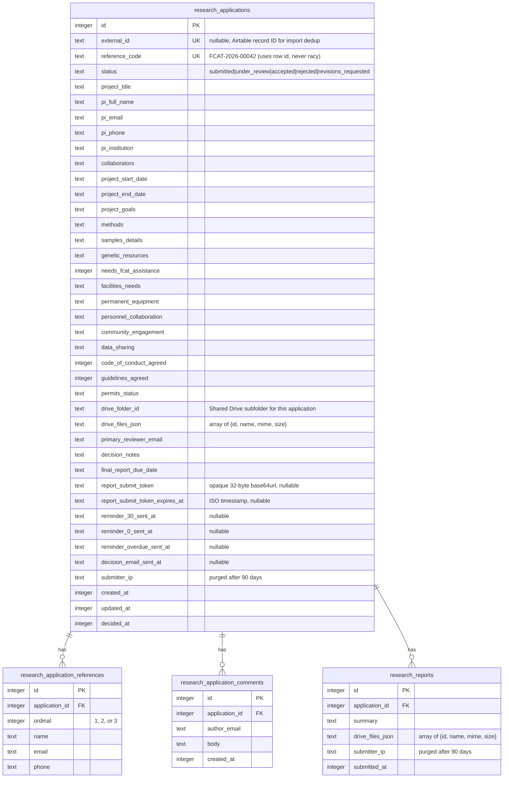

# feat: Researcher Applications Module

Replace FCAT's Airtable-based external researcher application system with a
portal-native module. Retire Airtable. Migrate ~200 historical applications.
Automate committee notifications and report-due reminders.

## Overview

External researchers apply via a public form, committee members review inside the
portal, reminders fire automatically as report due dates approach, and a monthly
digest keeps the committee informed. Volume: ~50 applications/year.

**Key decisions (from brainstorm + review):**

- Public form, no login — Turnstile + honeypot for spam.
- Opaque token on the application row for report submission links.
- Daily cron queries application timestamps directly — no email queue table.
- Files proxied through the portal (not Drive `webViewLink`s).
- File metadata as JSON on parent rows (no separate files table).
- 4 database tables total. 3 implementation phases.

## Technical Approach

### Data model



**4 tables.** File metadata lives as JSON on the parent rows (`drive_files_json`).
Reminder state lives as nullable timestamps on `research_applications` — a null
column means "not yet sent," the daily cron queries for rows matching criteria and
null timestamps, sends, then marks the column. No queue, no dispatcher, no retry
counter. If Resend fails, the timestamp stays null and the next cron tick retries.

**Reference code:** derived from the row `id` after insert —
`FCAT-${year}-${String(id).padStart(5, '0')}`. No `MAX+1`, no race, no unique
constraint collision.

**Report submission token:** stored directly on the application row. Generated when
the first reminder email fires. Consumed (set to null) on successful report
submission. Re-issuable: applicant enters email on the public page, system emails a
fresh token if a matching accepted application exists with no submitted report.

**Indices (explicit):**
- `research_applications(status, created_at)`
- `research_applications(pi_email)`
- `research_application_comments(application_id, created_at)`
- `research_application_references(application_id)`

### Architecture

```
                ┌────────────────────┐
                │ External Researcher│
                └────────┬───────────┘
                         │ (no auth, Turnstile + honeypot)
                         ▼
┌────────────────────────────────────────────────────────┐
│ Nginx                                                  │
│   /public/apply, /api/public/* → no oauth2-proxy       │
│   everything else → oauth2-proxy → X-Forwarded-Email   │
└─────────────┬────────────────────────┬─────────────────┘
              │                        │
     (public) │                        │ (authenticated)
              ▼                        ▼
┌─────────────────────┐    ┌───────────────────────────────┐
│ /public/apply       │    │ /research-applications        │
│ /public/report/:tok │    │ (Editor role, Spanish UI)     │
└──────┬──────────────┘    └─────────┬─────────────────────┘
       │                             │
       ▼                             ▼
┌────────────────────────────────────────────────────────────┐
│ Server Actions (ActionResult<T>, requirePermission)        │
│   Public: submitApplication, submitFinalReport             │
│   Auth: updateStatus, addComment, setReportDueDate         │
└──────┬────────────────────┬──────────────────┬─────────────┘
       │                    │                  │
       ▼                    ▼                  ▼
┌──────────┐    ┌─────────────────────┐   ┌──────────────┐
│ SQLite   │    │ Drive (Shared)      │   │ Resend       │
│ Drizzle  │    │ uploadFile()        │   │              │
└────┬─────┘    │ (service acct only) │   └──────────────┘
     │          └─────────────────────┘          ▲
     │                    ▲                      │
     │ scripts/crontab    │ proxy download       │
     └──► /api/cron/research-reminders ──────────┘
          /api/cron/committee-monthly-digest
```

**Drive file access model:** committee members do NOT access Drive directly. The
portal proxies file downloads via `/api/research-applications/files/[fileId]`,
authenticated with `requirePermission('researcher-applications', 'viewer')`. This
mirrors the existing ODK photo proxy at `src/app/api/odk/photos/route.ts`. Drive
file IDs remain internal-only — no `webViewLink` exposure.

### Implementation Phases

---

#### Phase 1: Public form + committee review (the product)

**Schema & permissions:**

- `src/db/schema.ts` — 4 new tables (above), Drizzle types exported. Boolean
  columns use `mode: 'boolean'` so consumers see `true`/`false`.
- `scripts/push-schema.mjs` — `CREATE TABLE IF NOT EXISTS` for each table, plus
  `INSERT OR IGNORE INTO projects VALUES ('researcher-applications', ...)`.
- `scripts/seed-dev.ts` — seed project + Editor permission for dev user.
- `src/components/sidebar-nav.tsx` — add "Aplicaciones de Investigadores" nav
  entry gated by `hasProjectAccess(user, 'researcher-applications')`.

**Foundation utilities:**

- `src/lib/drive-client.ts` — add `uploadFileToSharedDrive(buffer, filename,
  mimeType, parentFolderId)`. Returns `{id, name, mimeType, size}`.
  Add `getOrCreateApplicationFolder(referenceCode)` under the env var
  `RESEARCH_APPLICATIONS_DRIVE_FOLDER_ID`. Add `downloadFile(fileId)` returning
  a `Buffer` (for the proxy endpoint). All calls pass `supportsAllDrives: true`.
- `src/lib/turnstile.ts` — `verifyTurnstile(token, ip)`. Posts to Cloudflare.
  In dev without `TURNSTILE_SECRET`, returns `{success: true}`.
- `src/lib/upload-validation.ts` — accept `File`, read buffer, detect format
  with `file-type` (magic-number sniff), reject outside allowlist (`pdf`, `jpeg`,
  `png`), enforce 10 MB per file / 25 MB per submission. **Sanitize filenames**
  (strip path separators, null bytes, RTL overrides, truncate to 200 chars).
- `src/lib/research-applications/transitions.ts` — typed status transitions.
  Exports `const VALID_TRANSITIONS: Record<Status, readonly Status[]>` with
  `satisfies` for exhaustiveness. Single function `assertTransition(from, to)`.
- `next.config.ts` — set `experimental.serverActions.bodySizeLimit: '30mb'`.

**Public application form (`/public/apply`):**

- `src/app/public/apply/layout.tsx` — branded layout, no sidebar, English UI.
- `src/app/public/apply/page.tsx` — renders multi-step form component.
- `src/app/public/apply/apply-form.tsx` — Client Component. 4 steps:
  1. Applicant & institution info
  2. Project details (goals, methods, samples, genetics)
  3. Facilities, permits, references
  4. Supporting documents, code of conduct, Turnstile

  Uses `useTransition` + local state (existing portal pattern). **No server-side
  drafts.** Browser `localStorage` persists form state across tab closes
  (best-effort, not a feature we test exhaustively). On submit, constructs
  `FormData` with typed state + File objects from uncontrolled file inputs.

- `src/app/public/apply/actions.ts`:
  ```
  submitApplication(formData: FormData): Promise<ActionResult<{referenceCode: string}>>
  ```
  Order of operations:
  1. Verify Turnstile token.
  2. Check honeypot field is empty.
  3. Parse + validate all fields with Zod schema.
  4. Validate uploaded files (magic number, size, filename sanitization).
  5. **Await all Drive uploads** into an in-memory array.
  6. **Sync `db.transaction(() => { ... })`:**
     - Insert `research_applications` row → get `id`.
     - Compute `reference_code` from `id`.
     - Insert `research_application_references` rows.
     - Update application with `reference_code` and `drive_files_json`.
  7. **Send receipt email to applicant** (inline Resend call, try/catch + log on
     failure).
  8. **Send new-app notification to committee** (inline, same pattern).
  9. Return `{success: true, data: {referenceCode}}`.
  10. On success, client redirects to `/public/apply/thanks?ref=...`.

  **Error discipline:** unknown errors → generic message
  "Unable to process your application. Please try again or contact us." + full
  error logged server-side. Never expose internal messages to applicants.

  **Drive upload partial failure:** if file 2 of 3 fails, delete already-uploaded
  files from Drive (best-effort cleanup), return error to applicant. No orphan rows
  because the transaction hasn't run yet (Drive uploads happen before the
  transaction).

- `src/app/public/apply/thanks/page.tsx` — shows reference code, "check your
  email" note.
- `src/app/public/apply/fields.ts` — Zod schema, TS type. **No Airtable column
  mapping here** (belongs in the import script).

**Nginx + proxy changes:**

- `nginx/portal.fcat-ecuador.org` — add `/public/apply` and `/api/public/apply`
  locations with no `auth_request` (matching existing `/public/` pattern).
- `src/proxy.ts` — verify the existing `public/` exclusion in the matcher covers
  these paths. If not, extend.
- Test: a forged `X-Forwarded-Email` header on `/public/apply` must be ignored.

**Committee review UI (`/research-applications`):**

- `src/app/research-applications/page.tsx` — Server Component,
  `requirePermission('researcher-applications', 'viewer')`. Paginated table with
  filters: status, year, search. Spanish strings. Row click → detail.
- `src/app/research-applications/[id]/page.tsx` — detail view. Three sections:
  **Detalles** (read-only fields), **Documentos** (download buttons via the proxy
  endpoint), **Revisión** (status control, reviewer selector, due date picker,
  comments thread). Editor role required for mutations.
- `src/app/research-applications/[id]/actions.ts`:
  - `updateStatus(id, newStatus, notes)` — editor. Uses `assertTransition()`.
    On terminal state → set `decided_at`. Sends decision email to applicant
    inline (try/catch).
  - `setPrimaryReviewer(id, email)` — editor.
  - `setFinalReportDueDate(id, date)` — editor. Clears `reminder_*_sent_at`
    columns (allows re-firing if date changes).
  - `addComment(id, body)` — editor.
- `src/app/api/research-applications/files/[fileId]/route.ts` — file download
  proxy. `requirePermission('researcher-applications', 'viewer')`. Calls
  `downloadFile(fileId)` from the Drive client, sets `Content-Disposition:
  attachment; filename="<sanitized>"`. Mirrors ODK photo proxy pattern.

**Status labels (Spanish):** Enviada, En revisión, Aceptada, Rechazada,
Revisiones solicitadas.

**Test artifacts:**

```
tests/lib/turnstile.test.ts                 # mock fetch: pass/fail/dev bypass
tests/lib/upload-validation.test.ts         # good PDF, bad magic number, oversize,
                                            # filename sanitization edge cases
tests/lib/transitions.test.ts               # valid/invalid transitions
tests/app/public/apply/submit.test.ts       # happy path, honeypot, Turnstile fail,
                                            # partial Drive failure cleanup
tests/app/research-applications/actions.test.ts  # permission, transitions, due date
```

**Success criteria:**

- A clean browser session can submit an application end-to-end in dev (form
  validation, Drive upload, DB row, receipt email logged).
- Spam submissions are rejected with a generic error.
- Committee Editor can change status through all legal transitions.
- Committee Viewer can see but not mutate.
- File downloads through `/api/research-applications/files/[fileId]` work for
  authorized users and 403 for unauthorized.
- `npm run build` succeeds (catches Server/Client serialization).
- `node scripts/push-schema.mjs` is idempotent on dev and fresh DBs.

---

#### Phase 2: Email reminders + monthly digest (cron)

**Deliverables:**

- `src/app/api/cron/research-reminders/route.ts` — Bearer-token-guarded POST
  (existing cron pattern from `src/app/api/cron/nightly-refresh/route.ts`). Runs
  daily. Logic:
  1. Query accepted applications where `final_report_due_date` is approaching AND
     the relevant `reminder_*_sent_at` is null AND no submitted report exists:
     - Due in ≤30 days, `reminder_30_sent_at IS NULL` → send T-30 reminder.
     - Due today or past, `reminder_0_sent_at IS NULL` → send T-0 reminder.
     - Overdue by ≥7 days, `reminder_overdue_sent_at IS NULL` → send overdue.
  2. For each reminder: generate `report_submit_token` (if null on the row —
     `crypto.randomBytes(32).toString('base64url')`), set expiry to
     `final_report_due_date + 60 days`. Store token on the row.
  3. Send email via Resend with the magic link
     `https://portal.fcat-ecuador.org/public/report/{token}`. English.
  4. On success, stamp `reminder_X_sent_at`. On failure, log and leave null
     (next cron tick retries).
  5. Log count: "Sent N reminders (T-30: X, T-0: Y, overdue: Z)".

- `src/app/api/cron/committee-monthly-digest/route.ts` — runs 1st of month at
  09:00 US/Eastern. Computes: applications submitted last month, reports due this
  month, reports submitted last month, overdue reports. Sends one HTML email to
  all users with Editor/Admin role on `researcher-applications` project (derived
  from `user_permissions`, not a hardcoded env var). Spanish.

- Email template builder functions in
  `src/lib/research-applications/emails.ts`:
  - `submissionReceipt(app)` → English, to applicant
  - `committeeNewApp(app)` → Spanish, to committee list
  - `decisionNotification(app)` → English, to applicant
  - `reportReminder(app, daysUntilDue, token)` → English, to applicant
  - `committeeMonthlyDigest(stats)` → Spanish
  - Each returns `{subject, html, text}`. **Always include a plain-text
    alternative** for deliverability.

- `scripts/crontab` — add:
  ```
  0 8 * * * root . /etc/cron.d/portal-env && curl -fsS -H "Authorization: Bearer $CRON_SECRET" -X POST http://localhost:3000/api/cron/research-reminders >> /app/data/backups/cron.log 2>&1
  0 9 1 * * root . /etc/cron.d/portal-env && curl -fsS -H "Authorization: Bearer $CRON_SECRET" -X POST http://localhost:3000/api/cron/committee-monthly-digest >> /app/data/backups/cron.log 2>&1
  ```

**Final report submission (`/public/report/[token]`):**

- `src/app/public/report/[token]/page.tsx` — Server Component. Validates token:
  exists on a `research_applications` row, not expired, application is accepted,
  no report submitted yet. Shows pre-filled application summary (read-only) + a
  form: summary text, PDF upload(s). English.
- `src/app/public/report/[token]/actions.ts`:
  ```
  submitFinalReport(formData: FormData, token: string): Promise<ActionResult<void>>
  ```
  1. Re-validate token (exists, not expired, not already consumed — check in SQL:
     `WHERE report_submit_token = ? AND report_submit_token_expires_at > ?
     AND id NOT IN (SELECT application_id FROM research_reports)`).
  2. Validate + upload files to Drive (`Final Report/` subfolder).
  3. Sync transaction: insert `research_reports` row, null out
     `report_submit_token` on the application (consume).
  4. Send confirmation to applicant + notification to committee (inline).
  5. Redirect to thanks page.

  **Expired token flow:** show a page with a form: "Enter your email to receive
  a new link." If email matches an accepted application with no report, generate
  a fresh token and email it. Prevents dead-end for applicants whose token
  expired.

- `src/app/public/report/[token]/thanks/page.tsx` — confirmation.

**Test artifacts:**

```
tests/api/cron/research-reminders.test.ts        # T-30, T-0, overdue, already sent,
                                                 # Resend failure → null stays
tests/api/cron/committee-monthly-digest.test.ts  # date ranges, empty months
tests/app/public/report/submit.test.ts           # valid token, expired, already
                                                 # consumed, re-issue flow
```

**Success criteria:**

- Inserting a test application with `final_report_due_date` 29 days from now and
  calling the cron endpoint produces a reminder email with a valid token link.
- Clicking the token link opens the report form; submitting nulls the token.
- Reloading after submission shows "already submitted."
- Monthly digest endpoint can be triggered manually via `curl` with CRON_SECRET.

---

#### Phase 3: Historical import from Airtable CSVs

**Deliverables:**

- `scripts/import-airtable-research-applications.ts` — follows
  `scripts/import-historical-camera-data.ts` pattern:
  - CLI flags: `--dry-run`, `--yes`, `--csv-applications <path>`,
    `--csv-reports <path>`, `--attachments-dir <path>`.
  - Timestamped logging to `data/imports/airtable-YYYY-MM-DD.log`.
  - Parses CSVs with `csv-parse` (`bom: true`, `relax_quotes: true`,
    `trim: true`). Handles quoted multi-line long-text fields.
  - For each application row: `INSERT ... ON CONFLICT(external_id) DO UPDATE`.
    Compute `reference_code` from `id`. Map Airtable columns to schema fields
    (mapping defined in the script, not in `fields.ts`).
  - Attachments: reads from `--attachments-dir` on disk (pre-downloaded by
    user, since Airtable signed URLs expire in ~2 hours). Uploads to Drive.
    Stores metadata as `drive_files_json`.
  - Reports CSV: linked by project title (manual review report for ambiguous
    matches; the import should output a CSV of "title → matched application_id"
    for human sign-off in dry-run mode).
  - Sets `status='accepted'` or appropriate status from Airtable's
    `Application status` column.
  - Final report: creates `research_reports` row if report attachment exists.
  - Report at end: X imported, Y updated, Z skipped, W files uploaded, V errors.

**Pre-import steps (documented in script comments):**

1. Export both grid views from Airtable.
2. Manually download all attachments via Airtable's bulk-download (or export each
   column's attachments via the Airtable API before URLs expire).
3. Copy CSVs + attachments to `data/airtable-import/` in the container.
4. Run `--dry-run`. Review log + title-matching report.
5. Run for real. Spot-check 10 applications. Freeze Airtable base.

**Test artifacts:**

```
tests/scripts/import-airtable.test.ts    # fixture CSVs: BOM, embedded newlines,
                                         # idempotent re-run, title matching
```

**Success criteria:**

- Running against 5-row fixture produces correct rows with correct field mapping.
- Running twice produces no duplicates.
- Dry-run outputs a human-readable title-matching report.
- Real run against the full CSV produces ~200 rows and a zero-error log.

---

## PII & Data Retention

External researcher applications contain personal data (name, email, phone, IP
address, institutional affiliation). Policy:

- **`submitter_ip`** — purged (set to null) after 90 days by the daily cron.
  Only purpose is abuse investigation immediately after submission.
- **Application data (name, email, phone)** — retained indefinitely for
  institutional research records. Applications at a biological station are part
  of the station's historical record. Applicants are informed at submission via a
  clear notice: "Your information will be retained by FCAT for the purposes of
  managing research at the reserve."
- **Rejected applications** — hard-deleted by admin only, upon request. Drive
  files are not automatically deleted (admin removes folder manually if needed).
  No `deleted_at` column — use hourly backups for accidental-deletion recovery.
- **No EU GDPR data-subject-access-request mechanism** planned for MVP. Volume
  (~50/year from named academics) makes email-based manual handling acceptable.
  Revisit if volume grows or FCAT formalizes a privacy policy.

## Dependencies & Prerequisites

- Shared Drive with service account as Content Manager + a top-level folder.
  Env: `RESEARCH_APPLICATIONS_DRIVE_FOLDER_ID`.
- `notifications.fcat-ecuador.org` subdomain verified in Resend (SPF/DKIM/DMARC).
  Env: `RESEARCH_APP_FROM_EMAIL` (default `notifications@fcat-ecuador.org`).
- Cloudflare Turnstile site key + secret (free). Envs: `TURNSTILE_SITE_KEY`,
  `TURNSTILE_SECRET`.
- npm: `file-type`, `@marsidev/react-turnstile`, `csv-parse` (Phase 3 only).
- Node 22 (already required).

## Risk Analysis

| Risk | Mitigation |
|---|---|
| Service account can't upload to Shared Drive | Phase 1 acceptance test: upload a test PDF before building the form |
| Airtable attachment URLs already expired | Pre-download to disk; import reads from disk |
| .edu spam filtering | Dedicated subdomain, SPF/DKIM/DMARC, plain-text alt, avoid "grant"/"deadline" in subjects |
| Bot spam on public form | Turnstile + honeypot; monitor submissions the first week |
| Drive upload fails mid-submission | Best-effort cleanup of already-uploaded files; applicant sees error before DB transaction runs |
| Reminder cron fails silently | Timestamp stays null → next tick retries; cron.log auditable |
| Next.js body limit rejects large PDFs | `bodySizeLimit: '30mb'` in next.config.ts; integration test with 20 MB file |
| better-sqlite3 async transaction gotcha | Drive uploads happen BEFORE the sync transaction; no async inside `db.transaction()` |
| Forged X-Forwarded-Email on public routes | Test that public routes ignore this header entirely |

## Acceptance Criteria

### Functional

- [ ] External researcher submits application end-to-end with no login
- [ ] Receipt email arrives with reference code
- [ ] Committee Editor reviews, comments, changes status through all legal
      transitions
- [ ] Committee Viewer sees but cannot mutate
- [ ] Setting a final-report due date enables reminders (T-30, T-0, T+7)
- [ ] Reminder email contains a working magic link to the report form
- [ ] Report submission consumes the token; re-submission is blocked
- [ ] Expired-token page lets applicant request a fresh link
- [ ] Monthly digest fires with correct counts
- [ ] Historical import is idempotent and produces ~200 rows with files
- [ ] `/admin` shows "Aplicaciones de Investigadores" project column

### Non-functional

- [ ] 10 MB file uploads succeed through Server Actions
- [ ] Public form loads without auth redirects (curl with no cookies)
- [ ] File downloads through proxy respond with `Content-Disposition: attachment`
- [ ] Emails pass SPF/DKIM/DMARC checks (mail-tester.com)
- [ ] All UI: committee pages Spanish, applicant pages English
- [ ] `npm run build` passes
- [ ] `submitter_ip` is null on applications older than 90 days

## Effort Estimate

One developer, ~5-7 days total:
- Phase 1: ~3-4 days (schema, form, committee UI, Drive proxy)
- Phase 2: ~1-2 days (cron endpoints, templates, report form)
- Phase 3: ~1 day (import script, manual spot-check)

## References

### Internal

- Permissions: `src/lib/auth.ts:107-133`, `:138-146`, `:46-101`
- Schema: `src/db/schema.ts`
- Proxy: `src/proxy.ts:38`
- Nginx public bypass: `nginx/portal.fcat-ecuador.org:82-93`
- Public tokens pattern: `src/lib/public-tokens.ts`
- Resend pattern: `src/app/api/cron/nightly-refresh/route.ts:290-312`
- Drive client: `src/lib/drive-client.ts`
- ODK photo proxy: `src/app/api/odk/photos/route.ts`
- Import precedent: `scripts/import-historical-camera-data.ts`
- Schema push: `scripts/push-schema.mjs`
- Nav: `src/components/sidebar-nav.tsx:33-176`
- Server action pattern: `src/app/finance/data/actions.ts:24-100`
- Cron: `scripts/crontab`

### Institutional learnings

- Proxy matcher gotcha: `docs/solutions/integration-issues/proxy-matcher-excludes-api-routes.md`
- Shared Drive flags: `docs/solutions/integration-issues/google-drive-recursive-file-counting-20260224.md`
- Push-schema migrations: `docs/solutions/database-issues/missing-alter-table-migrations-push-schema.md`
- Sync transactions: `docs/solutions/runtime-errors/async-transaction-better-sqlite3-CameraTrap-20260223.md`

### External

- [Cloudflare Turnstile](https://www.cloudflare.com/application-services/products/turnstile/) — free CAPTCHA
- [`file-type`](https://www.npmjs.com/package/file-type) — magic-number MIME detection
- [Resend scheduled_at 30-day cap](https://resend.com/docs/dashboard/emails/schedule-email)
- [Service account Shared Drive requirement (Apr 2025)](https://discuss.google.dev/t/storagequotaexceeded-the-users-drive-storage-quota-has-been-exceeded-for-service-account/104375)
- [Next.js serverActions.bodySizeLimit](https://nextjs.org/docs/app/api-reference/config/next-config-js/serverActions)
