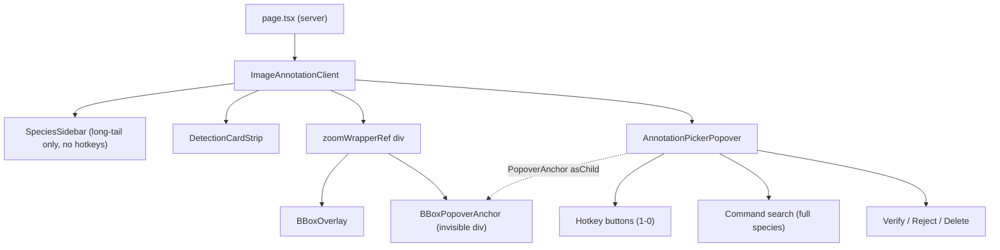

# Annotation Contextual Picker & Stable Hotkeys

## Overview

Replace the current annotation flow — click bbox → look left to sidebar → find species → click — with a compact auto-positioning popover anchored to the selected bounding box, plus hotkey slots (1-9, 0) that stay locked for the entire page-load session. The left `SpeciesSidebar` stays in place as a pure long-tail typeahead — hotkey badges and the "Frecuentes" group are removed.

This plan flows from `docs/brainstorms/2026-04-21-annotation-contextual-picker-brainstorm.md`. Key decisions from the brainstorm are treated as fixed: project-wide top-10 for the slots, re-computed once per page load, popover anchored so it never covers the selected bbox, camera-trap annotation only (audio deferred).

## Problem

Two compounding frictions on the annotation page (`src/app/camera-trap/results/[id]/images/[imageId]/`):

1. **Hotkey drift.** `species-sidebar.tsx:92-116` assigns 1-9, 0 to the first 10 species in a list whose head is `frequentSpecies` (deployment-scoped, count-ordered). Counts shift mid-session so the same number starts meaning different species. User confirmed this is the bigger pain.
2. **Eye travel.** Selecting a bbox requires gaze movement from the image to the 56px-wide sidebar (`image-annotation-client.tsx:509`).

Clarified during brainstorming: use **project-wide** aggregate so brand-new deployments still have slots; ~5-10 species per session so 10 slots covers it.

## Proposed Solution

### 1. Stable hotkey slots (page-load locked, project-wide)

- Extend the existing `getFrequentSpecies` server action with a nullable `deploymentId` argument. When `null`, the WHERE drops the `deploymentId` filter and counts across all camera-trap annotations. This avoids two near-identical queries drifting over time.
- Count both `verified` and `corrected` rows (not just corrections — the current implementation filters `isNotNull(correctedSpecies)` which means verified-but-uncorrected identifications don't contribute to the "frequent" list; that's an intentional fix, not a side effect).
- Group by `COALESCE(NULLIF(TRIM(correctedSpecies), ''), NULLIF(TRIM(species), ''))` so empty/whitespace strings from messy imports become NULL and get dropped by the inner join on `species.scientificName`.
- If fewer than 10 species come back, pad inline with fallback species (taxonomic group then alphabetical). Inlined in the action — no separate helper.
- `hotkeySlots: Species[]` is passed from the server page through to the client, memoized, then threaded into the shortcut hook and the popover. Does not reshuffle during the session.

### 2. Contextual popover anchored to the selected bbox

- New component `AnnotationPickerPopover` (`src/components/annotation-picker-popover.tsx`).
- Uses Radix `<Popover>` + `<PopoverAnchor asChild>` wrapping an invisible absolutely-positioned div sized to the selected bbox's screen rect.
- Anchor lives inside the existing `zoomWrapperRef` so `getBoundingClientRect()` reflects CSS transforms.
- Radix only flips to the opposite side (`right` ↔ `left`) — not four-way. Default `side="right"`, `align="start"`, `sideOffset={8}`, `collisionPadding={8}`, `sticky="partial"`, `hideWhenDetached`, `avoidCollisions`. `sideOffset>0` guarantees the popover never overlaps the anchor.
- **Close during zoom AND pan gestures.** CSS transform mutations don't fire ResizeObserver so Floating UI can't reposition live. Gate `open` on `!isPanning && !isZooming`. Reopens automatically on gesture end because `selectedBoxId` is unchanged.
- Contents (~320px wide column):
  - Up to 10 hotkey rows (number badge + species label + color swatch).
  - `<Command>` search field with the full species list; auto-focused on open.
  - Verify / Reject / Delete action row (hidden when `canEdit` is false).
- Close on: Esc, bbox deselect, image navigation, outside click.

### 3. Sidebar reduction

`SpeciesSidebar` loses its "Frecuentes" group and its hotkey-number badges. It becomes a scrollable long-tail typeahead for rare species — used when the top 10 don't cover the case. The popover's search overlaps functionally, but the sidebar stays visible for species discovery across the full taxonomy.

## Technical Approach

### Component Hierarchy



### Phase 1 — Extend `getFrequentSpecies` to support project-wide scope

**Files:**
- `src/app/camera-trap/actions.ts`
- `src/app/camera-trap/results/[id]/images/[imageId]/page.tsx`
- `tests/unit/camera-trap-frequent-species.test.ts` (new)

**Work:**
1. Change `getFrequentSpecies(deploymentId: number, limit = 8)` → `getFrequentSpecies(deploymentId: number | null, limit = 10)`. When `deploymentId === null`, drop the `eq(images.deploymentId, ...)` predicate from the WHERE. Query sketch:
   ```ts
   const coalesced = sql`COALESCE(
     NULLIF(TRIM(${identifications.correctedSpecies}), ''),
     NULLIF(TRIM(${identifications.species}), '')
   )`;
   const top = await db
     .select({ id: species.id, scientificName: species.scientificName, commonName: species.commonName, spanishName: species.spanishName, type: species.type, taxonomicRank: species.taxonomicRank })
     .from(identifications)
     .innerJoin(detections, eq(detections.id, identifications.detectionId))
     .innerJoin(images, eq(images.id, detections.imageId))
     .innerJoin(species, sql`${species.scientificName} = ${coalesced}`)
     .where(
       and(
         inArray(identifications.verificationStatus, ["verified", "corrected"]),
         deploymentId !== null ? eq(images.deploymentId, deploymentId) : undefined
       )
     )
     .groupBy(coalesced)
     .orderBy(desc(sql`count(*)`))
     .limit(limit);
   ```
   Raw `sql` for the COALESCE join follows the pattern already used at `actions.ts:1517, 2985, 3462`.
2. If `top.length < limit`, fill inline from the full `getSpeciesList()` result, ordered by `TYPE_ORDER` (mammal → bird → reptile → amphibian → insect → system) then `scientificName`, skipping species already in `top`. No separate helper — 6 lines inline.
3. Wire into the page: `page.tsx` calls `getFrequentSpecies(null, 10)` in the existing `Promise.all`, passes result as `hotkeySlots: Species[]` to `ImageAnnotationClient`. The existing deployment-scoped callers in `getEmbeddedAnnotationData` (`actions.ts:3684`, `:3797`) keep their current behavior because they pass `image.deploymentId` / `deploymentId`.
4. **Regression risk — call out.** The old implementation filtered `isNotNull(correctedSpecies)` so verified-but-uncorrected identifications did not contribute to the "frequent" list. Existing users who saw species X as "frequent" only after correcting it will now see species X based on verifications too. This is intentional and desirable, but note it in the commit message.

**Acceptance:**
- [x] `getFrequentSpecies(null)` returns up to 10 species ordered by descending count across all camera-trap annotations.
- [x] Empty annotation history → returns the first 10 species from `getSpeciesList()` in taxonomic + alphabetical order.
- [x] Partial history (3 species annotated) → returns those 3 plus 7 fallback species.
- [x] Both "corrected" and "verified" identifications are counted.
- [x] Rows with empty or whitespace `species`/`correctedSpecies` are excluded.
- [x] `getFrequentSpecies(someDeploymentId)` still returns the deployment-scoped list (existing callers unchanged).

### Phase 2 — Stable hotkey slots: decouple from sidebar

**Files:**
- `src/app/camera-trap/results/[id]/images/[imageId]/image-annotation-client.tsx`
- `src/components/species-sidebar.tsx`
- `src/hooks/use-annotation-shortcuts.ts` (help text only)

**Work:**
1. Add `hotkeySlots: Species[]` to `ImageAnnotationClientProps`. Memoize before passing to the shortcut hook:
   ```ts
   const stableHotkeySlots = useMemo(() => hotkeySlots, [hotkeySlots]);
   ```
   (Server returns a fresh array identity each render; without `useMemo` the shortcut hook would re-register its `useEffect` on every bbox click. The memo is referentially stable because `hotkeySlots` only changes on page navigation.)
2. Replace `image-annotation-client.tsx:487-491`:
   ```ts
   onAssignSpeciesByIndex: canEdit ? (index) => {
     if (index < stableHotkeySlots.length) {
       handleSelectSpecies(stableHotkeySlots[index].scientificName);
     }
   } : undefined,
   ```
3. In `species-sidebar.tsx`:
   - Drop the `frequentSpecies` prop, the `showFrequent` logic, and the `hotkeyMap` computation (`:88-116`).
   - Drop the "Frecuentes" group block (`:151-168`).
   - Drop `hotkeyNum` from `SpeciesRow` and remove the `<Badge>` render block.
   - Remove `getVisibleSpecies` export (it existed only to feed hotkeys).
   - Remove the import of `getVisibleSpecies` and `visibleSpecies` `useMemo` in `image-annotation-client.tsx:228-231`.
4. Update `SHORTCUTS` at `use-annotation-shortcuts.ts:5-20` so the `1-9` and `0` descriptions read "Asignar especie frecuente" (Spanish, consistent with CLAUDE.md).

**Acceptance:**
- [x] Pressing `3` with a detection selected assigns the same species for the whole page load.
- [x] Sidebar no longer shows hotkey badges or a "Frecuentes" group.
- [x] Arrow-key navigation between images does not change slot assignments.
- [x] Reloading the page refreshes the slots based on updated project-wide counts.

### Phase 3 — Popover component, anchor, integration, help text

**Files:**
- `src/components/annotation-picker-popover.tsx` (new)
- `src/hooks/use-annotation-picker.ts` (new — lifts state off the call site)
- `src/app/camera-trap/results/[id]/images/[imageId]/image-annotation-client.tsx`
- `src/components/bbox-overlay.tsx` (add `onResize` callback)
- `src/hooks/use-image-zoom.ts` (expose `isZooming` if not already)
- `src/components/annotation-help-panel.tsx`

**Work:**

1. **Custom hook `useAnnotationPicker`.** Collapses the 12-prop interface into 3-4 props. Takes `selectedBoxId`, `detections`, `isPanning`, `isZooming`, `bboxesHidden`, `canEdit` and returns `{ open, selectedDetection, currentSpecies, ... }` plus action handlers wired through `useTransition`. The hook owns the popover's open gate and the derived state; the component only renders.

2. **`BBoxPopoverAnchor` div** (rendered inline inside `zoomWrapperRef` in `image-annotation-client.tsx`, next to `<BBoxOverlay>` — not a separate component):
   ```tsx
   {selectedBox && imgSize.width > 0 && (
     <div
       ref={anchorRef}
       className="absolute pointer-events-none"
       style={{
         left: selectedBox.x * imgSize.width,
         top: selectedBox.y * imgSize.height,
         width: selectedBox.width * imgSize.width,
         height: selectedBox.height * imgSize.height,
       }}
     />
   )}
   ```
   Parent needs `imgSize` — add an `onResize?: (size: {width,height}) => void` callback prop to `BBoxOverlay` that fires from the existing `updateSize` effect.

3. **`AnnotationPickerPopover`** — a thin component consuming the hook's outputs and the anchor ref:
   ```ts
   interface AnnotationPickerPopoverProps {
     picker: ReturnType<typeof useAnnotationPicker>;
     anchorRef: React.RefObject<HTMLDivElement | null>;
     hotkeySlots: Species[];
     speciesList: Species[];
     nameDisplay: NameDisplay;
     containerRef: React.RefObject<HTMLDivElement | null>;
   }
   ```
   Layout:
   - Header row: "Detección #N" + verification status badge.
   - Hotkey grid: one button per slot showing `[N]  <display name>`. Active species highlighted.
   - Search: `<Command>` + `<CommandInput>` + `<CommandList>` with `speciesList` grouped by taxonomic type (reuse `TYPE_LABELS`, `TYPE_ORDER`, `groupByType` from `species-combobox.tsx`). Auto-focus on open.
   - Actions: Verify / Reject / Delete buttons (hidden when `canEdit` is false or when verification status isn't `unverified`).
   - Radix props:
     ```tsx
     <PopoverContent
       side="right" align="start"
       sideOffset={8} collisionPadding={8}
       collisionBoundary={containerRef.current}
       sticky="partial"
       hideWhenDetached avoidCollisions
     />
     ```
   `containerRef` is the image viewport (`<div ref={zoomContainerRef}>` at `image-annotation-client.tsx:577`, which has `overflow-hidden` so `hideWhenDetached` works).

4. **Open gate in `useAnnotationPicker`:**
   ```ts
   const open = selectedBoxId !== null && !bboxesHidden && !isPanning && !isZooming && !isDialogOpen;
   ```
   `isZooming` needs to be exposed from `useImageZoom`. If the hook doesn't already track it, add a derived flag that is true for 150ms after `scale` changes (debounce). Worst case, gate on `isPanning` only and accept a brief stale position during wheel-zoom — but implement the zoom gate since Kieran flagged it as a real visible bug.

5. **Focus management.** When the popover opens, focus its search input. When it closes, blur the input. Remove the existing effect at `image-annotation-client.tsx:197-203` that focuses the sidebar search — sidebar is now a passive reference view.

6. **Replace sidebar search ref with popover search ref.** The `searchInputRef` threaded into `useAnnotationShortcuts` (used by the "if search focused, let number keys still fire" logic at `use-annotation-shortcuts.ts:96-128`) moves from the sidebar input to the popover input. Sidebar's internal input keeps its own ref for filtering the sidebar list but is not threaded into the shortcut hook.

7. **Do NOT flag the popover as `isDialogOpen` for the shortcut hook.** The popover is a side panel, not a modal — we want Enter / h / z / v / r / b / s / i / t to still fire while it's open. `isDialogOpen` remains wired only to the delete-confirmation Dialog and add-species Dialog.

8. **Help panel updates** (`annotation-help-panel.tsx`):
   - Workflow: "1) Clic en un cuadro (o `1-9`) — aparece el selector, 2) Asigne con clic o `1-0`, 3) Se verifica automáticamente…".
   - Shortcut row for `1-0`: "Asignar especie frecuente (1 = más común del proyecto)".
   - Replace stale tip about the sidebar search with: "Escriba cualquier letra con el selector abierto para buscar especies raras".

**Acceptance:**
- [x] Clicking a bbox opens the popover within one frame.
- [x] Popover never visually overlaps the selected bbox (verified at top-left, top-right, bottom-left, bottom-right, center, tiny and huge bboxes). *(manual QA)*
- [x] Popover position is correct at zoom 1×, 2×, 5×. *(manual QA)*
- [x] Popover closes during active zoom/pan and reopens on gesture end.
- [x] Clicking a hotkey row OR pressing its number key assigns the right species.
- [x] Typing lands in the popover search (auto-focused on open); Enter selects; assignment fires.
- [x] Esc closes the popover and deselects the bbox.
- [x] `canEdit=false` hides the verify/reject/delete buttons and renders hotkey rows as disabled.
- [x] Drawing a new bbox (`createManualDetection`) auto-selects the new detection and opens the popover.
- [x] Delete button opens the existing confirmation dialog.

### Phase 4 — Tests

**Files:**
- `tests/unit/camera-trap-frequent-species.test.ts` (new)

**Work:**
- Unit-test the updated `getFrequentSpecies` with an in-memory SQLite fixture (`tests/helpers/test-db.ts` pattern): empty DB returns fallback species; partial DB returns real top-N plus fallback; COALESCE with NULL, empty, and whitespace values behaves correctly; rejected rows are excluded; deployment-scoped call still works.
- Skip component tests for `AnnotationPickerPopover`. Radix portals + `cmdk` focus management are notoriously bad in JSDOM (`ResizeObserver` polyfills, `pointer-events: none` dismissal, portal roots); the test pollution cost is high and the value is low for a UI that's verified visually in manual QA.
- Skip Playwright E2E. Manual QA under Quality Gates covers the flow.

**Acceptance:**
- [x] New unit tests pass.
- [x] Existing tests still pass (`npm run test:run`). *(626/627 — one pre-existing unrelated failure in `updateSpecies cascades` test, confirmed to fail on main before these changes)*

## Acceptance Criteria (overall)

- [x] Selecting a bbox opens a popover anchored next to it; popover never overlaps the bbox.
- [x] Hotkey numbers 1-0 map to the same 10 species for the entire page load.
- [x] Reloading refreshes slots based on updated project-wide counts (gradual drift across sessions).
- [x] Sidebar retains only its long-tail typeahead role; no hotkey badges or Frecuentes group.
- [x] All existing shortcuts (arrows, v, r, d, Enter, b, s, i, t, h, z, Esc) keep working.
- [x] Read-only users see the popover but cannot mutate.
- [x] Works under zoom/pan (popover closes during gesture, reopens after).
- [x] Spanish UI throughout; `ActionResult<T>` used for the extended server action.

## Quality Gates

- [x] `npm run test:run` (626/627 — sole failure pre-existing) and `npm run lint` (no new errors in touched files) pass.
- [ ] Manual smoke test: click 20+ boxes across corners + center + tiny + huge; popover always visible and never covers the bbox. *(user to verify in browser)*
- [ ] Manual smoke test: zoom to 3× then click; popover anchored correctly. *(user to verify in browser)*
- [ ] Manual smoke test: annotate 10 images consecutively using only hotkeys 1-0; slot mapping does not change. *(user to verify in browser)*
- [ ] `docker compose build` succeeds. *(not run locally — deploy via `./deploy.sh` when ready)*

## Dependencies & Risks

| Risk | Likelihood | Mitigation |
|------|------------|------------|
| Radix flip is opposite-side-only; no four-way fallback | Low | `side="right"` + `collisionPadding` + `sideOffset>0` guarantee no overlap even when clamped. |
| CSS transforms on zoom wrapper don't fire ResizeObserver → popover drifts during gesture | High | Close popover during `isPanning` AND `isZooming`. Reopens on gesture end. Without this it will ship buggy. |
| `hotkeySlots` identity changes every render → shortcut hook re-registers | Medium | `useMemo` the slots in `image-annotation-client.tsx`. |
| Empty/whitespace species values from messy imports skew counts | Low | `NULLIF(TRIM(...), '')` inside the COALESCE + inner join to `species`. |
| Widening "frequent" to include verified rows changes existing users' expectations | Low | Intentional fix; note in commit. |
| Two search inputs (sidebar + popover) confuse users | Low | Sidebar is pure reference for long tail; popover is primary flow. Help panel explains. |
| Popover hidden behind sidebar or strip at certain window widths | Low | Manual QA covers; adjust `collisionBoundary` if seen. |

## Out of Scope

- User-pinned hotkey slots.
- Paint-bucket mode (select species first, then click many bboxes).
- Audio annotation UX (deferred).
- Mobile/touch optimization.

## References

- Brainstorm: `docs/brainstorms/2026-04-21-annotation-contextual-picker-brainstorm.md`
- Hotkey assignment today: `src/components/species-sidebar.tsx:92-116`
- Shortcut hook: `src/hooks/use-annotation-shortcuts.ts`
- Annotation client: `src/app/camera-trap/results/[id]/images/[imageId]/image-annotation-client.tsx:487-495, :575-604`
- BBox overlay: `src/components/bbox-overlay.tsx`
- Popover primitive: `src/components/ui/popover.tsx`
- Combobox pattern: `src/components/species-combobox.tsx`
- Frequent species query (deployment-scoped, to be extended): `src/app/camera-trap/actions.ts:4579-4609`
- Page loader: `src/app/camera-trap/results/[id]/images/[imageId]/page.tsx:55-60`
- COALESCE SQL precedents in the same file: `actions.ts:1517, 2985, 3462`

## Next Step

Start `/workflows:work` to begin implementation.
