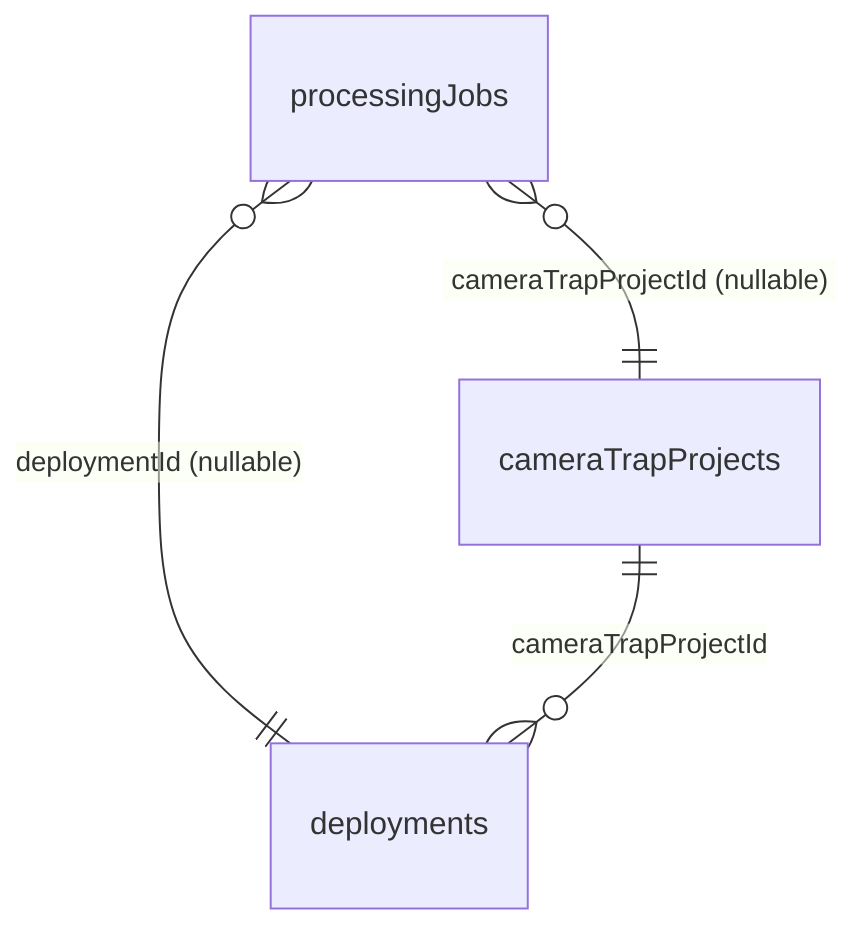

# Background Drive Sync — Parallelism, Per-Project Scope, and Nightly Auto-Run

## Overview

Convert the Camera Trap "Sincronizar con Drive" workflow from a sequential foreground server action into a single shared background job that:

- Runs per-deployment work in parallel with `p-limit` (concurrency 8) — expected ~6 min nightly to roughly ~40s.
- Is enqueued from two callers using one code path: the manual button in `deployments-table.tsx` and the existing `/api/cron/nightly-refresh` cron.
- Lets the user navigate away and watch progress via the existing `floating-job-progress.tsx` widget.
- Adds optional per-CT-project scoping via a split-button + dropdown (the `syncWithDrive(cameraTrapProjectId)` backend already supports this).
- Closes the "stale UI" gap: nightly will now do the full sync (discover folders, scan images, ODK match, refresh counts) — not just the shallow count refresh it does today.

## Problem Statement

Verified prod state on 2026-05-06 (`/root/opt/fcat-portal/data/nightly-refresh.log`):

| Concern | Today |
|---|---|
| Nightly cron runs | ✅ at 01:00 ET, succeeds reliably |
| Nightly does the work the UI surfaces | ❌ shallow — only counts/sizes |
| Folder discovery / image ingestion / ODK match | Manual button only |
| Manual button blocks the page | ✅ user cannot navigate away |
| Per-deployment work runs in parallel | ❌ sequential `for` loop |
| Per-CT-project scoping in UI | ❌ backend supports it; UI does not |
| Drive API call retry on 429/5xx | ❌ `googleapis` SDK has no auto-retry |
| Runtime at 101 deployments | ~366s sequential, scaling linearly |

Result: users find the camera-trap UI is days stale (no one clicks the manual button), and the manual button itself is too slow to use casually.

## Proposed Solution

One background-job code path, two entry points, parallel fan-out across deployments.

```
            ┌──── manual button (deployments-table.tsx)
            │       enqueueDriveSyncJob({ cameraTrapProjectId? })
            │       returns immediately, fires "job-started" event
            ▼
   processingJobs row (jobType="drive_sync", deploymentId=NULL)
            │
            ▼
   runDriveSyncWorker(jobId)            ◄── after() in Next.js 16
       1. resolve scope → list CT projects
       2. for each CT project: discover new folders → INSERT new deployments
       3. p-limit(8) over all in-scope deployments:
            scanDeploymentImages + checkDeploymentUploads
       4. matchOdkDeployments(newDeploymentIds) (batched)
       5. mark job completed; revalidatePath
            ▲
            │
            └──── /api/cron/nightly-refresh
                    enqueue → awaitJobDone(jobId) → snapshot + email
```

## Architecture

### Job model — extend `processingJobs`

The existing table almost fits, but `deploymentId` is `NOT NULL`. Make it nullable so a sync job (which spans many deployments) can have its own row.

```ts
// src/db/schema.ts
export const processingJobs = sqliteTable("biochoco_processing_jobs", {
  id: integer("id").primaryKey({ autoIncrement: true }),
  deploymentId: integer("deployment_id").references(() => deployments.id), // ← drop NOT NULL
  cameraTrapProjectId: integer("camera_trap_project_id")                    // ← NEW
    .references(() => cameraTrapProjects.id),
  jobType: text("job_type").notNull().default("ml"),                        // accepts "drive_sync"
  status: text("status").notNull().default("pending"),
  totalImages: integer("total_images").default(0),       // reused as totalUnits
  processedImages: integer("processed_images").default(0), // reused as processedUnits
  failedImages: integer("failed_images").default(0),
  statusMessage: text("status_message"),
  errorMessage: text("error_message"),
  startedAt: integer("started_at", { mode: "timestamp" }),
  completedAt: integer("completed_at", { mode: "timestamp" }),
  createdAt: integer("created_at", { mode: "timestamp" }).default(sql`(unixepoch())`),
  createdBy: text("created_by"),
  pid: integer("pid"),
});
```

ERD impact:



The `processedImages` / `totalImages` columns get reused as "units processed / total" for sync jobs (a unit = a deployment). The UI already parses `(N de M)` from `statusMessage`, so the worker emits `Sincronizando 12 de 101 instalaciones` and `floating-job-progress.tsx` picks it up unchanged.

### Single-job lock

There is no existing global "only one of X" pattern — locks are per-deployment. Add a precheck in the new enqueue action:

```ts
// reject if another drive_sync is in flight (any scope)
const inflight = db.select().from(processingJobs)
  .where(and(
    eq(processingJobs.jobType, "drive_sync"),
    inArray(processingJobs.status, ["pending", "processing"]),
  )).get();
if (inflight) return { success: false, error: "Ya hay una sincronización en curso" };
```

Rationale: the worker writes to many deployment rows; concurrent runs would race on counts and image inserts. Cheap to enforce.

### Worker — fire-and-forget via `after()`

Next.js 16 `after()` (`next/server`) is the officially supported primitive for "do work after returning the response" on self-hosted Node. Use it from the manual server action so the user's POST returns instantly.

For the cron route, do NOT use `after()` — the curl call needs to know whether the job succeeded so it can send the email. The cron route enqueues, then awaits via a polling helper, then reads the result and sends the email.

```ts
// pseudo: enqueue + run
async function enqueueDriveSyncJob(input: { cameraTrapProjectId?: number }) {
  await requirePermission("camera-trap", "editor");
  // single-flight precheck …
  const [job] = db.insert(processingJobs).values({
    jobType: "drive_sync",
    deploymentId: null,
    cameraTrapProjectId: input.cameraTrapProjectId ?? null,
    status: "pending",
    statusMessage: "En cola…",
    createdBy: user.email,
  }).returning().all();

  after(() => runDriveSyncWorker(job.id).catch((err) =>
    log.error({ err, jobId: job.id }, "[drive-sync] worker crashed")));

  return { success: true, data: { jobId: job.id } };
}
```

### Drive API retry helper

`googleapis` Node SDK does not auto-retry. Add a thin wrapper used by `drive-client.ts` for `files.list` + `files.get`:

```ts
// src/lib/drive-retry.ts
import retry from "async-retry";

export function withDriveRetry<T>(fn: () => Promise<T>): Promise<T> {
  return retry(async (bail) => {
    try { return await fn(); }
    catch (err: any) {
      const status = err?.code ?? err?.response?.status;
      const reason = err?.errors?.[0]?.reason;
      const retriable =
        status === 429 || status >= 500 ||
        reason === "userRateLimitExceeded" || reason === "rateLimitExceeded";
      if (!retriable) bail(err);
      throw err;
    }
  }, { retries: 4, factor: 2, minTimeout: 500, maxTimeout: 16_000, randomize: true });
}
```

Wrap all paginated `drive.files.list` calls in `drive-client.ts` (`countFilesRecursive`, `listMediaRecursive`, `listDeploymentFolders`).

### Parallelism

```ts
// inside runDriveSyncWorker
import pLimit from "p-limit";
const concurrency = parseInt(process.env.DRIVE_SYNC_CONCURRENCY ?? "8", 10);
const limit = pLimit(concurrency);

const results = await Promise.allSettled(
  inScopeDeployments.map((dep) => limit(async () => {
    if (await isJobCancelled(jobId)) return { dep, skipped: true };
    await scanDeploymentImages(dep.id);
    await refreshUploadCounts(dep);
    return { dep, ok: true };
  }))
);
```

After each task settles, increment `processedImages` and rewrite `statusMessage` (`Sincronizando ${n} de ${total} instalaciones`). Emit a Docker log line per batch tick: `{ jobId, processed, total, batchSec, totalElapsed, etaSec, rssMB }` per the project convention.

### Cancellation

Existing convention: worker polls `processingJobs.status` between units. The cancel button in `floating-job-progress.tsx` already calls `cancelJob(jobId)` which writes `status="cancelled"`.

For the fan-out: the per-task lambda checks `await isJobCancelled(jobId)` at start. Already-running tasks finish their current Drive call (no abort signal yet — out of scope). On cancel: drain in-flight tasks, mark job cancelled, persist whatever counts/images already landed (matches existing convention).

### Cron flow

Replace the body of `/api/cron/nightly-refresh/route.ts` with:

1. `verifyCronSecret(request)` — unchanged.
2. Enqueue a `drive_sync` job (no project scope = all).
3. Poll `processingJobs.status` every 5s until terminal or curl `--max-time` is hit.
4. On terminal: read final counts, run the existing snapshot + delta + email logic.
5. Return `{ ok, jobId, deployments, errors, elapsed }` JSON for the log.

The cron's existing snapshot logic (`uploadCountSnapshots` insert + email) stays — it just runs after the worker finishes instead of doing the per-deployment work itself.

### `floating-job-progress.tsx` compatibility

Currently `useActiveJobs` joins `processingJobs.deploymentId → deployments.name`. With nullable `deploymentId`, switch to `LEFT JOIN` and fall back to a derived label:

```ts
displayName:
  job.deployment?.name
  ?? job.cameraTrapProject?.name
  ?? (job.jobType === "drive_sync" ? "Sincronización con Drive" : "Trabajo");
```

The X-de-Y / ETA logic in `floating-job-progress.tsx:179-206` already parses from `statusMessage` and `processedImages/totalImages` — no widget changes needed.

### UI: split-button

Replace the single `<Button onClick={handleSync}>` at `deployments-table.tsx:644-666` with:

```tsx
<div className="flex">
  <Button onClick={() => triggerSync()}>Sincronizar con Drive</Button>
  <DropdownMenu>
    <DropdownMenuTrigger asChild>
      <Button size="sm" aria-label="Sincronizar un proyecto"><ChevronDown /></Button>
    </DropdownMenuTrigger>
    <DropdownMenuContent>
      <DropdownMenuLabel>Sincronizar solo…</DropdownMenuLabel>
      {distinctProjects.map((p) => (
        <DropdownMenuItem key={p.id} onSelect={() => triggerSync(p.id)}>
          {p.name}
        </DropdownMenuItem>
      ))}
    </DropdownMenuContent>
  </DropdownMenu>
</div>
```

`triggerSync(cameraTrapProjectId?: number)` calls `enqueueDriveSyncJob`, then `window.dispatchEvent(new Event("job-started"))` (matches the convention at `deployment-actions-menu.tsx:206`).

The current `handleSync` body — which iterates deployments client-side calling `scanDeploymentImages` etc. — is **deleted**. All that logic moves into the worker.

## Implementation Phases

### Phase 1 — Schema + job plumbing

- [x] `src/db/schema.ts` — `deploymentId` nullable, add `cameraTrapProjectId` column on `processingJobs`
- [x] Run `node scripts/push-schema.mjs` locally; verify with `sqlite3 data/portal.db ".schema biochoco_processing_jobs"`
- [x] `src/app/api/active-jobs/route.ts` — switch deployment join to `LEFT JOIN`; include `cameraTrapProjectId` + project name
- [x] `src/hooks/use-active-jobs.ts` — surface a `displayName` field with the fallback chain above
- [x] `src/components/floating-job-progress.tsx` — render `displayName` instead of hardcoded deployment name
- [x] Add narrowing assertions in legacy ML/compression workers so nullable `deploymentId` type-checks
- [x] `tsc --noEmit` clean

**Success:** unrelated job UI is unchanged; nullable column accepted; tests pass.

### Phase 2 — Drive retry helper + concurrency dep

- [x] Add `p-limit` to `package.json`
- [x] Upgrade existing `withRetry` in `src/lib/drive-client.ts` to also handle 5xx and Google reason codes (`userRateLimitExceeded`, `rateLimitExceeded`) with exponential backoff + jitter
- [x] Verify all `files.list` calls in the sync path are wrapped:
  - [x] `countFilesRecursive` — already wrapped
  - [x] `listMediaRecursive`/`listFolderFiles` — already wrapped
  - [x] `listDeploymentFolders` — already wrapped
  - [x] `checkDeploymentUploads` (folder existence + subfolder list) — wrapped now

**Success:** existing flows unchanged in behavior; transient 429s no longer fail the call.

### Phase 3 — Worker + enqueue server action

- [x] `src/lib/camera-trap-sync-internals.ts` — new file with auth-free helpers (`scanDeploymentImagesInternal`, `refreshUploadCountsInternal`, `matchOdkDeploymentsInternal`)
- [x] `src/lib/camera-trap-sync-worker.ts` — new file with `runDriveSyncWorker(jobId)`, `awaitJobTerminal`, p-limit fan-out, isJobCancelled, progress emission
- [x] Refactor `scanDeploymentImages` and `matchOdkDeployments` to delegate to the internals (auth + path revalidate are kept in the wrappers)
- [x] Add `enqueueDriveSyncJob({ cameraTrapProjectId? })` server action with single-flight precheck, scope auth, and `after()`-based worker scheduling
- [x] `tsc --noEmit` clean; lint clean on changed files

**Success:** clicking the (still-old) button enqueues a job that runs to completion in the background; floating progress shows live `X de Y`.

### Phase 4 — Cron route rewrite

- [ ] `src/app/api/cron/nightly-refresh/route.ts`:
  - [ ] Replace per-deployment loop with `enqueueDriveSyncJob()` call
  - [ ] Add `awaitJobTerminal(jobId, { intervalMs: 5_000, timeoutMs: 540_000 })` helper
  - [ ] After terminal: read final per-deployment data needed for the email; call `computeSnapshot` + email send (existing logic intact)
  - [ ] Preserve current JSON return shape for the cron log
- [ ] No changes to `scripts/crontab` or `cron-auth.ts`
- [ ] Manual dry-run on dev: `curl -X POST -H "Authorization: Bearer $CRON_SECRET" http://localhost:3000/api/cron/nightly-refresh`

**Success:** cron log entries continue with the same shape (`ok:true, deployments:N, errors:0, totalSize:..., elapsed:Ns`) plus a `jobId` field; email arrives unchanged.

### Phase 5 — UI split-button

- [ ] `src/app/camera-trap/deployments-table.tsx`:
  - [ ] Replace `handleSync` with thin `triggerSync(cameraTrapProjectId?)` that calls `enqueueDriveSyncJob`
  - [ ] Render split-button (main + dropdown of `distinctProjects`)
  - [ ] Dispatch `window.dispatchEvent(new Event("job-started"))`
  - [ ] Remove the old client-side per-deployment scan loop (lines 518-540)
- [ ] Adjust the "Última sincronización ${formatRelativeEs(lastSyncAt)}" tooltip to reflect job completion timestamp (read from terminal `processingJobs.completedAt` for the most recent `drive_sync` job)

**Success:** clicking either button or dropdown item starts a background job; navigating away keeps it running; floating widget shows progress + ETA + cancel.

### Phase 6 — Verify, benchmark, document

- [ ] Manual happy path on dev: trigger global sync; observe progress; verify image rows + counts populate
- [ ] Manual per-project path: pick one CT project; verify only that project's deployments are touched
- [ ] Cancel mid-flight: verify worker exits cleanly, job row marked `cancelled`, partial progress persisted
- [ ] Concurrent enqueue: second click while first runs → friendly error
- [ ] Benchmark: time a global sync at concurrency 1, 4, 8, 12. Pick final default
- [ ] Update `CLAUDE.md` "Conventions" with single-flight `drive_sync` lock
- [ ] Add docs/solutions entry capturing the schema change + parallel fan-out pattern
- [ ] Deploy to prod; watch first nightly run via `data/nightly-refresh.log`

**Success:** prod nightly completes well under the 600s curl timeout; UI is fresh on login the next morning without anyone clicking anything.

## Acceptance Criteria

### Functional

- [ ] Manual "Sincronizar con Drive" button starts a background job and returns within ~200ms
- [ ] User can navigate to any other page and the job continues; floating widget shows live `X de Y` + ETA + cancel
- [ ] Split-button dropdown lists every CT project the user has access to; clicking one scopes the job
- [ ] A second sync click while one is already running shows "Ya hay una sincronización en curso"
- [ ] Cancel button stops the job within one task boundary; partial progress persists
- [ ] Nightly cron executes the same worker (folder discovery + image scan + ODK match + count refresh)
- [ ] Email report continues to arrive with the same content + delta-from-yesterday lines

### Non-functional

- [ ] At concurrency 8, sync of 101 deployments completes in ≤ 90s on prod (target ~40s; allow buffer for first-time scans)
- [ ] No `userRateLimitExceeded` errors in Docker logs over a full week of nightly runs
- [ ] Memory: peak `rssMB` during sync stays under existing ML job baseline
- [ ] Existing ML / compression / revert jobs continue to work (no regressions from `LEFT JOIN` change)

### Quality gates

- [ ] All Drive `files.list` paths in `drive-client.ts` use `withDriveRetry`
- [ ] Worker emits Docker log lines per memory convention (batchNum/totalBatches/processed/total/batchSec/totalElapsed/etaSec/rssMB)
- [ ] `npm run lint` clean
- [ ] `npm run test:run` clean

## Dependencies & Risks

| Risk | Mitigation |
|---|---|
| Schema change on hot DB | Drizzle push is idempotent; nullable + new column is a non-destructive migration. Run on dev → staging → prod via existing `push-schema.mjs` flow. |
| Concurrent Drive API calls hit quota | Concurrency capped at 8 (env-overridable); retry helper handles transient 429; ~50k of 325k units/min budget per repo math. |
| `after()` doesn't survive long enough on self-hosted Node | Self-hosted Node has no platform-imposed kill (DigitalOcean droplet); `after()` is officially supported on Docker per Next.js docs. Fallback if needed: spawn the worker via `setImmediate` instead. |
| Nightly takes longer than 540s after parallelism + image scan | Cron's `--max-time 600` is the upper bound; awaitJobTerminal uses 540s to leave headroom. If still over: defer image scan to manual-only OR add `lastScanDriveAt` skip-if-recent (deferred). |
| `processingJobs` floods with `drive_sync` history rows | Already retains all ML/compression history; same convention applies. Optional: add a periodic cleanup later. |
| `LEFT JOIN` change in active-jobs API breaks existing UI | Smoke test all current job types (ML, ml_incremental, compression, revert_compression) before merging. |
| `better-sqlite3` synchronous transactions | Worker writes are sequential per-deployment via `await db.update(...)` outside transactions — no async-transaction violation. Memory note honored. |

## Out of Scope (Deferred)

- Skip-if-recent caching (`lastScanDriveAt` per deployment) — measure first
- Drive Changes API (`changes.list` + page tokens)
- Top-level project scoping (we scope by CT project only)
- Email template changes
- AbortSignal-based mid-call cancellation of in-flight Drive requests
- Replacing `scanDeploymentImages` internals
- Cleanup of historical `processingJobs` rows

## References

### Internal

- Brainstorm: `docs/brainstorms/2026-05-06-camera-trap-drive-sync-speedup-brainstorm.md`
- Job table: `src/db/schema.ts:212-248`
- Active-jobs API: `src/app/api/active-jobs/route.ts`
- Floating progress: `src/components/floating-job-progress.tsx`
- `useActiveJobs`: `src/hooks/use-active-jobs.ts`
- Drive sync entry: `src/app/camera-trap/drive-actions.ts:34-192`
- Image scan: `src/app/camera-trap/drive-actions.ts:198-304`
- ODK match: `src/app/camera-trap/odk-actions.ts` (`matchOdkDeployments`)
- Count refresh: `src/lib/drive-client.ts:236-347`
- Recursive listing: `src/lib/drive-client.ts:96-157`, `:468-548`
- Cron route: `src/app/api/cron/nightly-refresh/route.ts`
- Cron auth: `src/lib/cron-auth.ts`
- Crontab: `scripts/crontab:8`
- Sync button: `src/app/camera-trap/deployments-table.tsx:644-666`
- Existing worker patterns: `src/app/camera-trap/actions.ts:88-105` (lock), `:2810-2863` (queue drain), `drive-actions.ts:393` (fire-and-forget call), `:524-546` (Docker log shape)
- Cancellation pattern: `src/app/camera-trap/actions.ts:950` (`cancelJob`), `drive-actions.ts:429-437` (mid-loop check)

### External

- Drive API limits: <https://developers.google.com/workspace/drive/api/guides/limits>
- Drive error handling: <https://developers.google.com/workspace/drive/api/guides/handle-errors>
- `googleapis` no-auto-retry: <https://github.com/googleapis/google-api-nodejs-client/issues/1388>
- Next.js `after()`: <https://nextjs.org/docs/app/api-reference/functions/after>
- `p-limit`: <https://github.com/sindresorhus/p-limit>
- `async-retry`: <https://github.com/zeit/async-retry>

### Memory / Conventions

- ActionResult discriminated union (`src/lib/types.ts`)
- `requirePermission("camera-trap", "editor")` on all server actions
- `better-sqlite3` transactions are synchronous — no `async` callbacks
- All Drive API calls include `supportsAllDrives: true` and `includeItemsFromAllDrives: true`
- Background jobs emit determinate progress + ETA + Docker logging + `statusMessage`
- Spanish UI strings throughout
