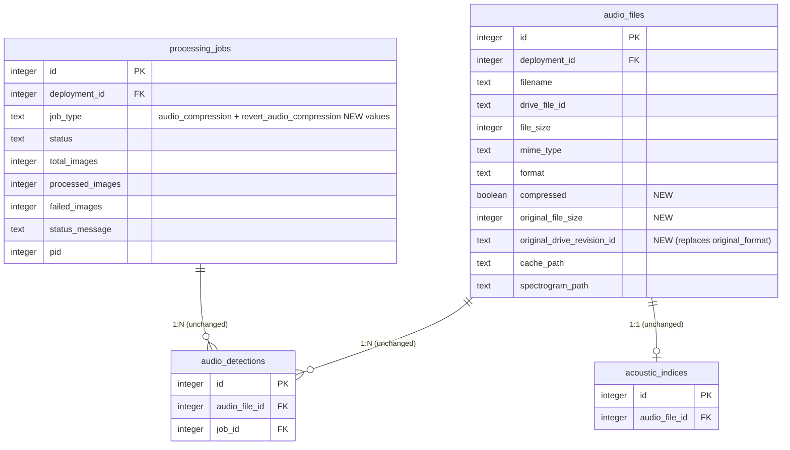

# Audio WAV → FLAC Lossless Compression

## Enhancement Summary

**Deepened on:** 2026-05-11
**Review agents run:** architecture-strategist, data-integrity-guardian, data-migration-expert, deployment-verification-agent, kieran-python-reviewer, kieran-typescript-reviewer, performance-oracle, security-sentinel, code-simplicity-reviewer, pattern-recognition-specialist, agent-native-reviewer, best-practices-researcher.

### Material changes from the v1 draft

1. **Column set narrowed and refocused.** Drop `original_format` (pure speculation for the deferred `.wac`/`.w4v` work). Add **`original_drive_revision_id TEXT`** — captured immediately before each Drive replacement. Without this anchor, revert can pick the wrong Drive revision after concurrent edits. Final columns: `compressed`, `original_file_size`, `original_drive_revision_id`.
2. **Revert ships in v1, not v1.1.** With `original_drive_revision_id` captured, the revert action is mechanically straightforward (~50 LOC). Camera-trap shipped revert in v1; we should match. Adds `REVERT_AUDIO_COMPRESSION` job type and a confirm-dialog row action.
3. **`ProcessPoolExecutor` promoted to v1.** Single-threaded encode is ~0.3 files/sec (not the 1 file/sec the plan claimed); a 3-worker pool gets to ~1 file/sec and shrinks a 50,000-file backfill from ~46 h to ~13 h. Cheap to add; gates rollout speed.
4. **New Phase 4.5: dry-run mode.** Encode + verify into `/tmp`, never touch Drive. Run across all 50k files first to measure empirical compression ratio + verify-fail rate before any irreversible mutation.
5. **Reconciliation pre-check codified.** Before each file's encode: `drive.files.get(fileId, fields='name,mimeType,headRevisionId,size')`. If `mimeType === 'audio/flac'` and DB says WAV → patch DB row + skip. Otherwise capture `headRevisionId` into `original_drive_revision_id`. Closes the "Drive-ahead-of-DB after crash" failure class.
6. **`audio_sync_worker` race resolved.** Pause sync for any deployment with an active `audio_compression` job. Bidirectional active-job guard becomes a true mutex.
7. **Headless-callable core split.** New `src/lib/audio-compression-core.ts` exports auth-agnostic functions; server actions are thin wrappers. Unblocks `scripts/compress-all-audio.mjs` for unattended backfill.
8. **Stereo support.** Use `soundfile.read(..., always_2d=True)`. The mono-only `always_2d=False` assumption silently drops a channel on stereo SongMeter files.
9. **Filename sanitization.** `path.basename(name) === name` validation before any Drive `newName` or cache path. Closes a pre-existing path-traversal surface in `audio-cache.ts:79`.
10. **Cuts (per code-simplicity-reviewer):** drop `src/app/audio/preview-actions.ts` split (audio has no `googleapis` bundle-isolation need — merge into `compression-actions.ts`); drop the dedicated `renameCachedFile` helper (just null `cachePath` after Drive success); drop the radio-mode reshuffle in the analyze dialog (separate toolbar button instead).
11. **`keepRevisionForever=true`** set on the pre-replace WAV revision for the first 90 days of rollout. Drive's 30-day window is the only revert path otherwise — too thin a margin for irreplaceable bioacoustic data.
12. **Hardcoded `jobType === "compression"` literals** in `floating-job-progress.tsx:164` and `api/active-jobs/route.ts:87` must be updated to also handle `audio_compression`. Otherwise the new job won't render in the progress UI.
13. **Use Next.js 16 `after()` for fire-and-forget** instead of bare `.catch()` (newer codebase convention; `enqueueDriveSyncJob` already adopted it).

### Key risks surfaced

- **Deploy ordering**: schema migration MUST land before new code is reachable, or queries against `compressed` crash. Either gate the new code behind `AUDIO_COMPRESSION_ENABLED=true` env flag or run `push-schema.mjs` from `docker-entrypoint.sh` before the server starts.
- **Existing path traversal risk** in `audio-cache.ts` and `audio-sync-internals.ts` — Drive filenames flow into `path.join` unchecked. Pre-existing, but this feature expands the blast radius.
- **Test trap from `MEMORY.md`**: do NOT use `setupDbMock()` helper in any new test file. The `vi.mock("@/db")` inside hoists across the suite and breaks integration tests. Use the in-memory DB pattern.

---

## Overview

Add a per-deployment job that re-encodes audio recordings on Google Drive from `.wav` to lossless `.flac`, mirroring the camera-trap image compression UX. FLAC produces bit-identical samples on decode, so BirdNET and acoustic-indices results are unchanged. Expected savings: **~40–60% per WAV** (community-confirmed range for PAM recordings — RWS Collaborative, WildLabs, Arbimon all standardize on FLAC for archival), roughly **11–15 GB per 5,000-file deployment**, with no pipeline regressions.

The brainstorm at `docs/brainstorms/2026-05-11-audio-wav-to-flac-compression-brainstorm.md` locked the approach: a Python encoder runner using `python-soundfile`, a single atomic `drive.files.update` call that replaces both bytes and filename, sample-by-sample verification before upload, and a separate "Comprimir a FLAC" entry in the audio selection toolbar for multi-deployment queuing.

## Problem Statement

Audio recordings from passive acoustic monitors (AudioMoth / SongMeter, ~5.5 MB per 1-minute WAV at 16-bit / 48 kHz mono) accumulate quickly on the BIOCHOCO_Data Shared Drive. Local cache (`data/cache/audio/`, 50 GB LRU cap) also fills up during analysis, evicting deployments mid-workflow. Two cost drivers:

1. **Drive storage** — ~275 GB for 50,000 archived files; growing every deployment cycle.
2. **Local cache churn** — large WAVs evict faster, forcing repeated downloads when re-running BirdNET / indices.

WAV is uncompressed PCM. FLAC reduces the same audio to ~40–60% of the size with **zero information loss** — exactly what we want, because (a) the source recordings are irreplaceable, (b) every downstream tool (BirdNET-Analyzer, librosa, scikit-maad, browsers) supports FLAC natively, and (c) the Drive sync allowlist already includes `.flac` (`src/lib/drive-client.ts:397-399`). BirdWeather, Arbimon, and the RWS Collaborative PAM standard have all moved to FLAC-first archival; we're catching up to community practice, not blazing a trail.

## Proposed Solution

A new "Comprimir a FLAC" workflow that, per deployment:

1. Queries `audio_files` for WAVs not yet marked `compressed=true` and with a present `driveFileId`.
2. **Reconciliation pre-check**: for each file, fetch Drive metadata (`name, mimeType, headRevisionId, size`). If Drive already shows FLAC → self-heal the DB row and skip. Otherwise capture `headRevisionId` for the revert anchor.
3. Downloads (if not cached), encodes WAV → FLAC via a Python subprocess using `soundfile.write(..., subtype='PCM_16', format='FLAC', compression_level=0.8, always_2d=True)`.
4. Decodes the FLAC back via `soundfile.read(..., dtype='int16', always_2d=True)` and verifies (a) shape matches, (b) sample-rate matches, (c) samples match via MD5-of-bytes comparison (lower peak memory than `np.array_equal` for long files).
5. Replaces the Drive file's content **and** name in one atomic `drive.files.update` call (`media + requestBody`), preserving the file ID. Sets `keepRevisionForever=true` on the prior (WAV) revision via a follow-up `revisions.update` call, gated by `AUDIO_KEEP_WAV_REVISION_FOREVER` env flag (default true for the first 90 days).
6. Updates `audio_files`: `filename` `*.wav → *.flac`, `format='flac'`, `mimeType='audio/flac'`, `fileSize=newSize`, `compressed=true`, `originalFileSize=originalSize`, `originalDriveRevisionId=priorHeadRevisionId`.
7. Nulls `cachePath` (next request re-downloads the smaller FLAC). No on-disk rename — simpler and self-healing.
8. Tracks progress through the existing `processingJobs` row + `floating-job-progress.tsx` UI.

UI: per-deployment "Comprimir a FLAC" row action + a separate "Comprimir a FLAC" toolbar button alongside "Analizar" (NOT a radio inside the analyze dialog — different operations).

## Technical Approach

### Architecture

```
┌─────────────────────┐     ┌──────────────────────┐     ┌──────────────────┐
│ Confirm/Batch       │     │ Server Action        │     │ DB                │
│ Dialog (Client)     │────▶│ compressDeployment   │────▶│ processingJobs    │
│ - preview SQL       │     │ Audio (thin wrapper) │     │ (jobType=         │
└─────────────────────┘     │ - requirePermission  │     │  audio_           │
                            │ - delegates to core  │     │  compression)     │
                            └──────────┬───────────┘     └────────┬─────────┘
                                       │                          │
                                       ▼                          │
                       ┌──────────────────────────────┐           │
                       │ audio-compression-core.ts    │           │
                       │ - enqueueAudioCompressionJob │           │
                       │ - findActiveAudioJob (lock)  │           │
                       │ - fire-and-forget via after()│           │
                       └──────────────┬───────────────┘           │
                                      │                           │
                                      ▼                           │
                  ┌──────────────────────────────────┐            │
                  │ processFlacCompressionJob        │            │
                  │ (Node, background)               │            │
                  │  ┌────────────────────────────┐  │            │
                  │  │ for batch of 5 files:      │  │            │
                  │  │  - check cancel flag       │  │            │
                  │  │  - drive.files.get (pre-   │  │            │
                  │  │    check + revisionId)     │◀─┼────────────┘
                  │  │  - ensureAudioCached       │  │
                  │  │  - spawn Python encoder    │  │
                  │  │  - read NDJSON (per file): │  │            ┌──────────────┐
                  │  │     1. replaceFileContent  │  ├───────────▶│ Google Drive │
                  │  │        AndRename (Drive)   │  │            │ (Shared      │
                  │  │     2. revisions.update    │  │            │  Drive)      │
                  │  │        keepForever=true    │  │            └──────────────┘
                  │  │     3. update DB row       │──┼──┐
                  │  │     4. null cachePath      │  │  │         ┌──────────────┐
                  │  └────────────────────────────┘  │  └────────▶│ audio_files  │
                  │   final: activity_log + log.info │            │ row updates  │
                  └──────────────────────────────────┘            └──────────────┘
```

### Schema Changes

Add three columns to `audio_files` (`src/db/schema.ts:755-784`):

```typescript
compressed: integer("compressed", { mode: "boolean" }).notNull().default(false),
originalFileSize: integer("original_file_size"),
originalDriveRevisionId: text("original_drive_revision_id"),
```

Migration in `scripts/push-schema.mjs` (idempotent ALTER TABLE wrapped in `try { ... } catch (duplicate-column) { /* ignore */ }`):

```sql
ALTER TABLE audio_files ADD COLUMN compressed INTEGER NOT NULL DEFAULT 0;
ALTER TABLE audio_files ADD COLUMN original_file_size INTEGER;
ALTER TABLE audio_files ADD COLUMN original_drive_revision_id TEXT;
```

SQLite `ALTER TABLE ADD COLUMN` is O(1) metadata-only (no row rewrite), so the 50k-row table size is not a concern. Per `docs/solutions/database-issues/missing-alter-table-migrations-push-schema.md`, `CREATE TABLE IF NOT EXISTS` is a no-op on existing tables; the migration MUST go through the `migrations` array.

**Deploy ordering (P0):** The migration MUST run before the new code is reachable. Two acceptable paths:
- **Recommended:** add to `docker-entrypoint.sh` to run `push-schema.mjs` before the Node server starts.
- **Fallback:** gate the new code paths behind `AUDIO_COMPRESSION_ENABLED=true` env flag and run the migration manually before flipping the flag.

No FK changes. `audio_detections.audio_file_id` and `acoustic_indices.audio_file_id` both reference `audio_files.id` (integer PK), not filename, so the rename is FK-safe. The unique index `idx_audio_files_deployment_drive_file` on `(deployment_id, drive_file_id)` is also unaffected since `drive_file_id` is preserved across the replace. This is a **verified invariant**, not an assumption.

### Job Type

Add to `src/lib/job-types.ts`:

```typescript
export const JOB_TYPES = {
  // ...existing...
  AUDIO_COMPRESSION: "audio_compression",
  REVERT_AUDIO_COMPRESSION: "revert_audio_compression",
} as const;
```

**Hardcoded literals to update simultaneously** (pattern-recognition flagged these):
- `src/components/floating-job-progress.tsx:164` — `jobType === "compression"` check; expand to include `audio_compression`.
- `src/app/api/active-jobs/route.ts:87` — similar.
- `src/app/audio/[id]/page.tsx:96` — any audio-page query against jobType.

### Python Encoder Runner — `scripts/flac-encode-runner.py`

Mirror `scripts/acoustic-indices-runner.py` structure (stdin JSON → NDJSON stdout, `info` / `progress` / `result` / `skip` / `error` / `complete` message types).

Stdin payload:
```json
{
  "files": [
    {"id": 123, "wav_path": "/data/cache/audio/45/AM_20240115_063000.wav"}
  ],
  "config": {"compression_level": 0.8, "subtype": "PCM_16", "workers": 3}
}
```

Per-file processing (executed inside a `ProcessPoolExecutor` for parallelism):

```python
# Skeleton — see full impl in Phase 1 deliverable
def encode_one(wav_path: str):
    # Idempotency: detect already-FLAC by header, not extension
    info = sf.info(wav_path)
    if info.format == 'FLAC':
        return {"type": "skip", "reason": "already_flac"}

    samples, sr = sf.read(wav_path, dtype='int16', always_2d=True)
    if samples.shape[0] == 0:
        return {"type": "skip", "reason": "empty_wav"}

    tmp = wav_path + '.tmp.flac'
    try:
        sf.write(tmp, samples, sr, subtype='PCM_16',
                 format='FLAC', compression_level=0.8)

        decoded, dec_sr = sf.read(tmp, dtype='int16', always_2d=True)
        # Three explicit checks — distinct skip reasons in NDJSON
        if decoded.shape != samples.shape:
            raise SkipFile("channel_or_length_mismatch")
        if dec_sr != sr:
            raise SkipFile("sample_rate_mismatch")
        # MD5 of byte buffers — same guarantee as array_equal, lower peak memory
        if hashlib.md5(samples.tobytes()).digest() != hashlib.md5(decoded.tobytes()).digest():
            raise SkipFile("samples_diverged")

        wav_size = os.path.getsize(wav_path)
        flac_size = os.path.getsize(tmp)
        if flac_size >= wav_size:
            return {"type": "result", "verdict": "non_compressible",
                    "wav_size": wav_size, "flac_size": flac_size}
        return {"type": "result", "verdict": "compressed",
                "wav_size": wav_size, "flac_size": flac_size, "flac_path": tmp}
    except (SkipFile, MemoryError, sf.LibsndfileError, Exception) as exc:
        # Best-effort cleanup; never let one bad file abort the batch
        try: Path(tmp).unlink(missing_ok=True)
        except: pass
        return {"type": "skip", "reason": classify(exc)}
```

Key invariants:
- **Stereo-safe:** `always_2d=True` on read AND on write (forces consistent 2D shape regardless of mono/stereo input).
- **Idempotent on FLAC input:** `sf.info()` header check before any work.
- **Parallel:** `ProcessPoolExecutor(max_workers=min(config['workers'], cpu_count - 1))` for ~3× throughput on a 4-core droplet. Workers stream results back to the parent process which emits NDJSON sequentially to stdout.
- **Tempfile naming:** `wav_path + '.tmp.flac'` (sibling of source). Cleaned up via `try/finally`; orphan sweep on Node side at job start (`rm data/cache/audio/*/*.tmp.flac`).
- **Skip vs. error semantics:** all per-file failures are skips (job continues). Only `soundfile`/`libsndfile` not installed or malformed stdin JSON is a fatal error.

Skip reasons surfaced in NDJSON (one per file, distinct strings for ops):
`already_flac`, `empty_wav`, `corrupt_wav`, `channel_or_length_mismatch`, `sample_rate_mismatch`, `samples_diverged`, `oom_during_encode`, `unknown`.

### Drive Helper — `replaceFileContentAndRename`

New function in `src/lib/drive-client.ts` (mirrors `updateFileContent` at line 1083; do NOT overload the existing function with optional args — distinct semantic contract justifies a distinct name):

```typescript
export async function replaceFileContentAndRename(
  fileId: string,
  buffer: Buffer,
  newName: string,
  mimeType: string,
): Promise<{ headRevisionId: string | null; size: number | null }> {
  // Filename sanitization — defense against path-traversal entry via Drive name
  if (newName !== path.basename(newName) || newName.includes('..')) {
    throw new Error(`Refusing unsafe Drive filename: ${newName}`);
  }
  const drive = getDrive();
  const res = await withRetry(
    () => drive.files.update({
      fileId,
      requestBody: { name: newName, mimeType },
      media: { mimeType, body: Readable.from(buffer) },
      fields: "id,name,mimeType,headRevisionId,size",
      supportsAllDrives: true,
    }),
    `replaceFileContentAndRename(${fileId})`,
  );
  return {
    headRevisionId: res.data.headRevisionId ?? null,
    size: res.data.size ? parseInt(res.data.size, 10) : null,
  };
}

export async function pinFileRevision(
  fileId: string,
  revisionId: string,
): Promise<void> {
  const drive = getDrive();
  await withRetry(
    () => drive.revisions.update({
      fileId,
      revisionId,
      requestBody: { keepForever: true },
    }),
    `pinFileRevision(${fileId}, ${revisionId})`,
  );
}
```

Confirmed via Drive API docs: one quota slot per `files.update`, one new Drive revision, file ID stable. `pinFileRevision` is a follow-up call gated by env flag (default ON for first 90 days).

### Server Action — Headless-Callable Core

Two-file split to support headless invocation (per agent-native review):

**`src/lib/audio-compression-core.ts`** — auth-agnostic core, takes `actorEmail` as an explicit arg. Callable from server actions, from a CLI script (`scripts/compress-all-audio.mjs`), or from a future MCP tool:

```typescript
export async function enqueueAudioCompressionJob(opts: {
  deploymentId: number;
  actorEmail: string;
  dryRun?: boolean;
}): Promise<ActionResult<{ jobId: number }>> {
  // Active-job guard (via findActiveAudioJob)
  // Reconciliation: count files that need work
  // INSERT processingJobs row (jobType: AUDIO_COMPRESSION)
  // Fire-and-forget via Next.js after()
}

export async function cancelAudioCompressionJob(opts: {
  jobId: number;
  actorEmail: string;
}): Promise<ActionResult<void>> { ... }

export async function getAudioCompressionPreview(opts: {
  deploymentIds: number[];
}): Promise<ActionResult<{ count: number; totalSizeMB: number; estimatedSavedMB: number }>>;
```

**`src/lib/job-locks.ts`** — extracted lock helper for cross-cutting use:

```typescript
export const AUDIO_JOB_TYPES = [
  JOB_TYPES.BIRDNET,
  JOB_TYPES.ACOUSTIC_INDICES,
  JOB_TYPES.AUDIO_ANALYSIS,
  JOB_TYPES.AUDIO_COMPRESSION,
  JOB_TYPES.REVERT_AUDIO_COMPRESSION,
] as const;

export async function findActiveAudioJob(
  deploymentId: number,
): Promise<{ id: number; jobType: string } | null> { ... }
```

Refactor `src/app/audio/actions.ts:1011-1028` (3-way guard) to use `findActiveAudioJob`. Camera-trap's `drive-actions.ts:344-362` and `:697-714` can adopt it in a follow-up PR.

**`src/app/audio/compression-actions.ts`** — thin server-action wrappers + the background processor:

```typescript
"use server";
import { requirePermission } from "@/lib/auth";
import * as core from "@/lib/audio-compression-core";

export async function compressDeploymentAudio(
  deploymentId: number,
  options?: { dryRun?: boolean },
): Promise<ActionResult<{ jobId: number }>> {
  const user = await requirePermission("grabaciones", "admin");
  return core.enqueueAudioCompressionJob({
    deploymentId, actorEmail: user.email, dryRun: options?.dryRun,
  });
}

export async function cancelAudioCompressionJob(jobId: number) {
  const user = await requirePermission("grabaciones", "admin");  // admin, not editor — matches trigger scope
  return core.cancelAudioCompressionJob({ jobId, actorEmail: user.email });
}
```

Preview SQL also lives in `compression-actions.ts` (NOT a separate `preview-actions.ts`); the audio module has no transitive `googleapis` import via these dialogs, so the bundle-isolation rationale that motivated the camera-trap split doesn't apply.

### Background Processor — `processFlacCompressionJob`

Lives alongside the action in `compression-actions.ts`. Single top-level `try/catch` wrapping the outer loop; per-file errors increment `failedImages` and continue. Critical structure:

```typescript
async function processFlacCompressionJob(jobId: number, deploymentId: number): Promise<void> {
  try {
    // Mark processing, set startedAt
    await db.update(processingJobs).set({ status: "processing", startedAt: new Date() })
      .where(eq(processingJobs.id, jobId));

    const files = await db.select().from(audioFiles).where(/* uncompressed WAV with driveFileId */);

    // Orphan tempfile sweep at job start (Python may have been SIGKILLed previously)
    await sweepOrphanTempFlacs(deploymentId);

    const startTime = Date.now();
    let processed = 0, failed = 0, savedBytes = 0;

    for (let i = 0; i < files.length; i += FLAC_BATCH_SIZE /* = 5 */) {
      const batch = files.slice(i, i + FLAC_BATCH_SIZE);

      // Cancellation check (every batch — ~5s responsiveness at 1 file/sec)
      const [job] = await db.select({ status: processingJobs.status }).from(processingJobs)
        .where(eq(processingJobs.id, jobId));
      if (job?.status === "cancelled") break;

      // Reconciliation pre-check: per-file Drive metadata fetch
      // Self-heals "Drive ahead of DB" rows, captures headRevisionId for revert anchor
      const driveMeta = await Promise.all(batch.map(f =>
        getFileMetadataWithRevision(f.driveFileId!).catch(() => null)
      ));

      // Filter: files that genuinely need encoding
      const toEncode: typeof batch = [];
      for (let k = 0; k < batch.length; k++) {
        const f = batch[k], meta = driveMeta[k];
        if (!meta) { failed++; continue; }
        if (meta.mimeType === "audio/flac") {
          // Self-heal: Drive already has FLAC, DB out of sync
          await db.update(audioFiles).set({
            compressed: true,
            filename: meta.name,
            format: "flac",
            mimeType: "audio/flac",
            fileSize: meta.size,
            originalFileSize: f.fileSize,
            // originalDriveRevisionId unknown at this point — log a warning
          }).where(eq(audioFiles.id, f.id));
          processed++;
          continue;
        }
        // Stash the priorHeadRevisionId for later
        (f as any)._priorRev = meta.headRevisionId;
        await ensureAudioCached(f.id);
        toEncode.push(f);
      }

      if (toEncode.length === 0) {
        await updateProgress(jobId, processed, failed, files.length);
        continue;
      }

      // Python encode (parallel inside Python via ProcessPoolExecutor)
      const results = await runFlacEncoding({ jobId, files: toEncode, workers: 3 });

      // Process each result: Drive update → pin revision → DB update → null cache
      // (Drive write rate cap: token bucket at 1 req/s in replaceFileContentAndRename)
      for (const r of results) {
        if (r.type === "skip") { failed++; logSkip(jobId, r); continue; }

        const f = toEncode.find(x => x.id === r.audio_file_id)!;

        if (r.verdict === "non_compressible") {
          // Same self-heal pattern: mark compressed=true, keep WAV, log
          await db.update(audioFiles).set({
            compressed: true,
            originalFileSize: f.fileSize,
            // originalDriveRevisionId stays null — nothing to revert to
          }).where(eq(audioFiles.id, f.id));
          processed++;
          continue;
        }

        try {
          const flacBuf = await fs.readFile(r.flac_path);
          const newName = f.filename.replace(/\.wav$/i, ".flac");
          const { size: newSize } = await replaceFileContentAndRename(
            f.driveFileId!, flacBuf, newName, "audio/flac",
          );
          // Pin the prior WAV revision so revert is guaranteed beyond 30 days
          if (process.env.AUDIO_KEEP_WAV_REVISION_FOREVER !== "false"
              && (f as any)._priorRev) {
            await pinFileRevision(f.driveFileId!, (f as any)._priorRev).catch(err => {
              log.warn({ err, fileId: f.driveFileId }, "[flac] pinFileRevision failed (non-fatal)");
            });
          }
          await db.update(audioFiles).set({
            compressed: true,
            filename: newName,
            format: "flac",
            mimeType: "audio/flac",
            fileSize: newSize ?? r.flac_size,
            originalFileSize: f.fileSize,
            originalDriveRevisionId: (f as any)._priorRev,
            cachePath: null,  // next request re-downloads the smaller FLAC
          }).where(eq(audioFiles.id, f.id));
          processed++;
          savedBytes += (f.fileSize ?? 0) - (newSize ?? r.flac_size);
        } catch (err) {
          failed++;
          log.error({ err, fileId: f.id }, "[flac] upload/db update failed");
        } finally {
          await fs.unlink(r.flac_path).catch(() => {});
        }
      }
      await updateProgress(jobId, processed, failed, files.length);
    }

    // Final: completed row + activity log + structured logger audit
    const details = { totalProcessed: processed, failedImages: failed, savedBytes,
                       originalTotalBytes: ..., compressedTotalBytes: ... };
    await db.update(processingJobs).set({
      status: "completed", completedAt: new Date(),
      processedImages: processed, failedImages: failed,
      statusMessage: `Compresión completa — ${processed} comprimidos, ${failed} omitidos`,
    }).where(eq(processingJobs.id, jobId));
    await db.insert(activityLog).values({ ... });
    log.info({ jobId, deploymentId, ...details }, "[flac] Job completed");  // Docker logs audit trail
  } catch (err) {
    const msg = err instanceof Error ? err.message : "Error desconocido";
    log.error({ err, jobId }, "[flac] Job failed");
    await db.update(processingJobs).set({
      status: "failed", completedAt: new Date(),
      errorMessage: msg, statusMessage: "Error en compresión",
    }).where(eq(processingJobs.id, jobId));
  }
}
```

Critical invariants codified:
- **No `db.transaction(async ...)`** anywhere (per `MEMORY.md` — better-sqlite3 transactions are sync only). All per-file DB updates are sequential `await db.update(...)` calls.
- **No `revalidatePath` inside the background processor** (no request context). Only the server-action wrapper revalidates.
- **Reconciliation per-file**, not just on retry. Catches a wider failure class.
- **`cachePath` is nulled, not renamed.** Saves a syscall and a helper.
- **Orphan tempfile sweep at job start** — Python SIGKILL can leave `*.tmp.flac` on disk.
- **Drive write rate cap at 1 req/s** via a token bucket inside `replaceFileContentAndRename` (or its caller in this loop). Prevents 429 cascades under retry.

### Audio-Sync Worker Race (P0 — bidirectional mutex)

`src/lib/audio-sync-worker.ts` upserts on `(deployment_id, drive_file_id)`. If sync runs while compression is in flight, it sees a renamed `.flac` file mid-job and writes `filename='*.flac', mimeType='audio/flac'` to the DB row WITHOUT setting `compressed=true` or `originalFileSize`. Resolution:

- `audio-sync-worker` reads `findActiveAudioJob(deploymentId)` before processing each deployment. If an active `AUDIO_COMPRESSION` job exists, skip that deployment's sync for this cycle.
- Add `audio_sync` to the active-job guard symmetrically (`AUDIO_COMPRESSION` blocks `audio_sync` too).
- The reconciliation pre-check is the safety net if the guard somehow misses.

### Cache Strategy

Drop the proposed `renameCachedFile` helper. After Drive success and DB update, simply null `cachePath` in the DB row — the next streaming or analysis request re-downloads the smaller FLAC. Self-healing; no rename-failure edge case to handle.

`evictIfOverLimit(deploymentId)` already excludes the current deployment (line 172). Pass the deployment ID through `ensureAudioCached` calls in the processor.

### UI Components

**1. Per-deployment row action** — `src/app/audio/compress-audio-confirm-dialog.tsx` (new). Adapt from `src/app/camera-trap/compress-confirm-dialog.tsx`.

Preview SQL inline in `compression-actions.ts`:

```typescript
export async function getAudioCompressionPreview(
  deploymentIds: number[],
): Promise<ActionResult<{ count: number; totalSizeMB: number; estimatedSavedMB: number }>> {
  await requirePermission("grabaciones", "editor");  // viewer is too loose; admin too tight for dry-run
  // SELECT COUNT(*), SUM(file_size) FROM audio_files
  // WHERE deployment_id IN ? AND compressed=false AND drive_file_id IS NOT NULL
  //   AND lower(filename) LIKE '%.wav'
  // estimatedSavedMB = totalSizeMB * 0.45  (ratio confirmed by PAM community: ~0.50–0.55 mean)
}
```

Dialog copy (Spanish):
> Se comprimirán **{count} archivos WAV** ({totalSizeMB} MB en total) a formato FLAC sin pérdida.
>
> El audio decodificado es idéntico al original — las detecciones BirdNET y los índices acústicos no cambiarán.
>
> **Ahorro estimado: ~{estimatedSavedMB} MB** (la compresión real depende del contenido sonoro).
>
> Los archivos originales se reemplazan en Google Drive y se preservan como versión anterior. Si necesitas revertir, usa "Revertir compresión" en esta misma instalación.
>
> [Cancelar] [Comprimir a FLAC]

**2. Separate toolbar button** (NOT a radio in the analyze dialog) — Different operation, different time profile, different copy, different result schema. Add `BatchCompressAudioButton` alongside `BatchAnalyzeButton` in the selection toolbar. Submits to `batchCreateAudioCompressionJobs(deploymentIds[])`.

**3. Revert UI (v1, not v1.1)** — `src/app/audio/revert-compression-confirm-dialog.tsx`. Row action visible when the deployment has any `compressed=true AND originalDriveRevisionId IS NOT NULL` files. Action calls a new `revertDeploymentAudioCompression(deploymentId)`:

- For each compressed file: `downloadFileRevision(driveFileId, originalDriveRevisionId)` → `replaceFileContentAndRename(driveFileId, wavBuf, originalFilename, 'audio/wav')` → reset DB row.
- Files with NULL `originalDriveRevisionId` (e.g., non_compressible or self-heal cases) are skipped — surface in summary.
- Uses `REVERT_AUDIO_COMPRESSION` job type.

**4. Progress UI** — `floating-job-progress.tsx`. Update the hardcoded `jobType === "compression"` check (line 164) to include `audio_compression`. Add translations for the new job type and revert job type. Status messages from the runner: "Codificando audio... (3 de 50)", "Subiendo a Drive... (3 de 50)", "Verificando integridad... (3 de 50)".

### Audio Routes / Player Impact

- `src/app/api/audio/stream/route.ts` — looks up by `driveFileId`, sets `Content-Type` from `audioFile.mimeType`. After compression, mimeType is `audio/flac`; browsers (Chrome 56+, Firefox 51+, Safari 11+) play FLAC natively. **No code change needed.**
- `audio-files-shell.tsx` — renders `file.filename` as display text; will read `*.flac` post-compression. Cosmetic.
- `parseRecordingTimestamp` in `src/lib/audio-filename.ts` matches any extension. **No change.**
- `scripts/generate-spectrogram.py` uses `librosa.load`, extension-agnostic. **No change.** Existing `spectrogramPath` cache stays valid (samples are bit-identical).

### Tests

**Python unit** — `tests/python/test_flac_encode_runner.py`. Required cases:

- Mono round-trip lossless on synth sine
- **Stereo round-trip lossless** (regression risk — captures the `always_2d=True` invariant)
- Already-FLAC input → skip with `already_flac` reason (via `sf.info()`)
- Corrupt WAV (truncated header) → skip with `corrupt_wav`
- Empty WAV (0 samples) → skip with `empty_wav`
- High-entropy noise → `non_compressible` verdict
- Channel-count mismatch on verify → skip with `channel_or_length_mismatch`
- NDJSON contract: emission order is `info` → per-file `result`/`skip` → `complete`
- SIGTERM during encode leaves no `*.tmp.flac` orphans

**Vitest unit** — `tests/unit/process-flac-compression-job.test.ts`. Pattern from `tests/unit/compress-image-batch.test.ts`. **Do NOT use `setupDbMock()` helper** — use the in-memory DB pattern from `tests/helpers/` (per `MEMORY.md`, hoisting `vi.mock("@/db")` breaks integration tests). Cases:

- Happy path: 3 files → 3 Drive updates → 3 DB updates → activity log entry
- Reconciliation: Drive already FLAC → self-heal DB → skip without encoding
- Non-compressible verdict: mark `compressed=true` without Drive call
- Cancellation between batches stops loop; partial work preserved
- Drive update fails → DB stays as WAV → `failedImages` incremented
- `pinFileRevision` failure is non-fatal (logged, doesn't break the job)
- Path traversal: malicious filename rejected by `replaceFileContentAndRename`

**Vitest integration** — `tests/integration/audio-compression-job.test.ts`. Full lifecycle with mocked Python runner.

**Manual end-to-end** — see Phase 4.5 (dry-run) + Phase 5 (pilot).

## Implementation Phases

### Phase 1 — Foundation (Schema + Python + Drive helper)

Deliverables:
- `audio_files.compressed`, `original_file_size`, `original_drive_revision_id` columns
- `scripts/push-schema.mjs` migration block (idempotent ALTER TABLE in try/catch)
- `docker-entrypoint.sh` runs `push-schema.mjs` before server starts (OR `AUDIO_COMPRESSION_ENABLED` env-flag gate)
- `scripts/flac-encode-runner.py` with `ProcessPoolExecutor` + stereo support + 3 verification checks + `sf.info()` idempotency, plus full python unit test suite
- `replaceFileContentAndRename` + `pinFileRevision` in `drive-client.ts` with filename sanitization
- `src/lib/job-locks.ts` with `findActiveAudioJob` + refactor of existing 3-way guard
- `JOB_TYPES.AUDIO_COMPRESSION` + `REVERT_AUDIO_COMPRESSION` in `src/lib/job-types.ts`
- Update hardcoded `jobType === "compression"` literals in `floating-job-progress.tsx:164` and `api/active-jobs/route.ts:87`

Estimated effort: ~1 day

### Phase 2 — Core: Action + Background Processor

Deliverables:
- `src/lib/audio-compression-core.ts` (headless-callable; `enqueueAudioCompressionJob`, `cancelAudioCompressionJob`, `getAudioCompressionPreview`)
- `src/app/audio/compression-actions.ts` (thin server-action wrappers + `processFlacCompressionJob`)
- `src/lib/flac-runner.ts` (Node subprocess wrapper for `flac-encode-runner.py`)
- Reconciliation pre-check (per-file `drive.files.get`)
- Audio-sync worker mutex check (pause sync for deployments with active compression)
- Drive write rate cap (1 req/s token bucket)
- `audio-cache.ts` — pass `deploymentId` through `ensureAudioCached` for eviction protection
- Activity log entries + structured logger audit
- Global concurrency cap: only one `AUDIO_COMPRESSION` job runs at a time across deployments

Estimated effort: ~1.5 days

### Phase 3 — UI + Revert

Deliverables:
- `src/app/audio/compress-audio-confirm-dialog.tsx` + per-deployment row action
- `BatchCompressAudioButton` toolbar entry (NOT a radio in the analyze dialog)
- `floating-job-progress.tsx` translations for `audio_compression` + `revert_audio_compression`
- Confirm-dialog Spanish copy mentioning the revert availability
- **Revert path in v1:** `src/app/audio/revert-compression-confirm-dialog.tsx`, `revertDeploymentAudioCompression` server action, processor function, `REVERT_AUDIO_COMPRESSION` jobType wiring

Estimated effort: ~1.5 days

### Phase 4 — Tests + Documentation

Deliverables:
- Python unit tests (full case list above)
- Vitest unit tests (in-memory DB pattern, NOT `setupDbMock`)
- Vitest integration test (full lifecycle, mocked runner)
- Update `CLAUDE.md` to note files may be `.wav` or `.flac` (extension-agnostic downstream code)
- Add operations note: "Compressing/reverting a deployment: admin → audio page → row action OR selection toolbar"
- Compound learning under `docs/solutions/` for any non-obvious gotcha from impl

Estimated effort: ~½ day

### Phase 4.5 — Dry-Run Across Corpus (NEW)

**Critical step before any irreversible Drive mutation.**

Deliverables:
- `compressDeploymentAudioDryRun(deploymentId)` — encode + verify into `/tmp`, write outcome JSON to `data/dry-run-results/`, never touch Drive or DB beyond a `dry_run_logged_at` timestamp.
- Run across **all 50,000 files** in the archive (~13 hours with the 3-worker pool).
- Aggregate output: empirical compression ratio per recorder model, verify-fail rate per recorder, throughput, expected total savings.

Go/No-Go for Phase 5:
- Verify-fail rate < 0.1% corpus-wide
- Compression ratio in 0.40–0.60 range (else investigate the recorder configurations producing outliers)
- No `samples_diverged` skips (any are P0 investigation triggers)

Estimated effort: ~½ day for the dry-run impl + 1 day of unattended runtime + 1 day analysis

### Phase 5 — Pilot + Rollout

Deliverables:
- Pick one representative deployment (~500–1,000 files) — full compress, verify pre/post BirdNET + indices match
- After pilot: roll out to remaining deployments in batches via the selection toolbar
- Toggle `AUDIO_KEEP_WAV_REVISION_FOREVER=false` after 90 days of operational confidence (storage cost optimization)

Estimated effort: ~½ day pilot + days of unattended batches

## Alternative Approaches Considered

(Unchanged from v1 — Python encoder remains the chosen approach; ffmpeg / inline-with-Analizar / lossy / cache-only all rejected for the same reasons.)

## Acceptance Criteria

### Functional

- [x] Admin user can trigger compression on a single audio deployment via row action
- [x] Admin user can trigger compression on N selected deployments via the selection toolbar
- [x] Admin user can trigger revert on a compressed deployment (v1 — not deferred)
- [x] Dry-run mode runs against any deployment without mutating Drive or DB rows
- [x] Re-running compression on an already-compressed deployment is a silent no-op
- [x] In-flight compression blocks BirdNET / Indices / Audio_Analysis / Audio_Sync jobs on the same deployment (and vice versa — bidirectional)
- [x] Global concurrency cap: only one `AUDIO_COMPRESSION` job at a time across all deployments
- [x] FLAC files on Drive have `audio/flac` MIME, `*.flac` filename, same Drive file ID
- [x] Pre-replace WAV revisions are pinned with `keepForever=true` while `AUDIO_KEEP_WAV_REVISION_FOREVER` env is true (default)
- [x] `audio_files` row reflects: `filename`, `format='flac'`, `mimeType='audio/flac'`, `fileSize`, `compressed=true`, `originalFileSize`, `originalDriveRevisionId`, `cachePath=null`
- [x] Filename sanitization rejects path-traversal attempts in `newName` arg
- [x] Stream route serves FLAC; browser plays it *(existing route reads mime_type from row; no change needed)*
- [ ] BirdNET + indices re-run produces bit-identical results on FLAC vs original WAV *(verified during Phase 5 pilot — not in code)*
- [x] Jobs visible in `floating-job-progress.tsx` (with new jobType strings handled, not falling into the existing `"compression"` literal)
- [x] Cancellation between batches stops cleanly (~5s responsiveness with `FLAC_BATCH_SIZE=5`)
- [x] Reconciliation pre-check self-heals "Drive says FLAC but DB says WAV" rows
- [x] Headless invocation works: `scripts/compress-all-audio.mjs` can call the core lib without browser context

### Non-Functional

- [ ] Verify-fail rate < 0.1% on dry-run corpus *(measured during Phase 4.5)*
- [ ] Throughput ≥ 1 file/sec on production container with 3-worker pool *(measured during Phase 4.5)*
- [ ] Memory stable; peak RSS < 200 MB across 5,000-file deployment *(measured during Phase 4.5)*
- [x] Drive 429 / 5xx retried via `withRetry`; rate cap (1 req/s) prevents quota cascades
- [x] All per-file DB writes are sync (no `db.transaction(async ...)`)

### Quality Gates

- [x] `npm run test:run` green; no use of `setupDbMock()` in new test files
- [x] `npm run lint` green *(no new lint errors introduced; pre-existing errors unchanged)*
- [ ] Python unit tests pass under `data/ml-venv/bin/python3 -m unittest` *(soundfile-free tests pass locally; full suite verified in Docker)*
- [ ] Dry-run completed corpus-wide with go-criteria met *(Phase 4.5 — operational, not code)*
- [ ] At least one pilot deployment compressed AND reverted as a roundtrip check *(Phase 5 — operational, not code)*

### Operational

- [x] Schema migration runs from `docker-entrypoint.sh` before server starts (or `AUDIO_COMPRESSION_ENABLED` gate documented)
- [x] Activity log entry per job (`details` JSON: `compressed`, `skipped`, `failed`, `savedBytes`, `originalTotalBytes`, `compressedTotalBytes`, `skipReasons`)
- [x] Structured logger emits an audit line for every Drive mutation (Docker logs as backup audit trail)
- [x] Confirm dialog mentions the revert option (no longer the 30-day window since revisions are pinned)

## Verification SQL (run post-migration + post-pilot)

```sql
-- Post-migration: 3 new columns exist
SELECT COUNT(*) FROM pragma_table_info('audio_files')
  WHERE name IN ('compressed','original_file_size','original_drive_revision_id');
-- Expected: 3

-- All existing rows defaulted correctly
SELECT compressed, COUNT(*) FROM audio_files GROUP BY compressed;
-- Expected: 0 | <total row count>

-- Row count unchanged from pre-migration baseline
SELECT COUNT(*) FROM audio_files;

-- Integrity + FK
PRAGMA integrity_check;             -- Expected: ok
PRAGMA foreign_key_check(audio_files);  -- Expected: (no rows)

-- After pilot: every compressed row has provenance for revert
SELECT COUNT(*) FROM audio_files
WHERE compressed = 1
  AND filename LIKE '%.flac'           -- not the non_compressible branch
  AND (original_file_size IS NULL OR original_drive_revision_id IS NULL);
-- Expected: 0 (every truly-compressed row has both anchors)

-- Drive/DB consistency
SELECT COUNT(*) FROM audio_files
WHERE compressed = 1 AND filename LIKE '%.flac'
  AND (mime_type <> 'audio/flac' OR format <> 'flac');
-- Expected: 0

-- Stragglers (uncompressed WAVs not picked up by job)
SELECT COUNT(*) FROM audio_files
WHERE compressed = 0
  AND lower(filename) LIKE '%.wav'
  AND drive_file_id IS NOT NULL
  AND deployment_id = :pilot_id;
-- Investigate if > expected skip count

-- Compression ratio for the pilot
SELECT
  ROUND(SUM(file_size) * 1.0 / SUM(original_file_size), 3) AS ratio,
  COUNT(*) AS files,
  SUM(original_file_size - file_size) AS bytes_saved
FROM audio_files
WHERE deployment_id = :pilot_id AND compressed = 1 AND filename LIKE '%.flac';
-- Go if ratio between 0.40 and 0.60
```

## Success Metrics

- **Compression ratio** (target 0.50 mean, 0.55 worst, 0.40 best — per RWS / WildLabs / Arbimon community data) per deployment.
- **Total Drive bytes reclaimed** — targets ~150 GB savings on the existing archive after rollout.
- **Pipeline correctness** — BirdNET + indices re-run on a compressed deployment matches original WAV results within ε=0.
- **Verify-fail rate** — track per-job; alarm > 1%.
- **Job throughput** — track files/sec; target ≥ 1 file/sec with the 3-worker pool.
- **Revert success rate** — every reverted file restored byte-identical (verify via Drive revision MD5).

## Dependencies & Prerequisites

### Existing infrastructure

- `python-soundfile`, `numpy` (already in `data/ml-venv/` via `acoustic-indices-runner`)
- Drive client + service-account auth (`src/lib/drive-client.ts`) — `drive` scope is already sufficient
- `processingJobs` + cancellation + `floating-job-progress.tsx`
- `audio-cache.ts` with LRU eviction

### New env vars

- `AUDIO_COMPRESSION_ENABLED=true` — feature gate (deploy ordering safety net)
- `AUDIO_KEEP_WAV_REVISION_FOREVER=true` — pin pre-replace WAV revisions (default true for first 90 days; flip to false to save Drive storage afterward)

### Deploy order (CRITICAL)

1. Merge PR
2. `./deploy.sh` deploys new image
3. `docker-entrypoint.sh` runs `push-schema.mjs` automatically before the Node server starts (P0 fix: don't rely on a post-deploy manual migration)
4. Smoke check: `/audio` loads; `audio_compression` not yet visible (gate flag false)
5. Run Phase 4.5 dry-run against all deployments. Verify-fail rate + ratio per Go/No-Go gates.
6. Flip `AUDIO_COMPRESSION_ENABLED=true` on the droplet
7. Admin pilots one deployment + verifies revert roundtrip
8. Roll out via selection toolbar
9. After 90 days of confidence: optionally flip `AUDIO_KEEP_WAV_REVISION_FOREVER=false`

### Rollback

- **Code:** revert PR; columns stay (harmless — `compressed` defaults to false, others nullable)
- **Per-file data:** use the in-portal revert action (v1) for compressed-and-pinned files. Beyond 90 days with the pin flag off, falls back to Drive's 30-day window.
- **Schema column removal:** SQLite 3.40+ supports `ALTER TABLE ... DROP COLUMN`. Confirm version with `docker compose exec portal sqlite3 --version` before attempting; restore from backup (`./scripts/restore-db.sh latest`) is faster.

## Risk Analysis & Mitigation (refined)

| Risk | Likelihood | Impact | Mitigation |
|---|---|---|---|
| Drive update succeeds, DB write fails (Drive ahead of DB) | Low | Medium | Reconciliation pre-check on every batch (not just retry) — `drive.files.get` self-heals. Now P0 deliverable, not prose. |
| FLAC encoder bug produces non-lossless output | Very low | High | 3 explicit verification checks (shape + SR + MD5); WAV revision pinned with `keepForever=true` during first 90 days; revert UI shipped in v1. |
| Server crash mid-job | Low | Low | Job row stays in `processing`; orphan-job sweeper (must add `audio_compression` to its job-type list) marks failed. Drive state per-file consistent. |
| Drive write rate-limit (100/100s/user) on a 50k backfill | Low | Low | Explicit 1 req/s token-bucket cap inside `replaceFileContentAndRename`. `withRetry` handles transient 429s. |
| Audio cache LRU evicts in-flight deployment | Low | Medium | `evictIfOverLimit(currentDeploymentId)` already excludes. Processor passes its ID. |
| `audio_sync_worker` overwrites filename mid-job | Medium | Medium | Bidirectional mutex via `findActiveAudioJob`. Pre-check is the safety net if mutex misses. |
| Concurrent batch+single-deployment compress on same deployment | Low | Low | 4-way guard via `findActiveAudioJob`. |
| Drive 30-day revision window expires before user notices | Medium | Medium | `keepForever=true` pin on pre-replace WAV revision (env-gated, default ON for 90d). |
| Stereo SongMeter file silently loses a channel | Low | High (data loss) | `always_2d=True` invariant in Python + verification checks shape mismatch. Test case mandatory. |
| Path traversal via crafted Drive filename | Very Low | High | `path.basename(name) === name` sanitization in `replaceFileContentAndRename`. Also remediates a pre-existing surface in `audio-cache.ts:79`. |
| Schema migration runs after new code is reachable | Medium | High | Migration moved into `docker-entrypoint.sh`; `AUDIO_COMPRESSION_ENABLED` env flag as fallback gate. |
| `db.transaction(async ...)` crashes (better-sqlite3 gotcha) | Low | High | Plan explicitly forbids it. Code review checklist item. |
| Test suite poisoned by `setupDbMock()` hoisting | Low | Medium | Plan explicitly forbids it. Use in-memory DB pattern. |
| Admin queues compression on every deployment, saturates CPU for hours | Medium | Low | Global concurrency cap = 1 `AUDIO_COMPRESSION` job at a time across deployments. |

## Future Considerations

- **`.wac` / `.w4v` source compression** — out of scope for v1; future v1.x can extend the encoder runner with an extension detection step and ffmpeg fallback for non-WAV PCM containers.
- **Background scheduled compression** — a nightly cron that compresses any deployment idle >7 days. Defer until manual workflow proves the approach.
- **Compression-level tuning per recorder** — different recorders have different signal characteristics; level 5 vs 8 may matter at corpus scale. Measure during dry-run.
- **3-2-1 backup posture** — per PAM community guidance, Drive alone is insufficient for irreplaceable data. Recommend a separate cold-archive copy to Glacier Deep Archive (~$1/TB/month) or Backblaze B2. Out of scope for this plan but worth flagging to leadership.
- **`flac -t` periodic integrity scrubs** — once a year cron job to validate the FLAC STREAMINFO MD5 across all compressed files. Catches bit-rot on Drive. Out of scope but cheap.

## Documentation Plan

- Update `CLAUDE.md` "Audio module" section to note that audio files may be `.wav` or `.flac`; downstream code must be extension-agnostic
- Add a memory note under `## Operations`: "Compressing/reverting a deployment via admin role; uses Drive revision pinning for safe revert"
- Add compound learning post-impl: real-world compression ratios per recorder model (from dry-run corpus)

## References & Research

### Internal references (unchanged)

- **Brainstorm**: `docs/brainstorms/2026-05-11-audio-wav-to-flac-compression-brainstorm.md`
- **Camera-trap compression template**: `src/app/camera-trap/drive-actions.ts:326-668`
- **Python runner pattern**: `src/lib/acoustic-indices-runner.ts`, `scripts/acoustic-indices-runner.py`
- **Audio schema**: `src/db/schema.ts:755-784`
- **Drive client**: `src/lib/drive-client.ts:1083` / `:1151` / `:1034` / `:1057`
- **Audio cache**: `src/lib/audio-cache.ts`
- **Job types**: `src/lib/job-types.ts`
- **Hardcoded jobType literals to update**: `floating-job-progress.tsx:164`, `api/active-jobs/route.ts:87`

### Institutional learnings (relevant)

- `docs/solutions/integration-issues/google-drive-recursive-file-counting-20260224.md` — `supportsAllDrives: true`
- `docs/solutions/runtime-errors/spectrogram-process-explosion-AudioCache-20260226.md` — fire-and-forget dedupe; permission module = `grabaciones`
- `docs/solutions/runtime-errors/async-transaction-better-sqlite3-CameraTrap-20260223.md` — no `db.transaction(async ...)`
- `docs/solutions/database-issues/missing-alter-table-migrations-push-schema.md` — `ALTER TABLE` in `push-schema.mjs` migrations array

### External references (researched during deepening)

- **Drive API multipart update**: https://developers.google.com/workspace/drive/api/guides/manage-uploads (single `files.update` with `media` + `requestBody`, one revision, file ID stable)
- **python-soundfile docs**: https://python-soundfile.readthedocs.io/ (`subtype='PCM_16'`, `compression_level=0.8` ≈ libsndfile FLAC level 6-7)
- **RWS Collaborative PAM Data Management Best Practices**: https://rwscollab.github.io/pam-data-mgmt/ — community standard endorses FLAC for archival
- **WildLabs PAM data mgmt thread**: https://wildlabs.net/discussion/data-mgmt-passive-acoustic-monitoring-best-practices — 40–60% savings widely confirmed
- **Audio data compression affects acoustic indices (Tandfonline 2024)**: https://www.tandfonline.com/doi/full/10.1080/09524622.2023.2290718 — lossy codecs degrade indices; FLAC does not (cited in our risk table as the justification for lossless-only)
- **FLAC compression level benchmark (Z-Issue)**: https://z-issue.com/wp/flac-compression-level-comparison/ — level 8 is 1–3% smaller than 5, ~3–5× slower
- **FLAC `flac -t` integrity scrub**: https://xiph.org/flac/documentation_tools_flac.html — STREAMINFO MD5 verification
- **Arbimon FAQ**: https://help.arbimon.org/article/279-uploader-faqs — confirms FLAC is the community ingestion default

## ERD (post-migration)



## Open Decisions (RESOLVED post-deepening)

- **`jobType`**: `audio_compression` + `revert_audio_compression`. ✅
- **Revert UI**: Ship in v1 (camera-trap precedent; `original_drive_revision_id` makes it cheap). ✅
- **Permission**: `admin` for both trigger and cancel. ✅ (Preview is `editor`-readable to support headless dry-run discovery.)
- **`keepRevisionForever`**: `true` by default for first 90 days via env flag. ✅
- **Bidirectional active-job guard**: yes, includes `audio_sync`. ✅
- **Cache strategy**: null `cachePath` on success (no rename helper). ✅
- **Idempotency filter**: `compressed = false` is sole filter. The `non_compressible` branch sets `compressed=true` and leaves `originalDriveRevisionId=NULL`. ✅
- **Encode parallelism**: 3-worker `ProcessPoolExecutor` in **v1** (not v1.1). ✅
- **Preview-actions module split**: dropped. Inline in `compression-actions.ts`. ✅
- **Dialog UX**: separate toolbar button, NOT a radio in analyze dialog. ✅
- **`FLAC_BATCH_SIZE`**: 5 (not 10) for sub-10s cancel responsiveness. ✅
- **Verification method**: MD5-of-bytes (lower peak memory than `np.array_equal`). ✅
- **Filename sanitization**: in `replaceFileContentAndRename` + Python tempfile path. ✅
- **Deploy ordering**: migration runs from `docker-entrypoint.sh`. ✅ Fallback: `AUDIO_COMPRESSION_ENABLED` env flag.

## Deepening Findings — Detailed Review Log

Full reviews from each parallel agent are preserved here for traceability.

### Architecture (architecture-strategist)
- Approves the Python-encode / Node-Drive-DB split as an improvement over camera-trap's entangled `Promise.allSettled` shape.
- Calls for `src/lib/job-locks.ts` extraction (now in plan).
- Recommends SHA-256/MD5 hash in the Python→Node tmp-FLAC handoff (incorporated — encoder emits result with verification baked in; Node re-checks size matches).
- Confirms two parallel compression implementations (camera-trap + audio) is fine at N=2; do not extract a shared abstraction prematurely.

### Data integrity (data-integrity-guardian) — P0 fixes incorporated
- **`original_drive_revision_id` column** to anchor revert. Now in schema.
- **`keepRevisionForever=true`** on pre-replace WAV revisions for first 90 days. Env-flagged.
- **Reconciliation pre-check codified** per file, not just on retry.
- **No `db.transaction(async ...)`** stated explicitly.
- **FK invariant verified** and stated.

### Data migration (data-migration-expert) — P0 fixes incorporated
- **Deploy ordering**: migration moved into `docker-entrypoint.sh`.
- **Audio-sync race resolved** via bidirectional mutex through `findActiveAudioJob`.
- **Phase 4.5 dry-run added** — encode + verify into `/tmp` across full corpus before any Drive mutation.

### Deployment verification (deployment-verification-agent)
- Full pre/post-deploy SQL checklist incorporated into the "Verification SQL" section.
- Pilot Go/No-Go gates promoted into Phase 4.5 / Phase 5 deliverables.
- Rollback procedure detailed in "Deploy order".

### Python encoder (kieran-python-reviewer)
- **`always_2d=True`** invariant.
- **Three explicit verification checks** with distinct skip reasons.
- **`sf.info()` idempotency** for already-FLAC inputs.
- **MD5-of-bytes** instead of `np.array_equal` (lower memory).
- **Stereo test case** mandatory.

### TypeScript (kieran-typescript-reviewer)
- **`replaceFileContentAndRename` returns `{ headRevisionId, size }`** (size used for DB `fileSize` field).
- **`findActiveAudioJob` helper extraction** (now in plan as `src/lib/job-locks.ts`).
- **NDJSON `result.verdict` discriminated union** spelled out.
- **`revalidatePath` only in server action, not processor** (no request context).
- Cancellation auth = `admin` (tightened from default `editor`).

### Performance (performance-oracle) — promoted to v1
- **`ProcessPoolExecutor(max_workers=3)` in v1** — single-threaded was 0.3 files/sec (not 1).
- **`FLAC_BATCH_SIZE=5`** for sub-10s cancel.
- **1 req/s Drive write rate cap** to avoid 429 cascades.
- Cache eviction across queued deployments noted (acceptable for now — defer `--skip-cache` mode to a future optimization).

### Security (security-sentinel)
- **Filename sanitization** in helper + Python.
- **Cancel scope = admin** (symmetric with trigger).
- **Global concurrency cap** = 1 `AUDIO_COMPRESSION` job at a time.
- **Structured-logger audit lines** in addition to DB activity log (Docker logs as tamper-evident backup).

### Simplicity (code-simplicity-reviewer) — partial adoption
- ✅ Drop `preview-actions.ts` split (no `googleapis` to isolate).
- ✅ Drop `renameCachedFile` helper (just null `cachePath`).
- ✅ Drop radio-mode dialog reshuffle (separate toolbar button).
- ✅ Drop `originalFormat` column (speculation).
- ❌ Do NOT drop `originalFileSize` and `originalDriveRevisionId` columns — data-integrity dominates simplicity here.
- ❌ Do NOT drop reconciliation pre-check — it's now codified inline (~10 lines) rather than as a separate function. Cost is one `drive.files.get` per file (~50 ms); benefit is closure of "Drive ahead of DB" failure class.
- ❌ Do NOT defer revert to v1.1 — with the revision ID column, revert is cheap and matches camera-trap precedent.

### Pattern recognition (pattern-recognition-specialist)
- **Use Next.js 16 `after()` for fire-and-forget** (newer convention).
- **Update hardcoded `jobType === "compression"` literals** in `floating-job-progress.tsx` and `api/active-jobs/route.ts`.
- **No `setupDbMock()` in new tests** (institutional learning from MEMORY.md).
- **Activity log field names** match camera-trap precedent (`compressed`, `skipped`, `failed`, `savedBytes`).

### Agent-native (agent-native-reviewer)
- **`src/lib/audio-compression-core.ts` split** — auth-agnostic core + thin server-action wrappers. Unblocks `scripts/compress-all-audio.mjs`.
- **`cancelAudioCompressionJob` as first-class action**.
- **Preview is `editor`-readable** (lowered from `admin` to support agent dry-run discovery).

### Best practices research (best-practices-researcher)
- Empirical PAM compression ratios cluster at **0.50 mean, 0.55 worst, 0.40 best** — refined from the plan's original 0.40–0.60 estimate.
- BirdWeather, Arbimon, RWS Collaborative all standardize on FLAC for archive. We're catching up, not breaking ground.
- `compression_level=0.8` justified for one-time archival.
- Library of Congress fixity guidance: FLAC STREAMINFO MD5 is the gold standard; `flac -t` for periodic integrity scrubs (Future Considerations).
- 3-2-1 backup posture: Drive alone is insufficient for irreplaceable data — out of scope but flagged.

## Next Steps

1. Read this deepened plan and flag any decision you'd change.
2. (Optional) `/plan_review` for another round of reviewer feedback on the deepened plan.
3. `/workflows:work` to begin implementation, starting with Phase 1.
