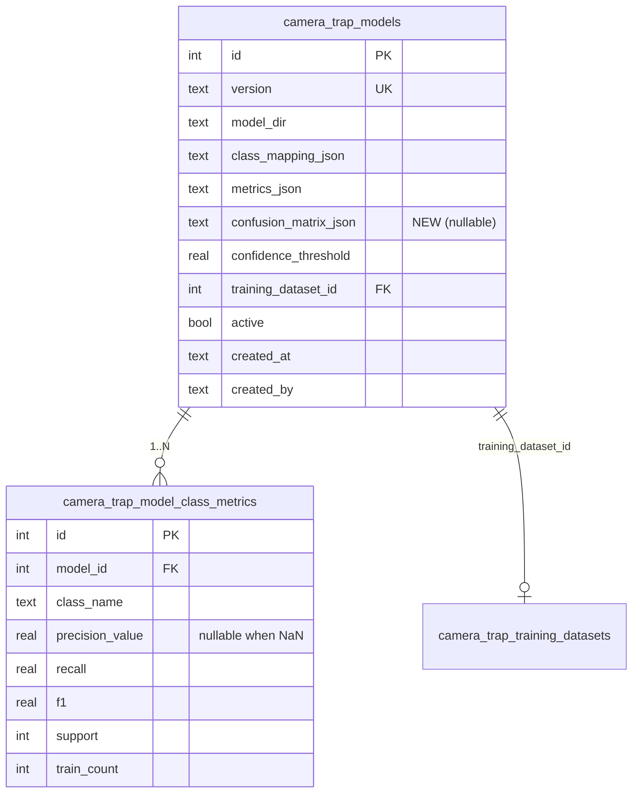

# Camera Trap Model Comparison & Per-Species Metrics

## Enhancement Summary

**Deepened on:** 2026-05-22
**Sections enhanced:** 8 (Schema, Import, Comparison Table, Drill-down/Heatmap, Risks, Acceptance Criteria, References, plus new Security & Performance sections)

**Agents consulted (parallel):** `framework-docs-researcher` (TanStack v8), `best-practices-researcher` (CSV + confusion-matrix UX), `architecture-strategist`, `code-simplicity-reviewer`, `kieran-typescript-reviewer`, `data-integrity-guardian`, `performance-oracle`, `security-sentinel`.

### Key Improvements Adopted

1. **Security hardening of the import surface** — symlink-traversal rejection via `fs.lstat`/`realpath`, file-size caps before parse, class-name shape validation, `weightsSha256` in audit trail.
2. **Use `csv-parse/sync`** instead of hand-rolled split — already in production deps (`csv-parse@^6.1.0`), handles BOM/CRLF/quoting correctly.
3. **Switch `ParsedMetrics` to a Zod schema** — `zod@4.3.6` already in deps with precedent at `src/app/public/apply/fields.ts`; replaces both `JSON.parse as ParsedMetrics` and `validateMetricsContract`.
4. **`ImportError` discriminated union** + `MetricCell` tagged union on the wire — three distinct N/A states become exhaustiveness-checked, not stringly-typed.
5. **TanStack idioms** — `sortUndefined: 'last'` (no custom comparator needed), tanstack column pinning helpers for sticky columns, single delegated tooltip on the heatmap (not 900 Radix `<Tooltip>` instances), `useMemo` deps `[visibleClasses, metricMode]` only.
6. **Lazy-load `confusionMatrixJson` on row expand** — drops initial page payload ~60%, keeps TTFB under budget.
7. **Confusion-matrix UX best practices** — Cividis palette (CVD-safe), sort classes by support descending by default, add "% of total" normalization mode, top-N confused pairs panel, render as `<table>` with `scope` + `aria-label` for screen-reader access.
8. **Schema corrections** — drop redundant `idx_ct_mcm_class` and `idx_ct_mcm_model` indexes (the unique composite covers the leading-prefix case), make `train_count` nullable (decouple contract enforcement from storage), add `axisConvention: "row=true,col=pred"` field inside `confusionMatrixJson`.
9. **Concurrency + audit gaps** — move the duplicate-version check inside the import transaction (or catch `SQLITE_CONSTRAINT_UNIQUE`), emit `ct_model.register_failed` on rejection, include `weightsSha256` + `metricsSha256` + `trainingDatasetContentHash` in event details.
10. **Performance discipline** — inline `style={{backgroundColor}}` with 10-stop precomputed hex palette (not dynamic Tailwind classes), `contain: paint` on the scroll container, dev-only render counter to catch memo regressions in review.

### Considerations Surfaced & Resolved

- **Simplicity reviewer pushed to cut metric-mode selector, 3 heatmap modes, column visibility menu, and the `confusionMatrixJson` column** ("ship F1-only, row-normalized, on-demand CSV read"). **Decision: keep all three but lazy-load the matrix.** Rationale: brainstorm unified all three use cases on one page; F1 alone loses precision/recall comparison; row/col normalization diagnose different errors. The lazy-load addresses the perf concern without dropping features.
- **Architecture reviewer suggested `contract: { version, artifacts }` nested shape** instead of top-level `contractVersion`. **Adopted** — one-line change in `train.py`, future-proof.
- **Kieran's branded `ConfusionMatrix` type** — **skipped**. Branded types are not yet established in this codebase (the dominant pattern is `as const` per `src/lib/job-queue.ts:38`). Instead: add `axisConvention` field inside the JSON itself (data > types when data crosses a serialization boundary anyway).
- **Latent bug flagged**: Python `json.dumps(NaN)` produces invalid JSON literal `NaN` which `JSON.parse` rejects. Confirm `train.py` serializes NaN as `null` via `json.dumps(..., allow_nan=False)` + sentinel, or replace NaN client-side at the source.

## Overview

Expand the existing `/camera-trap/models` admin page into a comparison view across all registered classifier models. Surface per-species precision/recall/F1/support/train-count in sortable columns, with a per-model drill-down that renders a confusion-matrix heatmap and full training hyperparameters. Bump the training-repo contract to require `trainCount` in `metrics.json` and to elevate `confusion_matrix.csv` from sidecar to required output.

Goal: one screen that supports all three admin use cases — pick the right model before activating, audit per-species strengths/weaknesses, and track improvement across model versions.

## Problem Statement / Motivation

Today the training pipeline already produces rich per-class metrics (`metrics.json.perClass[<class>].{precision,recall,f1,support}`) and a confusion matrix CSV. The portal:

- Stores `metricsJson` as an opaque blob (`cameraTrapModels.metricsJson`, `src/db/schema.ts:430-454`).
- Only surfaces `overall.top1Accuracy` in the UI (`src/app/camera-trap/models/page.tsx:35-60`).
- Does not import `confusion_matrix.csv` at all (`actions.ts:registerModelFromDir`, lines 129-337, only reads `weights.pt`, `metrics.json`, `class_mapping.json`).
- Has no per-species data accessible to SQL — sort/filter/comparison queries are impossible.

As more models are produced, admins can't tell whether a new model regressed on tapir while improving overall, or which species are starved of training data. Picking the right active model is currently guesswork.

## Proposed Solution

Implement **Approach B from the brainstorm**: normalize per-class metrics into a dedicated table; keep confusion matrix and hyperparameters as JSON blobs.

**Two-repo change set:**

1. **Training repo** (`/Users/luke/apps/fcat-biochoco-camera-classifier/train.py`):
   - Add `trainCount: int` to each `perClass[<class>]` entry (already available via `manifest.counts_per_class[slug]["train"]` in `data.py`).
   - Document `confusion_matrix.csv` as a required output (already produced today; just a contract status change).
   - Bump a `contractVersion` field in `metrics.json` from implicit v1 to explicit `"v2"`.

2. **Portal** (`/Users/luke/apps/fcat-portal/`):
   - New table `camera_trap_model_class_metrics` (one row per model × class).
   - New column `cameraTrapModels.confusionMatrixJson` (CSV parsed to nested JSON at import time).
   - Import-time validation rejects models lacking `contractVersion === "v2"`.
   - Convert `models-table.tsx` from static HTML table to a client-side `@tanstack/react-table` with dynamic per-species columns + drill-down rows.
   - New client component `ConfusionMatrixHeatmap` (CSS-grid; no new dependency — recharts has no native heatmap and is not worth bringing in another library for a 20×20 matrix).

## Technical Approach

### Architecture

**Data flow**

```
train.py
  ├── writes data/models/<version>/weights.pt
  ├── writes data/models/<version>/metrics.json  (now includes perClass[*].trainCount + contractVersion: "v2")
  ├── writes data/models/<version>/class_mapping.json
  └── writes data/models/<version>/confusion_matrix.csv  (now REQUIRED)

           │
           ▼  admin clicks "Registrar" in portal
           │
src/app/camera-trap/models/actions.ts:registerModelFromDir
  ├── validateMetricsContract     ─ rejects v1 contracts
  ├── parseConfusionMatrixCsv     ─ NEW; rejects non-square / label mismatch
  ├── db.transaction (sync):
  │   ├── INSERT cameraTrapModels  (+confusionMatrixJson)
  │   └── INSERT cameraTrapModelClassMetrics × N  (one per class)
  └── recordEvent ct_model.register

           │
           ▼  admin loads /camera-trap/models
           │
page.tsx (Server Component, requireAdmin)
  ├── SELECT models                   ← list
  ├── SELECT class_metrics WHERE model_id IN (...)   ← pivot in JS
  ├── pass plain POJO  { models, byModelClass }  to client
  └── render <ComparisonTable />        (client, tanstack)

ComparisonTable (client)
  ├── tanstack table with dynamic species columns
  ├── species column header sort by metricMode { precision | recall | F1 }
  ├── per-row expandable detail panel:
  │   ├── ConfusionMatrixHeatmap (CSS grid)
  │   ├── per-class detail table (precision, recall, F1, support, trainCount)
  │   └── hyperparameter block (parses metricsJson.training)
```

**Why client-side sort:** the comparison table has dynamic species columns (union across all models). The codebase's SSR URL-param sort pattern (`research-applications/page.tsx`, `admin/activity/page.tsx`) requires a compile-time `SORTABLE_COLUMNS` map and is awkward when columns are data-driven. The client `tanstack` pattern at `src/app/finance/expenses/expense-table.tsx` is the right fit — dataset is small (<50 models in any realistic horizon), columns are dynamic, expandable rows are first-class in `@tanstack/react-table`.

### ERD



Notes:
- Column is named `precision_value` not `precision` (SQLite reserved word in some contexts; safer to avoid).
- `precision_value`, `recall`, `f1` are nullable to handle sklearn `NaN` when `support == 0`.
- Composite uniqueness `(model_id, class_name)` enforced via index.
- No FK on `class_name` to any taxonomy table — class names are model-local strings, not normalized species. Class-rename across versions is out of scope (separate columns in the UI).

### Implementation Phases

#### Phase 1: Training-repo contract bump

**File**: `/Users/luke/apps/fcat-biochoco-camera-classifier/train.py`

- [ ] Add `"contractVersion": "v2"` to the metrics dict (line 609-628).
- [ ] In the `per_class` dict literal at lines 583-588, add `"trainCount": int(manifest.counts_per_class[slug]["train"])`.
- [ ] Update README to document `confusion_matrix.csv` as a required output and the bumped contract version. The CSV writer at lines 630-636 stays as-is (raw integer counts, sklearn row=true / col=predicted convention, square N×N with header).
- [ ] Re-train (or just re-export with the updated emit code) at least one model to validate end-to-end.

```python
# train.py:583-588 — edit per_class dict literal
per_class[slug] = {
    "precision": float(p),
    "recall": float(r),
    "f1": float(f1),
    "support": int(s),
    "trainCount": int(manifest.counts_per_class[slug]["train"]),  # NEW
}

# train.py:609 — add to metrics dict
metrics = {
    "contractVersion": "v2",   # NEW
    "modelVersion": cfg.version,
    ...
}
```

#### Phase 2: Portal schema + migration

**File**: `/Users/luke/apps/fcat-portal/src/db/schema.ts`

- [x] Add `confusionMatrixJson: text("confusion_matrix_json")` to `cameraTrapModels` (nullable; line 430-454).
- [x] Add new table `cameraTrapModelClassMetrics`:

```ts
// src/db/schema.ts — new table after cameraTrapModels
export const cameraTrapModelClassMetrics = sqliteTable(
  "camera_trap_model_class_metrics",
  {
    id: integer("id").primaryKey({ autoIncrement: true }),
    modelId: integer("model_id")
      .notNull()
      .references(() => cameraTrapModels.id, { onDelete: "cascade" }),
    className: text("class_name").notNull(),
    precisionValue: real("precision_value"), // nullable: NaN when support=0
    recall: real("recall"),
    f1: real("f1"),
    support: integer("support").notNull(),
    trainCount: integer("train_count"), // nullable: decouples contract enforcement (in validateMetricsContract) from storage. Future legacy backfill stays viable without a schema change.
  },
  (table) => ({
    // Unique composite is the ONLY index needed:
    // - prevents duplicates
    // - SQLite uses it as a prefix index for `WHERE model_id = ?` (covers byModel use case)
    // - no current query filters by className alone (a future "per-class history" query
    //   can add `index("idx_ct_mcm_class")` then; indexes cost on every import write).
    uniqModelClass: uniqueIndex("idx_ct_mcm_model_class").on(
      table.modelId,
      table.className,
    ),
  }),
);

export type CameraTrapModelClassMetric =
  typeof cameraTrapModelClassMetrics.$inferSelect;
export type NewCameraTrapModelClassMetric =
  typeof cameraTrapModelClassMetrics.$inferInsert;
```

**File**: `/Users/luke/apps/fcat-portal/scripts/push-schema.mjs`

- [x] Append to the `tables` array (existing CT tables at lines 519-548):

```sql
-- camera_trap_model_class_metrics (2026-05-22)
CREATE TABLE IF NOT EXISTS camera_trap_model_class_metrics (
  id INTEGER PRIMARY KEY AUTOINCREMENT,
  model_id INTEGER NOT NULL REFERENCES camera_trap_models(id) ON DELETE CASCADE,
  class_name TEXT NOT NULL,
  precision_value REAL,
  recall REAL,
  f1 REAL,
  support INTEGER NOT NULL,
  train_count INTEGER  -- nullable; contract enforces presence in importer
);
CREATE UNIQUE INDEX IF NOT EXISTS idx_ct_mcm_model_class
  ON camera_trap_model_class_metrics(model_id, class_name);
-- No standalone byModel / byClass index: the unique composite covers the
-- leading-prefix `WHERE model_id = ?` case; no current query filters by class_name.
```

### Research Insights — Schema

**Architecture review (architecture-strategist):**
- The composite unique covers the model-id-prefix case in SQLite; dropping the standalone `byModel` index removes a write cost per import row.
- The `ON DELETE` asymmetry is correct and worth annotating in `schema.ts`: `biochoco_identifications.classifier_model_id → SET NULL` preserves audit evidence; `camera_trap_model_class_metrics.model_id → CASCADE` cleans derived rows.

**Data integrity (data-integrity-guardian):**
- `ADD COLUMN` (nullable, no default) is O(1) metadata-only in SQLite — no table rewrite, no lock contention. The plan's idempotent try/catch ALTER pattern at `push-schema.mjs:690-727` is the right tool.
- **Deploy order matters**: `node scripts/push-schema.mjs` must run before the new code is rolled out. Otherwise new code SELECTing `confusion_matrix_json` against the old schema fails. The existing `./deploy.sh` flow already does schema-push-first; verify.
- Bulk-insert ceiling: `SQLITE_MAX_VARIABLE_NUMBER` is 32766 in modern SQLite (8 columns × ~4000 rows max per statement). Realistic class counts are <50 so a single `.values(perClassRows).run()` is fine, but document the cap and chunk at 400 rows defensively if the codebase ever sees taxonomies above 500 classes.

- [x] Append `ALTER TABLE camera_trap_models ADD COLUMN confusion_matrix_json TEXT` to the `migrations` array (existing block lines 690-727). The try/catch swallows the error if the column already exists — safe to re-run. See learning: `docs/solutions/database-issues/missing-alter-table-migrations-push-schema.md`.

- [x] Verify locally: `docker compose exec portal node scripts/push-schema.mjs`.

- [x] No CHECK constraints added → no table-recreation needed. (See gotcha `gotcha_drizzle_enum_vs_sqlite_check.md` — we deliberately avoid CHECK on a `contract_version` enum to skip the recreation dance.)

#### Phase 3: Import pipeline updates

**File**: `/Users/luke/apps/fcat-portal/src/app/camera-trap/models/actions.ts`

- [ ] **Replace** the `ParsedMetrics` interface (lines 44-61) with a Zod schema at `src/app/camera-trap/models/metrics-schema.ts`. `zod@4.3.6` is already in deps; precedent at `src/app/public/apply/fields.ts`. The schema becomes the contract definition AND the validator — replaces both `JSON.parse as ParsedMetrics` and the bulk of `validateMetricsContract`. Use the nested `contract: { version: "v2", artifacts: [...] }` shape (per architecture review) so future field additions don't claim new top-level keys.
- [ ] **Pre-parse security caps** (`fs.stat` before `fs.readFile`):
  - `metrics.json`: reject if size > 1 MB.
  - `class_mapping.json`: reject if size > 256 KB.
  - `confusion_matrix.csv`: reject if size > 500 KB.
- [ ] **Path-safety hardening** of `registerModelFromDir(dirName)` (current sanitization at `actions.ts:151-153` is incomplete):
  - Allowlist regex: `/^[A-Za-z0-9._-]+$/`.
  - Reject names starting with `.`.
  - `fs.lstat` each of `weights.pt`, `metrics.json`, `class_mapping.json`, `confusion_matrix.csv`; reject if any is a symlink.
  - Belt-and-suspenders: `fs.realpath(path.resolve(MODELS_ROOT, dirName))` must start with `MODELS_ROOT + path.sep`.
- [ ] **Class-name shape validation** in the Zod schema (defense in depth against XSS / export-injection): each entry of `classListOrdered` must match `/^[A-Za-z0-9_\-. ]{1,128}$/`. Camera-trap species labels (slugs and binomials like `Leopardus_tigrinus` or `tigrillo oncilla`) fit this; the constraint blocks `<svg onload=…>` patterns at the source.
- [ ] **Use `csv-parse/sync`** (already in production deps — `csv-parse@^6.1.0`, confirmed in `package.json`). Do NOT hand-roll `split(',')` — BOM, CRLF, trailing newlines, and any future quoted class names are silent footguns.

```ts
// src/app/camera-trap/models/parse-confusion-matrix.ts
import { parse } from "csv-parse/sync";
import { z } from "zod";

const ConfusionRowSchema = z.array(z.string());

export interface ParsedConfusionMatrix {
  readonly classes: readonly string[];
  readonly matrix: ReadonlyArray<ReadonlyArray<number>>;
  readonly axisConvention: "row=true,col=pred"; // self-describing for downstream consumers
}

export function parseConfusionMatrixCsv(
  csvText: string,
  classListOrdered: readonly string[],
): ParsedConfusionMatrix {
  const rows: string[][] = parse(csvText, {
    bom: true,
    skip_empty_lines: true,
    trim: true,
    relax_column_count: false,
  });
  const N = classListOrdered.length;
  if (rows.length !== N + 1) throw new ImportError({ kind: "shape_mismatch", expected: N + 1, got: rows.length, axis: "row" });
  // Header row: first cell empty, then N class labels
  const header = rows[0].slice(1);
  for (let i = 0; i < N; i++) {
    if (header[i] !== classListOrdered[i]) {
      throw new ImportError({ kind: "label_mismatch", axis: "col", index: i, expected: classListOrdered[i], got: header[i] });
    }
  }
  const matrix: number[][] = [];
  for (let i = 0; i < N; i++) {
    const row = rows[i + 1];
    if (row.length !== N + 1) throw new ImportError({ kind: "shape_mismatch", expected: N + 1, got: row.length, axis: "col" });
    if (row[0] !== classListOrdered[i]) {
      throw new ImportError({ kind: "label_mismatch", axis: "row", index: i, expected: classListOrdered[i], got: row[0] });
    }
    const cells: number[] = [];
    for (let j = 0; j < N; j++) {
      const v = Number(row[j + 1]);  // Number(), not parseInt — handles future floats correctly
      if (!Number.isFinite(v) || v < 0 || !Number.isInteger(v)) {
        throw new ImportError({ kind: "shape_mismatch", expected: 0, got: j, axis: "col" });
      }
      cells.push(v);
    }
    matrix.push(cells);
  }
  return { classes: classListOrdered, matrix, axisConvention: "row=true,col=pred" };
}
```

- [ ] **`ImportError` discriminated union** (per Kieran review). Replaces the freeform-string error inside `ActionResult.error` for the import path. Maps to Spanish at the action boundary; tests assert on `kind`, not on copy.

```ts
export type ImportError =
  | { kind: "missing_file"; file: "weights.pt" | "metrics.json" | "confusion_matrix.csv" | "class_mapping.json" }
  | { kind: "file_too_large"; file: string; sizeBytes: number; maxBytes: number }
  | { kind: "symlink_rejected"; file: string }
  | { kind: "invalid_dir_name"; dirName: string }
  | { kind: "contract_version_unsupported"; got: string }
  | { kind: "missing_field"; path: string }
  | { kind: "shape_mismatch"; expected: number; got: number; axis: "row" | "col" }
  | { kind: "label_mismatch"; axis: "row" | "col"; index: number; expected: string; got: string }
  | { kind: "class_name_invalid"; className: string };

function importErrorToSpanish(e: ImportError): string {
  switch (e.kind) {
    case "missing_file": return `Falta el archivo requerido: ${e.file}`;
    case "file_too_large": return `Archivo ${e.file} excede el tamaño máximo (${e.sizeBytes} > ${e.maxBytes} bytes)`;
    case "symlink_rejected": return `Enlaces simbólicos no permitidos: ${e.file}`;
    case "invalid_dir_name": return `Nombre de directorio inválido: ${e.dirName}`;
    case "contract_version_unsupported": return `Contrato obsoleto (${e.got}). Re-exportar con versión v2.`;
    case "missing_field": return `Falta el campo: ${e.path}`;
    case "shape_mismatch": return `Matriz de confusión: dimensiones inesperadas (${e.axis} esperaba ${e.expected}, obtuvo ${e.got})`;
    case "label_mismatch": return `Matriz de confusión: etiqueta ${e.axis} ${e.index} no coincide (esperaba "${e.expected}", obtuvo "${e.got}")`;
    case "class_name_invalid": return `Nombre de clase inválido: "${e.className}"`;
  }
}
```

- [ ] **Transactional integrity**:
  - **Move the duplicate-version check INSIDE the transaction**, or catch `SQLITE_CONSTRAINT_UNIQUE` and return the friendly Spanish error. Current pre-check (`actions.ts:234-244`) is racy: two concurrent registrations of the same `version` both pass, the loser gets a raw DB error string.
  - After the bulk `tx.insert(cameraTrapModelClassMetrics).values(perClassRows).run()`, add a post-insert COUNT assertion inside the same transaction: `SELECT COUNT(*) FROM camera_trap_model_class_metrics WHERE model_id=?` must equal `classListOrdered.length`. Throw to rollback if not — catches partial inserts from any unexpected exception in the loop.
  - Per CLAUDE.md, `db.transaction((tx) => ...)` — synchronous only.
- [ ] **Augment audit trail** in `recordEvent({ eventType: "ct_model.register", … })`:
  - `classCount: classListOrdered.length`
  - `contractVersion: "v2"`
  - `weightsSha256`: SHA-256 of `weights.pt` bytes (lets us detect post-registration tampering)
  - `metricsSha256`: SHA-256 of `metrics.json` bytes
  - `trainingDatasetContentHash`: pulled from `metrics.json` (currently lookup-only, not logged)
  - `backbone`, `recommendedConfidenceThreshold`
- [ ] **New event type `ct_model.register_failed`** (`source: "camera-trap"`, `severity: "warning"`). Fires on every import rejection with `details: { dirName, error: ImportError }`. Per CLAUDE.md guidance for admin mutations.
- [ ] **`setActiveModel`** (lines 343-426): wrap the partial-unique-index activation in a try/catch for `SQLITE_CONSTRAINT_UNIQUE` → return Spanish error `"Otro administrador acaba de activar un modelo. Refrescá la página."`. Catches concurrent activate races.
- [ ] **`deleteModel`** (lines 432-480): no FK changes needed. **Augment** the existing `recordEvent` `details` with `classMetricRowsDeleted` (computed from `SELECT COUNT(*) … WHERE model_id=?` BEFORE the DELETE) and `identificationsNullified` (likewise from `biochoco_identifications`). CASCADE is silent; the event is the audit trail.

### Research Insights — Import Pipeline

**Security review (security-sentinel) — see new Security Considerations section below for full table.** High-severity items: symlink traversal (use `lstat`), file size caps before parse, class-name shape validation.

**Kieran TypeScript review (kieran-typescript-reviewer):**
- Zod is already a dep at `4.3.6` with precedent at `src/app/public/apply/fields.ts`. Plan now uses it as the contract definition AND validator — single source of truth, structured `result.error.issues` for tests.
- The `ImportError` tagged union makes the 5 rejection tests assert on `kind` rather than string-matching Spanish copy (more robust against translation churn).
- Branded `ConfusionMatrix` type was considered but skipped — branded types are not yet established in this codebase. Instead the axis convention rides inside the JSON itself (`axisConvention: "row=true,col=pred"`), which is more durable when the value crosses a serialization boundary.

**Architecture review (architecture-strategist):**
- Validate `new Set(Object.keys(perClass))` equals the ordered class-list set (no extras, no missing). The transaction-level COUNT assertion enforces this on the wire side too.
- Nest the contract under `contract: { version, artifacts: [...] }` in `metrics.json` so future additions (per-sample logits, etc.) don't claim top-level real estate.

**Data integrity (data-integrity-guardian):**
- Latent bug (separate from this plan): Python `json.dumps(NaN)` produces the literal `NaN` in the output, which `JSON.parse` rejects. Either set `allow_nan=False` in `train.py` and replace with `null` sentinel, or call `json.dumps(data, default=lambda v: None if math.isnan(v) else v)`. Flag for follow-up — this would silently break the existing v1 importer too on any class with `support=0`.

#### Phase 4: Comparison table UI

**Files**:
- `/Users/luke/apps/fcat-portal/src/app/camera-trap/models/page.tsx` (server)
- `/Users/luke/apps/fcat-portal/src/app/camera-trap/models/models-table.tsx` (client, to be replaced/rewritten)
- `/Users/luke/apps/fcat-portal/src/app/camera-trap/models/comparison-table.tsx` (NEW client)
- `/Users/luke/apps/fcat-portal/src/app/camera-trap/models/model-detail-panel.tsx` (NEW client)

- [ ] **Server page** (`page.tsx`):
  - Continue calling `requireAdmin()` (line 15).
  - After `SELECT * FROM cameraTrapModels`, `SELECT * FROM cameraTrapModelClassMetrics WHERE modelId IN (...)`.
  - Group by `modelId` server-side into `byModelClass: Record<number, ClassMetric[]>`.
  - Pass `{ models, byModelClass, allClassesUnion: string[] }` to the new `ComparisonTable` client component.
  - Spanish heading remains (`Modelos`).

- [ ] **Comparison table** (`comparison-table.tsx`, new):
  - Use `@tanstack/react-table` per `src/app/finance/expenses/expense-table.tsx` recipe.
  - Fixed columns: `Versión`, `Dataset`, `Top-1`, `F1 macro`, `Umbral`, `Activo`, `Fecha`.
  - Dynamic species columns: one per class in `allClassesUnion` (sorted alphabetically by default; visibility controlled by user — see Phase 5).
  - Each species column header shows the class name + the currently selected metric mode (`F1`, `Precision`, `Recall`).
  - A single `MetricSelector` above the table (segmented control, Spanish: `F1` / `Precisión` / `Recall`) drives all species columns. Default: `F1`. Persisted in localStorage.
  - Cell rendering for species column:
    - Class not in model's vocabulary → `—` (gray)
    - Metric is null (NaN) → `—` (gray, tooltip: "Sin soporte de prueba")
    - trainCount === 0 → render the metric value but with an italic-gray treatment + tooltip "Sin imágenes de entrenamiento"
    - Otherwise → number formatted to 2 decimals with bg-color tint scaled by value (red→amber→green at 0/0.5/1)
  - Sort by species column: numeric desc/asc; nulls always sink to bottom regardless of direction (custom `sortingFn`).
  - Active model row pinned at top by default (stable across sort), with a small badge `Activo` in the Versión cell.
  - Use the shared `SortIcon` from `@/components/sort-icon` for the header sort indicator.
  - Sticky left column (Versión) using `position: sticky; left: 0` so admins don't lose context when horizontally scrolling.
  - Per-row expand button (`ChevronRight` from lucide) → opens `ModelDetailPanel` below the row.

```tsx
// src/app/camera-trap/models/comparison-table.tsx — sketch
// CRITICAL: id stays stable; only accessorFn closes over metricMode.
// Putting metricMode into the id would invalidate sort/visibility state on every toggle.
const speciesColumns = useMemo<ColumnDef<ModelRow>[]>(
  () => visibleClasses.map((cls) => ({
    id: `sp__${cls}`,
    accessorFn: (row) => row.byClass[cls]?.[metricMode] ?? undefined, // undefined, not null — sortUndefined handles it natively
    header: cls,
    sortUndefined: "last",   // tanstack v8: nulls/undefined always sink, both directions
    sortDescFirst: true,     // first click on a metric column shows top performers
    cell: (info) => <ClassMetricCell cell={info.row.original.byClass[cls]} />,
  })),
  [visibleClasses, metricMode],   // deps: do NOT include row data — accessorFn reads it at sort time
);

const columns = useMemo(
  () => [...fixedColumns, ...speciesColumns],
  [speciesColumns],
);
```

### Research Insights — Comparison Table (TanStack v8)

**Framework docs (framework-docs-researcher):**
- **`sortUndefined: "last"`** is the canonical solution — no custom `sortingFn` needed. Combined with `accessorFn ?? undefined`, null/N-A rows sink in both asc and desc with zero comparator code. (A hand-rolled `nullsLastNumericSort` works too if you keep `null` semantics; both options documented above in the Kieran review section.)
- **Sticky columns**: use tanstack's built-in pinning (`column.pin("left")`, `column.getStart("left")`) with the official `getCommonPinningStyles(column)` helper, not hand-rolled `position: sticky` CSS. Gives correct `left` offsets if multiple columns are ever pinned.
- **Sticky-column gotchas**:
  - The `<table>` must have `border-collapse: separate` (the default `collapse` makes borders disappear on sticky cells).
  - Pinned cells must have a solid `background-color` (otherwise rows show through during horizontal scroll).
  - The expanded sub-row should NOT contain a pinned cell — give the expansion `<tr>` its own non-sticky markup.
- **Column visibility persistence**: lazy-init `useState<VisibilityState>` from `localStorage`, then `useEffect` writes through on change. Avoid passing `columnVisibility` to BOTH `initialState` and `state` — `state` wins silently. Controlled mode is required for persistence.
- **Expand pattern**: `getRowCanExpand: () => true` + `getExpandedRowModel: getExpandedRowModel()`. Render with `<React.Fragment>` per row; render a second `<tr>` when `row.getIsExpanded()`. Toggle button calls `row.getToggleExpandedHandler()`.
- **Performance**: tiny table (50 rows × 37 cols) — no virtualization needed. The main perf trap is unmemoized `columns` arrays. Memoize on `[visibleClasses, metricMode]` only; row data flows through the `data` prop.

**Anti-patterns to explicitly avoid:**
- Encoding `metricMode` into column `id` (breaks state).
- Writing a custom `sortingFn` when `sortUndefined: "last"` + `?? undefined` works.
- Pure-CSS `position: sticky` without `border-collapse: separate`.
- Expand toggle inside a `<TableRow onClick={…}>` without `e.stopPropagation()` — see existing memory `gotcha_react_portal_event_bubbling.md`.

**Existing repo reference**: `src/app/finance/expenses/expense-table.tsx` is the canonical client-side TanStack pattern; mirror its shape.

#### Phase 5: Drill-down detail + heatmap

**File**: `/Users/luke/apps/fcat-portal/src/app/camera-trap/models/model-detail-panel.tsx` (NEW)

Drill-down content for an expanded row:

- [ ] **Per-class table** (full precision/recall/F1/support/trainCount):
  - Columns: `Clase`, `Precisión`, `Recall`, `F1`, `Soporte (test)`, `Entrenamiento`.
  - Sortable client-side (tanstack again, small dataset).
  - Filter input: `Mínimo de soporte` (numeric, default 0). Filters classes with `support < N`.
- [ ] **Hyperparameters panel** (parsed from `metricsJson.training`):
  - Optimizer, lr, weight_decay, batch_size, warmup_epochs, scheduler, loss, mixed_precision.
  - `Epochs entrenados / solicitados`, `Mejor epoch`, `Early stopped`.
  - `Git SHA`, `Finalizado`, `wandb` link if present.
  - Renders gracefully with `—` for any missing field (forward-compat with future training fields).
- [ ] **Confusion matrix heatmap**:
  - File: `src/app/camera-trap/models/confusion-matrix-heatmap.tsx` (NEW).
  - **Lazy-loaded**: do NOT include `confusion_matrix_json` in the initial page-level `SELECT`. Fetch on row expand via a small server action `getConfusionMatrix(modelId)` — drops initial payload ~60% and keeps TTFB under budget. (Performance review recommendation.)
  - **Render as a real `<table>`**, not divs in a grid — `<th scope="row">` and `<th scope="col">` for class labels, `role="grid"` on the wrapper, `<caption>` summarizing matrix size + current mode + dominant confused pair. Layout via `table-layout: fixed` + `border-collapse: separate; border-spacing: 1px`. (Accessibility recommendation; sklearn/Tensorboard both fail this.)
  - **Four modes** (segmented control, Spanish): `Crudo`, `Por fila (recall)`, `Por columna (precisión)`, `% del total`. Default: `Por fila`. Persist via component-local state (do NOT add to localStorage — drill-down state is ephemeral).
  - **Cividis colormap** (perceptually uniform, deuteranopia-safe). Sequential, not diverging — count data has no meaningful midpoint. **Fixed `[0, 1]` range** for normalized modes (so two models compare visually); raw mode scales to per-matrix max. Avoid Reds/Greens; never use `jet`/rainbow.
  - **Highlight the diagonal structurally, not chromatically**: thicker right+bottom border + bold cell text. (Per the Neo paper — separate chromatic scales for diagonal vs off-diagonal break visual comparability.)
  - **Color application**: 10-stop precomputed hex palette indexed by `Math.floor(value * 9)`; applied as inline `style={{ backgroundColor }}`. Inline styles are NOT slower than dynamic Tailwind classes here — JIT can't pick up runtime values anyway, and inline avoids CSSOM churn. (Performance review.)
  - **Class sort within the heatmap**: default to **by support descending** (puts dominant classes top-left, makes long-tail confusion patterns visually obvious). Add a small dropdown for `Alfabético` and `Cluster (similitud)` (agglomerative average-linkage on `(M + Mᵀ)/2`). Persisted in component-local state. (Confusion-matrix UX best-practices.)
  - **Cell labels**: show numeric value when cell width ≥ 32px (computed from N); otherwise hide. The accessible label is always present via `aria-label` on each `<td>`.
  - **Tooltips — delegate at the grid root**:
    - Each `<td data-true="..." data-pred="..." data-count="..." data-row-pct="..." data-col-pct="..." data-total-pct="...">` carries its data attributes.
    - Single `onMouseMove` on the grid reads `e.target.closest("td").dataset` and positions ONE floating tooltip.
    - DO NOT use 900 separate Radix `<Tooltip>` instances — that's ~2MB heap and ~180–250ms mount on a 30×30 matrix. (Performance review.)
    - Tooltip must also fire on keyboard focus (`tabindex="0"` on cells, focus handler shows the same tooltip). (Accessibility recommendation.)
  - **Tooltip content (Spanish)**: `Verdadero: <true> · Predicho: <pred> · conteo: <n> · fila: <p>% · columna: <q>% · del total: <r>%`.
  - **Top-N confused pairs panel** (next to the heatmap): list of off-diagonal cells sorted descending by count, showing `[verdadero → predicho: N (X% del soporte)]` for top 10. (Confusion-matrix UX best-practices — "where 80% of the diagnostic value lives.")
  - **Download as CSV** button — exports the displayed matrix (raw or normalized depending on mode). Useful both for analysts and as the accessible alternative to a visual matrix.
  - **Horizontal scroll** if N > 15 to keep cells ≥ 32px wide. Wrap scroller in `contain: paint`; no `box-shadow` on the sticky column (Safari repaint cost). (Performance review.)

```tsx
// confusion-matrix-heatmap.tsx — sketch
type Mode = "raw" | "rowNorm" | "colNorm" | "totalNorm";
type SortMode = "support" | "alpha" | "cluster";

const CIVIDIS_10: readonly string[] = [
  "#00224e", "#123570", "#3b496c", "#575c6e", "#707173",
  "#8a8678", "#a59c74", "#c3b369", "#e1cc55", "#fde737",
];

export function ConfusionMatrixHeatmap({
  classes, matrix, supports, mode = "rowNorm", sortMode = "support",
}: {
  classes: readonly string[];
  matrix: ReadonlyArray<ReadonlyArray<number>>;
  supports: ReadonlyArray<number>;  // for default sort
  mode?: Mode;
  sortMode?: SortMode;
}) {
  const order = useMemo(() => computeOrder(classes, matrix, supports, sortMode), [classes, matrix, supports, sortMode]);
  const display = useMemo(() => normalize(matrix, mode, order), [matrix, mode, order]);
  // delegated tooltip state
  const [tip, setTip] = useState<TipState | null>(null);
  return (
    <div className="overflow-x-auto" style={{ contain: "paint" }}>
      <table
        role="grid"
        className="border-separate border-spacing-px"
        onMouseMove={(e) => updateTipFromEvent(e, setTip)}
        onMouseLeave={() => setTip(null)}
      >
        <caption className="sr-only">{captionText(classes, mode, display)}</caption>
        <thead>{/* column headers with scope="col" */}</thead>
        <tbody>{/* one row per class; each <td> has aria-label and data-* attrs */}</tbody>
      </table>
      {tip && <FloatingTooltip {...tip} />}
    </div>
  );
}
```

### Research Insights — Confusion Matrix Visualization

**Best-practices research (best-practices-researcher):**
- **Cividis** (sequential, perceptually uniform, CVD-safe) is the modern default. Plotly, Matplotlib, and Datawrapper all ship it. Older Viridis is also fine.
- **Fixed `[0, 1]` range** in normalized modes is what enables two-model visual comparison; per-matrix max breaks that.
- **`% of total`** (sklearn's `normalize='all'`) is a 10-line addition and surfaces class imbalance immediately. Worth including.
- **Sort by support DESC** is the most useful default; cluster-similarity sort is powerful for taxonomic confusion (e.g., *Leopardus* species should cluster). Both are referenced in MATLAB's `sortClasses('cluster')` and the Görtler 2022 "Neo" paper.
- **Top-N confused pairs** is standard in modern model-debugging tools (Neo, Errudite). The heatmap shows gestalt; the list shows actionable pairs.
- **Accessibility**: sklearn's `ConfusionMatrixDisplay` and TensorBoard both render the matrix as an image with no text alternative — don't emulate them. A semantic `<table>` with `aria-label` per cell + `<caption>` + downloadable CSV is the right answer.

**Performance review (performance-oracle):**
- Single delegated tooltip vs. 900 mounted tooltip components: ~200ms vs ~30ms initial render at 30×30, ~50× heap reduction.
- Inline `style={{ backgroundColor: hex }}` from a precomputed palette beats both dynamic Tailwind class strings (impossible at runtime) and `bg-opacity` modifiers (CSSOM churn).
- Wrap the scroller in `contain: paint`; never `box-shadow` on the sticky column (Safari forces full-row repaint on every scroll frame).

#### Phase 6: Polish — column visibility, legacy models, edge handling

- [ ] **Column visibility menu**: a popover button (`Ojo` icon, label "Columnas") that lists all species in `allClassesUnion` with checkboxes. Persist hide list in `localStorage` key `ct-models-hidden-classes` (per-user). Default: all visible.
- [ ] **Legacy models** (registered before contract v2): they exist in `cameraTrapModels` but have no rows in `cameraTrapModelClassMetrics` and `confusionMatrixJson IS NULL`. Render their species cells as `—`, show an inline badge `Métricas heredadas`, and hide the expand chevron (no per-class data to drill into).
- [ ] **"Re-importar" button** on legacy rows (per architecture review). Single click → runs `registerModelFromDir(legacyModel.modelDir)` re-using the existing dir on disk. If files still exist with the v2 contract present, the row promotes itself; if not, the existing error surface explains what's missing. Turns a documentation requirement into a one-click action.
- [ ] **Pin critical columns as non-hideable**: the column-visibility menu only toggles species columns. `Versión`, `Activo`, `Top-1`, `F1 macro`, `Fecha` are always visible — prevents an attacker with localStorage write access from hiding the "Activo" badge to mislead admins. (Security review, low severity.)
- [ ] **Active model deletion safety**: existing `deleteModel` (line 432-480) keeps `biochoco_identifications.classifier_model_id` (already `ON DELETE SET NULL`); add a check elsewhere — confirm that the identifications detail page tolerates `classifier_model_id IS NULL` (likely already does; verify and add a regression test).
- [ ] **Empty state**: if zero models registered, show the existing "Modelos no registrados" panel with the new contract-version hint in the help text.

## Security Considerations

The import path reads files from disk under `data/models/<dirName>/` where `dirName` is admin-supplied via the Register UI. Admin-only doesn't mean attacker-free (compromised admin account, lateral movement, supply-chain attack on training pipeline). Audit findings from the security review:

| # | Severity | Finding | Mitigation in this plan |
|---|---|---|---|
| 1 | **High** | Symlink traversal — `fs.readFile` follows symlinks. A malicious model dir with `metrics.json → /etc/shadow` would be read. | Phase 3 adds `fs.lstat` per file + `fs.realpath` allowlist check against `MODELS_ROOT + path.sep`. |
| 2 | **Medium** | No file-size cap before `JSON.parse` / CSV parse → trivial DoS via GB-sized file. | Phase 3 enforces caps: 1MB (metrics.json), 256KB (class_mapping.json), 500KB (confusion_matrix.csv). |
| 3 | **Medium** | Class names unvalidated → XSS / export-injection vector if any future surface renders them as HTML (SVG, CSV→Excel formula, PDF). | Zod schema enforces `/^[A-Za-z0-9_\-. ]{1,128}$/` per class name at import time. React's default text rendering also escapes, but defense in depth. |
| 4 | **Medium** | Audit trail can't detect post-registration tampering — `weights.pt` could be swapped on disk and the system event would not flag it. | Phase 3 adds `weightsSha256` + `metricsSha256` + `trainingDatasetContentHash` to `recordEvent.details`. |
| 5 | **Low** | Path-traversal sanitization is incomplete (allows leading `.`, NUL byte). | Phase 3 adds strict allowlist `/^[A-Za-z0-9._-]+$/`, rejects `.`-prefixed. |
| 6 | **Low** | localStorage-controlled column hiding could mislead an admin (hide `Activo` badge). | Phase 6 pins `Versión`/`Activo`/`Top-1`/`F1 macro`/`Fecha` as non-hideable. |

**Out of scope** (flag for separate review):
- CSV-injection on future Excel export of comparison data — class names starting with `=`/`+`/`-`/`@`. Not in v1 (no export); add to follow-up.
- IP/user-agent capture in `system_events` — `recordEvent` doesn't capture these today; a broader audit-trail upgrade.

## Performance Budget

Targets and measured/estimated costs:

| Concern | Budget | Estimate | Notes |
|---|---|---|---|
| Page TTFB (10 models × 20 classes, lazy-loaded matrix) | <200ms | 40–90ms local, 120–180ms WAN | Single SELECT models + SELECT metrics WHERE modelId IN (…), JS group-by. |
| Initial JSON payload (gzipped) | <50KB | ~12–15KB without matrices | Lazy-load `confusionMatrixJson` on row expand — cuts ~60% otherwise. |
| `MetricSelector` toggle re-render | <16ms | ~5–10ms | Memo on `[visibleClasses, metricMode]`; do NOT include row data in deps. |
| Heatmap mount (30×30) | <50ms | ~30ms with delegated tooltip; ~250ms with 900 Radix tooltips (avoided) | Single root tooltip listener; precomputed Cividis palette. |
| Heatmap hover-tooltip update | <5ms | ~1ms | Read `data-*` attributes from `e.target.closest("td")`. |
| Horizontal scroll on wide table | 60fps | OK with `contain: paint` + no `box-shadow` on sticky | Safari's repaint cost on `position:sticky` + `box-shadow` is the known footgun. |

**Recommended dev-only guard**: render-count assertion via `useRef` + `console.count("ComparisonTable render")`. Catches memo regressions in PR review. Strip from production build.

## Alternative Approaches Considered

- **Approach A — Minimal (JSON only)**: keep `metricsJson` as the only source, parse on every render. Rejected: cannot SQL-sort/filter; comparison "show me every model's tapir recall" requires walking JSON across N rows. Brainstorm doc, lines 23-27.
- **Approach C — Fully normalized (including confusion matrix and hyperparams)**: normalize every cell. Rejected: confusion matrices are read whole; key/value hyperparam tables in SQL are awkward; mostly overhead. Brainstorm doc, lines 39-43.
- **Two-model diff view instead of all-models table**: simpler UI but loses the "regression dashboard" use case; rejected during brainstorming.
- **Separate `/camera-trap/models/compare` sub-page**: cleaner separation but admins would need to navigate between pages to register → compare → activate. Rejected during brainstorming.

## Acceptance Criteria

### Functional Requirements

- [ ] `train.py` outputs `metrics.json` with `contractVersion: "v2"` and `perClass[<class>].trainCount` for every class.
- [ ] `confusion_matrix.csv` is treated as required by the portal importer; missing file produces a clear Spanish error.
- [ ] Importing a v1-contract model (no `contractVersion` or no `trainCount`) is rejected; no rows inserted into either table (transactional).
- [ ] Importing a v2 model inserts 1 `cameraTrapModels` row + N `cameraTrapModelClassMetrics` rows + `confusionMatrixJson` populated, all in a single sync transaction.
- [ ] `confusion_matrix.csv` with non-square shape, non-integer cells, or label mismatch against `classListOrdered` is rejected with a specific Spanish error; no partial insert.
- [ ] `/camera-trap/models` renders all registered models with one column per species (UNION across models).
- [ ] Legacy (v1) models render with `—` in all species cells, a `Métricas heredadas` badge, and no expand chevron.
- [ ] Clicking a species column header sorts by the currently selected metric mode (F1 default).
- [ ] Models with `null`/N/A for the sorted species column always appear at the bottom in both asc and desc orders.
- [ ] Expanding a row shows: confusion-matrix heatmap (row-normalized default), per-class metrics table with support filter, hyperparameter block parsed from `metricsJson.training`.
- [ ] Heatmap toggle switches between raw / row-normalized / column-normalized; tooltip always shows raw count + both percentages.
- [ ] Column visibility menu lets admin hide species; choice persists in localStorage.
- [ ] Activating or deleting a model emits a `recordEvent` (already in place; add `classCount` to `details`).

### Non-Functional Requirements

- [ ] All UI strings in Spanish (CLAUDE.md convention).
- [ ] Page first-byte time on a DB with 10 models × 20 classes (200 metric rows) stays under 200ms (single SELECT + grouping in JS; confusion matrices lazy-loaded on row expand).
- [ ] Heatmap renders 25×25 matrix without horizontal scroll on a 1440px-wide screen; gracefully scrolls beyond.
- [ ] No new top-level dependency added — uses existing `@tanstack/react-table`, `csv-parse@^6.1.0`, `zod@^4.3.6`, and tailwind.
- [ ] `requireAdmin()` gates page + every new server action.
- [ ] No `db.transaction(async ...)` — synchronous transactions only.

### Security Requirements

- [ ] `dirName` is validated against `/^[A-Za-z0-9._-]+$/` and rejected if it starts with `.`.
- [ ] All four artifact files in the model dir are `fs.lstat`'d; symlinks are rejected with `ImportError.symlink_rejected`.
- [ ] `fs.realpath(MODELS_ROOT/dirName)` must remain within `MODELS_ROOT + path.sep`.
- [ ] Pre-parse size caps enforced: 1MB (metrics.json), 256KB (class_mapping.json), 500KB (confusion_matrix.csv).
- [ ] Every class name in `classListOrdered` matches `/^[A-Za-z0-9_\-. ]{1,128}$/`.
- [ ] `recordEvent` captures `weightsSha256`, `metricsSha256`, `trainingDatasetContentHash`, `backbone`, `recommendedConfidenceThreshold`, `classCount`, `contractVersion`.
- [ ] `ct_model.register_failed` event fires on every import rejection with the structured `ImportError` discriminator.
- [ ] Critical columns (`Versión`, `Activo`, `Top-1`, `F1 macro`, `Fecha`) are non-hideable in the column-visibility menu.

### Performance Requirements

- [ ] Initial page payload (gzipped) under 50KB.
- [ ] `MetricSelector` toggle triggers a single re-render under 16ms.
- [ ] Heatmap mount (30×30) under 50ms using a single delegated tooltip (NOT 900 Radix tooltips).
- [ ] Heatmap hover-tooltip update under 5ms.
- [ ] Comparison table renders 60fps during horizontal scroll on Safari (`contain: paint`, no `box-shadow` on sticky column).

### Quality Gates

- [ ] Vitest unit tests for: `parseConfusionMatrixCsv` happy path + 5 rejection cases (non-square, malformed header, non-integer cell, negative cell, label mismatch).
- [ ] Vitest unit tests for: `nanToNull`, `nullsLastNumericSort`.
- [ ] Integration test for `registerModelFromDir` v2: real fixture model dir with all four files; assert N+1 rows inserted and event recorded.
- [ ] Integration test for v1 rejection: missing `contractVersion` → ActionResult error, zero rows inserted.
- [ ] Playwright E2E (optional but recommended): navigate to `/camera-trap/models`, expand a model row, verify heatmap renders.
- [ ] Manual verification: register a v2 model, compare against an existing v1 (legacy) model, confirm column behavior.
- [ ] `npm run lint`, `npm run test:run`, `npm run build` all green.

## Success Metrics

- Admins can identify the weakest species in the active model in <30 seconds without leaving the page.
- Picking between two model candidates becomes a sort + scan (no JSON-spelunking in the database).
- Future training improvements can be evaluated quantitatively (e.g., "v4 improved tapir recall from 0.62 → 0.81").

## Dependencies & Risks

| Item | Impact | Mitigation |
|---|---|---|
| Re-export of currently registered models needed (contract bump) | Existing models render as "legacy" until re-exported | Brainstorm explicitly chose this; legacy badge + one-click "Re-importar" button (Phase 6) |
| `@tanstack/react-table` already in deps (`finance/expenses/expense-table.tsx`) | None — already proven | n/a |
| `confusion_matrix.csv` row/col convention (sklearn = row truth, col predicted) | Misinterpretation could swap axes silently | Encode `axisConvention: "row=true,col=pred"` inside the JSON itself (data > types when crossing serialization); unit-test parser with an asymmetric fixture |
| SQLite reserved word `precision` | Column name collision | Use `precision_value` consistently |
| `db.transaction(async …)` is a known footgun (memory: `async-transaction-better-sqlite3-CameraTrap-20260223.md`) | Runtime crash | Use sync transaction; bulk insert via single `.values(perClassRows).run()` + post-insert COUNT assertion |
| Multi-class drift over time (v3 adds "ocelot", v4 removes it) | Wide table with many N/A | Column-visibility menu + sort-by-support + N/A-sinks-to-bottom via `sortUndefined: "last"` |
| Heatmap unreadable at 30+ classes | UX degradation on large taxonomies | Horizontal scroll + Top-N confused pairs panel (the heatmap is for gestalt; the list is for action) |
| **Race on concurrent register** — same `version` from two admins | Loser gets raw `SQLITE_CONSTRAINT_UNIQUE` error instead of Spanish message | Move existence check INSIDE transaction OR catch the constraint error and return friendly `ActionResult` failure |
| **Race on concurrent activate** — partial unique index `WHERE active = 1` | Same as above | Catch `SQLITE_CONSTRAINT_UNIQUE` in `setActiveModel` → `"Otro administrador acaba de activar un modelo. Refrescá la página."` |
| **Symlink traversal in model dir** | High — could read `/etc/shadow` if a symlink exists | `fs.lstat` + `fs.realpath` allowlist (see Security Considerations) |
| **JSON.parse DoS** on unbounded file size | Medium — event-loop block on GB file | File-size caps via `fs.stat` before `readFile` |
| **Class names containing HTML/SVG** | Medium — defense-in-depth XSS / future export injection | Zod regex `/^[A-Za-z0-9_\-. ]{1,128}$/` at import |
| **Tampering with weights.pt after registration** | Medium — audit trail can't detect | Store `weightsSha256` in `recordEvent.details` at register time |
| **Python `json.dumps(NaN)`** in `train.py` produces invalid JSON | Latent bug, blocks any class with `support=0` | Set `allow_nan=False` + null sentinel; flag for follow-up |

## Open Questions Resolved

The brainstorm left two open questions; resolved here for the plan:

1. **Class-set drift across model versions** → **UNION columns + N/A sinks to bottom in sort**. Acceptable tradeoff: table gets wider but admins see every species in one place; column-visibility menu lets them prune what they don't care about.
2. **Backfill of existing models** → **No backfill script.** Existing rows remain v1 ("legacy"); admins re-export and re-register to get comparison data. A backfill script would be cheap (parse `metricsJson` per-class fields, insert rows with `trainCount = NULL` — but then we'd need to relax `train_count NOT NULL`). Not worth the schema churn for a one-time migration; pull this lever later if needed.

Newly resolved during SpecFlow analysis:

3. **Primary species metric** → **F1 default; admin selector switches to Precision/Recall.** Single segmented control above the table drives all species columns. Persists in localStorage.
4. **Heatmap normalization** → **Row-normalized default (shows recall view); toggle for raw and column-normalized; tooltip always shows all three.**
5. **`trainingConfigJson` column** → **Don't add.** Surface from existing `metricsJson.training`. Avoids duplication and a second migration.
6. **N/A semantics (three states)**:
   - Class not in vocabulary → `—` gray, no tooltip.
   - Metric is null (NaN from sklearn, support=0) → `—` gray, tooltip "Sin soporte de prueba".
   - `trainCount = 0` → numeric value rendered italic-gray with tooltip "Sin imágenes de entrenamiento".
7. **Column visibility persistence** → **localStorage** (per-user, per-browser). URL params would be shareable but admins use this regularly from their own browser.
8. **Activate scope** → **Global active model** (matches existing `idx_camera_trap_models_active WHERE active = 1` partial unique index). No per-project active model.
9. **Re-registering same version** → **Error** (existing unique constraint on `version`). Admin must bump version in `train.py`. Confirm error message is Spanish and actionable.
10. **Class rename across versions** → **Out of scope.** Renamed classes appear as separate columns; no alias mapping. Document this in the help text.

## Future Considerations

- **Sparkline trends** per species across model versions — feasible once the normalized table exists; deferred to v2.
- **Sample misclassified images** per confusion cell — requires training-repo to export thumbnails + portal-side storage. Defer.
- **Per-class history view**: click a class name in the per-class table → modal showing that class's metrics across all model versions. Cheap follow-up.
- **CSV export** of the comparison table for offline analysis.

## Documentation Plan

- [ ] Update `CLAUDE.md` (or `docs/conventions/`) with the v2 metrics contract and the per-class metrics table.
- [ ] Update `/Users/luke/apps/fcat-biochoco-camera-classifier/README.md` to document the v2 contract additions.
- [ ] Add a `docs/solutions/integration-issues/ml-model-contract-v2-migration.md` once the first re-export happens, capturing any gotchas.

## References

### Internal References

- Brainstorm: `docs/brainstorms/2026-05-22-camera-trap-model-comparison-brainstorm.md`
- Schema: `src/db/schema.ts:406-454` (`cameraTrapTrainingDatasets`, `cameraTrapModels`)
- Schema migrations: `scripts/push-schema.mjs:519-548` (CT tables), `:690-727` (ALTER block), `:762+` (table-recreation pattern)
- Admin page: `src/app/camera-trap/models/page.tsx` (server, `requireAdmin`)
- Admin actions: `src/app/camera-trap/models/actions.ts:44-61` (`ParsedMetrics`), `:129-337` (`registerModelFromDir`), `:552-592` (`validateMetricsContract`)
- Existing table to be replaced: `src/app/camera-trap/models/models-table.tsx`
- Other `metricsJson` consumers (additive changes safe): `src/lib/ml-runner.ts:674`, `src/lib/ml-runner-env.ts:18,53`
- Sortable-table reference: `src/app/finance/expenses/expense-table.tsx` (client tanstack pattern)
- SortIcon: `src/components/sort-icon.tsx`
- System events: `src/lib/system-events.ts` (`recordEvent`; `ct_model.register` already in use)
- Permission helpers: `src/lib/auth.ts` (`requireAdmin`)

### Training Repo References

- Metrics dict literal: `/Users/luke/apps/fcat-biochoco-camera-classifier/train.py:580-628`
- Confusion-matrix writer: `train.py:630-636`
- Train counts source: `/Users/luke/apps/fcat-biochoco-camera-classifier/data.py:30-92` (`ExportManifest.counts_per_class`)

### Institutional Learnings

- `docs/solutions/database-issues/missing-alter-table-migrations-push-schema.md` — adding columns requires explicit ALTER in push-schema.mjs
- `docs/solutions/runtime-errors/async-transaction-better-sqlite3-CameraTrap-20260223.md` — sync transactions only
- `docs/solutions/security-issues/phase2-code-review-12-findings.md` — every server action needs `requirePermission`
- Auto-memory: `gotcha_drizzle_enum_vs_sqlite_check.md` — avoid CHECK enums; if added, both CREATE and recreation block must match

### CLAUDE.md Conventions Applied

- Spanish UI strings throughout (`Modelos`, `Precisión`, `Recall`, `F1 macro`, `Activo`, `Métricas heredadas`).
- Sortable tables by default; use `SortIcon` from `@/components/sort-icon` (or TanStack's `sortUndefined: "last"` for the dynamic-column case).
- `ActionResult<T>` discriminated union for all server actions.
- `recordEvent` on admin mutations (already in place; extend `details` with `classCount`/`contractVersion`/`weightsSha256`/`metricsSha256`/`trainingDatasetContentHash`/`backbone`/`recommendedConfidenceThreshold`; add new event type `ct_model.register_failed`).
- No `db.transaction(async …)`.
- Server Component for the page; Client Component (`use client`) for `ComparisonTable`, `ModelDetailPanel`, `ConfusionMatrixHeatmap`.
- Zod for JSON-from-disk parsing (precedent at `src/app/public/apply/fields.ts`).
- `as const` for enum-like types (the codebase pattern at `src/lib/job-queue.ts:38`); branded types deferred — no precedent yet.

### External References (from deepening research)

- TanStack Table v8 — [Sorting](https://tanstack.com/table/latest/docs/guide/sorting.md) (`sortUndefined: "last"`), [Expanding](https://tanstack.com/table/latest/docs/guide/expanding.md), [Column visibility](https://tanstack.com/table/latest/docs/guide/column-visibility.md), [Column pinning sticky example](https://tanstack.com/table/latest/docs/framework/react/examples/column-pinning-sticky).
- [csv-parse `bom` option](https://csv.js.org/parse/options/bom/) — handles UTF-8 BOM transparently.
- Görtler et al. 2022 — [Neo: Generalizing Confusion Matrix Visualization](https://arxiv.org/pdf/2110.12536) — sort-by-cluster + structural diagonal emphasis.
- sklearn — [`ConfusionMatrixDisplay`](https://scikit-learn.org/stable/modules/generated/sklearn.metrics.ConfusionMatrixDisplay.html) — `normalize ∈ {"true", "pred", "all", None}` matches the four modes adopted here.
- MATLAB [`sortClasses("cluster")`](https://www.mathworks.com/help/stats/mlearnlib.graphics.chart.confusionmatrixchart.sortclasses.html) — agglomerative-clustering reference implementation.
- [Cividis colormap](https://github.com/marcomusy/vedo/issues/253) — CVD-safe (deuteranopia) by design.

## Pseudo-code File Manifest

```
NEW (portal):
  src/app/camera-trap/models/comparison-table.tsx
  src/app/camera-trap/models/model-detail-panel.tsx
  src/app/camera-trap/models/confusion-matrix-heatmap.tsx
  src/app/camera-trap/models/metrics-schema.ts            (Zod schema; replaces ParsedMetrics interface)
  src/app/camera-trap/models/parse-confusion-matrix.ts    (csv-parse/sync + validation)
  src/app/camera-trap/models/import-errors.ts             (ImportError discriminated union + Spanish mapper)
  src/app/camera-trap/models/get-confusion-matrix.ts      (server action; lazy-loads on expand)
  src/app/camera-trap/models/__tests__/parse-confusion-matrix.test.ts
  src/app/camera-trap/models/__tests__/metrics-schema.test.ts
  src/app/camera-trap/models/__tests__/register-model-from-dir.integration.test.ts

EDIT (portal):
  src/db/schema.ts                                  (add new table + confusionMatrixJson column)
  scripts/push-schema.mjs                           (CREATE TABLE + ALTER)
  src/app/camera-trap/models/page.tsx               (extra SELECT — without confusionMatrixJson — pivot, pass props)
  src/app/camera-trap/models/actions.ts             (Zod validation, CSV parse, security caps, SHA-256 audit, bulk insert, race fixes)
  src/app/camera-trap/models/models-table.tsx       (replaced by comparison-table)

EDIT (training repo):
  train.py                                          (contract.version="v2", perClass[*].trainCount, allow_nan=False for json.dumps)
  README.md                                         (contract v2 documentation)

NEW fixtures:
  src/app/camera-trap/models/__tests__/fixtures/v2-model/metrics.json
  src/app/camera-trap/models/__tests__/fixtures/v2-model/confusion_matrix.csv
  src/app/camera-trap/models/__tests__/fixtures/v2-model/class_mapping.json
  src/app/camera-trap/models/__tests__/fixtures/v2-model/weights.pt   (empty placeholder)
  src/app/camera-trap/models/__tests__/fixtures/malformed/             (BOM, CRLF, wrong-shape, label-mismatch, symlink cases)
```
