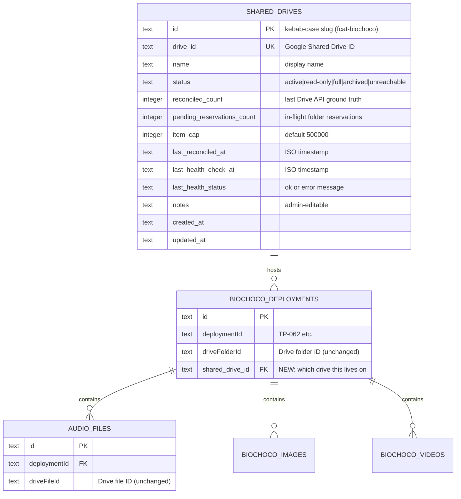

# Multi-Shared-Drive Fan-Out for Deployment Data

## Enhancement Summary

**Deepened on:** 2026-05-24
**Sections enhanced:** 10 (data model, selection algorithm, capacity model, reconciliation, state machine, security, phases, open questions, alternatives, refs)
**Review agents:** code-simplicity, architecture-strategist, data-integrity-guardian, performance-oracle, security-sentinel, deployment-verification, data-migration-expert, pattern-recognition
**Research agents:** framework-docs (Drive API 2026), best-practices (capacity-routing patterns)

### Critical Revisions From Deep Review

| # | Severity | Change | Why |
|---|---|---|---|
| 1 | BLOCKER | Bootstrap must resolve each deployment's real `driveId` via `files.get({fields:'driveId'})` grouped by `ct_project_id`, not assume `'fcat-biochoco'` for all | `ct_projects.driveFolderId` overrides the env root; historical CT & sub-projects can live on different drives. Mis-mapping breaks discovery + capacity. |
| 2 | BLOCKER | **Two** feature flags: `SHARED_DRIVE_ROUTING_ENABLED` (gates folder-create) + `SHARED_DRIVE_DISCOVERY_ENABLED` (gates union scan). Discovery flips first | One-flag design orphans -2 deployments from discovery scans on rollback. |
| 3 | BLOCKER | Registration must block `status='active'` until first reconcile completes (intermediate `status='registering'` or hold with `pending=item_cap`) | Else 13-hour window where `reconciled_count=0` lets selector aggressively over-pack the new drive. |
| 4 | High | Replace `files.list` nightly pagination with `changes.list?driveId=...` delta starting from a persisted `startPageToken`; keep full count weekly | `drives.get` does NOT return item counts (confirmed). Delta cuts ~5000 calls → ~50 calls/night at 10-drive scale. |
| 5 | High | Add `id ASC` tiebreaker to selector `ORDER BY ... DESC, id ASC` | SQLite `ORDER BY` in scalar subquery is undefined-by-rowid on ties. |
| 6 | High | Add `shared_drive_reservations` token table + `reservation_id` returned by selector; release decrements by token; reconcile zeros only tokens older than its start time | Catch-block decrement after reconcile zero creates double-decrement / negative-count bug; `MAX(0,…)` masks it silently. |
| 7 | High | Specify `ON DELETE RESTRICT` on FK + verify `PRAGMA foreign_keys=ON` in `src/db/index.ts` | Else admin delete creates dangling FK with no error. |
| 8 | High | Bootstrap groups deployments by `ct_project_id` and calls `files.get(deployment.driveFolderId, fields:'driveId')` on one row per group — registers each distinct Shared Drive as its own row | Eliminates BLOCKER #1's mis-mapping. |
| 9 | High | Concurrency cap `p-limit(3-8)` on parallel drive reconcile | Stay under Drive API per-SA 325K units/min ceiling. |
| 10 | Medium | Industry threshold convention **75/85/95** (not 80/95): soft alert / hard alert / emergency-stop. Default `SHARED_DRIVE_SOFT_PCT=75`, `HARD_PCT=85`, `STOP_PCT=95` | Provisioning lead time = days; 75% alert gives realistic runway. |
| 11 | Medium | Collapse state machine: `active | read-only | unreachable`. `full` is auto-set `read-only` at 95%; `archived` becomes `archived_at` timestamp + UI filter | 5 states is over-modeled; reads behave identically across read-only/full/archived. |
| 12 | Medium | CUT SA probe (create+trash test file). Use `drives.get` + display returned `name`+`createdTime` to admin in a confirmation step before insert | Probe leaves trash if it fails, can fingerprint SA, doesn't catch Contributor-vs-Manager either way. |
| 13 | Medium | CUT Phase 3 frame-upload guard + blocked-deployments queue | YAGNI: nightly reconcile + 75/85/95 + auto-readonly at 95% makes the guard unnecessary at this scale; `severity='error'` in `/admin/activity` is the blocked-queue. |
| 14 | Medium | Validate Drive ID format (`/^0A[A-Za-z0-9_-]{15,40}$/`); call `drives.get` first; show returned `name`+`createdTime` to admin; insert only on explicit second click | Prevents typo / hostile-ID bypass. |
| 15 | Medium | Add `recordEvent` to all admin actions (`register`, `mark-status`, `reconcile-now`) with `actorEmail` from `requireAdmin()` | Per CLAUDE.md convention; current plan only events reconcile-side. |
| 16 | Medium | Sanitize Drive API error messages before persisting to `last_health_status` (strip 20+ char IDs, cap at 200 chars) | Avoid leaking unrelated org folder IDs / SA email patterns into events. |
| 17 | Medium | `verifyCronSecret` → use `crypto.timingSafeEqual`; bind `/api/cron/*` to reject when `X-Forwarded-For` set | Defense-in-depth on `CRON_SECRET` leak. |
| 18 | Low | Snapshot `pending_reservations_count` at reconcile start; SET `pending = MAX(0, pending - snapshot)` not `pending = 0` | Lost-update window when reservations land mid-pagination. |
| 19 | Low | Status TOCTOU: re-check `AND status='active'` in confirming UPDATE before Drive API call, OR emit `recordEvent` for "folder created on non-active drive" so admins can audit | Admin sets read-only between selector + create. |
| 20 | Low | Cron line uses America/New_York TZ to match existing crontab (not UTC). Default `15 3 * * *` (avoids 1AM nightly-refresh + backup window collisions) | Plan doc had mixed UTC/Eastern references. |
| 21 | Low | Rename `shared-drive-reconciliation.ts` → `shared-drive-reconciliation-worker.ts` to match `audio-sync-worker.ts` / `camera-trap-sync-worker.ts` precedent | Pattern consistency with job-queue dispatch convention. |
| 22 | Low | Fold `shared-drive-alerts.ts` into `shared-drives.ts` (alert is a thin `recordEvent` wrapper) | YAGNI module split for <80 lines. |

### Net effect
- **2 modules instead of 3** in `src/lib/`.
- **3 status values instead of 5**.
- **2 feature flags instead of 1**.
- **1 new auxiliary table** (`shared_drive_reservations`) for correct reservation accounting.
- **Phase 3 reduced** from 6 bullets to 2 (re-nag alerts + runbook).
- **Nightly reconcile cost** ~5000 → ~50 API calls via `changes.list` delta.
- Plan length ~ same; net rigor up substantially.

## Implementation Status (2026-05-24)

**Done (code-complete, behind flags OFF — no production behavior change):**
- Phase 1 in full: schema (`shared_drives` + `shared_drive_reservations` + `shared_drive_id` FK + `system_events.source` CHECK), `src/lib/shared-drives.ts` (selection, token release, registry queries, sanitize, thresholds, flags), `src/lib/shared-drive-reconciliation-worker.ts` (delta/full reconcile, health, threshold transitions, re-nag), `job-locks` single-flight, `cron-auth` timing-safe, admin UI (`/admin/shared-drives` page + client + actions), nav link, cron endpoint + crontab line, bootstrap script, `.env.example` + `docker-compose.yml` flags.
- Phase 2 **code-only**: routing + reservation release + TOCTOU re-check wired into `drive-folder-actions.ts` (gated by `SHARED_DRIVE_ROUTING_ENABLED`, default legacy); `listDeploymentFoldersAcrossDrives` + discovery wiring in both sync callers (gated by `SHARED_DRIVE_DISCOVERY_ENABLED`).
- Phase 3: re-nag alerts (in worker), provisioning runbook (`docs/operations/shared-drive-provisioning-runbook.md`).
- Tests: `tests/unit/shared-drives.test.ts`, `tests/unit/shared-drive-reconciliation-worker.test.ts`, `tests/unit/shared-drives-fk.test.ts`, `tests/integration/shared-drive-routing.test.ts`. Full suite green (1035 tests), `tsc` clean, lint clean, `next build` succeeds.

**Deviations from plan (intentional):**
- **`shared_drives` carries both `drive_id` (0A… Shared Drive ID) AND `root_folder_id`** (deployment parent / discovery root). The plan's single `drive_id` conflated them; capacity ops need the drive ID, folder-create/discovery need the folder ID. See CLAUDE.md.
- **Reconcile runs directly (not via the unified queue)**, following the `drive_sync` precedent — it's Drive-metadata work that shouldn't serialize behind multi-hour ML runs. No `job-queue.ts` dispatch case added; the cron endpoint + admin action call `runReconciliationJob` directly with single-flight.
- **`resolveDeploymentParent` stayed inline** in `drive-folder-actions.ts` (not a lib export) to keep the BioChoco CT-project lookup where it already lives.
- **"Next pick" debug column** and the bench file deferred (YAGNI for now; selection contention is covered by a unit test asserting no reservation exceeds cap×0.85).

**Not done (requires real infra / ops — out of code scope):** provisioning `FCAT-BIOCHOCO-2`, running the bootstrap against prod, flipping the flags, the staged rollout, and manual QA.

## Overview

The `FCAT-BIOCHOCO` Shared Drive is at ~88% of Google's hard **500,000 item per Shared Drive** cap. Projected demand — roughly 300 audio deployments × ~5,000 recordings each = ~1.5M audio items alone, plus camera-trap images, videos, and `_frames/` — would blow through that cap several times over.

This plan adds a `shared_drives` DB registry, a deterministic capacity-based routing layer, and a nightly reconciliation job so new deployments fan out across multiple Shared Drives without touching existing data on `FCAT-BIOCHOCO`. The codebase is already drive-agnostic at the API level (`supportsAllDrives: true` on every call, per-deployment `driveFolderId`), so the change is additive and contained.

Forward-only (no migration), capacity-based selection with bin-packing, manual provisioning + portal alert at 80%, behind a feature flag, validated by a one-off Drive API count against `FCAT-BIOCHOCO` before flip-the-switch day.

## Problem Statement

### Today
- One Shared Drive (`FCAT-BIOCHOCO`) holds all `biochoco_deployments` data: BIOCHOCO project + historical camera-trap + Amazon CT. Each deployment is a folder with `camaras_trampas/`, `grabadores_de_audio/`, `ibutton/`, and an opportunistic `_frames/`.
- All Drive operations are folder-scoped via `biochoco_deployments.driveFolderId`. The parent root is resolved as `cameraTrapProjects.driveFolderId ?? process.env.CAMERA_TRAP_ROOT_FOLDER_ID`.
- Per-deployment item count: ~10K–40K (audio + images + videos + frames + iButton + metadata). Conservatively ~25K average.
- At 25K avg, 500K / 25K = **~20 deployments per drive** at the hard cap, ~16 at the 80% threshold. For 300 lifetime audio deployments + camera-trap mass, the org needs **~15+ Shared Drives over the project lifetime**.

### Failure modes if not fixed
- Once a Shared Drive hits 500K items, **no more files can be added** anywhere on it — every `createFolder`, `upload`, `replace-revision` returns an error. Folder-create from ODK auto-pipeline silently leaves deployments orphaned. FLAC compression mid-batch errors out. BirdNET, indices, frame extraction, image QA — all break.
- Migrating items between Shared Drives is slow (rate-limited), risky (some files don't move cleanly), and changes file IDs — which would invalidate `audio_files.driveFileId`, `biochoco_images.driveFileId`, `biochoco_videos.driveFileId`, and the pinned `audio_files.originalDriveRevisionId` references. Therefore: **don't migrate existing data; route new data elsewhere**.

### Constraints
- 100 TB of free storage via Google Workspace nonprofit — file count is the only binding constraint. Object storage (R2/B2) would cost $600–1500/mo and was rejected in the brainstorm.
- Service account `GOOGLE_SERVICE_ACCOUNT_KEY` does not (today) have Workspace admin permissions to create Shared Drives via API.
- Existing deployment data on `FCAT-BIOCHOCO` cannot be reorganized — every file ID is referenced from the DB.

## Proposed Solution

### High-level design

Introduce a `shared_drives` DB table (the registry). When the BIOCHOCO ODK pipeline or admin UI needs to create a new deployment folder, the system selects the active drive with the most filled-but-still-under-threshold capacity (bin-pack), atomically reserves a per-deployment quota, and creates the folder under that drive's root. Existing per-deployment operations are unchanged — they use `deployment.driveFolderId` which fully identifies the drive via Drive API's `supportsAllDrives: true`.

A nightly cron job lists each registered drive via `files.list?driveId=...` to true up real item counts (handles trash, revisions, manual uploads, `_frames/`), updates health status (catches SA-access loss), and emits `system_events` for capacity transitions and drift.

A new admin page at `/admin/shared-drives` shows the registry, capacity bars, health, and lets admins register new drives, mark them `read-only`/`archived`, and trigger ad-hoc reconciliation.

Behind feature flag `SHARED_DRIVE_ROUTING_ENABLED` — when off, the deployment-folder-create path uses the existing env-var root.

### What stays the same
- Every Drive API call still uses `supportsAllDrives: true` and `includeItemsFromAllDrives: true`.
- `deployment.driveFolderId` remains the single source of truth for "where is this deployment's data."
- Per-file `driveFileId` columns (`audio_files`, `biochoco_images`, `biochoco_videos`) work without changes — Drive's API resolves the file from any drive the SA has access to.
- All existing read paths (image proxy, audio streaming, ML download, training exports) work without modification.

### What changes
- Two `parentFolderId` resolution sites in `src/app/biochoco/data/drive-folder-actions.ts` (lines 218–274 and 333–373) call the new selector instead of reading the env var.
- Discovery scans that iterate "all deployment folders under root" become "union of all deployment folders under each active drive's root."
- Folder-create now atomically reserves a per-deployment quota against the selected drive.
- A new nightly cron reconciles real counts and emits events.

## Technical Approach

### Architecture

#### Module layout (new files)

```
src/lib/shared-drives.ts                                    # Registry queries, atomic selection, reservation tokens, sanitize-error util, alert event helpers (alerts module folded in — <80 lines)
src/lib/shared-drive-reconciliation-worker.ts               # Reconcile job (Sunday=full, else delta via changes.list), health check; loaded via dynamic import from job-queue (matches audio-sync-worker / camera-trap-sync-worker convention)
src/app/admin/shared-drives/page.tsx                        # Server Component admin page (sortable table)
src/app/admin/shared-drives/actions.ts                      # Server actions: registerDrive, markStatus, reconcileNow, archiveDrive
src/app/admin/shared-drives/client.tsx                      # Confirm-name modal, status pill, capacity bar
src/app/api/cron/reconcile-shared-drives/route.ts           # Cron endpoint (localhost-only + timing-safe verify + single-flight)
scripts/bootstrap-shared-drives.ts                          # One-off: discover distinct drives via files.get groups + initial count + backfill FKs
tests/unit/shared-drives.test.ts                            # Selection logic, token release, EXPLAIN QUERY PLAN sanity
tests/unit/shared-drive-reconciliation-worker.test.ts       # Reconcile + health + drift; mocks Drive API
tests/integration/shared-drive-routing.test.ts              # End-to-end folder routing across two registered drives
tests/bench/shared-drive-selection.bench.ts                 # 20-concurrent benchmark with background writer; asserts p99 < 100ms
```

`shared-drive-alerts.ts` from the original plan is **folded into** `src/lib/shared-drives.ts`. It would be a thin `recordEvent` wrapper (~30 lines). Split it back out if/when it grows beyond ~80 lines.

#### Files modified
| File | Change |
|---|---|
| `src/db/schema.ts` | Add `sharedDrives` table; add `sharedDriveId` column to `biochocoDeployments`; export `$inferSelect`/`$inferInsert` types |
| `scripts/push-schema.mjs` | Add `CREATE TABLE shared_drives ...` to `statements[]`; add `ALTER TABLE biochoco_deployments ADD COLUMN shared_drive_id TEXT REFERENCES shared_drives(id)` to `migrations[]`; add `system_events.source` CHECK table-recreation to include `"shared-drives"` |
| `src/lib/system-events.ts` | Add `"shared-drives"` to the `source` union (matches schema CHECK); add `shared_drives_reconcile` to `JOB_LABELS` |
| `src/lib/job-types.ts` | Add `shared_drives_reconcile` to `JOB_TYPES` |
| `src/lib/job-queue.ts` | Add dispatch case for `shared_drives_reconcile` (dynamic import of `runReconciliationJob`) |
| `scripts/crontab` | Add `0 3 * * *` line that curls `/api/cron/reconcile-shared-drives` with `Authorization: Bearer $CRON_SECRET` |
| `src/app/biochoco/data/drive-folder-actions.ts` | Replace the two `bioChocoProject?.driveFolderId ?? CAMERA_TRAP_ROOT_FOLDER_ID` lookups with `selectAndReserveSlot()` from `@/lib/shared-drives`; set the resulting `sharedDriveId` on the new `biochoco_deployments` row |
| `src/lib/drive-client.ts` | Add a thin helper `listDeploymentFoldersAcrossDrives(rootFolderIds: string[])` that maps over `listDeploymentFolders` and unions; existing single-root function unchanged |
| `src/app/admin/page.tsx` | Add nav link to `/admin/shared-drives` |
| `src/lib/cron-auth.ts` | (No change — reuse `verifyCronSecret`) |

### Data Model

#### Entity-Relationship Diagram



#### Schema (SQLite via `push-schema.mjs`)

`statements[]` additions (TWO new tables + a `changes.list` token column):

```
shared_drives:
  id                          TEXT PRIMARY KEY,              -- "fcat-biochoco", "fcat-biochoco-2"
  drive_id                    TEXT NOT NULL UNIQUE,          -- Google Shared Drive ID (validated /^0A[A-Za-z0-9_-]{15,40}$/)
  name                        TEXT NOT NULL,                 -- "FCAT-BIOCHOCO" — display name confirmed via drives.get
  status                      TEXT NOT NULL DEFAULT 'registering'
    CHECK(status IN ('registering','active','read-only','unreachable')),
  reconciled_count            INTEGER NOT NULL DEFAULT 0,    -- last Drive API ground truth
  pending_reservations_count  INTEGER NOT NULL DEFAULT 0,    -- in-flight reservations (sum of token rows; denormalized for fast WHERE)
  item_cap                    INTEGER NOT NULL DEFAULT 500000,
  changes_page_token          TEXT,                          -- changes.list?driveId=...&pageToken=... cursor; set after initial full count
  last_reconciled_at          TEXT,                          -- last nightly delta or weekly full
  last_full_reconcile_at      TEXT,                          -- last full files.list count (weekly)
  last_health_check_at        TEXT,
  last_health_status          TEXT,                          -- sanitized: ID-strings stripped, max 200 chars
  archived_at                 TEXT,                          -- soft-archive flag (NULL = visible); not a separate status
  notes                       TEXT,                          -- admin-editable
  created_at                  TEXT NOT NULL DEFAULT (datetime('now')),
  updated_at                  TEXT NOT NULL DEFAULT (datetime('now'))

shared_drive_reservations:
  id                          TEXT PRIMARY KEY,              -- UUID per reservation
  shared_drive_id             TEXT NOT NULL REFERENCES shared_drives(id) ON DELETE RESTRICT,
  quota                       INTEGER NOT NULL,              -- DEPLOYMENT_QUOTA at reservation time
  deployment_id               TEXT,                           -- biochoco_deployments.id once known (nullable: set after insert)
  created_at                  TEXT NOT NULL DEFAULT (datetime('now')),
  released_at                 TEXT                            -- NULL until folded into reconciled_count or rolled back
  CHECK ((released_at IS NULL) OR (released_at >= created_at))

Indexes:
  idx_shared_drives_status_active ON (status, archived_at)
    WHERE status='active' AND archived_at IS NULL                          -- selection hot path
  idx_shared_drive_reservations_drive_open ON (shared_drive_id, released_at)
    WHERE released_at IS NULL                                              -- reconcile snapshot
  -- drive_id already UNIQUE on shared_drives
```

**Why two tables**: the reservation token table makes release+reconcile correctness explicit (per data-integrity review). A naked `pending_reservations_count` integer cannot distinguish "release after reconcile already absorbed it" from "release of a still-pending reservation." With tokens, reconcile only zeros tokens older than its scan-start timestamp, and stale catch-block decrements are no-ops (token already marked released or absorbed). The denormalized `pending_reservations_count` is updated by the same triggers/code that touches the token table — kept for cheap selector reads, validated against the token table's SUM on reconcile.

`migrations[]` additions (2026-05-24):

```
ALTER TABLE biochoco_deployments ADD COLUMN shared_drive_id TEXT REFERENCES shared_drives(id) ON DELETE RESTRICT;
CREATE INDEX IF NOT EXISTS idx_biochoco_deployments_shared_drive_id ON biochoco_deployments(shared_drive_id);
```

Plus a table-recreation block for `system_events.source` CHECK to add `"shared-drives"` (follow the pattern at `push-schema.mjs:1000-1034` that added `biochoco-overview`). The recreation block runs `BEGIN IMMEDIATE … COMMIT` so it's atomic under concurrent writers (queued via `busy_timeout=5000`).

**Verify `PRAGMA foreign_keys=ON`** in `src/db/index.ts` before relying on `ON DELETE RESTRICT`. If not enabled, deletes silently succeed and leave dangling FKs.

**Why nullable FK on `biochoco_deployments`**: existing deployments may have NULL `driveFolderId` (historical folder-create failures). They get NULL `shared_drive_id` too. Future routing requires it on rows we create — enforce via app code, not DB (so old NULL rows stay valid).

**Effective item count** (computed in app code; not a DB column):

```
effectiveCount = reconciled_count + pending_reservations_count
```

`reconciled_count` is updated by the nightly delta (via `changes.list`) or weekly full count. `pending_reservations_count` is denormalized from the token table — synced inside the same UPDATE that touches a token row.

### Drive Selection Algorithm (atomic + token-based)

**Goal**: when creating a new deployment folder, pick the active drive that is most-full but still under threshold, and atomically reserve `DEPLOYMENT_QUOTA` items via a typed token so two concurrent requests can't both pick the last slot AND stale catch-block decrements can't corrupt the counter.

`src/lib/shared-drives.ts` exports:

```
type SelectionResult = {
  sharedDriveId: string,
  driveId: string,
  reservationId: string,            // UUID — REQUIRED for releaseReservation
  reconciledCount: number,
  pendingReservationsCount: number,
} | { error: 'no_capacity' | 'no_active_drives' };

const DEPLOYMENT_QUOTA = 40_000;            // conservative per-deployment cap (audio + CT + frames + iButton)
const SHARED_DRIVE_SOFT_PCT = 0.75;         // alert threshold (configurable via env)
const SHARED_DRIVE_HARD_PCT = 0.85;         // selector refuses new reservations above this
const SHARED_DRIVE_STOP_PCT = 0.95;         // auto-flip to status='read-only'

selectAndReserveSlot(): SelectionResult
```

Implementation — **transactional** (synchronous better-sqlite3 transaction, NOT `async`):

```
const tx = db.transaction(() => {
  const reservationId = randomUUID();
  // Step 1: atomically pick + bump denormalized counter (single statement)
  const row = stmt_update_pick.get({
    quota: DEPLOYMENT_QUOTA,
    hardPct: SHARED_DRIVE_HARD_PCT,
  });
  // ↓ stmt_update_pick:
  //   UPDATE shared_drives
  //   SET pending_reservations_count = pending_reservations_count + :quota,
  //       updated_at = datetime('now')
  //   WHERE id = (
  //     SELECT id FROM shared_drives
  //     WHERE status = 'active'
  //       AND archived_at IS NULL
  //       AND (reconciled_count + pending_reservations_count + :quota) <= (item_cap * :hardPct)
  //     ORDER BY (reconciled_count + pending_reservations_count) DESC, id ASC   -- NB: id ASC tiebreak
  //     LIMIT 1
  //   )
  //   RETURNING id, drive_id, reconciled_count, pending_reservations_count;

  if (!row) return { error: 'no_capacity' };

  // Step 2: write the token (audit trail for release + reconcile correctness)
  stmt_insert_reservation.run({
    id: reservationId,
    shared_drive_id: row.id,
    quota: DEPLOYMENT_QUOTA,
  });

  return { sharedDriveId: row.id, driveId: row.drive_id, reservationId, ...row };
});
return tx();
```

- **`ORDER BY (...) DESC, id ASC`**: bin-pack first, deterministic tiebreaker second. SQLite does not guarantee tie-resolution by rowid across versions inside scalar subqueries — required for test determinism.
- **`(reconciled + pending + :quota) <= (cap * 0.85)`**: never reserve past the HARD threshold. Soft threshold (75%) drives alerts only.
- **`archived_at IS NULL`**: archived drives never selected.
- **Atomicity**: synchronous `db.transaction(() => {...})` per the MEMORY.md gotcha — never `db.transaction(async ...)`. SQLite WAL serializes writers; two callers queue cleanly.
- **No row returned ⇒ no capacity**: caller propagates a Spanish error string AND emits `severity='error'` `recordEvent`.

**Rollback on folder-create failure** — release by token, not by drive_id+quota:

```
function releaseReservation(reservationId: string): void {
  const tx = db.transaction(() => {
    // Get the token; idempotent (returns null if already released or absorbed by reconcile)
    const token = stmt_get_open_reservation.get({ id: reservationId });
    if (!token) return;                          // already absorbed by reconcile, or double-release no-op
    // Mark released
    stmt_mark_released.run({ id: reservationId });
    // Decrement denormalized counter by THIS token's quota
    stmt_dec_pending.run({ shared_drive_id: token.shared_drive_id, quota: token.quota });
    // (stmt_dec_pending uses MAX(0, pending_reservations_count - :quota) defensively)
  });
  tx();
}
```

**Why this is safe across the catch-block-after-reconcile race**: if reconcile fires between selector and folder-create-failure, it absorbs the token (marks `released_at` itself, with reason='reconciled'). The catch-block release then sees a NULL token and no-ops. The denormalized counter stays consistent because reconcile's absorption already decremented it.

**Reservations leak only if the server crashes between token insert and either folder-create-success or folder-create-failure-catch**. Weekly full reconcile finds tokens with `created_at < now - 7 days AND released_at IS NULL`, marks them released with `reason='abandoned'`, and recomputes the denormalized counter from a full SUM. Worst-case stale state: ~40K of phantom reservation until the next weekly cycle. Acceptable.

#### Status TOCTOU mitigation

A confirming check is layered between selector and Drive API call in `drive-folder-actions.ts`:

```
const reservation = await selectAndReserveSlot();
if ('error' in reservation) return failureResult(reservation.error);

// Re-check status didn't flip during reservation
const currentStatus = stmt_get_status.get({ id: reservation.sharedDriveId }).status;
if (currentStatus !== 'active') {
  await releaseReservation(reservation.reservationId);
  await recordEvent({
    source: 'shared-drives', eventType: 'reservation_aborted_status_changed',
    severity: 'warning', targetType: 'shared_drive', targetId: reservation.sharedDriveId,
  });
  return failureResult('no_active_drives');
}

// Now safe to call Drive API
const folder = await createDeploymentFolder(reservation.driveId, deploymentName);
// On success: token stays open until reconcile absorbs it
// On throw: releaseReservation(reservation.reservationId) in catch
```

### Capacity Accounting Model

#### What counts toward the 500K cap (per Drive API behavior)

| Item type | Counts? | Tracked in DB? |
|---|---|---|
| Folders (root deployment, 3 subfolders, `_frames/`) | ✓ | ✗ (derived as "deployment overhead") |
| Audio files (`.flac`, `.wav`) | ✓ | ✓ (`audio_files`) |
| Camera-trap images | ✓ | ✓ (`biochoco_images`) |
| Camera-trap videos | ✓ | ✓ (`biochoco_videos`) |
| Extracted video frames in `_frames/` | ✓ | ✗ (counted by Drive only) |
| iButton xlsx files | ✓ | partially |
| Trashed files (30-day grace before purge) | ✓ | ✗ (Drive ground truth only) |
| Pinned revisions (`keepForever=true` for pre-FLAC WAV) | ✗ | n/a — revisions don't count as items |
| Drive-generated thumbnails | ✗ | n/a |
| Manually uploaded files (researcher direct uploads) | ✓ | ✗ (Drive ground truth only) |

**Implication**: the DB-derived sum (`COUNT(audio_files) + COUNT(biochoco_images) + COUNT(biochoco_videos)` joined to deployments) will **under-count** by frames, trash, manual uploads, and the per-deployment folder overhead. Therefore the DB-derived sum is **not** the source of truth.

#### The two-counter model

- `reconciled_count` — set by the nightly Drive API reconciliation. **Ground truth**.
- `pending_reservations_count` — incremented on folder-create reservation. Zeroed when reconcile runs (because anything reserved is now counted in `reconciled_count` if the folder was successfully created; and rolled-back reservations were already decremented at the call site).

The selector reads `reconciled_count + pending_reservations_count`. This converges to ground truth nightly and never under-counts mid-day surges.

#### Pre-deploy validation

Before Phase 2 (flipping the routing flag), run a manual paginated `files.list?driveId=FCAT_BIOCHOCO_ID&pageSize=1000` to get the **current** true item count of `FCAT-BIOCHOCO`. Compare against the DB-derived sum to quantify the drift (frames + trash + manual uploads). This validates the formula and tells us how aggressively to set the threshold.

### Reconciliation Job

#### Two cadences

| Cadence | Mechanism | API cost (per drive) | Purpose |
|---|---|---|---|
| **Nightly** | `changes.list?driveId=...&pageToken=stored_token` (delta) | ~1–5 calls (typical daily delta) | True up counter for adds/removes since last run; advance `changes_page_token` |
| **Weekly** (Sunday) | Full `files.list?driveId=...` paginated count | ~500 calls (at 500K items) | Catch drift from trash-purge events, `_frames/`, manual uploads, and validate the delta path |
| **At-registration** | Full count, blocks `status='active'` until done | ~500 calls (typically much less for fresh drives) | Establish baseline `reconciled_count` AND `changes_page_token` from `changes.getStartPageToken` |

The hybrid is required because `drives.get` does **not** expose item count (confirmed against Drive API v3 docs — feature request b/201930056 still open). `changes.list` with `driveId` is the documented delta primitive; tokens never expire; supports `includeRemoved=true` for deletions.

#### Cron line (`scripts/crontab`) — America/New_York

```
15 3 * * * root . /etc/cron.d/portal-env && /usr/bin/curl -fsS -X POST \
  -H "Authorization: Bearer $CRON_SECRET" --max-time 1800 \
  http://localhost:3000/api/cron/reconcile-shared-drives \
  >> /app/data/backups/cron.log 2>&1
```

(3:15 AM ET avoids 1AM `nightly-refresh` and the backup snapshot window. Sunday's full-count is detected inside the worker via `new Date().getUTCDay() === 0`.)

#### Endpoint `src/app/api/cron/reconcile-shared-drives/route.ts`

1. `await verifyCronSecret(request)` — uses `crypto.timingSafeEqual` (see Security Considerations).
2. Reject if `request.headers.get('x-forwarded-for')` is present — cron must originate from localhost only.
3. Single-flight check **before insert** (mirrors `findActiveAudioJob` pattern): if a `shared_drives_reconcile` row is already `pending` or `processing`, return 409 with `{ already_running: true }` — do not enqueue duplicate.
4. Enqueue a `processing_jobs` row with `jobType: 'shared_drives_reconcile'`, `status: 'pending'`, `totalImages = <count of non-archived drives>`. Kick `processNextQueueable()`.
5. Return 202.

#### Job dispatch `src/lib/job-queue.ts`

Add case for `'shared_drives_reconcile'` → dynamic import `runReconciliationJob` from `src/lib/shared-drive-reconciliation-worker.ts`.

#### `runReconciliationJob(job)`

Concurrency bound: `const limit = pLimit(5)` — caps parallel drive work to stay under Drive API per-SA quota (325K units/min). At pageSize=1000, each `files.list` page = 100 units, so 5 drives × 10 req/s = 5000 units/s = 300K units/min — just under ceiling with retry headroom.

```
const isFullCount = new Date().getUTCDay() === 0;     // Sunday weekly full
const drives = await getNonArchivedDrives();          // includes status='active','read-only','unreachable'
const results = await Promise.allSettled(
  drives.map(d => limit(() => reconcileOneDrive(d, { isFullCount })))
);
// emit per-drive summary + buildJobCompletionEvent
```

`reconcileOneDrive(drive, { isFullCount })`:

1. **Snapshot pending reservations** — capture `pending_reservations_count` AND the set of open reservation token IDs at scan-start. The end-of-job UPDATE only zeros tokens older than this snapshot.
2. **Health check** — `drives.get({ driveId: drive.drive_id, supportsAllDrives: true })`. On 404/403/5xx after retries: set `status='unreachable'`, `last_health_status=<sanitized message>`, `last_health_check_at=now`, emit `severity='error'` event, return.
3. **Count items** —
   - **If full count** (Sunday or `changes_page_token IS NULL`): paginate `files.list?driveId=&fields=nextPageToken,files(id)&pageSize=1000&q=trashed=false` until `nextPageToken` is null. `count = sum(files.length)`. Then fetch `changes.getStartPageToken({ driveId })` and persist as new `changes_page_token`.
   - **Else** (delta): paginate `changes.list?driveId=&pageToken=stored_token&includeRemoved=true&fields=nextPageToken,newStartPageToken,changes(removed,file(id,trashed))`. For each page, accumulate `delta = creates - removes - trashes`. Persist `newStartPageToken` at the end as new `changes_page_token`. New `reconciled_count = old + delta`.
4. **Drift check** — compare new `reconciled_count` against `reconciled_count_before + (sum of absorbed reservations during the run)`. If `|drift| > 5%` AND `> 1000` items, emit `severity='warning'` event with the delta (drift detection is informational on delta runs; corrective on full runs).
5. **Absorb open reservations** (in same UPDATE):
   ```
   UPDATE shared_drives
   SET reconciled_count = :count,
       last_reconciled_at = datetime('now'),
       last_full_reconcile_at = CASE WHEN :isFullCount THEN datetime('now') ELSE last_full_reconcile_at END,
       changes_page_token = :newPageToken,
       last_health_check_at = datetime('now'),
       last_health_status = 'ok',
       status = CASE WHEN status='unreachable' THEN 'active' ELSE status END,
       pending_reservations_count = (
         SELECT COALESCE(SUM(quota), 0) FROM shared_drive_reservations
         WHERE shared_drive_id = :id AND released_at IS NULL AND created_at > :snapshotTime
       ),
       updated_at = datetime('now')
   WHERE id = :id;

   UPDATE shared_drive_reservations
   SET released_at = datetime('now')
   WHERE shared_drive_id = :id AND released_at IS NULL AND created_at <= :snapshotTime;
   ```
6. **Threshold transitions**:
   - `>= 75%` AND status='active' AND (no `severity='warning'` `drive_threshold_crossed` event in last 24h): emit re-nag alert.
   - `>= 85%`: emit `severity='error'` "hard threshold" event (provision NOW).
   - `>= 95%`: auto-transition `status='read-only'`. Selector stops picking this drive immediately.
7. **Job progress**: increment `processed_images`, set Spanish `statusMessage` (`Reconciliando ${name} (${i} de ${total})`).

After all drives: `recordEvent(buildJobCompletionEvent(job, { driveDeltas, fullCountFlag }))`.

#### Performance budget (post-`changes.list` switch)

| Drive count | Daily delta calls/drive | Weekly full calls/drive | Nightly total | Sunday total |
|---|---|---|---|---|
| 1 (today) | ~1 | ~500 | 1 call | 500 calls |
| 5 | ~1 | ~500 | 5 calls | 2500 calls |
| 15 | ~1 | ~500 | 15 calls | 7500 calls |

Even Sunday's full reconcile at 15 drives × 500 calls × 100 units = 750K units. Divided across `p-limit(5)` over ~15 min ≈ 50K units/min — well under 325K/min per-SA ceiling.

#### Single-flight lock

`findActiveSharedDriveReconcileJob()` in `src/lib/job-locks.ts` (mirrors `findActiveAudioJob`). Check fires in the cron endpoint AND in the admin "Reconcile now" action.

### Status State Machine (3 states + archived_at flag)

```
registering ──(initial full count succeeds)──► active
registering ──(SA access fails)─────────────► unreachable

active ──(reconciled ≥75%, no recent alert)──► (stays active; soft alert event)
active ──(reconciled ≥85%)─────────────────► (stays active; hard alert event — provision NOW)
active ──(reconciled ≥95%)─────────────────► read-only (auto)
active ──(admin action)────────────────────► read-only

read-only ──(admin: confirms freed)────────► active
read-only ──(admin)────────────────────────► sets archived_at (UI-hidden, status unchanged)

any ──(SA access fails on health check)───► unreachable
unreachable ──(reconcile succeeds)─────────► reverts to last known good (active or read-only)

archived_at IS NOT NULL: row hidden from default `/admin/shared-drives` view; selector never picks; reads still served via supportsAllDrives:true.
```

**Semantics**:
- `registering`: row exists but `reconciled_count` not yet measured. Selector skips. Created at registration, transitions to `active` after the initial full count completes (synchronous in the register action, kicks off a `processing_jobs` row that the admin sees progress on).
- `active`: receives new deployments via selector.
- `read-only`: skipped by selector. Reads still work. Subsumes the previous "full" state (auto-set at 95%).
- `unreachable`: SA lost access. Reads will likely fail. Admin needs to fix Workspace perms.
- `archived_at`: soft-archive timestamp. Independent of status. UI default filters `WHERE archived_at IS NULL`.

### Write-site audit for read-only / near-cap drives

Reads always work (file IDs resolve via `supportsAllDrives`). Writes within existing deployment folders (audio compression, BirdNET results, image QA trash) **continue to work** — these don't increase item count on the drive meaningfully (revisions don't count as items, trash doesn't free items until purged at 30 days). Only NEW folder creation is gated by the selector.

| Operation | Site | Read-only drive behavior |
|---|---|---|
| Folder create (new deployment) | `biochoco/data/drive-folder-actions.ts:218-274, :333-373` | Selector skips this drive automatically. |
| Audio FLAC compression | `src/lib/audio-compression-core.ts` | Continues — writes new revisions on existing files. |
| BirdNET results | (existing audio sync paths) | Continues — writes inside existing deployment folder. |
| Frame extraction → `_frames/` | `uploadFramesToDrive()` in `drive-client.ts` | Continues — frame uploads happen within an existing deployment folder that already has its `driveFolderId`. Frame-upload guard CUT from Phase 3 (YAGNI per simplicity review: nightly delta + 95% auto-readonly is sufficient). |
| Image QA trash | `trashFile()` | Continues. |

### Discovery / Scan-path Changes

Three places where "scan the parent root for deployment folders" needs to become "scan all active drives' roots":

1. **`src/lib/drive-client.ts:listDeploymentFolders(rootFolderId)`** — leave as-is.
2. **New helper** `listDeploymentFoldersAcrossDrives(rootFolderIds: string[]): Promise<DriveFolder[]>` that maps over `listDeploymentFolders` with `Promise.allSettled` and unions results. Callers query `shared_drives WHERE status IN ('active','read-only','full')` (NOT 'archived') for the root IDs.
3. **Callers**: `src/lib/camera-trap-sync-internals.ts:scanDeploymentImagesInternal` and anything else that grep-finds `listDeploymentFolders` (specifically: BIOCHOCO sync, camera-trap project sync).

`training-exports/actions.ts` already iterates over `biochoco_deployments` rows directly — no scan-by-folder there. Verify via grep before claiming done.

### Implementation Phases

#### Phase 1: Foundation (registry + admin UI + reconciliation, **both flags OFF**)

**Tasks**
- [x] Schema: add `shared_drives` + `shared_drive_reservations` tables + `shared_drive_id` FK column (with `ON DELETE RESTRICT`) + `system_events.source` CHECK update via table-recreation in `scripts/push-schema.mjs`
- [x] Verify `PRAGMA foreign_keys=ON` in `src/db/index.ts`; add to any new connection-init path
- [x] Mirror in `src/db/schema.ts`; export `sharedDrives`, `sharedDriveReservations`, `$inferSelect`, `$inferInsert`
- [x] Add `"shared-drives"` to `system_events.source` Drizzle union types
- [x] Add `shared_drives_reconcile` to `JOB_TYPES` + `JOB_LABELS` AND to the coverage-guard expected set in `tests/unit/system-events.test.ts`
- [x] `src/lib/shared-drives.ts`: `selectAndReserveSlot`, `releaseReservation` (token-based), `listDrives`, `getDriveById`, `getNonArchivedDriveRootIds`, `sanitizeDriveError`, alert event helpers (formerly the alerts file)
- [x] `src/lib/shared-drive-reconciliation-worker.ts`: `runReconciliationJob(job)` with Sunday-full vs delta branch, `countDriveItemsFull(driveId)`, `applyChangesDelta(driveId, pageToken)`, `healthCheck(driveId)`. Uses `pLimit(5)` for parallel drives.
- [ ] `src/lib/job-queue.ts`: add dispatch case for `shared_drives_reconcile` (dynamic import)
- [x] `src/lib/job-locks.ts`: add `findActiveSharedDriveReconcileJob()` mirroring `findActiveAudioJob`
- [x] `src/lib/cron-auth.ts`: switch `verifyCronSecret` to `crypto.timingSafeEqual` (security review #17)
- [x] `src/app/admin/shared-drives/page.tsx` (Server Component) + `client.tsx` + `actions.ts`:
  - Sortable table per `src/app/admin/activity/page.tsx:111-394` pattern (URL-param `?sortBy=&sortDir=`, `SortIcon`, default sort `reconciled_count DESC`, tiebreak `id ASC`)
  - Columns: name, drive ID (truncated), status pill (active/read-only/unreachable/registering), capacity bar (effective_count / cap), last reconciled, archived_at, actions
  - **Register flow (two-step)**: (1) admin pastes Drive ID + display name → validate regex `/^0A[A-Za-z0-9_-]{15,40}$/` + call `drives.get` → display returned `name` + `createdTime` to admin for confirmation. (2) On second click, INSERT row with `status='registering'` and enqueue an immediate full-count job; admin sees a progress bar; status flips to `active` on success or `unreachable` on Drive failure.
  - Per-row actions: "Reconcile now" (admin-triggered job, debounced 5 min per drive), "Mark read-only", "Mark active", "Archive" (sets `archived_at`), "Unarchive", "Edit name"
  - **Every action calls `await requireAdmin()` AND `recordEvent({ source: 'shared-drives', actorEmail: admin.email, ... })` AND `revalidatePath("/admin/shared-drives")`** — per pattern at `src/app/admin/actions.ts:48-93`
- [x] Add nav link in `/admin/page.tsx`
- [x] Cron endpoint `src/app/api/cron/reconcile-shared-drives/route.ts` (single-flight + localhost-only + timing-safe verify) + crontab line at `15 3 * * * America/New_York`
- [x] `scripts/bootstrap-shared-drives.ts` — **corrected**:
  1. `INSERT OR IGNORE INTO shared_drives (id, drive_id, name, status) VALUES ('fcat-biochoco', :env_root, 'FCAT-BIOCHOCO', 'registering')`
  2. **Discover any other Shared Drives in use**: `SELECT DISTINCT ct_project_id, ctp.drive_folder_id FROM biochoco_deployments d JOIN ct_projects ctp ON ctp.id=d.ct_project_id WHERE d.drive_folder_id IS NOT NULL` — for each non-null `ctp.drive_folder_id` that differs from env, call `drive.files.get({ fileId: ctp.drive_folder_id, fields: 'driveId,name' })` (with `supportsAllDrives:true`) to discover the underlying drive, register a new `shared_drives` row per distinct `driveId`.
  3. For deployments with NULL `ct_projects.drive_folder_id`, call `files.get` on a sample of one deployment's `driveFolderId` per ct_project to confirm they're all on the env root (sanity check; flag if not).
  4. Initial full count via `files.list` for each registered drive; persist `changes_page_token` from `changes.getStartPageToken`; flip rows to `status='active'`.
  5. Backfill `UPDATE biochoco_deployments SET shared_drive_id = <resolved-drive-id> WHERE driveFolderId IS NOT NULL AND shared_drive_id IS NULL` — scoped per drive based on (1)–(3).
  6. Final assertion: `SELECT COUNT(*) FROM biochoco_deployments WHERE driveFolderId IS NOT NULL AND shared_drive_id IS NULL` must return 0. Script exits non-zero if not.
  7. Idempotent + re-runnable: every step guarded by `IS NULL` checks or `INSERT OR IGNORE`.
- [x] Tests:
  - `tests/unit/shared-drives.test.ts` — selection picks fullest-but-eligible (tiebreak `id ASC`); `no_capacity` when all >= 85%; `no_active_drives` when registry empty / all `registering`; `releaseReservation` by token is idempotent; archived drives never selected; `archived_at` set drives selected before reservation but TOCTOU re-check prevents folder-create
  - `tests/unit/shared-drive-reconciliation-worker.test.ts` — Sunday triggers full count + token rotation; weekday triggers `changes.list` delta; drift > 5% emits warning event; 403 on `drives.get` flips to `unreachable`
  - `tests/integration/shared-drive-routing.test.ts` — register 2 drives at differing capacity; folder-create routes to fullest-but-eligible; FK set; reservation token created; reconcile absorbs the token
  - `tests/bench/shared-drive-selection.bench.ts` — 20 concurrent `selectAndReserveSlot` calls; assert p99 < 100ms AND no two reservations exceed `item_cap * 0.85`
  - `EXPLAIN QUERY PLAN` test on the selector to confirm `idx_shared_drives_status_active` is used

**Deliverables**
- Admin can see `FCAT-BIOCHOCO` (and any other discovered drives) in `/admin/shared-drives` with real item counts.
- Nightly reconcile (delta) + Sunday full count run with events.
- New deployments STILL route via env var (flag OFF). No production routing behavior change.

**Success criteria**
- After deploy, registry row(s) exist with `reconciled_count` within 5% of manual `files.list` count.
- Backfill verification SQL returns 0 unmapped rows.
- All existing tests pass; new unit + integration tests pass.
- `recordEvent` coverage-guard test passes with new job type.
- Benchmark passes p99 < 100ms under contention.

**Estimated effort**: 3 days focused work (bootstrap script + per-drive discovery is the new heavy lift).

#### Phase 2: Provision second drive + flip BOTH feature flags (discovery first, routing second)

**Pre-flight**
- [ ] Validate Phase 1's `reconciled_count` against a fresh manual `files.list` count of `FCAT-BIOCHOCO`. Document the drift (expected: ~couple-percent from trash/manual uploads).
- [ ] Workspace admin creates `FCAT-BIOCHOCO-2` Shared Drive in Google Admin.
- [ ] Add the portal service account as **Content Manager** (NOT Viewer — needs write). NOTE: an open question (#5) is whether Contributor would suffice — defer; Content Manager is the safe initial role.
- [ ] Register via `/admin/shared-drives` "Register new drive" → confirms the `drives.get`-returned `name` matches admin intent → enqueues an initial full count → row flips from `registering` to `active` once count is in.

**Tasks**
- [x] Refactor the duplicated `parentFolderId` lookup at `src/app/biochoco/data/drive-folder-actions.ts:218-274` and `:333-373` into a single helper `resolveDeploymentParent({ ctProjectId })` exported from `src/lib/shared-drives.ts`. Helper's two branches:
  - `if (!sharedDriveRoutingEnabled())` → legacy: `bioChocoProject?.driveFolderId ?? CAMERA_TRAP_ROOT_FOLDER_ID`
  - else → `selectAndReserveSlot()`
- [x] Wire `releaseReservation(reservationId)` into the folder-create catch block. AND add the TOCTOU status re-check between selector and Drive API call.
- [x] Failure paths:
  - `no_capacity` → return `{ success: false, error: 'Sin capacidad disponible. Notifica al administrador para aprovisionar un nuevo drive.' }` + `recordEvent({ severity: 'error', eventType: 'deployment_folder_create_no_capacity', source: 'shared-drives', targetType: 'ct_project', targetId: ctProjectId })`. Surfaces in `/admin/activity` (existing) AND on `/admin/shared-drives` capacity-warning banner.
  - `no_active_drives` → same shape, different message; should never fire post-bootstrap.
- [x] **Two feature flags, flipped independently** (per architecture review #6):
  - `SHARED_DRIVE_DISCOVERY_ENABLED` — gates `listDeploymentFoldersAcrossDrives` union scan in `camera-trap-sync-internals.ts` and any other discovery callers. Default `false`. **Flip first**, before any routing.
  - `SHARED_DRIVE_ROUTING_ENABLED` — gates `selectAndReserveSlot` in `resolveDeploymentParent`. Default `false`. **Flip second**, after discovery is verified working.
- [x] `src/lib/drive-client.ts`: add `listDeploymentFoldersAcrossDrives(rootFolderIds: string[])` that maps over `listDeploymentFolders` with `Promise.allSettled` (single-root function stays as the primitive).
- [x] Update all `listDeploymentFolders(envRoot)` callers to call the new helper with `getNonArchivedDriveRootIds()` when `SHARED_DRIVE_DISCOVERY_ENABLED=true`.
- [ ] Add "Next pick" column to `/admin/shared-drives` showing which drive the selector would currently pick (debugging aid).
- [x] Tests: update `shared-drive-routing.test.ts` integration test to assert: (a) discovery union returns folders from both drives; (b) routing picks `-2` when `-1` is `read-only`; (c) TOCTOU re-check releases and aborts when admin flips status mid-flight.
- [ ] Manual QA: register a 3rd test drive (or just toggle FCAT-BIOCHOCO-2 between active/read-only), create test deployments, verify routing decisions.

**Rollout (5 staged steps)**
1. Deploy Phase 2 code with **both flags off**. Sanity-check `/admin/shared-drives` shows both drives.
2. Set `SHARED_DRIVE_DISCOVERY_ENABLED=true`, deploy. Monitor camera-trap sync for 24h — discovery union should be a no-op (FCAT-BIOCHOCO-2 has no deployment folders yet).
3. Mark `FCAT-BIOCHOCO` `status='read-only'` via admin UI (`fcat-biochoco-2` is the only `active` drive).
4. Set `SHARED_DRIVE_ROUTING_ENABLED=true`, deploy. **New deployments now route to FCAT-BIOCHOCO-2.**
5. Monitor for 1 week: job completion events, alert events, drive item counts.

**Deliverables**
- New deployments land on FCAT-BIOCHOCO-2.
- Existing deployments unchanged.
- ODK auto-pipeline routes correctly.

**Success criteria**
- 5 consecutive new deployments land on FCAT-BIOCHOCO-2 (verified via `/admin/shared-drives` count and Drive UI).
- Zero deployment-create failures attributable to routing in the first week.
- FCAT-BIOCHOCO `reconciled_count` stays approximately flat (no longer growing).

**Estimated effort**: 1 day code + 1 hour ops + 1 week monitoring.

#### Phase 3: Alerting + operational runbook (slimmed per simplicity review)

**Tasks**
- [x] **Re-nag alerts** — nightly reconcile re-fires `severity='warning'` `drive_threshold_crossed` at 75%, and `severity='error'` at 85%, if no matching event in the last 24h. Prevents the alert from being buried in a quiet inbox during a busy field season.
- [x] **Documentation** — write `docs/operations/shared-drive-provisioning-runbook.md`: how to provision a new drive in Workspace Admin, what role to grant the SA, how to register it in the portal (two-step name confirmation), what to watch for after.

**Deliverables**
- Re-nag fires daily until resolved.
- Runbook published.

**Success criteria**
- Manually toggle a registered drive's `reconciled_count` past 75% in dev → re-nag fires within next reconcile.
- Provisioning a new drive end-to-end using only the runbook takes < 15 minutes.

**Estimated effort**: 0.5 day.

**CUT from earlier draft** (per simplicity review):
- ~~Frame-upload guard~~ — YAGNI; nightly delta + 95% auto-readonly is enough at this scale.
- ~~Failed-deployment queue table~~ — `severity='error'` filter on `system_events` in existing `/admin/activity` already serves this; no new table needed.
- ~~Email / Slack channel~~ — defer until system_events feels inadequate; events already surface to the admin activity page.
- ~~SA access probe `docs/solutions/` entry~~ — probe itself was cut; no pattern to document.

## Alternative Approaches Considered

Per the brainstorm, three other approaches were evaluated and rejected:

| Approach | Why rejected |
|---|---|
| **B. Per-deployment `.tar` archive containers** | Breaks audio streaming (Range headers), BirdNET, FLAC compression, spectrogram UI, revert-compression. Deep refactor with active-pipeline pain. Documented as future optimization if file count is constraining again post-fan-out. |
| **C. Object storage (R2 / B2) for audio** | Costs $600–1500/mo. Org has 100 TB free via Workspace nonprofit. Doesn't pencil out. |
| **D. Hybrid Drive + Glacier** | Combines complexity of A + C; restore latency surprises future users. |

## Security Considerations

(Added per security review. Each item is also reflected in Acceptance Criteria quality gates.)

1. **Drive ID validation + name confirmation**: register form validates `/^0A[A-Za-z0-9_-]{15,40}$/`; calls `drives.get({ driveId, supportsAllDrives: true, fields: 'name,createdTime' })`; displays the returned name + createdTime to the admin for confirmation. Only after explicit second click does the row INSERT. Prevents typos and hostile-drive-ID confused-deputy attacks.
2. **No SA write probe**: dropped. `drives.get` succeeding + admin name confirmation is sufficient. A Contributor-vs-Manager mismatch would surface clearly on first folder-create, not silently — and we'd rather fail at a real operation than leave probe trash in every newly-registered drive.
3. **Admin action audit**: every admin server action (`registerDrive`, `markStatus`, `archiveDrive`, `reconcileNow`) calls `recordEvent({ source: 'shared-drives', actorEmail: admin.email, ... })` between the DB mutation and `revalidatePath`. Pattern matches `src/app/admin/actions.ts:48-93`.
4. **Cron endpoint hardening** (`src/lib/cron-auth.ts` + `/api/cron/reconcile-shared-drives/route.ts`):
   - `verifyCronSecret` uses `crypto.timingSafeEqual` (currently naive `===` — easy fix even if practically low-risk over HTTPS).
   - Endpoint rejects any request where `X-Forwarded-For` is set — cron must originate from localhost via the in-container `curl` (not from the oauth2-proxy public path).
   - Single-flight check fires in the route handler BEFORE inserting a `processing_jobs` row, not just in the worker.
5. **SA role (Content Manager) — explicit justification**: Content Manager is needed by the FLAC compression path (`replaceFileContentAndRename` + `pinFileRevision` write revisions on existing files; revisions require write access). Contributor would suffice for routing alone but not for the existing audio pipeline. Document explicitly so future contributors don't downgrade without testing. (Open question #5 below proposes a Contributor experiment.)
6. **Error message sanitation**: `sanitizeDriveError(err)` strips any substring matching `/[\w-]{20,}/` (looks like a Drive ID or service-account-style hash), caps at 200 chars, prepends `err.code` (a numeric/short code) when present. Applied before persisting to `last_health_status` AND before event payloads. Prevents leaking unrelated org folder IDs / SA email into events.
7. **Idempotency on register-drive double-click**: server action uses `INSERT OR IGNORE ... RETURNING id` and returns the existing row's status if drive_id already registered — no double-probe, no duplicate row.
8. **Bootstrap script not HTTP-exposed**: `scripts/bootstrap-shared-drives.ts` lives under `/scripts/` (per repo convention) and is never imported by any route under `src/app/api/**`. Acceptance criterion enforces this via grep test.
9. **`shared_drives` row deletion forbidden via UI**: archive (sets `archived_at`) is the only soft-delete admin path. Hard DELETE requires manual SQL by an operator, paired with `ON DELETE RESTRICT` so any lingering FK reference causes a clear constraint error (not silent dangling rows). Pairs with the `PRAGMA foreign_keys=ON` verification.

## Acceptance Criteria

### Functional

- [ ] `shared_drives` table exists in prod with at least one row (`FCAT-BIOCHOCO`).
- [ ] `/admin/shared-drives` renders capacity bars for all registered drives within ~5% of true Drive API counts.
- [ ] Admin can register a new Shared Drive via the UI; the SA access probe succeeds before the row is created.
- [ ] When `SHARED_DRIVE_ROUTING_ENABLED=true` and `FCAT-BIOCHOCO-2` is active with the most capacity, new deployments land in `FCAT-BIOCHOCO-2`.
- [ ] When all active drives are at threshold, deployment creation fails with a Spanish error AND emits a `severity='error'` system event.
- [ ] If folder creation fails after a successful reservation, the reservation is released (no leak).
- [ ] Nightly reconcile runs at 03:00 UTC, paginates each drive's `files.list`, updates `reconciled_count`, zeros `pending_reservations_count`, emits a completion event.
- [ ] Reconcile emits a `threshold_crossed` warning event when a drive crosses 80%; auto-transitions a drive to `status='full'` at ≥95%.
- [ ] Reconcile marks a drive `unreachable` if `drives.get` fails and emits a `severity='error'` event.
- [ ] Existing read/download/streaming paths work unchanged for all deployments regardless of which drive they live on.
- [ ] Backfill: every existing `biochoco_deployments` row with a non-null `driveFolderId` has `shared_drive_id='fcat-biochoco'`.

### Non-Functional

- [ ] Atomic selection: under 10 concurrent reservation calls (simulated test), no two reservations push the drive past `item_cap * threshold`.
- [ ] Nightly reconcile completes in < 30 minutes for up to 10 registered drives.
- [ ] Drive API rate-limit errors are retried via `withRetry` with backoff; one drive's failure does not block others (`Promise.allSettled`).
- [ ] Selection latency < 50ms (single UPDATE…RETURNING).
- [ ] Admin UI loads in < 1s for up to 20 registered drives.

### Quality Gates

- [ ] Unit tests for `selectAndReserveSlot` cover: empty registry, all-full, multiple eligible, threshold edge, rollback (via token), TOCTOU status flip, `id ASC` tiebreaker determinism.
- [ ] `tests/bench/shared-drive-selection.bench.ts` — 20 concurrent reservations under contention from a background `system_events` writer: p99 < 100ms AND no two reservations push past `item_cap * 0.85`.
- [ ] `EXPLAIN QUERY PLAN` test confirms selector uses `idx_shared_drives_status_active`.
- [ ] Integration test creates a deployment under each of two registered drives and verifies routing.
- [ ] `tests/unit/system-events.test.ts` coverage-guard passes with the new job type.
- [ ] `tests/unit/shared-drive-reconciliation-worker.test.ts` — Sunday triggers full count; weekday triggers `changes.list` delta; drift > 5% emits warning event; 403 on `drives.get` flips to `unreachable`.
- [ ] **No new `as string` casts** on `FormData.get()`; **no `db.transaction(async ...)`**; **all new Drive calls include `supportsAllDrives: true` AND `includeItemsFromAllDrives: true`** (grep before merge).
- [ ] Both feature flags (`SHARED_DRIVE_DISCOVERY_ENABLED`, `SHARED_DRIVE_ROUTING_ENABLED`) default to `false` in `.env.example` and `docker-compose.yml`.
- [ ] **`PRAGMA foreign_keys=ON` verified** in `src/db/index.ts` (test that asserts).
- [ ] **`crypto.timingSafeEqual`** in `verifyCronSecret`.
- [ ] **Grep test**: `scripts/bootstrap-shared-drives.ts` is not imported by any file under `src/app/api/**`.
- [ ] **All admin server actions emit `recordEvent` with `actorEmail`** (per Security Considerations #3).
- [ ] **`sanitizeDriveError`** is the only path that writes to `last_health_status` and to event `details` containing Drive API error data.
- [ ] Manual QA on staging: register a test Shared Drive (verify the two-step name confirmation), create a deployment, verify routing.

## Success Metrics

- **Capacity headroom restored**: within 1 week of Phase 2, `FCAT-BIOCHOCO.reconciled_count` is flat (no new items added) and `FCAT-BIOCHOCO-2.reconciled_count` < 80% of cap.
- **Zero unplanned outages**: no field operators report "deployment folder didn't appear" in the first 30 days post-Phase 2.
- **Reconcile drift**: < 5% delta between DB-derived count and Drive API count, per drive per week.
- **Operational latency**: time from "alert fires" → "new drive registered" averages < 48 hours.

## Dependencies & Prerequisites

- **Workspace Admin access** for the user provisioning new Shared Drives. Today: limited to a small admin set — confirm before Phase 2.
- **Service account email** must be granted **Content Manager** on each new drive. Document in runbook.
- **`CRON_SECRET`** env var (already exists) — reuse for new cron endpoint.
- **No new npm packages** — uses existing `googleapis`, `better-sqlite3`, `drizzle-orm`.
- **Node 22 / better-sqlite3** — `UPDATE … RETURNING` requires SQLite ≥ 3.35; bundled SQLite in `better-sqlite3@11+` is ≥ 3.45. Verified.
- **Pre-flight**: one-off Drive API count against FCAT-BIOCHOCO (to validate the formula) — recommend running this **before** Phase 1 code starts so we know the actual starting position.

## Risk Analysis & Mitigation

| Risk | Likelihood | Impact | Mitigation |
|---|---|---|---|
| Race on drive selection blows past cap | M | H | Atomic `UPDATE … RETURNING` with WHERE-clause guard. Unit-tested with concurrent simulated calls. |
| Capacity formula drift (frames, trash, manual uploads) | H | M | Drive API reconcile is the ground truth, runs nightly. DB-derived sum is never used for routing decisions. Pre-flight validation against actual `FCAT-BIOCHOCO` count. |
| Reservation leak on crash | L | L | Nightly reconcile zeros `pending_reservations_count`. Worst case: drive looks ~40K items fuller for up to 24h, slight over-provisioning. |
| SA loses access to a registered drive mid-flight | L | H | Reconcile health-checks each drive; sets `unreachable`; emits `severity='error'` event. Existing deployments still read OK via `supportsAllDrives` if the SA has access at the file level via another drive (it usually doesn't — this is a real outage). |
| ODK auto-pipeline silently swallows "no_capacity" | M | H | Folder-create failure is recorded as a `severity='error'` system event; surfaced in `/admin/activity` (existing page) AND a "blocked deployments" section in `/admin/shared-drives` (Phase 3). |
| Drive API rate-limit during paginated reconcile | M | M | `withRetry` already handles 429/5xx with exponential backoff. `Promise.allSettled` across drives so one's throttle doesn't block others. |
| Bootstrap script run twice creates duplicate `fcat-biochoco` row | M | L | `INSERT OR IGNORE` pattern (per `push-schema.mjs:1046-1069`); script is idempotent. |
| Feature flag flipped before second drive registered | L | H | Selector raises `no_active_drives` if only `FCAT-BIOCHOCO` exists and it's `read-only`/`full`. Caller fails loud. Runbook step: register `FCAT-BIOCHOCO-2` BEFORE flipping flag. |
| `system_events.source` CHECK migration fails on prod | L | M | Table-recreation pattern from `push-schema.mjs:1000-1034` is proven; run on staging first; `pre-restore.db` snapshot is automatic via existing backup machinery. |
| `pending_reservations_count` drift if folder-create succeeds but `releaseReservation` is somehow called | L | M | Reservation is released only in catch block; success path leaves the reservation in place to be folded into `reconciled_count` overnight. |
| Drive permission probe (create+delete file) trashes leave residue | L | L | Probe is a 0-byte text file; Drive trash auto-purges in 30 days. Document in runbook. |

## Resource Requirements

- **Engineering**: ~4–5 focused days across the three phases.
- **Ops**: ~30 min Workspace Admin time to provision each new Shared Drive (recurring as drives fill).
- **Infra**: no new services. Reuses existing Postgres-replacement SQLite, existing cron, existing job queue.
- **Cost**: $0 incremental (free Workspace nonprofit storage continues).

## Future Considerations

- **Approach B (archive containers)** documented in the brainstorm: revisit if file count becomes a constraint again after ~15 fan-out drives. Would require per-deployment audio bundling, streaming-from-tar support, and a re-design of revert-compression.
- **Cross-drive deduplication**: not in scope. If a deployment is mistakenly created on two drives, the orphan can be cleaned via `trashFile` (existing).
- **Auto-provisioning**: revisit if manual provisioning becomes too slow. Requires elevating the SA's Workspace role, which has security implications.
- **Drive-level archival policy**: drives older than X years could be moved to a cold-archive Workspace project with a different SA. Out of scope.
- **Apply the abstraction to other modules**: `research_applications`, standalone `camera_trap_projects.driveFolderId`. Code is designed to be generic (table is module-agnostic), but other modules are far from the cap today — defer.

## Documentation Plan

- `docs/operations/shared-drive-provisioning-runbook.md` — step-by-step for adding a new drive.
- `docs/solutions/integration-issues/google-drive-sa-access-probe.md` — captures the `drives.get` + probe-create-delete pattern.
- Update `CLAUDE.md` "Audio module" section with multi-drive note: "ODK auto-folder-creation consults the `shared_drives` registry. Bypass via `SHARED_DRIVE_ROUTING_ENABLED=false`."
- Update `MEMORY.md` with: routing pattern; the two-counter accounting model gotcha.

## References & Research

### Internal references

- Brainstorm: `docs/brainstorms/2026-05-22-multi-shared-drive-fanout-brainstorm.md`
- Drive client singleton + paginated patterns: `src/lib/drive-client.ts` (`countFilesRecursive` lines 96–157, `listDeploymentFolders` lines 422–456, `createDeploymentFolder` line 731, `waitForDriveWriteSlot` lines 1117–1124)
- Two folder-creation call sites (the routing-change targets): `src/app/biochoco/data/drive-folder-actions.ts:218-274`, `:333-373`
- Schema patterns: `scripts/push-schema.mjs` (`statements[]` lines 29–642; `migrations[]` lines 649–747; table-recreation lines 777–1037; `system_events.source` CHECK recreation lines 1000–1034)
- System events: `src/lib/system-events.ts:24-36` (input shape), `:74-95` (`AUDIO_JOB_TYPES`, `JOB_LABELS`)
- Processing-jobs canonical example: `src/lib/audio-compression-core.ts:200-214` (insert), `src/lib/job-queue.ts:55-72` (claim), `:191-267` (dispatch)
- Cron pattern: `src/app/api/cron/nightly-refresh/route.ts:96-99`, `scripts/crontab`, `docker-entrypoint.sh:34-38`
- Admin sortable-table pattern (use as template): `src/app/admin/activity/page.tsx:111-394`, `src/app/admin/activity/actions.ts`
- Feature-flag pattern: `src/lib/audio-compression-core.ts:56-62`
- Server-action `ActionResult` + `requireAdmin` pattern: `src/app/admin/actions.ts:48-93`
- Bootstrap script pattern: `scripts/import-historical-camera-data.ts:1-23` (header + invocation convention)

### Institutional learnings (`docs/solutions/`)

- `docs/solutions/integration-issues/google-drive-recursive-file-counting-20260224.md` — `supportsAllDrives: true` is load-bearing; `do…while (pageToken)`; depth cap 5; `Promise.allSettled` to isolate per-drive failures.
- `docs/solutions/runtime-errors/async-transaction-better-sqlite3-CameraTrap-20260223.md` — `db.transaction(async ...)` throws at runtime; use synchronous block or sequential `await`.
- `docs/solutions/database-issues/missing-alter-table-migrations-push-schema.mjs` — schema.ts changes don't auto-migrate; add `ALTER TABLE` to `migrations[]` array.

### MEMORY.md gotchas applied

- Drizzle `text({ enum })` is TS-only — SQLite CHECK in `push-schema.mjs` must match (define `status` values upfront).
- `waitForDriveWriteSlot` doesn't serialize parallel awaits — reconcile is read-only (`files.list`), so this doesn't apply; but if frame-upload guards are added later, be aware.
- Coverage-guard test on `JOB_LABELS` — add `shared_drives_reconcile` immediately to avoid CI failure.

### External references

- Google Drive API `drives.get`, `files.list?driveId=` — used as described above. No new docs needed; existing repo usage is the canonical reference.

## Open Questions (post-deepen)

**Resolved by deep review:**
- ✓ Reconcile cadence: **nightly delta + Sunday full** via `changes.list?driveId=` (framework-docs research). `drives.get` does NOT return item count (confirmed).
- ✓ Probe file behavior: **CUT** in favor of `drives.get` + admin name confirmation (security + simplicity).
- ✓ Threshold values: **75/85/95** per industry convention (best-practices research), replaces the original 80/95.

**Still open:**
1. **Pre-provision pool size**: provision `FCAT-BIOCHOCO-2` only, or `-2` + `-3` upfront? Lean toward `-2` alone now; provision `-3` when `-2` hits 50% so there's never a gap (deployment-verification review explicitly suggests this).
2. **`DEPLOYMENT_QUOTA` exact value**: 40K (covers typical) vs 50K (cushion for heavy camera-trap deployments). Validate against measured per-deployment counts from the bootstrap script's initial pass; revise if real distribution suggests otherwise.
3. **SA role downgrade experiment**: Content Manager is required by FLAC compression today (`replaceFileContentAndRename` writes revisions). Can a separate SA per drive use Contributor for routing-only drives, with the audio SA limited to drives it needs to write revisions on? Defer — single-SA simplicity outweighs least-privilege gains at this scale, but document as a future hardening option.
4. **Alert channel evolution**: `system_events` only for v1. Hook into email/Slack only if/when admins miss alerts in the activity log (revisit at the first miss).
5. **Audio module impact on `keepForever` revision count**: confirm with a one-off Drive API check that pinned WAV revisions on FCAT-BIOCHOCO are NOT counted in the 500K item cap (community reports suggest no, but no official doc — verify before relying on it).

## Appendix A — Deployment Verification SQL

Pre/post deploy queries for each phase. Embed these in `scripts/bootstrap-shared-drives.ts` as assertions and run them via `docker compose exec -T portal sqlite3 data/portal.db < verify.sql` from the host.

### Phase 1 pre-deploy baseline (SAVE OUTPUT)

```sql
SELECT 'deployments_with_folder' AS metric, COUNT(*) AS value
FROM biochoco_deployments WHERE driveFolderId IS NOT NULL
UNION ALL
SELECT 'deployments_null_folder', COUNT(*)
FROM biochoco_deployments WHERE driveFolderId IS NULL
UNION ALL
SELECT 'distinct_ct_drive_roots', COUNT(DISTINCT drive_folder_id)
FROM ct_projects WHERE drive_folder_id IS NOT NULL
UNION ALL
SELECT 'sources_with_shared_drives', SUM(CASE WHEN sql LIKE '%shared-drives%' THEN 1 ELSE 0 END)
FROM sqlite_master WHERE name='system_events';   -- expect 0 pre-deploy
```

### Phase 1 post-deploy

```sql
-- Tables exist, CHECK updated
SELECT name FROM sqlite_master WHERE type='table' AND name IN ('shared_drives','shared_drive_reservations');
SELECT sql FROM sqlite_master WHERE name='system_events';   -- expect 'shared-drives' in CHECK

-- Every drive in registry has a plausible count
SELECT id, drive_id, name, status, reconciled_count, item_cap, last_reconciled_at FROM shared_drives;
-- Expected: 1+ rows (depending on bootstrap discovery); each within 5% of corresponding manual Drive count

-- Backfill 100%
SELECT COUNT(*) AS unmapped FROM biochoco_deployments
WHERE driveFolderId IS NOT NULL AND shared_drive_id IS NULL;
-- MUST be 0

-- No mis-mapped CT project deployments
SELECT DISTINCT d.shared_drive_id, sd.drive_id, ctp.drive_folder_id AS ct_root
FROM biochoco_deployments d
JOIN shared_drives sd ON sd.id = d.shared_drive_id
JOIN ct_projects ctp ON ctp.id = d.ct_project_id
WHERE ctp.drive_folder_id IS NOT NULL
  AND ctp.drive_folder_id <> sd.drive_id;
-- Expect 0 rows
```

### Phase 1 monitoring (24-48h)

```sql
-- Reconcile job ran at 03:15 ET
SELECT id, status, processed_images, totalImages, statusMessage, createdAt, completedAt
FROM processing_jobs WHERE jobType='shared_drives_reconcile'
ORDER BY createdAt DESC LIMIT 5;

-- Watch errors / unreachable
SELECT createdAt, severity, eventType, summary FROM system_events
WHERE source='shared-drives' AND severity IN ('warning','error')
ORDER BY createdAt DESC LIMIT 50;
```

### Phase 2 pre-deploy

```sql
-- Both drives registered, second is active with non-zero count
SELECT id, drive_id, status, reconciled_count, pending_reservations_count, last_health_status
FROM shared_drives;

-- Snapshot baseline
SELECT id, reconciled_count, pending_reservations_count FROM shared_drives;
SELECT COUNT(*) FROM biochoco_deployments WHERE shared_drive_id='fcat-biochoco';

-- Mark old drive read-only BEFORE flipping routing flag
UPDATE shared_drives SET status='read-only', updated_at=datetime('now') WHERE id='fcat-biochoco';
```

### Phase 2 post-deploy

```sql
-- New deployments route to -2
SELECT shared_drive_id, COUNT(*) FROM biochoco_deployments
WHERE createdAt >= datetime('now','-1 day') GROUP BY shared_drive_id;
-- Expect: all (or vast majority) on 'fcat-biochoco-2'

-- Open reservations are bounded and decreasing after each nightly reconcile
SELECT shared_drive_id, COUNT(*) AS open_tokens, COALESCE(SUM(quota), 0) AS reserved
FROM shared_drive_reservations WHERE released_at IS NULL
GROUP BY shared_drive_id;

-- No no_capacity / status-change errors in the last 24h
SELECT createdAt, eventType, summary FROM system_events
WHERE source='shared-drives' AND severity='error'
  AND createdAt > datetime('now','-1 day');
```

### Phase 2 rollback (flag flip is reversible)

Routing rollback is safe because every deployment row carries its own `driveFolderId` that Drive API resolves via `supportsAllDrives:true`:

1. `SHARED_DRIVE_ROUTING_ENABLED=false`, redeploy.
2. `UPDATE shared_drives SET status='active' WHERE id='fcat-biochoco';`
3. Deployments already on `fcat-biochoco-2` are NOT orphaned — reads/audio/CT/BirdNET continue working. **Discovery scans still see them** because `SHARED_DRIVE_DISCOVERY_ENABLED` is independent and remains `true`.
4. Audit:
   ```sql
   SELECT id, deploymentId, driveFolderId, shared_drive_id
   FROM biochoco_deployments WHERE shared_drive_id='fcat-biochoco-2';
   ```
   Confirm each `driveFolderId` resolves via Drive UI.

### Phase 1 Go/No-Go → Phase 2

GO if: registry rows present with `reconciled_count` within 5% of manual count, zero `severity='error'` events, backfill verification returns 0 unmapped, one successful nightly reconcile, no regressions in BIOCHOCO sync / audio / CT jobs.

### Phase 2 Go/No-Go → Phase 3

GO if: ≥5 deployments landed on `fcat-biochoco-2`, zero `no_capacity` events, `fcat-biochoco.reconciled_count` flat ±0.5% for 7 days, zero orphan reports from field operators.

---

**Next**: implementation kicks off with the bootstrap script + a one-off Drive API count against FCAT-BIOCHOCO (validates the bootstrap discovery logic) in parallel with Phase 1 schema work.
