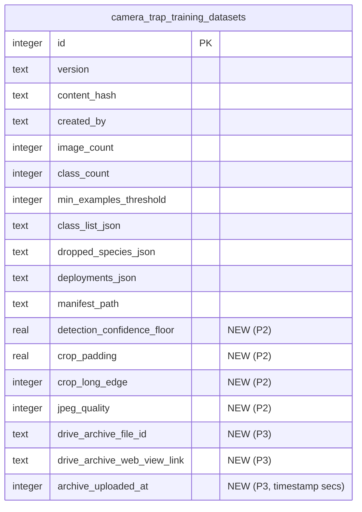

# ✨ Training-export MegaDetector metadata + tunable crop quality + one-click Drive share

## Overview

A collaborator training BioCLIP-2.5 classifiers on our camera-trap crops wants two things:

1. **Provenance metadata** for every crop in the training datasets we export — detector version, confidence threshold, crop padding, and the **per-crop detection confidence** — so he can correlate crop quality with classifier performance and filter for higher-quality crops.
2. An easier way to **get the export off our server and shared** with collaborators (today the only copy lives on disk inside the Docker container).

He's also exploring whether tweaking crop-quality factors (raising the confidence floor, changing padding) improves BioCLIP embeddings — currently stuck at macro-F1 ≈ 0.41 across LogReg/KNN/MLP vs. 0.30 for raw BioCLIP text-similarity. So beyond *reporting* the current params, we want to let him **regenerate exports with different quality knobs**.

This plan adds, to the existing training-export pipeline:
- A **per-crop `crops.csv`** sidecar + an enriched **`manifest.json`** params block.
- **Tunable export parameters** (detection-confidence floor, crop padding, crop long-edge, JPEG quality) surfaced in the export form, wired into the content-hash so quality variants don't collide.
- A **"Empaquetar y subir a Drive"** action that tars the export and uploads it to a shared Drive folder, returning a shareable link — with copy-paste CLI fallback instructions.

## Answer to send the collaborator now (no code needed)

The factual answer to his email, straight from the code:

- **Yes, it's MegaDetector.** The detector is **MegaDetector V6** (`PytorchWildlife.models.detection.MegaDetectorV6`), weights **`MDV6-yolov9-c`** (`src/lib/ml-defaults.ts:6`, `scripts/model-server.py:97-102`). "YOLOv9c" is just MDv6's backbone — same model. Species classification is a **separate** step (AI4GAmazonRainforest or a fine-tuned timm model), not the detector.
- **Confidence threshold:** `0.1` (`src/lib/ml-defaults.ts:8`), applied **inside Python at detection time** (`scripts/model-server.py:286-287`) — detections below 0.1 are never stored. ⚠️ This means we can filter **up** from 0.1 cheaply, but going below 0.1 requires reprocessing imagery.
- **Crop padding:** `0.05` (5% of each bbox dimension), hardcoded in the training exporter (`BBOX_PADDING`, `training-exports/actions.ts:59`). Crops are cut to **512 px long-edge, JPEG q90** (`CROP_LONG_EDGE`, `actions.ts:58,60`).
- **Confidence per crop:** Yes — stored as `biochoco_detections.detectionConfidence` (raw MD score, `src/db/schema.ts:351-372`), plus normalized bbox and `detectionClass`. We just don't currently export it.

After this feature, all of the above ships *with* each export (per-crop CSV + manifest), and he can request crop variants at a higher confidence floor / different padding.

## Problem Statement

The training export (`src/app/camera-trap/training-exports/`) produces an `ImageFolder`-style tree of cropped JPEGs (`data/training-exports/<version>/<split>/<species>/<detectionId>.jpg`) plus a `manifest.json` of aggregate counts. Gaps:

1. **No per-crop metadata leaves the building.** Detection confidence, bbox, class, detector version, and label provenance (ML species vs. human correction) all exist in `biochoco_detections` / `biochoco_identifications` but never appear in the export. A downstream ML user can't filter or analyze by crop quality.
2. **Crop-quality knobs are hardcoded constants** (`BBOX_PADDING`, `CROP_LONG_EDGE`, JPEG quality) and the confidence floor is fixed at the detection-time 0.1. No way to produce a "high-confidence, tighter-crop" variant for experiments.
3. **`contentHash` ignores those knobs** (`computeContentHash`, `src/lib/training-export-helpers.ts:375-390`) — two exports differing only in padding/quality would dedupe to `status: "unchanged"` and silently return the old crops. Adding tunables without fixing the hash is a correctness bug.
4. **No share path.** The export only exists on the container's disk volume. To hand it to a collaborator someone has to `docker compose exec`, tar by hand, and `scp`. There's no UI affordance and no Drive copy.

## Proposed Solution

Extend the existing **synchronous server action** `exportTrainingDataset` (`src/app/camera-trap/training-exports/actions.ts:569`) and its form, plus add a **second action** for packaging+uploading. Three phases, shippable independently:

- **Phase 1 — Metadata output** (highest value, lowest risk): emit `crops.csv` + enrich `manifest.json`. No new inputs, no hash change, no schema change.
- **Phase 2 — Tunable crop quality**: add form inputs for confidence floor / padding / long-edge / JPEG quality; thread through crop logic; **fold into `computeContentHash`**; persist on the dataset row.
- **Phase 3 — Drive packaging & share**: `packageAndUploadExport(version)` action → system `tar czf` → `uploadFileToSharedDrive` (streamed) → store `webViewLink` → show link + CLI fallback in the history table.

## Technical Approach

### Architecture

```
exportTrainingDataset(formData)                 [Phase 1 + 2]
  ├─ parse params (minExamples, confFloor, padding, longEdge, quality)   [P2]
  ├─ collectExportCandidates(confFloor)          ── filter detectionConfidence >= floor  [P2]
  ├─ stratify → rows[{imageId, finalLabel, deploymentId, split}]
  ├─ computeContentHash({rows, minExamples, classList, qualityParams})    [P2: add params]
  ├─ if hash unchanged → short-circuit (return existing version)
  ├─ cropAndWrite(row, padding, longEdge, quality) → <split>/<species>/<id>.jpg   [P2]
  ├─ writeCropsCsv(rows + per-crop metadata) → <version>/crops.csv         [P1]
  ├─ buildManifest(... + paramsBlock + detectorMetaBlock) → manifest.json   [P1]
  ├─ insert camera_trap_training_datasets (+ new param columns)            [P2]
  └─ recordEvent("training_export_completed", ...)                          [P1]

packageAndUploadExport(version)                  [Phase 3]   ← new action, button in history table
  ├─ requireAdmin()
  ├─ resolve dir data/training-exports/<version>/  (validate exists, path-safe)
  ├─ spawn `tar -czf <tmp>/<version>.tar.gz -C data/training-exports <version>`
  ├─ uploadFileToSharedDrive(stream, "<version>.tar.gz", "application/gzip", FOLDER_ID)   ← stream variant
  ├─ fetch webViewLink (add to fields)
  ├─ persist driveArchiveFileId / driveArchiveWebViewLink / archiveUploadedAt on dataset row
  ├─ cleanup tmp tarball
  └─ recordEvent("training_export_uploaded", ...)
```

### Phase 1 — Per-crop metadata output

**File:** `src/app/camera-trap/training-exports/actions.ts` (and `src/lib/training-export-helpers.ts` for pure helpers + tests).

`collectExportCandidates` (`actions.ts:179-211`) already joins `biochoco_detections` + `biochoco_identifications` + deployments. Extend its select to carry the metadata we need per crop, then write a CSV alongside the crops.

**`crops.csv` columns** (one row per cropped JPEG actually written):

| column | source | notes |
|---|---|---|
| `crop_path` | computed | relative, e.g. `train/danta/12345.jpg` — joins to the file on disk |
| `detection_id` | `biochoco_detections.id` | also the JPEG basename |
| `image_id` | `biochoco_detections.imageId` | |
| `deployment_id` | join | |
| `deployment_name` | join | human-readable |
| `split` | stratifier | `train` / `val` / `test` |
| `label` | `correctedSpecies ?? species` | the training label (== folder name) |
| `ml_species` | `identifications.species` | raw classifier prediction |
| `corrected_species` | `identifications.correctedSpecies` | null if not corrected |
| `verification_status` | `identifications.verificationStatus` | `verified` / `corrected` |
| `md_confidence` | `biochoco_detections.detectionConfidence` | **the per-crop MegaDetector score he asked for** |
| `classifier_confidence` | `identifications.confidence` | classifier's own score |
| `bbox_x`,`bbox_y`,`bbox_width`,`bbox_height` | detections | normalized 0–1 (pre-padding) |
| `detection_class` | `detections.detectionClass` | always 0 (animal) for training corpus |
| `detector_model_version` | `detections.modelVersion` | e.g. `MDV6-yolov9-c` (or `manual`) |
| `crop_padding` | export param | denormalized for convenience (constant per export) |
| `crop_long_edge` | export param | |
| `jpeg_quality` | export param | |

CSV writing: there's **no CSV-write dependency** in use here, but values are simple numerics/slugs/emails. Write a tiny inline `toCsvRow()` with RFC-4180 quoting (quote fields containing `,"`\n`, double internal quotes) rather than adding a dep — mirror the hand-rolled approach already used for the Camtrap-DP ZIP (`src/app/api/camera-trap/export/route.ts`). Stream rows to a write stream so large datasets don't buffer in memory.

**`manifest.json` additions** (`buildManifest`, `src/lib/training-export-helpers.ts:435-460`) — add two blocks:

```jsonc
"pipeline": {
  "detector": { "model": "MDV6-yolov9-c", "library": "PytorchWildlife/MegaDetectorV6" },
  "detectionConfidenceFloor": 0.1,        // effective floor used for this export
  "detectionThresholdAtCapture": 0.1,     // note: detections below this never stored
  "cropPadding": 0.05,
  "cropLongEdge": 512,
  "jpegQuality": 90
},
"cropsCsv": "crops.csv"
```

`detector.model` reads from `ML_DEFAULTS.detectorModel` (`src/lib/ml-defaults.ts:6`) — single source of truth, not a literal. (Caveat: a crop's *actual* `detector_model_version` is per-row in the CSV and may be `manual` for hand-drawn detections; the manifest reports the pipeline default.)

**Instrumentation:** add `recordEvent()` at the end of `exportTrainingDataset` after the dataset insert (`actions.ts:767-786`). Per CLAUDE.md, a bulk-data export is a default-**yes** event. No `processing_jobs` row exists, so construct the event directly (not via `buildJobCompletionEvent`). New event type — extend the event-type union in `src/lib/system-events.ts` (and any coverage-guard test).

**Phase 1 has zero schema change, zero hash change, zero new inputs** — purely additive output files. Ship first.

### Phase 2 — Tunable crop quality

**Form** (`src/app/camera-trap/training-exports/export-form.tsx`): add inputs beside the existing `minExamples` field:
- `detectionConfidenceFloor` — number, min **0.1**, max 1, step 0.05, default 0.1. Helper text: *"Mínimo 0.1 — las detecciones por debajo de 0.1 no se almacenan y requerirían reprocesar."* (Spanish, per CLAUDE.md.)
- `cropPadding` — default 0.05.
- `cropLongEdge` — default 512.
- `jpegQuality` — default 90.

Put these behind an **"Opciones avanzadas"** disclosure so the default flow stays one-click.

**Action** (`exportTrainingDataset`, `actions.ts:569`): parse the new fields with proper type-checking (no `as string` casts on `FormData.get`, per CLAUDE.md). Clamp/validate ranges; reject `< 0.1` confidence floor with a clear Spanish `ActionResult` error.

**Filter** (`collectExportCandidates`, `actions.ts:179-211`): add `AND detectionConfidence >= :confFloor` to the where clause. (Existing filters: `verificationStatus IN ('verified','corrected')`, `detectionClass = 0`, deployment not excluded.)

**Crop** (`cropAndWrite`, `actions.ts:844-882`): replace the `BBOX_PADDING`/`CROP_LONG_EDGE`/quality constants with passed-in params.

**⚠️ Content hash — the critical correctness fix** (`computeContentHash`, `src/lib/training-export-helpers.ts:375-390`): add the quality params to the canonical JSON. Without this, two exports differing only in padding/quality/floor collide and the second silently returns the first's crops via the short-circuit at `actions.ts:652-672`.

```ts
const canonical = JSON.stringify({
  splitStrategyVersion: SPLIT_STRATEGY_VERSION,
  minExamples: input.minExamples,
  classList: [...input.classList].sort(),
  // NEW — quality knobs participate in identity:
  detectionConfidenceFloor: input.detectionConfidenceFloor,
  cropPadding: input.cropPadding,
  cropLongEdge: input.cropLongEdge,
  jpegQuality: input.jpegQuality,
  rows: sortedRows,
});
```

Note `confFloor` *also* changes which rows survive `collectExportCandidates`, so `rows` shifts too — but include it explicitly anyway so padding/quality-only changes (which don't alter `rows`) still produce distinct versions.

**Schema** (`src/db/schema.ts` `cameraTrapTrainingDatasets`, `:411-429`) + `scripts/push-schema.mjs`: persist the params used, so the history table and reproducibility are honest. Add nullable columns:
`detection_confidence_floor REAL`, `crop_padding REAL`, `crop_long_edge INTEGER`, `jpeg_quality INTEGER`. Plain columns (no enum CHECK), so a straightforward additive migration — but follow the project's table-management pattern in `push-schema.mjs` and run on the server per the "Adding a new project" ops note.

### Phase 3 — Package & upload to Drive

**New action** `packageAndUploadExport(version: string): Promise<ActionResult<{ webViewLink: string }>>` in `actions.ts`, gated by `requireAdmin()`.

1. **Resolve & validate dir**: `data/training-exports/<version>/`. Sanitize `version` against a strict allowlist (`/^v\d+$/` or the exact set of known versions from the DB) — never interpolate raw user input into a shell `tar` command or a path. Confirm the dir exists; error in Spanish if missing.
2. **Archive**: shell out to system `tar` via `child_process.execFile` (Debian container has `tar`; codebase already spawns ffmpeg/python — `src/lib/ml-runner.ts`, `src/lib/frame-extractor.ts`). `execFile("tar", ["-czf", tmpPath, "-C", "data/training-exports", version])` — `execFile` (not `exec`) avoids shell injection. Write the tarball to a temp path under `data/` (same volume, avoids cross-device copy). **No `tar`/`archiver` npm dep needed** (none is installed; only a transitive `tar-stream@2.2.0` exists — don't rely on it).
3. **Upload (streamed)**: use `uploadFileToSharedDrive` (`src/lib/drive-client.ts:1339-1370`) but **swap `Readable.from(buffer)` for `createReadStream(tmpPath)`** so multi-GB archives stream from disk instead of buffering in RAM — mirror `uploadSingleFile` (`drive-client.ts:902-923`). Add `webViewLink` to the `fields` and return it (currently only `id,name,mimeType,size`).
   - **Target folder**: `TRAINING_EXPORT_DRIVE_FOLDER_ID` env var, defaulting to `11T9kj0Vgf584sFh1s9TYE11iL-Uu659c` (the folder from the request). Env-configurable so it's not a magic literal.
4. **Persist**: `driveArchiveFileId`, `driveArchiveWebViewLink`, `archiveUploadedAt` on the dataset row (new columns).
5. **Cleanup**: delete the temp tarball in a `finally`. On Drive failure, `deleteDriveFile` any partial upload (precedent: `apply/actions.ts:184-189`).
6. **Instrumentation**: `recordEvent("training_export_uploaded", ...)`.

**UI** (`src/app/camera-trap/training-exports/page.tsx:48-90`, the history `<table>`): add an **"Archivo / Compartir"** column per row:
- If not yet uploaded: a **"Empaquetar y subir a Drive"** button (client component wrapping the action in `useTransition`, with a "Empaquetando…" pending state and the existing *"puede tardar varios minutos"* warning).
- If uploaded: a link to `driveArchiveWebViewLink` ("Abrir en Drive") + the upload timestamp.
- A small **"Instrucciones CLI"** disclosure showing the manual fallback:
  ```bash
  docker compose exec portal tar -czf - -C data/training-exports <version> > <version>.tar.gz
  # then scp / rsync <version>.tar.gz off the host
  ```

**Sortable table:** per CLAUDE.md ("tables sortable by default"), since we're substantially editing this table, add the shared `SortIcon` and the SSR URL-param sort pattern (`?sortBy=&sortDir=`, `SORTABLE_COLUMNS` map) — model on `src/app/research-applications/page.tsx` / `src/app/admin/activity/page.tsx`. Keep `createdAt desc` as the default.

### Schema change (ERD)



⚠️ Drizzle `mode:"timestamp"` columns store **Unix seconds** — relevant if any raw `.mjs` script touches `archive_uploaded_at` (memory: `gotcha_drizzle_timestamp_seconds_raw_scripts`).

## Acceptance Criteria

> **Status (2026-05-28):** all three phases implemented on `main`. Verified via unit
> tests (1103 passing, incl. new hash-variant + CSV cases), clean `tsc`/ESLint on
> changed files, applied + verified schema migration, and a 200-rendering page
> screenshot. NOT yet exercised against the real Drive: a live tar+upload (gated on
> the SA-membership prerequisite below) and a full `npm run build` / `docker compose build`.

### Phase 1 — Metadata
- [x] Every export writes `data/training-exports/<version>/crops.csv` with one row per cropped JPEG and all columns in the table above.
- [x] `crop_path` values resolve to real files; `detection_id` matches the JPEG basename. *(crop_path built from `<split>/<folderName>/<detectionId>.jpg`, only for crops that land on disk.)*
- [x] `md_confidence` equals `biochoco_detections.detectionConfidence` for that detection.
- [x] `manifest.json` gains the `pipeline` block (detector model from `ML_DEFAULTS`, floor, padding, long-edge, quality) and `cropsCsv` pointer.
- [x] CSV quoting is RFC-4180-safe (species names / emails with commas don't break columns). *(`toCsvField` + unit test.)*
- [x] A `recordEvent` fires on successful export (`training_export.completed`, source `camera-trap`).
- [x] No regression: default one-click export still works with no new inputs *(all params optional with defaults; 1103 tests pass).*

### Phase 2 — Tunable quality
- [x] Form exposes confidence floor / padding / long-edge / JPEG quality under "Opciones avanzadas" with sane defaults (0.1 / 0.05 / 512 / 90). *(verified in screenshot.)*
- [x] Confidence floor `< 0.1` is rejected with a Spanish error explaining detections below 0.1 aren't stored.
- [x] Raising the floor yields strictly fewer/equal crops (`gte` filter); padding/size changes alter crop pixels (threaded into `cropAndWrite`).
- [x] **Two exports differing only in padding (same corpus) produce DIFFERENT `content_hash` and DIFFERENT versions** — no false "unchanged" dedupe. (Unit test `changes when ONLY a crop-quality knob changes`.)
- [x] Params are persisted on the dataset row (4 new columns) and the page renders them.

### Phase 3 — Drive share
- [x] "Empaquetar y subir a Drive" action tars the version folder and uploads `<version>.tar.gz` to the configured Drive folder. *(code complete; live upload pending SA membership — see prerequisite.)*
- [x] The uploaded archive extracts to the same tree as on disk (`tar -czf … -C EXPORT_ROOT <version>` preserves `<version>/<split>/<species>/<id>.jpg` + `crops.csv` + `manifest.json`).
- [x] History row shows an "Abrir en Drive" link + upload timestamp after success.
- [x] Temp tarball is always cleaned up (`finally` + `fs.rm force`); prior archive deleted on re-upload; partial uploads handled.
- [x] `version` is validated/sanitized (`/^v\d+$/` + DB existence check) — no shell injection (`execFile`, no shell), no path traversal.
- [x] Large archive streams from disk via `createReadStream` (no full-archive buffer in memory).
- [x] A `recordEvent` fires on successful upload (`training_export.uploaded`).
- [x] CLI fallback instructions are shown for manual download.
- [x] History table is sortable per the shared `SortIcon` pattern (SSR URL-param, id tiebreaker).

### Non-functional
- [x] `npm run test:run` passes (1103); `npm run lint`/`tsc` clean on changed files. ⏳ full `npm run build` not run.
- [ ] `docker compose build` succeeds (CLAUDE.md: verify paths/deps resolve in-container). *(not run — no new deps; uses system `tar` present in the Debian image.)*
- [x] No new runtime npm dependency added (uses system `tar` + `node:fs` streams).

## Dependencies & Prerequisites

- **Service-account Drive membership (blocking for Phase 3).** The target folder `11T9kj0Vgf584sFh1s9TYE11iL-Uu659c` must live in a Shared Drive where the service account is a **Content Manager member** (folder-level sharing is NOT enough — memory: `gotcha_sa_needs_drive_membership`), or uploads 403. Verify before Phase 3. If it's a *My Drive* folder, the SA must be granted edit access to it; SA-created files in a personal folder count against the SA's quota, so a Shared Drive is preferred.
- **All Drive calls need `supportsAllDrives: true`** — already baked into `uploadFileToSharedDrive` (memory: Google Shared Drives gotcha).
- `GOOGLE_SERVICE_ACCOUNT_KEY` env (already configured).
- New env `TRAINING_EXPORT_DRIVE_FOLDER_ID` (defaults to the linked folder id).
- Schema migration applied on the server (`docker compose exec portal node scripts/push-schema.mjs`).

## Risks & Mitigations

| Risk | Mitigation |
|---|---|
| **Content-hash collision** hides quality variants (silent wrong data) | Phase 2 acceptance test asserts distinct hashes; add params to `computeContentHash` canonical JSON. **Highest-priority correctness item.** |
| Confidence floor below 0.1 gives false expectations (crops don't exist) | Hard-reject `< 0.1`; manifest records `detectionThresholdAtCapture: 0.1`; UI helper text. |
| Synchronous tar+upload blocks the request for minutes on multi-GB exports | Acceptable for v1 (export itself is already synchronous with a "puede tardar" warning). If it proves too slow, promote to a `biochoco_processing_jobs` background job (new job type → must extend `JOB_LABELS` + `AUDIO_JOB_TYPES` per CLAUDE.md). Noted as a follow-up, not v1. |
| Shell injection / path traversal via `version` | `execFile` (not `exec`); strict `version` allowlist validated against DB rows. |
| Memory blow-up buffering archive | Stream tarball from disk via `createReadStream`, not `Buffer`. |
| `webViewLink` empty / no link sharing configured | File inherits Shared Drive membership; collaborators must be Drive members. If "anyone with link" is needed, that's a separate `permissions.create` call (none exists today) — out of scope unless requested. |
| Disk pressure from temp tarball on a full volume | Write tarball under `data/` (same volume as source — no cross-device), clean up in `finally`; consider a free-disk pre-check mirroring `getFreeDiskBytes` (memory: 2026-05-25 disk-full incident). |

## Out of Scope (note for the collaborator)

- **BioCLIP is the collaborator's own pipeline** — not in this repo (grep: zero hits). We supply crops + metadata; embedding/classification happens on his side.
- **Going below the 0.1 detection floor** would require reprocessing imagery through MegaDetector — a separate, much larger job, not this feature.
- "Anyone-with-link" public sharing of the archive (only Drive-member access here).
- Re-running detection with a different MD version / different MD class handling.

## References & Research

### Internal (file:line)
- Detector + threshold: `scripts/model-server.py:97-102,286-287,499`; `src/lib/ml-defaults.ts:5-11`
- Detection metadata schema: `src/db/schema.ts:351-372` (`biochoco_detections`), `:378-405` (`biochoco_identifications`)
- Training datasets schema: `src/db/schema.ts:411-429`
- Exporter: `src/app/camera-trap/training-exports/actions.ts:569` (`exportTrainingDataset`), `:179-211` (`collectExportCandidates`), `:844-882` (`cropAndWrite`), `:58-61` (crop constants), `:652-672` (dedupe short-circuit)
- Hash + manifest: `src/lib/training-export-helpers.ts:375-390` (`computeContentHash`), `:435-460` (`buildManifest`), `STRATIFY_MIN_DEPLOYMENTS=3`, `SPLIT_STRATEGY_VERSION=2`
- Export form/page: `src/app/camera-trap/training-exports/export-form.tsx:62-113`, `page.tsx:48-90`
- Drive upload: `src/lib/drive-client.ts:51-72` (auth), `:1339-1370` (`uploadFileToSharedDrive`), `:902-923` (`uploadSingleFile` stream variant), `:956-999` (`uploadFramesToDrive` local-file precedent), `:1041-1061` (`withRetry`), `:867-897` (`findOrCreateSubfolder`)
- Hand-rolled archive precedent: `src/app/api/camera-trap/export/route.ts:467-545` (ZIP via `node:zlib`)
- Sortable table pattern: `src/app/research-applications/page.tsx`, `src/app/admin/activity/page.tsx`; client pattern `src/app/finance/expenses/expense-table.tsx`
- Events: `src/lib/system-events.ts` (`recordEvent`, `JOB_LABELS`, `AUDIO_JOB_TYPES`, coverage-guard test)

### Related plans
- `docs/plans/2026-04-08-feat-custom-species-classifier-training-plan.md` — the export design (crop padding 5%, 512px, splits, hash, threshold-at-read-time philosophy)
- `docs/plans/2026-05-19-fix-training-export-guarantee-val-test-coverage-plan.md` — split coverage rules (`minExamples` + `≥3 deployments`)
- `docs/plans/2026-05-22-feat-camera-trap-model-comparison-plan.md` — model metrics/contract surfacing

### Relevant solution docs / memories
- `docs/solutions/build-errors/pytorchwildlife-docker-install-failures.md` — MegaDetector/PytorchWildlife install gotchas
- Memory: `gotcha_sa_needs_drive_membership`, Google Shared Drives `supportsAllDrives`, `gotcha_drive_write_rate_gate`, `gotcha_drizzle_timestamp_seconds_raw_scripts`, `incident_disk_full_biochoco_download`, `feedback_tables_sortable_default`

## Implementation Order (recommended)

1. **Phase 1** — pure additive output (`crops.csv` + manifest block + event). Ship + send collaborator a sample CSV.
2. **Phase 2** — tunable knobs + **hash fix** + schema columns. The hash fix is the one thing that must be correct.
3. **Phase 3** — Drive packaging/upload + sortable table UI. Verify SA Drive membership first.
