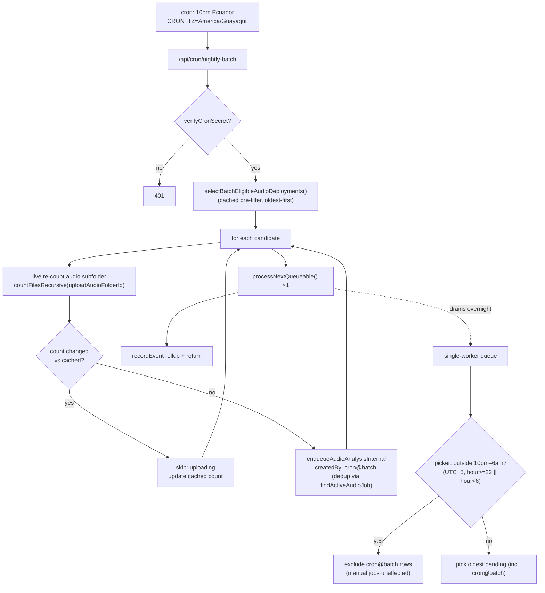

# ✨ Overnight Batch Processing of Audio Deployments

## Overview

We're behind on audio analysis: ~40 deployments have synced audio files but no
BirdNET / acoustic-indices results. This feature adds a **nightly cron** that
clears that backlog automatically during a low-activity window (**10pm–6am
Ecuador time**), one deployment at a time, while **never** processing a
deployment that's still being uploaded. Designed to later extend to camera-trap
ML on the same shared queue.

The portal already has the machinery: a unified **single-worker job queue**
(`src/lib/job-queue.ts`) that drains pending rows one at a time and self-re-fires
on each terminal transition; per-deployment combined audio jobs (BirdNET +
acoustic indices); the cron pattern (`verifyCronSecret`, `recordEvent`); Drive
file-count helpers; and SQL-derived "unprocessed" detection. **No new job type and
no new table are required** (reusing `audio_analysis` keeps the system-events
coverage-guard test green).

> **This plan was revised after a 3-reviewer pass** (DHH / Kieran-TS / Simplicity).
> The brainstorm's driver-loop design was simplified to **enqueue-all + a tiny
> origin-scoped window gate in the picker**, which removes the heartbeat, await
> chain, single-flight, and per-job re-count while staying correct. See
> [Design rationale](#design-rationale-what-the-reviews-changed).

## Problem Statement / Motivation

- BirdNET analysis is a manual, per-deployment action today
  (`src/app/audio/batch-analyze-dialog.tsx` → `batchCreateAudioAnalysisJobs`).
  Nobody will babysit 40 deployments by hand.
- Processing competes with daytime portal use and, critically, with **active
  field uploads** (`monitoreo@fcat-ecuador.org` uploads deployment folders to
  Drive manually, during the day). Processing a half-uploaded deployment produces
  incomplete analysis and wasted compute.
- There is **no existing "done uploading" signal** — it must be inferred. This is
  the only genuinely new domain logic.

## Proposed Solution

A single nightly cron (`/api/cron/nightly-batch`, fired at 10pm Ecuador) that:

1. Gates on `verifyCronSecret` (Bearer `CRON_SECRET` only — **no x-forwarded-for
   guard**, which blocks in-container localhost cron).
2. Selects **eligible** deployments (unprocessed-or-stale **and** settled),
   oldest-data-first, via a pure selector returning per-deployment results *with
   reasons*.
3. For each candidate, **re-counts its audio folder live** (catches same-day
   uploads the nightly-cached counts miss) and keeps only those still settled.
4. Enqueues each settled deployment as an `audio_analysis` job stamped
   `createdBy: "cron@batch"`, via an **auth-agnostic enqueue core** (see Blocker 1),
   then kicks `processNextQueueable()` once.
5. Records a rollup `recordEvent` and returns. The existing single-worker queue
   drains the pending rows through the night.

**The 6am cutoff** is enforced by an **origin-scoped gate in the picker**: when the
current time is outside 10pm–6am Ecuador, `processNextQueueable` excludes
`cron@batch` rows from its "next pending" pick. **Manual jobs (any other
`createdBy`, including NULL) are never gated.** A `cron@batch` job already running
at 6am overruns to completion (no mid-job cancel exists); after it, no new batch
job starts until the next window. Container restart is handled by the existing
startup kick (`src/instrumentation.ts` → `recoverStuckJobs` + `processNextQueueable`)
— pending rows persist in SQLite, so nothing is stranded.

### Design rationale (what the reviews changed)

| Brainstorm / first draft | Revised | Why |
|---|---|---|
| Driver loop awaiting each job; hourly re-entrant heartbeat | **Enqueue-all once at 10pm; existing self-drain** | Persisted pending rows + startup kick already give restart-safety; the heartbeat/await machinery was downstream of per-job re-count (Simplicity). |
| Per-job JIT re-count at job *start* | **One re-count per candidate at selection (10pm)** | Catches the realistic case (daytime uploads the cached counts miss). Overnight-upload-after-selection is negligible given the window's premise. |
| Window gate avoided in picker | **Tiny origin-scoped gate in picker** | Cheapest correct 6am cutoff; origin-scoping means manual jobs are provably never delayed (the actual CLAUDE.md concern). |
| Single-flight on in-flight `cron@batch` | **Removed** | No driver to guard; double-fire is idempotent because per-deployment `findActiveAudioJob` dedups enqueues. |
| Phase 3 (reprocess badge, force-run, write-then-swap) | **Deferred** | The 40 backlog items are never-processed (`lastBirdnetAt IS NULL`) — nothing to delete, nothing to reprocess. |
| Phase 4 camera-trap, "keep type-agnostic now" | **Cut to one sentence** | YAGNI; CT can copy the pattern when CT is the task. |

## Technical Approach

### Architecture



### Window math (Kieran #9)

Ecuador has no DST, so compute from UTC with a fixed −5 offset — independent of the
container's `America/New_York` clock. The window **crosses midnight**, so the
predicate is `hour >= 22 || hour < 6` (NOT `22 <= hour < 6`, which is always false):

```ts
// src/lib/batch-window.ts
export function isWithinEcuadorNightWindow(now: Date): boolean {
  const ecuadorHour = (now.getUTCHours() - 5 + 24) % 24;
  return ecuadorHour >= 22 || ecuadorHour < 6;
}
```
Unit-test the 21:59 / 22:00 / 05:59 / 06:00 Ecuador boundaries and the midnight wrap.

### Origin-scoped picker gate

In `processNextQueueable` (`src/lib/job-queue.ts:141`), only when **out of window**,
add a null-safe exclusion of batch rows to the "next pending" SELECT:

```ts
const inWindow = isWithinEcuadorNightWindow(new Date());
const conds = [
  eq(processingJobs.status, "pending"),
  inArray(processingJobs.jobType, [...QUEUEABLE_JOB_TYPES]),
];
if (!inWindow) {
  // exclude batch-origin rows; COALESCE keeps NULL-createdBy (manual) jobs eligible
  conds.push(sql`COALESCE(${processingJobs.createdBy}, '') != 'cron@batch'`);
}
// ...existing orderBy(createdAt, id).limit(1)
```
This is the **only** change to the shared queue. Manual jobs (createdBy = user email
or NULL) are never excluded. In-window, behavior is unchanged FIFO.

### Auth-agnostic enqueue core (Kieran #1 — BLOCKER)

`createAudioAnalysisJob` cannot be called from cron: it runs
`requirePermission("grabaciones","editor")` (which `redirect()`s with no user
header → throws `NEXT_REDIRECT`) and stamps `createdBy: user.email` (no `createdBy`
param). Extract an auth-agnostic core mirroring the existing `audio-compression-core`
pattern:

```ts
// src/lib/audio-analysis-core.ts (new)
export async function enqueueAudioAnalysisInternal(input: {
  deploymentId: number;
  createdBy: string;            // "cron@batch" for the nightly run
  includeBirdnet?: boolean;     // default true
  includeIndices?: boolean;     // default true
}): Promise<{ jobId: number } | { skipped: "active" | "no_files" }> {
  // keeps the existing findActiveAudioJob() single-flight guard + file-count check,
  // inserts the pending row with the passed createdBy, returns jobId.
  // Does NOT call requirePermission. NOTE: the up-front DELETE of prior detections
  // is a no-op for the never-processed backlog; the reprocess-safe variant is a
  // prerequisite for Phase 3 (see Reprocessing).
}
```
The public `createAudioAnalysisJob` becomes a thin wrapper:
`requirePermission` → `requireDeploymentAccess` → `enqueueAudioAnalysisInternal({...,
createdBy: user.email})`. The cron and the bootstrap trigger call the core directly.
Per-deployment `findActiveAudioJob` inside the core also resolves the double-fire and
selection→enqueue TOCTOU (Kieran #6) — re-checked at enqueue, not trusted from the
selector snapshot.

### Eligibility selector (the new domain logic)

`selectBatchEligibleAudioDeployments()` lives in `src/app/audio/actions.ts` **beside
`fetchAudioDeployments`** (DHH — not a standalone lib), reusing its correlated
subqueries. It returns a discriminated result per deployment so the rollup counts
and unit tests fall out of one pass (Kieran #11):

```ts
type BatchEligibility =
  | { eligible: true; deploymentId: number; audioFolderId: string; priorityRetrieved: boolean }
  | { eligible: false; deploymentId: number;
      reason: "no_audio" | "in_flight" | "up_to_date" | "null_counts" | "unsettled" };
```

Eligible when ALL hold (null-safe; unit normalization per Kieran #3):

```ts
// lastBirdnetAt from the raw sql`MAX(completed_at)` aggregate is Unix SECONDS at
// runtime (Drizzle's timestamp codec does NOT run on hand-written subqueries) —
// normalize BOTH sides to ms-epoch before comparing. Documented gotcha:
// gotcha_drizzle_timestamp_seconds_raw_scripts.
const lastMs = d.lastBirdnetAt == null ? null : Number(d.lastBirdnetAt) * 1000;
const newest = d.uploadNewestAudioDate ? new Date(d.uploadNewestAudioDate) : null;
const newestMs = newest && !Number.isNaN(newest.getTime()) ? newest.getTime() : null;

// 1. has synced audio
if (!d.uploadAudioFolderId || d.audioFileCount === 0) return notEligible("no_audio");
// 2. not already queued/running (derived from jobs table; cannot drift)
if (d.isBirdnetProcessing !== 0) return notEligible("in_flight");
// 3. counts present & parseable
if (d.uploadAudioCount == null || d.previousAudioCount == null || newestMs == null)
  return notEligible("null_counts");
// 4. needs (re)processing
const neverProcessed = lastMs == null;
const newFilesSince = lastMs != null && newestMs > lastMs;
if (!neverProcessed && !newFilesSince) return notEligible("up_to_date");
// 5. SETTLED: count stable since last nightly refresh AND newest file ≥ 24h old
const countStable = d.uploadAudioCount === d.previousAudioCount;
const quiet = (Date.now() - newestMs) / 3.6e6 >= SETTLE_QUIET_HOURS; // 24
if (!(countStable && quiet)) return notEligible("unsettled");
return eligible({ ... });
```
- **`SETTLE_QUIET_HOURS = 24`** (one fixed number). Anchored to `uploadNewestAudioDate`
  (Drive `modifiedTime`).
- **ODK `retrieved` is a priority sort-boost, not a hard filter** — some deployments
  never get a `retrieve_sensors` submission; the quiet-period + live re-count is the
  hard gate. Retrieved-first then oldest-data-first
  (`getDeploymentStatus` / `retrievedSet`, `src/app/biochoco/data/actions.ts:79`).
- **Null/never-counted ⇒ `null_counts` (skip tonight)** — nightly-refresh populates
  counts; eligible a later night.

### Live re-count at selection (Kieran #2 — BLOCKER fix)

For each candidate, count the **audio subfolder directly** — do NOT pass it to
`checkDeploymentUploads`, which expects the deployment *root* and would return 0
(skipping every deployment forever):

```ts
const live = await countFilesRecursive(d.audioFolderId, AUDIO_EXTENSIONS); // drive-client.ts
if (live !== d.uploadAudioCount) { /* update cached count; skip as "uploading" */ }
```
Serial, one count per candidate, naturally rate-spaced; honor `supportsAllDrives` /
`includeItemsFromAllDrives`, skip `_frames/`, `do...while(pageToken)`, and the
gaxios-v7 retry-reason gotcha.

### Instrumentation (DHH — slim payload; Kieran #12 — honest severity)

```ts
recordEvent({
  source: "cron",
  eventType: "cron_nightly_batch",  // free-text; no coverage-guard impact
  severity: enqueued === 0 && candidateCount > 0 ? "warn" : "success",
  summary: `Lote nocturno: ${enqueued} encolados, ${skippedUploading} en subida, ${remaining} pendientes`,
  durationMs,
  details: { enqueued, skippedUploading, skipped, remaining },
});
```
Per-deployment terminal outcomes still come free from `buildJobCompletionEvent`;
detailed skip reasons live in per-row logs, not the event payload.

### Crontab

```cron
# Overnight audio batch — one fire at 10pm Ecuador; the picker's UTC-5 gate enforces
# the 6am cutoff. CRON_TZ pins the fire to Ecuador so it can't drift under US DST.
CRON_TZ=America/Guayaquil
0 22 * * * root . /etc/cron.d/portal-env && /usr/bin/curl -fsS -X POST -H "Authorization: Bearer $CRON_SECRET" --max-time 1800 http://localhost:3000/api/cron/nightly-batch >> /app/data/backups/cron.log 2>&1
CRON_TZ=America/New_York
```
> `--max-time 1800` covers the serial re-counts + enqueues (not the overnight
> draining, which the queue does independently). **Hard pre-merge check:** confirm
> Debian's `cron.d` parser honors `CRON_TZ` and that resetting it afterward scopes
> correctly (fallback: schedule at `0 23 * * *` Eastern — safely in-window both DST
> regimes — and rely on the UTC−5 picker gate as source of truth).

## Implementation Status (v1 — 2026-06-17)

Phases 1 & 2 implemented. **Scope decision made during implementation:** v1
processes **never-processed deployments only** (`lastBirdnetAt IS NULL` — exactly
the 40-item backlog). The `newFilesSince` reprocess path is reported
`already_processed` and deferred to Phase 3, because re-running BirdNET on a
deployment that already has detections needs the write-then-swap deletion to be
data-safe (Kieran #10) — not worth building for a backlog that has nothing to
delete. Files shipped:
- `src/lib/audio-batch-eligibility.ts` (pure logic + window + sentinel) + tests
- `src/lib/audio-batch.ts` (selector, `enqueueAudioAnalysisInternal`, driver)
- `src/app/api/cron/nightly-batch/route.ts`
- `src/lib/job-queue.ts` (origin-scoped window gate)
- `src/lib/drive-client.ts` (`countAudioFilesInFolder` wrapper)
- `scripts/crontab` (10pm Ecuador line via `CRON_TZ`)

## Implementation Phases

### Phase 1 — Selector + window helper (pure, tested)
- `isWithinEcuadorNightWindow` + boundary/midnight-wrap tests.
- `selectBatchEligibleAudioDeployments()` returning `BatchEligibility[]`, with the
  seconds→ms normalization and `Invalid Date` guard.
- Unit tests per reason incl. seconds-vs-ms boundary, malformed date, null counts,
  stale-vs-fresh, retrieved ordering.
- **Deliverable:** tested pure logic; no behavior change.

### Phase 2 — Enqueue core + picker gate + cron route + crontab
- `enqueueAudioAnalysisInternal` (auth-agnostic core) + refactor public action to wrap it.
- Origin-scoped out-of-window exclusion in `processNextQueueable`.
- `/api/cron/nightly-batch` route (auth → select → live re-count → enqueue → kick →
  rollup), mirroring `nightly-refresh`'s enqueue idiom.
- Crontab line.
- **Deliverable:** backlog burns down overnight; manual jobs never gated; restart-safe.

### Phase 3 — Reprocessing (DEFERRED; not needed for the 40-item backlog)
The backlog is never-processed, so there is nothing to delete/reprocess. When
reprocessing is enabled later:
- `needsReprocessing = lastBirdnetAt != null && newestMs > lastMs` → badge in the
  "Estado" cell of `src/app/audio/audio-deployments-shell.tsx`.
- **Write-then-swap deletion (prerequisite, Kieran #10):** the current path deletes
  prior detections up front (`actions.ts:1258`, keyed `job_id IS NOT NULL` to preserve
  manual detections). The reprocess-safe variant must: insert new rows tagged with the
  new `jobId`, verify the insert count, **then** `DELETE … WHERE job_id <> newJobId AND
  job_id IS NOT NULL`. Test the "insert succeeds, crash before delete" path → no data
  loss, no duplicates, manual detections preserved.
- Admin **"Procesar ahora"** trigger (calls the core, bypasses the window) for a
  manual bootstrap if waiting a few nights isn't acceptable.

### Phase 4 — Camera-trap (out of scope)
CT ML can reuse this pattern later (same queue, same `cron@batch` sentinel, same gate);
build it when CT is the task.

## Alternative Approaches Considered
- **Driver loop awaiting each job + hourly heartbeat (first draft).** Rejected: the
  await/heartbeat/single-flight machinery exists only to make a per-job re-count fire
  at start; persisted pending rows + the startup kick give restart-safety without it,
  and it introduced real concurrency races (parallel drivers between awaited jobs).
- **Enqueue-all with no window gate (pure Simplicity).** Rejected: 40 serial jobs would
  run continuously for days, not one night — a starting-cutoff is mandatory.
- **Window gate inside picker for ALL jobs (brainstorm Approach A).** Rejected: would
  delay manual jobs. Origin-scoping fixes this.
- **Per-file incremental reprocessing.** Deferred: no per-file BirdNET tracking; cheap
  overnight compute makes whole-deployment reprocess adequate.

## Acceptance Criteria

### Functional
- [x] A nightly run enqueues eligible deployments; the queue processes them one at a
      time during 10pm–6am Ecuador and starts no new `cron@batch` job after 6am (last
      job overruns to completion). *(implemented; full overnight behavior is
      runtime-verified after deploy.)*
- [x] No deployment is enqueued whose live audio count differs from its cached count
      (live re-count at selection); count-at-selection logged.
- [x] Never-processed deployments are selected; already-processed are reported
      `already_processed` (reprocess deferred to Phase 3); null/never-counted are
      skipped with reason recorded.
- [x] The freshness/settle comparison is unit-correct across the seconds-vs-ms boundary
      and a malformed `uploadNewestAudioDate` (no silent `NaN`).
- [x] Reusing `audio_analysis` — coverage-guard test stays green (no `JOB_TYPES` change).
- [x] `cron@batch` rows are written (auth-agnostic core; cron does not hit `requirePermission`).

### Invariants
- [x] **Manual jobs are never gated or delayed** by the batch (picker excludes only
      `cron@batch` rows, only out-of-window; NULL-createdBy jobs stay eligible via COALESCE).
- [x] Container restart mid-night resumes via the existing startup kick; no pending
      rows stranded (driver always re-kicks the queue in-window).
- [x] Double-fire / retry is idempotent (per-deployment `findActiveAudioJob` dedups).
- [x] DST: cron fire time and gate agree year-round (`CRON_TZ` + UTC−5 gate).
- [x] Drive re-counts honor rate limits / gaxios-v7 retry (via `countFilesRecursive` `withRetry`).

## Success Metrics
- **Backlog burn-down:** deployments with `lastBirdnetAt` set rises toward N over the
  first few nights; report "N of 40 cleared".
- **Per-night rollup:** enqueued / skipped-uploading / skipped / remaining; plus per-job
  completion events.
- **Zero manual-job delay** attributable to the batch.

## Dependencies & Risks
- **Drive rate limits** during selection re-counts (serial; honor retry/gate).
- **`CRON_TZ` support** on the deploy host (hard pre-merge check; documented fallback).
- **Large deployment** can consume most of a window (oldest-first); surface
  "remaining" so nothing silently never runs.
- **Overnight-upload-after-selection** is an accepted residual risk (window premise:
  no overnight field uploads); re-count-at-selection covers the realistic daytime case.
- **better-sqlite3**: no `async` transaction callbacks; sequential `await` for `.returning()`.

## References & Research

### Internal (file:line)
- Queue: `src/lib/job-queue.ts:27` (`QUEUEABLE_JOB_TYPES`), `:141` (pick SELECT — gate goes here), `:56` (`tryClaimJob`)
- Audio: `src/app/audio/actions.ts:1203` (`createAudioAnalysisJob` — wrap), `:1217` (`requirePermission`), `:1258` (up-front delete), `:135`/`:196` (`fetchAudioDeployments` + subqueries), `:1245` (`findActiveAudioJob`)
- Auth: `src/lib/cron-auth.ts:11` (`verifyCronSecret`), `src/lib/auth.ts:107` (redirect-without-header)
- Cron pattern: `src/app/api/cron/nightly-refresh/route.ts:103` (auth), `:486`/`:512` (enqueue idiom), `:420` (`recordEvent`)
- Drive: `src/lib/drive-client.ts:264` (`checkDeploymentUploads` — root only), `countFilesRecursive` (subfolder count); `src/lib/camera-trap-sync-internals.ts:128` (`refreshUploadCountsInternal`)
- Restart: `src/instrumentation.ts` (startup kick), `src/db/index.ts:182` (`recoverStuckJobs`)
- Schema: `src/db/schema.ts:217` (`biochoco_processing_jobs`, `created_by` :246), `:173`+ (upload-tracking fields), `:186` (`uploadNewestAudioDate` is TEXT), timestamps are seconds
- Events: `src/lib/system-events.ts:38` (`recordEvent`), `:161` (`buildJobCompletionEvent`); guard `tests/unit/system-events.test.ts:347`
- Pattern to mirror: `src/lib/audio-compression-core.ts` (auth-agnostic core)
- Admin UI (Phase 3): `src/app/audio/audio-deployments-shell.tsx:183`, `src/app/audio/batch-analyze-dialog.tsx`

### Institutional learnings (docs/solutions/ + MEMORY)
- In-container cron = CRON_SECRET only; **drop x-forwarded-for guards** (commit 919f5ce).
- `async-transaction-better-sqlite3-CameraTrap-20260223.md` — no `async` transaction callbacks.
- `google-drive-recursive-file-counting-20260224.md` — shared-drive flags, skip `_frames/`, paginate.
- `odk-retrieve-date-field-restructured-20260224.md` — `retrieval_info.retrieval_date` first, then fall back.
- `gotcha_drizzle_timestamp_seconds_raw_scripts` — `mode:"timestamp"` aggregates are seconds at runtime (applied in the selector).
- gaxios-v7 retry-reason nesting — Drive 403 retry detection.

### Brainstorm & reviews
- `docs/brainstorms/2026-06-17-overnight-batch-processing-brainstorm.md`
- Reviewed by dhh-rails, kieran-typescript, code-simplicity (this revision incorporates all three).
```
