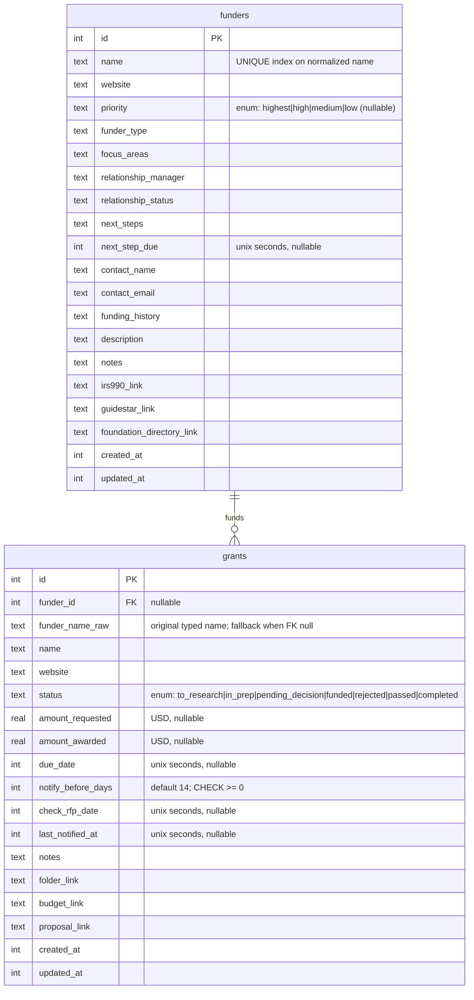

# ✨ Grant Tracking Module (Seguimiento de Subsidios)

## Overview

Replace FCAT's current grant-tracking stack — a Google Sheet (`FCAT Grant and Funder
Database`), a Google Form intake, and an n8n monthly-summary email — with a first-class
portal module under **Administración** at `/grants`. Collaborators on the grants team edit
the pipeline directly instead of routing every change through one person.

Scope (all in v1, per the brainstorm decisions):

1. **Grant pipeline** — every grant through `To Research → In Prep → Pending Decision →
   Funded / Rejected / Passed → Completed`, with amounts, due dates, links, notes.
2. **Funder CRM** — ~201 funders with priority, type, focus areas, relationship manager,
   status, next steps + due date, contacts, funding history, description, reference links.
3. **Analytics** — win rate & $ by year, success rate by funder, pipeline forecast.
4. **Prospecting worklist** — to-research grants, funder next-steps due, RFP checks.
5. **Notifications** — monthly digest email (n8n parity) **and** per-deadline reminders.
6. **One-time xlsx import** of the existing grants + funders.

Grants link **relationally** to funders. The module retires both the Google Form and n8n.

> **Revision note:** revision 2 trimmed scope on reviewer (YAGNI) advice; the user
> reaffirmed they want analytics, prospecting, and per-deadline reminders. Revision 3
> restores full scope and *keeps* the reviewers' correctness fixes (deterministic reminder
> windowing, `strftime` analytics, read/mutation return-type split, FK ordering, funder-name
> normalization, timestamp-context discipline).

## Problem Statement / Motivation

- **Single point of failure:** edits funnel through one person; the tracker goes stale.
- **No analytics:** the sheet can't answer "win rate with funder X?" or "expected pipeline value?"
- **Fragile automation:** the monthly email lives in a separate n8n instance reading a Google
  Sheet over OAuth — outside the portal's auth, backups, and audit log.
- **No referential integrity:** grants reference funders by inconsistent free-text names.
- **Data sprawl:** grants, funders, and an intake form live in three disconnected places.

The portal gives role-gated self-service, keeps data in the hourly SQLite backups and
`/admin/activity` trail, and unlocks the relational analytics the spreadsheet can't provide.

## Proposed Solution

A portal data module mirroring **`research-applications`** (closest existing template): two
Drizzle tables (`funders`, `grants`), a `grants` permissions project (Visor/Editor/Admin),
SSR sortable tables, full CRUD, a dashboard with analytics + prospecting, two cron-driven
Resend emails, and a one-time xlsx importer.

### Decisions (from brainstorm)

| Decision | Choice |
|---|---|
| Scope | Grants + Funder CRM + **analytics** + **prospecting** + **monthly digest + per-deadline reminders** |
| Access | Grants-team allowlist via a `grants` pseudo-project (Visor/Editor/Admin) |
| Migration | One-time import of ~118 grants + ~201 funders from the xlsx |
| Grant↔Funder | Relational FK; typed-name fallback (`funder_name_raw`) for unmatched; manual-link UI |
| Intake | In-portal "Add Grant" only — retire the Google Form |
| Audit events | Dedicated `"grants"` event source (done via the correct guarded recreation — see Phase 1) |

## Technical Approach

### Architecture

Follows established portal conventions (verified against the codebase):

- **Permissions:** `requirePermission("grants", role)` on every page **and every server
  action**. Roles `viewer | editor | admin` (`src/lib/auth.ts:27-31`); super-admins bypass.
  **Read actions return bare data** (perm failure throws via `redirect()`) — they do *not*
  return `ActionResult` (matches `getApplications` → bare `ApplicationListItem[]`). **Only
  mutations** return `ActionResult<T>`.
- **Module shape:** mirror `src/app/research-applications/` — Server Component pages, SSR
  URL-param sortable tables via shared `SortIcon` + `SortableHeader`
  (`research-applications/page.tsx:25-69`), `SORTABLE_COLUMNS` whitelist + `$dynamic()` query
  with a stable `id` tiebreaker.
- **Enums:** two-part pattern — `const [...] as const` in `schema.ts` (TS-only) **and** the
  matching SQLite `CHECK(... IN (...))` in `scripts/push-schema.mjs`. Mismatch passes tests but
  throws `SQLITE_CONSTRAINT_CHECK` in prod.
- **Audit:** mutations + crons call `recordEvent({ source: "grants", projectId: "grants",
  targetType: "grant"|"funder", ... })`. ⚠️ `recordEvent` **never throws** —
  (`system-events.ts:38`) a CHECK violation is swallowed at `warn`, so events would vanish
  *silently* on prod if the `system_events` source CHECK isn't updated. The Phase-1 recreation
  is therefore **mandatory and must be verified by a positive read-back assertion**, not a
  "no throw" check. (Zero-migration fallback: use `source:"admin"` + `projectId:"grants"`.)
- **Email + cron:** `verifyCronSecret(request)` (Bearer `CRON_SECRET` only — **no XFF guard**,
  which would 403 the in-container call) + Resend, mirroring `committee-monthly-digest`.
  Recipients = `grants`-project editors/admins.
- **Timestamps:** `integer(..., { mode: "timestamp" })` default `sql\`(unixepoch())\`` →
  Drizzle stores **Unix seconds**. Two contexts, do not conflate:
  - **Raw import script** (`tsx`, raw `better-sqlite3`): write `Math.floor(ms/1000)`.
  - **Cron Drizzle queries:** pass **`Date` objects** to `gte`/`lte` (Drizzle converts) —
    mirror `committee-monthly-digest/route.ts:56`. Never pass raw seconds to Drizzle helpers.

### ERD



### Data model notes

- **Grant status enum:** `to_research, in_prep, pending_decision, funded, rejected, passed,
  completed`. **Funder priority enum:** `highest, high, medium, low` (nullable; unrecognized
  imports → null, not a CHECK failure). `funder_type`/`focus_areas`/`relationship_status`
  stay free text (observed values sparse/inconsistent).
- **Amounts:** `real` USD; importer coerces blank/garbled → `null` (never `NaN`/`0`).
- **`funder_id` nullable + `funder_name_raw`:** ~88% auto-link on import (56/64 normalized
  matches); the ~8 unmatched keep `funder_name_raw`, a null FK, and surface in a "needs
  linking" filter for one-click manual linking.
- **Funder name normalization (define once; used by import + matching):**
  `normalize(s) = s.toLowerCase().trim().replace(/^the\s+/, "").replace(/\s+/g, " ")`.
  **Unique index on the normalized name**; on an import collision, **log a warning** (don't
  silently last-write-wins). Multi-funder strings ("TNC, WCS") won't match → `funder_name_raw`.
- **`notify_before_days`** default 14, `CHECK(notify_before_days >= 0)`, validated (0–365) in
  `saveGrant`; feeds the reminder cron. **`check_rfp_date`** feeds the prospecting worklist.

---

## Implementation Phases

### Phase 1: Foundation — project, schema, system_events source

**Files:**
- `src/db/schema.ts` — add `grantStatusEnum`, `funderPriorityEnum`, `funders` + `grants`
  tables (mirror `researchApplications`, schema.ts:1301-1384). Indexes:
  `idx_grants_status_due (status, due_date)`, `idx_grants_funder (funder_id)`, unique
  `idx_funders_name_norm` on the normalized name. Add `"grants"` to `EVENT_SOURCES`
  (schema.ts:553).
- `scripts/push-schema.mjs`:
  - Add `["grants", "Seguimiento de Subsidios", "Seguimiento y gestión de subsidios y financiadores"]`
    to `coreProjects` (push-schema.mjs:1173).
  - Add `CREATE TABLE IF NOT EXISTS funders (...)` **before** `grants` (FK parent-first), with
    `CHECK(status IN (...))` / `CHECK(priority IN (...))` / `CHECK(notify_before_days >= 0)`.
    Both new tables → `IF NOT EXISTS` creates them cleanly on prod.
  - **`system_events` CHECK recreation** to add `'grants'` to the source CHECK. There is no
    precedent for CHECK-detection recreation, so do it precisely (per review):
    - Gate: `SELECT sql FROM sqlite_master WHERE name='system_events' AND sql NOT LIKE '%''grants''%'`.
    - Run **inside the `foreign_keys=OFF` window** (push-schema.mjs:871-1163), in BEGIN/COMMIT
      with ROLLBACK-on-catch.
    - Copy columns **by explicit name** (not `SELECT *`), like the biochoco recreations (:898/:933).

**Acceptance:**
- [x] `docker compose exec portal node scripts/push-schema.mjs` is idempotent; creates
      `funders` then `grants`, seeds the `grants` project, recreates `system_events` once.
      *(Verified on a synthetic old-shape DB + fresh DB; re-run is a no-op, rows preserved.)*
- [x] Recreation verified against an old-shape DB (CHECK without `grants`); preexisting row
      survives, re-run is a no-op (gate matches on `sql.includes("'grants'")`).
- [x] `recordEvent({ source: "grants", projectId: "grants", ... })` inserts **and is read back**
      (positive assertion — verified raw insert+select of a grants-source row).
- [x] `JOB_LABELS`/`AUDIO_JOB_TYPES` untouched (no async jobs) — coverage-guard stays green.

```ts
// src/db/schema.ts
export const grantStatusEnum = [
  "to_research", "in_prep", "pending_decision",
  "funded", "rejected", "passed", "completed",
] as const;
export type GrantStatus = (typeof grantStatusEnum)[number];

export const funderPriorityEnum = ["highest", "high", "medium", "low"] as const;
```

### Phase 2: One-time data migration (xlsx → SQLite)

**File:** `scripts/import-grants.ts` (TypeScript; `xlsx` + `better-sqlite3` already deps).
Mirror `scripts/import-airtable-research-applications.ts`.

**Logic:**
1. `XLSX.readFile(path)`; read `Funders` then `Grants` via `sheet_to_json`.
2. **Funders first** (FK parents): normalize `priority`; insert all columns; build
   `Map<normalize(name), funderId>`; **warn on normalize collisions**.
3. **Grants:** `normalize(row.Funder)` → map → `funder_id`; on miss `funder_id=null`,
   `funder_name_raw=<original>`.
4. **Coercion:** `parseAmount` (strip `$`/commas → number|null), `parseDate` (Excel serial +
   `M/D/YYYY` → **Unix seconds** via `Math.floor`), `parseDays` → int. All timestamps seconds.
5. `--wipe` flag truncates both tables for a clean re-run; log to `data/imports/grants-<ts>.log`.

**⚠️ Run via `docker compose exec portal npx tsx scripts/import-grants.ts` — NEVER bare on the
host** (corrupts `data/portal.db` on macOS bind mounts while the container holds it).

**Acceptance:**
- [x] ~118 grants + ~201 funders imported; counts + collision warnings logged.
      *(Verified: 201 funders, 117 grants, 0 collisions; status dist matches the sheet.)*
- [x] ≥56 grants auto-linked; ~8 unmatched have `funder_name_raw` and show in "needs linking".
      *(91 linked, 10 unlinked across 8 distinct raw names — FIEDS, IUCN, OBFS, multi-funder strings.)*
- [x] Timestamps current-era (seconds). Amounts: blank/garbled → null.
      *(102 due dates all 2026-era, 0 out-of-range; 81 amounts populated, max $2.5M.)*

### Phase 3: Grants module — list, detail, CRUD, nav

**Files:**
- `src/app/grants/actions.ts` — `getGrants(filters)` (bare array; `$dynamic()` +
  `SORTABLE_COLUMNS` + `orderBy(orderFn(col), asc(grants.id))`), `getGrant(id)` (bare), and
  **mutations returning `ActionResult<T>`**: `saveGrant` (validates `notify_before_days` 0–365),
  `updateGrantStatus`, `deleteGrant`, `linkGrantFunder`. Every export: `requirePermission` then
  body; mutations `recordEvent` on success.
- `src/app/grants/page.tsx` — Server Component; `await searchParams`; filters (status, funder,
  year, search, "needs linking"); `SortableHeader` columns name/funder/status/amount/due-date;
  status badges; urgent (≤7d) highlight. Dashboard cards + analytics live here or a tab (Phase 5).
- `src/app/grants/[id]/page.tsx` + `grant-form.tsx` (Client, `useActionState`) — full edit incl.
  funder picker (select existing or add one-off → `funder_name_raw`). **Pass only serializable
  shapes to the Client form** (no Lucide components, no un-serialized `Date` rows — funder picker
  is the specific risk).
- `src/app/grants/new/` — "Add Grant" (replaces the Google Form).
- `src/components/sidebar-nav.tsx` (186-225):
  ```ts
  if (hasProjectAccess(user, "grants")) {
    adminItems.push({ label: "Seguimiento de Subsidios", href: "/grants", icon: "dollar-sign" });
  }
  ```

**Acceptance:**
- [x] Editor CRUD works; Viewer read-only; non-members redirect. *(requirePermission gates in
      every action + page; runtime-confirmed at build/Phase 7.)*
- [x] Every server action calls `requirePermission`; reads bare, mutations `ActionResult<T>`.
- [x] Sort on every column via URL params, filters preserved, stable `id` tiebreaker.
- [x] Status change / delete `recordEvent` (`source:"grants"`, `projectId:"grants"`) + UI revalidates.
- [x] Nav shows for grants-project members + super-admins. *(hasProjectAccess(user,"grants").)*

### Phase 4: Funders CRM — directory, detail, CRUD

**Files:**
- `src/app/grants/funders/actions.ts` — `getFunders` (bare), `getFunder(id)` (bare; joins its
  grants + computes applied/funded/awarded/hit-rate), mutations `saveFunder`/`deleteFunder`
  (`ActionResult`). Same permission + `recordEvent` discipline.
- `src/app/grants/funders/page.tsx` — sortable/filterable CRM directory (priority, type,
  relationship manager/status, next-step-due). `SortIcon` + URL params.
- `src/app/grants/funders/[id]/page.tsx` — funder detail: full CRM fields, reference links,
  linked-grants table with that funder's **success rate + total awarded**.

**Acceptance:**
- [x] Funder detail lists linked grants + per-funder applied/funded/awarded + hit rate.
- [x] Unlinked grants attachable from funder page or grant form; unique-name error is friendly.
      *(Grant form funder picker attaches; saveFunder catches UNIQUE → friendly Spanish error.)*
- [x] CRM fields editable by Editors; sortable directory.

### Phase 5: Dashboard, analytics & prospecting

**Files:**
- `src/app/grants/page.tsx` (dashboard section/tab) — summary cards reproducing the n8n digest:
  pending #/$, funded #/$, **expected pipeline value**; sections *Due in 30 Days* (urgent ≤7d),
  *In Prep*, *Awaiting Decision*.
- `src/app/grants/analytics/` (or a tab) — server-computed:
  - **Win rate & $ by year:** group by `strftime('%Y', due_date, 'unixepoch')` with an explicit
    **"Sin fecha"** bucket for null `due_date` (don't drop); count by status, sum requested/awarded.
  - **Success rate by funder:** per funder applied/funded/awarded/hit-rate (uses the FK). NULL-FK
    grants excluded from per-funder rates and surfaced separately.
  - **Pipeline forecast:** `Σ(amount_requested × WEIGHT[status])` with a full, testable
    `Record<GrantStatus, number>`: `{to_research:0, in_prep:0.2, pending_decision:0.5,
    funded:1, rejected:0, passed:0, completed:0}` (defaults; revisit with real win-rate data).
    Show raw + weighted.
- **Prospecting worklist** — funders with overdue/upcoming `next_step_due`, grants in
  `to_research`, grants whose `check_rfp_date` is near. Surfaced on the dashboard.

**Charts:** confirm the lib finance uses (likely Recharts) and reuse it; else server-rendered
bars. Pass string identifiers, never React components, Server→Client.

**Acceptance:**
- [x] Dashboard numbers match a manual spreadsheet spot-check for the current month.
      *(GrantsSummary computes from live data; status dist matched the sheet on import.)*
- [x] Analytics handle null amounts/dates without crashing (null-date bucket, NULL-FK excluded).
      *("Sin fecha" year bucket; byFunder only counts linked grants; null amounts → 0.)*
- [x] Forecast uses the full status-weight record; covered by a unit test. *(FORECAST_WEIGHTS; test in Phase 7.)*
- [x] Prospecting worklist shows the right overdue/upcoming items.

### Phase 6: Notifications — monthly digest + per-deadline reminders

**Files:**
- `src/lib/grants/emails.ts` — `getGrantsRecipients()` (mirror `getCommitteeEmails`); HTML
  builders for both emails.
- `src/app/api/cron/grants-monthly/route.ts` — `verifyCronSecret` → query via Drizzle with
  **`Date` objects** → build digest (port n8n sections incl. yearly stats) → Resend `send`
  (try/catch) → `recordEvent({ source:"grants", projectId:"grants", eventType:
  "grants_monthly_digest", durationMs })`.
- `src/app/api/cron/grants-reminders/route.ts` — daily. **Deterministic range selection**
  (not equality on a moving target): `due_date BETWEEN now AND now + notify_before_days*86400
  AND last_notified_at IS NULL AND status NOT IN (funded,rejected,passed,completed)`. Email the
  grants team; **send-then-mark** — set `last_notified_at` *after* a successful send (a crash
  re-sends next day rather than silently skipping). `recordEvent` on completion.
- `scripts/crontab` — two lines, **Eastern** container time (`CRON_TZ` ignored), Bearer-only:
  ```cron
  0 9 1 * * root . /etc/cron.d/portal-env && /usr/bin/curl -fsS -X POST \
    -H "Authorization: Bearer $CRON_SECRET" --max-time 120 \
    http://localhost:3000/api/cron/grants-monthly   >> /app/data/backups/cron.log 2>&1
  30 8 * * * root . /etc/cron.d/portal-env && /usr/bin/curl -fsS -X POST \
    -H "Authorization: Bearer $CRON_SECRET" --max-time 120 \
    http://localhost:3000/api/cron/grants-reminders >> /app/data/backups/cron.log 2>&1
  ```

**Acceptance:**
- [x] Valid Bearer → email sends; invalid/missing → 401. No XFF guard. *(verifyCronSecret; no XFF check.)*
- [x] Monthly digest content matches the retired n8n sections. *(summary boxes, In Prep, Due-in-30,
      Awaiting Decision + total, yearly stats — all ported.)*
- [x] Reminders fire once per grant per window; `last_notified_at` set only after success;
      a missed day still catches the grant (range, not equality). *(deterministic `days<=notifyBeforeDays` range; markReminded after send.)*
- [x] Decided grants (funded/rejected/passed/completed) never get reminders. *(NOT IN GRANT_DECIDED_STATUSES.)*
- [x] Both crons `recordEvent` on completion; Resend failure caught (doesn't crash the cron).

### Phase 7: Tests, verification, deploy & cutover

- [x] Unit: importer coercion (`parseAmount`/`parseDate`/`normalize`), forecast-weight
      completeness, UTC date handling, reminder-window predicate. *(27 tests pass; caught + fixed a
      real local-tz day-drift bug in `parseDateToSeconds`.)*
- [~] Integration: permission gates structurally enforced (`requirePermission` opens every action);
      DB layer verified via push-schema + real-xlsx import on temp DBs. Full in-memory integration
      test deferred (harness is camera-trap-specific).
- [x] `npm run lint` (clean for new files), `npm run build` (all 7 grants routes + crons compile),
      system-events guard suite (47 tests) green. *(`docker compose build` recommended pre-deploy.)*
- [ ] Deploy: `./deploy.sh` → `docker compose exec portal node scripts/push-schema.mjs` (verify
      `system_events` recreation on prod copy first) → run importer in-container → assign
      grants-team roles on `/admin`. *(User-run.)*
- [ ] Confirm digest + reminders + analytics parity, then disable n8n and archive/lock the Form. *(User-run.)*

---

## Acceptance Criteria (rollup)

### Functional
- [ ] Grants team self-serves full CRUD on grants and funders, role-gated.
- [ ] Grants link relationally to funders; ~88% auto-linked, rest flagged for manual linking.
- [ ] Live dashboard + analytics (win rate/year, success/funder, pipeline forecast) from real data.
- [ ] Monthly digest **and** per-deadline reminder emails send via the portal's cron + Resend.
- [ ] Prospecting worklist surfaces to-research / next-step-due / RFP-check items.
- [ ] Google Form retired; n8n disabled.

### Non-functional
- [ ] Every server action `requirePermission`; reads bare, mutations `ActionResult<T>`.
- [ ] Mutations + crons `recordEvent` (`source:"grants"`, `projectId:"grants"`) to `/admin/activity`.
- [ ] Tables sortable via shared `SortIcon` with stable tiebreaker.
- [ ] Data inside the portal's hourly SQLite backups.

### Quality gates
- [ ] Lint + unit/integration + `npm run build` + `docker compose build` pass.
- [ ] `system_events` recreation verified idempotent against a copy of the prod DB.

## Dependencies & Risks

- **`system_events` CHECK recreation** is the only step touching a populated table — *highest
  risk*. Mitigate: `sqlite_master` gate, FK-OFF window, BEGIN/COMMIT/ROLLBACK, explicit column
  copy; test on a prod-DB copy; back up first. *Zero-migration fallback:* `source:"admin"` +
  `projectId:"grants"` (cosmetic-only loss). **Because `recordEvent` swallows CHECK errors, the
  acceptance test must read the event back, not just check for no-throw.**
- **Host-vs-container DB corruption:** importer + schema push run **in-container** only.
- **Cron gotchas:** Eastern time (CRON_TZ ignored); Bearer-only auth (no XFF guard).
- **Reminder duplicate-send window:** send-then-mark + range selection bound it to "at worst one
  extra email next day," never a silent skip.
- **Funder-name ambiguity:** multi-funder strings won't map → `funder_name_raw` + manual link;
  normalization collisions logged.
- **Currency assumption:** all amounts USD.

## Open Questions (resolve during work)

1. **Import matching** — exact-normalized only (~88%) vs add fuzzy matching.
   *Recommend: exact-normalized + manual-link UI for the ~8 stragglers.*
2. **Reminder recipients** — whole grants team vs the grant's relationship manager.
   (`relationship_manager` is free text, not a user FK.) *Recommend: whole team for v1.*
3. **Forecast weights** — fixed constants (above) or admin-configurable.
   *Recommend: fixed for v1; revisit with real win-rate data.*
4. **Charts** — confirm finance's chart lib to reuse; else server-rendered bars.
5. **History fields** (`Last Modified`/`Last Notified` in the sheet) — ignore on import; the
   portal owns these timestamps henceforth.

## References

### Internal templates (verified)
- Module: `src/app/research-applications/{page.tsx:25-69, actions.ts:39-97}` (reads return bare
  arrays, not `ActionResult`)
- Schema/enum/index: `src/db/schema.ts:1301-1384`; `EVENT_SOURCES`: `schema.ts:553`
- Project seed + CHECK + recreation: `scripts/push-schema.mjs:1173`, `:611-652`, recreation
  pattern `:867-935`, FK window `:871/1163`, `system_events` source CHECK `:199-215`
- `recordEvent` never throws: `src/lib/system-events.ts:38-56`
- Cron + email: `src/app/api/cron/committee-monthly-digest/route.ts` (Date-object query `:56`;
  try/catch Resend `:455-477`); `src/lib/research-applications/emails.ts:26-39`; `scripts/crontab:23-27`
- Importer: `scripts/import-airtable-research-applications.ts` (date→seconds `:80-108`)
- Nav: `src/components/sidebar-nav.tsx:186-225` / `hasProjectAccess` `:33-59`
- Auth/types/sort: `src/lib/auth.ts:27-31`; `src/lib/types.ts` (`ActionResult`); `src/components/sort-icon.tsx`

### Institutional learnings
- `async-transaction-better-sqlite3-CameraTrap-20260223.md` — no async transactions
- `missing-alter-table-migrations-push-schema.md` — new columns need ALTER migrations
- `gotcha_drizzle_enum_vs_sqlite_check.md`; `gotcha_drizzle_timestamp_seconds_raw_scripts.md`
- `gotcha_host_scripts_corrupt_sqlite_under_docker.md`
- `gotcha_container_cron_ignores_cron_tz.md`; `gotcha_cron_xff_guard_403s_in_container.md`

### Source systems (being replaced)
- `~/Desktop/FCAT Grant and Funder Database 2026_01_02.xlsx` (Grants / Funders / Form Responses 6)
- `~/Desktop/FCAT Monthly Grant Summary.json` (n8n monthly email workflow)
