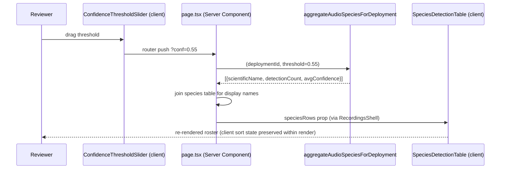

# feat: Species detection table on audio deployment detail page

## Summary

Add a **species detection table** below the existing timeline/raster on the audio deployment detail page (`src/app/audio/[id]/`). The table lists every species detected in that deployment with its detection count and average BirdNET confidence, sortable per column. Because the page is a Server Component that already reads the `?conf=` threshold the confidence slider controls, the table re-aggregates and updates automatically whenever the collaborator changes the confidence filter — no extra client wiring for live updates.

The aggregation reuses the established two-branch **effective-species** pattern (`aggregateAudioBySpecies` in `src/db/effective-species.ts`) and the read-time confidence filter (`applyConfidenceFilter` in `src/lib/audio-confidence.ts`), scoped to a single deployment and grouped by species.

Requested by a collaborator who wants a per-deployment species roster alongside the timeline.

---

## Problem Frame

The audio deployment detail page currently shows a status banner (with total detection/species counts) and a date×file raster ("timeline") where color encodes a chosen metric. There is **no flat list of which species were detected and how many times**. A collaborator reviewing a deployment cannot answer "what did we hear here, and how often?" without leaving the page for the cross-project species browser (`/audio/species`).

This plan adds that roster inline, honoring the confidence threshold the reviewer is already adjusting via the slider.

**In scope:** a sortable species table below the raster on the deployment detail page, fed by a per-deployment, threshold-filtered, effective-species aggregation.

**Out of scope (confirmed with user):**
- Species names are **not** links (no deep-link to the species browser for now).
- **No** pending-vs-verified counts column.
- No new chart/visualization beyond the table.
- No changes to the existing raster, slider, or status banner.

---

## Requirements

- **R1** — Below the raster, render a table of all species detected in the deployment, each with a detection count.
- **R2** — Show average BirdNET confidence per species alongside the count.
- **R3** — The table re-aggregates and reflects the current `?conf=` confidence threshold; changing the slider updates it.
- **R4** — Counts use **effective species**: human-corrected identifications count under their corrected name; rejected identifications are excluded. (Mirrors the species-browser semantics.)
- **R5** — The table is sortable per column (project convention: all data tables sortable by default).
- **R6** — Spanish UI strings (audio module convention).
- **R7** — Sensible empty/not-yet-analyzed state when the deployment has no BirdNET detections at the current threshold.

---

## Key Technical Decisions

- **Server-side aggregation, client-side sort.** Detection data is fetched in the Server Component (`page.tsx`) so it naturally re-runs on `?conf=` change (satisfies R3 with zero client state). Sorting is local `useState` in a Client Component child — the table is rendered inside the already-client `RecordingsShell`, and a second URL param would needlessly collide with `conf`. This follows the Client-Component sort pattern in `src/app/finance/expenses/expense-table.tsx`, not the SSR URL-param pattern. *(see origin pattern: `src/app/finance/expenses/expense-table.tsx`, `src/components/sort-icon`)*
- **Reuse the two-branch effective-species pattern.** Add a per-deployment aggregator mirroring `aggregateAudioBySpecies` (`src/db/effective-species.ts`): two index-eligible queries (active branch on `species`, corrected branch on `corrected_species`), each with `applyConfidenceFilter(threshold)`, scoped by `audio_files.deployment_id`, grouped by species only, merged in JS. This keeps SQLite able to hit partial indexes and satisfies R4 for free. *(see origin: `src/db/effective-species.ts:297` `aggregateAudioBySpecies`)*
- **Average confidence = weighted mean of non-null confidences.** Each branch selects `SUM(confidence)` and a non-null `COUNT(confidence)`; merge sums in JS and divide (guard divide-by-zero → `null`, rendered as "—"). Manual annotations (`confidence IS NULL`) count toward detections but not toward the average. **Caveat:** corrected-branch rows carry BirdNET's confidence for the *original* (wrong) species; including them in the corrected species' average is a minor semantic impurity, accepted for simplicity. Noted in Open Questions.
- **Display-name lookup in `page.tsx`.** The aggregator returns raw `{ scientificName, detectionCount, avgConfidence }`; `page.tsx` joins the `species` table for `spanishName`/`commonName`, mirroring `src/app/audio/species/actions.ts:97`. Keeps the aggregator display-agnostic, consistent with `aggregateAudioBySpecies`.

---

## High-Level Technical Design

The "updates as you change the confidence filter" requirement (R3) rides entirely on the existing URL-param → server-rerender loop; the table adds no new live-update machinery:

*Directional — confirms the data path, not final signatures.*

---

## Implementation Units

### U1. Per-deployment audio species aggregation

**Goal:** A query function returning per-species detection counts + average confidence for one deployment at a given threshold, using effective-species semantics.

**Requirements:** R1, R2, R3 (threshold param), R4.

**Dependencies:** none.

**Files:**
- `src/db/effective-species.ts` — add `aggregateAudioSpeciesForDeployment(deploymentId: number, threshold: number)` and its result type (e.g. `DeploymentSpeciesAggregate { scientificName, detectionCount, avgConfidence }`).
- `src/db/__tests__/effective-species-audio-deployment.test.ts` — new test file (in-memory SQLite, mirror existing effective-species/audio test setup).

**Approach:**
- Mirror `aggregateAudioBySpecies` (line 297) but: filter `audio_files.deployment_id = ${deploymentId}` (drop the project-scope `inArray`), `groupBy(audioIdentifications.species)` / `groupBy(audioIdentifications.correctedSpecies)` only (no deployment grouping), and add confidence aggregates: `sumConf: SUM(confidence)`, `confCount: SUM(CASE WHEN confidence IS NOT NULL THEN 1 ELSE 0 END)`.
- Active branch keyed on `species` + `activeIdentification(...)`; corrected branch keyed on `correctedSpecies` + `correctedIdentification(...)`; both AND `applyConfidenceFilter(threshold)`.
- Merge branches in JS by effective name: sum `detectionCount`, sum `sumConf`/`confCount`; `avgConfidence = confCount > 0 ? sumConf / confCount : null`.

**Patterns to follow:** `aggregateAudioBySpecies` and `mergeBranchRows` in the same file; `activeIdentification` / `correctedIdentification` / `effectiveSpeciesMatches` helpers.

**Test scenarios:**
- Happy path: deployment with 3 species → 3 rows with correct counts; row ordering not assumed (caller sorts).
- Effective species (Covers R4): an identification with `verification_status='corrected'`, `corrected_species='X'` counts toward X, not its raw `species`.
- Rejected excluded: `verification_status='rejected'` rows contribute to no species.
- Threshold filter: an `unverified` row with `confidence` below threshold is excluded; at/above is included; raising the threshold reduces a species' count.
- Verified/corrected always included regardless of threshold (per `applyConfidenceFilter` rule).
- Manual annotation (`confidence IS NULL`, non-rejected): counted in `detectionCount`, excluded from `avgConfidence` denominator.
- Average confidence: weighted mean across rows matches hand-computed value; species with only null-confidence rows → `avgConfidence === null`.
- Empty deployment (no detections) → empty array/map.
- Scope isolation: detections in a *different* deployment do not leak into the result.

**Verification:** New test file passes under `npm run test:run`; counts and averages match fixtures across threshold values.

---

### U2. SpeciesDetectionTable client component

**Goal:** A sortable, Spanish-language table presenting the species rows.

**Requirements:** R1, R2, R5, R6, R7.

**Dependencies:** U1 (consumes its row shape).

**Files:**
- `src/app/audio/[id]/species-detection-table.tsx` — new Client Component.
- `src/app/audio/[id]/__tests__/species-detection-table.test.tsx` — new component test (if the repo tests components; otherwise cover sort logic via the shared pattern used by `expense-table`).

**Approach:**
- Props: `species: { scientificName, spanishName, commonName, detectionCount, avgConfidence }[]`.
- Columns: **Especie** (scientific, italic), **Nombre común** (spanishName/commonName, muted; "—" if absent), **Detecciones** (right-aligned, `toLocaleString("es-ES")`), **Confianza media** (`avgConfidence?.toFixed(2)` or "—").
- Local `useState` sort (column key + direction), default **Detecciones desc**; stable tiebreaker on scientific name. Header cells use the shared `SortIcon` from `@/components/sort-icon`.
- Empty/not-analyzed state: muted Spanish message (e.g. "No hay detecciones BirdNET para este umbral de confianza." / "Sin analizar.") — distinguish "analyzed but nothing above threshold" from "never analyzed" using a prop flag if readily available, else a single neutral message.
- Visual style: mirror the card/border idiom of `src/app/biochoco/resultados/[siteId]/audio-species-section.tsx` and surrounding deployment-page cards.

**Patterns to follow:** Client-Component sort pattern in `src/app/finance/expenses/expense-table.tsx`; `SortIcon` usage; scientific-italic + Spanish-name layout in `audio-species-section.tsx`.

**Test scenarios:**
- Renders one row per species with formatted count and confidence.
- Default sort is Detecciones descending.
- Clicking a column header sorts asc then desc; sort indicator (`SortIcon`) reflects state.
- Tiebreak: two species with equal counts order deterministically by scientific name.
- `avgConfidence === null` renders "—", not "NaN"/"0.00".
- Missing Spanish/common name renders "—".
- Empty `species` array renders the empty-state message, not an empty table head with no body.

**Verification:** Table renders and sorts in the running app; no console warnings; matches deployment-page styling.

---

### U3. Wire aggregation into the page and render below the raster

**Goal:** Fetch the species rows server-side and render the table beneath the raster, updating with `?conf=`.

**Requirements:** R1, R3, R6.

**Dependencies:** U1, U2.

**Files:**
- `src/app/audio/[id]/page.tsx` — call `aggregateAudioSpeciesForDeployment(deploymentId, threshold)`, look up display names from the `species` table (mirror `src/app/audio/species/actions.ts:97`), pass `speciesRows` into `RecordingsShell`.
- `src/app/audio/[id]/recordings-shell.tsx` — accept the new `speciesRows` prop and render `<SpeciesDetectionTable>` below the raster block (after the `RecordingsRaster`, inside the same `space-y-*` container), ideally wrapped in a card with a Spanish heading (e.g. "Especies detectadas").

**Approach:**
- `threshold` is already parsed in `page.tsx` (line 35); reuse it so the table shares the slider's value (R3).
- Join species display names with a single `inArray(species.scientificName, names)` lookup (as in `audio/species/actions.ts`), building a name→row map; default `spanishName`/`commonName` to `null` when absent.
- Pass `speciesRows` through `RecordingsShell`'s props (extend its interface) down to the table. Place the table after the raster so the timeline stays primary.
- Guard placement so the existing `files.length === 0` empty state still reads correctly (table only meaningful once scanned/analyzed).

**Patterns to follow:** existing `birdnetStats` threshold-aware query in `page.tsx`; prop-threading style already used for `RecordingsShell`.

**Test scenarios:**
- Integration (Covers R3): rendering the page with `?conf=0.9` vs `?conf=0.3` yields different species rows/counts (fewer/more) — assert via the page action or an integration test of the data path.
- Page with a scanned-but-unanalyzed deployment passes empty/neutral species data; table shows empty state, raster unaffected.
- No layout regression: table sits below the raster, card spacing matches surrounding sections, no overflow on narrow widths (per UI-development convention — verify in full page context).
- Existing status-banner counts and raster behavior unchanged.

**Verification:** On the running app, opening a deployment shows the species table below the timeline; dragging the confidence slider updates both the banner counts and the table together; no layout shift.

---

## Scope Boundaries

### Deferred to Follow-Up Work
- Deep-linking species rows to the species browser (`/audio/species/[slug]`) with threshold preserved — explicitly out for now; trivial to add later (wrap the name cell in a `Link`).
- Pending-vs-verified breakdown column.
- CSV/export of the species roster.
- Per-species sparkline or temporal distribution.

### Out of Scope
- Changes to the raster, the confidence slider, or the status banner aggregation.
- Cross-deployment or project-level rollups (already covered by `/audio/species`).

---

## Open Questions

- **Average-confidence semantics for corrected rows.** Corrected-branch rows contribute BirdNET's confidence for the original species to the corrected species' average. Acceptable simplification for v1; revisit only if the number looks misleading to reviewers. (Resolvable at implementation by excluding corrected rows from the confidence average if preferred — does not change counts.)
- **Empty-state granularity.** Whether to distinguish "never analyzed" from "analyzed, nothing above threshold" depends on a flag already available in `page.tsx` (`lastBirdnetJob` / `hasBirdnetDetections`). Use it if cheap; otherwise a single neutral message is fine.

---

## Sources & Research

- `src/db/effective-species.ts` — `aggregateAudioBySpecies` (line 297), `mergeBranchRows`, `activeIdentification`/`correctedIdentification` — pattern source for U1.
- `src/lib/audio-confidence.ts` — `applyConfidenceFilter`, `parseThresholdParam`, default threshold — the read-time filter rule (R3/R4).
- `src/app/audio/[id]/page.tsx` — existing threshold parse + `birdnetStats` query; integration point for U3.
- `src/app/audio/[id]/recordings-shell.tsx` — client shell hosting the raster and slider; render site for the table.
- `src/app/audio/species/actions.ts` — display-name lookup pattern (`inArray(species.scientificName, names)`).
- `src/app/biochoco/resultados/[siteId]/audio-species-section.tsx` — existing species-list visual idiom (scientific italic + Spanish name + count).
- `src/app/finance/expenses/expense-table.tsx` + `src/components/sort-icon` — Client-Component sortable-table pattern (R5).
