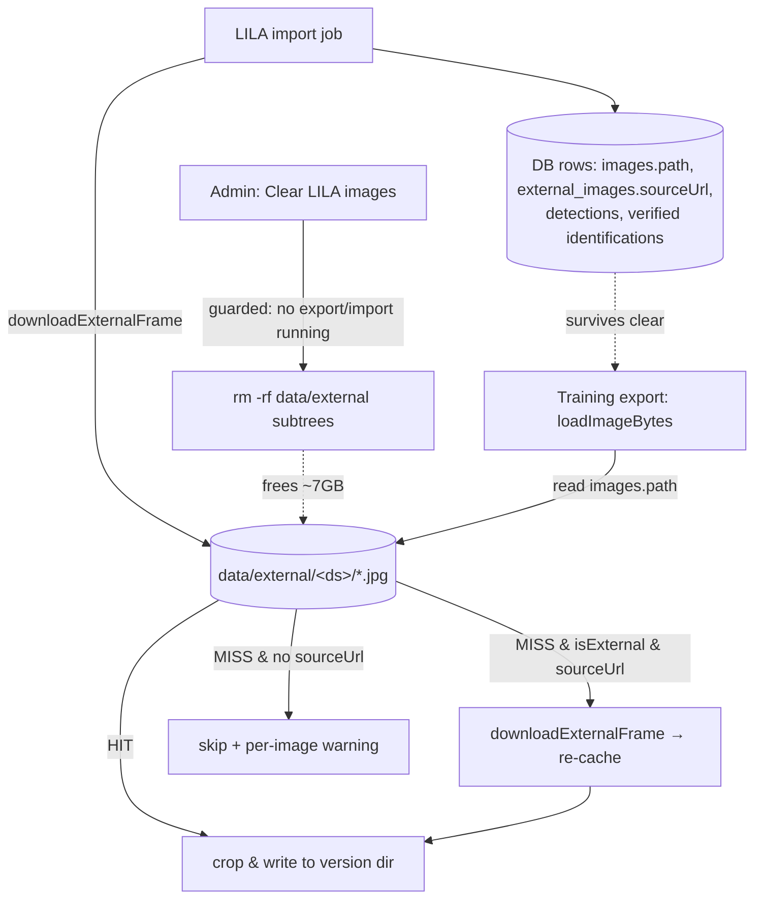

# feat: LILA frame cache eviction + re-download, merged into the Exportes UI

**Target repo:** `fcat-portal` (all units). The classifier repo (`fcat-biochoco-camera-classifier`) needs no changes — it consumes export folders, which are unaffected.

**Plan type:** feat · **Depth:** Standard

---

## Problem Frame

A completed LILA import leaves ~7GB of full-resolution frames under `data/external/<dataset>/` on the droplet (200GB disk). Today those frames are **durable, non-regenerable storage**: the exporter (`loadImageBytes`, `training-exports/actions.ts:1615`) reads them from disk to crop, and external `images` rows carry **no `driveFileId`**, so there is no fallback if the file is gone. Two consequences:

1. **You can't safely reclaim the disk.** Deleting `data/external/` silently orphans every external row — the next export skips those crops (recorded only as per-image warnings), quietly dropping the LILA augmentation from affected classes.
2. **Re-importing won't repair it.** The importer dedupes on `(sourceDataset, sourceImageId)` against the `external_images` table, so once rows exist it refuses to re-fetch the missing files. Recovery currently requires deleting DB rows first.

Since exports are infrequent, paying ~7GB of permanent disk between exports is a poor trade. The fix: turn `data/external/` into a **regenerable cache** — a one-button "clear" that frees the disk while keeping the DB rows, plus **lazy re-download** at export time from each row's retained `sourceUrl`.

Separately, the importer lives on its own sidebar page (`/camera-trap/external-imports`) disconnected from where its output is consumed. Fold it into the bottom of **Exportes de Entrenamiento** as a labelled section with a plain-language rundown of what LILA is, the two datasets, and what import vs. export actually do.

---

## Requirements

- **R1** — An admin can clear all downloaded LILA frames in one action, freeing the disk, without touching DB rows (provenance, boxes, verified labels survive).
- **R2** — After a clear, the next export **automatically re-downloads** each missing external frame from its `sourceUrl`, EXIF-scrubs it (same as import), caches it back to its original `data/external/...` path, and crops it — producing a byte-identical export to one run against a warm cache.
- **R3** — The UI shows current LILA cache disk usage (total bytes + file count) so the admin knows what clearing will reclaim.
- **R4** — Clearing is refused while a `training_export` or `external_import` job is in progress (prevents deleting frames mid-export).
- **R5** — The importer UI (form + history) moves into a new section at the bottom of the Exportes de Entrenamiento page; the standalone sidebar entry and `/camera-trap/external-imports` route are removed.
- **R6** — That section includes explanatory copy: what LILA BC is, the Orinoquía + WCS datasets, the honest-eval invariant (train-only), and what happens during import (download + record boxes/labels) vs. export (crop, lazy re-download if cleared).
- **R7** — Import behavior is **unchanged**: it still pre-downloads frames during the job (warm cache by default).

---

## Key Technical Decisions

- **KTD1 — `data/external/` becomes a regenerable cache, keyed on the existing `path` column.** No schema change. The local file at `images.path` is now treated as a cache entry that may be absent; `external_images.sourceUrl` (already stored, nullable) is the regeneration source. This reuses the exact mental model the ML pipeline already has for `driveFileId`-backed images (cache deleted routinely, re-fetched on demand) — see the existing comment at `training-exports/actions.ts:326`.

- **KTD2 — Extract one shared download-and-scrub helper; call it from both import and the export fallback.** The import's step-4 logic (`fetch(sourceUrl, {cache:"no-store"})` → `sharp(buf).jpeg({quality:95}).toFile(destPath)`, `import-job.ts:293-299`) becomes `downloadExternalFrame(sourceUrl, destPath)` in a shared module. Import calls it (no behavior change); `loadImageBytes` calls it on a cache miss for external rows. One code path guarantees the re-downloaded frame is scrubbed and encoded identically to the imported one, so crops stay byte-identical (R2).

- **KTD3 — Lazy re-download lives inside `loadImageBytes`, transparent to the crop loop.** When `imagePath` read fails AND the row is external AND `sourceUrl` is present, re-download to `imagePath`, then return the bytes. The existing per-image try/catch in the crop loop (`actions.ts:1239`) already converts a thrown error into a skipped-with-warning outcome, so a dead `sourceUrl` (or null) degrades exactly as today — no new failure handling needed. Requires adding `sourceUrl` to the `CandidateRow` select (currently absent).

- **KTD4 — Clear is a server action guarded by the existing job-status check, not a background job.** Deleting files is fast and synchronous. Guard against `training_export` and `external_import` rows in `pending`/`processing` (mirror the single-flight query in `external-imports/actions.ts:79`). Single button = wipe `data/external/` subtrees, recreate the empty dir, return freed bytes.

- **KTD5 — Disk usage is computed on page load by walking `data/external/`.** A `du`-style recursive size walk in a helper, rendered server-side in the new section. Cheap relative to page cost; no persistence needed.

- **KTD6 — Reuse the importer's existing form/action wholesale; only relocate.** `ImportForm`, `enqueueExternalImport`, and the history query move into the Exportes page rather than being rewritten. Keeps the single-flight grouping with ML jobs intact.

---

## High-Level Technical Design

Cache lifecycle (the core behavioral change):

The DB rows (C) are the durable truth; the frame files (B) are a disposable cache regenerated from `sourceUrl` via the **one** `downloadExternalFrame` helper shared by both the import path and the export-miss path.

---

## Implementation Units

### U1. Extract shared `downloadExternalFrame` helper

**Goal:** One reusable function that fetches a frame URL, EXIF-scrubs via sharp re-encode, and writes to a destination path — the single source of truth for how an external frame lands on disk.

**Requirements:** R2, KTD2

**Dependencies:** none

**Files:**
- `src/lib/external/frame-cache.ts` (new) — `downloadExternalFrame(sourceUrl: string, destPath: string): Promise<void>` (mkdir -p, fetch no-store, throw on non-OK, `sharp(buf).jpeg({quality:95}).toFile`).
- `src/lib/external/import-job.ts` — replace the inline download+scrub at lines 293-299 with a call to the helper; preserve the surrounding try/catch, tally, and progress update.
- `tests/unit/external-frame-cache.test.ts` (new)

**Approach:** Lift the existing logic verbatim (quality 95, `cache:"no-store"`). Keep `sanitizeFileStem`/path construction in the callers — the helper takes a fully-resolved `destPath`. Import's behavior must not change (R7): same files, same scrub, same failure tally.

**Patterns to follow:** the current import step-4 body (`import-job.ts:284-323`).

**Test scenarios:**
- Happy path: given a mocked `fetch` returning JPEG bytes, writes a file at `destPath` whose EXIF is empty after the sharp round-trip.
- Creates missing parent directories.
- Non-OK HTTP response throws (so callers can tally a failure).
- `Covers R2.` Re-encoding strips a GPS/datetime EXIF tag present in the source buffer.

### U2. Lazy re-download in `loadImageBytes`

**Goal:** Make the exporter regenerate a missing external frame on demand instead of failing.

**Requirements:** R2, KTD1, KTD3

**Dependencies:** U1

**Files:**
- `src/app/camera-trap/training-exports/actions.ts` — add `sourceUrl: externalImages.sourceUrl` to the candidate select (near line 308) and to the `CandidateRow` interface (near line 244) + its row mapping (near line 371); extend `loadImageBytes` (line 1615) with the external cache-miss branch.

**Approach:** In `loadImageBytes`, after the `imagePath` `fs.readFile` fails: if `row.isExternal && row.sourceUrl`, call `downloadExternalFrame(row.sourceUrl, row.imagePath)` then `fs.readFile(row.imagePath)` and return. Otherwise fall through to the existing `driveFileId` path (which throws for external rows, preserving today's skip-with-warning behavior for sourceUrl-less rows). Re-download happens inside the existing `pLimit` crop pool, so concurrency is already bounded.

**Patterns to follow:** existing `loadImageBytes` fall-through structure (`actions.ts:1615-1629`); the per-image warning catch at `actions.ts:1239-1250`.

**Test scenarios:**
- `Covers R2.` External row with present `sourceUrl` and missing local file → helper is invoked, file is re-cached, bytes returned.
- External row whose local file **exists** → no re-download (helper not called).
- External row with missing file and **null** `sourceUrl` → throws → crop loop records a warning and skips (no crash).
- Non-external row with missing file → unchanged: falls through to `driveFileId`.
- Integration: an export run against a cleared cache re-downloads, and the resulting crop count + `crops.csv` rows match a warm-cache run (no silent drops).

### U3. Cache stats + clear action

**Goal:** Report LILA cache disk usage and clear it safely.

**Requirements:** R1, R3, R4, KTD4, KTD5

**Dependencies:** none

**Files:**
- `src/lib/external/frame-cache.ts` — add `externalCacheStats(): Promise<{ bytes: number; fileCount: number }>` (recursive walk of `EXTERNAL_DIR`; returns zeros if absent) and `clearExternalCache(): Promise<{ freedBytes: number; fileCount: number }>` (sum then remove subtrees, recreate empty `EXTERNAL_DIR`).
- `src/app/camera-trap/training-exports/lila-actions.ts` (new) — `"use server"` `clearLilaImages()`: `requireAdmin`, single-flight guard (refuse if any `training_export` or `external_import` job is `pending`/`processing`), call `clearExternalCache`, return freed bytes; on guard failure return a Spanish error.
- Export `EXTERNAL_DIR` from `frame-cache.ts` and import it in `import-job.ts` (replacing the local const at line 55) so the cache dir has one definition.
- `tests/unit/external-frame-cache.test.ts` — extend for stats + clear + guard.

**Approach:** Mirror the single-flight transaction shape in `external-imports/actions.ts:79-105` but read-only (no job insert) — just check for active jobs and refuse. `clearExternalCache` must be idempotent (clearing an already-empty/absent dir returns `{0,0}`, not an error).

**Test scenarios:**
- `externalCacheStats` sums bytes + counts files across dataset subdirs; returns `{0,0}` when the dir is absent.
- `clearExternalCache` removes all frames, recreates an empty dir, returns the freed total; second call returns `{0,0}` (idempotent).
- `Covers R4.` `clearLilaImages` refuses (returns error, deletes nothing) when an `external_import` job is `processing`.
- `clearLilaImages` refuses when a `training_export` job is `processing`.
- Non-admin caller is rejected by `requireAdmin`.

### U4. Merge importer into the Exportes page + explainer + cache controls

**Goal:** One page. Move the import form/history under Exportes de Entrenamiento, add the LILA rundown and the cache (usage + clear) controls; remove the standalone route and sidebar entry.

**Requirements:** R5, R6, R7, KTD6

**Dependencies:** U3

**Files:**
- `src/app/camera-trap/training-exports/page.tsx` — append a `## LILA — Imágenes externas` section after Historial: explanatory copy (R6), cache usage line (from `externalCacheStats`), the clear control, the import form, and the import history (query lifted from the old page).
- `src/app/camera-trap/training-exports/lila-section.tsx` (new, client) — the clear button (calls `clearLilaImages`, shows freed bytes / error, refreshes) wrapping the relocated `ImportForm`; or keep `ImportForm` standalone and add a sibling `ClearCacheButton`. Reuse existing `ImportForm`.
- Move `src/app/camera-trap/external-imports/import-form.tsx` → `training-exports/import-form.tsx` (or import in place, then delete the route).
- Move/relocate `enqueueExternalImport` + `localTrainCounts` from `external-imports/actions.ts` into `training-exports/lila-actions.ts` (keep the `SERVER_JOB_TYPES` single-flight grouping).
- Delete `src/app/camera-trap/external-imports/` (page.tsx, import-form.tsx, actions.ts) after relocation.
- `src/components/sidebar-nav.tsx` — remove line 161 (`Importar LILA`).

**Approach:** Presentational relocation — the form, action, and history query already work; do not rewrite them. The explainer is static Spanish copy (mirror the tone of the existing page intro at `page.tsx:103`). Cache usage + clear render server-side from `externalCacheStats`; the clear button is the only new interactive piece. Keep admin gating (`requireAdmin` already guards the Exportes page).

**Patterns to follow:** existing Exportes section styling (`page.tsx:112-115`, the `border rounded-lg p-4 bg-muted/30` card); the old import page's history table (`external-imports/page.tsx:62-96`); `ExportArchiveCell` as a model for a small client cell.

**Test scenarios:** `Test expectation: none — presentational relocation + static copy.` The behavioral pieces it surfaces are covered by U2 (re-download) and U3 (stats/clear/guard). Verify by hand: section renders, sidebar no longer shows "Importar LILA", the old URL 404s, an import still enqueues and pre-downloads.

---

## Scope Boundaries

**In scope:** regenerable cache (clear + lazy re-download), cache-usage readout, single-flight guard, UI consolidation with explainer.

### Deferred to Follow-Up Work
- **Metadata-only import** (skip pre-download, rely entirely on lazy export-time fetch) — you chose *Download now / pre-warm*, so import behavior is unchanged. The U1/U2 split makes this a small future toggle if disk-at-import ever matters.
- **Per-dataset clearing** — you chose one button; the `clearExternalCache`/stats helpers could later take a dataset slug.
- **Local archive instead of full delete** — you chose full delete + re-download; not building a compressed local backup.
- **Auto-eviction** (e.g. clear N days after an export) — manual button only for now.

**Out of scope:** any classifier-repo change; export crop pipeline params; the honest-eval split logic.

---

## Risks & Mitigations

- **Re-download depends on LILA uptime.** Accepted by design (your "that's the point"). Mitigation: a dead/null `sourceUrl` degrades to the existing skip-with-warning path (U2) rather than failing the whole export — and warnings surface per image, so a wholesale LILA outage is visible, not silent.
- **Clearing mid-export corrupts an in-flight export.** Mitigated by the R4 single-flight guard (U3). Note the inverse is safe: an export that *starts* after a clear simply re-downloads.
- **First post-clear export is slower** (network re-fetch of thousands of frames within the bounded `pLimit` pool). Expected; exports are infrequent. Consider noting expected wall-clock in the section copy.
- **Stale `EXTERNAL_DIR` duplication.** Import currently defines its own const; U3 centralizes it in `frame-cache.ts` so clear/stats/import never disagree on the path.

---

## Verification (end-to-end)

1. Run an import (warm cache) — frames land, rows created, history shows it (R7 unchanged).
2. Note cache usage in the new section; click **Clear LILA images** — disk freed, usage drops to 0, DB rows intact (R1, R3).
3. Create a training export — external crops reappear in `train/`, `crops.csv` rows match the pre-clear export, no per-image warnings (R2). Confirm `data/external/` repopulated.
4. Start an export (or import), attempt to clear — refused with a Spanish message (R4).
5. Sidebar no longer lists "Importar LILA"; the old route 404s; the Exportes page shows the import form, history, explainer, and cache controls in one place (R5, R6).
