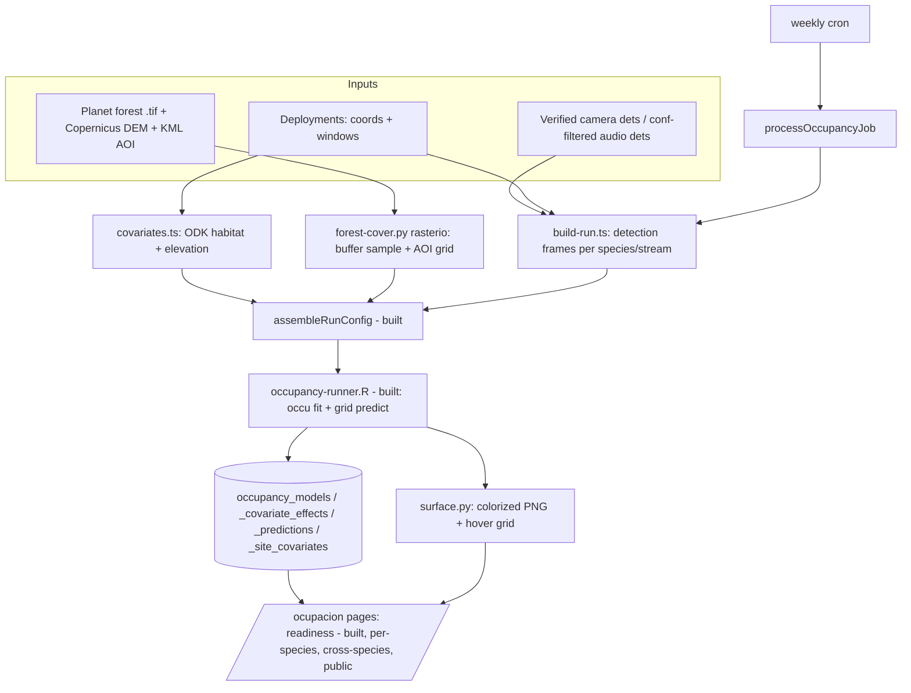

# feat: Occupancy Modeling Pipeline

## Summary

The occupancy-modeling **foundation** is already built and tested (core library, R runner + TS bridge, `occupancy_*` schema, `OCCUPANCY_MODEL` job type, and the `/ocupacion` data-readiness page — see origin doc's "Phase-1 spike results"). This plan covers the **remaining phases** to turn that foundation into a working, weekly-refreshing feature: a synthetic dev-data seeder (so the whole pipeline is testable locally), the covariate pipeline (ODK habitat + elevation + forest-cover raster buffer), the modeling processor + job wiring, the weekly batch, the per-species predicted-occurrence presentation, cross-species rollups, a public/donor variant, and the production runtime (R in the image).

**Production-data check (2026-07-06):** production is abundantly sufficient — **411 deployments (325 with coordinates), 16,893 verified camera detections across 212 deployments**; camera has **18 species at ≥15 sites** (30 at ≥5), audio **341,672 detections across 68 deployments, 113 species at ≥15 sites**. The prior "data blocker" was a dev/prod gap, not a real one. Models can run for real on production today; the seeder (U1) makes the same pipeline exercisable locally without moving real data.

---

## Problem Frame

The portal shows *where a species was detected* (raw points). It does not show *where a species probably occurs* after correcting for imperfect detection, nor how occurrence relates to forest cover, habitat, or elevation. This plan delivers single-season single-species occupancy models (`unmarked::occu` in R) fit on a weekly batch over verified camera detections and confidence-filtered audio detections, and a layered `/ocupacion` presentation: a public-friendly predicted-occurrence map and habitat story on top, scientist-grade effect sizes and diagnostics underneath, plus cross-species richness and effect-size rollups.

**Constraints carried from origin** (`see origin: docs/brainstorms/2026-07-03-occupancy-modeling-requirements.md`):
- Camera detections: verified/corrected only (`VERIFIED_STATUSES`). Audio: confidence threshold (default 0.7), configurable.
- Occasions: 5-day bins (configurable), ragged final bin kept, n-days-in-bin as a categorical detection covariate.
- Site covariates: forest-cover proportion in a buffer (new GIS compute from the 2022 Planet land-cover raster), elevation, habitat type. Standardize continuous covariates; snapshot per run for reproducibility.
- Spatial prediction is a **habitat projection**, not spatially explicit — label clearly on the page.

---

## Requirements Traceability

| Origin requirement | Where addressed |
|---|---|
| Weekly batch fit of all eligible species × streams | U5, U6, U8 |
| Camera verified-only / audio confidence-filtered detection histories | U5 (reuses built `readiness`/`config` filters) |
| Forest-cover buffer from Planet raster + KML AOI | U3 |
| Elevation + habitat covariates, standardized + snapshot | U2, U3 |
| Per-species layered page (map → habitat plot → response curves → scientist depth) | U9, U10 |
| Predicted-occurrence surface on a map over the AOI | U9, U10, U11 |
| Cross-species richness map + effect-size meta-analysis | U12, U13 |
| Public/donor token-gated simplified variant, noindex | U14 |
| R runtime available where the batch runs | U15, U16 |
| Local testability of the full pipeline | U1 |

---

## Key Technical Decisions

**KTD1 — Synthetic seeder for local testing (not a prod snapshot).** A deterministic generator produces occupancy-structured data (many sites with AOI coordinates, presence/absence driven by a known ψ(forest, elevation) process, detection driven by a known p) so eligible species exist locally and tests assert against known truth. Avoids moving 133k prod images and keeps CI deterministic. Prod snapshot restore remains a documented manual option but is out of scope. *(User-selected.)*

**KTD2 — Forest cover + elevation via Python `rasterio` in the existing ML venv.** Reuse `scripts/ensure-ml-venv.sh` (already installs `matplotlib`, `Pillow`, `numpy`) — add `rasterio`, `pyproj`, `shapely`. Sample forest-cover proportion in a configurable buffer (default 500 m, projected to meters via `pyproj`) around each site coordinate from the Planet `.tif`, and elevation from a Copernicus DEM `.tif`. No new Node GIS dependency. *(User-selected: include now, sequenced so U5/U6 can fit models on ODK covariates before U3 completes.)*

**KTD3 — Predicted surface as a colorized PNG `ImageOverlay`.** The R runner already predicts ψ+SE over an AOI grid; render it to a colorized PNG (Python `matplotlib`/`Pillow`, reusing ML venv) plus an NDJSON hover grid. Leaflet + `react-leaflet` + `proj4` are already dependencies; a PNG `ImageOverlay` over the AOI bounds avoids a client-side GeoTIFF library. *(see origin: Architecture summary.)*

**KTD4 — R installed at image build via `r-base` + a pinned `unmarked`.** Add `r-base` to the Dockerfile `dev` and `runner` stages and install `unmarked` (+ `jsonlite`) at build. Accept the image-size/compile-time cost; the documented fallback if it's prohibitive is an R sidecar container (`see origin: R runtime`). Locally R is already installed, so U5–U11 are testable before U15 lands.

**KTD5 — Site = deployment (camera station / audio unit), one model per species per stream.** Each deployment is a spatial replicate with its own window and coordinate. The origin says "physical location = site, most-recent complete season"; with 411 deployments giving ample spatial replication, deployment-as-site is the simpler, defensible v1. Physical-location grouping across redeployments is recorded as an Open Question, not silently adopted or cut.

**KTD6 — Covariate snapshot per run.** Add `occupancy_site_covariates` (the one origin table not yet built) to persist standardized covariate values + mean/sd per run, so response curves back-transform and predictions standardize with the exact parameters the model was fit on, and so a run is reproducible even as ODK data changes.

---

## High-Level Technical Design



Built components are marked "built". The processor (M) orchestrates D→G→H→persist; the cron (L) enqueues an `OCCUPANCY_MODEL` job weekly.

---

## Output Structure

New files (existing `src/lib/occupancy/*` and `scripts/occupancy-runner.R` already exist):

```
scripts/
  seed-occupancy-dev.ts            U1  synthetic dev data
  occupancy-forest-cover.py        U3  rasterio buffer + DEM sample + AOI grid
  occupancy-surface.py             U9  colorized PNG + hover grid from R predictions
src/lib/occupancy/
  covariates.ts                    U2  ODK/DB site covariates + snapshot
  build-run.ts                     U5  per-species orchestration
  processor.ts                     U6  processOccupancyJob
src/app/
  api/cron/occupancy-batch/route.ts U8  weekly batch
  ocupacion/
    actions.ts                     (built; extend: trigger run, fetch model)
    page.tsx                       (built; extend: map mode + run button)
    [slug]/page.tsx                U10 per-species layered page
    occupancy-map.tsx              U11 client Leaflet ImageOverlay
    cross-species/page.tsx         U12/U13
    public/[token]/...             U14
data/occupancy-models/<runId>/     model artifacts (PNG, hover grid)
```

---

## Scope Boundaries

**In scope:** synthetic seeder; covariate pipeline (habitat, elevation, forest-cover buffer, AOI grid); modeling processor + job dispatch + manual trigger; weekly cron; per-species predicted-occurrence page (map, habitat-use plot, response curves, diagnostics); landing map single-species mode; cross-species richness map + effect-size meta-analysis; public/donor token-gated variant; R + geo deps in the image.

### Deferred to Follow-Up Work
- Per-species / `occuFP` audio thresholds (origin's documented audio upgrade path); v1 uses the global confidence threshold.
- Spatially-explicit models (`spOccupancy`/`ubms`); v1 is a habitat projection, labeled as such.
- Trend / multi-season work; v1 models the most recent season per site.
- Physical-location site grouping across redeployments (see Open Questions).

### Non-Goals
- Changing the existing camera/audio detection or verification pipelines.
- Real-time (per-detection) model updates; cadence is weekly batch.

---

## Implementation Units

### Phase 1 — Local testability

### U1. Synthetic occupancy dev-data seeder
- **Goal:** Generate deterministic, occupancy-structured dev data so eligible species exist locally and the full pipeline (U5–U11) is exercisable without production data.
- **Requirements:** Local testability of the pipeline.
- **Dependencies:** none (schema already present).
- **Files:** `scripts/seed-occupancy-dev.ts`, `tests/unit/seed-occupancy-dev.test.ts`.
- **Approach:** Fixed RNG seed. Create ~40 `biochoco_deployments` with coordinates inside the KML AOI bbox, 25–45 day windows, and `date_start/date_end`. For a handful of camera species, draw site occupancy `z ~ Bernoulli(plogis(b0 + b_forest*forest + b_elev*elev))` using a synthetic forest/elevation gradient per site, then emit `biochoco_images` (filenames carrying `YYYYMMDD` inside each window), `biochoco_detections`, and verified `biochoco_identifications` consistent with `z` and a detection probability `p`. Mirror for audio (`audio_files` with AudioMoth-style `YYYYMMDD_HHMMSS` filenames, `audio_detections`, `audio_identifications` with confidence ≥/< threshold). Reuse the insert idioms in `scripts/seed-test-verified-detections.mjs` and `scripts/seed-dev.ts`. Timestamp columns are Unix **seconds** in raw scripts (see gotcha). Idempotent by a `seed_tag` marker so re-running replaces the synthetic set.
- **Patterns to follow:** `scripts/seed-test-verified-detections.mjs`, `scripts/seed-dev.ts`.
- **Test scenarios:**
  - Happy path: after seeding, `computeReadiness` (built) reports ≥1 camera species and ≥1 audio species as `eligible`.
  - Structure: ≥15 sites with coordinates + windows; at least one species detected at ≥3 sites with ≥`minDetections`.
  - Determinism: two runs with the same seed produce identical species/site/detection counts.
  - Idempotency: re-running does not duplicate rows (seed_tag replace).
- **Verification:** `npx tsx scripts/seed-occupancy-dev.ts` then load `/ocupacion` locally and see "Listo para modelar" on ≥1 species per stream.

### Phase 2 — Covariate pipeline

### U2. ODK/DB site covariates + snapshot table
- **Goal:** Assemble non-raster site covariates (habitat type; elevation fallback from ODK geopoint 3rd coordinate) and detection covariates, and persist a per-run snapshot.
- **Requirements:** habitat + elevation covariates; reproducible snapshot.
- **Dependencies:** U1 (for local data).
- **Files:** `src/lib/occupancy/covariates.ts`, `src/db/schema.ts` (+ `scripts/push-schema.mjs`, `tests/helpers/test-db.ts`) for `occupancy_site_covariates`, `tests/unit/occupancy-covariates.test.ts`.
- **Approach:** Add `occupancy_site_covariates` (runId, siteId, siteName, lat, lng, habitat, elevation, forestCover, plus standardized values + mean/sd JSON) — the one origin table not yet built; follow the three-copy schema rule (schema.ts + push-schema.mjs CHECK + test-db.ts). `covariates.ts` fetches habitat type from ODK habitat assessments (`src/app/biochoco/habitat/*`) and reads elevation from the geopoint's discarded 3rd coordinate (`src/lib/odk-types.ts`), returning `CovariateSpec[]` aligned to site order for `assembleRunConfig` (built). Forest cover + DEM elevation are filled by U3.
- **Patterns to follow:** existing `occupancy_*` tables; `src/lib/occupancy/config.ts` `CovariateSpec`; ODK field fallback chains (memory).
- **Test scenarios:**
  - Happy path: returns one habitat + one elevation value per seeded site, aligned to `frame.siteIds` order.
  - Edge: site missing habitat → covariate marked unavailable (not silently 0); site missing elevation → null, later filled by DEM.
  - Snapshot: persisted rows round-trip standardized value ↔ raw via stored mean/sd.
- **Verification:** covariate frame length equals site count; snapshot rows exist after a run.

### U3. Forest-cover buffer + DEM elevation + AOI prediction grid (rasterio)
- **Goal:** Compute forest-cover proportion in a buffer around each site and elevation from a DEM, and rasterize the covariate grid over the KML AOI for prediction.
- **Requirements:** forest-cover buffer from Planet raster + KML AOI; elevation.
- **Dependencies:** U2; ML venv geo deps (U16).
- **Files:** `scripts/occupancy-forest-cover.py`, `src/lib/occupancy/raster.ts` (TS bridge), `tests/unit/occupancy-raster.test.ts`.
- **Approach:** Python (`rasterio`, `pyproj`, `shapely`) reads the Planet land-cover `.tif`; for each site coordinate, project to a metric CRS, buffer (default 500 m, configurable), and compute the forest-class proportion of pixels in the buffer. Sample elevation from a Copernicus DEM `.tif` at each coordinate. For prediction, generate a regular grid of cells over the KML AOI polygon (configurable cell size), each with forest-cover, elevation, and nearest habitat class, emitted as JSON. TS bridge spawns the script (birdnet-runner shape; env `OCCUPANCY_PYTHON_PATH` → `ML_PYTHON_PATH`). Raster/KML file locations resolved via env (`OCCUPANCY_FOREST_RASTER`, `OCCUPANCY_DEM_RASTER`, `OCCUPANCY_AOI_KML`); document how these files reach the container (see Risks).
- **Patterns to follow:** `src/lib/birdnet-runner.ts` (spawn + NDJSON), `scripts/ensure-ml-venv.sh`.
- **Test scenarios:**
  - Happy path (small fixture raster): a fully-forested buffer → proportion ≈ 1.0; a fully-cleared buffer → ≈ 0.0; mixed → intermediate.
  - Buffer radius: larger radius over a forest edge changes the proportion monotonically as expected.
  - AOI grid: cell count matches AOI area / cell size (±1 row/col); all cells fall inside the AOI polygon.
  - Error path: missing raster file → script exits with a clear error surfaced by the bridge (never silent 0s).
  - Coordinate edge: a site outside the raster extent → flagged, excluded with reason (not clamped).
- **Verification:** forest-cover values in [0,1] for all seeded sites; AOI grid JSON loads and covers the AOI.

### Phase 3 — Modeling

### U5. Occupancy run orchestration (per species × stream)
- **Goal:** For a run, build detection frames per species, attach covariates, fit via the R runner, and persist models + effects + predictions + covariate snapshot.
- **Requirements:** weekly batch fit; detection histories; standardized covariates.
- **Dependencies:** U2, U3 (covariates); reuses built `readiness`, `config`, `runner`.
- **Files:** `src/lib/occupancy/build-run.ts`, `tests/unit/occupancy-build-run.test.ts`.
- **Approach:** Create an `occupancy_runs` row; reuse the readiness fetch (built) for sites + detections per stream; for each species clear the eligibility gate (built), assemble covariate frame (U2/U3) + config (built), call `runOccupancyModel` (built); persist `occupancy_models` (fitted or `sufficientData=false` + reasons), `occupancy_covariate_effects` (split state/det), `occupancy_predictions` (grid artifact path from U9's surface step), `occupancy_site_covariates`. Sequential better-sqlite3 writes (no async transaction — gotcha). Every species gets a row (eligible or not) so the readiness page and per-species page stay consistent.
- **Patterns to follow:** built `src/lib/occupancy/*`; `src/lib/birdnet-runner.ts` persistence loop.
- **Test scenarios:**
  - Happy path (seeded data + local R): eligible species produce an `occupancy_models` row with `convergence=0`, effects rows for each covariate, and a recovered positive forest slope sign matching the seeded truth.
  - Ineligible species: persisted with `sufficientData=false` and Spanish reasons, no effects rows.
  - R failure: a non-converging fit persists the model row flagged, does not abort the whole run (other species still fit).
  - Idempotency: re-running a run id upserts by `(runId, species, stream)` unique index.
  - Covers AE: eligible species map ψ back-transformed onto raw covariate scale via stored mean/sd.
- **Verification:** after a local run, `occupancy_models` has fitted rows for seeded species; effects + predictions persisted.

### U6. Occupancy job processor + queue dispatch
- **Goal:** Run a full occupancy build as an `OCCUPANCY_MODEL` background job, wired into the queue and system events.
- **Requirements:** weekly batch as a job.
- **Dependencies:** U5.
- **Files:** `src/lib/occupancy/processor.ts`, `src/lib/job-queue.ts` (`QUEUEABLE_JOB_TYPES` + `dispatchClaimedJob` case), `tests/unit/occupancy-processor.test.ts`.
- **Approach:** `processOccupancyJob(jobId)` sets progress/status messages (determinate `X de Y` across species per the processing-job UX convention), calls `build-run.ts`, and on terminal transition emits `buildJobCompletionEvent(job)` (JOB_LABELS already has `occupancy_model`). Add `OCCUPANCY_MODEL` to `QUEUEABLE_JOB_TYPES` and a `dispatchClaimedJob` case dynamic-importing the processor. Rich Docker logging (batch timing, elapsed, ETA, RSS, throughput) per the convention. Must tolerate `status='processing'` on entry and own its terminal transition + re-fire `processNextQueueable()`.
- **Patterns to follow:** `src/lib/job-queue.ts` BirdNET case; `floating-job-progress.tsx`/`progress-tracker.tsx` UX; `recordEvent`/`buildJobCompletionEvent`.
- **Test scenarios:**
  - Happy path: enqueue → dispatch runs the processor → job reaches `completed`, models persisted, one completion event recorded.
  - Progress: `processedImages`/status message advance monotonically across species.
  - Failure: a fatal build error transitions the job to `failed` with a Spanish message and records a `failed` event; queue continues.
  - Coverage guard: `system-events.test.ts` still passes (label already present).
- **Verification:** a queued occupancy job completes locally and writes models; `/admin/activity` shows the event.

### U7. Manual run trigger + admin control on /ocupacion
- **Goal:** Let an admin enqueue an occupancy run from the UI and see run status.
- **Requirements:** operability.
- **Dependencies:** U6.
- **Files:** `src/app/ocupacion/actions.ts` (extend: `triggerOccupancyRun`, `getLatestRun`), `src/app/ocupacion/page.tsx` (extend: admin button + last-run banner), `tests/unit/occupancy-trigger-action.test.ts`.
- **Approach:** `triggerOccupancyRun` calls `requirePermission("camera-trap","admin")`, inserts a `processing_jobs` row (`jobType=OCCUPANCY_MODEL`, `createdBy` = user), enqueues, returns `ActionResult`. Page shows last-run summary (date, n eligible, duration) and, for admins, a "Actualizar modelos" button using the `useActionState`/`useTransition` pattern; revalidate on completion.
- **Patterns to follow:** `ActionResult`; existing job-enqueue actions; `requirePermission` in every action.
- **Test scenarios:**
  - Happy path: admin trigger inserts a pending `OCCUPANCY_MODEL` job and returns success.
  - Permission: non-admin receives a redirect/permission failure; no job inserted.
  - Single-flight: triggering while a run is pending/processing does not create a second (guard on active occupancy job).
- **Verification:** button enqueues a job locally; banner updates after completion.

### Phase 4 — Weekly batch

### U8. Weekly cron route + crontab entry
- **Goal:** Enqueue an occupancy run automatically once a week.
- **Requirements:** weekly batch cadence.
- **Dependencies:** U6.
- **Files:** `src/app/api/cron/occupancy-batch/route.ts`, `scripts/crontab`, `tests/unit/occupancy-cron.test.ts`.
- **Approach:** Route authenticates with `verifyCronSecret` (Bearer only — **no** `X-Forwarded-For` guard; the in-container cron carries XFF, per gotcha), enqueues one `OCCUPANCY_MODEL` job (`createdBy='cron@batch'`). Add a weekly `scripts/crontab` line scheduled in **container Eastern time** (`CRON_TZ` ignored; overnight-batch gating window applies to queueable jobs). Configurable bin width / confidence threshold via env or run parameters.
- **Patterns to follow:** `src/app/api/cron/reconcile-shared-drives/route.ts` (Bearer-only auth); `scripts/crontab`.
- **Test scenarios:**
  - Happy path: valid Bearer secret enqueues exactly one job and returns 200.
  - Auth: missing/wrong secret → 401/403; request carrying only XFF (no secret) is still rejected, and a valid Bearer with XFF present is accepted (regression guard for the XFF-403 gotcha).
  - Idempotency: a second call while a run is active does not stack duplicate batches.
- **Verification:** hitting the route locally with the secret enqueues a job; crontab entry present.

### Phase 5 — Presentation (per-species)

### U9. Predicted-surface artifact (colorized PNG + hover grid)
- **Goal:** Turn the R grid prediction into a colorized PNG for the Leaflet overlay and an NDJSON hover grid.
- **Requirements:** predicted-occurrence surface on a map.
- **Dependencies:** U3 (AOI grid), U5 (predictions).
- **Files:** `scripts/occupancy-surface.py`, `src/lib/occupancy/surface.ts` (bridge), `tests/unit/occupancy-surface.test.ts`.
- **Approach:** Python (`matplotlib`/`Pillow`/`numpy`, already in ML venv) maps ψ per AOI cell to a colorized RGBA PNG aligned to the AOI bbox, plus a compact hover grid (cell → ψ, SE). Persist under `data/occupancy-models/<runId>/<species>-<stream>.png` and record `artifact_path`/`grid_data_path`/`bbox_json`/`psi_min`/`psi_max` on `occupancy_predictions`. Called by U5 after a successful fit.
- **Patterns to follow:** ML venv Python scripts; `birdnet-runner` bridge shape.
- **Test scenarios:**
  - Happy path: a small ψ grid → PNG of expected dimensions; low-ψ cells and high-ψ cells map to distinguishable colors.
  - Bbox: PNG bounds JSON matches the AOI bbox used by the overlay.
  - Edge: all-equal ψ grid → single-color PNG without NaN artifacts.
- **Verification:** PNG renders; `occupancy_predictions` row has artifact + bbox.

### U10. Per-species page `/ocupacion/[slug]`
- **Goal:** Layered per-species page: hero predicted-occurrence map + plain headline, habitat-use plot, response curves, scientist diagnostics, methods.
- **Requirements:** per-species layered presentation.
- **Dependencies:** U9; U11 (map component).
- **Files:** `src/app/ocupacion/[slug]/page.tsx`, small client chart components under `src/app/ocupacion/`, `src/app/ocupacion/actions.ts` (extend: `getSpeciesModel`), `tests/unit/occupancy-species-view.test.ts`.
- **Approach:** Server Component gated by `requirePermission("camera-trap","viewer")`; loads the latest model for the species/stream. Progressive disclosure (Spanish): (1) hero map (U11) + headline (estimated occupancy %), (2) collapsible concept primer, (3) habitat-use plot — predicted ψ by habitat with CIs, (4) response curves ψ vs forest cover / elevation (back-transformed via stored mean/sd), (5) "Para científicos" — effects table, detection p, diagnostics (n sites/detections, naive vs estimated ψ, AIC, convergence), (6) "Datos y métodos" footer. Streams shown separately when both exist. Label the surface as a habitat projection.
- **Patterns to follow:** `src/app/public/biochoco/[token]/especies/[slug]/`; existing chart usage; progressive-disclosure/collapsible components.
- **Test scenarios:**
  - Happy path: a fitted species renders map + habitat plot + response curves + diagnostics.
  - Insufficient data: a species with `sufficientData=false` shows the "datos insuficientes" state with reasons, no fabricated curves.
  - Both streams: camera + audio each render their own panel; only-audio species omit the camera panel.
  - Back-transform: response-curve x-axis is on the raw covariate scale (e.g., forest-cover %), not z-scores.
- **Verification:** navigate from `/ocupacion` to a seeded species and see the full layered view.

### U11. Landing map single-species mode + map component
- **Goal:** Reusable Leaflet map rendering the predicted-ψ surface as an `ImageOverlay` with site points and hover readout; wire single-species mode into `/ocupacion`.
- **Requirements:** predicted surface on a map; species picker.
- **Dependencies:** U9.
- **Files:** `src/app/ocupacion/occupancy-map.tsx` (client), `src/app/ocupacion/page.tsx` (extend: species picker + map), `tests/unit/occupancy-map-data.test.ts` (pure data helpers only).
- **Approach:** Client component built on `react-leaflet` (already a dep) reusing patterns from `src/components/species/deployment-map-inner.tsx`. Colorized PNG `ImageOverlay` over `bbox_json`; deployment site points overlaid; hover reads the NDJSON grid for a ψ readout. Pass server→client data as plain serializable props (no functions/components — memory gotcha). A searchable species picker switches the surface.
- **Patterns to follow:** `src/components/species/deployment-map-inner.tsx`; server→client serialization gotcha.
- **Test scenarios:**
  - Data helper: pixel↔latlng mapping for a known bbox returns expected cell for a coordinate.
  - Hover lookup: nearest-cell ψ lookup returns the seeded cell value.
  - Test expectation: rendering interactions verified manually in-browser (Leaflet DOM not unit-tested).
- **Verification:** overlay renders over the AOI with a working hover readout in the browser.

### Phase 6 — Cross-species

### U12. Cross-species richness map (Σψ)
- **Goal:** A predicted-richness surface summing ψ across selected species, with taxa/guild filters.
- **Requirements:** cross-species richness map.
- **Dependencies:** U9, U11.
- **Files:** `src/app/ocupacion/cross-species/page.tsx`, `src/lib/occupancy/richness.ts`, `tests/unit/occupancy-richness.test.ts`.
- **Approach:** Sum per-cell ψ across eligible models for a filter set (taxa/guild groupings from species metadata) into a richness surface, rendered with the U11 map. Precompute the summed grid server-side; render as a colorized PNG the same way as U9 (extend `surface.py` or aggregate in Node).
- **Patterns to follow:** U9/U11; species taxonomy in `biochoco_species`.
- **Test scenarios:**
  - Happy path: Σψ over 3 known grids equals cell-wise sum; filter to 1 species reduces to that species' surface.
  - Guild filter: only species in the selected guild contribute.
  - Edge: no eligible species in a filter → explicit empty state.
- **Verification:** richness map renders and responds to taxa/guild filters.

### U13. Effect-size meta-analysis (forest plots)
- **Goal:** Forest-cover and elevation slope effect sizes across species, grouped by taxa/guild.
- **Requirements:** effect-size meta-analysis.
- **Dependencies:** U5 (effects persisted).
- **Files:** `src/app/ocupacion/cross-species/page.tsx` (extend), `src/lib/occupancy/meta-analysis.ts`, `tests/unit/occupancy-meta-analysis.test.ts`.
- **Approach:** Query `occupancy_covariate_effects` for forest/elevation state slopes with SEs across species; render forest plots (point estimate + CI) grouped by taxa/guild. Aggregate/summary line per group (simple inverse-variance mean; label as descriptive, not a formal random-effects model).
- **Patterns to follow:** existing chart components; `occupancy_covariate_effects`.
- **Test scenarios:**
  - Happy path: assembles one row per species with forest slope + CI from persisted effects.
  - Grouping: group means computed per taxa/guild; a group with one species shows that estimate.
  - Edge: species missing a forest covariate (dropped as constant) excluded from that plot with a note.
- **Verification:** forest plot renders grouped effect sizes for seeded species.

### Phase 7 — Public/donor variant

### U14. Token-gated public occupancy page + noindex
- **Goal:** A simplified, public-shareable occupancy view (map + habitat story only), token-gated and `noindex`.
- **Requirements:** public/donor variant.
- **Dependencies:** U10, U11.
- **Files:** `src/app/public/ocupacion/[token]/[slug]/page.tsx`, share-token plumbing (reuse `siteShareTokens`-style pattern or extend), `tests/unit/occupancy-public-access.test.ts`.
- **Approach:** Reuse the model/prediction outputs but render only the simple blocks (hero map, habitat-use plot, plain-language story); `robots: noindex`; mirror `src/app/public/biochoco/[token]/especies/[slug]/`. No scientist depth, no admin controls.
- **Patterns to follow:** `src/app/public/biochoco/[token]/...`; token validation + allowlist.
- **Test scenarios:**
  - Happy path: valid token renders the simplified page; response carries `noindex`.
  - Auth: invalid/revoked token → not found; no data leak.
  - Depth hidden: scientist-only sections are absent from the public DOM.
- **Verification:** a valid token renders the public page with only the simple blocks and noindex.

### Phase 8 — Production runtime

### U15. R in the Docker image
- **Goal:** Make R + `unmarked` available where the batch runs.
- **Requirements:** R runtime for the batch.
- **Dependencies:** none (parallelizable; prerequisite for prod execution of U6/U8).
- **Files:** `Dockerfile` (`dev` + `runner` stages).
- **Approach:** `apt-get install r-base` in both stages; install `unmarked` + `jsonlite` at build (`Rscript -e 'install.packages(...)'`), or pinned `r-cran-*` where available. Accept image-size/compile cost; document the sidecar fallback. Verify `Rscript -e 'library(unmarked)'` in the built image.
- **Patterns to follow:** existing Dockerfile ML system-deps stanza.
- **Test scenarios:** `Test expectation: none — infra. Verified via `docker compose build` + `library(unmarked)` load in-container.`
- **Verification:** `docker compose build` succeeds; `unmarked` loads in the container; a queued job fits models in Docker.

### U16. Geo deps in the ML venv
- **Goal:** Add `rasterio`, `pyproj`, `shapely` to the ML venv for the covariate pipeline.
- **Requirements:** forest-cover/DEM/AOI compute.
- **Dependencies:** none (prerequisite for U3 in Docker).
- **Files:** `scripts/ensure-ml-venv.sh` (install list + readiness-gate import check).
- **Approach:** Add the three packages to the `uv pip install` list (next to `matplotlib`/`Pillow`) and extend the readiness-gate import assertion so the venv reinstalls when they're missing (no venv deletion — memory). Locally, `rasterio` is only needed for U3; document running via the container.
- **Patterns to follow:** `scripts/ensure-ml-venv.sh` install + gate.
- **Test scenarios:** `Test expectation: none — infra. Verified via the venv readiness-gate import check in-container.`
- **Verification:** `import rasterio, pyproj, shapely` succeeds in the ML venv.

---

## Risks & Dependencies

- **Raster/KML file availability in the container.** The Planet `.tif`, Copernicus DEM, and KML AOI live on Google Drive. Decide how they reach the container (baked into the image, a mounted volume, or fetched from Drive on first use) and wire env paths (`OCCUPANCY_FOREST_RASTER`, `OCCUPANCY_DEM_RASTER`, `OCCUPANCY_AOI_KML`). **Prerequisite for U3.** A Copernicus DEM for the AOI must be obtained (not yet in-repo).
- **R image weight (KTD4).** `r-base` + `unmarked` compile adds image size/build time; sidecar fallback documented. The spike already proved fit speed, so runtime cost is not a concern — only build/image size.
- **Fit-speed at scale is settled** (origin spike: ~0.08 s/species; 70×2 ≈ 20 s), so the weekly batch is comfortable even at production's 60+ camera / 300+ audio species.
- **Audio false positives.** Global confidence threshold is the v1 first cut; `occuFP`/per-species thresholds deferred. Surface the caveat on the page.
- **Habitat-projection framing.** Predictions are not spatially explicit; label clearly (origin risk) to stay scientifically defensible.
- **Host scripts vs. live DB (memory gotcha).** Seeder and any DB scripts run via the container when the dev container is up, never bare host `tsx`/`node` against `data/portal.db`.

---

## Open Questions

- **Site definition (KTD5).** v1 uses deployment-as-site. Should redeployments at the same physical location be grouped into one site with the most-recent complete season (origin's stated model), or kept as separate site-seasons? Deferred; revisit if spatial pseudo-replication proves material.
- **Buffer radius.** Default 500 m; confirm against the field team's home-range intuition, or expose as a run parameter and sensitivity-analyze (origin suggested varying bin width/buffer).
- **Guild/taxa groupings** for cross-species rollups — source from `biochoco_species` taxonomy vs. a curated guild table (frugivores, etc.). Resolve during U12/U13.
- **Detection covariates beyond effort.** Lunar illumination + DOY are origin-listed; include in v1 detection formula or add post-hoc? Default: effort only in v1, others as a fast-follow.

---

## Verification Strategy

- **Unit:** covariate assembly, raster buffer sampling (fixture raster), AOI grid coverage, run orchestration (fit on seeded truth), processor lifecycle, cron auth (incl. XFF regression), richness aggregation, meta-analysis assembly, public token access, surface color mapping.
- **Integration (local, seeded):** U1 seeder → trigger run (U7) → processor (U6) → models/effects/predictions persisted (U5) → `/ocupacion` readiness flips to eligible → per-species page (U10) renders map + curves + diagnostics.
- **E2E/manual:** run the batch on the seeded DB; open `/ocupacion`, a species page, cross-species page, and a public token page; confirm overlay, habitat plot, response curves, diagnostics, and that the public variant hides scientist depth + is noindex. Then validate one real run against production data in a staging/container context after U15/U16.
- **Execution posture:** U5 and U6 benefit from an integration test first (seed → fit → persist) to pin the contract before filling in details.

---

## Sources & Research

- Origin requirements + spike results: `docs/brainstorms/2026-07-03-occupancy-modeling-requirements.md`.
- Production data check (2026-07-06, read-only via `ssh digitalocean` → container): 411 deployments / 16,893 verified camera dets across 212 deployments / 18 camera species ≥15 sites; 341,672 audio dets across 68 deployments / 113 audio species ≥15 sites.
- Built foundation (this feature): `src/lib/occupancy/*`, `scripts/occupancy-runner.R`, `occupancy_*` tables, `/ocupacion` readiness page — 84 occupancy tests + full suite green.
- Reuse points: `src/lib/birdnet-runner.ts` (subprocess/NDJSON), `scripts/ensure-ml-venv.sh` (venv + readiness gate; matplotlib/Pillow present), `src/components/species/deployment-map-inner.tsx` (Leaflet), `src/app/public/biochoco/[token]/...` (token-gated public), `scripts/seed-test-verified-detections.mjs`/`scripts/seed-dev.ts` (seeding).
- Gotchas applied: container-only DB scripts; Unix-seconds timestamps in raw scripts; cron Bearer-only (no XFF guard); container-Eastern cron scheduling; server→client serialization; sync better-sqlite3 transactions; three-copy schema rule.
