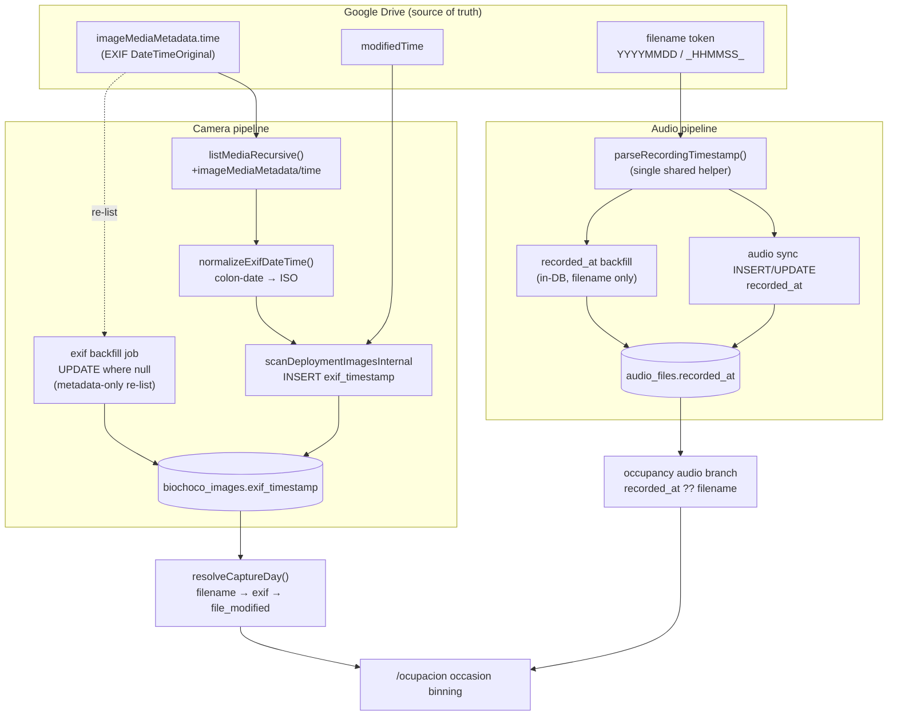

# feat: Authoritative capture-datetime for camera images (EXIF) and audio recordings

**Created:** 2026-07-10
**Type:** feat
**Depth:** Standard (leaning Deep — two streams, schema + backfill + pipeline)
**Related:** `docs/plans/2026-07-10-001-fix-occupancy-site-restriction-and-camera-detections-plan.md` (the fix that made `file_modified` the camera capture-day fallback), `docs/brainstorms/2026-07-03-occupancy-modeling-requirements.md`

---

## Summary

Today the camera-trap pipeline never extracts real EXIF capture time from still images — `biochoco_images.exif_timestamp` is written on exactly one narrow path (video-frame extraction, ~50 of ~133k rows). Everything else falls back to `file_modified` (Google Drive's `modifiedTime`), which the occupancy fix leans on as an empirical capture-day proxy. Audio recordings have **no** persisted capture-datetime at all: every read site re-parses the AudioMoth filename (`..._YYYYMMDD_HHMMSS`) on the fly.

This plan gives both streams a stored, authoritative capture time:

- **Camera:** capture the EXIF `DateTimeOriginal` that Google Drive already indexes as `imageMediaMetadata.time`, folded into the existing recursive media listing (no extra Drive calls), normalized to ISO and stored in `exif_timestamp`. A metadata-only backfill job populates existing rows. Because `resolveCaptureDay` already prefers `exif` over `file_modified`, occupancy and every existing `exif_timestamp` reader benefit with no read-path change.
- **Audio:** add a persisted `recorded_at` column to `audio_files`, populate it from the filename at sync time, backfill existing rows, and centralize the duplicated filename parsers into one helper. Occupancy's audio branch then prefers the column.

**Make-or-break unknown, verified first (U1):** whether these JPEGs actually carry EXIF `DateTimeOriginal` and whether Drive has indexed it. If coverage is high, this is the authoritative source we want. If it's near-zero (current dateless-filename cameras may strip EXIF), the feature still helps legacy `YYYYMMDD`-filename and EXIF-bearing images, and `file_modified` remains the documented fallback — but we must know before building the backfill, not after.

---

## Problem Frame

- **Camera capture time is not authoritative.** `file_modified` is Drive's modified time. The occupancy spike showed it tracks capture *day* for the sampled deployment, but it is a proxy: any Drive-side touch (re-upload, move, a future compression that rewrites the file) can shift it, and it carries no sub-day time. EXIF `DateTimeOriginal` is the camera's own record of when the shutter fired.
- **No still-image EXIF is ever read.** `sharp` is used only to *strip* metadata; no EXIF library is installed. So the authoritative signal is discarded at ingest today.
- **Audio capture time is never persisted.** It works (filename parsing yields date + time everywhere), but nothing is stored, the parser is duplicated in two files, and there is no single canonical column to join/sort/analyze on — the opposite of the camera side's new column, i.e. an inconsistency.

## Requirements

- **R1** — During Drive media listing, capture each image's EXIF capture time (`imageMediaMetadata.time`) without additional Drive API round-trips.
- **R2** — Normalize EXIF colon-date format (`YYYY:MM:DD HH:MM:SS`) to an ISO-8601 string before storing, so existing `Date.parse`-based readers (`parseCaptureDayFromExif`) work unchanged.
- **R3** — Persist EXIF capture time into `biochoco_images.exif_timestamp` for newly-scanned images (forward path).
- **R4** — Backfill `exif_timestamp` for existing images where it is null, via a metadata-only Drive re-list keyed on `drive_file_id`, as an instrumented background job (progress, ETA, logging, `recordEvent` on completion) per the project's processing-job UX convention.
- **R5** — Add a persisted `recorded_at` timestamp column to `audio_files`, populated from the filename at sync (insert + update), and backfill existing rows.
- **R6** — Occupancy's audio branch prefers `recorded_at` and falls back to filename parsing; the two duplicated filename parsers collapse to one shared helper.
- **R7** — No regression to occupancy day-binning: camera capture-day resolution order stays filename → exif → file_modified; audio stays filename-derived where the column is null.
- **R8 (verification gate)** — Before building the camera backfill (U4), measure real EXIF-time coverage on production Drive folders. The backfill and its rollout messaging must reflect actual coverage, never an assumed 100%.

---

## High-Level Technical Design

Capture-time now has one canonical stored column per stream, populated at ingest and backfilled, with occupancy reading through the existing resolution chain.

*Directional — the resolution chain and column names are authoritative; helper signatures are illustrative.*

---

## Key Technical Decisions

- **Reuse `exif_timestamp`, don't add a new camera column.** `imageMediaMetadata.time` *is* the EXIF `DateTimeOriginal`, so storing it in `exif_timestamp` is semantically honest, and `resolveCaptureDay` already ranks `exif` above `file_modified`. This means **zero occupancy read-path change** and every existing `exif_timestamp` reader (export, ordering, display) gains real data for free. A new typed `captured_at` column would force updating ~10 read sites for no functional gain. (Trade-off: `exif_timestamp` stays TEXT and now mixes video-frame computed times with still EXIF — both are legitimate capture times, acceptable.)
- **Drive `imageMediaMetadata.time` over local byte parsing** (your choice: *Drive metadata first*). Folding `imageMediaMetadata/time` into the existing `listMediaRecursive` `fields` costs no extra API calls on the forward path, and the backfill is a metadata-only re-list — no re-download of 133k images, no new EXIF dependency. Local re-download + parse is deferred (see Follow-Up).
- **Normalize on write, parse defensively on read.** Drive returns `"2013:07:08 12:34:56"`, which `Date.parse` rejects. Normalize to ISO at write time (R2), *and* teach `parseCaptureDayFromExif` to accept the colon format as belt-and-suspenders (U3), so a stray un-normalized value never silently drops a detection.
- **Audio `recorded_at` stored as naive local wall-clock, no timezone conversion** — mirrors the established iButton convention (parser stores Ecuador local time as-is; occupancy compares UTC calendar days). Build the `Date` via `Date.UTC(y, m, d, hh, mm, ss)` from the parsed parts so no host-timezone shift occurs.
- **Verification gate before backfill (R8).** The whole Drive-metadata approach assumes EXIF exists and is indexed. U1 measures it on real prod folders first; U4's design branches on the result rather than assuming coverage.

---

## Assumptions & Open Questions

- **EXIF coverage is unknown until U1.** Current field cameras use dateless filenames (`084348_0101.jpg`); it is unproven whether their JPEGs retain EXIF `DateTimeOriginal` or whether the camera/upload path strips it. U1 resolves this. If coverage is low, U4 still runs (it's cheap and idempotent) but rollout notes state honestly that `file_modified` remains primary for those images.
- **`imageMediaMetadata.time` is local camera time with no zone** — same convention as filenames; occupancy only needs the UTC calendar day, so this is consistent with existing behavior. Do not attempt tz correction.
- **`push-schema.mjs` applies additive column adds.** The audio column is a plain nullable `integer` (timestamp mode); confirm the custom push script performs `ALTER TABLE audio_files ADD COLUMN`, otherwise add an explicit one-line ALTER migration (no table recreation needed — no CHECK constraint involved).
- **Video rows are out of scope for the EXIF change.** Videos keep their existing computed frame-timestamp path (`camera-trap/actions.ts` frame extraction); do not disturb it.

---

## Implementation Units

### U1. Verify EXIF-time coverage on production Drive (spike/gate)

**Goal:** Measure how many real images carry `imageMediaMetadata.time` before building anything, so U2–U4 are grounded (R8).
**Dependencies:** none.
**Files:** none committed — a throwaway probe run against prod via `docker compose exec`, results recorded in this plan's rollout notes and the occupancy memory file.
**Approach:** For a handful of representative deployments (one legacy `YYYYMMDD`-filename, one current dateless-filename, one recent upload), call Drive `files.list` with `fields=files(id,name,imageMediaMetadata/time,modifiedTime)` and tally: has-EXIF-time vs null, and whether EXIF-time ≈ file_modified day. Use the existing Drive client / service-account auth inside the container (never a host script against a live DB — memory: host scripts corrupt SQLite).
**Patterns to follow:** ad-hoc prod inspection via `ssh digitalocean "cd /root/opt/fcat-portal && docker compose exec -T portal node -e '...'"` (as used in the occupancy diagnosis).
**Test scenarios:** none — investigation unit. Outcome is a coverage number and a go/adjust decision for U4's messaging.
**Verification:** A recorded coverage figure per camera cohort; decision noted on whether EXIF is primary or supplementary for each cohort.

### U2. Capture EXIF time in Drive media listing + normalizer

**Goal:** Surface `imageMediaMetadata.time` from the recursive listing and normalize it (R1, R2).
**Dependencies:** U1 (confirms the field is worth wiring).
**Files:**
- `src/lib/drive-client.ts` — add `imageMediaMetadata/time` to the `fields` string at the `files.list` call (currently line ~583); extend the `DriveImageFile` type (~line 444/453) with `exifTime?: string | null`; set it from `file.imageMediaMetadata?.time` when building `imageFiles` (~line 604).
- `src/lib/exif-datetime.ts` (new) — `normalizeExifDateTime(raw: string | null | undefined): string | null` converting `"YYYY:MM:DD HH:MM:SS"` (and passing through already-ISO input) to ISO-8601, returning null on unparseable input.
- `tests/unit/exif-datetime.test.ts` (new).
**Approach:** Keep the normalizer pure and dependency-free (regex on the two date halves). Do not change video listing. Preserve `supportsAllDrives`/`includeItemsFromAllDrives` (memory: Shared Drives return empty silently without them).
**Patterns to follow:** existing `DriveImageFile` construction and `do...while (pageToken)` pagination in `listMediaRecursive`.
**Test scenarios (U2 — exif-datetime):**
- Happy path: `"2013:07:08 12:34:56"` → `"2013-07-08T12:34:56"`.
- Already-ISO input `"2013-07-08T12:34:56"` passes through unchanged (or to an equivalent ISO string `Date.parse` accepts).
- Null / empty / `undefined` → null.
- Garbage (`"not a date"`, `"0000:00:00 00:00:00"`) → null.
- Colon-date with no time component (`"2013:07:08"`) → ISO date at midnight, or null — pick one and assert it; must round-trip through `parseCaptureDayFromExif` to the correct UTC day.
- `Test expectation:` for `drive-client.ts` the field/type wiring is covered indirectly by U3/existing sync tests; no isolated Drive-API unit test (network boundary).

### U3. Persist EXIF on image insert + harden the exif-day parser

**Goal:** Store normalized EXIF on the forward scan path and make the occupancy exif parser accept EXIF colon-date defensively (R3, R7).
**Dependencies:** U2.
**Files:**
- `src/lib/camera-trap-sync-internals.ts` — in the image insert map (lines ~64-71), add `exifTimestamp: normalizeExifDateTime(img.exifTime)`. Leaves `onConflictDoNothing` semantics intact (forward path only; existing rows handled by U4).
- `src/lib/occupancy/capture-date.ts` — extend `parseCaptureDayFromExif` to also accept `"YYYY:MM:DD ..."` by normalizing before `Date.parse` (reuse U2's normalizer or an inline colon→dash on the date half). Keep resolution order unchanged.
- `tests/unit/occupancy-core.test.ts` — extend exif parsing tests.
**Approach:** Purely additive on insert; no change to `file_modified` (write-once) or status flow.
**Patterns to follow:** existing insert-map shape in `scanDeploymentImagesInternal`; existing `parseCaptureDayFromExif` UTC-day reduction.
**Test scenarios:**
- Insert map includes `exif_timestamp` when `exifTime` present, null when absent (unit around the mapping, or an integration insert asserting the stored value).
- `parseCaptureDayFromExif("2013:07:08 12:34:56")` → UTC day `2013-07-08` (previously would have returned null).
- `parseCaptureDayFromExif("2013-07-08T12:34:56Z")` still → `2013-07-08`.
- Covers R7: `resolveCaptureDay` with a colon-date exif and a *different* file_modified returns the exif day (exif wins over file_modified).
- Null exif → falls through to file_modified unchanged.

### U4. Camera EXIF backfill background job

**Goal:** Populate `exif_timestamp` for existing images where null, via metadata-only Drive re-list (R4).
**Dependencies:** U2, U3, and U1's coverage finding (shapes user-facing messaging).
**Files:**
- `src/lib/exif-backfill-core.ts` (new) — headless, auth-agnostic core (pattern: `audio-compression-core.ts`). Per deployment: `listMediaRecursive` (metadata only), build a `driveFileId → normalizedExifTime` map, `UPDATE biochoco_images SET exif_timestamp = ? WHERE drive_file_id = ? AND exif_timestamp IS NULL`. Batched, transactional per batch. Emit progress (`processed / total`), status messages, and Docker logging with batch timing / ETA / RSS per the processing-job UX convention.
- `src/app/camera-trap/actions.ts` — a server action to enqueue/run the job with `requirePermission("camera-trap", ...)`; create a `biochoco_processing_jobs` row; on terminal transition call `buildJobCompletionEvent(job)` + `recordEvent`.
- `src/lib/system-events.ts` — add `image_exif_backfill` to `JOB_LABELS` (coverage-guard test requires it). It is **not** an ML job — do **not** add it to `CAMERA_TRAP_ML_JOB_TYPES` / `AUDIO_JOB_TYPES` (memory: camera-trap last-processed/results must stay filtered to `ml`/`ml_incremental`; this job must not appear as a "last processed" ML run).
- `tests/unit/exif-backfill-core.test.ts` (new).
**Approach:** Idempotent and resumable — the `WHERE exif_timestamp IS NULL` guard means re-runs only touch un-backfilled rows. Metadata-only, so no disk/egress pressure (unlike ML jobs); still respect Drive read rate-limits via the existing client retry/gate. Scope per deployment to keep listings bounded and progress meaningful. Consider single-flight so two backfills don't double-list the same deployment.
**Patterns to follow:** `audio-compression-core.ts` (headless core + script + action), `floating-job-progress.tsx` / `progress-tracker.tsx` (UX), `buildJobCompletionEvent` usage after the terminal DB update.
**Test scenarios:**
- Rows with null `exif_timestamp` and a matching Drive EXIF time get updated; rows already populated are left untouched (idempotency).
- Row whose Drive file has no EXIF time stays null (and is counted as "no EXIF", not an error).
- `drive_file_id` with no matching DB row is ignored (no crash) — mirror the null-FK / out-of-flow-record caution.
- Progress counters are monotonic and `processed` never exceeds `total`.
- Completion emits exactly one system event via `buildJobCompletionEvent`; a mid-run failure records a failed terminal state, not a silent stall.
- Batch update runs inside a transaction (sync callback — no async transaction; memory gotcha).

### U5. Add `audio_files.recorded_at` + populate at sync

**Goal:** Persist audio recording datetime at ingest (R5).
**Dependencies:** none (independent of camera units).
**Files:**
- `src/db/schema.ts` — add `recordedAt: integer("recorded_at", { mode: "timestamp" })` (nullable) to `audio_files`.
- `scripts/push-schema.mjs` — add the column to the `audio_files` CREATE TABLE; confirm additive ALTER is applied (see Assumptions) or add an explicit `ALTER TABLE audio_files ADD COLUMN recorded_at INTEGER`.
- `src/lib/audio-filename.ts` — add a helper returning a `Date | null` from `parseRecordingTimestamp` parts, built via `Date.UTC(...)` (no tz shift).
- `src/lib/audio-sync-internals.ts` — set `recordedAt` in both the insert (lines ~89-100) and update (lines ~76-86) branches from the filename helper. Keep `modifiedAt` (Drive time) as-is.
- `tests/unit/audio-filename.test.ts` — extend/create.
**Approach:** Populate on both branches so a re-sync heals nulls. Unparseable filenames (e.g. hex-epoch AudioMoth names, which the current regex does not handle) store null — acceptable; noted, not silently assumed to parse.
**Patterns to follow:** existing `parseRecordingTimestamp` regex; iButton local-time-as-is convention for the `Date.UTC` construction.
**Test scenarios:**
- `2MM21799_20260119_193500.wav` → `recorded_at` = 2026-01-19 19:35:00 UTC-constructed (no host-tz drift; assert the exact epoch).
- `.flac` variant of the same name (post-compression) parses identically (filename timestamp preserved through FLAC rollout).
- Unparseable name → `recorded_at` null, row still inserted.
- Update branch on an existing row with previously-null `recorded_at` heals it.
- `Test expectation:` schema/push-script change itself has no behavior test beyond the column existing; covered by U6 read tests.

### U6. Occupancy prefers `recorded_at`; unify audio parsers; backfill

**Goal:** Read the stored audio datetime, remove parser duplication, backfill existing rows (R5, R6, R7).
**Dependencies:** U5.
**Files:**
- `src/lib/occupancy/fetch.ts` — audio branch: SELECT `af.recorded_at` and use it (reduce to UTC day) with fallback to `parseCaptureDayFromFilename(r.filename)` when null. Preserve the `detectionsDroppedNoDate` counter for rows that resolve to neither.
- `src/app/audio/species/actions.ts` — replace the inlined duplicate parser (lines ~368-377) with an import from `src/lib/audio-filename.ts` (verify no `server-only` import chain is introduced — `audio-filename.ts` is a plain lib; memory: a bad re-export in a `"use server"` file breaks the Turbopack build, so import the function, don't re-export types through it).
- `src/app/audio/actions.ts` — optional: prefer `recorded_at` for `recordedDate`/`recordedTime`, falling back to filename parse.
- `scripts/backfill-audio-recorded-at.mjs` (new) — one-shot in-DB update: for each `audio_files` row with null `recorded_at`, parse the filename and set it. Pure DB + filename (no Drive), run via `docker compose exec portal node scripts/...` (memory: never a bare host script against the live DB). Use `Math.floor(ms/1000)` for the timestamp column (memory: Drizzle timestamp columns are Unix seconds in raw scripts).
- `tests/unit/occupancy-core.test.ts` / `occupancy-readiness.test.ts` — audio-branch preference test.
**Approach:** Column-first, filename-fallback keeps behavior identical where the column is null, so no occupancy regression during/after backfill.
**Patterns to follow:** the camera branch's `resolveCaptureDay` fallback shape; existing `detectionsDroppedNoDate` accounting in `fetch.ts`.
**Test scenarios:**
- Audio detection whose file has `recorded_at` set bins on the column's UTC day.
- Audio detection with null `recorded_at` but a parseable filename bins on the filename day (fallback path).
- Audio detection with neither → counted in `detectionsDroppedNoDate`, not silently dropped.
- Shared parser: `parseRecordingTimestamp` imported into `species/actions.ts` yields identical output to the former inline copy for a representative name (guards the de-dup).
- Backfill script: null rows get populated with the correct second-epoch value; already-set rows untouched (idempotent).

---

## Scope Boundaries

**In scope:** EXIF-time capture in Drive listing + normalizer; forward-path persistence into `exif_timestamp`; metadata-only camera backfill job; `audio_files.recorded_at` column, sync population, and backfill; occupancy audio branch preference; audio parser de-duplication; the pre-build EXIF-coverage verification.

**Non-goals:**
- Changing occupancy's day-granular binning, the site-pool restriction, or the survey-window union (owned by plan `...-001-fix-occupancy-...`).
- Video capture-timestamp handling (keeps its existing computed frame path).
- Timezone correction of any capture time (day-granular occupancy doesn't need it; iButton convention).

**Deferred to Follow-Up Work:**
- **Re-download + local EXIF parse** as a fallback for images Drive did not index (your deferred Q1 option). Only worth building if U1 shows meaningful EXIF-in-file-but-not-in-Drive coverage; would add an EXIF library (`exif-reader` over `sharp`'s raw buffer) and hook into `drive-downloader.ts` `generateThumbnails` where the full-res buffer is already in memory.
- Hex-epoch AudioMoth filename support in `parseRecordingTimestamp` (only if such names exist in prod — U5/U6 leave them null).
- A typed `captured_at` column + provenance/source enum, if a future need arises to distinguish EXIF vs file_modified vs filename provenance per row.

---

## Risks & Dependencies

- **EXIF may not exist in these JPEGs (highest risk).** Mitigated by U1's gate: if coverage is near-zero for current cameras, the camera half yields little beyond legacy images, and rollout notes say so plainly rather than implying a fix. The audio half (U5/U6) is unaffected and still lands value.
- **`push-schema.mjs` might not ALTER an existing table.** Mitigation: explicit one-line ALTER migration; verify on a copy before prod. Additive nullable column — low risk, no table recreation.
- **Drive rate limits during backfill.** Metadata-only listing is light, but 100+ deployments serially still hit the API; rely on the existing client retry/rate gate and per-deployment batching; run off-peak.
- **Silent Shared-Drive empties** if `supportsAllDrives`/`includeItemsFromAllDrives` are dropped when editing the `fields` string — keep them (memory).
- **Backfill correctness on out-of-flow rows** (manual uploads, null-FK detections): the `WHERE exif_timestamp IS NULL AND drive_file_id = ?` guard and ignore-unmatched-id behavior keep it safe.

## Verification (feature-level)

- After U2/U3 deploy, a fresh deployment scan writes non-null `exif_timestamp` for images Drive has EXIF for; `/ocupacion` camera occasion binning uses those days (exif over file_modified) with no code change.
- After U4, a backfilled deployment shows `exif_timestamp` populated for previously-null rows; the job appears in system events via `buildJobCompletionEvent` and does **not** appear as a camera-trap "last processed" ML run.
- After U5/U6, `audio_files.recorded_at` is populated at sync and by backfill; occupancy audio counts are unchanged versus filename-only (no regression), and the duplicated parser is gone.
- Full occupancy test suite green; lint clean.
