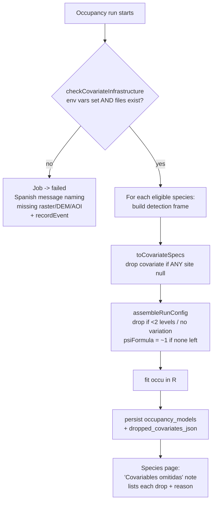
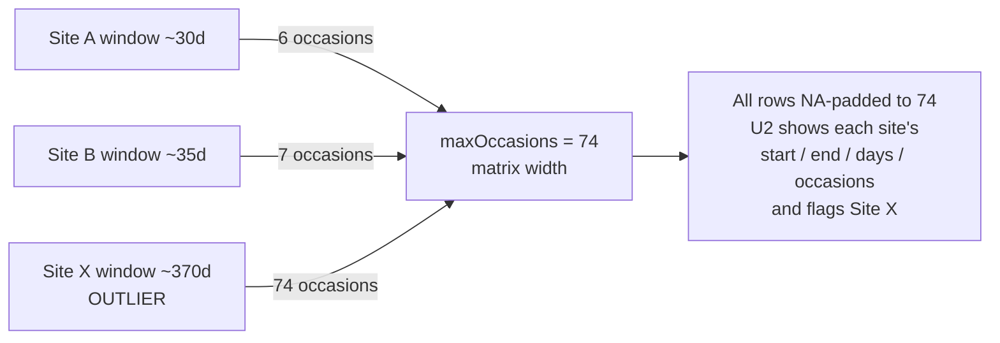

# fix: Occupancy covariate transparency, matrix diagnostics, and site links

## Summary

The `/ocupacion` module is silently producing intercept-only (`ψ~1`) "null" models on production and presenting them as real results. This plan makes the pipeline **fail loudly when its covariate infrastructure is missing**, **surfaces per-model covariate drops** instead of hiding them, replaces the misleading "12 of 52 sites" sample cap with **all sites plus per-site sampling-period diagnostics** (so the site driving the 74-occasion matrix is visible), links matrix site names to the **camera-trap verification grid**, removes the redundant **"Especies modeladas"** card, fixes **habitat resolution so every deployment gets a categorical habitat**, and ships the **forest/DEM/AOI rasters to production**.

This is a hardening + transparency pass on an existing feature — no new modeling capability. It touches the `/ocupacion` UI, the occupancy build pipeline (`src/lib/occupancy/**`), one schema column, and a production operational step.

---

## Problem Frame

On production, `https://portal.fcat-ecuador.org/ocupacion/Dasyprocta%20punctata?stream=camera` shows no habitat-use plot, no forest/elevation response curves, and no predicted-occurrence map. The species page still reads as a "successful" model. Investigation (three parallel code traces, 2026-07-13) found the module is behaving exactly as written, but the behavior is misleading:

1. **The raster pipeline is unconfigured on prod.** Forest cover and elevation are gated on `OCCUPANCY_FOREST_RASTER` (`src/lib/occupancy/build-run.ts:317`). The `.tif`/`.kml` files live under `data/occupancy-rasters/` (git-ignored) and the `OCCUPANCY_*` env vars exist only in dev `.env.local` — they are absent from `.env.example`, `docker-compose.yml`, and prod `.env`. So `loadRasterCovariates` returns `null`, both covariates are dropped for every species, and the ψ surface is suppressed.
2. **Covariate drops are computed then discarded.** `build-run.ts:220-228` takes only `.covariates` from `toCovariateSpecs` and never destructures the `dropped` field from `assembleRunConfig`. When all ψ covariates drop, the formula collapses to `~1` (`src/lib/occupancy/config.ts:124`) and the model is stored with `sufficient_data = 1` — indistinguishable from a real fit, with no drop reasons persisted or shown.
3. **Habitat drops whenever any site is unresolved.** Habitat is an all-or-nothing factor: `toCovariateSpecs` (`src/lib/occupancy/covariates.ts:125-131`) only includes it if **every** cohort site has an ODK habitat value; `assembleRunConfig` additionally needs ≥2 levels. Any single unresolved site drops habitat for that species. The user's expectation is that **all** deployments should have a categorical habitat — so unresolved sites are a bug (or a data-entry gap), not an acceptable state.
4. **"12 of 52 sites" is a display cap.** `getModelInputSample` slices the sample table to `maxSites = 12` (`src/app/ocupacion/actions.ts:699, 732`). The model fits all 52 cohort sites; the caption just under-shows them.
5. **"74 occasions" is ragged-max padding from one outlier window.** Occasions are re-indexed per-site from each site's own window, and matrix width = the max bin-count across sites (`src/lib/occupancy/detection-history.ts:88`). One deployment whose window spans ~370 days (a stray capture date or an ODK year-typo widening its window union, `src/lib/occupancy/fetch.ts:55-79`) forces every row to 74 NA-padded columns. There is no way today to see which site or why.

The outcome we want: a scientist or admin opening `/ocupacion` can trust that a fitted model used its intended covariates, or see exactly why it didn't; the sample matrix shows every site and its real sampling window; and production actually has the rasters it needs.

---

## Root-Cause Findings (reference)

Preserve these for the implementer — they are the "why" behind each unit, with citations.

| Symptom | Root cause | Location |
|---|---|---|
| No forest/elevation covariates, no ψ map | Raster infra unconfigured on prod → `loadRasterCovariates` returns `null` | `build-run.ts:314-334`; env only in `.env.local` |
| Null model stored as a real result | `dropped` reasons discarded; `ψ~1` persisted with `sufficient_data=1` | `build-run.ts:220-228`; `config.ts:124` |
| No habitat for agouti | Any unresolved site drops habitat (all-or-nothing), or <2 levels | `covariates.ts:125-131`; `config.ts:91-100`; `habitat-lookup.ts:22-79` |
| "12 of 52 sites" | Display cap `maxSites = 12` + `.slice(0, 12)` | `actions.ts:699, 724-732` |
| "74 occasions" | Ragged-max padding; matrix width = longest-window site's bin count (~370-day window ÷ 5) | `detection-history.ts:88`; `occasions.ts:45`; window union `fetch.ts:55-79` |
| No "season" gate | Pool = all verified deployments across time; `cohort.ts` only isolates dev-seed sites | `cohort.ts:28-36` |

Elevation is DEM-only (the ODK-geopoint-3rd-coordinate idea in the origin brainstorm was never implemented; `fetch.ts` selects only lat/lng). The "most-recent-complete-season" selection in the origin doc was also never built — noted in Scope Boundaries, not fixed here.

---

## Key Technical Decisions

- **KTD-1 — Hard-fail the run when raster/DEM infra is absent; surface per-model drops.** A `checkCovariateInfrastructure()` precondition runs at the start of an occupancy run. If `OCCUPANCY_FOREST_RASTER` / `OCCUPANCY_DEM_RASTER` / `OCCUPANCY_AOI_KML` are unset **or the files don't exist**, the job transitions to `failed` with a specific Spanish message (naming the missing pieces) rather than producing `ψ~1` models. Separately, every fitted model persists the covariates it dropped and why, shown on the species page. (User choice; matches origin's "excluded with explicit reason, never silent," `origin:129`.)
- **KTD-2 — Remove the sample cap; add per-site sampling-period diagnostics.** `getModelInputSample` returns **all** cohort sites (no `maxSites` slice) with each site's window start, end, total days, and occasion count. The matrix table shows these columns and visually flags outlier windows, so the site inflating the occasion width is immediately identifiable. We do **not** auto-clamp/exclude long windows in this pass — the user wants to *see* what's happening first. (User choice.)
- **KTD-3 — Site names link to the camera-trap verification grid.** For the camera stream, resolve each site's latest camera ML job (`CAMERA_TRAP_ML_JOB_TYPES`, `src/lib/job-locks.ts:77`) and link to `/camera-trap/results/[jobId]`, falling back to `/camera-trap/[deploymentId]` when no job exists. For the audio stream, link to `/audio/[deploymentId]`. The link target is stream-aware and resolved server-side in the action. (User choice.)
- **KTD-4 — Fix habitat resolution so every site gets a categorical habitat.** Build a per-site habitat-resolution diagnostic (which deployments resolve to a habitat, which fall through to `UNKNOWN_HABITAT_KEY`, and why — name-match miss vs. missing ODK `habitat_type`). Fix the name-matching path in `resolveHabitatForDeployment` where it's the cause; flag genuinely-missing ODK assessments for field data entry. (User choice — "all sites should have a categorical habitat; figure out why not.")
- **KTD-5 — Ship rasters to prod by direct file transfer + prod `.env`; document but don't build an upload UI.** scp the three artifacts to `/root/opt/fcat-portal/data/occupancy-rasters/` (bind-mounted to `/app/data`), add the `OCCUPANCY_*` vars to prod `.env`, restart. Add the same vars to `.env.example` for discoverability and a "rasters not configured" banner on `/ocupacion`. (User choice — keep the file-on-disk design; the user wants scp help + exact prod `.env` changes.)
- **KTD-6 — Persist drop reasons in a new nullable column, not by overloading `ineligible_reasons_json`.** Add `occupancy_models.dropped_covariates_json` (nullable TEXT) via `ALTER TABLE ADD COLUMN` (no table recreation needed — it's not a CHECK/enum change). `ineligible_reasons_json` stays reserved for genuinely-ineligible species; a reduced-but-fitted model is a distinct state.
- **KTD-7 — Keep the "Síntesis entre especies" cross-species link; remove only the "Especies modeladas" card.** The user asked to drop "Especies modeladas" specifically; the cross-species synthesis is a distinct feature and the two stream tables already link modeled species to their results (`src/app/ocupacion/readiness-table.tsx:156-162`). (Flagged as a minor call in Open Questions in case the user wants the synthesis link gone too.)

---

## High-Level Technical Design

The covariate-gating and hard-fail decision flow (unit U4), and where drops become visible:



Occasion-width inflation (the "74" — surfaced, not changed, in U2):



Both diagrams are directional — the prose and per-unit fields are authoritative.

---

## Implementation Units

### U1. Remove the "Especies modeladas" card

**Goal:** Drop the redundant modeled-species grid; reach species results through the two stream tables (which already link modeled species).

**Requirements:** User request ("get rid of the Especies modeladas section, keep the camera + audio tables to link to species results").

**Dependencies:** none.

**Files:**
- `src/app/ocupacion/page.tsx` — remove the `Card` block rendering "Especies modeladas" (currently lines ~153-180). Keep the "Síntesis entre especies" link (KTD-7) and both `StreamSection` tables.

**Approach:** The card and the cross-species link currently share one `modeledSpecies.length > 0` conditional. Keep the conditional and the cross-species `Link`; remove only the modeled-species `Card`. Verify no now-unused imports/vars remain (`listModeledSpecies` is still used to gate the cross-species link and to populate `modeledByStream`, so it stays).

**Patterns to follow:** existing card/section composition in `page.tsx`.

**Test scenarios:**
- Page with ≥1 modeled species renders the cross-species link and both stream tables, and does **not** render an "Especies modeladas" heading.
- Page with 0 modeled species renders neither the link nor the card (unchanged behavior).
- Modeled species still appear as green links in the stream tables.

**Verification:** `/ocupacion` shows the two tables + synthesis link; no "Especies modeladas" section; no layout gap where the card was.

---

### U2. Show all sites + per-site sampling-period diagnostics in the input matrix

**Goal:** Replace the "12 of 52" cap with every cohort site, and expose each site's sampling window so the outlier driving the 74-occasion width is visible.

**Requirements:** User request ("don't have a display cap — show all the sites … figure out what's going on with the long windows — information about the sampling period from start to finish"). Explains root-cause findings 4 & 5.

**Dependencies:** none.

**Files:**
- `src/app/ocupacion/actions.ts` — `getModelInputSample`: remove the `maxSites` default and the `.slice(0, maxSites)`; return all `frame.perSite` rows. Extend `DetectionSampleRow` with `windowStart` (ISO), `windowEnd` (ISO), `totalDays`, and `occasions` (already present). Keep the detected-first / most-surveyed ordering for readability.
- `src/app/ocupacion/detection-sample-table.tsx` — add columns for sampling period (start → end), days, and occasions; flag rows whose `totalDays` (or occasions) is a strong outlier (e.g. ≥ 3× the median across shown sites) with an amber marker + title. Update the caption (drop "12 de N"; it now shows all N).
- `src/lib/occupancy/detection-history.ts` — expose `windowStart`/`windowEnd`/`totalDays` on `SitePerRow` if not already surfaced (the layout has `start` + `totalDays`; `windowStart`/`windowEnd` exist on the site input at `detection-history.ts:31-32`).

**Approach:** The per-site window already exists (`computeOccasions(site.windowStart, site.windowEnd)`); this unit is plumbing those values through to the table plus an outlier heuristic. Do not change binning or fit logic — diagnostics only (KTD-2). Rendering all sites can make the matrix tall/wide; keep the existing `overflow-x-auto` and sticky first column, and confirm no horizontal page overflow (the table scrolls inside its own container).

**Patterns to follow:** existing sticky-column table in `detection-sample-table.tsx`; amber-flag styling used in `readiness-table.tsx`.

**Test scenarios:**
- A cohort of N sites returns N rows (not capped at 12); `nSites === rows.length`.
- A site with a ~370-day window is flagged as an outlier; a site with a ~30-day window is not.
- Each row reports start, end, total days, and occasion count consistent with `computeOccasions`.
- Caption no longer says "X de Y sitios" when all are shown.
- Empty cohort (no detections for the species) returns `null` as today.

**Verification:** On a species with a known long-window deployment, the matrix lists all sites and visibly flags the site whose window spans ~a year.

---

### U3. Link matrix site names to the verification grid

**Goal:** Make each site name in the input matrix a link to where its detections are reviewed/annotated.

**Requirements:** User request ("make the site names link to the camera trap annotate page"). KTD-3.

**Dependencies:** U2 (same table + action).

**Files:**
- `src/app/ocupacion/actions.ts` — in `getModelInputSample`, resolve a per-row `href`: for `stream === "camera"`, look up the site's latest job in `processingJobs` where `deploymentId = siteId` and `jobType IN CAMERA_TRAP_ML_JOB_TYPES`, ordered by `createdAt desc` → `/camera-trap/results/${jobId}`; fall back to `/camera-trap/${siteId}` when none. For `stream === "audio"` → `/audio/${siteId}`. Add `href` to `DetectionSampleRow`. Batch the job lookups (one query over all row deployment ids) to avoid N+1.
- `src/app/ocupacion/detection-sample-table.tsx` — render `siteName` as a `next/link` `Link` to `row.href` (new tab optional).

**Approach:** `siteId` is the deployment id (confirmed: `actions.ts:381-388` casts `site_id` to integer and joins `biochoco_deployments`). Resolve camera job ids in one grouped query keyed by deployment id. Import `CAMERA_TRAP_ML_JOB_TYPES` from `src/lib/job-locks.ts`.

**Patterns to follow:** camera-trap results URL shape `/camera-trap/results/[id]` (`src/app/camera-trap/results/[id]/page.tsx`); audio deployment route `/audio/[id]`.

**Test scenarios:**
- Camera site with a completed ML job links to `/camera-trap/results/<jobId>`.
- Camera site with no ML job falls back to `/camera-trap/<deploymentId>`.
- Audio site links to `/audio/<deploymentId>`.
- Job-id resolution runs as a single batched query for a multi-row sample (no per-row query).

**Verification:** Clicking a site name in the camera matrix opens that deployment's verification grid.

---

### U4. Hard-fail on missing raster infra + surface per-model covariate drops

**Goal:** Stop silently producing/serving `ψ~1` null models. Fail the run when the raster/DEM/AOI infrastructure is absent, and record + display which covariates each fitted model dropped and why.

**Requirements:** User request ("make the models fail if covariates aren't properly set up, with an informative message, rather than falling back to a null model"). KTD-1, KTD-6. Root-cause findings 1-3.

**Dependencies:** conceptually paired with U6 — ship rasters to prod before/with this so prod produces real models instead of only failing. (Failing loudly until rasters exist is the intended interim, but coordinate the deploy.)

**Files:**
- `src/lib/occupancy/build-run.ts` — add `checkCovariateInfrastructure()`: verify `OCCUPANCY_FOREST_RASTER`, `OCCUPANCY_DEM_RASTER`, `OCCUPANCY_AOI_KML` are set **and** the referenced files exist on disk (`fs.existsSync`). Call it at run start; on failure, throw a typed error carrying a Spanish message. Capture the `dropped` arrays from both `toCovariateSpecs(...).dropped` (currently discarded at line 220) and `assembleRunConfig(...).dropped` (currently not destructured at line 222), merge them, and pass to the model insert.
- `src/lib/occupancy/processor.ts` — translate the infra error into a terminal `failed` job transition with the Spanish message as `statusMessage`/error, and emit a system event via `buildJobCompletionEvent(job)` after the DB update (per CLAUDE.md instrumentation policy — terminal transition on `processing_jobs`).
- `src/db/schema.ts` — add `droppedCovariatesJson: text("dropped_covariates_json")` (nullable) to `occupancyModels`.
- `scripts/push-schema.mjs` — add `ALTER TABLE occupancy_models ADD COLUMN dropped_covariates_json TEXT` (idempotent guard: check pragma/table_info before adding).
- `src/app/ocupacion/actions.ts` — `getSpeciesModel` returns `droppedCovariates` (parsed) on `SpeciesModelDetail`.
- `src/app/ocupacion/[slug]/page.tsx` — render a "Covariables omitidas" note listing each dropped covariate + reason when present, so a reduced model is visibly reduced.

**Approach:** Two distinct behaviors: (1) **run-level** hard-fail when infra is missing (all-or-nothing setup problem → the whole run fails with a clear message); (2) **per-model** transparency for legitimate drops that occur even with infra present (e.g. a continuous covariate with no variation across a species' cohort). Keep habitat drops in the per-model list (U5 fixes the root cause; surfacing is the safety net). Do **not** hard-fail per-species on habitat — that would block widespread species over one unresolved site.

**Technical design (directional):**
```
checkCovariateInfrastructure():
  missing = []
  for (var, label) in [(FOREST,'cobertura boscosa'), (DEM,'DEM/elevación'), (AOI,'AOI (KML)')]:
    if !env[var] || !fs.existsSync(env[var]): missing.push(label)
  if missing: throw InfraError(`Los modelos de ocupación requieren ${missing.join(', ')}. ` +
      `Configure OCCUPANCY_FOREST_RASTER / OCCUPANCY_DEM_RASTER / OCCUPANCY_AOI_KML y coloque los archivos en data/occupancy-rasters/.`)
```

**Patterns to follow:** existing Spanish `ineligible_reasons_json` persistence (`build-run.ts:208-213`); `recordEvent`/`buildJobCompletionEvent` usage in other processors; `getFreeDiskBytes` fail-closed style for the file-existence check.

**Execution note:** Add a failing test for `checkCovariateInfrastructure` (env unset → throws; env set but file missing → throws; all present → passes) before wiring it into the run.

**Test scenarios:**
- Infra unset → `checkCovariateInfrastructure` throws; the job ends `failed` with the Spanish message; no `occupancy_models` rows written for that run.
- Infra env set but a file is missing → throws (fail-closed), same as unset.
- Infra present but a species' continuous covariate has no variation → model fits, `dropped_covariates_json` records `forest`/`elevation` with the Spanish reason; species page shows "Covariables omitidas".
- A model that dropped nothing has `dropped_covariates_json = null` and shows no note.
- `push-schema.mjs` run twice is idempotent (column added once, second run no-ops).
- Covers origin rigor caveat: reduced models are never presented as complete without explanation.

**Verification:** With rasters removed, an occupancy run fails with the Spanish message and no models are stored. With rasters present but a covariate legitimately dropped, the species page shows the omission note.

---

### U5. Ensure every deployment site resolves a categorical habitat

**Goal:** Diagnose why some sites have no ODK habitat and make habitat resolve for all deployments (fixing name-matching where that's the cause; flagging true ODK gaps for data entry).

**Requirements:** User statement ("all deployment sites should have a categorical habitat variable — figure out why that's not the case"). Root-cause finding 3.

**Dependencies:** none (independent investigation + fix); improves U4's habitat outcome.

**Files:**
- `src/lib/habitat-lookup.ts` — review `loadSiteHabitatMap()` (keys by `site_id`/`site_name`/`label`) and `resolveHabitatForDeployment()` (fallback `siteName → "SITE" from "SITE_V1" → UNKNOWN`). Harden the name-match (case/whitespace/site-code normalization) where deployments fail to join.
- `scripts/` — add a one-off diagnostic (e.g. `scripts/occupancy-habitat-audit.mjs`, run via `docker compose exec portal node …`) listing every occupancy-pool deployment, its resolved habitat or `UNKNOWN`, and the reason (no ODK entity matched vs. ODK entity has null `habitat_type`).
- (Data, not code) For deployments whose ODK `habitat_type` is genuinely empty, produce the list for the field team to complete in ODK.

**Approach:** This unit is investigate-then-fix; the fix path depends on the diagnostic. If failures are name-match misses, fix normalization in `resolveHabitatForDeployment`. If failures are missing ODK `habitat_type`, code cannot invent the value — output the actionable list and (optionally) allow an explicit `unknown`/`sin dato` level to be modeled rather than dropping habitat entirely (raise in Open Questions before choosing that, since it changes model semantics).

**Patterns to follow:** ODK field-fallback-chain convention (CLAUDE.md "ODK form field fallback chains"); `docker compose exec portal node scripts/…` runbook style.

**Execution note:** Characterize first — run the diagnostic against real prod data (via a backup or read-only query) before changing `resolveHabitatForDeployment`, so the fix targets the actual failure mode rather than a guessed one.

**Test scenarios:**
- Deployment `SITE_V1` with an ODK entity keyed `SITE` resolves to that entity's habitat.
- Deployment whose name differs only by case/whitespace still resolves (post-fix).
- Deployment with no matching ODK entity is reported as `UNKNOWN` with reason "sin entidad ODK".
- Deployment with a matching entity but null `habitat_type` is reported as `UNKNOWN` with reason "habitat_type vacío en ODK".
- The audit script lists every pool deployment exactly once.

**Verification:** After the fix, the habitat audit shows every deployment with a resolved habitat (or an explicit, listed ODK-data gap), and habitat stops dropping for widespread species in a real run.

---

### U6. Ship rasters to production + document configuration

**Goal:** Make forest cover, elevation, and the AOI available on prod, and make the configuration discoverable.

**Requirements:** User request ("help me scp the files and tell me the changes to make on the production .env file"). KTD-5. Root-cause finding 1.

**Dependencies:** pairs with U4 (deploy rasters so prod produces real models, not just fails).

**Files:**
- `.env.example` — add commented `OCCUPANCY_FOREST_RASTER=`, `OCCUPANCY_DEM_RASTER=`, `OCCUPANCY_AOI_KML=`, `OCCUPANCY_FOREST_CLASSES=1`, `OCCUPANCY_BUFFER_METERS=500` with a one-line note that the `.tif`/`.kml` files go under `data/occupancy-rasters/`.
- `src/app/ocupacion/page.tsx` (or a small server helper) — a "Capas ráster no configuradas" banner shown to admins when the infra check would fail, pointing to the runbook (ties to U4's `checkCovariateInfrastructure`).
- `docs/operations/` — a short runbook capturing the scp + prod `.env` steps below.

**Operational steps (execute, not code):**
1. From the dev machine, copy the three artifacts to the prod host's bind-mounted data dir:
   ```bash
   scp data/occupancy-rasters/forest_cover.tif \
       data/occupancy-rasters/copernicus_dem.tif \
       data/occupancy-rasters/aoi.kml \
       digitalocean:/root/opt/fcat-portal/data/occupancy-rasters/
   ```
   (Create the directory first if needed: `ssh digitalocean "mkdir -p /root/opt/fcat-portal/data/occupancy-rasters"`.)
2. Add to the prod `.env` (`/root/opt/fcat-portal/.env`, read via `docker-compose.yml` `env_file`):
   ```
   OCCUPANCY_FOREST_RASTER=data/occupancy-rasters/forest_cover.tif
   OCCUPANCY_DEM_RASTER=data/occupancy-rasters/copernicus_dem.tif
   OCCUPANCY_AOI_KML=data/occupancy-rasters/aoi.kml
   OCCUPANCY_FOREST_CLASSES=1
   OCCUPANCY_BUFFER_METERS=500
   ```
3. Restart: `ssh digitalocean "cd /root/opt/fcat-portal && docker compose restart portal"`.
4. Confirm the ML venv has `rasterio/pyproj/shapely/Pillow` (installed via the venv readiness gate; verify in the `ml-setup` boot log or `docker compose exec portal … python -c "import rasterio"`).
5. Trigger a run from `/ocupacion` (admin "Actualizar modelos") and confirm forest/elevation curves + ψ surface appear.

**Test scenarios:**
- `.env.example` documents all five `OCCUPANCY_*` vars.
- Banner appears for an admin when the infra check fails; hidden when rasters are configured.
- Test expectation: the scp/restart steps are operational (no unit test); post-deploy verification is the run in step 5.

**Verification:** After deploy, a fresh occupancy run on prod produces forest/elevation response curves and a predicted-occurrence surface for a widespread species.

---

## Scope Boundaries

**In scope:** the six units above — covariate transparency + hard-fail, matrix diagnostics (all sites + windows), verification-grid links, "Especies modeladas" removal, habitat-resolution fix, raster deploy + config docs.

### Deferred to Follow-Up Work
- **Outlier-window clamping/exclusion.** U2 *surfaces* long windows; automatically clamping or excluding a site whose window is implausibly long is a separate change to make once the user has seen the diagnostics and decided the policy.
- **"Most-recent-complete-season" selection.** The origin brainstorm specified modeling the most recent complete season per location (`origin:51, 91`); the pipeline currently pools all verified deployments across time (`cohort.ts`). Restoring season selection is a larger modeling change, out of this pass.
- **Elevation from ODK geopoint 3rd coordinate.** Origin suggested it as a DEM fallback (`origin:65`); not implemented and not needed once the DEM ships (U6).
- **Admin raster-upload UI.** Explicitly declined (KTD-5) in favor of scp + `.env`.

---

## Open Questions

- **Cross-species synthesis link (KTD-7):** keep the "Síntesis entre especies" link on `/ocupacion` (assumed yes), or did "get rid of the Especies modeladas section" mean removing that too? Default: keep it.
- **Unknown-habitat handling (U5):** if some deployments genuinely lack an ODK `habitat_type`, do we (a) block those from the habitat covariate and list them for data entry (default), or (b) model an explicit `sin dato` habitat level? Option (b) changes model semantics and should be an explicit choice.

---

## Risks & Dependencies

- **Hard-fail + not-yet-deployed rasters (U4 × U6):** shipping U4 before U6 makes prod occupancy runs fail until the rasters land. Intended, but coordinate: deploy rasters first (or same release) so users get working models, not just failures. The failure message must make the fix obvious.
- **Habitat root cause unknown until diagnosed (U5):** the fix branch (code normalization vs. ODK data entry) isn't known until the audit runs against real data — hence the characterize-first execution note. Don't pre-commit to a code fix.
- **Large-file transfer (U6):** `forest_cover.tif` is ~331 MB; scp over a slow link takes time. Verify checksums after transfer (`md5`/`sha256`) so a truncated copy doesn't silently fail raster reads.
- **Schema migration (U4/KTD-6):** `ALTER TABLE ADD COLUMN` is safe in SQLite, but run `scripts/push-schema.mjs` inside the container per the host-scripts-corrupt-SQLite gotcha; never against `data/portal.db` from the host while the container is up.
- **Rendering all sites (U2):** a large cohort makes the matrix long; confirm no page-level horizontal overflow and that the sticky first column + `overflow-x-auto` container still hold.

---

## Verification

- **Unit:** `checkCovariateInfrastructure` (unset/missing-file/present); dropped-covariate capture + persistence; `getModelInputSample` returns all sites with window fields; outlier-window flagging; stream-aware href resolution (batched); habitat name-match normalization.
- **Integration:** a run with rasters absent → job `failed` + system event + zero models; a run with rasters present but a species lacking covariate variation → model fitted with a populated `dropped_covariates_json`; species page renders the omission note.
- **Manual/prod:** deploy rasters (U6), trigger a run, confirm forest/elevation curves + ψ surface for agouti; open a camera species matrix, confirm all sites shown, the long-window site flagged, and site names link to the verification grid; confirm `/ocupacion` no longer shows "Especies modeladas".
- **Data:** run the habitat audit; confirm every pool deployment resolves a habitat or is listed as a specific ODK gap.
