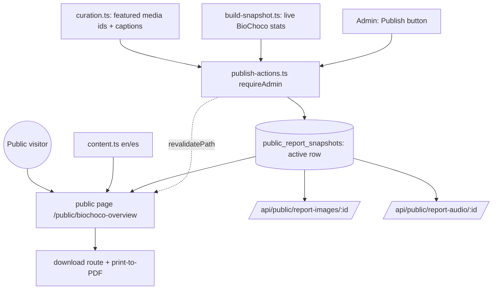

# feat: BioChoco Public Collaborator Overview Page

## Summary

Build a public, bilingual (EN/ES) BioChoco collaborator-recruiting page at
`/public/biochoco-overview`, rendered from a published snapshot so the public
route never touches production tables. An admin control pulls live stats, merges
them with committed bilingual copy and a curated media manifest, writes a
snapshot, and revalidates the page. Curated photos and audio are served through
tokenless public routes that reuse the existing sharp/EXIF-strip image pipeline,
allowlisted by the current snapshot. Visitors can download a self-contained HTML
or print to PDF. Reuses the standalone report's content and `extract.mjs` stat
logic (~90%); the external mini-repo's role as a host is retired.

## Problem Frame

The report today is a ~6 MB standalone HTML file rebuilt from a separate mini-repo
(`~/apps/biochoco-report/`) and hand-delivered as an attachment. It is stale on
send, can't carry audio well, and isn't a link collaborators can open or forward.
The portal already has the public-route infrastructure this needs — nginx serves
`/public/*` and `/api/public/*` without auth (`nginx/portal.fcat-ecuador.org:68`),
`src/proxy.ts` excludes both, `src/app/public/layout.tsx` provides the shell, and
token-gated public pages plus an EXIF-stripping public image route already prove
the pattern. Building in-portal turns a one-off file into a live, linkable page and
seeds the reusable public-page pattern the portal is heading toward
(see origin: `docs/brainstorms/2026-07-14-biochoco-public-report-requirements.md`).

## Key Technical Decisions

- **Published-snapshot data model (not ISR over a live query).** The admin publish
  action computes everything once and writes a single snapshot blob; the public
  page renders only that blob. The public route issues no queries against
  `biochoco_*` or other production tables, which is the strongest fit for the
  brainstorm's "keep the database off the public internet" decision. The snapshot
  also serves as the media allowlist — an asset is public only if its ID is in the
  current snapshot.
- **Snapshot stored as a DB row, single-active.** A `public_report_snapshots` row
  holds the serialized payload (stats + curated media IDs + captions + generated-at).
  Chosen over an on-disk JSON file for consistency with the portal's SQLite
  singleton and its backup/restore story. One current snapshot is read by slug.
- **Tokenless media routes reuse the token-route machinery.** New
  `/api/public/report-images/[id]` and `/api/public/report-audio/[id]` routes mirror
  `src/app/api/public/site-images/[token]/[id]/route.ts` (sharp resize, EXIF/GPS
  strip, thumbnail cache, `Content-Disposition`), but gate on "is this ID in the
  active snapshot's allowlist" instead of a share token.
- **Bilingual via page-local content objects, no i18n library.** Static recruiting
  copy lives as parallel `en`/`es` objects; numbers come from the snapshot
  (language-agnostic) with labels from the content objects. A client toggle swaps
  language. Matches the portal's hardcoded-strings convention.
- **Privacy at the data layer.** The extraction module emits site codes only
  (`name.split('_')[0]`), never landowner names, and omits precise coordinates;
  the image route strips GPS EXIF as a second line of defense.
- **Republish via `revalidatePath`.** The publish action calls
  `revalidatePath('/public/biochoco-overview')` after writing the snapshot, the
  idiomatic on-demand-cache pattern already used across the repo.

## High-Level Technical Design

The published snapshot is the single source of truth the public surface fans out
from. Nothing on the public side reads production tables; everything reads the
active snapshot (which also acts as the media allowlist).

## Requirements Traceability

- R1, R2 → U1 (content port), U2 (stats extraction, honest-number rules).
- R3, R11, R13 → U3 (tokenless public route under `/public/*`), verified against the
  internal `/biochoco` module.
- R4, R5 → U4 (bilingual content layer + toggle).
- R6, R7, R8 → U2 (curation manifest), U5 (tokenless media serving).
- R9, R10 → U6 (admin publish action + system-event instrumentation).
- R12 → U2 (site-code stripping) + U5 (EXIF/GPS strip).
- R14 → U7 (self-contained download / print).

---

## Implementation Units

### U1. Snapshot schema and stats extraction module

**Goal:** A server module that computes the BioChoco stat payload, and a DB table
to persist a published snapshot.
**Requirements:** R2, R12.
**Dependencies:** none.
**Files:**
- `src/db/schema.ts` (add `public_report_snapshots`)
- `scripts/push-schema.mjs` (CREATE TABLE for the new table)
- `src/app/public/biochoco-overview/lib/build-snapshot.ts` (new — stat computation)
- `src/app/public/biochoco-overview/lib/snapshot-types.ts` (new — payload types)
- `tests/unit/biochoco-overview-snapshot.test.ts` (new)

**Approach:** Port the query logic from `~/apps/biochoco-report/extract.mjs` into a
TypeScript module using the Drizzle `db` singleton: deployment counts (total +
retrieved-only where `date_end IS NOT NULL`), retrieved-sensor breakdown, real
camera species (verified/corrected effective label joined to `biochoco_species`,
keep `type != 'system' AND rank species/NULL`), detection totals, audio candidate
counts (confidence ≥ 0.8), iButton readings, upload totals. Scope to
`ct_projects.id = 1`, exclude soft-deleted. Emit site **codes** only. The snapshot
table stores `payload` (JSON text), `generated_at`, and `generated_by`.

**Patterns to follow:** existing biochoco stat queries in
`src/app/biochoco/resultados/actions.ts` and `src/app/biochoco/overview/actions.ts`;
timestamp column convention (`mode: "timestamp"`, seconds) in `src/db/schema.ts`.

**Test scenarios:**
- Real-species filter drops class/order/genus labels (`Aves`, `Rodentia`,
  `Leptotila sp.`) and system rows (`Unknown`, `Homo sapiens`); keeps species-rank.
- Retrieved count includes only deployments with non-null `date_end`.
- Site identifiers in the payload are codes (`CCN-001`), never landowner names.
- Deployment scope excludes `excluded = 1` and other projects.
- Snapshot payload round-trips through JSON serialize/parse without loss.

**Verification:** Running the module against a seeded DB produces a payload whose
counts match hand-computed expectations and contains no landowner names.

### U2. Curated media manifest

**Goal:** A committed, version-controlled manifest of the featured photos and audio
clips (by DB id) with per-item bilingual captions, resolved into the snapshot at
publish time.
**Requirements:** R6, R7, R8.
**Dependencies:** U1.
**Files:**
- `src/app/public/biochoco-overview/curation.ts` (new — image ids, audio ids, captions)
- `src/app/public/biochoco-overview/lib/build-snapshot.ts` (extend to resolve manifest)
- `tests/unit/biochoco-overview-curation.test.ts` (new)

**Approach:** Manifest is a typed array (shape mirrors `data/habitat-map.json`'s
curated ethos): `{ imageId, caption: {en, es}, speciesLabel }` and
`{ audioId, caption: {en, es}, speciesLabel }`. `build-snapshot` validates each
referenced id exists and belongs to BioChoco, then bakes the resolved list (plus
its id set) into the snapshot. Invalid/foreign ids are dropped with a logged
warning rather than failing the whole publish.

**Patterns to follow:** curated-config pattern from the report repo
(`data/habitat-map.json`); id-existence checks like the `inArray(...deploymentIds)`
guard in `src/app/api/public/site-images/[token]/[id]/route.ts`.

**Test scenarios:**
- A manifest image id that maps to a non-BioChoco deployment is excluded from the
  snapshot allowlist.
- A nonexistent id is dropped and warned, not fatal.
- Valid ids produce allowlist entries with both-language captions intact.

**Verification:** A snapshot built from a manifest contains exactly the valid
curated ids and their captions.

### U3. Bilingual content layer and language toggle

**Goal:** The static recruiting copy in EN and ES with a client-side toggle.
**Requirements:** R1, R4, R5.
**Dependencies:** none.
**Files:**
- `src/app/public/biochoco-overview/content.ts` (new — `{ en, es }` copy blocks)
- `src/app/public/biochoco-overview/language-toggle.tsx` (new — client component)
- `tests/unit/biochoco-overview-content.test.ts` (new)

**Approach:** Port narrative sections from
`~/apps/biochoco-report/template.html` into structured `content.en` / `content.es`
objects (headings, prose, stat labels, section captions). Claude drafts the Spanish;
FCAT reviews before publish. The toggle is a client component holding selected
language in state (default ES, the org's working language) and rendering the chosen
block; numbers are injected from the snapshot and are language-agnostic.

**Patterns to follow:** hardcoded-Spanish-strings convention across the app; client
component + `"use client"` state pattern in
`src/app/finance/expenses/expense-table.tsx`.

**Test scenarios:**
- `content.en` and `content.es` expose the same key set (no missing translations).
- Toggling language changes all labeled copy; injected numbers are unchanged.

**Verification:** Both language objects type-check against a shared content
interface; toggling in the rendered page swaps every string.

### U4. Public overview page

**Goal:** The server-component page at `/public/biochoco-overview` that reads the
active snapshot and renders the bilingual report, with shareable metadata.
**Requirements:** R1, R3, R11, R13.
**Dependencies:** U1, U2, U3.
**Files:**
- `src/app/public/biochoco-overview/page.tsx` (new)
- `src/app/public/biochoco-overview/report-shell.tsx` (new — client shell hosting the toggle + sections)
- `tests/e2e/biochoco-overview-public.spec.ts` (new)

**Approach:** Server component reads the active `public_report_snapshots` row and
passes payload + content to the client shell; renders nothing sensitive if no
snapshot exists yet (a friendly "coming soon" state). Add `generateMetadata` with
OpenGraph title/description/hero image for link previews. Curated photos reference
the U5 image route; audio references the U5 audio route. No `requirePermission` —
this is public by design.

**Patterns to follow:** public server-component + `generateMetadata` pattern in
`src/app/public/biochoco/[token]/page.tsx`; public shell layout
`src/app/public/layout.tsx`.

**Test scenarios:**
- Covers AE1. An unauthenticated request to `/public/biochoco-overview` renders the
  full page (200, no login).
- Covers AE1, R13. An unauthenticated request to `/biochoco` (internal module) is
  challenged for auth — the carve-out does not leak it.
- With no snapshot present, the page renders the coming-soon state, not an error or
  a stack trace.
- OpenGraph metadata includes the hero image URL and a description.

**Verification:** Visiting the URL logged-out shows the report; visiting `/biochoco`
logged-out is blocked.

### U5. Tokenless public media routes (image + audio)

**Goal:** Public routes that serve curated photos and audio, allowlisted by the
active snapshot, with GPS stripped.
**Requirements:** R6, R7, R8, R12.
**Dependencies:** U1.
**Files:**
- `src/app/api/public/report-images/[id]/route.ts` (new)
- `src/app/api/public/report-audio/[id]/route.ts` (new)
- `src/lib/public-report-allowlist.ts` (new — reads active snapshot's id sets)
- `tests/unit/biochoco-overview-media-routes.test.ts` (new)

**Approach:** Both routes load the active snapshot, check the requested id against
the snapshot's image/audio id set, and 404 on miss. Image route mirrors
`src/app/api/public/site-images/[token]/[id]/route.ts` (thumb via cached pipeline,
large via on-the-fly sharp resize, EXIF/GPS stripped, optional `download=1`).
Audio route streams the clip from its local/Drive source with a public
`Cache-Control`. No token; the snapshot allowlist is the gate.

**Patterns to follow:** `src/app/api/public/site-images/[token]/[id]/route.ts`
(sharp/thumbnail/EXIF handling); the audio stream route for source resolution and
range handling.

**Test scenarios:**
- An image id in the snapshot allowlist returns the image; an id not in it returns
  404 (the cross-content security gate).
- A `large` response contains no GPS EXIF.
- `download=1` sets `Content-Disposition: attachment`.
- An audio id in the allowlist streams; one outside it returns 404.
- After a republish that drops an id, that id's media 404s.

**Verification:** Only snapshot-listed media is reachable; served images carry no
GPS metadata.

### U6. Admin publish action and control

**Goal:** An admin-only action that regenerates and publishes the page in one step,
instrumented as a system event.
**Requirements:** R9, R10.
**Dependencies:** U1, U2, U3.
**Files:**
- `src/app/public/biochoco-overview/publish-actions.ts` (new — server action)
- `src/app/admin/.../publish-report-control.tsx` (new — admin button; final admin location TBD in-unit)
- `tests/integration/biochoco-overview-publish.test.ts` (new)

**Approach:** `requireAdmin()`, then build the snapshot (U1 stats + U2 manifest +
generated-at/by), upsert it as the active `public_report_snapshots` row,
`revalidatePath('/public/biochoco-overview')`, and `recordEvent({ source: "admin",
eventType: "public_report_published", summary, actorEmail, details })`. The control
is a button with the standard job/action UX (pending state, success/error toast).
Use sequential `await` writes (no async transaction — better-sqlite3 rule).

**Patterns to follow:** `requireAdmin()` in `src/lib/auth.ts`; `recordEvent` in
`src/lib/system-events.ts`; an existing admin action that mutates then
`revalidatePath` (e.g., `src/app/admin/shared-drives/actions.ts`).

**Test scenarios:**
- A non-admin caller is rejected before any write.
- A successful publish writes/updates exactly one active snapshot row and records
  one `public_report_published` event.
- The published snapshot reflects the current stats and curation at publish time.
- A failure mid-build does not leave a partial active snapshot replacing the prior
  good one.

**Verification:** Clicking the control as an admin updates the public page's data
without a code deploy and logs an activity event; non-admins can't invoke it.

### U7. Self-contained download and print-to-PDF

**Goal:** Let visitors take the report offline as a single file or PDF, in the
selected language.
**Requirements:** R14.
**Dependencies:** U4.
**Files:**
- `src/app/public/biochoco-overview/report-shell.tsx` (extend — print button + print CSS)
- `src/app/public/biochoco-overview/download/route.ts` (new — self-contained HTML export)
- `tests/e2e/biochoco-overview-download.spec.ts` (new)

**Approach:** Print-to-PDF is a client button invoking the browser print dialog with
print-optimized CSS (primary, zero infra). The export route renders the active
snapshot for the requested language with curated images inlined as base64 (small
curated set keeps size bounded) and returns a single HTML file via
`Content-Disposition: attachment`. Language selected via query param.

**Patterns to follow:** the "Save as PDF" print approach from the report template;
`Content-Disposition` usage in the existing public image route.

**Test scenarios:**
- Covers AE5. Downloading the Spanish self-contained HTML yields a file whose copy
  is Spanish and whose curated images render offline (no network calls).
- The print button triggers the print dialog; print CSS hides nav/toggle chrome.
- The export reflects the currently active snapshot, not stale content.

**Verification:** The downloaded HTML opens offline with correct language and
inlined media.

---

## Scope Boundaries

**In scope:** the public overview page, snapshot publish pipeline, curated bilingual
media, tokenless public media serving, admin publish control, self-contained
download.

**Deferred for later** (from origin): per-visit-fresh data, auto-generated media
galleries, portal-wide i18n, EDI dataset/DOI links, a "Público" sidebar entry.

**Outside this scope:** the token-gated `/public/biochoco/[token]/` landowner
galleries — a separate feature sharing only the URL prefix.

**Deferred to Follow-Up Work:** Umami analytics on the public page; a public landing
index (`/public`) / dashboard registry if the portal adds more public pages.

---

## Risks & Dependencies

- **Carve-out scoping (R13).** The nginx `/public/` block and `proxy.ts` exclusion
  already exist; the risk is a route accidentally reading auth context or the page
  querying internal tables. Mitigated by the snapshot model (no live queries) and
  the AE1 logged-out tests against both `/public/biochoco-overview` and `/biochoco`.
- **Snapshot/allowlist coupling.** Media reachability depends on the active
  snapshot; a botched publish could 404 all media. Mitigated by the atomic
  single-active-row upsert (U6) and the partial-failure test.
- **Schema migration.** Adding `public_report_snapshots` needs the CREATE TABLE in
  `scripts/push-schema.mjs` and a prod `push-schema` run per the project's
  add-a-table procedure.
- **Spanish review capacity.** Bilingual ship assumes an FCAT reviewer corrects the
  drafted ES copy before the first publish.
- **Audio source access.** The public audio route must resolve clips from the same
  local/Drive source the internal audio module uses; confirm curated clips are
  retrievable without auth-scoped context.

---

## Open Questions

**Deferred to implementation:**
- Final admin location for the publish control (a new admin sub-page vs. an existing
  admin surface) — resolve in U6.
- Whether the download export route and the mini-repo's `build.mjs` inlining logic
  should share a helper, or the route re-implements inlining server-side.
- Thumbnail vs. large default for curated photos on the page (weight vs. quality).

---

## Sources & Research

- Origin: `docs/brainstorms/2026-07-14-biochoco-public-report-requirements.md`.
- `~/apps/biochoco-report/` — `template.html` (copy), `extract.mjs` (stat logic),
  `curation`/`habitat-map.json` (curated-config ethos). Primary reuse source.
- `src/app/public/biochoco/[token]/page.tsx` — public server-component + OpenGraph.
- `src/app/api/public/site-images/[token]/[id]/route.ts` — sharp resize, EXIF/GPS
  strip, thumbnail cache, download disposition to mirror.
- `src/lib/system-events.ts` (`recordEvent`), `src/lib/auth.ts` (`requireAdmin`).
- `nginx/portal.fcat-ecuador.org:68`, `src/proxy.ts` — existing `/public/*` carve-out.
- Prior public-page brainstorms: `docs/brainstorms/2026-02-28-public-pages-brainstorm.md`,
  `docs/brainstorms/2026-03-09-public-dashboards-brainstorm.md`.
