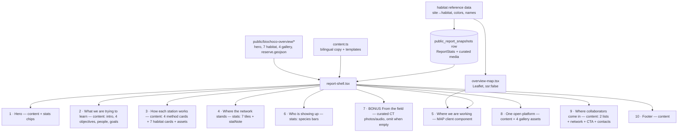

# feat: Faithfully recreate the Desktop BioChoco report as the public overview page

## Summary

The in-portal public page at `src/app/public/biochoco-overview/` was built (plan `2026-07-14-002`) but its copy was **rewritten and condensed**, and roughly half the original report's sections were dropped. The user's canonical artifact — `~/Desktop/BioChoco-Collaborator-Report.html` — is the source of truth for both **text** and **formatting**, and this plan rebuilds the page to match it faithfully.

The Desktop report is a static, self-contained HTML file: a `<style>` design system (parchment/forest, serif display), a hardcoded English body of 10 sections, and a `<script>` that renders habitat cards / stats / an interactive Leaflet map / species bars from an inlined `DATA` blob. The portal already ports the data layer (the snapshot builder computes ~90% of the needed numbers) and part of the CSS, but the **content model, the section structure, the map, the habitat cards, and the platform gallery are missing or wrong**.

This is a content-restore + structural-rebuild, plus three additions the Desktop needs to become a live portal page: an interactive Leaflet map component, static curated assets extracted from the Desktop file, and a small snapshot extension for map + habitat data.

**Locked scope decisions (user, this session):**
- **Map:** add Leaflet and faithfully port the Desktop's interactive habitat-colored map.
- **Language:** keep the page bilingual (EN/ES toggle); port the Desktop English verbatim, draft matching Spanish for review.
- **Camera-trap media:** keep the existing curated camera-trap photo/audio feature as a **bonus section placed directly below "Who is showing up"** (it is NOT in the Desktop original). Renders empty/omitted until the user supplies curated image/audio ids.

---

## Problem Frame

**What's wrong now.** Comparing `src/app/public/biochoco-overview/content.ts` + `report-shell.tsx` against the Desktop HTML:

- **Copy is rewritten, not ported.** Hero title is "A living record of one of the world's richest rainforests" vs. the Desktop's eyebrow "FCAT · Chocó, Ecuador" + h1 "BioChoco" + sub "An integrated biodiversity monitoring network…". Section headings differ throughout ("What we're trying to learn" vs "What we are trying to learn"; "How the monitoring works" vs "How each station works"; "What we're finding" vs "Who is showing up"). Method bodies, stat labels, and contact roles ("Research Lead" vs "Monitoring lead") are all reworded.
- **Whole sections are missing:** the 4 numbered objective cards (01–04), the "people" band (four FCATero/as · ~50 farmers · since 2003 · 50+ papers · Whitley Prize), the 3 goals, the method **model sub-labels + SVG icons**, the **7 habitat photo cards**, the **interactive map**, the **platform gallery** (4 browser-framed screenshots), and the two collaboration lists ("Data you can build on" / "Opportunities for collaboration") + the partner-network paragraph (Tulane · USFQ · Cornell Lab · Chocó Alliance).
- **Stats differ.** The Desktop stat band shows 7 tiles with specific labels/subs (deployments w/ sensor breakdown, camera-trap days w/ span, camera-trap photos, **identifications reviewed**, species on camera w/ mammal·bird split, audio recordings w/ TB, microclimate readings w/ logger count) plus a reconciling `statNote`. The current page shows a different 7.

**What faithful means here.** The Desktop file — its exact section order, headings, body copy, stat set, habitat descriptions, gallery captions, and visual design — is the specification. Where the portal must diverge, it diverges for only three reasons, each pre-approved: bilingual support (Desktop is EN-only), coordinate coarsening for privacy (already in the snapshot), and the appended camera-trap bonus section.

## Scope Boundaries

**In scope:** rebuilding `content.ts` (full bilingual copy model), rewriting `report-shell.tsx` (all sections + complete CSS port), a new Leaflet map client component, a small snapshot/type extension (identifications-reviewed count, per-deployment habitat/dates, habitat counts), static curated assets extracted from the Desktop file, static habitat + reserve reference data, the camera-trap bonus-section placement, and bringing the `/download` self-contained export in line with the new structure.

### Non-goals

- **No changes to the snapshot/publish model.** The published-snapshot architecture, `requireAdmin()` publish flow, `revalidatePath`, and the tokenless media routes (`/api/public/report-images`, `/api/public/report-audio`) stand as built. This plan reads from the snapshot; it does not restructure how snapshots are produced or stored beyond adding fields.
- **No re-curation of media.** The 7 habitat photos and 4 platform screenshots are extracted from the Desktop file, which already embeds the exact chosen images. We do not re-pull from ODK or re-screenshot.
- **No new admin UI.** Publishing still happens via the existing `/admin/biochoco-overview` control.

### Deferred to Follow-Up Work

- **Populating the camera-trap bonus section.** The user will supply curated image/audio ids later; until then the section is omitted when empty. Wiring those ids into `curation.ts` is a content task, not code.
- **Spanish review.** Drafted ES ships behind the toggle; FCAT reviews the wording post-merge (same gate as plan `002`).

---

## High-Level Technical Design

The page is one server component reading one snapshot, rendering ten sections whose content comes from four distinct sources. The rebuild's core is getting each section's **source** and **order** to match the Desktop.



*Directional guidance for reviewers — not implementation specification.* Sources: **content** = `content.ts`; **stats** = `snapshot.stats`; **MAP** = new client component fed by `snapshot.stats.deployments` + habitat data + `reserve.geojson`; **assets** = static files under `public/biochoco-overview/`.

### Section order (authoritative, from the Desktop file)

1. Hero · 2. What we are trying to learn · 3. How each station works (+ 7 habitat cards) · 4. Where the network stands today (stats) · 5. Where we are working (map) · 6. Who is showing up (species) · **7. [BONUS] From the field (camera-trap media)** · 8. One open platform (gallery) · 9. Where collaborators come in · 10. Footer.

The sticky **actions bar** (Data-as-of · Download · Save-as-PDF · language toggle) is a portal-only wrapper above the hero — intentionally not part of the Desktop's faithful content, retained for the live page.

---

## Output Structure

New and rewritten files (repo-relative):

```
src/app/public/biochoco-overview/
  content.ts                       # REWRITE — full bilingual copy model
  report-shell.tsx                 # REWRITE — 10 sections + complete CSS port
  overview-map.tsx                 # NEW — Leaflet client component (ssr:false)
  lib/
    habitat.ts                     # NEW — habitat metadata (name/color/desc EN+ES) + HAB_ORDER
    habitat-map.json               # NEW — site-code → habitat (ported from mini-repo)
    snapshot-types.ts              # EDIT — add fields
    build-snapshot.ts              # EDIT — add queries + habitat join
public/biochoco-overview/
  hero.jpg                         # NEW — extracted from Desktop
  habitat/{primary_forest,secondary_forest,cacao_nacional,cacao_giz,cacao_ccn,reforestation,pasture}.jpg
  gallery/{1,2,3,4}.png            # NEW — 4 platform screenshots, extracted
  reserve.geojson                  # NEW — ported from mini-repo
tests/unit/…                       # per-unit test files (see units)
```

The `Output Structure` is a scope declaration; per-unit `Files` lists are authoritative.

---

## Key Technical Decisions

- **Vanilla Leaflet in a client component, not react-leaflet.** The Desktop uses vanilla Leaflet 1.9 with a known-good init sequence, and `project_biochoco_collaborator_report` memory documents two gotchas (`setView(...)` must run before markers are added or the canvas renderer throws `Cannot read properties of undefined (reading 'min')`; `preferCanvas:true` makes the map render reliably). Porting the vanilla code into a `useEffect` preserves that proven sequence. The component is dynamically imported with `ssr:false` — Leaflet touches `window` at module load. Add `leaflet` (+ `@types/leaflet`) to `package.json`; import `leaflet/dist/leaflet.css` in the component.
- **Static curated assets, not snapshot media routes, for habitat photos + screenshots.** These are fixed editorial images, not live per-deployment data, and the Desktop already embeds the exact chosen ones. Extract them to `public/biochoco-overview/` and reference by path. This keeps the allowlisted media routes reserved for the genuinely dynamic camera-trap bonus content.
- **Static site→habitat map, not a live ODK query.** Habitat classification is not in the DB; it comes from ODK and is stable. Port the mini-repo's curated `data/habitat-map.json` into `lib/habitat-map.json` and join it at snapshot-build time. This keeps `build-snapshot.ts` self-contained (no new external dependency) and matches how the mini-repo already produces the report.
- **Coarsened coordinates stay.** The snapshot already coarsens lat/lng to 2 decimals (~1 km) for privacy; the map renders at reserve scale where this is invisible. We do **not** restore the Desktop's precise points. (Minor, pre-decided divergence.)
- **Content templates for dynamic strings.** The Desktop's `statNote`, `camCap`, `audCap`, `audNote`, span line, and "Data current {date}" chip interpolate snapshot numbers. Model these as functions/token-strings in `content.ts` (per-language) so both languages share one interpolation site in the shell.
- **`identificationsReviewed` is a new scalar stat.** The Desktop's "identifications reviewed" tile counts verified+corrected identifications. `build-snapshot.ts` already filters to those rows when aggregating species, but never emits the scalar total — add one `COUNT(*)` query.

---

## Implementation Units

### U1. Extract the Desktop's curated assets into `public/`

**Goal:** Land the exact hero image, 7 habitat photos, 4 platform screenshots, and the reserve boundary as static repo assets, so the rebuilt page references the same imagery the user already approved.

**Dependencies:** none.

**Files:**
- `public/biochoco-overview/hero.jpg` (create)
- `public/biochoco-overview/habitat/*.jpg` (create — 7 files, keyed by habitat)
- `public/biochoco-overview/gallery/{1,2,3,4}.png` (create)
- `public/biochoco-overview/reserve.geojson` (create — copied from `~/apps/biochoco-report/data/reserve.geojson`)
- scratchpad extraction script (one-time, not committed)

**Approach:** Write a one-time Node script in the scratchpad that parses `~/Desktop/BioChoco-Collaborator-Report.html`, walks the 15 embedded `data:` URIs, and maps them to files by their DOM context: the `.hero__img` background → `hero.jpg`; the `HAB_PHOTO` object's 7 entries → `habitat/<key>.jpg` (order matches `HAB_ORDER`); the 4 `.plat .shot img` sources → `gallery/1..4.png` (in DOM order, matching the captions in U4); the footer logo already exists as `public/logo-fcat.png` (skip). Decode base64 and write. Copy `reserve.geojson` from the sibling mini-repo verbatim. Verify each output opens and has plausible dimensions.

**Patterns to follow:** existing static assets live flat under `public/` (e.g. `landing-hero.jpg`); nest this report's assets under `public/biochoco-overview/` to keep them grouped.

**Test scenarios:** `Test expectation: none — static asset extraction; correctness is verified by U5/U6 rendering and a manual image-open check. The extraction script is throwaway and not committed.`

**Verification:** all 12 image files + `reserve.geojson` exist under `public/biochoco-overview/`, each image opens without corruption, and the 7 habitat filenames exactly match the `HAB_ORDER` keys.

---

### U2. Add static habitat + reserve reference data and habitat helpers

**Goal:** Provide the site→habitat mapping and the habitat metadata (bilingual names, colors, descriptions, canonical order) shared by the snapshot builder (server) and the map + habitat cards (client).

**Requirements:** feeds the habitat cards (§3), the map coloring + legend (§5), and `habitatCounts`.

**Dependencies:** none.

**Files:**
- `src/app/public/biochoco-overview/lib/habitat-map.json` (create — ported from `~/apps/biochoco-report/data/habitat-map.json`)
- `src/app/public/biochoco-overview/lib/habitat.ts` (create)
- `tests/unit/biochoco-overview-habitat.test.ts` (create)

**Approach:** `habitat.ts` exports `HAB_ORDER` (the 7-key ordering from the Desktop: `primary_forest, secondary_forest, cacao_nacional, cacao_giz, cacao_ccn, reforestation, pasture`), an `unknown` fallback, and a `HABITAT` record keyed by habitat: `{ color, name: Bilingual, description: Bilingual }`. Port colors verbatim from the Desktop `HAB` object (e.g. `primary_forest:#1b7a3d`, `pasture:#FDD835`) and descriptions from `HAB_DESC` (EN verbatim; draft ES). Export a `habitatForSite(code): HabitatKey` helper reading `habitat-map.json`. No server-only import — this module is shared with the client map and cards.

**Patterns to follow:** the `Bilingual` type in `lib/snapshot-types.ts`; the mini-repo's `HAB`/`HAB_DESC`/`HAB_ORDER` constants (Desktop lines ~1075–1099) are the exact source values.

**Test scenarios:**
- `HAB_ORDER` has all 7 keys in the Desktop's order; every key has a `HABITAT` entry.
- Each `HABITAT` entry has a non-empty `color`, `name.en`/`name.es`, `description.en`/`description.es`.
- Colors match the Desktop `HAB` hex values exactly (spot-check `primary_forest`, `cacao_ccn`, `pasture`).
- `habitatForSite("PRI-001")` → `primary_forest`; an unmapped code → `unknown`.

**Verification:** the module type-checks, tests pass, and every value traces to a Desktop constant (EN) or a documented ES draft.

---

### U3. Extend the snapshot for the faithful map and stat set

**Goal:** Emit the three data pieces the faithful page needs beyond today's snapshot: the identifications-reviewed count, per-deployment habitat + deployment dates (for map coloring + popups), and per-habitat site counts (for habitat cards + legend).

**Requirements:** feeds §3 (habitat card counts), §4 ("identifications reviewed" tile + `statNote`), §5 (map colors, popups, legend counts).

**Dependencies:** U2 (habitat mapping).

**Files:**
- `src/app/public/biochoco-overview/lib/snapshot-types.ts` (edit)
- `src/app/public/biochoco-overview/lib/build-snapshot.ts` (edit)
- `tests/unit/biochoco-overview-snapshot.test.ts` (edit — extend existing)

**Approach:**
- Add `identificationsReviewed: number` to `ReportStats`; compute with a scalar `COUNT(*)` over `biochoco_identifications` joined through detections/images/deployments, `verification_status IN ('verified','corrected')`, scoped to `PROJECT_ID` (mirror the existing `effRows` join, without the group-by).
- Add `habitatCounts: Record<string, number>` to `ReportStats`: distinct sites per habitat, computed by joining the existing distinct-site set to `habitatForSite`. (Sites, not deployments — the Desktop legend/card count is "N sites sampled".)
- Extend `DeploymentPoint` with `habitat: string`, `dateStart: string | null`, `dateEnd: string | null`. In the `deployments` query, also select `date_start`, `date_end`; derive `habitat` via `habitatForSite(siteCode(name))`. Keep coarsened coords.

**Patterns to follow:** existing `build-snapshot.ts` query style (`db.get`/`db.all` with `sql` template, `num()` coercion, `DEP_SCOPE`); `siteCode()`/`coarsenCoord()` from `snapshot-transforms.ts`.

**Test scenarios:**
- `computeStats` (against the integration in-memory DB / fixture) returns `identificationsReviewed` equal to the count of verified+corrected identification rows.
- `habitatCounts` sums to ≤ `distinctSites`, keys are valid habitat keys, and an all-primary fixture yields the expected primary count.
- Each `deployments[]` point carries a `habitat` (falling back to `unknown` for unmapped sites) and `dateStart`/`dateEnd` passthrough (null when the deployment is still in the field).
- Coordinates remain coarsened to 2 decimals (regression guard).

**Verification:** snapshot type-checks, existing snapshot tests still pass, and the new fields appear in a freshly built snapshot.

---

### U4. Rebuild the bilingual content model (`content.ts`)

**Goal:** Replace the condensed copy with the Desktop's full text — the "text" half of the user's complaint — as a bilingual model: English ported verbatim from the Desktop, Spanish drafted to match.

**Requirements:** supplies every fixed and templated string for §1–§10 except numbers.

**Dependencies:** none (can proceed in parallel with U1–U3).

**Files:**
- `src/app/public/biochoco-overview/content.ts` (rewrite)
- `tests/unit/biochoco-overview-content.test.ts` (edit — extend existing)

**Approach:** Reshape `ReportContent` to carry the full structure (English source strings in parentheses are the exact Desktop text to port verbatim):
- `hero`: `eyebrow` ("FCAT · Chocó, Ecuador"), `title` ("BioChoco"), `sub` ("An integrated biodiversity monitoring network across a forest-to-farm landscape in the Chocó of western Ecuador."), `metaSensors` ("Camera traps · passive acoustics · microclimate · habitat"), `liveDate` template ("Data current {date}").
- `learn`: `heading` ("What we are trying to learn"), `intro` (the "90% of its original forest is already gone… which methods recover the most biodiversity per dollar spent? BioChoco measures the answer." paragraph), `objectives` (4 × `{num,title,body}` — 01 Optimize restoration … 04 Guide reserve growth), `people` (the FCATero/as · ~50 farmers · since 2003 · 50+ papers · Whitley Prize paragraph), `goals` (3 × `{title,body}`).
- `methods`: `heading` ("How each station works"), `intro`, `cards` (4 × `{title, model, body}` — Motion-triggered camera / Passive acoustic recorder / Microclimate logger / Habitat structure, with model sub-labels "Trail camera · photo mode" etc.), `habitatHead` (`{title,body}` — "Seven habitat types along a land-use gradient" …). Habitat card names/descriptions come from `habitat.ts` (U2), not duplicated here.
- `stats`: `eyebrow` ("The first field season"), `heading` ("Where the network stands today"), `spanLine` template, 7 tile `{label, sub}` entries (sub may be a template — sensor breakdown, span, mammal·bird split, TB, logger count), `statNote` template (the reconciling deploymentCount/retrievedCount/in-field paragraph).
- `map`: `heading` ("Where we are working"), `note`, `legendTitle` ("Habitat").
- `species`: `heading` ("Who is showing up"), `intro`, `camCap` template ("{n} species identified so far. The most-detected wild species:"), `audCap` template ("Most-detected birds across {n} recordings:"), `audNote` template (the ≥0.8 BirdNET caveat), `onCamera`/`bySound` sub-titles.
- `bonus`: `heading`, `photosHeading`, `audioHeading` (for the camera-trap bonus section, U7).
- `platform`: `heading` ("One open platform for the whole network"), `intro` (the ViTALL/Camtrap DP/GBIF paragraph), `gallery` (4 × `{title, caption, addr}` — Results by site / Field schedule / Microclimate records / Custom species classifier, with the fake address bar text).
- `collaborate`: `heading` ("Where collaborators come in"), `intro`, `dataList` ("Data you can build on" — 4 × `{title,body}`), `oppList` ("Opportunities for collaboration" — 5 × `{title,body}`), `network` (the Tulane · USFQ · Cornell · Chocó Alliance paragraph), `ctaHeading` ("Let's build on this together"), `ctaBody`, `contacts` (roles: "Monitoring lead", "FCAT Reserve Director", "FCAT co-founder").
- `footer`, `ui` (download/print/toLanguage/publishedAt/comingSoon).

Port `en` verbatim from the Desktop; write `es` to the same key shape (draft, flagged for review). Keep `DEFAULT_LANG = "es"`.

**Patterns to follow:** existing `content.ts` parallel-`en`/`es`-object convention; `Bilingual` shape; portal Spanish-UI norm.

**Test scenarios:**
- `en` and `es` have identical key shapes (deep key-set equality), including nested lists of the same length (4 objectives, 3 goals, 4 method cards, 4 gallery items, 4 data-list items, 5 opp-list items, 3 contacts).
- `en.hero.title === "BioChoco"`, `en.learn.heading === "What we are trying to learn"`, `en.species.heading === "Who is showing up"`, `en.platform.heading === "One open platform for the whole network"` (verbatim-fidelity guards against re-drift).
- Template strings expose the expected tokens (e.g. `camCap` contains `{n}`, `liveDate` contains `{date}`).
- Contact roles match the Desktop ("Monitoring lead", "FCAT Reserve Director", "FCAT co-founder").

**Verification:** type-checks, tests pass, and a side-by-side read of `en` vs. the Desktop body shows matching copy section-for-section.

---

### U5. Add the Leaflet map client component

**Goal:** Faithfully port the Desktop's interactive map — satellite base layer, habitat-colored deployment points, dashed reserve boundary, per-site popups, habitat legend, auto-fit bounds.

**Requirements:** §5 "Where we are working".

**Dependencies:** U2 (habitat colors/names), U3 (deployment habitat/dates), U1 (`reserve.geojson`).

**Files:**
- `package.json` (edit — add `leaflet` + `@types/leaflet`)
- `src/app/public/biochoco-overview/overview-map.tsx` (create — client component)
- `tests/unit/biochoco-overview-map.test.tsx` (create)

**Approach:** A `"use client"` component taking `{ deployments, habitatCounts, legendTitle, lang }`. On mount (`useEffect`), initialize Leaflet **into a ref'd div**, following the Desktop sequence exactly to avoid the documented renderer crash: create the map with `preferCanvas:true` and call `.setView([0.38,-79.68], 11)` **before** adding any layers; add the ArcGIS `World_Imagery` satellite tile layer (+ an OSM alternative via `L.control.layers`); add the reserve boundary by fetching `/biochoco-overview/reserve.geojson` and styling it dashed green; add one `circleMarker` per deployment colored by `HABITAT[habitat].color`, bound to a popup showing site code · habitat name · deployment date range; `fitBounds` to the marker group with padding. Render the legend (habitat swatch + name + count) from `habitatCounts` filtered to `>0`, ordered by `HAB_ORDER`. Import `leaflet/dist/leaflet.css`. Clean up the map instance on unmount. The component is consumed via `next/dynamic` with `ssr:false` in the shell (U6) because Leaflet references `window` at import.

**Execution note:** verify the map renders in a real browser (headless Chrome at `localhost:3003`, per the local-dev-port memory) — jsdom cannot exercise Leaflet's canvas/tile rendering, so unit tests cover only the non-map scaffolding.

**Patterns to follow:** the Desktop `<script>` map block (lines ~1141–1161) is the reference implementation; the `project_biochoco_collaborator_report` memory's Leaflet gotchas (setView-before-markers, `preferCanvas`).

**Test scenarios:**
- Legend renders one row per habitat with `count > 0`, in `HAB_ORDER`, each showing the habitat's name and count (Leaflet mocked / map div stubbed).
- Given a deployment with a known habitat, the component computes the correct marker color from `HABITAT` (test the color-resolution helper directly).
- A deployment with `habitat: "unknown"` resolves to the `unknown` fallback color, not a crash.
- Component mounts and unmounts without throwing when Leaflet is mocked (guards the cleanup path).

**Verification:** unit tests pass; a headless-Chrome screenshot of `/public/biochoco-overview` shows the satellite map with colored points, dashed boundary, and a populated legend.

---

### U6. Rebuild `report-shell.tsx` to the full Desktop structure and complete the CSS port

**Goal:** The "formatting" half — render all ten sections in the Desktop's order with the Desktop's markup, and complete the scoped CSS port so every section is styled as in the original.

**Requirements:** §1–§6, §8–§10 (§7 bonus handled in U7); the complete design system.

**Dependencies:** U2, U3, U4, U5.

**Files:**
- `src/app/public/biochoco-overview/report-shell.tsx` (rewrite)
- `tests/unit/biochoco-overview-shell.test.tsx` (create)

**Approach:** Rebuild the component to the section order in the HTD. Bring the scoped `CSS` string up to the **full** Desktop stylesheet, namespaced under `.bc-root` (add the currently-missing classes: `.obj-grid/.obj/.people/.goals/.goal`, `.card .ic/.model`, `.hab-head/.hc .bar/.hc .ct`, `.map-section/#map/.map-shell/.legend`, `.plat/.gal/.shot/.browser/.bchrome/.bdots/.baddr`, `.opp-grid/.list`, and the fuller footer). Keep the full-bleed break-out and the print rules. Section render notes:
- **Hero:** background `url(/biochoco-overview/hero.jpg)`, eyebrow/title/sub from `content.hero`, chips: a "Data current {date}" live chip + the `metaSensors` chip (matching the Desktop, replacing the current stat-derived chips).
- **Learn:** intro + `obj-grid` (4 objective cards with `num`) + `people` band + `goals` (3).
- **Methods:** intro + 4 method `card`s each with the inline SVG icon (port the 4 Desktop `<svg class="ic">` paths), `model` sub-label, and body; then `hab-head` + a `hab-grid` of the 7 habitat cards — image `url(/biochoco-overview/habitat/<key>.jpg)`, colored `bar`, name + description (from `habitat.ts`), and "{n} sites sampled" from `habitatCounts`.
- **Stats band:** 7 tiles from `snapshot.stats` mapped to `content.stats` labels/subs (deployments+sensor sub, camera-trap days+span, camera-trap photos, identifications reviewed, species on camera + mammal·bird sub, audio recordings + TB sub, microclimate readings + logger sub) + interpolated `statNote`.
- **Map:** `next/dynamic(() => import('./overview-map'), { ssr:false })`, passed `deployments`/`habitatCounts`/`legendTitle`/`lang`.
- **Species:** two-column `bars` — camera (wild-filtered top species, sci italic) with `camCap`; audio (top species) with `audCap` + `audNote` callout. Reuse/keep the existing `Bars` and camera wild-filter logic.
- **Platform:** `plat` section, intro, `gal` of 4 browser-framed `shot`s (traffic-light dots + fake `baddr` + `/biochoco-overview/gallery/<n>.png` + caption) from `content.platform.gallery`.
- **Collaborate:** `opp-grid` two lists (data / opportunities), the network paragraph, the `cta` (heading + body + 3 contacts).
- **Footer:** `ft` with the FCAT line + "Data current as of {date}".
- Keep the sticky **actions bar** (download/print/toggle) above the hero.

**Patterns to follow:** the Desktop `<body>` markup + `<style>` block are the reference; keep the existing `.bc-root` scoping and full-bleed technique already in `report-shell.tsx`; keep `LanguageToggle` and the `fmt()` helper.

**Test scenarios:**
- All ten section landmarks render (query by heading text): hero title, and headings for learn/methods/stats/map/species/platform/collaborate + footer.
- Exactly 4 objective cards, 3 goals, 4 method cards, 7 habitat cards, 7 stat tiles, and 4 gallery figures render.
- Habitat cards show the `habitatCounts` value as "{n} sites sampled"; a zero-count habitat still renders its card (count 0), matching the Desktop.
- Stat tiles pull the right snapshot numbers (e.g. the identifications-reviewed tile shows `stats.identificationsReviewed`).
- Switching language swaps headings to the ES strings (toggle path).
- The map is rendered via a dynamic import boundary (assert the map mount point exists; the dynamic component is stubbed).

**Verification:** unit tests pass; a headless-Chrome screenshot of the seeded page matches the Desktop section-for-section (hero, objectives, people band, habitat cards, stat band, map, species bars, gallery, CTA).

---

### U7. Place the camera-trap media as a bonus section below "Who is showing up"

**Goal:** Reposition the existing curated camera-trap photo + audio feature as a clearly-additional section immediately after §6 Species, omitted entirely when no media is curated.

**Requirements:** the user's bonus-section decision (not in the Desktop).

**Dependencies:** U6.

**Files:**
- `src/app/public/biochoco-overview/report-shell.tsx` (edit — add the section in position)
- `tests/unit/biochoco-overview-shell.test.tsx` (edit — extend)

**Approach:** Between the Species section (§6) and the Platform section (§8), render a "From the field" bonus section that shows `snapshot.images` as habitat-style photo cards (served via `/api/public/report-images/<id>?size=large`) and `snapshot.audio` as labeled `<audio>` players (`/api/public/report-audio/<id>`), using `content.bonus` headings. **When both arrays are empty, render nothing** — no "coming soon" placeholder (the faithful layout has no empty state here). Styling reuses `hab-grid`/`hc` (photos) and the existing `audio-list` CSS.

**Patterns to follow:** the media-render block already in the current `report-shell.tsx` (the `snapshot.images`/`snapshot.audio` map) — move and restyle it, don't reinvent; the tokenless media routes are unchanged.

**Test scenarios:**
- With curated images present, the bonus section renders after the species section and before the platform section, one card per image, `src` pointing at the image route.
- With curated audio present, one `<audio>` element per clip with the audio-route `src`.
- With both arrays empty, the bonus section is absent from the DOM (no heading, no placeholder).
- Bilingual: the bonus headings switch with the language toggle.

**Verification:** with an empty curation the page shows no bonus section; seeding a fixture snapshot with one image id renders exactly one bonus card in the correct position.

---

### U8. Bring the self-contained download export in line with the new structure

**Goal:** Keep the `/download` export faithful to the rebuilt page — same sections, same copy, same imagery inlined — so the downloadable HTML matches what visitors see.

**Requirements:** AE — a published overview downloads as a single self-contained HTML file whose copy + images render offline (map degrades, as it does in the Desktop, which needs network for tiles).

**Dependencies:** U4, U6 (content + structure), U1 (assets to inline).

**Files:**
- `src/app/public/biochoco-overview/download/route.ts` (edit)
- `tests/e2e/biochoco-overview-download.spec.ts` (edit — extend existing)

**Approach:** Update the export to emit the new section structure + `content.ts` copy for the requested `?lang=`, inlining the static assets (hero, 7 habitat photos, 4 gallery screenshots) as base64 data URIs so the file is self-contained. The interactive map degrades in the offline file the same way the Desktop's does (tiles need network); include the map container + reserve boundary best-effort, or a static note in its place — do not block the export on the map. Keep the `Content-Disposition: attachment` + `text/html` headers and the "no remote ``" guarantee.

**Patterns to follow:** the existing `download/route.ts` inlining approach; the current e2e spec's 404-when-unpublished tolerance.

**Test scenarios:**
- When a snapshot is published, the response is `text/html` + `attachment`, and contains no remote `` (all images inlined) — extend the existing assertion.
- The downloaded body contains the new faithful headline strings (e.g. "Who is showing up", "One open platform for the whole network") for the requested language.
- `?lang=es` yields the Spanish copy; unpublished still 404s.

**Verification:** downloading a seeded snapshot yields a single HTML file that opens offline with the full copy and all images, matching the live page's text.

---

## Risks & Dependencies

- **External tile hosts on the public route.** The map fetches ArcGIS/OSM tiles from the browser. Verify the `/public/*` route (nginx carve-out + any Next headers/CSP) does not block third-party tile hosts; if a CSP is later added, it must allowlist the tile domains. Low risk today (no CSP configured), but confirm during U5 verification.
- **Leaflet + SSR.** Leaflet touches `window` at import — the component **must** be loaded with `ssr:false`. A direct import in a server-rendered path will break the build/runtime. Covered by U5/U6 approach; the shell test asserts the dynamic boundary.
- **Asset extraction fidelity.** U1 maps 15 base64 URIs to files by DOM position; a mis-map would swap a habitat photo. Mitigation: verify the 7 habitat images visually against the Desktop's habitat cards during U6 screenshot review.
- **Snapshot must be re-published after deploy.** New stat fields (`identificationsReviewed`, `habitatCounts`, per-deployment habitat/dates) only appear after `computeStats` runs again — the page reads a stored blob. Existing snapshots lack them; the shell must tolerate missing fields (default to 0/empty) OR the go-live checklist must re-publish. Prefer defensive defaults in U6 plus a re-publish step.
- **Reused go-live gates from plan `002`** still apply: `push-schema` on prod (no schema change here beyond types — the `public_report_snapshots` table already exists), and an admin re-publish to populate the new fields.

## Verification Strategy

Per-unit unit/integration tests (Vitest) as enumerated, plus a whole-page visual check: seed a real snapshot into the local dev DB (container-side, per the host-scripts-corrupt-SQLite memory — run via `docker compose exec portal …`, never a bare host script), then screenshot `/public/biochoco-overview` at `localhost:3003` with headless Chrome and compare section-for-section against `~/Desktop/BioChoco-Collaborator-Report.html`. `npm run test:run`, `npm run lint`, and `tsc` must be clean before completion.

## Deferred to Implementation

- Exact inline SVG paths for the 4 method-card icons (copy verbatim from the Desktop `<svg class="ic">` elements during U6).
- Whether the download route inlines a degraded map container or a static substitute (decide in U8 once the live map is working).
- Final Spanish wording (drafted in U4, reviewed by FCAT post-merge).
