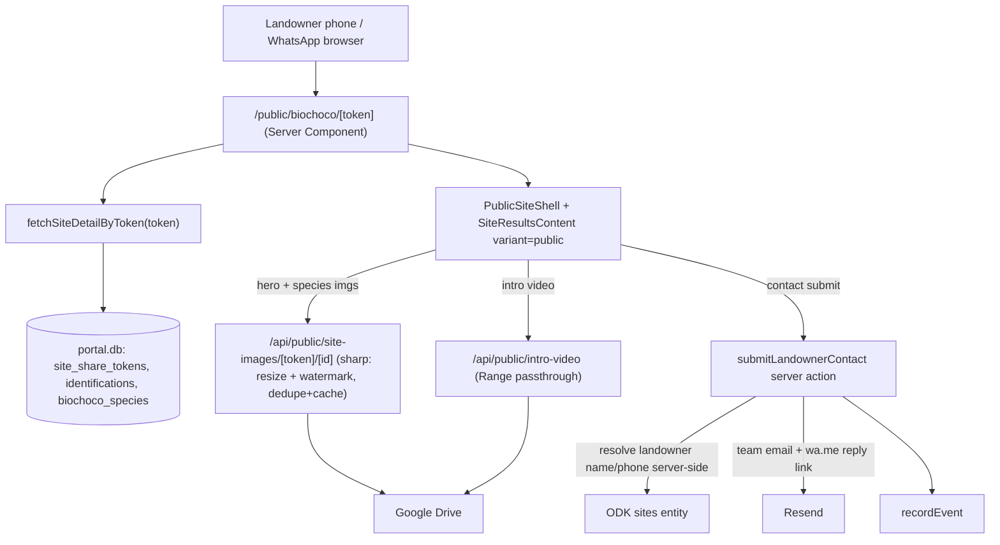
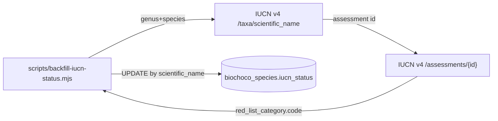

# feat: Landowner Biodiversity Dashboard — Phase 1 (Quick Wins)

## Summary

Extend the live, token-gated landowner results page (`/public/biochoco/{token}`) with the vision doc's Phase 1 "quick wins": a story-first content pass (hero photo + human-scale counts), per-photo WhatsApp sharing with a watermark on the shareable image tier, an embedded fixed intro/thank-you video streamed from Google Drive, a landowner contact form that emails the team, and IUCN conservation badges backfilled by a one-shot script. It also closes a privacy leak found during research (landowner name/phone are currently serialized to the public client).

## Problem Frame

A private, mobile-first, WhatsApp-shareable landowner page already exists and is live (`origin`), but it reads as science (stat bars, species tables) rather than emotional payoff, only the *page* is shareable (not individual photos), and there is no way for a landowner to reply. This plan is the low-architecture first pass that makes the page feel like *"this is the wildlife on your land"* and makes its content travel — without the Phase 2 `sites` table, page builder, or engagement tracking, and without the Phase 3 montage.

---

## Scope Boundaries

### In scope (Phase 1)

- Content redesign: hero promotion + human-scale Spanish counts.
- Per-photo/per-clip WhatsApp + Web Share sharing.
- Watermark baked into the shareable (large) image tier.
- Embedded fixed intro/thank-you video (Drive-streamed, placeholder until footage lands).
- IUCN conservation-status backfill (one-shot script) + honest rarity badges.
- Landowner contact form → team email with click-to-WhatsApp reply.
- Privacy fix: keep landowner identity server-side only.

### Deferred to Follow-Up Work

- **"¿Sabía que…?" natural-history facts** and **featured dawn-chorus audio clip** (Feature 1 remainder) — need curated content storage; carry to Phase 2 with the builder.
- **"Postcard" composite** (photo + species + logo via sharp) — heavier than the other quick wins; ship per-photo share + watermark first.
- **Token-scoped `site-videos/[token]/[id]` route** — belongs with the Phase 3 montage, where a per-deployment security gate is meaningful. Phase 1's video is a single global asset (see KTD-1).
- **IUCN nightly cron** — explicitly out; the backfill is script-only by decision.
- **Change-over-time across visits**, conservation-status *source automation* beyond the one-shot script.

### Outside this product's identity (from origin)

- No confidence scores, acoustic indices, taxonomic ranks, GPS, or maps on the landowner surface.
- `sites` table, page builder, engagement tracking, montage — Phase 2/3.

---

## Requirements

### Content & sharing

- R1. The page leads with a full-bleed hero photo (the promoted `heroImageId`) and one warm Spanish caption.
- R2. Counts render human-scale ("23 especies de animales"), replacing the science-y stat bar.
- R3. Each species photo (cards and per-species gallery) has a share action: Web Share API where available, `wa.me` fallback otherwise, carrying the watermarked image URL and a Spanish caption.
- R4. The shareable (large) image tier carries a subtle FCAT/BioChoco watermark so forwarded photos keep attribution.

### Video

- R5. A fixed intro/thank-you video embeds after the hero, streamed from Drive with working seek (HTTP Range). When no video is configured, the block is absent — never a broken player.

### Conservation status

- R6. Species with an honest IUCN category show a conservation/rarity badge; species without a status show no badge.
- R7. IUCN status is populated by a one-shot, rate-limited backfill script (no cron), keyed by `scientific_name`.

### Contact

- R8. The page offers a short contact form (message + optional "prefiero que me llamen"); submission emails the BioChoco team via Resend, tagged with the site, including a click-to-WhatsApp reply link built from the landowner phone.
- R9. The contact form is abuse-hardened: honeypot + per-token/IP rate limit + message-length cap. No captcha (per origin — protects conversion for a low-tech audience).
- R11. Contact-form submissions emit `recordEvent` (`source: "biochoco-resultados"`).

### Privacy

- R10. Landowner identity (name/phone) is resolved only server-side and is never serialized into the public client payload.

---

## Key Technical Decisions

- KTD-1. **Fixed video served by a global public route, not the token-scoped route.** Phase 1's video is one asset shared by every site (Gregory intro/thank-you), so `src/app/api/public/intro-video/route.ts` streams an env-configured Drive file with Range passthrough — no per-site token gate, matching how the public OG image is already served. The token-scoped `site-videos/[token]/[id]` route is deferred to Phase 3, where per-site montages need the per-deployment security gate. This diverges from the initial "token-scoped route" framing because research showed the Phase 1 video is global, not per-deployment.
- KTD-2. **IUCN backfill is a one-shot script; `iucn_status` is a bare `TEXT` column.** ~35 species and a rate-limited, non-commercial API make an admin-run script the right tool over a cron. Store the category code (`LC`/`NT`/`VU`/`EN`/`CR`/`DD`) as bare `TEXT` (no `CHECK`) to avoid a SQLite table-recreation migration; validation lives in the script, not the schema.
- KTD-3. **Watermark added inside the existing `resizeLarge` pipeline, guarded by dedupe + cache.** A `sharp.composite()` step joins the large-tier pipeline in the site-images route. Because that route is unauthenticated and CPU-heavy, wrap generation in an inflight-promise dedupe and disk cache (mirroring the audio-cache fix) so concurrent identical requests coalesce and results are reused — never watermark per request.
- KTD-4. **No captcha on the contact form.** Honeypot (`website` field → silent fake-success) + `rateLimitAllow` keyed by `contact:${token}:${ip}` + a message-length cap. Turnstile is explicitly excluded per the origin's conversion principle.
- KTD-5. **Landowner PII stays server-side.** The public loader stops including `landownerName`/`landownerPhone` in the client payload; the contact-form server action re-resolves them from the token when composing the team email. Closes the current leak (R10) and satisfies Feature 5's reply-link need without exposing identity.
- KTD-6. **Share reuses the existing image URL.** Web Share API (`navigator.share`) hands the native sheet a link (and, where supported, the fetched image file) to the already-watermarked `?size=large&download=1` URL; desktop falls back to `wa.me/?text=`. No new server surface for sharing.

---

## High-Level Technical Design

Public request surface (all under `/public/**` or `/api/public/**`, which the auth proxy and ingress already exempt):

IUCN status is populated out-of-band, not on the request path:

---

## Implementation Units

### U1. Add `iucn_status` column + IUCN Red List backfill script

**Goal:** Give `biochoco_species` a conservation-status field and populate it once from the IUCN v4 API.
**Requirements:** R7
**Dependencies:** none
**Files:**
- `src/db/schema.ts` — add `iucnStatus: text("iucn_status")` (nullable) to `biochocoSpecies` (near `src/db/schema.ts:566`).
- `scripts/push-schema.mjs` — add `ALTER TABLE biochoco_species ADD COLUMN iucn_status TEXT` to the `migrations[]` array (idempotent via the existing duplicate-column catch).
- `scripts/backfill-iucn-status.mjs` — new one-shot script.
- `.env.example`, `docker-compose.yml` — add `IUCN_API_TOKEN` (pattern `- IUCN_API_TOKEN=${IUCN_API_TOKEN:-}`).

**Approach:** Bare `TEXT`, no `CHECK` (KTD-2) — avoids a table rebuild. The script selects all `biochoco_species`, splits `scientific_name` into genus/species, calls `GET /api/v4/taxa/scientific_name?genus_name=&species_name=` with `Authorization: Bearer $IUCN_API_TOKEN`, takes the latest assessment, calls `GET /api/v4/assessments/{id}`, reads `red_list_category.code`, and `UPDATE biochoco_species SET iucn_status = ? WHERE scientific_name = ?`. Throttle (~1 req/sec) between species; log per-species result and a summary. Species with no match or an error are left `NULL` and reported.

**Patterns to follow:** `scripts/push-schema.mjs` `migrations[]` (`src/db/schema.ts:872-873` show `spanish_name`/`taxonomic_rank` added the same way). Raw-script conventions from `docs/solutions/`: synchronous DB calls (no `async` transaction callback), and if the script writes any `mode:"timestamp"` column, use `Math.floor(Date.now()/1000)`; use `?? null` for optional fields in `sql` templates. Run via `docker compose exec portal node scripts/backfill-iucn-status.mjs` (never bare host node against `data/portal.db`).

**Test scenarios:**
- Backfill maps a known threatened species (e.g. a *Tremarctos ornatus*-style row) to its category code and writes it.
- A species whose name returns no IUCN taxon is left `NULL` and counted in the summary, not crashed on.
- An assessment lookup HTTP error for one species does not abort the run; remaining species still process.
- Re-running the script is idempotent (overwrites with the same value; no duplicate rows).
- `push-schema.mjs` run twice does not error on the already-added column.
**Verification:** After running against a copy of prod data, `biochoco_species` has non-null `iucn_status` for species with published assessments; the run logs a per-species + summary report.

### U2. Conservation/rarity badges on species

**Goal:** Show an honest rarity badge on species that carry an IUCN category.
**Requirements:** R6
**Dependencies:** U1
**Files:**
- `src/app/biochoco/resultados/types.ts` — add `iucnStatus: string | null` to `SiteSpecies` (`src/app/biochoco/resultados/types.ts:30`).
- `src/app/biochoco/resultados/actions.ts` — include `biochoco_species.iucn_status` in the species LEFT-join select (`fetchSpeciesForDeployments`, ~`actions.ts:363`).
- `src/app/biochoco/resultados/[siteId]/site-results-content.tsx` — render a badge on the species card when `iucnStatus` is a threatened category and `variant === "public"`.
- `src/components/conservation-badge.tsx` — new small presentational component (label + color per category, Spanish text e.g. "En peligro").

**Approach:** Map category codes to warm Spanish labels; only render for honest signal (VU/EN/CR; optionally NT). LC/DD/`NULL` render nothing. Keep it a badge, not a stat — no code shown to the landowner.
**Patterns to follow:** existing `variant === "public"` switches in `site-results-content.tsx`; badge styling consistent with existing chips.
**Test scenarios:**
- A species with `iucnStatus: "EN"` renders the "En peligro" badge with the danger color.
- A species with `iucnStatus: "LC"` or `null` renders no badge.
- The badge appears only under `variant="public"` (or wherever product wants it) and never shows the raw code.
**Verification:** On a token page for a site with a threatened species, the badge appears; unlisted species show none.

### U3. Keep landowner identity server-side only

**Goal:** Stop serializing `landownerName`/`landownerPhone` into the public client payload (R10).
**Requirements:** R10
**Dependencies:** none
**Files:**
- `src/app/biochoco/resultados/actions.ts` — in `fetchSiteDetailByToken` (`actions.ts:854`), strip landowner fields from the `site` object returned to the public page (or return a public-safe `SiteInfo` projection).
- `src/app/biochoco/overview/types.ts` — if needed, a `PublicSiteInfo` type without landowner fields, or document that the public loader omits them.

**Approach:** The internal `SiteInfo` (`src/app/biochoco/overview/types.ts:3`) keeps the fields; the *public* loader omits them from what crosses to `PublicSiteShell`. The contact-form action (U8) re-resolves them server-side from the token, so no capability is lost.
**Execution note:** Start with a failing test asserting the public payload has no landowner fields, then make it pass.
**Patterns to follow:** the existing token→`SiteInfo` resolution in `fetchSiteDetailByToken` (`actions.ts:909-911`).
**Test scenarios:**
- The object returned by `fetchSiteDetailByToken` has no `landownerName`/`landownerPhone` keys.
- The internal (authenticated) site detail path still exposes them for staff views.
- Server-side resolution of landowner name/phone from a token still works (shared helper used by U8).
**Verification:** Inspecting the serialized props for `/public/biochoco/[token]` shows no landowner identity fields.

### U4. Content redesign — hero promotion + human-scale counts

**Goal:** Lead with a full-bleed hero photo and a warm line; replace the stat bar with human-scale counts (R1, R2).
**Requirements:** R1, R2
**Dependencies:** none (U3 recommended first to avoid re-touching the shell)
**Files:**
- `src/app/public/(chrome)/biochoco/[token]/public-site-shell.tsx` — promote `heroImageId` to a full-bleed hero with a Spanish caption ("Esto vive en su finca"); replace `CompactStatBar` with human-scale count text.
- `src/app/biochoco/resultados/[siteId]/site-header-stats.ts` — a public count formatter ("23 especies de animales") if not derivable inline.

**Approach:** Hero uses the existing `resolveImageUrl(heroImageId, "large")` (now watermarked via U6). Counts come from `data.species.length` and camera-trap days, phrased warmly in Spanish. No confidence/indices/GPS.
**Patterns to follow:** existing `resolveImageUrl`/`speciesHref` builders in the shell; `variant="public"` body from `site-results-content.tsx`.
**Test scenarios:**
- Hero renders the promoted `heroImageId` at large size with the caption.
- When `heroImageId` is null, the hero falls back to the best available species photo (no empty block).
- Count text reads "N especies de animales" in Spanish, not a stat chip.
- No layout regression: hero + counts + species body stack cleanly on a narrow (phone) viewport.
**Verification:** The token page opens to a hero photo and a warm count line on mobile width, with no leftover stat bar.

### U5. Per-photo WhatsApp + Web Share sharing

**Goal:** Give every species photo its own share action (R3).
**Requirements:** R3
**Dependencies:** U6 (shared image should be watermarked)
**Files:**
- `src/app/biochoco/resultados/[siteId]/site-results-content.tsx` — add a share button to species cards under `variant="public"`.
- `src/app/public/(chrome)/biochoco/[token]/especies/[slug]/gallery-client.tsx` — add a share button per gallery image.
- `src/components/photo-share-button.tsx` — new client component: try `navigator.share`, fall back to `wa.me/?text=`.

**Approach:** Build the absolute image URL from the existing `?size=large&download=1` route (watermarked). Caption pattern from the vision: `🐆 {spanishName} — Monitoreo de biodiversidad FCAT en {siteId}`. Where `navigator.canShare({files})` is available, fetch the image and share the file; otherwise share the URL; desktop → `wa.me/?text=` link.
**Patterns to follow:** the existing generic `wa.me/?text=` builder in `site-share-button.tsx:112`; existing `PhotoDownloadButton` component for placement/styling.
**Test scenarios:**
- On a browser with `navigator.share`, tapping share invokes the native sheet with the caption + URL.
- On a browser without Web Share, the button opens a `wa.me/?text=` link with the encoded caption + image URL.
- The shared URL points at the watermarked large tier (`?size=large`), not the raw original.
- Caption includes the species Spanish name and site id, URL-encoded correctly.
**Verification:** Sharing a species photo from a phone opens WhatsApp with the caption and a working image link.

### U6. Watermark the shareable image tier

**Goal:** Bake a subtle FCAT/BioChoco watermark into the large image tier so forwarded photos keep attribution (R4).
**Requirements:** R4
**Dependencies:** none
**Files:**
- `src/app/api/public/site-images/[token]/[id]/route.ts` — add a `sharp.composite()` step in `resizeLarge` (~`route.ts:60`); wrap generation in an inflight-promise dedupe + disk cache.
- `src/lib/watermark.ts` — new helper returning the watermark overlay buffer (cached logo/text as an SVG or PNG rendered once).
- `public/biochoco-overview/` or an asset dir — the watermark source asset (reuse existing FCAT mark if present).

**Approach:** Composite a semi-transparent mark (bottom-right, gravity `southeast`) after `.resize()`. EXIF/GPS is already stripped by the existing pipeline (`.rotate()` + no `.withMetadata()`) — preserve that. Guard the CPU cost: dedupe concurrent identical `(imageId,size,watermark-version)` requests with a `Map<string, Promise<Buffer>>`, and disk-cache the watermarked output (keyed by source + params) so repeat requests are served from cache. Keep `Cache-Control: public, max-age=31536000, immutable`.
**Patterns to follow:** the audio-cache dedupe/cache fix (`docs/solutions/runtime-errors/spectrogram-process-explosion-AudioCache-20260226.md`); the existing thumbnail disk-cache pattern (`getOrGenerateThumbnail`).
**Test scenarios:**
- A large-tier request returns a JPEG with the watermark composited bottom-right.
- Output still has no EXIF/GPS metadata.
- Two concurrent identical large requests generate the watermark once (dedupe), both get the same bytes.
- A second request for the same image is served from disk cache (no re-composite).
- The security gate still holds: an image id whose deployment is not in the token's `deploymentIds` 404s (unchanged).
- Path params containing `/`, `\`, or `..` are rejected.
**Verification:** Fetching `?size=large` returns a watermarked, metadata-stripped JPEG; repeated/concurrent fetches don't spike CPU.

### U7. Fixed intro/thank-you video — Drive streaming route + embed

**Goal:** Stream a single configured intro video from Drive and embed it after the hero, with a graceful empty state (R5, KTD-1).
**Requirements:** R5
**Dependencies:** none
**Files:**
- `src/app/api/public/intro-video/route.ts` — new global public route; `export const dynamic = "force-dynamic"`; streams the env-configured Drive file with Range passthrough.
- `src/app/public/(chrome)/biochoco/[token]/public-site-shell.tsx` — embed an `<video>` (poster, `preload="none"`, baked-in subtitles) after the hero; render nothing when no video is configured.
- `.env.example`, `docker-compose.yml` — add `LANDOWNER_INTRO_VIDEO_DRIVE_FILE_ID` (empty = placeholder / hidden).

**Approach:** Route reads `LANDOWNER_INTRO_VIDEO_DRIVE_FILE_ID`; if unset, 404. Else `downloadFileAsStream(fileId, request.headers.get("range") ?? undefined)` and mirror the `report-audio` response shape exactly (`Accept-Ranges: bytes`, propagate `Content-Length`/`Content-Range`, status `206` when a range is satisfied else `200`, long immutable cache). No token gate — it's a global public asset (KTD-1). The shell hides the whole block when the env var is empty, so the placeholder state is "no video," never a broken player.
**Patterns to follow:** `src/app/api/public/report-audio/[id]/route.ts` (streaming + 206 shape); `downloadFileAsStream` in `src/lib/drive-client.ts:768` (already sets `supportsAllDrives: true`).
**Test scenarios:**
- With the env var set, a `Range: bytes=0-` request returns `206` with `Content-Range` and `Accept-Ranges: bytes`.
- A no-Range request returns `200` with `Content-Length`.
- With the env var unset, the route 404s and the page renders no video block (no broken `<video>`).
- Seeking in an HTML5 player works (server honors byte ranges end-to-end).
- A Drive 404 for a misconfigured file id surfaces as 404, other Drive errors as 502.
**Verification:** With a placeholder MP4's Drive id set, the video plays and seeks on a phone; unset, the page shows no video slot.

### U8. Landowner contact form → team email

**Goal:** Let a landowner leave a message that emails the BioChoco team with a click-to-WhatsApp reply (R8, R9, R11).
**Requirements:** R8, R9, R11
**Dependencies:** U3 (server-side landowner resolution helper)
**Files:**
- `src/app/public/(chrome)/biochoco/[token]/contact-form.tsx` — new client component: message textarea, "prefiero que me llamen" checkbox, hidden `website` honeypot, submit state.
- `src/app/public/(chrome)/biochoco/[token]/actions.ts` — new public server action `submitLandownerContact` (validate token, honeypot, rate limit, length cap, send email, `recordEvent`).
- `src/lib/landowner/contact-email.ts` — Resend compose/send helper (team recipients + wa.me reply link).

**Approach:** Server action validates the token (`isValidShareToken` + non-revoked lookup), returns silent fake-success if the honeypot is filled, enforces `rateLimitAllow(\`contact:${token}:${ip}\`, ...)` and a message-length cap. It resolves the site's landowner name/phone server-side (U3 helper), composes a bilingual-safe HTML+text email via Resend, and sends to BioChoco team recipients (`user_permissions` where `project_id="biochoco"` and role in editor/admin). The email body includes the message, the "prefiere llamada" flag, the site id, and a `https://wa.me/{landownerPhone}` reply link. Then `recordEvent({ source: "biochoco-resultados", eventType: "landowner_contact_submitted", projectId: "biochoco", actorEmail: null, targetType: "biochoco_site", targetId: siteId, details: {...} })`. Return an `ActionResult`.
**Patterns to follow:** Resend compose/send + `escapeHtml` + committee-recipient lookup in `src/lib/research-applications/emails.ts`; honeypot + IP extraction in `src/app/public/(chrome)/apply/actions.ts`; `rateLimitAllow` in `src/lib/simple-rate-limit.ts`; `recordEvent` call shape in `src/app/biochoco/resultados/actions.ts:732`. No Turnstile (KTD-4).
**Test scenarios:**
- A valid submission sends one email to the resolved team recipients and returns success.
- The email contains the message, the site id, the "prefiere llamada" flag, and a `wa.me/{phone}` link built from the landowner phone.
- A filled honeypot (`website`) returns fake-success and sends no email.
- Exceeding the per-token/IP rate limit is rejected; the next window succeeds.
- A message over the length cap is rejected with a Spanish error.
- An invalid or revoked token is rejected before any email send.
- `recordEvent` fires once per accepted submission with `source: "biochoco-resultados"` and `actorEmail: null`.
- Missing `RESEND_API_KEY` fails cleanly (logged), not a silent success.
**Verification:** Submitting the form on a token page delivers a team email with a working WhatsApp reply link; abuse paths (honeypot, rate limit, oversize) are blocked.

---

## System-Wide Impact

- **New unauthenticated surface.** Three public entry points are added (intro-video route, watermark path already public, contact action). All live under `/api/public/**` or `/public/**`, which the Next proxy (`src/proxy.ts`) and the ingress oauth2-proxy already exempt (proven by the live `site-images` route). Confirm the ingress skip-list covers `/api/public/intro-video` during rollout — same prefix, so expected to pass, but verify.
- **CPU/memory posture.** The watermark path makes the large image tier heavier; the dedupe+cache guard (U6) is load-bearing, not optional, given public traffic.
- **Privacy boundary.** U3 tightens what crosses to the client; the contact reply link deliberately keeps landowner phone server-side.
- **Native modules.** `sharp` (like `better-sqlite3`) is native — verify it resolves in the Docker/standalone build, not just local dev.

---

## Risks & Dependencies

- **Content dependency (video):** the actual Gregory footage lands out-of-band. U7 ships against a placeholder Drive file id; an empty env var is the expected v1 state, not a bug.
- **IUCN token + terms:** requires a fresh v4 token (v3 accounts don't migrate); use is non-commercial/education-research — fine for FCAT as a conservation nonprofit. Rate-limited, so the backfill throttles.
- **IUCN name matching:** `scientific_name` may not match IUCN's accepted name (synonyms); unmatched species stay `NULL` and are reported for manual follow-up.
- **Turnstile intentionally absent** (KTD-4): honeypot + rate limit are the only bot defenses; acceptable for this low-value, low-traffic public surface.

---

## Sources & Research

- Origin vision/roadmap: `docs/plans/2026-07-14-feat-landowner-biodiversity-dashboard-vision-plan.md` (on branch `origin/claude/farmer-biodiversity-dashboard-kajcf2`).
- Drive Range streaming: `src/lib/drive-client.ts:768` (`downloadFileAsStream`), `src/app/api/public/report-audio/[id]/route.ts` (206 shape).
- Sharp large-tier pipeline + security gate: `src/app/api/public/site-images/[token]/[id]/route.ts`.
- Token model/lifecycle: `src/db/schema.ts:1399` (`site_share_tokens`), `src/app/biochoco/resultados/actions.ts` (`fetchSiteDetailByToken:854`, `createSiteShareLink:689`), `src/app/biochoco/resultados/[siteId]/site-share-button.tsx:112`.
- Species join: `fetchSpeciesForDeployments` (`src/app/biochoco/resultados/actions.ts:363`), `biochoco_species` (`src/db/schema.ts:566`).
- Email: `src/lib/research-applications/emails.ts` (Resend + committee recipients + `escapeHtml`).
- Landowner fields: `src/lib/odk-types.ts:230-231`, `src/lib/odk-constants.ts:18-19`, `SiteInfo` at `src/app/biochoco/overview/types.ts:3`.
- Abuse hardening: `src/lib/simple-rate-limit.ts`, `src/app/public/(chrome)/apply/actions.ts` (honeypot), `src/lib/turnstile.ts`.
- Migration + env conventions: `scripts/push-schema.mjs` (`migrations[]`), `docker-compose.yml`, `.env.example`.
- Instrumentation: `recordEvent` in `src/lib/system-events.ts` (no `JOB_LABELS` change for non-job events).
- Learnings: `docs/solutions/runtime-errors/spectrogram-process-explosion-AudioCache-20260226.md` (dedupe/cache), `docs/solutions/database-issues/missing-alter-table-migrations-push-schema.md`, `docs/solutions/security-issues/phase2-code-review-12-findings.md` (public-route hardening), `docs/solutions/runtime-errors/async-transaction-better-sqlite3-CameraTrap-20260223.md`.
- IUCN Red List API v4: `https://api.iucnredlist.org/` — Bearer token; `GET /api/v4/taxa/scientific_name?genus_name=&species_name=` → latest assessment → `GET /api/v4/assessments/{id}` → `red_list_category.code`. Current dataset `2026-1`; non-commercial use.
