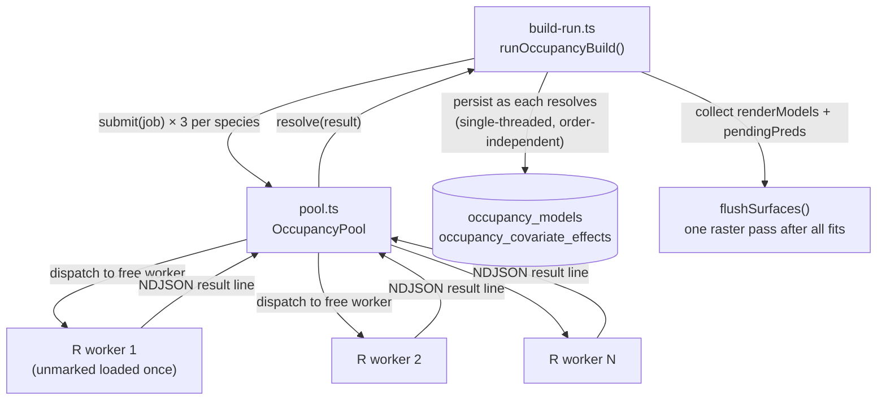
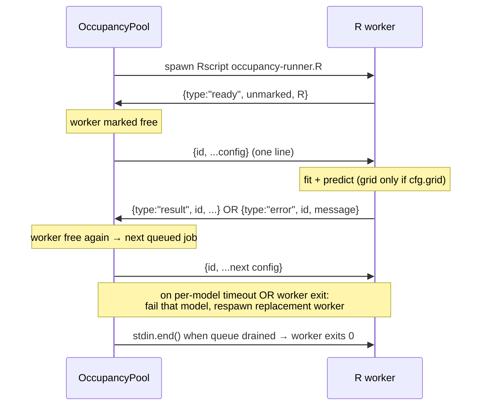

# refactor: Warm R worker pool for occupancy model fitting

## Summary

Occupancy model fitting spawns a **fresh `Rscript` process for every model** — 685 models on the last prod run, each reloading R + `unmarked` (~1.3s measured on the prod droplet) before ~0.4–1.9s of actual fitting. The run also fits models **strictly serially**. Result: ~45 min wall-clock for a job whose real compute is ~18 min.

This plan replaces per-model spawning with a **build-scoped pool of N persistent R workers** that load `unmarked` once and each fit many models, dispatched concurrently across CPU cores. It also **locks the AOI grid prediction to the gradient variant** (a regression guard — the current code already scopes it there, but nothing enforces it). Model outputs are unchanged — same three variants, same statistics, same DB rows — only faster.

Expected effect on prod: eliminate ~890s of cumulative R startup and parallelize the remaining fit+predict work ~6× → target well under 15 min.

---

## Problem Frame

**Root cause (measured, see conversation diagnosis 2026-07-16):**

Wall-clock of prod occupancy run 6 (685 models, 45.4 min ≈ 2,724s) decomposes as:
- **~1,060s** actual model fitting (`SUM(fit_seconds)`, prod avg 1.88s/fit)
- **~890s** R + `unmarked` process startup (685 spawns × 1.3s measured)
- **~775s** AOI grid prediction — each of ~187 gradient models runs `predict(type="state")` with per-cell SE over the **4,732-cell** grid; this cost is measured in R as `predictSeconds` but never persisted, so it is invisible in `fit_seconds`

Two of those three buckets (startup, serial execution) are pure overhead attackable without touching the statistics. The detection-window fix shipped earlier is **exonerated** — it cut occasion counts from up-to-74 down to a uniform 7, which made each fit *faster*; the regression is the 297→685 model-count jump from the gradient/habitat/null variant split landing on a slow, serial, cold-start pipeline.

**Current architecture:**
- `src/lib/occupancy/runner.ts` — `runOccupancyModel(config)` spawns `Rscript scripts/occupancy-runner.R`, pipes one JSON config to stdin, reads one NDJSON result, process exits.
- `scripts/occupancy-runner.R` — reads ONE config from stdin, fits, emits `version` + `result` + `complete`, exits.
- `src/lib/occupancy/build-run.ts` — `runOccupancyBuild()` loops species × stream, and for each eligible species `await`s `fitVariant("gradient")`, `fitVariant("habitat")`, `fitVariant("null")` **sequentially**. Each `fitVariant` calls `runOccupancyModel` (one spawn) and persists the result inline via closure-mutated `nModels` / `renderModels` / `pendingPreds`.

**Goal:** Fit the same models with warm, parallel R workers. No change to eligibility, variants, covariate handling, statistics, artifacts, or the readiness report.

---

## Requirements

- **R1** — Fit all occupancy models for a build using a pool of persistent R workers that load `unmarked` exactly once per worker, not once per model.
- **R2** — Dispatch model fits concurrently across the pool, sized to available CPU with headroom for co-tenant containers on the shared droplet.
- **R3** — Model outputs (coefficients, occupancy estimates, AIC, curves, habitat bars, grid predictions, PNG surfaces) are **byte-for-byte equivalent** to the current pipeline for the same inputs. This is a performance refactor, not a modeling change.
- **R4** — A single model's fit failure or worker crash fails only that model (persisted as `sufficient_data=0` with a Spanish reason, exactly as today) and never aborts the build; a crashed worker is replaced so remaining capacity is preserved.
- **R5** — AOI grid prediction runs **only** for the `gradient` variant; `habitat` and `null` never trigger it. Enforced by an explicit guard + regression test.
- **R6** — A revert flag (`OCCUPANCY_WARM_POOL`, default on) falls back to the current spawn-per-model path so prod can disable the pool without a redeploy if the nightly cron misbehaves.
- **R7** — The live progress toast (`Ajustando modelos (X de Y) — …`) keeps advancing monotonically as models complete under concurrent execution.

**Success criteria:** On prod, a full build (~309–685 models) completes in materially less wall-clock (target: under 15 min vs. ~45 min) with an unchanged `occupancy_models` / `occupancy_predictions` row set for the same DB inputs.

---

## High-Level Technical Design

**Directional guidance for reviewer validation — not implementation specification.**

### Component shape



### Worker lifecycle (mirrors `src/lib/ml-runner.ts`)



**Key invariant:** JS is single-threaded, so although fits run concurrently in R, every result handler (DB insert, counter bump, `renderModels.push`) executes serially on the Node event loop — no locking needed, better-sqlite3 stays synchronous and safe. Result **order** is non-deterministic; persistence logic must not depend on it (the final `flushSurfaces` pass already batches all surfaces, so order is irrelevant).

---

## Key Technical Decisions

- **Build-scoped pool, not a persistent singleton.** Unlike `ml-runner.ts` (a singleton that serves many independent user-triggered jobs and idles out after 10 min), an occupancy build is *one* discrete long job. The pool is created at the start of `runOccupancyBuild`, fits all models, and is torn down in a `finally`. No idle timer, no cross-job stale-singleton concerns, deterministic teardown. Rationale: simpler lifecycle, and the R workers hold no expensive warm state worth preserving between nightly builds.

- **Warm + parallel are one mechanism.** A pool of N persistent workers delivers both asks: each worker loads `unmarked` once (warm), and N workers fit concurrently (parallel). Implementing them separately would be redundant.

- **Worker count defaults to 4, env-overridable via `OCCUPANCY_WORKERS`** (floored at 1, and never more than `availableParallelism()`). Prod reports 8 cores; a flat default of 4 deliberately leaves half the box for Next.js, SQLite, oauth2-proxy, and co-tenant containers — mirrors the CT pipeline's `CT_PROCESS_DISK_MARGIN_GB` "protect co-tenants" posture. Chosen conservative (per operator direction 2026-07-16) rather than an aggressive `cores - 2`; raise via `OCCUPANCY_WORKERS` if headroom proves ample.

- **Each worker caps BLAS/OMP threads to 1.** With N workers already saturating cores, letting `unmarked`/BLAS spawn multiple threads per worker would oversubscribe and slow everything. Set `OMP_NUM_THREADS=1` / `MKL_NUM_THREADS=1` / `OPENBLAS_NUM_THREADS=1` per worker (opposite of the single-process ML server, which wants all cores in one process). Parallelism comes from the pool, not from intra-fit threading.

- **One R contract, revert path reuses it.** `occupancy-runner.R` becomes loop-capable: emit `ready`, then read-fit-emit per line until EOF. A single config followed by stdin EOF still fits once and exits — so the fallback `runOccupancyModel` (spawn-per-model, used when `OCCUPANCY_WARM_POOL=false` and by the R integration test) works against the same script by sending one config and closing stdin. No duplicated R logic.

- **Per-model error isolation replaces process-exit-on-error.** Today R's `fail()` emits an error and `quit(status=1)` — fine when one process = one model. In loop mode, a *fit* error must emit `{type:"error", id}` and continue the loop; only startup failures (unparseable stdin, `unmarked` load failure) are fatal. Native crashes (segfault in `unmarked` C code) still kill the worker → the pool detects the exit, fails the in-flight model gracefully, and respawns.

- **Grid-prediction guard is defensive, not a behavior change.** `build-run.ts:251` already gates `gridSpecs` on `variant === "gradient"`, and R only predicts the grid when `cfg$grid` is non-null. R5 adds an explicit assertion + regression test so a future refactor can't silently start predicting the 4,732-cell grid for habitat/null.

---

## Implementation Units

### U1. R worker-loop mode with per-request error isolation

**Goal:** Convert `scripts/occupancy-runner.R` from single-shot to a persistent read-fit-emit loop that survives per-model fit failures.

**Requirements:** R1, R4

**Dependencies:** none

**Files:**
- `scripts/occupancy-runner.R` (modify)
- `tests/unit/occupancy-runner-r.test.ts` (modify)

**Approach:**
- On startup, after loading `jsonlite` + `unmarked`, emit `{type:"ready", unmarked:<ver>, R:<ver>}` once (replaces the per-config `version` emission).
- Wrap the existing fit body (currently `main()`) in a function taking one parsed config and returning/emitting a `result` or `error` tagged with the config's `id`.
- Loop: open a line connection on stdin, read one line at a time; each non-empty line is one JSON config → run the fit body inside `tryCatch`; on error, emit `{type:"error", id, message}` and **continue** the loop (do not `quit`). On EOF, exit 0.
- Redefine `fail()` semantics: fatal startup problems still `quit(1)`; per-request failures use a new path that emits the tagged error and returns to the loop.
- Preserve the single-config case: one line + EOF fits once then exits (keeps the fallback path and integration test working).
- Grid prediction block stays exactly as-is (only fires when `cfg$grid` non-null).

**Patterns to follow:** `scripts/model-server.py` (persistent read-loop over stdin NDJSON), existing NDJSON emission in this same file.

**Technical design (directional):**
```r
emit(list(type = "ready", unmarked = ver, R = rver))
con <- file("stdin", open = "r")
repeat {
  line <- readLines(con, n = 1L, warn = FALSE)
  if (length(line) == 0) break            # EOF
  if (!nzchar(trimws(line))) next
  cfg <- fromJSON(line, simplifyVector = FALSE)
  tryCatch(fit_one(cfg), error = function(e)
    emit(list(type = "error", id = cfg$id, message = conditionMessage(e))))
}
```

**Test scenarios:**
- Happy path: pipe two configs on two lines → receive one `ready` then two `result` lines, ids echoed, process exits 0.
- Error isolation: a config that fails to fit (e.g. all-NA detection history) emits `{type:"error", id}` and the **next** config on the following line still returns a `result` — the worker did not die.
- Single-shot back-compat: one config + stdin close → one `ready` + one `result` + exit 0 (the fallback path's contract).
- Startup fatal: malformed first line still surfaces an error (worker may exit) without hanging.
- Covers grid-scoping indirectly: a gradient config (with `grid`) returns `prediction`; a null config (no `grid`) returns no `prediction` field.

**Verification:** `occupancy-runner-r.test.ts` passes; manually piping 2–3 NDJSON configs yields correctly-tagged results with one `unmarked` load (visible as a single startup delay).

---

### U2. Persistent R worker pool

**Goal:** New module managing N warm R workers: spawn, ready-handshake, concurrent dispatch queue, per-model timeout, per-worker crash + respawn, teardown.

**Requirements:** R1, R2, R4

**Dependencies:** U1

**Files:**
- `src/lib/occupancy/pool.ts` (create)
- `tests/unit/occupancy-pool.test.ts` (create)

**Approach:**
- `createOccupancyPool({ size, timeoutMs })` spawns `size` workers (`Rscript occupancy-runner.R`, thread-cap env vars set to 1), each awaiting its `ready` line before being marked free.
- `pool.submit(config): Promise<OccupancyRunResult>` — assign a monotonic `id`, enqueue; a dispatch loop hands queued jobs to free workers, correlating the returned `{type:"result"|"error", id}` back to the pending promise. A worker handles one job at a time (busy until its result line arrives).
- Per-model timeout: if a worker doesn't return within `timeoutMs` (default 120_000, matching current `DEFAULT_TIMEOUT_MS`), kill + respawn that worker and resolve the model as a failure result (same shape `runOccupancyModel` returns today).
- Worker crash: on unexpected `exit`, resolve the in-flight model as failure (reuse the `buildCrashError` idea from `ml-runner.ts`), respawn a replacement, and keep draining the queue.
- `pool.drain()` / `pool.shutdown()` — close stdin on all workers, await exit, clear timers; also wire `SIGTERM`/`SIGINT` teardown as `ml-runner.ts` does.
- Result shape: reuse `OccupancyRunResult` from `runner.ts` unchanged so `build-run.ts` persistence is untouched downstream of the call boundary.

**Patterns to follow:** `src/lib/ml-runner.ts` — NDJSON line handler via `readline`, `ready` handshake, `buildCrashError`, PID/stale cleanup, `SIGTERM`/`SIGINT` handlers, `availableParallelism()` sizing.

**Test scenarios:**
- Happy path: submit K configs to a size-2 pool (with a stub `Rscript` or the real one behind an env guard) → all K resolve, each worker served >1 job (proving reuse, not per-job spawn).
- Concurrency: with size N and K>N jobs, at most N are in-flight simultaneously; the rest queue and drain.
- Timeout: a worker that never responds is killed + respawned; that model resolves as a failure result; subsequent queued jobs still complete on the replacement.
- Crash + respawn: a worker that exits mid-job fails only its in-flight model; pool size is restored and remaining jobs finish.
- Teardown: `shutdown()` closes all workers; no orphaned processes; idempotent if called twice.
- Sizing: `size` honors `OCCUPANCY_WORKERS` override and defaults to `availableParallelism() - 2` (floored at 1).

**Execution note:** Start with a failing test for the ready-handshake + reuse invariant (a worker serves multiple jobs) before wiring crash/timeout paths.

---

### U3. Route the build through the pool with order-independent persistence

**Goal:** Rewrite `runOccupancyBuild`'s fit loop to submit all variant-fits to the pool concurrently and persist each result as it resolves, keeping progress monotonic. Retain the current serial path behind the revert flag.

**Requirements:** R1, R2, R3, R6, R7

**Dependencies:** U1, U2

**Files:**
- `src/lib/occupancy/build-run.ts` (modify)
- `tests/unit/occupancy-build-run.test.ts` (modify)

**Approach:**
- Build a flat list of **fit jobs** up front: for each stream × eligible species, the `gradient` job, the `habitat` job (when a usable factor exists), and the `null` job — each carrying the context needed to persist (species, stream, variant, `frame`, covariate specs, `gridSpecs`, `standardizations`, `dropped`). This is the same set `fitVariant` builds today, just materialized instead of `await`ed inline.
- When `OCCUPANCY_WARM_POOL` is on: create the pool, `submit` every fit job, and in each job's resolution handler run the **existing** persist logic (degeneracy guard, `insModel`/`insEffect`, `renderModels.push`, `pendingPreds.push`, `nModels++`). Because handlers run single-threaded on the event loop, DB writes stay serialized and order-independent.
- When off: keep today's sequential `await fitVariant(...)` path calling `runOccupancyModel` (spawn-per-model) unchanged.
- Progress (R7): replace the per-species `done++` with a completed-fit counter incremented in the resolution handler; call `onProgress(completed, totalFits, label)` so the toast advances as models finish. Keep the `Ajustando modelos (X de Y)` copy; `Y` becomes total fits (already how run 8 reported 671).
- Ineligible species still get their single cheap `combined` row without touching the pool (no R fit needed) — unchanged.
- `flushSurfaces` runs once after all fits resolve, exactly as today (it already batches `renderModels` + `pendingPreds`).
- Ensure `pool.shutdown()` in a `finally` so a mid-build throw never leaks workers.

**Patterns to follow:** existing `fitVariant` persist logic in `build-run.ts` (reuse verbatim inside the resolution handler); `processOccupancyJob` progress callback in `src/lib/occupancy/processor.ts`.

**Test scenarios:**
- Equivalence (core): a fixed synthetic input produces the **same** `occupancy_models` rows (counts per variant, `sufficient_data` flags, formulas) and `occupancy_predictions` rows via the pool path as via the serial path. Covers R3.
- Variant set unchanged: eligible species → gradient + null (+ habitat when a factor is usable); ineligible → one `combined` row. Matches run-8 variant counts.
- Progress monotonic: `onProgress` is called `totalFits` times with a non-decreasing `done`, ending at `nModels`. Covers R7.
- Revert flag: `OCCUPANCY_WARM_POOL=false` takes the serial `runOccupancyModel` path and yields identical rows.
- Failure isolation: one job resolving as a failure result persists an insufficient-data row (Spanish reason) and does not abort the remaining fits. Covers R4.
- No worker leak: pool is shut down even when a fit job throws mid-build.

**Execution note:** Land the equivalence test first (serial vs. pool over the same seed) — it is the safety net for the whole refactor.

---

### U4. Lock grid prediction to the gradient variant

**Goal:** Make R5 explicit and regression-proof — habitat and null must never carry a grid into R.

**Requirements:** R5

**Dependencies:** U3

**Files:**
- `src/lib/occupancy/build-run.ts` (modify — add a guard/assertion)
- `tests/unit/occupancy-build-run.test.ts` (modify — add the regression test)

**Approach:**
- Behavior is already correct (`gridSpecs` gated on `variant === "gradient"`). Add a defensive assertion where the fit job is built: if `variant !== "gradient"` then `gridSpecs` must be `undefined` — throw a clear error otherwise, so an accidental future change fails loudly in tests rather than silently predicting the 4,732-cell grid three times per species.
- Optionally mirror the guard in R: only attempt the grid block when `cfg$grid` is non-null (already true) — no change needed, but assert it in the R test.

**Patterns to follow:** the existing `variant === "gradient" && raster` gate at `build-run.ts:251`.

**Test scenarios:**
- Regression: constructing a `habitat` or `null` fit job never attaches `gridSpecs`; the assertion throws if one is forced in.
- Gradient still predicts: a gradient job with raster present still produces a `prediction` artifact and PNG (unchanged).
- Cost guard (documentation-level): assert only one grid prediction per species (the gradient one), not three.

---

### U5. Config knobs, environment wiring, and docs

**Goal:** Expose `OCCUPANCY_WORKERS` and `OCCUPANCY_WARM_POOL`, wire them through Docker, and document the pool.

**Requirements:** R2, R6

**Dependencies:** U2, U3

**Files:**
- `.env.example` (modify)
- `docker-compose.yml` (modify — pass both env vars through, as existing `OCCUPANCY_*` vars are)
- `CLAUDE.md` (modify — add a short note under an occupancy section describing the warm pool, the two knobs, and the revert lever)
- `src/lib/occupancy/pool.ts` (modify — read the knobs; likely already done in U2)

**Approach:**
- `OCCUPANCY_WORKERS` (default `4`, floored at 1, capped at `availableParallelism()`): pool size. Flat conservative default per operator direction (2026-07-16) to protect co-tenants on the shared droplet.
- `OCCUPANCY_WARM_POOL` (default `true`; set `false` to revert to spawn-per-model): the emergency lever, mirroring `CT_PROCESS_CHUNKING_ENABLED`.
- Document that each worker pins BLAS threads to 1 and why; note the co-tenant headroom rationale.

**Patterns to follow:** how `OCCUPANCY_FOREST_RASTER` / `CT_PROCESS_CHUNKING_ENABLED` are threaded through `docker-compose.yml`, `.env.example`, and CLAUDE.md.

**Test scenarios:** `Test expectation: none — configuration/documentation wiring; behavior covered by U2 (sizing/flag) and U3 (revert path).`

---

### U6. Prod verification and rollout

**Goal:** Confirm the equivalence and speedup on real data before trusting the nightly cron.

**Requirements:** R3, success criteria

**Dependencies:** U1–U5

**Files:** none (operational)

**Approach:**
- Run one manual build on prod with the pool ON; capture wall-clock and compare the `occupancy_models` / `occupancy_predictions` row set against the prior run (same DB inputs) for equivalence.
- Compare against a serial baseline (`OCCUPANCY_WARM_POOL=false`) if any row diff appears.
- Watch container CPU/RAM (`docker stats`) during the run to confirm the worker count leaves co-tenant headroom.
- Only after a clean manual run, let the nightly cron use the pool.

**Test scenarios:** `Test expectation: none — operational verification; automated equivalence is U3.`

**Verification:** Manual prod build completes materially faster (target <15 min) with an unchanged row set and no co-tenant starvation.

---

## Scope Boundaries

**In scope:** warm R worker pool, concurrent dispatch, worker sizing + thread-capping, per-model error/crash/timeout isolation, order-independent persistence, grid-prediction guard, revert flag, docs, prod verification.

**Explicitly not changing:** the statistics (`occu` formulas, standardization, curves, habitat bars, grid predict math), the variant set (gradient/habitat/null), eligibility/readiness logic, the raster/surface rendering pass (`flushSurfaces`), the readiness report, the job-queue/cron lifecycle.

### Deferred to Follow-Up Work

- **Persist `predictSeconds`.** The grid-prediction time is measured in R but dropped. Persisting it (a column on `occupancy_models`) would make future perf analysis quantitative instead of inferred. Small, independent, not required for this refactor.
- **Coarsen or SE-skip the AOI grid.** The 4,732-cell per-cell-SE prediction is the largest remaining single cost after parallelization. Reducing grid resolution or skipping SE where the map doesn't show it could cut it further — but it *changes outputs*, so it belongs in a modeling decision, not this performance refactor.
- **Cross-job pool reuse / singleton.** If occupancy ever runs many small builds in sequence, a persistent singleton (like `ml-runner`) could amortize even worker startup. Not worth it for one nightly build.

---

## Risks & Mitigation

- **Nightly cron breakage from a pool bug** → `OCCUPANCY_WARM_POOL=false` reverts to the proven spawn-per-model path with no redeploy (R6); U6 gates the cron behind a clean manual run.
- **Output drift vs. serial path** → U3's equivalence test (serial vs. pool over the same seed) is the primary guard; U6 re-checks on real prod data. `unmarked` fits are deterministic given identical inputs, so the same config must yield the same result regardless of which worker runs it.
- **CPU oversubscription starving co-tenants** → workers pinned to 1 BLAS thread + default size `cores - 2`; `docker stats` watch in U6.
- **Worker native crash (segfault in `unmarked`)** → pool detects the exit, fails only that model, respawns (R4) — strictly better than today, where such a crash already fails that model but there is no shared state to corrupt.
- **Zombie/orphaned R processes** → `finally`-scoped `pool.shutdown()` + `SIGTERM`/`SIGINT` handlers + stale-PID cleanup mirrored from `ml-runner.ts`.
- **NDJSON framing** → each config is a single `JSON.stringify` line (no embedded newlines) and each result is one line; the `id` echo correlates request↔response so a worker serving many jobs never mismatches results.

---

## Alternatives Considered

- **Bigger droplet instead of a pool.** Throwing cores at a serial cold-start pipeline still pays 685 × 1.3s startup and still runs serially — the startup and serialization buckets don't shrink. Rejected: doesn't address root cause, ongoing cost.
- **Rewrite the fitting in R-native parallelism (`parallel`/`future` inside one Rscript).** One long-lived R process fitting all models with `mclapply`. Fewer moving parts than a Node-side pool, but: it moves orchestration/persistence into R (away from the DB and the existing TS persist logic), complicates progress reporting back to the toast, and a single segfault kills the whole batch. Rejected: worse error isolation and a bigger blast radius than N independent workers.
- **Persistent singleton pool (mirror `ml-runner` exactly).** Idle-managed, cross-build. Unnecessary complexity for one nightly build; build-scoped teardown is simpler and safer. Rejected in favor of build-scoped.

---

## Phased Delivery

1. **U1** (R loop mode) — independently testable, no TS wiring yet.
2. **U2** (pool) — depends on U1; unit-tested in isolation.
3. **U3 + U4** (build integration + grid guard) — the equivalence test lands here; this is the risk-bearing change.
4. **U5** (knobs/docs) — trivial once U2/U3 exist.
5. **U6** (prod verification) — gate before the cron trusts the pool.

Ship U1–U5 together (they're one behavior behind a default-on flag); treat U6 as the go/no-go for leaving the pool enabled on the nightly cron.

---

## Sources & Research

- Live diagnosis (this session, 2026-07-16): prod run history, per-model `fit_seconds`, measured R+`unmarked` startup (1.3s), 4,732-cell grid, prod `availableParallelism() = 8`.
- `src/lib/ml-runner.ts` — the warm-server precedent: NDJSON handshake, `buildCrashError`, idle/PID/SIGTERM lifecycle, `availableParallelism()` thread cap.
- `scripts/model-server.py` — persistent stdin read-loop pattern.
- `src/lib/occupancy/{runner,build-run,config}.ts`, `scripts/occupancy-runner.R` — current single-shot contract and fit/persist flow.
- CLAUDE.md — co-tenant-protection posture (`CT_PROCESS_DISK_MARGIN_GB`), revert-flag convention (`CT_PROCESS_CHUNKING_ENABLED`), synchronous better-sqlite3 constraint.
