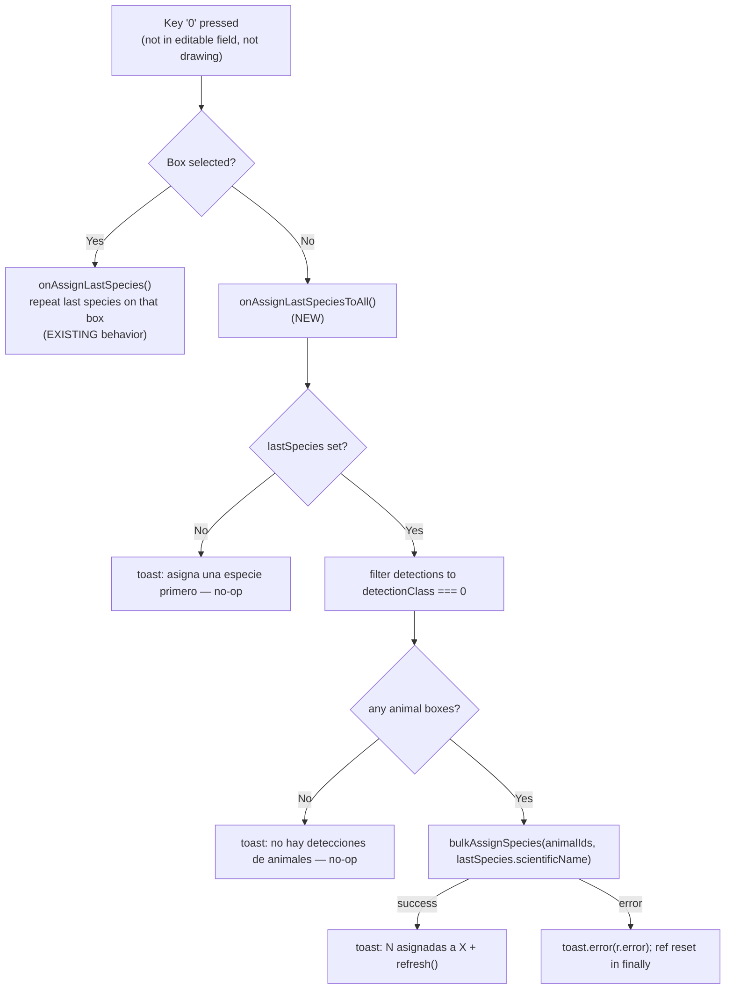

# feat: "0" hotkey to assign last species to all animal boxes + verify

**Plan type:** feat
**Depth:** Lightweight
**Created:** 2026-07-16
**Status:** Ready for implementation

---

## Summary

In the camera-trap annotation UI, when **no bounding box is selected**, pressing `0` should assign the *last used species* to **every animal detection** in the current image and verify them in one keystroke. Today `0` only works with a box selected (it repeats the last species on that single box); with nothing selected it does nothing. The annotator's burst workflow (3 photos of the same animal, often multiple boxes) currently forces `1` (select box) + `0` (assign) per box, repeated for each detection. This change collapses that to a single `0`.

Scope decision (confirmed with user): "all boxes" means **animal detections only** (`detectionClass === 0`). Person/vehicle boxes are left untouched so they are never mislabeled as the animal. Already-verified boxes with a *different* species **are** overwritten to the last species (correct for the burst case where every animal box is the same individual).

---

## Problem Frame

- **Who:** FCAT staff/collaborators annotating camera-trap results (`/camera-trap/results/[id]/images/[imageId]`, plus the embedded gallery overlay).
- **Pain:** For an image with N animal boxes, verifying them all as the last species takes 2N keystrokes (`1`,`0`,`2`,`0`, …) or manual clicks. The existing `0` "repeat last species" only ever touches the one selected box.
- **Goal:** One keystroke (`0`, no selection) sets + verifies all animal boxes to the last species.
- **Non-goal:** Changing the per-box `0` behavior (box selected → repeat on that box) or the `v` "verify all and advance" behavior.

---

## Key Technical Decisions

1. **Dedicated bulk server action `bulkAssignSpecies(detectionIds, newSpecies)`** rather than looping the existing `assignSpecies` from the client. One round-trip, one deployment-access check, one `maybeAutoCompleteDeployment`, one `revalidatePath`, one toast. Mirrors the existing `bulkVerify` precedent in the same file. The action applies the same per-detection semantics `assignSpecies` already uses: species matches ML prediction → `verified`; otherwise → `corrected` (with `correctedSpecies` set). This means "assign + verify" is a single operation per box — assignment already flips verification status. See `assignSpecies` at `src/app/camera-trap/actions.ts:5226`.

2. **Animal filtering happens on the client.** `ImageAnnotationClient` already holds `detections: DetectionWithIdentification[]` with `detectionClass` per row. The client filters to `detectionClass === 0` and passes only those detection IDs to `bulkAssignSpecies`. The server action stays generic (assign a species to a set of detections) and does not encode the animal-only policy — keeping it reusable and the policy visible at the call site.

3. **Extract the digit-key decision into a pure helper** `resolveDigitKeyAction(key, { selectedDetectionId, detectionCount })` inside `use-annotation-shortcuts.ts`. The Vitest environment is `node` (no DOM), so a pure function is the only way to unit-test the new branch without pulling in jsdom. The hook calls the helper and dispatches to callbacks; the helper returns an intent descriptor. This keeps the exact "0 + no selection" branch testable.

4. **Guard rails on the client handler:** no last species yet → gentle Spanish toast and no-op; zero animal detections → gentle toast and no-op. Reuse the existing `isVerifyingRef` single-flight guard pattern so a held `0` can't fire overlapping mutations.

---

## High-Level Technical Design

Decision flow for the `0` key (directional — not implementation spec):

Digit-key intents returned by `resolveDigitKeyAction` (directional):

| key | selectedDetectionId | detectionCount | intent |
|-----|--------------------|----------------|--------|
| `0` | set | — | `assignLast` (existing) |
| `1`–`9` | set | — | `assignByIndex(key-1)` (existing) |
| `0` | null | — | `assignLastToAll` (**new**) |
| `1`–`9` | null | `index < count` | `selectDetection(index)` (existing) |
| `1`–`9` | null | `index >= count` | `none` (existing) |

---

## Implementation Units

### U1. Add `bulkAssignSpecies` server action

**Goal:** Server action that assigns one species to a set of detections with `assignSpecies` semantics, in a single access check + revalidate.
**Requirements:** Enables the one-keystroke bulk assign+verify.
**Dependencies:** none.
**Files:**
- `src/app/camera-trap/actions.ts` (add `bulkAssignSpecies`)
- `tests/unit/bulk-assign-species.test.ts` (new)

**Approach:**
- Signature: `bulkAssignSpecies(detectionIds: number[], newSpecies: string): Promise<ActionResult<{ count: number }>>`.
- `requirePermission("camera-trap", "editor")` first (per project convention — every action).
- Empty `detectionIds` → `{ success: true, data: { count: 0 } }` (matches `bulkVerify` early return).
- Resolve the distinct deployment(s) for the given detections (join detections → images) and call `requireDeploymentAccess(user, deploymentId)` for each, same as `bulkVerify` at `src/app/camera-trap/actions.ts:4554`.
- For each detection, apply the exact branch logic from `assignSpecies` (`src/app/camera-trap/actions.ts:5257`): existing identification → `verified` if `newSpecies === ident.species` else `corrected` + `correctedSpecies`; no identification → insert a manual identification and flip `detectionClass` to 0. Since callers pass animal boxes (which have ML identifications), the insert branch is defensive but should be preserved for correctness.
- Call `maybeAutoCompleteDeployment(depId, user.email)` once per deployment after the writes, then `revalidatePath(CAMERA_TRAP_PATH)`.
- **Not** a `db.transaction` — better-sqlite3 transactions must be synchronous and these are `async` Drizzle `.update()`/`.insert()` calls; use sequential `await` (see CLAUDE.md gotcha + the `assignSpecies` pattern which is also sequential-await).
- **System events:** none. Consistent with `assignSpecies`/`bulkVerify`, which emit no `recordEvent` (per-annotation verification is the "high-frequency per-row" default-no category in CLAUDE.md).

**Patterns to follow:** `bulkVerify` (`src/app/camera-trap/actions.ts:4543`) for the access-check + count-return shape; `assignSpecies` (`:5226`) for the per-detection verify/correct logic.

**Test scenarios** (`tests/unit/bulk-assign-species.test.ts`) — follow the static source-guard style used in `tests/unit/species-actions.test.ts` (read the action body, assert structural invariants), since the repo's camera-trap action tests are grep-style and do not hit the DB:
- Body calls `requirePermission("camera-trap", "editor")` before any Drizzle call.
- Body calls `requireDeploymentAccess` (deployment authorization is enforced).
- Returns an `ActionResult` shape (`success: true` with `data.count` on the happy path; `success: false` with `error` in the catch).
- Empty-input guard: returns `count: 0` without a DB write when `detectionIds` is empty.
- Body applies the match→`verified` / mismatch→`corrected` branch (assert both string literals present) so bulk assign inherits assignSpecies verify semantics.

### U2. Hook: pure digit dispatcher + `onAssignLastSpeciesToAll` + docs const

**Goal:** Route `0`-with-no-selection to a new callback; make the digit branch unit-testable; update the exported `SHORTCUTS` doc const.
**Requirements:** Wires the keystroke to the new behavior.
**Dependencies:** none (callback is provided by U3).
**Files:**
- `src/hooks/use-annotation-shortcuts.ts`
- `tests/unit/annotation-shortcut-dispatch.test.ts` (new)

**Approach:**
- Extract a pure exported helper `resolveDigitKeyAction(key, ctx)` returning a discriminated intent (`{ type: "assignLast" } | { type: "assignByIndex", index } | { type: "assignLastToAll" } | { type: "selectDetection", index } | { type: "none" }`) from the current inline logic in the `default` switch case (`src/hooks/use-annotation-shortcuts.ts:190`).
- In the no-selection branch, add `key === "0"` → `assignLastToAll` (currently only `1`–`9` selection is handled; `0` falls through to nothing).
- Add `onAssignLastSpeciesToAll?: () => void` to `AnnotationShortcutOptions`; dispatch it for the `assignLastToAll` intent (with `e.preventDefault()`).
- Update the `SHORTCUTS` array `0` entry description to reflect dual behavior (Spanish), e.g. `Última especie: en la caja, o todas (sin selección)`.
- Preserve all existing guards (editable-field, drawing, picker-open, search-focused, modifier keys). The new branch only fires when no detection is selected and no modifier is held — identical entry conditions to the existing no-selection digit branch.

**Patterns to follow:** existing switch/guard structure in the same file; keep `optsRef` usage intact.

**Test scenarios** (`tests/unit/annotation-shortcut-dispatch.test.ts`, pure function — no DOM needed):
- `0` with `selectedDetectionId` set → `assignLast`.
- `0` with `selectedDetectionId == null` → `assignLastToAll` (**the new branch**).
- `1` with `selectedDetectionId` set → `assignByIndex(0)`.
- `1` with no selection and `detectionCount >= 1` → `selectDetection(0)`.
- `5` with no selection and `detectionCount == 2` → `none` (index out of range).
- Non-digit key (e.g. `a`) → `none`.

### U3. Client handler `handleAssignLastSpeciesToAll` + hook wiring

**Goal:** Filter to animal boxes, guard, call `bulkAssignSpecies`, toast + refresh; pass the callback to the hook.
**Requirements:** Executes the bulk assign+verify in the annotation client.
**Dependencies:** U1, U2.
**Files:**
- `src/app/camera-trap/results/[id]/images/[imageId]/image-annotation-client.tsx`

**Approach:**
- Import `bulkAssignSpecies` alongside the existing action imports (`src/app/camera-trap/results/[id]/images/[imageId]/image-annotation-client.tsx:38`).
- Add `handleAssignLastSpeciesToAll` (`useCallback`):
  - If `!lastSpecies` → `toast("Asigna una especie primero para poder repetirla")` and return.
  - `const animalIds = detections.filter((d) => d.detectionClass === 0).map((d) => d.id)`.
  - If `animalIds.length === 0` → `toast("No hay detecciones de animales")` and return.
  - Reuse the `isVerifyingRef` single-flight guard **with the same `try/finally` discipline as `handleQuickVerifyAll` (`:302`–`:316`)**: set `isVerifyingRef.current = true` before starting, and reset it to `false` in a `finally` block. This ref is **shared** with `handleQuickVerifyAll` (the `v` key), so a bulk-assign that throws or returns `success: false` without a reset would soft-lock *both* bulk-assign and verify-and-advance until a page refresh.
  - Sketch: `if (isVerifyingRef.current) return; isVerifyingRef.current = true; startTransition(async () => { try { const r = await bulkAssignSpecies(animalIds, lastSpecies.scientificName); if (r.success) { toast.success(\`${r.data.count} cajas asignadas a ${label}\`); refresh(); } else { toast.error(r.error); } } finally { isVerifyingRef.current = false; } })` — the `else`/`toast.error` branch keeps a failed bulk assign both visible and non-blocking.
  - **Toast wording:** avoid claiming "verificadas" — mismatched-species boxes become `corrected`, not `verified` (both are "resolved", but the copy should not over-assert). Use `${count} cajas asignadas a ${label}` (species name via `nameDisplay`, mirroring how the picker labels species). Optionally include the species so a stray/muscle-memory press is noticed immediately (see Risks).
  - Deps: `[detections, lastSpecies, refresh, nameDisplay]`.
- Wire into `useAnnotationShortcuts`: `onAssignLastSpeciesToAll: canEdit ? handleAssignLastSpeciesToAll : undefined` (next to `onAssignLastSpecies` at `:522`). Respects the existing `canEdit` gating (viewers get no mutation shortcuts).

**Patterns to follow:** `handleQuickVerifyAll` (`:293`) for the single-flight + transition + toast + refresh shape; `handleAssignLastSpecies` (`:359`) for the `lastSpecies` guard.

**Test scenarios:** `Test expectation: none — wiring only`. The behavioral logic under test lives in U1 (server action guards) and U2 (dispatch branch); this unit is a thin `useCallback` + prop pass-through with no independently testable branch beyond the two guard toasts, which are covered by manual verification. (If the reviewer wants coverage, add a static source-guard test asserting the handler filters `detectionClass === 0` and is gated by `canEdit` — but this is optional for a wiring unit.)

### U4. Help panel + workflow docs

**Goal:** Document the new `0`-no-selection behavior in the annotation help modal.
**Requirements:** "Add that to the help section too."
**Dependencies:** none (can land in parallel with U1–U3).
**Files:**
- `src/components/annotation-help-panel.tsx`

**Approach (Spanish, matching existing tone):**
- Update the `0` `ShortcutRow` (`src/components/annotation-help-panel.tsx:70`) to convey both modes, e.g. desc `Última especie (con selección) · todas las cajas de animales (sin selección)` — or split into two rows if clearer.
- Add a workflow `<ol>` step after the existing `0` step (`:55`): e.g. `Sin ninguna caja seleccionada, la tecla <Kbd>0</Kbd> asigna la última especie a todas las cajas de animales y las verifica`.
- Add a Consejos bullet (`:97`): `<Kbd>0</Kbd> sin selección aplica la última especie a todos los animales de la foto — ideal cuando hay varias cajas del mismo animal`.
- Keep person/vehicle exclusion implicit but accurate ("cajas de animales"), so annotators aren't surprised that person/vehicle boxes stay untouched.

**Patterns to follow:** existing `ShortcutRow` / `Kbd` / `<ol>` / Consejos structure in the same file.

**Test scenarios:** `Test expectation: none — static help copy, no behavioral change`.

---

## Scope Boundaries

**In scope:** the `0`-no-selection hotkey behavior, the bulk server action, help-panel docs, unit tests for the server action guards and the digit dispatcher.

### Deferred to Follow-Up Work
- A visible toolbar/sidebar button mirroring the hotkey (keyboard-only for now).
- Extending the animal-only policy to be user-configurable (currently fixed: `detectionClass === 0`).
- Undo for a bulk mis-assign (annotators can re-run `0` with a corrected last species, or fix per-box).

**Out of scope (unchanged behavior):** per-box `0` (box selected), `v` verify-all-and-advance, `1`–`9` selection/assignment, person/vehicle promotion via per-box assignment.

---

## Risks & Considerations

- **Accidental press on a fresh image (stale last-species).** `lastSpecies` persists **per deployment** across images (`sessionStorage` key `fcat:lastSpecies:${jobId}`), not per image. So arriving at a new image whose boxes are already correctly ML-identified and pressing `0` out of muscle memory silently re-labels every animal box to whatever species was last assigned *anywhere in the session* — including overwriting already-verified-different boxes, with no undo (deferred). The `!lastSpecies` guard does not catch this (a species is almost always set by then). **Decision for the user:** accept the risk relying on a loud toast (`N cajas asignadas a X` — the species name makes a misfire immediately visible) and the deferred re-run/undo path, **or** add a lightweight confirmation/count-preview that fires only when the bulk would overwrite ≥1 *already-verified* box. Recommended default: the loud toast (keeps the one-keystroke speed the feature exists for; the burst workflow is the common case), with the confirmation deferred to follow-up unless the user wants it now.
- **Overwriting a correct box:** if an image mixes two animal species, `0`-no-selection overwrites all animal boxes to the last species. This is the accepted trade-off per the confirmed scope (burst images are single-species); the per-box `1`+species flow remains for mixed images. Documented in the help panel via "todas las cajas de animales".
- **Embedded gallery overlay:** `ImageAnnotationClient` is also rendered inside `DeploymentGalleryClient` (`src/app/camera-trap/[id]/deployment-gallery-client.tsx`). The shortcut is inside the shared client, so the behavior applies in both surfaces automatically — verify the overlay still refreshes via its `onMutate` path (the existing `refresh` callback already routes to `onMutate` when provided, `:125`).
- **`canEdit === false`:** viewers must not trigger mutations. The `onAssignLastSpeciesToAll: canEdit ? … : undefined` gate matches every other mutation callback; verify a viewer pressing `0` is a no-op.

---

## Verification

- With ≥2 animal boxes and a last species set, no box selected: pressing `0` assigns that species to all animal boxes, flips them to verified/corrected, shows a count toast, and the sidebar/cards update.
- A person/vehicle box in the same image is left unchanged.
- No last species yet: `0` shows the "asigna una especie primero" toast and changes nothing.
- Box selected: `0` still repeats the last species on that one box only (regression check).
- Viewer (`canEdit=false`): `0` does nothing.
- Help modal lists the new behavior in shortcuts, workflow, and tips.
- `npm run test:run` passes (new U1/U2 tests green); `npm run lint` clean.

---

## Alternatives Considered

- **Client-side loop of `assignSpecies` over animal IDs** instead of a dedicated action. Rejected: N round-trips, N revalidations, N auto-complete checks, and either N toasts or extra suppression logic. `bulkAssignSpecies` is one atomic-feeling call with one toast, matching the existing `bulkVerify` precedent. (N is usually 1–3, so this is about cleanliness and consistency, not perf.)
- **A new `0`-distinct key** (e.g. `Shift+0` or `Enter`) for bulk. Rejected: the user explicitly wants plain `0` to Just Work when nothing is selected, and the no-selection `0` slot is currently unused — no collision.
