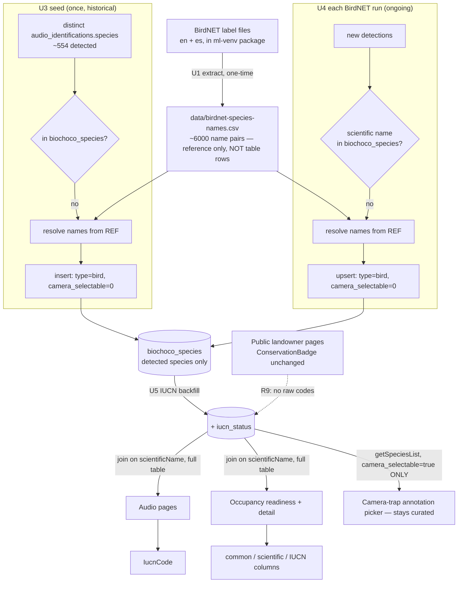

# feat: BirdNET common names, occupancy name columns, and portal IUCN status

## Summary

BirdNET (audio) detections show as bare Latin binomials because the shared species
lookup (`biochoco_species`) is missing **526 of the 554** detected species — the
resolve-scientific-to-common plumbing already exists and is used by the audio and
camera-trap pages, it just has nothing to resolve against. This plan closes that
**data gap** for the species we actually have, then keeps it closed automatically:

- **Seed now, scoped to our data.** Add English + Spanish common names for the ~526
  detected bird species missing from the lookup — **not** all ~6,000 BirdNET taxa.
- **Self-maintaining going forward.** On each BirdNET run, any newly-detected species
  not yet in the lookup is added on the spot (names resolved from a small vendored
  BirdNET name-reference file), so the table grows only as our dataset does.
- Backfill IUCN status for the newly-added birds; give occupancy its own common-name /
  scientific-name / IUCN columns; and surface the IUCN category code next to species
  names across **internal staff views only** (public landowner pages unchanged).

Because `biochoco_species` is a **shared** table, even the ~526 added birds must not
leak into the camera-trap annotation picker (curated ~76-species set). A
`camera_selectable` flag isolates the two uses. No ML pipeline, detection storage, or
occupancy model-math changes.

---

## Problem Frame

Three connected gaps the user reported, plus one cross-component risk the population
introduces:

1. **BirdNET output is scientific-name-only.** `audio_identifications.species` stores
   the bare binomial (`src/lib/birdnet-runner.ts:269`). BirdNET's CSV output *does*
   carry a common name (`scripts/birdnet-runner.py:208`) but it is discarded at storage
   time, and it is Spanish (`--locale es`). The audio UI already resolves names via
   `biochoco_species` but falls back to the raw binomial when a species is absent
   (`src/app/audio/species/actions.ts:107`) — the case for 526/554 detected species, and
   **0 birds have an IUCN status**.

2. **Occupancy shows raw binomials.** `occupancy_models.species` holds a scientific
   binomial for both camera and audio streams (`src/lib/occupancy/fetch.ts` camera
   L292-308 / audio L349-358), cleanly joinable to `biochoco_species.scientificName`,
   but `/ocupacion` never joins — the readiness table, species detail page, and
   cross-species views all render the raw string.

3. **No IUCN status surfaced next to names for staff.** IUCN status exists as a column
   and a backfill script, and camera-trap species carry a public-facing conservation
   badge (`src/components/conservation-badge.tsx`) that deliberately hides the raw code
   and only renders for threatened categories. Staff want the plain `(VU)` / `(EN)` /
   `(LC)` code next to names in the working views.

4. **Shared-table flood risk.** The camera-trap annotation combobox is fed by
   `getSpeciesList()` (`src/app/camera-trap/actions.ts:4671`), an **unfiltered**
   `select().from(species)` grouped by `type`. Adding hundreds of audio-only birds would
   dump them into the annotation dropdown under "Aves", wrecking the curated annotation
   UX. The added birds must be isolated from that picker.

**Confirmed scope decisions (2026-07-16):**
- **Populate only species represented in our dataset**, and add future ones lazily on
  each BirdNET run — do not bulk-import the full ~6,000-taxon BirdNET label set into the
  table.
- IUCN code appears on **internal staff views only**; public/landowner pages keep the
  warm-Spanish-word, threatened-only badge unchanged.
- Common names come from the **BirdNET label set** (English + Spanish; matches detected
  strings exactly).

---

## Requirements

| ID | Requirement | Advanced by |
|----|-------------|-------------|
| R1 | Bird species **present in our audio dataset** resolve to an English common name via `biochoco_species` | U1, U3 |
| R2 | Those bird species also carry a Spanish common name (feeds the Inglés/Español/Científico toggle) | U1, U3 |
| R3 | The `biochoco_species` table holds only detected species — the full ~6,000-taxon label set is **not** bulk-loaded as table rows | U1, U3 |
| R4 | On each BirdNET run, newly-detected species absent from the lookup are added automatically, with names from the reference file | U4 |
| R5 | Added bird species carry an IUCN Red List category where assessable | U5 |
| R6 | Occupancy results (camera + audio) show separate common-name and scientific-name columns | U7 |
| R7 | Occupancy results show IUCN status | U7 |
| R8 | The IUCN category code appears next to species names in internal staff views (occupancy, audio + camera species indexes, species detail headers) | U6, U7, U8 |
| R9 | Public / landowner-facing pages retain the existing warm-badge behavior — **no raw codes** (non-regression) | U6 (constraint) |
| R10 | Species absent from the lookup still render safely (fall back to the scientific string, no crash) | U3, U7 |
| R11 | The camera-trap annotation picker is unaffected by the added birds — it keeps offering the curated set only | U2, U3, U4 |

---

## Key Technical Decisions

- **Lean table + a names-only reference file.** The `biochoco_species` **table** holds
  only species we have detected. Resolving names for *future* detections still needs the
  full scientific↔common mapping, so U1 vendors that as a small data artifact
  (`data/birdnet-species-names.csv`, ~6,000 rows of names only — no table impact). The
  seed (U3) and the runtime hook (U4) both read it. This satisfies "don't load all 6,000
  into the dataset" while keeping name resolution self-contained and offline (no venv/
  package coupling at request time).

- **Populate on the BirdNET write path, not by re-import.** U4 hooks the existing
  detection-insert path in `src/lib/birdnet-runner.ts`: after a run's species are known,
  upsert any scientific names missing from `biochoco_species` (names from the reference
  file, `type='bird'`, `camera_selectable=0`). The table stays current with zero manual
  steps; the initial seed (U3) is just the same operation run once over historical data.

- **Reuse the existing scientific-name join, don't restructure storage.** Both audio and
  occupancy already key on the scientific binomial. The fix is data + reads, not a schema
  change to detections. The lookup table remains the single source of truth for names.

- **One shared species table; isolate the annotation picker with a flag, not a second
  table.** A separate `birdnet_species` table would duplicate the taxonomy and split
  where audio/occupancy resolve names. Instead add a `camera_selectable` boolean
  (default true); added audio taxa get `false`; `getSpeciesList()` (annotation picker)
  filters on it, while all name/IUCN resolution joins use the full table. A bird that
  truly appears on camera can be promoted via the species-manage page.

- **A new `IucnCode` component, distinct from `ConservationBadge`.** The badge is a
  landowner-facing signal (threatened-only, code hidden, warm Spanish label). Staff want
  the raw code for **all** assessed categories including LC. Separate components keep the
  public badge's honesty contract intact (R9).

- **Enrich occupancy rows at the server-action boundary, keep `readiness.ts` pure.**
  Name/IUCN enrichment is a lookup join done where the action assembles the report;
  `ReadinessSpeciesRow` gains optional name/IUCN fields populated only at the action layer.

- **Idempotent, re-runnable data operations.** Seed and hook upsert on `scientific_name`
  and only set `camera_selectable`/`type` on INSERT (never on the conflict UPDATE), so
  re-runs never clobber `iucn_status` or an existing species' flag.

---

## High-Level Technical Design

The reference file (U1) is the shared name source. U3 seeds today's detected species;
U4 keeps the table current on every run. The `camera_selectable` guard (U2) lands before
either writes, so added birds never reach the annotation picker. Display (U6–U8) consumes
the lookup through the existing scientific-name join, falling back to the raw string when
unmatched.

---

## Implementation Units

### U1. Vendor the BirdNET name-reference file (English + Spanish)

**Goal:** Produce `data/birdnet-species-names.csv` mapping every BirdNET scientific name
to its English (`en`) and Spanish (`es`) common name. This is a **names-only reference
artifact** consumed by the seed (U3) and the runtime hook (U4) — it is not imported as
table rows.

**Requirements:** R1, R2, R3
**Dependencies:** none
**Files:**
- `scripts/extract-birdnet-labels.mjs` (new) — or `.py` if reading the package is easier from Python
- `scripts/__tests__/extract-birdnet-labels.test.ts` (new)
- `data/birdnet-species-names.csv` (generated, vendored)

**Approach:** Read the `en` and `es` label files from the installed `birdnet_analyzer`
package inside the ML venv (`data/ml-venv`, container-only — run via
`docker compose exec portal ...`). Label lines are `Scientificname_Common Name`; the two
files share line ordering keyed by scientific name, so zip them into
`scientific_name, common_name(en), spanish_name(es)`. Locate the label dir dynamically
(varies by package version); fail loudly if a locale file is absent rather than emit a
partial file. Regenerated only on a BirdNET model upgrade.

**Patterns to follow:** container-run + venv discipline from `scripts/backfill-iucn-status.mjs` header.

**Test scenarios:**
- Matched `en`/`es` lines for the same scientific name → one row with both names populated. `Covers R1, R2.`
- Name present in `en` but missing from `es` → row with `spanish_name` blank, no misaligned pairing.
- `Genus species_Common Name` splits correctly, including common names containing spaces/hyphens.
- Missing/unreadable locale file → clear error, no partial file written.

**Verification:** Row count ≈ the model's taxon count (~6000); several currently-unmatched
detected species (e.g. `Adelomyia melanogenys`, `Amazilia tzacatl`) appear with sensible
names.

---

### U2. Add `camera_selectable` flag + filter the annotation picker

**Goal:** Give `biochoco_species` a provenance flag so added audio birds don't pollute the
camera-trap annotation picker (R11).

**Requirements:** R11
**Dependencies:** none (must land before U3/U4 write)
**Files:**
- `src/db/schema.ts` (modify) — add `cameraSelectable` boolean to `species`, default true
- `scripts/push-schema.mjs` (modify) — add the column to `biochoco_species` CREATE TABLE with `DEFAULT 1`, plus a migration for the live prod DB (schema.ts alone doesn't alter the running table — Drizzle-CHECK-in-push-schema gotcha)
- `src/app/camera-trap/actions.ts` (modify) — `getSpeciesList()` filters `where cameraSelectable = true`
- `src/app/camera-trap/species/manage/**` (modify, if in scope) — surface/toggle the flag so a camera-relevant bird can be promoted (at minimum don't break the manage list)
- test alongside `getSpeciesList`

**Approach:** Boolean defaulting to `1` so every existing curated species stays selectable;
only U3/U4 mark added audio taxa `0`. `getSpeciesList()` (feeds the annotation combobox and
species-manage page) gains the `where`. Other `select().from(species)` call sites (name/IUCN
resolution, stats) stay unfiltered — they key by scientific name and want the full table.

**Execution note:** Schema change touches the live DB — apply via `push-schema.mjs` in the
container, not just the Drizzle type.

**Patterns to follow:** column-add + migration pattern in `scripts/push-schema.mjs`.

**Test scenarios:**
- `getSpeciesList()` returns only `camera_selectable = true` rows; a seeded `false` bird is excluded. `Covers R11.`
- Existing curated species remain in the annotation list after migration.
- Name/IUCN resolution queries (audio index, occupancy join) still see flagged-out species.

**Verification:** After migration, the annotation dropdown count is unchanged (~76); a
flagged-out species disappears from it but still resolves a name on the audio pages.

---

### U3. Seed detected species into the lookup

**Goal:** For each distinct detected `audio_identifications.species` missing from
`biochoco_species`, insert a row with names from the U1 reference file, `type='bird'`,
`camera_selectable=0`.

**Requirements:** R1, R2, R3, R10, R11
**Dependencies:** U1, U2
**Files:**
- `scripts/seed-detected-species.mjs` (new) — or extend `scripts/import-species-csv.mjs` to take a "detected-only, flag=false" mode
- `src/lib/birdnet-taxonomy.ts` (new) — shared helper that loads `data/birdnet-species-names.csv` into a cached `Map`, used by both the seed and U4
- `scripts/__tests__/seed-detected-species.test.ts` (new)

**Approach:** Query the distinct set of detected species (audio identifications, honoring
`corrected_species`), diff against existing `biochoco_species.scientificName`, and insert
the missing ones with names from the reference map. Upsert on `scientific_name`; set
`type`/`camera_selectable` on **insert only**; never touch `iucn_status`. A detected name
absent from the reference map (rare, same-model) falls back to storing the scientific
string as the common name (R10). Run in-container.

**Patterns to follow:** `INSERT ... ON CONFLICT(scientific_name) DO UPDATE`; host-vs-container
script gotcha; the coalesced `corrected_species`/`species` read used elsewhere.

**Test scenarios:**
- A detected species missing from the lookup is inserted with English + Spanish names, `type='bird'`, `camera_selectable=0`. `Covers R1, R2, R11.`
- A detected species already in the lookup is left unchanged (no flag/status clobber).
- A detected name not in the reference map falls back to scientific-name-as-common, no crash. `Covers R10.`
- The full ~6,000-taxon set is **not** inserted — only detected species. `Covers R3.`

**Verification:** Distinct detected species matched to a `biochoco_species` row jumps from
28 toward ~554; audio species index shows English common names; annotation picker count
unchanged.

---

### U4. Populate new species automatically on each BirdNET run

**Goal:** After a BirdNET run, add any newly-detected species not yet in the lookup —
so the table stays current without a manual seed.

**Requirements:** R4, R11, R10
**Dependencies:** U1, U2, U3 (`birdnet-taxonomy.ts` helper)
**Files:**
- `src/lib/birdnet-runner.ts` (modify) — after a run's detections are known (near the identification insert path ~L252-276), collect distinct scientific names, upsert those missing from `biochoco_species` via `birdnet-taxonomy.ts`
- `src/lib/__tests__/birdnet-runner-taxonomy.test.ts` (new) — the "new species → upsert" step in isolation
- (optional) `src/lib/system-events.ts` — log a count of new species added per run

**Approach:** A small pre/post step in the runner: gather the run's distinct scientific
names, query which already exist, and upsert only the new ones (names from the reference
map, `type='bird'`, `camera_selectable=0`, `iucn_status` left null for a later backfill).
Keep it a single batched upsert per run (low frequency), synchronous better-sqlite3 write
per the transactions gotcha. Names absent from the reference map fall back to the
scientific string (R10). New species get `camera_selectable=0`, so the annotation picker
is never touched (R11).

**Execution note:** Runs inside a background job — reuse the runner's existing DB-write
style (sequential/synchronous), do not introduce an async transaction.

**Patterns to follow:** the runner's existing detection-insert batching; the
`buildJobCompletionEvent`/`recordEvent` convention if a system event is emitted.

**Test scenarios:**
- A run containing a species not in the lookup upserts exactly that species with names + `camera_selectable=0`. `Covers R4, R11.`
- A run whose species all already exist performs no inserts (idempotent).
- A detected name absent from the reference map falls back to scientific-name-as-common. `Covers R10.`
- Re-processing the same deployment does not duplicate species rows or reset an existing flag/status.

**Verification:** Process a deployment containing a species not previously in the table;
confirm the row appears (flagged non-selectable) and the audio pages resolve its name; the
annotation picker is unchanged.

---

### U5. Backfill IUCN status for the added birds

**Goal:** Populate `iucn_status` for the newly-added bird species via the IUCN Red List
API v4.

**Requirements:** R5
**Dependencies:** U3 (and benefits from U4 over time)
**Files:**
- `scripts/backfill-iucn-status.mjs` (modify) — add an `--only-missing` flag filtering `WHERE iucn_status IS NULL`
- `scripts/__tests__/backfill-iucn-status.test.ts` (new)

**Approach:** The script already sweeps `taxonomic_rank='species' AND type!='system'` and
is idempotent, so added birds are picked up. Add an opt-in `--only-missing` predicate so
re-runs (including after future U4 additions) only fill gaps rather than re-hitting the
API for assessed rows. Default behavior unchanged. Run in-container with `IUCN_API_TOKEN`.

**Execution note:** Operational tail — needs the token and minutes of runtime; the code
change (flag) is small and testable.

**Patterns to follow:** existing two-step taxa→assessment lookup, throttle, unmatched/errored
reporting; never crash on an API miss (leave NULL).

**Test scenarios:**
- With `--only-missing`, the query includes `iucn_status IS NULL` and excludes assessed rows. `Covers R5.`
- Without the flag, selection matches today's behavior.
- A binomial with no assessment (404) leaves the row NULL and is reported, not thrown.
- A non-binomial / higher-rank name is skipped before any API call.

**Verification:** `count(*) where type='bird' and iucn_status is not null` is non-trivial
(was 0); threatened birds show a code.

---

### U6. `IucnCode` component + IUCN in the shared species index tables

**Goal:** A small `(VU)`-style code renderer for internal views, surfaced in the audio and
camera-trap species index tables (shared component).

**Requirements:** R8, R9, R10
**Dependencies:** U5 (for meaningful output; independently implementable — falls back to nothing when null)
**Files:**
- `src/components/iucn-code.tsx` (new) — raw code for all assessed categories; null/DD → nothing
- `src/components/__tests__/iucn-code.test.tsx` (new)
- `src/app/camera-trap/species/actions.ts` (modify) — add `iucnStatus` to `SpeciesIndexRow` + populate
- `src/app/audio/species/actions.ts` (modify) — populate `iucnStatus` in audio index rows
- `src/components/species/species-index-table.tsx` (modify) — render `IucnCode`

**Approach:** `IucnCode` shows the plain code (e.g. `(VU)`) as a small tag for **any**
assessed category (LC included) — opposite of `ConservationBadge`, which stays untouched so
public pages keep their contract (R9). `SpeciesIndexRow` (in `camera-trap/species/actions.ts`,
shared by both indexes) gains `iucnStatus: string | null`; both index actions already build a
`byName` lookup (`audio` L100-108, `camera` L109-117) — add `iucnStatus: sp?.iucnStatus ?? null`.

**Patterns to follow:** `getConservationInfo` pure-mapping shape in `conservation-badge.tsx`;
the `sp?.field ?? fallback` plumbing in both index actions.

**Test scenarios:**
- `IucnCode` renders `(VU)`/`(EN)`/`(LC)` for those codes; nothing for null / `DD` / unknown. `Covers R8.`
- Case-insensitive on the input code.
- `SpeciesIndexRow` carries `iucnStatus` through both index actions; unmatched → null, no tag. `Covers R10.`
- `ConservationBadge` output is unchanged (no raw code leaks) — regression. `Covers R9.`

**Verification:** Audio and camera species index pages show a code next to assessed species;
public species views unchanged.

---

### U7. Occupancy: common-name, scientific-name, and IUCN columns

**Goal:** `/ocupacion` readiness tables (camera + audio) show separate common-name and
scientific-name columns plus IUCN, and the occupancy species detail page shows common name
+ code.

**Requirements:** R6, R7, R8, R10
**Dependencies:** U3, U5 (display falls back to scientific string when unmatched)
**Files:**
- `src/lib/occupancy/readiness.ts` (modify) — add optional `commonName?`, `spanishName?`, `iucnStatus?` to `ReadinessSpeciesRow`
- `src/app/ocupacion/actions.ts` (modify) — join `biochoco_species` by scientific name; populate the new fields
- `src/app/ocupacion/readiness-table.tsx` (modify) — split "Especie" into "Nombre común" + "Nombre científico", add an IUCN cell, add matching `SortKey` entries
- `src/app/ocupacion/[slug]/page.tsx` (modify) — show common name + `IucnCode` in the header alongside the scientific `<h1>`
- `src/lib/occupancy/__tests__/readiness.test.ts` (extend) or `src/app/ocupacion/__tests__/*`

**Approach:** Enrich readiness rows at the **action** layer (keep `readiness.ts` pure). After
`getOccupancyReadiness` builds `report.species`, look up `biochoco_species` by the row's
scientific `species` string (reuse the coalesced-join pattern from
`src/app/biochoco/resultados/actions.ts:430-442`) and attach `commonName`/`spanishName`/
`iucnStatus`; unmatched → common name falls back to the scientific string (R10). In
`readiness-table.tsx`, "Especie" becomes two columns: "Nombre común" (primary, links to
detail) and "Nombre científico" (italic); add an IUCN cell rendering `IucnCode`. Extend the
`SortKey` union + `COLUMNS`; preserve the null-last numeric sort and the stable
`species.localeCompare` tiebreaker.

**Patterns to follow:** the existing sortable client-table pattern in `readiness-table.tsx`;
the `biochoco/resultados` coalesced species join.

**Test scenarios:**
- Camera and audio readiness rows each resolve to their common name; unmatched species keeps the scientific string as common-name display. `Covers R6, R10.`
- The IUCN column renders the code for assessed species and nothing otherwise. `Covers R7, R8.`
- Sorting by "Nombre común" orders by displayed name with the scientific tiebreaker; by "Nombre científico" orders by binomial; both preserve null-last for numeric columns.
- The occupancy detail header shows common name + code while the `<h1>` scientific string and `?stream=` link target are unchanged.

**Verification:** Both stream sections render three name-related columns that sort correctly;
a known threatened species shows its code; no layout overflow on the wider table
(UI-regression convention).

---

### U8. IUCN code in species detail headers (audio + camera-trap)

**Goal:** Show the IUCN code in the audio and camera-trap **species detail** page headers.

**Requirements:** R8
**Dependencies:** U5, U6 (`IucnCode`)
**Files:**
- `src/components/species/species-header.tsx` (modify) — render `IucnCode` when a status is passed
- `src/app/audio/species/[slug]/page.tsx` (modify) — pass `iucnStatus` into the header
- `src/app/camera-trap/species/[slug]/page.tsx` (modify) — pass `iucnStatus` into the header
- test alongside the header component

**Approach:** The detail pages resolve a `biochoco_species` row already (via
`resolveSpeciesFromSlug`); thread its `iucnStatus` into the shared `species-header` and
render `IucnCode`. Public/landowner species pages are a separate surface and untouched (R9).

**Patterns to follow:** the header's existing name rendering; `IucnCode` from U6.

**Test scenarios:**
- Header renders the code when `iucnStatus` is present and nothing when null. `Covers R8.`
- No change to the public species carousel/lightbox components (regression). `Covers R9.`

**Verification:** Both detail headers show the code for assessed species; public pages unchanged.

---

## Scope Boundaries

**In scope:** a vendored BirdNET name-reference file; seeding detected species into the
lookup; auto-adding new species on each BirdNET run; a `camera_selectable` flag isolating
the annotation picker; IUCN backfill; occupancy common/scientific/IUCN columns + detail
header; `IucnCode` on internal species indexes and detail headers.

**Not in scope (non-goals):**
- **Bulk-loading the full ~6,000-taxon BirdNET set into `biochoco_species`.** The table
  holds only detected species; the full set exists only as the names-only reference file.
- Changing the BirdNET or camera ML pipelines' detection logic, detection storage schema,
  or occupancy model math (U4 only *adds species rows*, it does not alter detection writes).
- Adding raw IUCN codes to public / landowner-facing pages — those keep the
  `ConservationBadge` warm-label, threatened-only design (R9).
- Re-locale-ing the BirdNET runtime (stays `--locale es`; names come from the lookup/reference).

### Deferred to Follow-Up Work
- Capturing BirdNET's per-detection `common_name` at storage time (currently discarded in
  `birdnet-runner.ts`) — the reference file + hook make this unnecessary now.
- Common-name / IUCN columns on the occupancy **cross-species** forest-plot and richness
  views (`src/app/ocupacion/cross-species/**`).
- A periodic/cron refresh of IUCN status (statuses change on reassessment; a re-run of the
  `--only-missing` backfill after U4 additions covers new rows, but scheduling is follow-up).
- A bulk UI on the species-manage page to promote multiple flagged-out birds to
  `camera_selectable` at once.
- Regenerating `data/birdnet-species-names.csv` automatically on a BirdNET model upgrade
  (manual re-run of U1 for now).

---

## Risks & Dependencies

- **Sequence U2 → U3/U4.** The `camera_selectable` flag + migration must be live before any
  bird rows are written, or the annotation picker floods between deploys.
- **Reference-file staleness.** `data/birdnet-species-names.csv` is generated from the
  installed model; a BirdNET model upgrade can add taxa. A future detection absent from the
  file falls back to scientific-name-as-common (R10) — safe, but re-run U1 after a model
  upgrade to restore names. Log/monitor fallback hits from U4.
- **BirdNET label-file location varies by package version.** U1 discovers the label dir
  dynamically and fails loudly on a missing locale file.
- **ML venv is container-only.** Scripts touching the venv or DB (U1, U3, U5) run via
  `docker compose exec portal ...`; host runs give false `ModuleNotFoundError` or can
  corrupt SQLite (host-vs-container gotcha).
- **U4 write during a background job.** Keep it a single batched, synchronous better-sqlite3
  upsert (transactions-are-synchronous gotcha); do not add an async transaction to the runner.
- **IUCN API token + runtime.** U5 needs `IUCN_API_TOKEN` and minutes of runtime; unmatched
  names are expected (left NULL). `--only-missing` keeps re-runs cheap.
- **Name-form join misses.** Subspecies/recent-split binomials may not match the reference;
  they fall back to the scientific string (R10). Quantify residual misses after U3.
- **Table width.** The occupancy readiness table gains columns (U7) — verify no horizontal
  overflow (UI-regression convention).

---

## Sources & Research

- Species lookup + display infra: `src/db/schema.ts:566-584` (`biochoco_species`),
  `src/lib/species-display.tsx`, `src/components/conservation-badge.tsx`.
- Camera-trap annotation picker source: `getSpeciesList()`
  `src/app/camera-trap/actions.ts:4671` (unfiltered `select().from(species)`), grouped by
  `type` in `src/components/species-combobox.tsx`; consumed at
  `src/app/camera-trap/results/[id]/images/[imageId]/page.tsx:61` and the species-manage page.
- Audio/BirdNET storage + write path: `src/lib/birdnet-runner.ts:252-276` (insert;
  common name discarded at L269), `scripts/birdnet-runner.py:206-229`; audio joins with raw
  fallback in `src/app/audio/species/actions.ts:100-108`. Live DB: 554 distinct detected
  species, 28 matched, 526 missing; birds=48 in table, 0 with IUCN status.
- Occupancy: `occupancy_models.species` binomial for both streams
  (`src/lib/occupancy/fetch.ts` L292-308 camera / L349-358 audio); no lookup join today;
  sortable client table `src/app/ocupacion/readiness-table.tsx`; readiness type in
  `src/lib/occupancy/readiness.ts`.
- Reusable join pattern: `src/app/biochoco/resultados/actions.ts:430-442`.
- Data scripts: `scripts/import-species-csv.mjs` (upsert; no `spanish_name`/`iucn_status`),
  `scripts/backfill-iucn-status.mjs` (Red List API v4, sweeps all `species`-rank rows).
- BirdNET model `BirdNET_GLOBAL_6K_V2.4` (`scripts/birdnet-runner.py:14,45`); label files
  ship inside the installed `birdnet_analyzer` package, not vendored in the repo.
