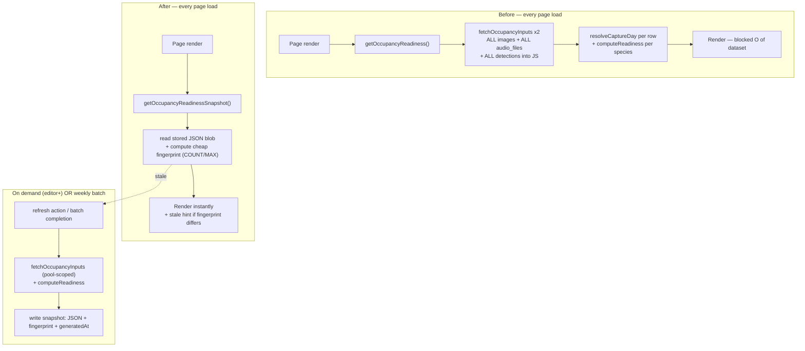

# perf: Snapshot occupancy readiness + on-demand refresh

## Summary

The `/ocupacion` page recomputes the entire data-readiness report **live on every
page load**, and that recompute scales linearly with the total number of images,
audio files, and verified detections in the BioChoco project — so it gets slower
every time a deployment is added or verified. This plan moves that computation
off the render path: the readiness report is stored as a **snapshot** (with the
timestamp it was generated), the page renders instantly from the snapshot, and an
editor/admin **refresh button** recomputes it on demand. A cheap data
**fingerprint** lets the page detect when underlying data has changed since the
snapshot and prompt a refresh. Two secondary wins: the shared fetch is scoped to
the BioChoco project in SQL (so the recompute itself materializes far less), and
the weekly modeling batch refreshes the snapshot automatically.

---

## Problem Frame

`src/app/ocupacion/page.tsx` is an async Server Component that `await`s
`getOccupancyReadiness()` before it can render. That action (`src/app/ocupacion/actions.ts:68`)
calls `fetchOccupancyInputs("camera")` and `fetchOccupancyInputs("audio")`
(`src/lib/occupancy/fetch.ts:260`), each of which:

- Pulls **every row** of `biochoco_images` (camera) / `audio_files` (audio) into
  Node with no project filter — `SELECT deployment_id, filename, exif_timestamp,
  file_modified FROM biochoco_images` — then runs `resolveCaptureDay()`
  (regex + `Date` construction) per row to derive per-site survey windows.
- Pulls **every** verified/corrected camera identification (joined
  identifications→detections→images) / matching audio identification, and
  date-parses each again.
- Runs the recording-schedule subsample pass over all audio files.
- Rebuilds a per-species site×occasion matrix and re-runs the eligibility gate
  for every species (`computeReadiness`, `src/lib/occupancy/readiness.ts:79`).

The DB is ~780 MB. This is an O(images + detections + audio files) full
materialization plus per-row JS work on **every visit**, blocking SSR. The two
other load-time queries (`getLatestOccupancyRun`, `listSpeciesModelStatus`) are
cheap indexed lookups by `runId` and are **not** the problem.

The readiness numbers were made live intentionally, so the field team can watch
counts cross the eligibility thresholds as verification proceeds (see origin:
`docs/brainstorms/2026-07-03-occupancy-modeling-requirements.md`). This plan
preserves that intent behind an explicit refresh + a "new data available" hint,
rather than paying the full cost on every load.

**Blast radius is narrow.** `getOccupancyReadiness` is consumed only by the page
(confirmed by grep). `fetchOccupancyInputs`'s real callers are
`getModelInputSample` (per-species, on demand — acceptable cost) and the batch
(`build-run.ts`); the SQL scoping change (U2) benefits both and changes no
results. The habitat-audit API route (`src/app/api/ocupacion/habitat-audit/route.ts`)
does **not** call `fetchOccupancyInputs` — it independently re-declares the same
BioChoco camera-pool filter in its own query, so U2 does not touch it (the two
pool definitions stay separately maintained; results already match).

---

## Requirements

- **R1** — The `/ocupacion` page must render without performing the full
  readiness recompute; it reads a stored snapshot instead.
- **R2** — The page shows when the snapshot was last generated ("última
  actualización: …"), mirroring the existing model-run control UX.
- **R3** — Editors and admins (`camera-trap` role ≥ editor) can refresh the
  snapshot from a button; the recompute runs and re-stores the snapshot.
- **R4** — The page detects, via a cheap data fingerprint, that underlying data
  has changed since the snapshot and surfaces a "hay datos nuevos — actualizar"
  hint. It must catch: new sites, newly verified/verified_empty deployments,
  exclusion toggles, and new verified/corrected detections.
- **R5** — The staleness check must **not** reintroduce the expensive full
  materialization; it uses aggregate COUNT/MAX queries only.
- **R6** — `fetchOccupancyInputs` scopes its image / audio-file / detection
  queries to the BioChoco project pool in SQL, so non-BioChoco rows are never
  materialized. Results for all existing callers are unchanged.
- **R7** — The weekly modeling batch refreshes the readiness snapshot on
  successful completion.
- **R8** — Cold start (no snapshot yet) renders instantly with a "sin datos —
  presione Actualizar" state; it never blocks on a live compute.

---

## Key Technical Decisions

- **KTD1 — Store the whole `OccupancyReadinessResult` as JSON in a new
  single-row-per-config table.** The result shape (`ReadinessReport` ×2 + dropped
  counts + date anomalies + subsample report + `generatedAt`) is entirely
  JSON-serializable (all strings/numbers — verified). Storing the serialized blob
  avoids reshaping the page consumer: the page destructures the same object it
  does today. New table `occupancy_readiness_snapshots` keyed by stream-pair
  config (binWidth + confidenceThreshold), holding the JSON, the fingerprint, and
  `generatedAt`. Rationale: a normalized per-species table would add a
  reassembly step for zero benefit — the snapshot is read whole, always.

- **KTD2 — Cheap fingerprint = a handful of aggregate COUNT/MAX queries over the
  BioChoco pool, hashed to a short string.** Signals: (a) camera pool size +
  MAX(id) of verified/verified_empty non-`excluded_camera` BioChoco deployments;
  (b) same for the audio pool (`excluded_audio`); (c) COUNT + MAX(id) of
  `biochoco_images` in the pool (new images extend windows); (d) COUNT + MAX(id)
  of `audio_files` in the pool; (e) COUNT of verified/corrected camera
  identifications in the pool; (f) COUNT of audio identifications matching the
  confidence/verified predicate in the pool. These are index scans with **no JS
  materialization and no date parsing** — the dominant cost today. Concatenate
  into a stable fingerprint string; store with the snapshot; recompute + compare
  on load. **Execution-time measurement required** (see Risks): if the
  pool-scoped joins for (e)/(f) prove costly on the 780 MB DB, fall back to the
  global `COUNT(*), MAX(id)` over the identification tables as a cheaper proxy
  (over-counts across projects but still flips on every verification).

- **KTD3 — Refresh is a foreground server action gated at `editor`.** Per the
  decision, `requirePermission("camera-trap", "editor")` (role hierarchy in
  `src/lib/auth.ts`). It recomputes the snapshot synchronously within the action
  and returns; the client shows a pending state and `router.refresh()`es on
  success — the same pattern as `triggerOccupancyRun` in `run-control.tsx`,
  except this runs inline (seconds) rather than enqueuing a background job.

- **KTD4 — The page never computes readiness live.** `getOccupancyReadiness`'s
  live path is retained only as the internal implementation of the refresh /
  batch snapshot-write; the page calls a new read-only `getOccupancyReadinessSnapshot()`
  that returns the stored blob + a `stale` flag from the fingerprint comparison.
  This guarantees R1/R5/R8 structurally — there is no code path from page render
  to the full materialization.

- **KTD5 — Batch writes the snapshot from its own already-fetched inputs when
  feasible.** The weekly build (`runOccupancyBuild`) already calls
  `fetchOccupancyInputs` per stream. Preferred: compute + store the readiness
  snapshot from those inputs after the run is marked completed, avoiding a second
  fetch. Acceptable fallback: call the refresh routine from `processor.ts` after
  the job completes (one extra fetch, still off the page path). Exact wiring is
  an implementation detail (see U6).

---

## High-Level Technical Design

Load path today vs. after this plan:

*Directional — the render path (B) does the cheap read + fingerprint only; the
expensive compute (C) happens exclusively on refresh or batch completion.*

---

## Implementation Units

### U1. Snapshot storage table

**Goal:** A table to hold the serialized readiness snapshot, its fingerprint, and
generation time.

**Requirements:** R1, R2.

**Dependencies:** none.

**Files:**
- `src/db/schema.ts` (add `occupancyReadinessSnapshots` table near `occupancyRuns`, ~line 1215)
- `scripts/push-schema.mjs` (add `CREATE TABLE IF NOT EXISTS occupancy_readiness_snapshots`)

**Approach:** Columns: `id` (pk), `bin_width_days` (int), `audio_confidence_threshold`
(real), `result_json` (text — the serialized `OccupancyReadinessResult`),
`fingerprint` (text), `generated_at` (timestamp), `generated_by` (text, nullable),
`created_at` (timestamp default `unixepoch()`). No enum columns, so no SQLite
CHECK needed (avoids the `text({ enum })` table-recreation gotcha). Follow the
`occupancyRuns` definition style. Add an index on `(bin_width_days, audio_confidence_threshold)`
if lookups warrant it; a single active config (the defaults) is the norm, so
"latest by `generated_at`" is the read pattern.

**Patterns to follow:** `occupancyRuns` table in `src/db/schema.ts:1185`; existing
`CREATE TABLE IF NOT EXISTS` blocks in `scripts/push-schema.mjs`.

**Test scenarios:**
- Test expectation: none — pure schema/DDL. Verified indirectly by U3/U4 tests
  writing and reading rows.

**Verification:** `node scripts/push-schema.mjs` (via `docker compose exec portal …`)
creates the table idempotently; a manual insert + select round-trips the JSON.

---

### U2. Scope `fetchOccupancyInputs` queries to the BioChoco pool

**Goal:** Stop materializing non-BioChoco `biochoco_images` / `audio_files` /
identifications; push the project scope into SQL. Reduces the cost of every
recompute (refresh + batch) and of the per-species `getModelInputSample`.

**Requirements:** R6.

**Dependencies:** none (independent optimization; can land first).

**Files:**
- `src/lib/occupancy/fetch.ts`
- `tests/unit/` — new or existing occupancy fetch test (scope assertion)

**Approach:** The deployments query is already BioChoco-scoped
(`ct_project_id = (SELECT id FROM ct_projects WHERE name = 'BioChoco')`). Add the
same scope to the image, audio-file, and detection queries via a
`deployment_id IN (SELECT id FROM biochoco_deployments WHERE ct_project_id = …)`
predicate (or join), so rows belonging to other camera-trap projects are never
returned. **Results must be identical** — today those rows are already dropped in
JS via `poolIds.has(siteId)`; this just moves the filter into SQL. Keep the
verified/exclusion filters as-is; the pool subquery narrows to the project, the
existing status/exclusion checks still apply where they do today (windows are
derived over the pool's images; detections over the pool). Confirm the
`deriveWindows`/`buildSites` interaction still sees the same deployment set.

**Patterns to follow:** the existing BioChoco scoping in the deployments query
(`src/lib/occupancy/fetch.ts:278`) and `getBiochocoCameraTrapProjectId` usage
referenced in the comment there.

**Test scenarios:**
- Happy path: with deployments from BioChoco + another ct_project seeded, camera
  and audio inputs contain only BioChoco-pool sites/detections (identical to the
  pre-change JS-filtered result).
- Edge: a verified BioChoco deployment with zero images still appears as a
  `verified_empty` absence site (window fallback path unaffected).
- Edge: an image whose `deployment_id` belongs to another project is not loaded
  (assert via a spy/row-count that the scoped query excludes it).
- Regression: `getModelInputSample` for a known species returns the same cohort
  size and matrix as before the scoping change.

**Verification:** unit tests pass; `npm run test:run` for the occupancy suite;
spot-check that camera/audio `nSites` on a seeded fixture is unchanged.

---

### U3. Snapshot store + fingerprint library

**Goal:** Pure-ish helpers to (a) compute the cheap data fingerprint, (b)
serialize/deserialize the readiness result, (c) load the latest snapshot, (d)
save a snapshot.

**Requirements:** R2, R4, R5.

**Dependencies:** U1.

**Files:**
- `src/lib/occupancy/readiness-snapshot.ts` (new)
- `tests/unit/occupancy-readiness-snapshot.test.ts` (new)

**Approach:**
- `computeReadinessFingerprint(opts)` → runs the aggregate COUNT/MAX queries from
  KTD2, scoped to the BioChoco pool, and returns a stable short string. Keep each
  query documented with the change it detects.
- `loadLatestReadinessSnapshot(opts)` → the latest row for the config, returned as
  `{ result: OccupancyReadinessResult, fingerprint: string, generatedAt }` where
  `result` is the parsed `JSON.parse(result_json)` and `fingerprint` is the stored
  column (**not** a field on `result` — the result blob has no fingerprint member,
  so staleness must compare the stored column, not `result.fingerprint`). Returns
  `null` when no row exists.
- `saveReadinessSnapshot({ result, fingerprint, generatedBy, opts })` → **always
  inserts a new row** (snapshots accumulate as a lightweight refresh history;
  `loadLatestReadinessSnapshot` orders by `generated_at desc`). Drizzle timestamp
  columns are Unix **seconds** in raw scripts; in app code use the Drizzle
  `timestamp` mode (Date) per the singleton — mirror `occupancyRuns` writes.
- Keep the fingerprint queries in this module so the page action and batch share
  one definition of "what counts as a change".

**Patterns to follow:** raw `db.all(sql\`…\`)` aggregate style already in
`fetch.ts`; timestamp handling in `actions.ts` `occupancyRuns` reads/writes.

**Test scenarios:**
- Happy path: save then load returns a deep-equal `OccupancyReadinessResult`
  (JSON round-trip preserves numbers, strings, nested arrays, `generatedAt`).
- Fingerprint changes: seed baseline, snapshot; then (a) add a verified
  deployment, (b) toggle `excluded_camera`, (c) verify a new detection — each
  must produce a different fingerprint than the baseline.
- Fingerprint stable: re-running `computeReadinessFingerprint` with no data change
  returns the identical string (deterministic ordering, no timestamps in it).
- Edge: `loadLatestReadinessSnapshot` returns `null` when the table is empty
  (cold start).
- Edge: malformed/legacy `result_json` (e.g., truncated) is handled without
  throwing (returns null + logs), so a bad row can't break the page.

**Verification:** unit tests pass; fingerprint queries return in well under the
current full-recompute time on a representative DB (see Risks).

---

### U4. Server actions: read snapshot + refresh

**Goal:** A read-only action the page calls, and an editor-gated refresh action.

**Requirements:** R1, R3, R4, R8.

**Dependencies:** U3. (U2 is an independent optimization that can land before or
after U4 without changing U4's behavior — not a prerequisite.)

**Files:**
- `src/app/ocupacion/actions.ts`
- `tests/integration/occupancy-readiness-snapshot-actions.test.ts` (new)

**Approach:**
- `getOccupancyReadinessSnapshot(opts?)` → `requirePermission("camera-trap", "viewer")`;
  loads the latest snapshot via `loadLatestReadinessSnapshot` (which surfaces the
  stored `fingerprint` column); computes the current fingerprint; returns
  `{ snapshot: OccupancyReadinessResult | null, stale: boolean, currentFingerprint }`.
  `stale = loaded != null && loaded.fingerprint !== currentFingerprint` — comparing
  the **stored fingerprint column** against the freshly computed one, NOT a
  non-existent `result.fingerprint`. Never runs the full recompute.
- `refreshOccupancyReadiness(opts?)` → `requirePermission("camera-trap", "editor")`;
  runs the existing live computation (extract the body of today's
  `getOccupancyReadiness` into a shared `computeReadinessResult()` helper so the
  page action and batch reuse it), computes the fingerprint, saves the snapshot
  with `generatedBy = user.email`, returns the fresh result. Consider
  `recordEvent()` for the refresh (a user-triggered recompute) per the
  system-events convention — treat as one event per refresh, not per row.
- Refactor: today's `getOccupancyReadiness` live path becomes
  `computeReadinessResult(opts)` (pure of auth), called by `refreshOccupancyReadiness`
  and the batch (U6). The old exported `getOccupancyReadiness` can be removed once
  the page no longer calls it (confirm no other importers — grep showed none).

**Patterns to follow:** `ActionResult<T>` discriminated union; `requirePermission`
throwing-redirect pattern; `triggerOccupancyRun` structure in `actions.ts:180`.

**Test scenarios:**
- Happy path: `getOccupancyReadinessSnapshot` after a refresh returns the stored
  snapshot with `stale: false`.
- Stale path: refresh, then mutate data (add verified deployment) → next
  `getOccupancyReadinessSnapshot` returns `stale: true` with the snapshot still
  present.
- Cold start: with no snapshot, `getOccupancyReadinessSnapshot` returns
  `{ snapshot: null, stale: false }` and does not throw or run the heavy compute
  (assert the heavy fetch is not called).
- Permission: `refreshOccupancyReadiness` as a viewer is rejected (redirect/throw);
  as an editor succeeds and writes a row; as admin succeeds.
- Refresh correctness: the snapshot produced by `refreshOccupancyReadiness` equals
  what the old live `getOccupancyReadiness` produced for the same fixture
  (behavior-preservation of the extracted `computeReadinessResult`).

**Verification:** integration tests pass; manual: press refresh as editor →
snapshot row written, timestamp updates.

---

### U5. Page + snapshot control UI

**Goal:** Render `/ocupacion` from the snapshot; add a last-updated line, refresh
button (editor+), stale hint, and cold-start state.

**Requirements:** R1, R2, R3, R4, R8.

**Dependencies:** U4.

**Files:**
- `src/app/ocupacion/page.tsx`
- `src/app/ocupacion/readiness-snapshot-control.tsx` (new client component)
- `tests/unit/ocupacion-snapshot-control.test.tsx` (new, if the component has logic worth testing)

**Approach:**
- Page: replace the `getOccupancyReadiness()` call in the `Promise.all` with
  `getOccupancyReadinessSnapshot()`. When `snapshot` is null → render the
  cold-start card plus the control; do **not** render the stream sections. When
  present → render the existing `StreamSection`s from the stored result exactly as
  today (destructure the same fields), and pass `stale` + `generatedAt` +
  `isEditor` to the control.
- **Role-aware copy** (cold-start card and stale hint): the refresh button is
  editor/admin-only, so the copy must not tell a viewer to press a button they
  don't have. Mirror `RunControl`'s empty state, which states the condition
  without instructing an action.
  - Cold start, editor/admin: "Aún no se ha calculado la disponibilidad de datos.
    Presione «Actualizar»." — viewer: "Aún no se ha calculado la disponibilidad de
    datos." (no button reference).
  - Stale hint, editor/admin: "Hay datos nuevos desde la última actualización —
    actualizar." — viewer: "Hay datos nuevos desde la última actualización." (no
    call to action).
- `ReadinessSnapshotControl` (client): mirrors `RunControl` — shows "Última
  actualización: {generatedAt}" (when a snapshot exists; renders no timestamp
  placeholder in the cold-start/null case), a "Actualizar disponibilidad" button
  for editors/admins (calls `refreshOccupancyReadiness`, pending state,
  `router.refresh()` on success, surfaces `res.error` in red like `RunControl`),
  and the role-aware stale hint above using the amber styling already in
  `page.tsx`.
- Compute `isEditor` on the page like `isAdmin` is computed today
  (`user.permissions.some(... role editor/admin)` or `globalRole === super_admin`).
- The footer's `Generado:` line now reflects the snapshot's `generatedAt` (already
  in the stored result), not a live timestamp.

**Patterns to follow:** `RunControl` in `src/app/ocupacion/run-control.tsx`
(pending/`router.refresh()`/`job-started` pattern — though this action is inline,
not a background job, so no floating toast is needed); amber hint styling in
`page.tsx` date-anomaly block.

**Test scenarios:**
- Happy path (component): given `stale=false` + a `generatedAt`, renders the
  timestamp and no stale hint; editor sees the button, viewer does not.
- Stale: `stale=true` renders the amber "hay datos nuevos" hint.
- Role-aware copy: with `isEditor=false`, both the cold-start card and the stale
  hint render the condition-only variant (no "Presione «Actualizar»" / no
  "— actualizar" call to action); with `isEditor=true`, the imperative variant.
- Refresh interaction: clicking the button enters pending state and disables
  while in flight (mock the action).
- Cold start (page-level, if covered): null snapshot renders the empty-state card
  and the control, and does not render `StreamSection`s.
- Layout regression check (manual per project UI convention): no empty space /
  overflow when the stale hint appears/disappears.

**Verification:** load `/ocupacion` on `http://localhost:3003` — page renders
instantly from the snapshot; refresh as editor updates the timestamp; simulate a
data change and confirm the stale hint appears; confirm no layout regression.

---

### U6. Batch refreshes the snapshot on run completion

**Goal:** After the weekly modeling run completes, write a fresh readiness
snapshot so it stays current with no manual press.

**Requirements:** R7.

**Dependencies:** U3, U4 (the extracted `computeReadinessResult` helper).

**Files:**
- `src/lib/occupancy/build-run.ts` (preferred: snapshot from already-fetched inputs after completion) **or** `src/lib/occupancy/processor.ts` (fallback: call refresh routine after the job is marked completed)
- `tests/unit/` or `tests/integration/` — batch-writes-snapshot assertion

**Approach:** Preferred (KTD5): after `runOccupancyBuild` marks the run
`completed` (`build-run.ts:~529`), compute the readiness result and save a
snapshot with `generatedBy = "batch"`. If reusing the batch's already-fetched
`fetchOccupancyInputs` outputs is awkward given the run's control flow, use the
fallback: in `processor.ts`, after the job status is set to `completed`, call the
same `computeReadinessResult` + `saveReadinessSnapshot` path (one extra fetch —
still off the page render path). Wrap in try/catch so a snapshot-write failure
never fails an otherwise-successful modeling run (log + continue).

**Patterns to follow:** run-completion update at `build-run.ts:527`; post-run job
update in `processor.ts:56`.

**Test scenarios:**
- Happy path: running the batch to completion writes exactly one readiness
  snapshot row whose fingerprint matches the current data.
- Failure isolation: if `saveReadinessSnapshot` throws, the run still reports
  `completed` (snapshot error is swallowed + logged, not propagated).
- Freshness: after a batch run, `getOccupancyReadinessSnapshot` returns
  `stale: false`.

**Verification:** trigger a run (or unit-drive `runOccupancyBuild`); confirm a
snapshot row appears and the page shows it as current.

---

## Scope Boundaries

**In scope:** snapshot storage + read/refresh actions; page render from snapshot;
last-updated + refresh + stale hint UI; BioChoco-pool SQL scoping of the fetch;
batch snapshot refresh.

**Not in scope:**
- Changing the readiness **computation** itself (thresholds, windows,
  subsampling) — behavior is preserved exactly; only *when* it runs changes.
- The per-species pages (`getSpeciesModel`, `getModelInputSample`) and the
  cross-species synthesis — they read the model-run tables, not the readiness
  live compute; unaffected beyond the U2 speedup.
- The modeling run / `RunControl` — separate concern; left as-is (U6 only *adds*
  a snapshot write at the end).

### Deferred to Follow-Up Work
- **Event-driven snapshot invalidation** (mark stale on each verification /
  exclusion / sync mutation). Considered and set aside in favor of the cheap
  fingerprint per the scoping decision — more precise but invasive across many
  mutation sites. Revisit only if the fingerprint's aggregate queries prove too
  slow even after U2.
- **Auto-refresh on a schedule** independent of the weekly batch (e.g., a nightly
  readiness cron). Not needed if the batch + manual refresh + stale hint suffice.

---

## Risks & Dependencies

- **Fingerprint query cost (primary risk).** COUNT/MAX over the pool are index
  scans, far cheaper than today's JS materialization, but on a 780 MB DB the
  pool-scoped identification joins (KTD2 e/f) should be **measured** during U3. If
  a join is slow, fall back to the global `COUNT(*), MAX(id)` proxy over the
  identification tables. Mitigation is built into KTD2; verify empirically before
  shipping.
- **Host-vs-container DB access.** Run `push-schema.mjs` and any data-touching
  test scripts via `docker compose exec portal …`, never bare host `node`/`tsx`
  against `data/portal.db` while the container holds it (SQLite corruption risk —
  see project gotchas).
- **Serialization drift.** If `OccupancyReadinessResult` ever gains a non-JSON
  field (Date, Map), the stored blob breaks. Guard: U3 deserialize is defensive
  (null + log on parse failure), and the result type is asserted JSON-only today.
- **Fingerprint detects additions, not in-place edits.** The COUNT/MAX signals
  move when rows are added or a deployment enters/leaves the pool, but an
  *in-place* mutation leaves them unchanged: a QA editor trimming a deployment's
  survey window (`valid_start`/`valid_end`, which `buildSites` reads and which
  genuinely alters occasions/eligibility), re-correcting an already-verified
  detection's species, or an exclusion toggle round-trip. Those changes stay
  masked by the stale hint until the weekly batch or a manual refresh — the
  accepted backstop. R4's "must catch" list is the set the fingerprint covers;
  this bullet records what it does not.
- **Stale snapshot after schema/logic change.** If the readiness computation
  changes in a future PR, old snapshots reflect old logic until refreshed. The
  stale hint won't catch a *logic* change (only data changes). Acceptable: a
  deploy that changes computation should trigger a batch run / manual refresh;
  note in that future PR.

---

## Open Questions

- **Cold start on first deploy.** Should the deploy also seed an initial snapshot
  (e.g., via the batch or a one-time press), or is the empty-state card + editor
  refresh acceptable for the first load? Recommend: acceptable — an editor
  presses once, or the next weekly batch fills it. Defer unless the first-load
  empty state is undesirable.
- **`recordEvent()` on manual refresh.** Worth emitting a system event per manual
  refresh? Leaning yes (user-triggered recompute, low frequency) — confirm during
  U4.
