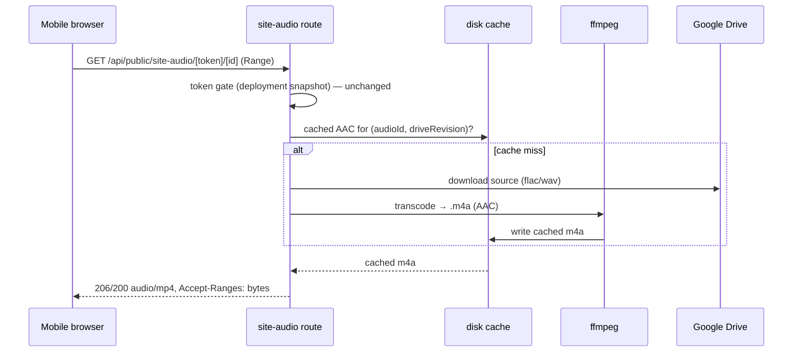

# feat: Farmer sharing pages — builder + public page refinement pass

## Summary

A refinement pass over the already-shipped landowner sharing feature, driven by field feedback after real landowners opened their pages on phones. Touches two surfaces:

- **The internal builder** (`PageBuilder`, "Personalizar página pública"): present all personalization sections expanded by default with inline descriptions/instructions, enforce a single "Fotos destacadas" section (and fix it not rendering), switch its image picker to the team's **starred** photos with a starred/all filter, and move the live preview into a **split-screen** layout so it stops getting lost below the controls.
- **The public farmer page** (`/public/biochoco/[token]`): a **full-bleed camera-trap hero** that replaces the current stacked header, "su tierra" instead of "su finca", the **"Sobre el proyecto BioChoco"** section rewritten and relocated to sit directly under the video, expanded **recordings** copy, a plain-language **conservation-status** explainer, a **habitat-metrics** explainer, **temperature metrics removed**, **desktop gallery arrows + image preloading**, **mobile tap-to-fullscreen** starred-photo gallery, and clearer **page-level share** buttons.

Plus a real bug fix: **the mobile "cannot play sound" error** — compressed clips are now FLAC (`audio/flac`), which iOS Safari cannot decode in `<audio>`. Fixed by serving a browser-universal AAC transcode of the featured clip.

The page-config data model (`src/lib/landowner/page-config.ts`), the token-gated media routes' security model, and the divulgation overview report are **reused as-is** — this is a UX/content/bugfix pass, not a data-layer rework.

---

## Problem Frame

The sharing feature works end-to-end but has accumulated rough edges that surfaced once landowners used it on phones and once the team used the builder in anger:

1. **Builder is opaque and misleading.** Sections carry no instructions, the "Fotos destacadas" block is silently repeatable (you can add several) yet may not render on the public page, its image picker draws from per-species "best photos" rather than the `starred` images the team actually curated, and the live preview sits below all the controls where it's easy to miss.
2. **Public page top reads like a debug frame.** The black camera-trap timestamp bar sits under a separate "BioChoco" logo header (see the reference image) — two stacked bars instead of one striking hero.
3. **Copy doesn't fit the audience.** "su finca" assumes every site is a farm (many aren't); the project blurb is stale/English; the recordings section doesn't explain what the audio *tells* us; habitat metrics are bare numbers with no explanation; conservation-status chips appear with no key; temperature metrics are shown despite known data problems.
4. **Gallery is hard to drive on desktop** (no arrows, no preloading) and **featured photos do nothing on tap** (no fullscreen, no all-photos gallery).
5. **Sharing is unclear** — only per-photo share exists; there's no obvious "share this page" affordance for WhatsApp.
6. **The audio is broken on the exact device landowners use.** FLAC clips fail to play in mobile Safari.

---

## Scope Boundaries

**In scope**
- Builder: all-sections-visible-with-instructions, single-featuredPhotos enforcement + render fix, starred image picker with filter, split-screen preview.
- Public page: full-bleed hero + header suppression on this route, copy changes ("su tierra", project blurb, recordings explainer), section reorder, conservation + habitat explainers, temperature removal, gallery arrows + preload, mobile featured-photo fullscreen gallery, page-level share.
- Bug fix: mobile-compatible featured-audio transcode + serving.

**Out of scope (non-goals)**
- The page-config schema/parser and token/media-route security model — reused unchanged (new picker action reuses the existing deployment-snapshot gate).
- The divulgation overview report (`/public/biochoco-overview`, `/admin/biochoco-overview`) — only its shared intro copy string may be referenced.
- Batch re-transcoding all audio in the library — the fix transcodes only the single curated featured clip, on demand + cached.
- A dedicated Instagram integration — not feasible on web (see KTD-6).

### Deferred to Follow-Up Work
- Per-section reordering UX polish beyond the current move up/down.
- Preloading in the inline swipe lightbox (`species-lightbox.tsx`) — U10 targets the arrow-navigated sub-route gallery + adds arrows to the lightbox; a shared preloader can follow.
- Fixing the temperature *data* pipeline so the metric can return (this plan only hides it).
- Restyling the shared public footer.

---

## Key Technical Decisions

### KTD-1 — "All sections by default" = render every personalization section as an always-visible instructed card
The builder today gates sections behind an "add block" menu (`ADDABLE` at `page-builder.tsx:44-49`) and shows only an uppercase label per card. Rather than an accordion, present the three personalization sections (Mensaje, Fotos destacadas, Grabación) as **always-present cards**, each with a one-line description + short usage instruction under its header. The hero picker stays its own card. This matches the user's "expand out all the personalization sections by default" — nothing hidden, each explained. Blocks the user doesn't fill simply resolve to empty and don't render publicly (existing resolver behavior). Move up/down/delete controls remain.

> Open question OQ-1 records the one ambiguity: whether "always present" should pre-seed the saved config or just render the cards. Default: render all cards; only persist a block once the user gives it content.

### KTD-2 — "Fotos destacadas" becomes a singleton
Enforce at three layers so it can't regress: the builder's add path refuses a second `featuredPhotos` (or the card is simply always-single per KTD-1), the sanitize step in `updateSitePageConfig` keeps only the first `featuredPhotos` block, and the resolver renders only one. This also removes the "multiple sections" confusion the user reported.

### KTD-3 — Featured-photo picker draws from `starred` images, with a starred/all filter
Add a picker action that returns the site's **starred** images (`images.starred = true`, scoped to the token's deployment snapshot — same gate as `fetchSitePhotoOptions`), defaulting the builder to "Solo destacadas ★". A filter toggle switches to "Todas", which surfaces the existing per-species best-photo pool (`fetchSitePhotoOptions`) — *not* every raw deployment image, which would be thousands (confirmed with user). When a site has zero starred images, the picker auto-falls back to "Todas" so the section is never empty. **This is a curation change only — it does NOT fix the "not showing on the public page" bug.** The current picker (`fetchSitePhotoOptions`) already scopes its ids through `activeTokenDepIds(siteId)` — the *same* `deployment_ids` snapshot the resolver re-validates against (`resultados/actions.ts:1306`) — so per-species ids survive re-validation and starred ids would validate identically. U2 diagnoses the non-render independently (see U2); the likely real cause is the save/singleton path or the `featuredPhotos` render branch, not id validation.

### KTD-4 — Split-screen builder layout
Replace the stacked "controls then iframe preview" column (`page-builder.tsx:187-378`) with a two-column layout on desktop (`lg:`): controls left, sticky preview iframe right. On mobile it collapses back to stacked (preview under controls) since there's no room for two columns. Reuses the existing same-origin iframe + `previewKey` refresh mechanism unchanged.

### KTD-5 — Full-bleed hero replaces the stacked header on this route only
The "BioChoco" logo bar lives in the shared public chrome layout (`src/app/public/(chrome)/layout.tsx:11-22`), so removing it globally would hit other public pages. **Hiding the header alone is not sufficient** — the same layout wraps every child in `<main className="flex-1 px-4 py-6"><div className="mx-auto max-w-5xl">` (`layout.tsx:25-26`), which caps width at `max-w-5xl` and adds top padding; the hero's current `-mx-4 sm:-mx-6` escapes horizontal padding but not the width cap or `py-6`. A Server-Component layout also can't branch on pathname without `headers()`/a client wrapper. Therefore the committed approach is to **relocate the biochoco token route out of the `(chrome)` route group into its own full-bleed layout** (no `max-w-5xl`, no `px-4 py-6`, no header bar), pull the FCAT/BioChoco wordmark into the hero scrim overlay, and **re-add a footer** in the new layout (the `(chrome)` footer no longer applies). Other public routes (apply, report, overview) keep the chrome header/footer unchanged. See the High-Level Technical Design section for the target composition.

### KTD-6 — Share is native-first + explicit WhatsApp + copy-link; no Instagram button
Web has no "share to Instagram feed" intent — only the device native share sheet reaches Instagram (and only on mobile). So the new **page-level** share affordance is: a primary "Compartir" button using the Web Share API (surfaces WhatsApp/Instagram/etc. on phones), plus an explicit **WhatsApp** button (`wa.me/?text=<msg+url>`) for the common case, plus **copy-link**, with graceful desktop fallback. Mirrors the existing per-photo `PhotoShareButton` logic (`src/components/photo-share-button.tsx`) but shares the *page URL*, not an image.

### KTD-7 — Mobile audio fix: serve an AAC (`audio/mp4`) transcode of the featured clip
FLAC (`audio/flac`, set at `audio-compression-core.ts:454,702`) is unplayable in iOS Safari `<audio>`. ffmpeg is present in the image (`Dockerfile:51,75`). Transcode **only FLAC** clips to AAC/`.m4a` **on demand and cache on disk**, then serve the cached file from the token-gated route with proper Range support (Range from a local file is trivial and iOS-friendly). `Content-Type: audio/mp4`. **WAV/AAC/MP3 pass through unchanged** — they already play in iOS Safari, so transcoding them adds cost without fixing anything (the bug is FLAC-specific). Guardrails, all load-bearing:

- **Transcode only the pageConfig-selected featured audio id, not any recording in the deployment snapshot.** The route gate permits *any* recording in the token's deployments (potentially thousands); an amplification vector (leaked token iterating audioIds to force thousands of ffmpeg runs + cache writes — the 2026-05-25 disk-full failure class) is closed by transcoding/caching *only* the id equal to the site's `pageConfig` featured audio. Non-featured ids stream through as today (no transcode).
- **Single-flight + atomic write.** iOS Safari fires several concurrent Range requests on `<audio>` load; without coordination each cache-miss request would independently download + spawn ffmpeg and race to write the same path, and a later reader could serve a half-written `.m4a` (re-triggering the very playback error this fixes). Use an in-process single-flight (one transcode per key; concurrent callers await it) and write to a temp file then `rename()` into place.
- **Cache key = `audioId` alone** (the featured id changes when the team swaps the clip; compression pins revisions), avoiding an extra per-request Drive `revisions` call.
- **Explicit cache size cap with LRU eviction** on the transcode cache dir — a bounded budget, not "if needed."

Mirrors the spawn-a-runner pattern in `src/lib/flac-runner.ts` but is a single-file, request-time transcode with a bounded disk cache — no job queue. The token/deployment gate runs **before** cache lookup, unchanged (the cache key has no token component, which is safe only because the gate precedes the serve — do not reorder).

### KTD-8 — Temperature removed from public, habitat + conservation get explainers
Temperature currently still renders its heading + summary stat cards on the public variant (`temperature-overlay.tsx` via `site-results-content.tsx:134-139`). Remove it from the public variant entirely (guard on `variant==="public"`). Add a short plain-language explainer block above the habitat stat grid (`habitat-section.tsx`) explaining what canopy cover / height / understory / slope / edge distance *mean* for the landowner, and a compact conservation-status **key** near the species carousel explaining the IUCN chips (labels already in `iucn-chip.ts:20-33`).

---

## High-Level Technical Design

### Public page section order — current vs target

```mermaid
flowchart TB
  subgraph Current
    A1[Chrome header bar: BioChoco logo] --> A2[Hero image + title overlay]
    A2 --> A3[StoryStat count-up] --> A4[Video / coming-soon]
    A4 --> A5[content blocks in config order:\nnote / featuredPhotos / featuredAudio]
    A5 --> A6[projectContext force-appended LAST]
    A6 --> A7[SpeciesCarousel] --> A8[Habitat] --> A9[Temperature] --> A10[ContactForm]
  end
  subgraph Target
    B1[Full-bleed hero to top of viewport\nlogo pulled into overlay] --> B2[StoryStat]
    B2 --> B3[Video / coming-soon]
    B3 --> B4[projectContext: 'Sobre el proyecto' — rewritten, moved here]
    B4 --> B5[content blocks: note / featuredPhotos / featuredAudio]
    B5 --> B6[SpeciesCarousel + conservation-status key]
    B6 --> B7[Habitat + explainer]
    B7 --> B8[ContactForm]
    B8 -.temperature removed.-> B8
  end
```



*Directional — the exact block boundaries are the implementer's call; the load-bearing changes are: header folded into hero, projectContext promoted to just-under-video, temperature gone, two explainers added.*

### Builder layout — split screen (desktop)

```
 ┌──────────────────────────────┬─────────────────────────┐
 │  Controls (scroll)           │  Live preview (sticky)  │
 │  ─ Hero picker + instruction │   ┌───────────────────┐ │
 │  ─ Mensaje    + instruction  │   │  iframe: /public/ │ │
 │  ─ Fotos destacadas ★filter  │   │  biochoco/[token] │ │
 │  ─ Grabación  + instruction  │   │  (previewKey)     │ │
 │  ─ [Guardar]                 │   └───────────────────┘ │
 └──────────────────────────────┴─────────────────────────┘
   mobile: single column, preview below controls (unchanged)
```

### Featured-audio request path (bug fix)



---

## Implementation Units

Grouped into three phases. Units are dependency-ordered; U-IDs are stable. *(Exception: U2 and U3 are co-developed — U2's non-render diagnosis is independent of U3, so listing U3 after U2 is fine.)*

### Phase 1 — Builder

### U1. Present all personalization sections by default, each with description + instructions

**Goal:** The builder shows the three personalization sections (Mensaje, Fotos destacadas, Grabación) as always-visible cards with a one-line description and short usage instruction each; nothing is hidden behind an add-menu.
**Requirements:** Feedback item "expand out all the personalization sections by default and add descriptions and instructions to each one."
**Dependencies:** none.
**Files:**
- `src/app/biochoco/resultados/[siteId]/page-builder.tsx` (card headers `:270-303`, `ADDABLE`/add flow `:44-49,142-144`, block editors `:397-567`)
- `src/app/biochoco/resultados/[siteId]/__tests__/page-builder.test.tsx` (create if absent)
**Approach:** Render the personalization sections as a fixed, always-present set of instructed cards rather than gating them behind "add block". Add a `description`/`instruction` string per section type, shown under the card label. Keep move/delete controls. Per KTD-1, only persist a section to the saved config once it has content, so an untouched card doesn't pollute the resolved public page. If retaining an add/remove affordance, default every section visible on load.
**Patterns to follow:** existing per-block card structure at `page-builder.tsx:269-314`; helper `<p>` style already used for the (retired) projectContext editor at `:560-566`.
**Test scenarios:**
- Renders all three personalization section cards on initial load with no saved config.
- Each section card shows its description and instruction text.
- A section left empty is not written to the saved config on Guardar (Covers the KTD-1 "don't pollute resolved blocks" rule).
- Filling a section's content persists exactly one block of that type.

### U2. Enforce a single "Fotos destacadas" section and fix the public-page non-render

**Goal:** Only one featuredPhotos block can exist; a populated featuredPhotos block reliably renders on the public page.
**Requirements:** "seems like you can add multiple fotos destacadas sections… should only have one and it doesnt seem like that's showing up in the final page either."
**Dependencies:** U1 (card model). *(U2 and U3 are co-developed but U3 is not a prerequisite — the starred switch is curation, not the render fix; see the note under the "Units are dependency-ordered" line.)*
**Files:**
- `src/app/biochoco/resultados/[siteId]/page-builder.tsx` (add path)
- `src/app/biochoco/resultados/actions.ts` (sanitize loop `:1152-1179`, resolver `:1286-1354`, featuredPhotos validation `:1298-1310`)
- `src/lib/landowner/page-config.ts` (parser `:51-80` — optional singleton normalization on parse)
- `src/app/biochoco/resultados/__tests__/page-config-singleton.test.ts` (create)
**Approach:** Guarantee singleton in the builder (only one card per KTD-1) and defensively in `updateSitePageConfig` sanitize (keep first featuredPhotos, drop the rest). Diagnose the non-render **independently of U3** — the picker and resolver read the same deployment snapshot, so id re-validation is not the cause. Trace the two remaining suspects: (a) the save/singleton path — does `updateSitePageConfig` persist the `featuredPhotos` block at all, and does the sanitize loop drop it or empty its `imageIds`? and (b) the render path — does the resolved block reach `ContentBlock`'s `featuredPhotos` branch (`public-site-shell.tsx:215-250`) with a non-empty `imageIds`? Fix whichever is dropping the block.
**Execution note:** Start by reproducing the non-render against a real token in dev before changing the resolver — confirm the empty-block hypothesis rather than assuming it.
**Test scenarios:**
- Config with two featuredPhotos blocks → sanitize keeps exactly one.
- Parser given duplicate featuredPhotos → normalized to one (if parser-level guard chosen).
- featuredPhotos with valid starred image ids resolves to a non-empty ResolvedContentBlock.
- featuredPhotos whose ids are NOT in the deployment snapshot resolves to empty and is not rendered (documents current guard behavior).

### U3. Featured-photo picker: starred images with a starred/all filter

**Goal:** The picker defaults to the site's starred images with a toggle to "Todas" (the per-species best-photo pool); auto-falls back to "Todas" when no starred images exist.
**Requirements:** "images are those just the starred images? … filter to see all images or just the starred images - starred images by default, in case a deployment doesn't have a starred image."
**Dependencies:** none (U2 consumes it).
**Files:**
- `src/app/biochoco/resultados/actions.ts` (new `fetchSiteStarredPhotoOptions` beside `fetchSitePhotoOptions` `:1043-1061`; reuse `activeTokenDepIds` gate)
- `src/app/biochoco/resultados/[siteId]/page-builder.tsx` (featuredPhotos editor `:504-558` — add filter toggle + fallback)
- `src/db/schema.ts` (reference `images.starred/starredAt` `:313-317` — read only)
- `src/app/biochoco/resultados/__tests__/starred-photos.test.ts` (create)
**Approach:** New action selects `images` where `starred = true` and `deploymentId IN (token snapshot)`, ordered by `starredAt`, returning the same shape as `fetchSitePhotoOptions`. Builder editor gains a segmented "Solo destacadas ★ / Todas" control; on mount, if the starred set is empty, default to "Todas". "Todas" continues to call `fetchSitePhotoOptions` (per-species best) — not raw deployment images.
**Patterns to follow:** `fetchSitePhotoOptions` gating + return shape (`:1043-1061`); `fetchSpeciesForDeployments` best-photo query (`:457-521`).
**Test scenarios:**
- Starred action returns only starred images within the deployment snapshot; excludes starred images from other sites' deployments (cross-site gate).
- Ordered by starredAt.
- Empty starred set → builder defaults the filter to "Todas".
- Selecting from "Todas" still enforces the 6-image cap.

### U4. Split-screen builder layout with sticky preview

**Goal:** On desktop the live preview sits beside the controls (sticky), not below them; mobile stays stacked.
**Requirements:** "move the preview to be above the builder tools or to the side… maybe can split the screen in half?"
**Dependencies:** U1 (final control layout).
**Files:** `src/app/biochoco/resultados/[siteId]/page-builder.tsx` (`:187-378`), possibly `src/app/biochoco/paginas-publicas/[siteId]/builder-shell.tsx`
**Approach:** Wrap controls + preview in a `lg:grid lg:grid-cols-2` (or flex) container; make the preview column `lg:sticky lg:top-N` so it stays visible while scrolling controls. Preserve the `previewKey` refresh-on-save and the same-origin relative iframe src. Collapse to single column below `lg`.
**Test expectation:** none — pure layout. Verify manually per the UI Development convention (no overflow/alignment regression at mobile + desktop breakpoints).

### Phase 2 — Public page structure & copy

### U5. Full-bleed camera-trap hero replacing the stacked top header

**Goal:** On the biochoco token page, the camera-trap hero runs edge-to-edge to the top of the viewport with site identity/logo folded into the overlay; the separate "BioChoco" chrome bar no longer stacks above it.
**Requirements:** "i don't love the header at the top… how can we make this look nicer? … instead of the header the camera trap picture just takes up the whole top part."
**Dependencies:** none.
**Files:**
- `src/app/public/(chrome)/layout.tsx` (`:11-26` — the header bar AND the `max-w-5xl`/`px-4 py-6` main wrapper that caps the hero)
- new `src/app/public/biochoco/[token]/layout.tsx` + relocated route files (move `biochoco/[token]/**` out of the `(chrome)` group into a full-bleed layout)
- `src/app/public/(chrome)/biochoco/[token]/public-site-shell.tsx` (hero `:65-121`)
**Approach:** Relocate the token route out of the `(chrome)` group into its own full-bleed layout (no `max-w-5xl`, no `px-4 py-6`, no header bar), so the hero reaches the viewport top edge-to-edge (KTD-5). Pull the FCAT/BioChoco wordmark + logo into the hero scrim overlay so branding is preserved. Re-add a footer in the new layout. Keep `apply`/`report`/`overview` on the unchanged `(chrome)` layout.
**Execution note:** Verify the relocation doesn't drop the header/footer from `apply`, `report`, or `overview`, and that the token URL (`/public/biochoco/[token]`) is unchanged after the move (route-group folders don't affect the URL path).
**Test expectation:** none — layout/visual. Manually verify header intact on other public routes; hero reaches viewport top on the token page (mobile + desktop). Consider a lightweight design pass via the frontend-design skill for the overlay composition.

### U6. Copy + reorder: "su tierra", rewritten "Sobre el proyecto" moved under the video

**Goal:** "Esto vive en su finca" → "Esto vive en su tierra"; the "Sobre el proyecto BioChoco" section uses the user-approved Spanish copy and renders directly below the video insert.
**Requirements:** "change este vive en su finca to este vive en su tierra"; "move Sobre el proyecto BioChoco [new Spanish copy] to be right below the video insert."
**Dependencies:** none.
**Files:**
- `src/app/public/(chrome)/biochoco/[token]/public-site-shell.tsx` (eyebrow `:78,:103`; video `:129-149`; projectContext `:282-314`; block order `:152-159`)
- `src/app/biochoco/resultados/actions.ts` (projectContext force-append `:1337-1354`, blurb source `:1483`)
- `src/app/public/biochoco-overview/content.ts` (`es.learn.intro` `:150-151`) or a landowner-specific copy constant
**Approach:** Replace both "su finca" eyebrow strings with "su tierra". Promote the projectContext block to render immediately after the video (before the config-ordered content blocks) — adjust the shell render order and/or the resolver so projectContext lands there instead of last. Set the blurb to the user-provided Spanish text (see OQ-2 for the 90%-vs-95% wording). Prefer a landowner-scoped copy constant over mutating the shared overview `es.learn.intro` (which currently holds English and feeds the overview page).
**Test scenarios:**
- Resolved blocks place projectContext immediately after the video/before other content blocks (assert order in the resolver output or shell composition).
- The two hero eyebrow strings (`:78`, `:103`) no longer read "su finca". *(The recordings heading in U7, the featured-photos caption `:224`, and alt text `:236` intentionally keep "su finca" for now — the requirement only names the eyebrow; do not assert zero "su finca" shell-wide or those will falsely fail.)*

### U7. Recordings section: explain what the audio reveals

**Goal:** The "Escuche una grabación de su finca" section explains what information the recordings provide (species presence, activity patterns, ecosystem health), beyond the one-line subtitle.
**Requirements:** "add more information about the recordings and what information can be obtained from it."
**Dependencies:** none.
**Files:** `src/app/public/(chrome)/biochoco/[token]/public-site-shell.tsx` (featuredAudio branch `:252-280`)
**Approach:** Add a short explanatory paragraph/bullet set under the existing heading/subtitle (`:261-268`) written for a non-technical landowner. Content-only; keep the native player.
**Test expectation:** none — static copy. Verify it renders only when a featuredAudio block is present.

### U8. Conservation-status (IUCN) explainer key

**Goal:** A compact, plain-language key explaining the conservation-status chips shown on species cards.
**Requirements:** "a section that explains the conservation status tags simply."
**Dependencies:** none.
**Files:**
- `src/app/public/(chrome)/biochoco/[token]/public-site-shell.tsx` (near SpeciesCarousel `:161-165`) or `species-carousel.tsx`
- `src/lib/landowner/iucn-chip.ts` (labels/colors `:20-44` — reuse)
**Approach:** Render a small legend (chip swatch + Spanish label + one-line meaning) for the statuses that actually appear on this site's species, using `iucnChip()` output so colors/labels stay consistent. Keep it simple: e.g., "En peligro — esta especie corre riesgo de desaparecer."
**Test scenarios:**
- Legend lists only statuses present among the site's species (no empty/DD chips, matching `iucnChip` returning null for DD/unknown).
- Each listed status shows the same label/color as the carousel chip.

### U9. Habitat explainer + remove temperature metrics from public

**Goal:** A short explainer accompanies the habitat stat grid; the temperature section no longer appears on the public page.
**Requirements:** "explanation of the habitat metrics and remove the temperature metrics for now since there are some issues with the data."
**Dependencies:** none.
**Files:**
- `src/app/biochoco/resultados/[siteId]/site-results-content.tsx` (public composition `:124-139`)
- `src/app/biochoco/resultados/[siteId]/habitat-section.tsx` (stat grid `:98-137`)
- `src/app/biochoco/resultados/[siteId]/temperature-overlay.tsx` (rendered at `site-results-content.tsx:134-139`)
- `src/app/biochoco/resultados/[siteId]/__tests__/site-results-public.test.tsx` (create/extend)
**Approach:** Guard the temperature render so it does not appear when `variant==="public"`. Add a plain-language explainer above the habitat StatCard grid describing what each metric means for the landowner (canopy cover/height, understory, slope, distance to edge, disturbances). Leave the internal variant untouched (temperature still shows internally).
**Test scenarios:**
- Public variant renders no temperature heading/stat cards.
- Internal variant still renders temperature (no regression).
- Public variant renders the habitat explainer above the stat grid.

### Phase 3 — Gallery, share, and the audio bug

### U10. Desktop gallery left/right arrows + image preloading

**Goal:** The species gallery is navigable with visible prev/next arrows on desktop, and adjacent images preload for instant paint.
**Requirements:** "have the left and right arrows pop up to go to the next and previous pictures… pre-load the images like we do in the camera trap annotation page."
**Dependencies:** none.
**Files:**
- `src/app/public/(chrome)/biochoco/[token]/species-lightbox.tsx` (swipe track `:144-173` — add arrows)
- `src/app/public/(chrome)/biochoco/[token]/especies/[slug]/gallery-client.tsx` (already has arrows `:236-255`; add preloading)
- `src/lib/annotation-prefetch.ts` (reuse `preloadImage` `:83-114`, `computePrefetchWindow` `:127-154`)
**Approach:** Add hover-revealed ChevronLeft/ChevronRight controls to the inline `species-lightbox` (arrows only — no preloading here; the swipe-lightbox preloader is deferred per Scope Boundaries). Scope **preloading to the arrow-navigated sub-route gallery (`gallery-client.tsx`) only**: on index change, preload the next (and previous) image URLs via `preloadImage` against the public image proxy. The proxy already sets `Cache-Control: public, max-age=31536000, immutable` (`site-images/[token]/[id]` route :215, confirmed), so the prefetch warms the cache as the annotation preloader relies on. Give every icon-only control a Spanish `aria-label` (arrows: "Imagen anterior" / "Imagen siguiente").
**Patterns to follow:** `image-annotation-client.tsx:267-281` (next/prev preload wiring); `annotation-prefetch.ts` sliding-window.
**Test scenarios:**
- Lightbox shows prev/next arrows on desktop with `aria-label`s; arrow click advances the index; arrows hidden/disabled at ends.
- On index change in `gallery-client.tsx`, the adjacent image URL(s) are requested (preload invoked) — assert `preloadImage` called with the expected next/prev URLs.
- Keyboard ArrowLeft/ArrowRight still navigate (no regression in `gallery-client.tsx`).

### U11. Mobile: tap a featured photo → fullscreen gallery of all starred photos

**Goal:** On mobile, tapping a "Fotos destacadas" tile opens a fullscreen gallery of all the featured/starred photos (swipeable), not a dead tile.
**Requirements:** "when you click on a foto destacada on mobile it should pop up full screen and go to a gallery of all the starred pictures."
**Dependencies:** U3 (starred set), U10 (gallery/arrow pattern).
**Files:**
- `src/app/public/(chrome)/biochoco/[token]/public-site-shell.tsx` (featuredPhotos branch `:215-250` — add tap handler + tappable affordance)
- `src/app/public/(chrome)/biochoco/[token]/species-lightbox.tsx` (reuse as the fullscreen viewer, or a shared fullscreen gallery component)
**Approach:** The requirement is "a gallery of **all the starred pictures**", but the featuredPhotos block is a curated subset capped at 6 (U3). So seed the fullscreen viewer from the **full starred set** (the same public source the builder starred from — expose it to the public page via the token-gated site-images route, ordered like the picker), starting at the tapped image, rather than only the ≤6 block ids. Reuse the `SpeciesLightbox` fullscreen + swipe pattern (now with arrows from U10). Add a tappable affordance to each tile (a small expand/zoom glyph overlay + `cursor-zoom-in`) so users know it opens. Preserve the per-tile share button. Behavior is the same on desktop and mobile (fullscreen + arrows). Verify the reused fullscreen viewer traps focus while open and restores focus to the tapped tile on close (modal a11y). See OQ-3 if the starred set is large — cap or paginate the fullscreen gallery.
**Test scenarios:**
- Tapping tile N opens the fullscreen viewer starting at the corresponding starred image.
- The viewer contains the full starred set (not just the ≤6 block ids), in order.
- Each tile shows a visible tappable affordance (expand glyph / cursor).
- Close (backdrop/X/Escape) returns to the page (reusing lightbox close behavior).
- Works on both desktop and mobile (fullscreen viewer opens, arrows available).

### U12. Page-level share buttons (WhatsApp + native + copy-link)

**Goal:** A clear "share this page" affordance: primary native Compartir, explicit WhatsApp, and copy-link, sharing the page URL.
**Requirements:** "add in specific share buttons for like whatsapp or something… to make it clearer how to share them."
**Dependencies:** none.
**Files:**
- `src/app/public/(chrome)/biochoco/[token]/public-site-shell.tsx` (add a share affordance — e.g., near hero and/or footer)
- new `src/app/public/(chrome)/biochoco/[token]/page-share.tsx` (client) or extend `src/components/photo-share-button.tsx`
**Approach:** Client component: `navigator.share({ url, title, text })` when available; explicit WhatsApp button → `https://wa.me/?text=<encoded share message + page URL>`; copy-link button with a copied-confirmation. Desktop (no Web Share) falls back to WhatsApp web + copy-link. Per KTD-6, no Instagram-specific button. Define one Spanish share-message string reused for both `navigator.share` `text` and the `wa.me` link (default: "Mira lo que vive en su tierra 🌿 — BioChoco" + page URL; final wording per OQ-3). Every icon-only control gets a Spanish `aria-label` ("Compartir", "Compartir por WhatsApp", "Copiar enlace").
**Patterns to follow:** `src/components/photo-share-button.tsx:38-72` (Web Share + wa.me fallback logic).
**Test scenarios:**
- WhatsApp button href encodes the defined share message + page URL.
- Copy-link writes the page URL to clipboard and shows confirmation.
- Native share invoked with the page URL + message when `navigator.share` exists; falls back gracefully when absent.
- Each control exposes its Spanish accessible name (`aria-label`).

### U13. Mobile audio bug fix: serve an AAC transcode of the featured clip

**Goal:** The featured recording plays on mobile Safari/Chrome; the "cannot play sound" error is gone.
**Requirements:** "i got an error when trying to play the sound on my phone" + confirmed FLAC-on-iOS root cause.
**Dependencies:** none.
**Files:**
- `src/app/api/public/site-audio/[token]/[id]/route.ts` (serve transcoded/cached clip instead of raw Drive stream `:98-124`)
- new `src/lib/audio-transcode.ts` (ffmpeg spawn + disk cache)
- new `src/app/api/public/site-audio/__tests__/route.test.ts` and/or `src/lib/__tests__/audio-transcode.test.ts` (create)
- reference `src/lib/flac-runner.ts` (spawn pattern), `src/lib/audio-cache.ts` (`ensureAudioCached`), `Dockerfile:51,75` (ffmpeg present)
**Approach:** Add a helper that, given the featured audio row, produces an AAC `.m4a` via ffmpeg (`-c:a aac`), single-flighted and cached on disk keyed by `audioId` alone (temp-file → `rename()` atomic write). The route resolves/creates the cached m4a (download source → transcode → cache on miss), then serves it Range-aware from the local file with `Content-Type: audio/mp4`, `Accept-Ranges: bytes`. **Only FLAC sources transcode, and only when the requested id equals the site's `pageConfig` featured audio id**; WAV/AAC/MP3 and any non-featured id pass through unchanged (today's Drive stream). Bounded cache dir with LRU eviction. Keep the existing token/deployment gate unchanged and **before** cache lookup. Consider `recordEvent()` only if a transcode failure is worth surfacing (default: log only — this is request-time, not a job).
**Player feedback (companion UI change):** On a cache miss the first request downloads from Drive + runs ffmpeg before the first byte — several seconds on a phone, during which the native play button looks dead (the original complaint). Add a "Preparando audio…" loading/disabled state to the featured-audio player (`public-site-shell.tsx` featuredAudio branch) shown while the first request is in flight, cleared on the 206/200. This is the same branch U7 edits — coordinate the two.
**Execution note:** Transcode correctness is best proven by exercising the route end-to-end (per the verify skill) against a real FLAC clip and confirming playback in a mobile user-agent; unit tests cover cache-key + format-selection logic, not ffmpeg output bytes.
**Test scenarios:**
- FLAC featured clip → route responds `Content-Type: audio/mp4` and `Accept-Ranges: bytes`.
- Second request for the same clip hits the cache (no re-transcode) — assert transcode invoked once.
- Concurrent cache-miss requests for the same clip → transcode invoked exactly once (single-flight); no request reads a partial file.
- Range request returns 206 with a valid `Content-Range` from the cached file.
- WAV/AAC/MP3 source → passthrough, no transcode invoked.
- FLAC source that is NOT the site's pageConfig featured id → passthrough, no transcode (amplification guard).
- Token/deployment gate still rejects a recording outside the snapshot (no regression), and runs before cache lookup.

---

## Open Questions

- **OQ-1 (U1):** Should "all sections by default" pre-seed the saved config with empty blocks, or just render all section cards and persist a block only once it has content? *Plan default: render all cards, persist on content.* Resolve at implementation; low risk either way.
- **OQ-2 (U6):** Final "Sobre el proyecto BioChoco" copy — the user supplied a finished Spanish block (90%, two-experiments framing) and referenced an English version (95%, four-questions framing). *Plan default: use the supplied Spanish block verbatim.* Confirm exact wording before shipping (quick user check, not a blocker).
- **OQ-3 (U11/U12):** Two small copy/scope confirmations — (a) the exact Spanish WhatsApp/native share message string (default: "Mira lo que vive en su tierra 🌿 — BioChoco"); (b) if a site has many starred photos, whether the mobile fullscreen gallery shows all of them or a capped set. *Plan defaults: the string above; show all, revisit if any site has an unwieldy count.*

---

## Risks & Dependencies

- **Header suppression (U5)** shares the public chrome layout — regression risk to `apply`/`report`/`overview` routes. Mitigation: route-scoped conditional + explicit verification (U5 execution note).
- **Audio transcode (U13)** runs ffmpeg at request time. Two failure classes to contain, both addressed in KTD-7: (1) **amplification/disk-fill** — the route gate permits any recording in the snapshot, so transcode/cache is restricted to the single pageConfig featured id + a bounded LRU cache (the 2026-05-25 disk-full failure class); (2) **concurrency race** — iOS fires concurrent Range requests, so single-flight + atomic temp-then-rename prevents duplicate ffmpeg runs and half-written reads. First-play latency on cache miss is masked by the "Preparando audio…" player state. Confirm ffmpeg is on `PATH` at runtime (present in both Docker stages).
- **Featured-photo non-render (U2)** — root cause is NOT id-validation (picker and resolver share the same deployment snapshot; verified). U2 must reproduce first and fix the actual cause (save/singleton path or render branch); U3's starred switch is curation, not the render fix.
- **Image preloading (U10)** — confirmed the public image proxy (`site-images/[token]/[id]`) already sends `Cache-Control: public, max-age=31536000, immutable`, so preloading warms the cache as intended. No blocker.

---

## Sources & Research

- Builder map: `src/lib/landowner/page-config.ts`, `src/app/biochoco/resultados/[siteId]/page-builder.tsx`, `src/app/biochoco/resultados/actions.ts` (pickers/resolver), `src/app/biochoco/paginas-publicas/[siteId]/`.
- Public page map: `src/app/public/(chrome)/biochoco/[token]/{page,public-site-shell,species-carousel,species-lightbox,story-stat}.tsx`, `especies/[slug]/gallery-client.tsx`, `src/app/public/(chrome)/layout.tsx`.
- Audio: `src/app/api/public/site-audio/[token]/[id]/route.ts`, `src/lib/audio-compression-core.ts` (FLAC MIME at `:454,702`), `src/lib/flac-runner.ts`, `Dockerfile:51,75` (ffmpeg).
- Preload reference: `src/lib/annotation-prefetch.ts`, `src/app/camera-trap/results/[id]/images/[imageId]/image-annotation-client.tsx:267-281`.
- IUCN chips: `src/lib/landowner/iucn-chip.ts:20-44`. Habitat/temperature: `site-results-content.tsx`, `habitat-section.tsx`, `temperature-overlay.tsx`.
- Prior plans: `docs/plans/2026-07-15-006-feat-landowner-page-builder-plan.md`, `docs/plans/2026-07-16-001-feat-landowner-public-pages-section-and-redesign-plan.md`.
- Confirmed root cause: featured audio serves stored `mimeType` (`audio/flac`) unchanged → iOS Safari `<audio>` cannot decode FLAC.
