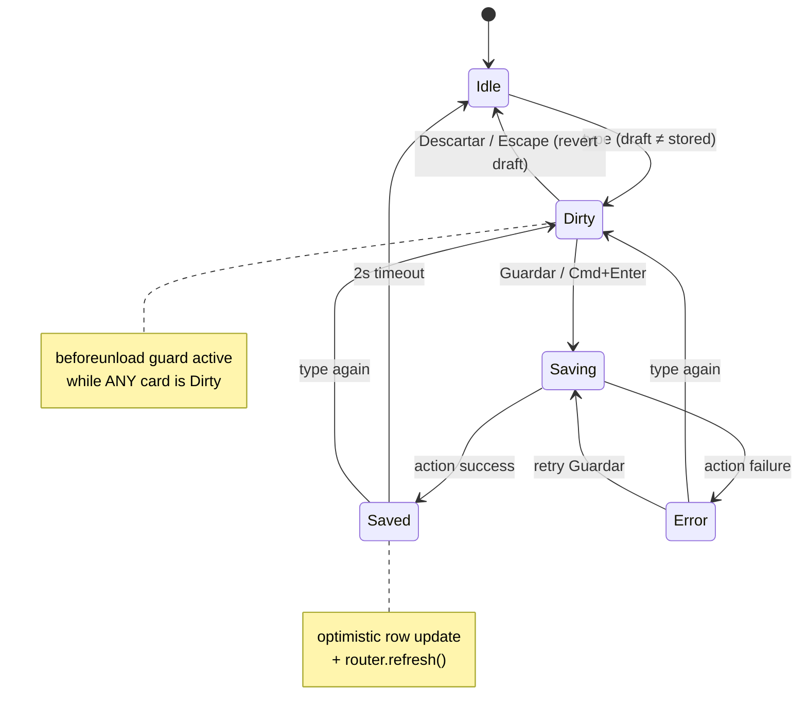
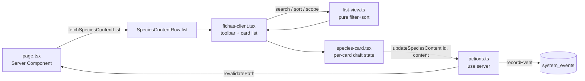

# feat: Direct-edit card interface for Fichas de especies

**Summary** — Replace the row + "Editar" dialog on `/biochoco/fichas-especies` with a card list where each species' text box is always present and editable in place. Search, sorting, and filtering move into a toolbar above the cards. The content model, the server action, permissions, and public-page rendering are unchanged.

---

## Problem Frame

`/biochoco/fichas-especies` authors one free-text field per species (`biochoco_species.public_content`) that appears on every public finca page showing that species. Today it renders as a sortable table where writing a ficha means: find the row → click **Editar** → a modal opens → type → **Guardar** → modal closes → repeat. Every species costs two extra clicks and a context switch, and you can never see two fichas at once.

The production numbers make the cost concrete:

| Fact | Value |
|---|---|
| Species rows in the list | **607** |
| Species with ≥1 verified/corrected detection (can appear on a finca page) | **63** (23 mammals, 37 birds, 1 insect, 2 system placeholders) |
| Species with a ficha written | **1** (4 characters) |
| Audio-only BirdNET birds that will never need a ficha | **~544** |

So this is a **near-empty authoring surface**, not an editing surface. The job is writing ~63 fichas from scratch, in one or a few sittings, inside a list that is 90% irrelevant rows. A modal-per-species workflow is the wrong shape for that job, and the unfiltered 607-row list actively hides the 63 that matter.

**Non-goal:** changing what a ficha *is*, how it is formatted, or where it renders publicly.

---

## Requirements

| ID | Requirement |
|---|---|
| R1 | Each species' content text box is visible and editable directly in the list — no modal, no "Editar"/"Acciones" round-trip. |
| R2 | Saving happens in place; the author stays scrolled where they were and can move straight to the next species. |
| R3 | Search by scientific, common, and Spanish name is preserved. |
| R4 | Sorting is preserved (at minimum: by records, by name, by ficha status). |
| R5 | The list can be filtered so the species that can actually appear on a finca page are the default working set, with the full 607-row list reachable. |
| R6 | Save state is unambiguous per card: the author can always tell whether what they typed is stored. |
| R7 | Unsaved text is not silently lost on navigation or accidental blur. |
| R8 | Existing behavior is preserved: editor-gated (`biochoco`), 2000-char cap, whitespace stored as `NULL`, system event per save, public pages re-render after a save. |

---

## Key Technical Decisions

### KTD-1 — Stacked cards, mirroring the public finca card

One full-width card per species, stacked vertically: display name + scientific name + type badge + records count in the header, the text box in the body. This is deliberately close to `src/app/public/biochoco/[token]/species-showcase.tsx`, which already renders species as stacked cards on the landowner page. The author composes in roughly the shape a farmer reads.

Rejected: a two-pane master/detail (list left, editor right). It keeps more species visible but reintroduces a selection step — pick a species, then edit — which is the same friction the modal has, just without the overlay.

### KTD-2 — Default the list to species with records

The default scope is "con registros" (`detectionCount > 0`) — 63 cards instead of 607. A toolbar toggle switches to "todas". This is the single largest usability win available and it is also what makes always-mounted text boxes affordable (KTD-5).

The 544 audio-only birds are `camera_selectable = 0` BirdNET taxonomy imports. They are legitimately in the table (name/IUCN resolution joins the full table) but they cannot surface on a finca page, so they do not belong in the default authoring view.

### KTD-3 — Explicit per-card save, not save-on-blur

The repo's house pattern for inline editing (`src/components/editable-cell.tsx`, used by `/grants` and `/finance/sueldos`) saves on blur. This plan deliberately diverges: a card with unsaved changes reveals **Guardar** / **Descartar** in its footer, and `Cmd/Ctrl+Enter` saves.

Rationale: `public_content` publishes **live to public finca pages** the moment it is written. Blur-saving a half-written paragraph puts that paragraph in front of landowners. Numeric cells in a grants table have no such exposure. The explicit-save cost is one click on a button that sits inside the card — which is not the friction the request is about; the modal round-trip is.

See [Open Questions](#open-questions) — this is the cheapest decision to flip.

### KTD-4 — Server action unchanged

`updateSpeciesContent` in `src/app/biochoco/fichas-especies/actions.ts` already does exactly what the new UI needs: trims, stores whitespace as `NULL`, enforces `SPECIES_CONTENT_MAX`, records a system event, and calls `revalidatePath`. No signature or behavior change (R8). Only `fetchSpeciesContentList` grows, and only in U6.

One consequence worth stating: an authoring sitting that writes 63 fichas emits 63 `update_species_content` events. That is within the CLAUDE.md instrumentation policy — these are deliberate, human-paced mutations of public content, not high-frequency per-row writes, and the audit trail is genuinely wanted here.

### KTD-5 — No virtualization; chunked rendering in "todas" mode

At the default scope (~63 cards) every text box can be mounted with no measurable cost. In "todas" mode the list renders in chunks of 100 with a **Mostrar más** button rather than pulling in a virtualization dependency. The `<textarea>` grows with its content via the `field-sizing-content` class already on `src/components/ui/textarea.tsx` — no JS resize observer.

### KTD-6 — Filter/sort/dirty logic extracted to a plain module

The repo has **no jsdom and no `@testing-library/react`** — component tests run through `react-dom/server`'s `renderToStaticMarkup` (see the header comment in `tests/unit/landowner-pages-table.test.tsx`). Interaction cannot be tested at the component level.

So the list logic (search matching, comparators, scope filtering) and the dirty/save state reducer move into plain modules that unit-test in node, following the precedent of `src/app/biochoco/paginas-publicas/sort.ts` and `src/lib/finance/sueldos-fields.ts`. The card component stays thin enough that static-markup assertions cover it.

---

## High-Level Technical Design

*Directional guidance for review — not implementation specification.*

### Page shape

```
┌─────────────────────────────────────────────────────────────┐
│ Fichas de especies            12 de 63 especies con ficha   │
├─────────────────────────────────────────────────────────────┤
│ [Buscar…]  [Con registros ▸ Todas]  [Registros|Nombre|Ficha]│  ← toolbar (U2)
├─────────────────────────────────────────────────────────────┤
│ ┌─ Guatusa · Dasyprocta punctata · Mamífero · 1.204 reg. ─┐ │
│ │ ┌───────────────────────────────────────────────────┐   │ │
│ │ │ Dispersa semillas y ayuda a la regeneración…      │   │ │  ← always-on textarea (U3)
│ │ │                                                   │   │ │
│ │ └───────────────────────────────────────────────────┘   │ │
│ │ 210/2000 · Vista previa          [Descartar] [Guardar]  │ │  ← footer appears when dirty
│ └─────────────────────────────────────────────────────────┘ │
│ ┌─ Armadillo · Dasypus novemcinctus · Mamífero · 87 reg. ─┐ │
│ │ …                                                        │ │
└─────────────────────────────────────────────────────────────┘
```

### Per-card save state machine (U3, U4)



`Error` is a terminal-until-retried state that keeps the draft intact — a rejected save (over-length, missing id, DB error) must never discard what the author typed.

### Data flow



---

## Implementation Units

### U1. Extract list view logic into a testable module

**Goal** — Move search matching, comparators, and scope filtering out of the component so they can be unit-tested in node.

**Requirements** — R3, R4, R5

**Dependencies** — none

**Files**
- `src/app/biochoco/fichas-especies/list-view.ts` (new)
- `tests/unit/fichas-especies-list-view.test.ts` (new)

**Approach** — Export a `SpeciesScope` type (`"withRecords" | "all"`), a `matchesSearch(row, query)` predicate, a `compareSpecies(a, b, key, dir)` comparator, and a `buildVisibleList(rows, { search, scope, sortKey, sortDir })` that composes them. Move `displayName()` and `TYPE_LABELS` here too — both are needed by the card and by the comparator.

Search should strip diacritics, matching `stripDiacritics` in `src/components/species/species-index-table.tsx` — the current fichas search does a bare `toLowerCase().includes()`, so "guatusa" fails to find a name stored with an accent. Preserve the existing records-sort tiebreaker: equal counts fall back to name **ascending regardless of sort direction**, so the 0-registro tail stays alphabetical.

**Patterns to follow** — `src/app/biochoco/paginas-publicas/sort.ts` (extracted comparator module, tested standalone); `stripDiacritics` in `src/components/species/species-index-table.tsx`.

**Test scenarios**
- `matchesSearch` finds a row by scientific name, by common name, and by Spanish name.
- `matchesSearch` is diacritic-insensitive both ways: query "guatuso" matches a stored "Guatusó", and query "Guatusó" matches a stored "guatuso".
- `matchesSearch` with an empty/whitespace query returns true for every row.
- `buildVisibleList` with `scope: "withRecords"` excludes rows where `detectionCount === 0` and includes rows where it is `> 0`.
- `buildVisibleList` with `scope: "all"` returns every row.
- `compareSpecies` by `records` desc puts the highest count first.
- Two rows with equal `detectionCount` sort by display name ascending under **both** `asc` and `desc` directions.
- `compareSpecies` by `status` puts `hasContent: true` rows first when ascending.
- `compareSpecies` by `name` uses `spanishName` when present, falling back to `commonName`, then `scientificName`.
- Search and scope compose: a query matching an audio-only bird returns nothing under `scope: "withRecords"`.

**Verification** — The module has no React import and its tests pass under the node test environment.

---

### U2. Card list shell with toolbar

**Goal** — Replace the `<Table>` in `fichas-client.tsx` with a toolbar plus a stacked card list. Cards are read-only in this unit; U3 makes them editable.

**Requirements** — R1 (structure), R3, R4, R5

**Dependencies** — U1

**Files**
- `src/app/biochoco/fichas-especies/fichas-client.tsx` (modify)
- `src/app/biochoco/fichas-especies/species-card.tsx` (new)
- `tests/unit/fichas-especies-card.test.tsx` (new)

**Approach** — The toolbar holds the search `Input`, a two-option scope toggle ("Con registros" / "Todas"), and sort buttons. Use the chip-button pattern from `SpeciesIndexTable` rather than table-header sort buttons, since there are no headers to hang `SortIcon` on. Sort options: Registros, Nombre, Ficha — each toggling direction on re-click, with `SortIcon` rendered inside the chip so the shared sort affordance is preserved.

Card header: display name (bold), scientific name (italic, muted), type `Badge`, records count, and the "Con ficha"/"Sin ficha" badge. Card body: the content, rendered as plain text in this unit.

The header count line becomes scope-aware — `{withContent} de {visible.length} especies con ficha` where both numbers reflect the current scope, so switching to "Todas" does not make the progress number look like a regression.

Chunked rendering (KTD-5): render at most 100 cards, with a **Mostrar más** button when more match. Reset the chunk count when search, scope, or sort changes.

Delete the `Dialog`, `Textarea`, `Label`, and table imports that become unused, plus the now-dead `SortableHead` helper.

**Patterns to follow** — `src/components/species/species-index-table.tsx` (search + sort-chip toolbar); `src/app/public/biochoco/[token]/species-showcase.tsx` (stacked card composition); `src/components/sort-icon.tsx`.

**Test scenarios**
- Rendering with a mix of species produces one card per visible species, each containing the display name and the scientific name.
- A species with `hasContent: true` renders the "Con ficha" badge; one with `false` renders "Sin ficha".
- A species with `detectionCount: 0` renders the em-dash placeholder rather than "0".
- Records counts render with Spanish thousands grouping (`1.204`).
- The type badge renders the Spanish label ("Mamífero", not "mammal") and falls back to the raw type for an unmapped value.
- With zero matching species the empty state renders instead of an empty card list.
- With 150 matching species only 100 cards render and a "Mostrar más" control is present.

**Verification** — `/biochoco/fichas-especies` renders a card list with a working toolbar; no modal is reachable; no table markup remains.

---

### U3. In-place editing with explicit per-card save

**Goal** — Make each card's text box live: type directly, save in place, with unambiguous state.

**Requirements** — R1, R2, R6, R8

**Dependencies** — U2

**Files**
- `src/app/biochoco/fichas-especies/species-card.tsx` (modify)
- `src/app/biochoco/fichas-especies/card-state.ts` (new)
- `tests/unit/fichas-especies-card-state.test.ts` (new)
- `tests/unit/fichas-especies-card.test.tsx` (modify)

**Approach** — The card owns a `draft` string initialized from `publicContent ?? ""`. A `<Textarea>` is always mounted and always editable (editors only — the page is already `requirePermission("biochoco", "editor")`, so there is no viewer path to handle here).

`card-state.ts` holds the pure state logic from the save state machine in High-Level Technical Design: `deriveStatus({ draft, stored, pending, error, savedAt })` returning `"idle" | "dirty" | "saving" | "saved" | "error"`, plus `isDirty(draft, stored)` normalizing so that `""` and `null` are equal (typing then deleting everything on an empty ficha is not dirty) and trailing whitespace does not count as a change. The component consumes it; the tests exercise it.

The footer renders only when the card is not idle: a `210/2000` counter, the status indicator, and **Descartar** / **Guardar**. Save calls the existing `updateSpeciesContent(id, { publicContent: draft })` inside a `useTransition`, then on success updates the parent's row optimistically (`publicContent`, `hasContent`) and calls `router.refresh()` — the same optimistic-then-refresh shape as `useFieldSave` in `src/components/editable-cell.tsx`.

Errors render inline under the footer and **leave the draft untouched**.

Lift the rows array and its optimistic updater to `fichas-client.tsx` (it already holds `rows` state today) and pass a per-card `onSaved(id, content)` callback down, so the "N de M con ficha" counter and the ficha badges stay in sync without a full refetch.

**Execution note** — Write `card-state.ts` and its tests first; the state machine is the part most likely to be subtly wrong (the `""`/`null` equivalence and the saved→dirty transition), and it is the part that is actually testable in this repo.

**Test scenarios**
- `isDirty` is false when `draft === ""` and `stored === null`.
- `isDirty` is false when the draft differs from stored only by trailing whitespace.
- `isDirty` is true when the draft adds real text to a null stored value, and true when it clears a non-null stored value to `""`.
- `deriveStatus` returns `"saving"` while pending even if the draft matches stored.
- `deriveStatus` returns `"error"` when an error is present, and `"dirty"` once the draft changes after that error.
- `deriveStatus` returns `"saved"` within the success window and `"idle"` after it elapses.
- `deriveStatus` returns `"dirty"`, not `"saved"`, when the author types again during the saved window.
- Card markup: a card whose stored content is non-null renders that text inside the textarea.
- Card markup: a card with null content renders an empty textarea plus the authoring placeholder.
- Card markup: the character counter reflects the stored content length on first render.

**Verification** — Typing into a card and pressing Guardar persists the text, the ficha badge flips to "Con ficha", the header counter increments, and the public finca page shows the new text after refresh — with no dialog involved.

---

### U4. Unsaved-changes protection and keyboard shortcuts

**Goal** — Make it impossible to lose typed text to a stray click or navigation (R7), and make saving keyboard-driven (R2).

**Requirements** — R2, R7

**Dependencies** — U3

**Files**
- `src/app/biochoco/fichas-especies/fichas-client.tsx` (modify)
- `src/app/biochoco/fichas-especies/species-card.tsx` (modify)
- `src/app/biochoco/fichas-especies/list-view.ts` (modify — adds `alwaysInclude`)
- `tests/unit/fichas-especies-list-view.test.ts` (modify)

**Approach** — Three protections:

1. **`beforeunload` guard.** The client tracks a set of dirty card ids; while non-empty, a `beforeunload` listener sets `returnValue`. The repo has no existing unsaved-changes guard, so this is new — keep it to a single effect in `fichas-client.tsx` with proper cleanup.
2. **Filter/sort/scope guard.** Changing search, sort, or scope can unmount a dirty card. When any card is dirty and the visible set is about to change, keep dirty cards pinned in the list rather than blocking the interaction — a confirm dialog on every keystroke of the search box would be intolerable. Pinning is implemented in `list-view.ts` as an extra `alwaysInclude: Set<number>` parameter.
3. **Shortcuts.** `Cmd/Ctrl+Enter` in a textarea saves that card. `Escape` reverts the draft to stored and blurs. Plain `Enter` inserts a newline — fichas are multi-paragraph prose, so `Enter`-to-save (the `EditableField` behavior) is wrong here.

**Test scenarios**
- `buildVisibleList` with `alwaysInclude` containing a dirty card's id returns that card even when it fails the search predicate.
- `buildVisibleList` with `alwaysInclude` containing a dirty card's id returns that card even when the scope filter would exclude it.
- A pinned card appears exactly once when it *also* matches the filter (no duplication).
- `alwaysInclude` as an empty set behaves identically to omitting it.
- Pinned-but-non-matching cards sort after matching ones so the filtered result still reads as the filtered result.

**Verification** — Typing in a card and then typing in the search box keeps the dirty card visible; attempting to close the tab with unsaved text prompts; `Cmd+Enter` saves without touching the mouse.

---

### U5. Inline preview of the published formatting

**Goal** — Let the author see how the plain text will render publicly (paragraphs and `-` bullets) without leaving the card.

**Requirements** — R6 (supporting)

**Dependencies** — U3

**Files**
- `src/app/biochoco/fichas-especies/species-card.tsx` (modify)
- `tests/unit/fichas-especies-card.test.tsx` (modify)

**Approach** — A small "Vista previa" toggle in the card footer reveals a block below the textarea rendering the current **draft** (not the stored value) through the existing `FormatSpeciesContent` from `src/lib/landowner/format-species-content.tsx`. Style the block to echo the public card's emerald treatment from `src/app/public/biochoco/[token]/species-content-card.tsx` so the preview reads as "this is the public thing".

Default collapsed, per-card state. Reusing `FormatSpeciesContent` guarantees the preview and the public page cannot drift, and inherits its React-escaped, no-`dangerouslySetInnerHTML` safety.

This unit is independently droppable — nothing else depends on it.

**Test scenarios**
- With the preview open, a draft containing a blank-line separated pair of paragraphs renders two `<p>` elements.
- With the preview open, lines beginning with `-` render as `<li>` inside a single `<ul>`.
- With the preview open and an empty draft, the preview area renders nothing (no empty bordered box).
- Text containing `<script>` renders escaped, not as markup.
- With the preview closed, no preview markup is present.

**Verification** — Typing a bulleted management tip and opening the preview shows the same bullets the finca page renders.

---

### U6. Representative photo per species card

**Goal** — Give each card the photo that makes it a card rather than a tall row, and make species identifiable at a glance while authoring.

**Requirements** — R1 (supporting)

**Dependencies** — U2

**Files**
- `src/app/biochoco/fichas-especies/actions.ts` (modify)
- `src/app/biochoco/fichas-especies/content-types.ts` (modify)
- `src/app/biochoco/fichas-especies/species-card.tsx` (modify)
- `src/app/biochoco/fichas-especies/__tests__/species-content.test.ts` (modify)

**Approach** — Extend the existing grouped detection-count query in `fetchSpeciesContentList` to also return a representative image id per species: join `identifications → detections` and take the image of the highest-confidence verified/corrected identification. SQLite's bare-column-with-`max()` behavior returns the row of the max, so this stays one grouped query — measured at **46 ms against production** (44,575 identifications, 21,415 verified/corrected, 64 result rows), so no extra index work is needed.

Add `representativeImageId: number | null` to `SpeciesContentRow`. The card renders a small square thumbnail via `/api/ct-images/{id}?size=thumb`, with the type-badge icon as the fallback when the id is null or the request fails.

> **Gotcha:** the correlated-subquery form of this query is the exact shape that broke the audio batch — `${table.column}` inside a raw Drizzle `sql` template renders as a bare `"id"` that SQLite binds to the inner table. Prefer the explicit join above; if a subquery is unavoidable, qualify with the literal outer table name. See `docs/solutions/` and the memory note on Drizzle correlated subqueries.

**Risk to verify during implementation:** `/api/ct-images/[id]` authorizes through `getUserCameraTrapProjects`, while this page authorizes on `biochoco` editor. A user with biochoco-editor but no camera-trap access will get 403s on every thumbnail. The fallback must be graceful (placeholder, no broken-image icon, no console spam), and the actual permission overlap should be checked against real users before assuming it never happens.

**Test scenarios**
- `fetchSpeciesContentList` returns `representativeImageId` for a species with a verified identification.
- It returns `null` for a species with no identifications.
- It returns `null` for a species whose only identifications are unverified (`verificationStatus` outside `verified`/`corrected`).
- Given two verified identifications of the same species at different confidences, the returned id is the image of the higher-confidence one.
- A corrected identification attributes its image to the **corrected** species, not the original.
- Existing assertions on `detectionCount`, `hasContent`, and ordering still pass unchanged.

**Verification** — Cards for species with detections show a thumbnail; species without detections show the placeholder; the list query stays well under 100 ms on production-sized data.

---

## Scope Boundaries

**In scope** — the authoring interface on `/biochoco/fichas-especies`: card layout, in-place editing, save state, toolbar (search/sort/scope), preview, thumbnails.

**Not in scope**
- The content model. `public_content` stays one plain-text field with the same 2000-char cap.
- Public rendering. `FormatSpeciesContent`, `SpeciesContentCard`, and `SpeciesShowcase` are read, not changed.
- Permissions. Still `requirePermission("biochoco", "editor")` on both page and action.
- Species CRUD. Adding, renaming, or retyping species stays in `/camera-trap/species/manage`.

### Deferred to Follow-Up Work
- **Bulk / AI-assisted drafting.** With 62 empty fichas, a "draft from species name + IUCN status" affordance is the obvious next lever — but it is a separate feature with its own review and provenance questions.
- **Per-species content on the audio side.** The 544 BirdNET birds are reachable via "Todas" but there is no product story yet for fichas on species that only ever appear in audio results.
- **Filtering by type or IUCN status.** Only worth adding if the records/all split turns out to be too coarse in practice.

---

## Open Questions

| # | Question | Resolution path |
|---|---|---|
| Q1 | Explicit **Guardar** (KTD-3) vs. save-on-blur like the rest of the app? | Cheapest decision to flip — it is one branch in the card's blur handler. Try explicit save first; if authoring 60 fichas makes the button feel like ceremony, switch to blur-save with a longer "Guardado" confirmation. The public-visibility argument is the only thing holding it. |
| Q2 | Does any real biochoco editor lack camera-trap access, breaking U6 thumbnails? | Check the `user_permissions` rows for current biochoco editors during U6. The graceful fallback ships regardless. |
| Q3 | Should "Todas" persist across visits (URL param or localStorage)? | Defer until the scope toggle has been used. Session-local state is fine for a first pass. |

---

## Risks & Dependencies

| Risk | Impact | Mitigation |
|---|---|---|
| Thumbnail route 403s for biochoco-only editors (U6) | Every card shows a broken image | Graceful placeholder on error; verify permission overlap (Q2) before relying on photos |
| 607 mounted textareas in "Todas" mode | Slow initial render, janky typing | Default scope is 63 cards (KTD-2); "Todas" renders in 100-card chunks (KTD-5) |
| Dirty card unmounted by a search keystroke | Silent data loss | Pin dirty cards into the visible list (U4) rather than filtering them away |
| Interaction bugs invisible to the test suite | Regressions ship unnoticed | Logic extracted to `list-view.ts` / `card-state.ts` and tested in node (KTD-6); accept that DOM interaction is manually verified |
| Drizzle correlated-subquery column binding (U6) | Silent zero/NULL image ids | Use an explicit join; qualify any subquery with the literal outer table name |

---

## System-Wide Impact

- **Public finca pages** — unchanged code, but the *reason* for this work is that they finally get content. Every save already triggers `revalidatePath("/biochoco/fichas-especies")`; confirm the public finca pages pick up the new content on their own revalidation path.
- **System events** — save volume rises from near-zero to ~63 `update_species_content` events during the initial authoring push. Expected and desirable (KTD-4).
- **Shared components** — `src/components/editable-cell.tsx` is *not* modified. This page deliberately does not adopt it (KTD-3); grants and sueldos keep their blur-save behavior.

---

## Sources & Research

- Production data (read-only queries, 2026-08-04): 607 species, 63 with verified detections, 1 with content; representative-image query 46 ms.
- `src/app/biochoco/fichas-especies/` — current page, actions, types, and integration tests.
- `src/components/editable-cell.tsx` — house inline-edit pattern (blur-save), deliberately diverged from.
- `src/components/species/species-index-table.tsx` — search + sort-chip toolbar and `stripDiacritics`.
- `src/app/public/biochoco/[token]/species-showcase.tsx`, `species-content-card.tsx`, `src/lib/landowner/format-species-content.tsx` — public card shape and formatting reused for the preview.
- `src/app/biochoco/paginas-publicas/sort.ts`, `tests/unit/landowner-pages-table.test.tsx` — extracted-logic + `renderToStaticMarkup` test precedent (no jsdom in this repo).
- `src/app/api/ct-images/[id]/route.ts` — internal thumbnail route and its camera-trap authorization.
