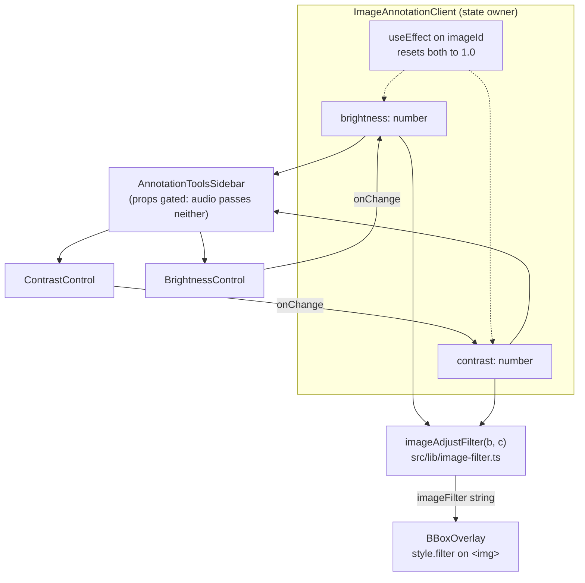

# feat: Contrast slider on the camera-trap annotation page

**Summary** — Add a user-controlled contrast slider beside the existing brightness slider in the annotation sidebar's **Vista** section, so annotators can pull detail out of flat, hazy, or low-quality frames when identifying animals. The contrast value multiplies on top of the automatic contrast compensation the brightness filter already applies, so at the default 100% the rendered image is byte-identical to today. Display-only: nothing about stored images, thumbnails, or ML input changes.

---

## Problem Frame

The annotation page (`/camera-trap/results/[id]/images/[imageId]`) already lets an annotator brighten or darken the frame with a **Brillo** slider, backed by `brightnessFilter()` in `src/lib/brightness-filter.ts`. That function does two things at once: it applies the brightness the user asked for, *and* it silently bumps contrast in proportion to how far brightness has moved from 100% — compensation for the washout that brightening or darkening causes.

```
brightnessFilter(0.7)  ->  "brightness(0.7) contrast(1.18)"
brightnessFilter(0.4)  ->  "brightness(0.4) contrast(1.36)"
```

That coupling is useful but it is not reachable. An annotator looking at a flat, low-contrast IR night frame — where the animal and the background sit within a few grey levels of each other — cannot raise contrast without also darkening or brightening the image, which often makes identification worse rather than better. Brightness and contrast are separate problems and the UI only exposes one of them.

The fix is a second slider. The only real design question is how the new user-facing contrast relates to the automatic one that is already in the filter string, since a naive implementation would either double-apply or silently change what the existing `\` brightness shortcut does today.

---

## Requirements

| ID | Requirement |
| --- | --- |
| R1 | A **Contraste** slider renders in the annotation sidebar's **Vista** section, directly below **Brillo**, matching its visual treatment |
| R2 | Moving the slider changes the rendered annotation image live, with no reload and no server round-trip |
| R3 | With contrast at its default 100%, the emitted CSS filter string is byte-identical to today's output for every brightness value — including the three states the `\` shortcut cycles through |
| R4 | Contrast resets to 100% when the annotator navigates to a different image, matching how brightness behaves today |
| R5 | The slider carries a numeric percent readout and a reset button, mirroring the brightness control |
| R6 | Audio annotation, which reuses the same sidebar component, shows no contrast control |
| R7 | All new user-facing strings are Spanish (`Contraste`, `Restablecer contraste`, `Contraste de la imagen`) |
| R8 | No new keyboard shortcut is introduced; `src/hooks/use-annotation-shortcuts.ts` and the Ayuda dialog are untouched |
| R9 | The adjustment is display-only — stored images, cached thumbnails, exports, and ML input are unaffected |

---

## Key Technical Decisions

**KTD1 — User contrast multiplies on top of the automatic contrast.** The composed value is `round2(autoContrast(brightness)) × userContrast`, rounded to two decimals. Rounding the automatic term *before* multiplying is what makes R3 hold exactly: at `userContrast = 1.0` the product reduces to today's already-rounded value, character for character. The alternative — letting the slider replace the automatic term outright — was considered and rejected: it would flatten every image the `\` shortcut produces, changing behavior annotators already rely on.

**KTD2 — Contrast range is 0.6 – 2.0, default 1.0, step 5%.** Deliberately asymmetric, unlike brightness's 0.4 – 1.6. The direction that actually helps on poor frames is *up*: flat IR night images often need 1.4 – 1.8 before an animal separates from the background, and 1.6 would be a frustrating ceiling. Values below 1.0 are kept so an annotator can back off a harsh daytime frame, but the useful headroom is above.

**KTD3 — Extract a generic `ImageAdjustControl`; `BrightnessControl` and `ContrastControl` become thin presets over it.** The two controls are the same ~60 lines of markup differing only in icon, label, range, and aria text. Duplicating them would guarantee they drift. `BrightnessControl` keeps its existing name, import path, and props, so the sidebar's brightness call site needs no change.

**KTD4 — Both controls keep the amber active-state accent; they are distinguished by icon and label.** `Sun` for brightness, lucide's `Contrast` for contrast. Keeping one accent means the generic control needs no accent prop and therefore no dynamically-built Tailwind class strings, which the JIT compiler cannot see and would purge.

**KTD5 — Rename `src/lib/brightness-filter.ts` to `src/lib/image-filter.ts`.** The module now owns contrast constants and a two-input filter builder; the old name would actively mislead. Three import sites, all compiler-verified. The alternative — keeping the filename — was rejected as leaving a module named for one of the two things it does.

**KTD6 — Contrast resets per image, via the existing `useEffect` keyed on `imageId`.** Consistency with brightness beats convenience across a batch: an annotator should never inherit a previous frame's adjustment without noticing.

---

## High-Level Technical Design

State lives in one place — `ImageAnnotationClient` — and travels in two directions. Down the left branch it becomes a CSS filter string on the ``; down the right branch it becomes slider positions the annotator can move.



The composition rule inside `imageAdjustFilter`, with no-op terms dropped so the common cases stay clean:

```
auto     = round2(1 + |1 - brightness| * 0.6)     // unchanged from today
composed = round2(auto * contrast)

terms = []
if brightness != 1.0  ->  terms += "brightness(<b>)"
if composed  != 1.0   ->  terms += "contrast(<composed>)"
return terms.join(" ")                            // "" when both are default
```

Worked cases:

| brightness | contrast | auto | composed | emitted filter |
| --- | --- | --- | --- | --- |
| 1.0 | 1.0 | 1.0 | 1.0 | `""` |
| 0.7 | 1.0 | 1.18 | 1.18 | `brightness(0.7) contrast(1.18)` (identical to today) |
| 1.0 | 1.4 | 1.0 | 1.4 | `contrast(1.4)` |
| 0.5 | 1.3 | 1.3 | 1.69 | `brightness(0.5) contrast(1.69)` |
| 0.4 | 2.0 | 1.36 | 2.72 | `brightness(0.4) contrast(2.72)` |

*Directional guidance for review — not implementation specification.*

---

## Implementation Units

### U1. Extend the filter module with contrast composition

**Goal** — Give the filter module a two-input builder that composes user contrast on top of the existing automatic compensation, without changing any output at the default.

**Requirements** — R3, R9

**Dependencies** — none

**Files**
- `src/lib/brightness-filter.ts` → renamed to `src/lib/image-filter.ts` (modify)
- `tests/unit/brightness-filter.test.ts` → renamed to `tests/unit/image-filter.test.ts` (modify)
- `src/components/brightness-control.tsx` (modify — import path only)
- `src/app/camera-trap/results/[id]/images/[imageId]/image-annotation-client.tsx` (modify — import path only)

**Approach** — Add `MIN_CONTRAST = 0.6`, `MAX_CONTRAST = 2.0`, `DEFAULT_CONTRAST = 1.0`. Extract the existing contrast expression into a named `autoContrast(brightness): number` so the rounding point is explicit and testable. Add `imageAdjustFilter(brightness, contrast): string` implementing the composition and term-dropping rules in the design section above. Keep `brightnessFilter()` exported — it is the auto-compensation path, it has existing coverage, and keeping it makes the R3 regression lock trivial to express.

The KTD4 rename lands in this unit together with both import sites, so the unit stays an atomic, compiling commit. Those are the only two — `brightness-control.tsx` re-exports the module's values (U2 drops those re-exports) and `image-annotation-client.tsx` imports `brightnessFilter` and `DEFAULT_BRIGHTNESS` directly. No behavior changes in either file here; U2 and U3 do the substantive work.

**Patterns to follow** — The existing module's shape: plain exported constants, pure functions, no React, two-decimal rounding via `Math.round(x * 100) / 100`.

**Test scenarios**
- `imageAdjustFilter(1.0, 1.0)` returns `""` — both at default, no filter emitted
- For each of brightness 0.4, 0.5, 0.7, 1.3, 1.6: `imageAdjustFilter(b, 1.0)` equals `brightnessFilter(b)` exactly — the R3 byte-identical lock, including the `\` cycle's 1.0 / 0.7 / 0.5 states
- `imageAdjustFilter(1.0, 1.4)` returns `"contrast(1.4)"` — no `brightness(1)` term when brightness is at default
- `imageAdjustFilter(1.0, 0.6)` returns `"contrast(0.6)"` — minimum contrast, brightness term still dropped
- `imageAdjustFilter(0.5, 1.3)` returns `"brightness(0.5) contrast(1.69)"` — auto 1.3 multiplied by user 1.3
- `imageAdjustFilter(0.7, 1.15)` returns `"brightness(0.7) contrast(1.36)"` — product 1.357 rounds to two decimals
- `imageAdjustFilter(0.4, 2.0)` returns `"brightness(0.4) contrast(2.72)"` — both extremes stack, no clamping
- `autoContrast(1.0)` returns `1.0` — the identity that makes the composition collapse cleanly at default brightness
- Existing `brightnessFilter` cases still pass unchanged after the rename

**Verification** — `docker compose exec portal npx vitest run tests/unit/image-filter.test.ts` passes, with the old brightness assertions intact rather than rewritten.

---

### U2. Extract the generic slider control and add ContrastControl

**Goal** — One slider component, two presets, no duplicated markup.

**Requirements** — R1, R5, R7

**Dependencies** — U1

**Files**
- `src/components/image-adjust-control.tsx` (create)
- `src/components/brightness-control.tsx` (modify — becomes a preset)
- `src/components/contrast-control.tsx` (create)

**Approach** — `ImageAdjustControl` takes `{ icon, label, value, min, max, defaultValue, step, onChange, resetLabel, sliderLabel, title?, className? }` and renders exactly the markup `BrightnessControl` has today: bordered card, amber-tinted when the value is off-default, icon + label on the left, percent readout + reset button on the right, range input below. Percent conversion (`value * 100`) and the `isActive` derivation move into the generic component.

`BrightnessControl` keeps its current props and export name, delegating to the generic control with the `Sun` icon, `Brillo`, and the existing 0.4 – 1.6 range and `\` tooltip. `ContrastControl` mirrors it with lucide's `Contrast` icon, `Contraste`, the KTD2 range, and no shortcut tooltip.

Drop the pass-through re-exports at the top of `brightness-control.tsx` (`brightnessFilter`, `DEFAULT_BRIGHTNESS`, `MAX_BRIGHTNESS`, `MIN_BRIGHTNESS`) while rewriting the file — nothing imports them; the one consumer that needs those values imports from the lib module directly.

Both files are `"use client"`, so passing a Lucide component as a prop is safe here. This would break if the sidebar ever became a Server Component — worth a one-line comment at the icon prop so nobody moves it without noticing.

**Patterns to follow** — `src/components/brightness-control.tsx` as it stands today; `cn()` from `@/lib/utils` for conditional classes.

**Test expectation: none** — purely presentational, and the repo's Vitest environment is `node` with no component-render harness (no `@testing-library/react`, no jsdom). The behavior these components produce is covered by U1's filter math and U3's browser verification. Adding a render harness is listed under deferred follow-up rather than smuggled into this change.

**Verification** — `docker compose exec portal npm run build` succeeds; the brightness slider on the annotation page looks and behaves exactly as before the refactor (same amber active state, same percent readout, same reset, same `\` tooltip).

---

### U3. Wire contrast through the sidebar and the annotation client

**Goal** — Thread contrast state from the annotation client to the new control and into the rendered filter, leaving audio annotation untouched.

**Requirements** — R1, R2, R4, R6, R8, R9

**Dependencies** — U1, U2

**Files**
- `src/components/annotation-tools-sidebar.tsx` (modify)
- `src/app/camera-trap/results/[id]/images/[imageId]/image-annotation-client.tsx` (modify)

**Approach** — Add `contrast?: number` and `onContrastChange?: (value: number) => void` to `AnnotationToolsSidebarProps`, rendered inside the existing **Vista** block under the same optional-prop gate the brightness control uses. The gate is what satisfies R6: `src/app/audio/[id]/annotate/[fileId]/annotation-client.tsx` passes neither prop, so the block's brightness half already hides for audio and the contrast half will too. Extend the existing comment at that gate so it names both controls.

In `ImageAnnotationClient`: add `const [contrast, setContrast] = useState(DEFAULT_CONTRAST)` alongside the brightness state; add `setContrast(DEFAULT_CONTRAST)` to the existing `useEffect` keyed on `imageId` (R4); swap the `imageFilter` memo from `brightnessFilter(brightness)` to `imageAdjustFilter(brightness, contrast)` with both values in the dependency array; pass `contrast` and `onContrastChange` down to the sidebar.

Both surfaces that mount this client — the standalone annotation page and the lightbox in `src/app/camera-trap/[id]/deployment-gallery-client.tsx` — pick the feature up with no changes of their own, since the state and the sidebar both live inside the shared client component.

Update the import in the annotation client to the renamed `@/lib/image-filter` (KTD4). No changes to `src/hooks/use-annotation-shortcuts.ts` or `src/components/annotation-help-panel.tsx` (R8).

**Patterns to follow** — The brightness prop threading in the same two files, line for line; the optional-prop gate at `annotation-tools-sidebar.tsx` around the **Vista** block.

**Test scenarios** — Browser verification at `http://localhost:3003`, on a deployment with dark or low-contrast night frames:
- Opening an annotation image shows **Contraste** below **Brillo** in the Vista section, at 100%, with no visual change to the frame
- Dragging contrast up visibly raises separation between subject and background, live, with no reload
- Dragging contrast down flattens the frame — confirms the sub-1.0 half of the range is wired
- The contrast reset button returns to 100% and restores the untouched frame; the button is disabled at 100%
- Brightness and contrast compose: set brightness to 70% and contrast to 130%, confirm the frame darkens *and* gains contrast rather than one overriding the other
- Pressing `\` still cycles brightness 100 → 70 → 50% and leaves the contrast slider untouched
- Arrow to the next image: both sliders return to 100% (R4)
- Bounding boxes, labels, and the drawing interaction stay unfiltered and correctly aligned — the CSS filter applies to the `` only, not the sibling SVG overlay
- Open the same image through the deployment gallery lightbox: the contrast slider is present and functional there too
- Open an audio annotation page: the Vista section shows neither slider (R6)
- Reload after adjusting: the image comes back at 100% — confirms nothing persisted server-side (R9)

**Verification** — All browser scenarios above pass; `docker compose exec portal npm run build` and `docker compose exec portal npm run test:run` are green; no layout shift or empty space in the sidebar with the second card added, checked at a narrow viewport where the sidebar is tightest.

---

## Scope Boundaries

**In scope** — A contrast slider on the camera-trap annotation image surface (standalone page and gallery lightbox), the filter-module change behind it, and the shared control extraction that keeps the two sliders from diverging.

**Out of scope**
- Persisting brightness or contrast preferences per user, per deployment, or across sessions
- Applying adjustments to the results grid thumbnails or any non-annotation image surface
- Gamma, sharpening, histogram equalization, auto-levels, or any adjustment that is not a CSS filter
- Contrast on audio spectrograms
- Changing brightness's existing per-image reset or its `\` shortcut

### Deferred to Follow-Up Work
- A Playwright case in `tests/e2e/camera-trap.spec.ts` covering the slider end to end. Deferred because it needs a running app with seeded camera-trap data, which is a heavier lift than this change warrants on its own
- Adding `@testing-library/react` + jsdom so presentational components like `ImageAdjustControl` can be render-tested. Worth doing, but it is a test-infrastructure decision that should not ride along inside a slider feature
- Reconsidering per-image reset if annotators report re-dragging the slider across long batches of uniformly poor frames from the same camera

---

## Risks

**Stacked extremes produce a harsh image.** Brightness 0.4 with contrast 2.0 composes to `contrast(2.72)`, which will clip aggressively. This is user-driven, fully reversible, and each slider displays its own value rather than the composed one, so the annotator can see what they asked for. No clamp is applied — clamping would make the slider non-linear near the ends, which is more confusing than a harsh image the user can undo. Both reset buttons and the per-image reset are the mitigation.

**Silent regression in the `\` shortcut path.** The whole point of KTD1's rounding order is that contrast at 100% reproduces today's strings exactly, and U1's parameterized test locks that down for all five brightness values the shortcut and slider can reach. If that test is weakened, the regression becomes invisible.

**UI wiring has no automated coverage.** Automated testing stops at the filter math because the repo has no component-render harness. U3's browser scenarios are the real verification for this change and should not be skipped as a formality.

---

## Sources & Research

Local codebase only — no external research was run. The change has a direct, near-identical local precedent in the brightness slider, so external best-practice or framework research would not have shaped any decision here.

Files read during planning:
- `src/lib/brightness-filter.ts` — the auto-contrast coupling that KTD1 is built around
- `src/components/brightness-control.tsx` — the markup U2 generalizes
- `src/components/annotation-tools-sidebar.tsx` — the **Vista** block and its optional-prop gate
- `src/app/camera-trap/results/[id]/images/[imageId]/image-annotation-client.tsx` — state ownership, the `imageId` reset effect, the `imageFilter` memo
- `src/components/bbox-overlay.tsx` — confirms the filter lands on the `` only, not the SVG overlay
- `src/hooks/use-annotation-shortcuts.ts`, `src/components/annotation-help-panel.tsx` — confirmed untouched under R8
- `tests/unit/brightness-filter.test.ts`, `vitest.config.ts` — existing coverage and the `node` test environment
