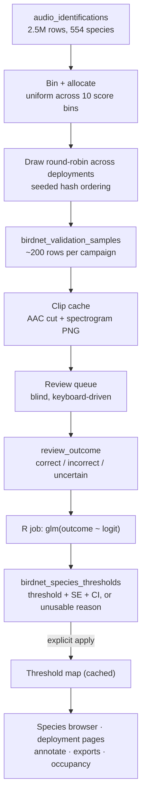
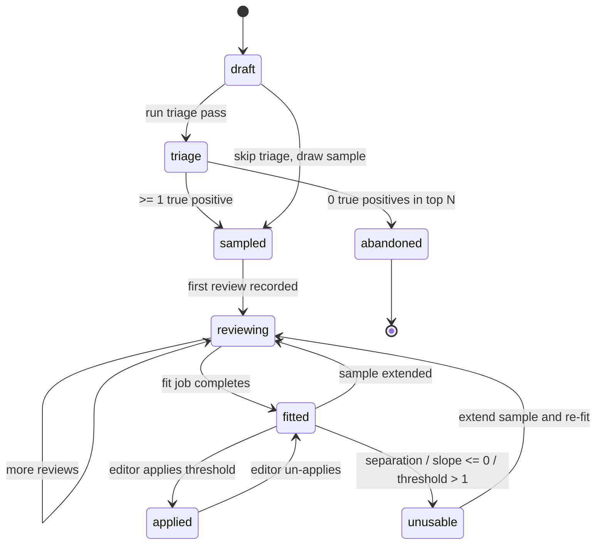
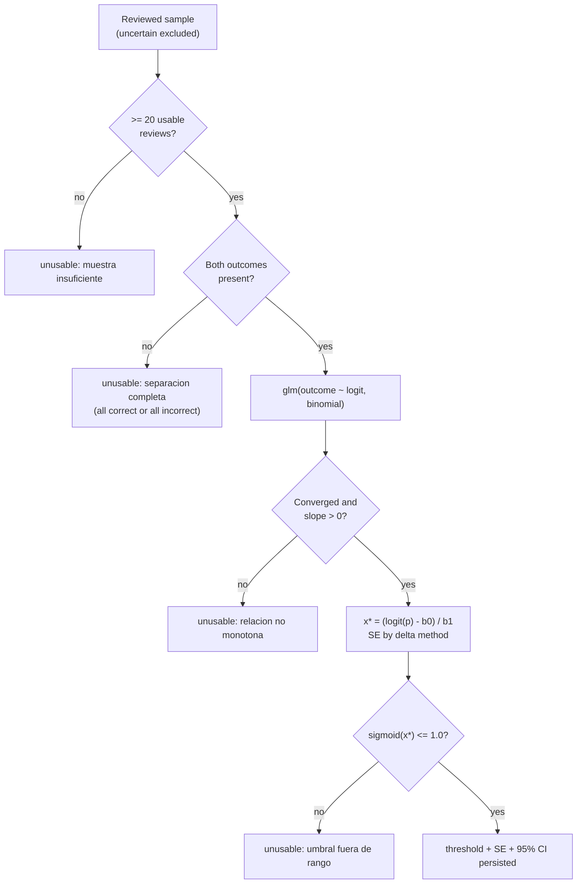

# feat: Species-specific BirdNET confidence thresholds via expert validation

## Summary

Add a validation module under **Grabaciones** that turns BirdNET's uncalibrated
confidence scores into per-species probability thresholds. For a target species,
the portal draws a score-bin-stratified sample of its detections, serves them to
an expert reviewer in a fast keyboard-driven queue, fits a logistic regression in
R relating review outcome to BirdNET logit score, and derives the confidence value
at which 95% of retained detections are true positives. Fitted thresholds then
replace the global 0.7 default everywhere the portal filters audio detections.

---

## Problem Frame

BirdNET has produced 2,491,919 identifications across 554 species from ~370,000
minutes of BioChocó audio. The confidence score attached to each is not a
probability and is not comparable across species: umbrellabirds score above 0.90
and are mostly wrong, toucans score 0.20 and are mostly right. The portal
currently applies one global threshold of 0.7 (`src/lib/audio-confidence.ts`),
which under-filters the noisy species and discards real detections of the
reliable ones.

The species-detection browser, deployment summaries, CSV exports, and the
occupancy models all read through that single number, so every ecological
conclusion the portal reports inherits the same miscalibration. Manual
verification of all 2.5M detections is impossible; the established fix (Wood &
Kahl 2024) is to verify a sample per species and fit a model that converts score
to probability.

The workflow, the reviewer (Juan Freile), and the target species list (~200,
combining the 86-species priority list with the 107 range-flagged species) are
already agreed with collaborators. What is missing is the software: sampling,
review, fitting, and application.

The score distributions make the sampling design load-bearing rather than
incidental. *Ramphastos ambiguus* has 173,641 detections distributed U-shaped
across bins — 28,069 in [0.1, 0.2) and 50,435 in [0.9, 1.0), but only ~11,000 in
each of the middle bins. A random sample mirrors that shape and starves the
transition zone where the threshold actually sits.

---

## Requirements

### Sampling and campaign design

- R1. An editor can open a validation campaign for any species with BirdNET
  detections, choosing the target sample size (default 200) and the number of
  score bins (default 10).
- R2. The sample is drawn uniformly across confidence bins, with the shortfall
  from thin or empty bins redistributed to bins that have surplus, so the target
  size is met whenever the species has enough detections.
- R3. Within a bin, draws are spread across deployments round-robin, so no single
  site can dominate a bin.
- R4. A campaign stores its random seed and draw timestamp, and re-running the
  draw with the same seed selects the same detections.
- R5. Before the full sample, a campaign can run a triage pass over its
  highest-scoring detections; a campaign whose triage finds zero true positives
  can be abandoned with a recorded reason and no further review.

### Review experience

- R6. The review queue presents one detection at a time with a pre-rendered
  spectrogram of the clip window and an audio clip that starts playing without a
  manual seek.
- R7. The reviewer records `correct`, `incorrect`, or `uncertain` by single
  keystroke, and can step backward to change the previous answer.
- R8. The BirdNET confidence score is hidden during review and revealed only
  after the reviewer has answered.
- R9. Review progress persists per campaign, so a reviewer can stop and resume,
  and a second reviewer can continue where the first stopped.
- R10. Recording a review does not block on the next clip loading; the queue
  prefetches upcoming clips.

### Model fitting

- R11. Fitting runs in R as a background job, using `glm(outcome ~ logit,
  family = binomial)` where `logit = log(conf / (1 - conf))`.
- R12. The fit reports the threshold on the confidence scale at p = 0.90, 0.95,
  and 0.99, each with a standard error and 95% confidence interval.
- R13. A fit that cannot produce a usable threshold — complete separation, a
  non-positive slope, or a threshold above 1.0 — is persisted as an explicit
  unusable outcome with a Spanish reason, never as a numeric threshold.
- R14. `uncertain` reviews are excluded from the fit and reported separately.
- R15. A campaign whose sample grows after its last fit shows the fit as stale
  and offers a re-fit.

### Downstream application

- R16. An editor applies a fitted threshold explicitly; fitting alone does not
  change any portal-wide number.
- R17. When a species has an applied threshold, every read-time audio detection
  filter uses that value instead of the global default.
- R18. The occupancy detection-history query honours applied per-species
  thresholds.
- R19. A species with no applied threshold continues to use the global slider
  value, unchanged from today.

### Reproducibility and provenance

- R20. CSV exports record which per-species thresholds were in effect, not just
  the global value.
- R21. Applying, un-applying, or re-fitting a threshold records a system event.

---

## Key Technical Decisions

### KTD-1. Score-bin uniform sampling with round-robin site spreading

Equal draws per confidence bin, with within-bin selection ordered round-robin
across deployments. Uniform score-bin sampling is what stabilises the threshold
estimate (Panwar, in prep.; Symes, correspondence), and the U-shaped real
distributions above show why proportional sampling fails. The site round-robin
addresses the confounding risk Symes flagged: a bin drawn entirely from one noisy
deployment measures that deployment's frog, not the species.

Habitat is captured on each sampled row for reporting but is not an enforced
quota. Habitat is not a database column — it comes from a live ODK entity lookup
(`loadSiteHabitatMap`, `src/lib/habitat-lookup.ts`) that returns an empty map on
ODK failure. Making the draw depend on it would make sampling fail when ODK is
down, and deployment spreading already gives most of the spatial coverage
habitat quotas would.

### KTD-2. Deterministic draw via a seeded arithmetic hash, not `random()`

SQLite has no seedable RNG and no built-in hash. Order candidate rows by
`((audio_identifications.id + seed) * 2654435761) % 2147483647` — a Knuth
multiplicative hash over 64-bit integers. This gives a reproducible pseudo-random
ordering from a stored integer seed (R4) without materialising a 250,000-row
candidate list in JavaScript.

### KTD-3. BirdNET logit as the predictor, with clamping at the boundary

Fit on `logit = log(conf / (1 - conf))` rather than raw confidence, per Wood &
Kahl: the [0,1] scale compresses exactly the high-score region where the
threshold lives. The runner uses `sensitivity = 1.0`
(`scripts/birdnet-runner.py:97`), so this is the exact inverse of BirdNET's
sigmoid. A constant sensitivity would in any case be absorbed into the fitted
slope, leaving the confidence-scale threshold unchanged.

Confidence values of exactly 1.0 exist in the data (13 rows for *Ramphastos
ambiguus*) and map to `+Inf`. Clamp confidence to `[0.001, 0.999]` before the
transform.

### KTD-4. Threshold and its SE by delta method in R, not a new package

Derive `x* = (log(p/(1-p)) - b0) / b1` from `coef(fit)`, and its standard error
from `vcov(fit)` by the delta method. This is the same computation `MASS::dose.p`
performs, done inline so the container's R needs no package beyond what
`unmarked` already pulls in. Unit-test the values against `MASS::dose.p` output
to confirm equivalence.

### KTD-5. One dedicated warm R worker, not the occupancy pool

`OccupancyPool` (`src/lib/occupancy/pool.ts`) is typed to occupancy configs and
results; parameterising it would refactor working model-fitting code for no
gain here. Instead, mirror its worker-loop protocol in a small dedicated runner:
one R process that loads its libraries once, emits `{type:"ready"}`, then fits one
campaign per stdin line. ~200 two-parameter GLMs on ~200 rows each cost
milliseconds once R is warm, so a single worker is sufficient and the ~1.3s
startup is paid once per job.

Extract `resolveRscript()` into a shared `src/lib/r-runtime.ts` so both runners
resolve the interpreter the same way, including the `OCCUPANCY_RSCRIPT_PATH`
production override.

### KTD-6. Fitting is a background job; the review loop never refits

Since fitting runs in R, the review UI cannot recompute on each keystroke. The
fit is queued as a `birdnet_threshold_fit` job when a campaign reaches its target
sample size, and re-runnable on demand. The species page shows the fit's sample
size against the campaign's current review count so a stale fit is visible (R15).

### KTD-7. Blind the reviewer to the confidence score

Hide the BirdNET score until after the reviewer answers. A reviewer who sees
"0.93" before judging a marginal call will anchor on it, which correlates the
outcome with the predictor and biases the fitted slope upward — the exact
relationship the model is trying to measure. The score is revealed post-answer so
the reviewer still gets the calibration feedback that makes review faster over
time.

### KTD-8. Serve pre-cut AAC clips, not whole-file streams

The review queue must not reuse `/api/audio/stream`, which streams the entire
60-second file (~4 MB FLAC) and relies on a client-side seek into it. At 200
clips per species across ~200 species that is roughly 160 GB of Drive egress,
and `audio-detection-card.tsx` documents at length that seeking into a streamed
FLAC silently fails in Chrome when the file has no seek tables.

Cut the detection window ±3s to AAC with ffmpeg, following the single-flight,
atomic-write, LRU-eviction pattern already proven in `src/lib/audio-transcode.ts`.
Clips land at roughly 100 KB, start at the right offset with no seek, and play on
iOS Safari — which cannot decode FLAC at all
(`gotcha_flac_unplayable_ios_safari`).

Render the clip spectrogram server-side with the existing `renderSpectrogramPng`
(`src/lib/spectrogram-image.ts`). A static image of the whole clip lets the
reviewer read the call's shape before pressing play, which the live-painting
Web Audio canvas cannot do — it only reveals the spectrogram as the audio plays.

### KTD-9. Build the per-species threshold `CASE` in JavaScript, never as a correlated subquery

Load applied thresholds into a `Map` (at most a few hundred rows, wrapped in
React `cache` like `loadSiteHabitatMap`) and emit a generated
`CASE WHEN audio_identifications.species = ? THEN ? ... ELSE <global> END`.

The tempting alternative — a correlated subquery against the thresholds table —
is the exact shape that broke the audio batch in production on 2026-06-18. Inside
a raw Drizzle `sql` template, `${audioIdentifications.species}` renders as bare
`"species"`, which SQLite resolves against the *inner* table, silently returning
NULL for every row (`gotcha_drizzle_correlated_subquery_bare_column`). The
generated `CASE` avoids the failure mode entirely and removes a per-row subquery.

### KTD-10. Application is an explicit, reversible, audited action

Fitting a threshold must not change portal-wide numbers on its own. Applying is a
separate action that flips `is_active`, records a system event, and can be
reverted. Without this, a single fit silently rewrites every species count,
occupancy input, and export in the portal.

---

## High-Level Technical Design

Directional guidance for review, not implementation specification.

### Pipeline



### Campaign lifecycle



### Fit outcome branching



### Bin allocation

For a 200-clip target across 10 bins, with redistribution when a bin is thin:

| Bin | Available (*R. ambiguus*) | Base target | Final target |
|---|---|---|---|
| [0.1, 0.2) | 28,069 | 20 | 20 |
| [0.2, 0.3) | 16,519 | 20 | 20 |
| [0.3, 0.4) | 12,665 | 20 | 20 |
| [0.4, 0.5) | 11,111 | 20 | 20 |
| [0.5, 0.6) | 10,819 | 20 | 20 |
| [0.6, 0.7) | 11,641 | 20 | 20 |
| [0.7, 0.8) | 13,402 | 20 | 20 |
| [0.8, 0.9) | 18,967 | 20 | 20 |
| [0.9, 1.0) | 50,435 | 20 | 20 |
| [1.0, 1.0] | 13 | 20 | 13 |

The shortfall of 7 from the last bin redistributes to the bins with surplus,
proportionally to their remaining availability, until the target of 200 is met or
the species is exhausted.

---

## Implementation Units

**Phase 1 — Foundation**

### U1. Validation schema and types

**Goal:** Persist campaigns, sampled detections, and fitted thresholds.

**Requirements:** R1, R4, R9, R12, R13, R16

**Dependencies:** none

**Files:**
- `src/db/schema.ts` — add `birdnetValidationCampaigns`, `birdnetValidationSamples`, `birdnetSpeciesThresholds`
- `scripts/push-schema.mjs` — `CREATE TABLE IF NOT EXISTS` blocks plus indexes
- `src/lib/birdnet-validation/types.ts` — shared result and status types
- `src/lib/birdnet-validation/__tests__/types.test.ts`

**Approach:**

`birdnet_validation_campaigns`: `id`, `species`, `ct_project_id` (nullable scope),
`status`, `target_sample_size`, `bin_count`, `seed`, `sampled_at`,
`triage_size`, `triage_true_positives`, `abandoned_reason`, `created_by`,
`created_at`. One active campaign per species per project scope, enforced by a
partial unique index over non-abandoned rows.

`birdnet_validation_samples`: `id`, `campaign_id`, `audio_identification_id`,
`confidence` (snapshot at draw), `bin_index`, `deployment_id`, `site_name`,
`habitat` (nullable snapshot), `is_triage`, `order_index`, `review_outcome`,
`reviewed_by`, `reviewed_at`, `review_notes`. Unique on
`(campaign_id, audio_identification_id)`. Index on
`(campaign_id, review_outcome)` for progress counts and on
`(campaign_id, order_index)` for queue paging.

Snapshotting confidence and deployment onto the sample row keeps the fit
reproducible even if the underlying identification is later corrected or its
deployment re-scoped.

`birdnet_species_thresholds`: `id`, `campaign_id`, `species`, `n_reviewed`,
`n_correct`, `n_uncertain`, `intercept`, `slope`, `converged`,
`threshold_conf_90/95/99`, `threshold_se_95`, `ci_lower_95`, `ci_upper_95`,
`unusable_reason` (nullable Spanish string), `is_active`, `fitted_at`,
`applied_at`, `applied_by`. Partial unique index on `species` where
`is_active = 1`, so at most one applied threshold per species.

`job_type` on `biochoco_processing_jobs` carries no CHECK constraint
(`scripts/push-schema.mjs:83`), so no table-recreation migration is needed for
the new job type — unlike the enum trap in
`gotcha_drizzle_enum_vs_sqlite_check`.

**Patterns to follow:** table definitions and index style in `src/db/schema.ts`
around `audioIdentifications`; idempotent `INSERT OR IGNORE` / `CREATE TABLE IF
NOT EXISTS` style in `scripts/push-schema.mjs`.

**Test scenarios:**
- A campaign row round-trips through Drizzle with all nullable fields unset.
- Inserting a second non-abandoned campaign for the same species and project
  scope violates the partial unique index.
- Inserting a second `is_active = 1` threshold for the same species violates the
  partial unique index; inserting a second `is_active = 0` row succeeds.
- Duplicate `(campaign_id, audio_identification_id)` insert is rejected.
- Timestamp columns written by `scripts/push-schema.mjs` are Unix seconds, not
  milliseconds (`gotcha_drizzle_timestamp_seconds_raw_scripts`).

**Verification:** `node scripts/push-schema.mjs` against a scratch copy of the DB
creates all three tables and both partial unique indexes, and running it a second
time is a no-op.

---

### U2. Sampling engine

**Goal:** Turn a species and a target size into a reproducible, bin-uniform,
site-spread list of identification IDs.

**Requirements:** R2, R3, R4

**Dependencies:** U1

**Files:**
- `src/lib/birdnet-validation/binning.ts` — pure bin allocation and
  redistribution
- `src/lib/birdnet-validation/sampling.ts` — per-bin candidate query and draw
- `src/lib/birdnet-validation/__tests__/binning.test.ts`
- `src/lib/birdnet-validation/__tests__/sampling.test.ts`

**Approach:**

Split the pure allocation from the query. `allocateBins(available[], target)`
takes per-bin availability and returns per-bin targets: start at
`floor(target / binCount)`, cap each bin at its availability, then redistribute
the shortfall across bins with remaining headroom proportionally, iterating until
the target is met or all bins are exhausted. Pure and exhaustively testable
without a database.

The draw issues one query per bin using a window function to interleave
deployments:

```sql
SELECT id, deployment_id, rn FROM (
  SELECT ai.id,
         af.deployment_id,
         ROW_NUMBER() OVER (
           PARTITION BY af.deployment_id
           ORDER BY ((ai.id + :seed) * 2654435761) % 2147483647
         ) AS rn,
         ((ai.id + :seed) * 2654435761) % 2147483647 AS h
  FROM audio_identifications ai
  JOIN audio_detections ad ON ad.id = ai.audio_detection_id
  JOIN audio_files af ON af.id = ad.audio_file_id
  WHERE ai.species = :species
    AND ai.confidence >= :lo AND ai.confidence < :hi
)
ORDER BY rn, h
LIMIT :binTarget
```

`ORDER BY rn` takes the first candidate from every deployment before any
deployment's second, giving round-robin spreading; `h` breaks ties
deterministically. Reference the outer table by literal name inside any raw
`sql` fragment — `${audioIdentifications.species}` inside a subquery renders
unqualified and binds to the wrong table
(`gotcha_drizzle_correlated_subquery_bare_column`).

Habitat is attached after the draw from `loadSiteHabitatMap()`, with a `null`
habitat when ODK is unavailable.

**Test scenarios:**
- `allocateBins` with ample availability in every bin returns an even split
  summing to the target.
- `allocateBins` with one empty bin redistributes that bin's share and still sums
  to the target.
- `allocateBins` where total availability is below the target returns every
  available row and sums to total availability, not the target.
- `allocateBins` with a target not divisible by bin count distributes the
  remainder without exceeding the target.
- `allocateBins` with a single non-empty bin puts the whole target there.
- Against a seeded in-memory DB with 3 deployments × 10 detections in one bin,
  a draw of 6 returns 2 from each deployment.
- Against a seeded DB where one deployment holds 100 rows and another holds 2,
  a draw of 10 takes both rows from the small deployment before taking a third
  from the large one.
- Two draws with the same seed return identical ID lists; a different seed
  returns a different list.
- A species whose detections are all at confidence 1.0 draws only from the top
  bin and reports the shortfall.
- Habitat resolution failure yields sample rows with `habitat = null` rather than
  throwing.

**Verification:** drawing a 200-clip sample for *Ramphastos ambiguus* against the
real database returns 200 rows spanning all 10 bins with no deployment
contributing more than one row per bin until every deployment in that bin has
contributed one.

---

**Phase 2 — Review loop**

### U3. Campaign lifecycle actions

**Goal:** Create, triage, draw, abandon, and report on campaigns behind
permission checks.

**Requirements:** R1, R5, R9

**Dependencies:** U1, U2

**Files:**
- `src/app/audio/validacion/actions.ts`
- `src/app/audio/validacion/__tests__/actions.test.ts`

**Approach:**

Actions: `createCampaign`, `runTriagePass`, `drawSample`, `abandonCampaign`,
`recordReview`, `getCampaignProgress`, `listCampaigns`. Every action calls
`requirePermission("grabaciones", "editor")` first, per the project cardinal
rule — no client-side-only gating.

`runTriagePass` inserts the top `triage_size` detections by confidence as
`is_triage = 1` sample rows ahead of any stratified draw. Once all triage rows
are reviewed, `triage_true_positives` is recorded; zero true positives surfaces
an "abandon" affordance rather than auto-abandoning, so the decision stays with a
person.

`drawSample` runs inside a synchronous better-sqlite3 transaction — never
`db.transaction(async …)`, which throws at runtime.

`recordReview` is idempotent on `(sampleId, outcome)` so a double keystroke or a
retried request cannot double-count.

**Test scenarios:**
- `createCampaign` without editor permission redirects rather than creating.
- `createCampaign` for a species that already has a non-abandoned campaign
  returns a Spanish `ActionResult` error, not a constraint crash.
- `drawSample` on a fresh campaign inserts exactly the target number of sample
  rows and sets `sampled_at`.
- `drawSample` twice on the same campaign does not duplicate rows.
- `drawSample` excludes detections already inserted by the triage pass.
- `recordReview` sets `review_outcome`, `reviewed_by`, and `reviewed_at`.
- `recordReview` called twice with the same outcome leaves one row and one
  timestamp.
- `recordReview` with a changed outcome overwrites and updates `reviewed_at`.
- `abandonCampaign` requires a reason and blocks further review inserts.
- `getCampaignProgress` counts correct, incorrect, uncertain, and pending
  separately, and reports per-bin progress.

**Verification:** a campaign for a test species advances draft → triage → sampled
→ reviewing with correct counts at each step, and permission denial is exercised
for every mutating action.

---

### U4. Clip cutting and spectrogram cache

**Goal:** Serve a ~9-second AAC clip and a matching spectrogram image per sampled
detection, fast and repeatably.

**Requirements:** R6, R10

**Dependencies:** U1

**Files:**
- `src/lib/birdnet-validation/clip-cache.ts`
- `src/app/api/audio/validation-clip/route.ts`
- `src/app/api/audio/validation-spectrogram/route.ts`
- `src/lib/birdnet-validation/__tests__/clip-cache.test.ts`

**Approach:**

Cache key is `sampleId` alone — the sample row snapshots the detection window, so
the clip content is fixed once drawn. Download the source file once, cut
`[start - 3s, end + 3s]` with ffmpeg to AAC/`audio/mp4`, and render the same
window to a WebP spectrogram via `renderSpectrogramPng`.

Carry over every guardrail from `src/lib/audio-transcode.ts`, all of which are
load-bearing here for the same reasons: single-flight keyed by cache key so
concurrent Range requests collapse onto one transcode; temp-file write plus
`rename()` so no reader sees a partial file; LRU eviction against a byte budget
(`BIRDNET_CLIP_CACHE_MAX_GB`, default 5).

Both routes call `requirePermission("grabaciones", "viewer")` and verify the
sample belongs to a campaign the caller can reach.

The queue asks for clip N+1 and N+2 while the reviewer is on N (R10), so a warm
cache is the common case.

**Test scenarios:**
- A cache miss produces both an `.m4a` and a spectrogram, and the second request
  for the same sample reads from disk without invoking ffmpeg.
- Two concurrent requests for the same uncached sample invoke ffmpeg once.
- A detection starting at 0.5s clamps the window start to 0 rather than
  producing a negative offset.
- A detection ending at 59.5s clamps the window end to the file duration.
- ffmpeg failure returns a 500 with a Spanish message and leaves no partial file
  in the cache directory.
- Writing past the byte budget evicts the oldest files before the new write.
- An unauthenticated request receives a redirect, not clip bytes.
- Requesting a sample from a campaign outside the caller's project scope is
  refused.
- The served response carries `Content-Type: audio/mp4`.

**Verification:** on a real sampled detection, the clip endpoint returns under
150 KB and plays from the detection onset with no client-side seek, in both
desktop Chrome and iOS Safari.

---

### U5. Review queue UI

**Goal:** The fast, blinded, keyboard-driven review surface.

**Requirements:** R6, R7, R8, R9, R10

**Dependencies:** U3, U4

**Files:**
- `src/app/audio/validacion/[slug]/revisar/page.tsx`
- `src/app/audio/validacion/[slug]/revisar/review-client.tsx`
- `src/app/audio/validacion/[slug]/revisar/use-review-shortcuts.ts`
- `src/app/audio/validacion/[slug]/revisar/__tests__/use-review-shortcuts.test.ts`

**Execution note:** Extract the key-to-intent mapping as a pure function and test
it first. Vitest runs in a `node` environment with no DOM, so a pure resolver is
the only way to cover the keymap without pulling in jsdom — the same constraint
that shaped `resolveDigitKeyAction` in the camera-trap annotation shortcuts.

**Approach:**

Server component loads the next unreviewed page of samples; the client holds the
queue, current index, and optimistic outcomes.

Keymap: `1`/`s` correct, `2`/`n` incorrect, `3`/`u` uncertain, `space` replay,
`ArrowLeft` step back and re-answer, `ArrowRight` skip without answering.
Suppress all of it while focus sits in a text field.

Blinding (R8, KTD-7): confidence, bin index, and deployment are hidden until an
outcome is recorded, then shown in the post-answer strip. A per-reviewer toggle
can reveal them, defaulting to hidden, so the setting is visible rather than
implicit.

Advance is optimistic: the local index moves immediately and `recordReview` fires
without blocking. A failure rolls the row back to pending and raises a Spanish
toast. Reuse the single-flight ref pattern from the annotation shortcuts so a
held key cannot fire overlapping mutations.

The header shows `N / target`, a per-bin completion strip, and running counts.

**Test scenarios:**
- `1` and `s` both resolve to a `correct` intent; `2`/`n` to `incorrect`; `3`/`u`
  to `uncertain`.
- `space` resolves to `replay` and never records an outcome.
- `ArrowLeft` at index 0 is a no-op rather than a negative index.
- `ArrowLeft` after an answer returns to that item with its recorded outcome
  preselected.
- Any key resolves to no intent while the event target is an input or textarea.
- A repeated keystroke while a mutation is in flight is dropped by the
  single-flight guard.
- Confidence is absent from the rendered output before an answer and present
  after, with the reveal toggle off.
- A failed `recordReview` restores the item to pending and does not advance the
  persisted count.
- Reaching the last sample shows a completion state offering the fit, not an
  empty queue.

**Verification:** a reviewer completes 20 samples using only the keyboard, the
progress counter matches the database, and no confidence value appears on screen
before an answer.

---

**Phase 3 — Fitting and reporting**

### U6. R logistic fit runner and job

**Goal:** Fit the model in R and persist the threshold or an explicit unusable
reason.

**Requirements:** R11, R12, R13, R14, R15, R21

**Dependencies:** U1, U3

**Files:**
- `src/lib/r-runtime.ts` — extracted `resolveRscript()`
- `src/lib/occupancy/runner.ts` — import from the extracted module
- `scripts/birdnet-threshold-runner.R`
- `src/lib/birdnet-validation/fit-runner.ts`
- `src/lib/job-types.ts`, `src/lib/system-events.ts` — new
  `birdnet_threshold_fit` type, label, and audio-source membership
- `src/lib/birdnet-validation/__tests__/fit-runner.test.ts`

**Approach:**

`scripts/birdnet-threshold-runner.R` mirrors the worker-loop protocol of
`scripts/occupancy-runner.R`: emit `{type:"ready"}`, then read one JSON config
per stdin line and emit one result line. Each config carries the campaign ID and
the reviewed observations as `{conf, outcome}` pairs.

Per campaign the script clamps confidence to `[0.001, 0.999]`, transforms to
logit, drops `uncertain` rows, and walks the branching in the fit-outcome diagram
above. On success it returns the coefficients plus the threshold, SE, and CI at
p = 0.90, 0.95, and 0.99; on any unusable branch it returns a machine-readable
reason code that the TypeScript side maps to Spanish copy.

A per-campaign `tryCatch` keeps an R-level error from killing the worker, and a
per-campaign timeout on the TypeScript side fails only that campaign — the same
fault isolation the occupancy pool uses.

The job is queued automatically when a campaign reaches its target sample size,
and manually via a re-fit action. It is portal-wide rather than
deployment-scoped, so it does not join the per-deployment single-flight lock in
`src/lib/job-locks.ts`. Call `buildJobCompletionEvent(job)` after the terminal
DB update.

Adding the job type without extending `JOB_LABELS` and `AUDIO_JOB_TYPES` fails
the coverage-guard test by design.

**Test scenarios:**
- A clean separable-but-overlapping sample yields a positive slope and a
  threshold within (0, 1), and the coefficients match R's `glm` run directly on
  the same data.
- The threshold and SE match `MASS::dose.p` output on the same fit to within
  floating-point tolerance.
- A sample where every review is `correct` returns `unusable` with a separation
  reason and no numeric threshold.
- A sample where every review is `incorrect` returns the same separation
  outcome.
- A sample with a negative fitted slope returns `unusable` with a non-monotonic
  reason.
- A fit whose p = 0.95 threshold back-transforms above 1.0 returns `unusable`
  with an out-of-range reason.
- Fewer than 20 usable reviews returns `unusable` with an insufficient-sample
  reason without invoking R.
- `uncertain` reviews are excluded from `n_reviewed` in the fit and counted in
  `n_uncertain`.
- A confidence of exactly 1.0 is clamped rather than producing `Inf` or `NaN`.
- An R process crash mid-batch fails only the in-flight campaign and the
  remaining campaigns still fit.
- A campaign whose R fit exceeds the timeout is persisted as failed with a
  Spanish message rather than throwing.
- Job completion writes a system event with the `birdnet_threshold_fit` label.

**Verification:** fitting a hand-built sample with a known logistic relationship
recovers the intercept and slope to within tolerance, and every unusable branch
is reachable from a constructed sample.

---

### U7. Species validation page

**Goal:** One page per species showing the sample, the fit, the threshold, and
what it would keep.

**Requirements:** R12, R13, R15, R16

**Dependencies:** U3, U6

**Files:**
- `src/app/audio/validacion/[slug]/page.tsx`
- `src/app/audio/validacion/[slug]/fit-chart.tsx`
- `src/app/audio/validacion/[slug]/sample-table.tsx`
- `src/app/audio/validacion/[slug]/apply-threshold-control.tsx`
- `src/app/audio/validacion/[slug]/__tests__/fit-summary.test.ts` — pure
  threshold-summary and impact-count helpers extracted from the page

**Approach:**

Sections: campaign header with species display name and status; sample
composition (per-bin drawn vs reviewed vs correct, plus habitat and deployment
spread); the fitted curve with reviewed points overlaid and the threshold marked
with its confidence band; the numbers (threshold at p = 0.90 / 0.95 / 0.99 with
CI, precision above threshold, `n` reviewed and uncertain); and impact — how many
of the species' detections and how many deployments survive the threshold versus
the global 0.7.

Unusable fits render the Spanish reason and an "extend the sample" affordance
instead of an empty chart.

Stale fits (R15) show `n` at fit time against current review count with a re-fit
button.

The sample table is sortable per column via the shared `SortIcon`, following the
URL-param SSR pattern in `src/app/research-applications/page.tsx`.

Species naming goes through `useSpeciesDisplay` / `src/lib/species-display.tsx`
so common and Spanish names match the rest of the portal.

**Test scenarios:**
- A campaign with no fit yet renders the sample composition and no chart.
- An unusable fit renders its Spanish reason and no threshold number.
- A usable fit renders threshold, CI, and precision, and marks the threshold on
  the chart.
- A campaign with more reviews than the fit's `n` renders the stale-fit notice.
- An applied threshold renders as applied with a revert affordance.
- Sorting the sample table by confidence, bin, deployment, and outcome each
  reorders rows and survives pagination.
- A viewer-role user sees the page without the apply control.

**Verification:** for a fitted test species the impact numbers match a direct
query counting detections above the fitted threshold.

---

### U8. Campaign index and navigation

**Goal:** A cross-species view of validation status and a way in.

**Requirements:** R1, R16

**Dependencies:** U3, U7

**Files:**
- `src/app/audio/validacion/page.tsx`
- `src/app/audio/validacion/campaign-table.tsx`
- `src/app/audio/validacion/new-campaign-dialog.tsx`
- `src/components/sidebar-nav.tsx`
- `src/components/__tests__/sidebar-nav.test.tsx`

**Approach:**

Table of species with total detections, campaign status, reviewed count,
threshold, precision, and applied state. Sortable per column via `SortIcon`,
following the SSR URL-param pattern, with a stable id tiebreaker in the
`orderBy`.

Campaign creation offers species ordered by detection count, showing per-species
detection totals so an editor can see whether a species has enough data before
committing a reviewer's time.

Nav: add `{ label: "Validación de umbrales", href: "/audio/validacion" }` to the
Grabaciones children in `sidebar-nav.tsx`, gated on `grabaciones` editor access
so viewers do not see a page they cannot act on.

**Test scenarios:**
- The nav builder includes the entry for a `grabaciones` editor.
- The nav builder omits it for a `grabaciones` viewer.
- The nav builder omits it for a user with no `grabaciones` access.
- Sorting by reviewed count, threshold, and status each reorders rows.
- Sort parameters survive a page change.
- Species with no campaign appear with an empty status rather than being hidden.

**Verification:** the index lists every species with a campaign plus the
candidate species, sorts correctly on every column, and the nav entry appears
only for editors.

---

**Phase 4 — Downstream application**

### U9. Per-species threshold filter

**Goal:** Make applied thresholds the value every read-time audio filter uses.

**Requirements:** R16, R17, R19

**Dependencies:** U1, U6

**Files:**
- `src/lib/audio-confidence.ts` — add `applySpeciesConfidenceFilter`
- `src/lib/birdnet-validation/threshold-map.ts` — cached loader
- `src/app/audio/actions.ts`
- `src/app/audio/species/actions.ts`
- `src/app/audio/[id]/page.tsx`
- `src/app/audio/[id]/annotate/[fileId]/page.tsx`
- `src/lib/__tests__/audio-confidence.test.ts`
- `src/lib/birdnet-validation/__tests__/threshold-map.test.ts`

**Approach:**

`loadActiveSpeciesThresholds()` returns a `Map<string, number>` of species to
applied threshold, wrapped in React `cache` so concurrent server callers in one
request share a single query — mirroring `loadSiteHabitatMap`.

`applySpeciesConfidenceFilter(globalThreshold, map)` keeps the existing
verified/rejected/manual-annotation semantics exactly as
`applyConfidenceFilter` has them and swaps only the numeric comparison for a
generated `CASE` over species (KTD-9). With an empty map it must emit SQL
equivalent to today's `applyConfidenceFilter`, so a portal with no applied
thresholds behaves identically (R19).

Keep `applyConfidenceFilter` exported and delegating, so no call site is left
half-migrated.

Every consumer found in the codebase migrates: the deployment list
(`src/app/audio/actions.ts:137,287`), the species index and detail
(`src/app/audio/species/actions.ts:244`), the deployment page
(`src/app/audio/[id]/page.tsx:196`), and the annotation page
(`src/app/audio/[id]/annotate/[fileId]/page.tsx:81`).

The global slider stays: it governs species without an applied threshold, and the
UI labels which of the two is in effect.

**Test scenarios:**
- With an empty threshold map the emitted SQL selects exactly the same rows as
  `applyConfidenceFilter` at the same global threshold.
- A species with an applied threshold of 0.2 includes an unverified detection at
  0.3 that the global 0.7 would exclude.
- A species with an applied threshold of 0.95 excludes an unverified detection at
  0.8 that the global 0.7 would include.
- A species not in the map falls back to the global threshold.
- A `rejected` identification is excluded regardless of any species threshold.
- A `verified` or `corrected` identification is included regardless of any
  species threshold.
- A manual annotation with `confidence IS NULL` and status `unverified` is
  included regardless of any species threshold.
- A species name containing an apostrophe is parameterised, not interpolated.
- The threshold map excludes rows with `is_active = 0`.
- The map loader issues one query when called repeatedly within a request.

**Verification:** with one species threshold applied, the species-browser count
for that species changes and every other species' count is byte-identical to
before.

---

### U10. Occupancy, exports, and audit provenance

**Goal:** Close the surfaces that read confidence outside the shared helper, and
make application auditable.

**Requirements:** R18, R20, R21

**Dependencies:** U9

**Files:**
- `src/lib/occupancy/fetch.ts`
- `src/app/ocupacion/actions.ts`
- `src/app/api/audio/export/route.ts`
- `src/app/audio/[id]/audio-actions-menu.tsx`
- `src/app/audio/validacion/actions.ts` — `applyThreshold`, `revertThreshold`
- `src/lib/occupancy/__tests__/fetch.test.ts`
- `src/app/api/audio/export/__tests__/route.test.ts`

**Approach:**

`src/lib/occupancy/fetch.ts:438` carries its own raw
`ai.confidence >= ${confidenceThreshold}` predicate rather than routing through
`applyConfidenceFilter`. Left alone, occupancy would silently keep using 0.7 while
every other surface moved — the worst outcome, since occupancy is where the
thresholds matter most scientifically. Migrate it to the shared helper.

Occupancy detection histories are the input to fitted models, so a threshold
change invalidates existing runs. Record the threshold set used on the occupancy
run so a run's inputs stay reconstructible, and surface a notice on `/ocupacion`
when applied thresholds have changed since the last run.

Exports gain a provenance header listing the per-species thresholds in effect
alongside the global value, extending the convention the existing export already
follows for the global threshold.

`applyThreshold` and `revertThreshold` flip `is_active` inside a synchronous
transaction and call `recordEvent()` — an admin-facing mutation that changes
portal-wide numbers is squarely in the "default yes" instrumentation category.

**Test scenarios:**
- The occupancy audio fetch returns different detection histories before and
  after a species threshold is applied.
- With no applied thresholds, occupancy detection histories are identical to
  today's output at the same global threshold.
- An export's provenance header lists every applied species threshold and the
  global value.
- An export for a species range with no applied thresholds emits the global value
  only.
- `applyThreshold` on a species that already has an applied threshold
  deactivates the previous row and activates the new one.
- `applyThreshold` on an unusable fit returns a Spanish error and changes
  nothing.
- `revertThreshold` restores the global default for that species.
- Both actions emit a system event with the acting user and species.
- Both actions redirect for a non-editor.

**Verification:** applying a threshold changes the occupancy input for that
species and only that species, the export header reflects it, and both actions
appear in `/admin/activity`.

---

## System-Wide Impact

- **Every audio number in the portal moves** once a threshold is applied. Species
  counts, deployment summaries, exports, and occupancy inputs all read through
  the same filter. This is the intended effect, which is why application is
  explicit, reversible, and audited (KTD-10).
- **Occupancy runs become threshold-dependent.** A run fitted before a threshold
  change is no longer reproducible from current data unless the threshold set is
  recorded on the run.
- **New disk consumer.** The clip cache adds a bounded directory under
  `data/cache/`. The droplet already runs near its limit — the 2026-05-25
  disk-full outage began with an unbounded camera-trap download — so the byte
  budget and LRU eviction are not optional.
- **Reviewer identity enters the data model.** `reviewed_by` records who judged
  each clip, which is what lets a threshold be attributed to an expert in a
  publication.
- **New job type** joins the processing-jobs lifecycle, the activity log, and the
  daily portal-updates email.

---

## Risks & Dependencies

- **Most target species will not produce a usable threshold.** Symes' guidance
  implies many species have no true positives at any score. The unusable-outcome
  path (R13) is the common case, not an edge case, and the UI has to make
  "this species cannot be thresholded" a clean, fast result rather than a
  failure state.
- **A 200-clip sample gives wide confidence intervals** on the threshold for
  species near the boundary. Reporting the CI (R12) rather than a bare number is
  what keeps the estimate honest; expect some species to need an extended sample.
- **Reviewer throughput is the real constraint.** At Symes' estimate of 5–10
  species per hour, ~200 species is 20–40 hours of expert time. Every
  interaction cost in the review queue multiplies by 40,000 clips, which is the
  justification for pre-cut clips (KTD-8) and optimistic advance.
- **ODK availability** affects habitat capture but not sampling, by design
  (KTD-1). Habitat lands as `null` when ODK is down.
- **ffmpeg must be present** in the production container. It already is — the
  featured-clip AAC transcode depends on it — but the clip cache makes it a
  hard dependency of a core workflow rather than one public page.
- **R availability** is likewise established by the occupancy pipeline. The new
  runner adds no package beyond base R plus what `unmarked` already requires
  (KTD-4).
- **BirdNET model version drift.** Thresholds are valid for the model and
  recorder configuration they were fitted on. A BirdNET upgrade or a change of
  recorder invalidates them; `model_version` is already on
  `audio_identifications` and should be recorded on the fit.

---

## Scope Boundaries

### In scope

Sampling, review, fitting, per-species thresholds, and their application across
the audio surfaces and occupancy inputs.

### Deferred to follow-up work

- **Per-detection probability instead of a threshold.** The fitted model can
  score every detection with `pr(true positive)`, which is what false-positive-
  tolerant occupancy models consume. Persisting per-detection probabilities is a
  natural second step once thresholds are trusted.
- **False-positive-tolerant occupancy models.** Named in the original proposal;
  depends on the per-detection probabilities above.
- **Spatial and temporal covariates in the fit.** Wood & Kahl show
  `outcome ~ logit + region` tested by AIC. Worth revisiting once multiple
  regions or seasons are in the data.
- **Custom classifier training.** Already has its own brainstorm
  (`docs/brainstorms/2026-04-08-custom-species-classifier-training-brainstorm.md`);
  the reviewed clips this module produces are ideal training material, but the
  pipeline is separate.
- **Bulk campaign creation** from an uploaded species list. Creating ~200
  campaigns one at a time is tedious; a CSV import of the agreed species list is
  a small follow-up once the single-species flow is proven.
- **Token-gated external reviewer access.** Reviewers use portal accounts.
  `reviewed_by` is a free-text field rather than a foreign key, so a future
  token-gated reviewer identity fits without a migration.
- **Inter-reviewer agreement.** Multiple reviewers on the same clip would let the
  portal report agreement statistics. The schema permits it; nothing computes it.

### Outside this work

- Re-running BirdNET, changing its `min_conf` floor, or altering ingestion. The
  filter stays read-time and non-destructive, as established in the May 2026
  confidence-threshold work.
- Per-recorder thresholds. All BioChocó deployments use one recorder type, so the
  AudioMoth/Swift split in the Colombian data paper does not yet apply.

---

## Open Questions

- **Campaign scope across projects.** `ct_project_id` is on the campaign so a
  threshold could in principle be scoped per project, but the applied-threshold
  unique index is on species alone. If BioChocó and a future project ever need
  different thresholds for the same species, that index has to change. Confirm
  whether one global threshold per species is right for the foreseeable data.
- **Triage size.** Symes suggests ~10 highest-scoring clips as the go/no-go. Ten
  is the proposed default; whether it should scale with the species' detection
  count is worth a reviewer's opinion after the first few species.
- **`uncertain` handling.** Excluded from the fit (R14). If uncertain rates run
  high for a species, that is itself a signal — possibly that BirdNET is
  confusing congeners, which is precisely the pattern Maia flagged. Whether a
  high uncertain rate should block application is undecided.

---

## Sources & Research

- Wood, C.M. & Kahl, S. (2024). Guidelines for appropriate use of BirdNET scores
  and other detector outputs. *J Ornithol* 165, 777–782.
  [doi:10.1007/s10336-024-02144-5](https://doi.org/10.1007/s10336-024-02144-5) —
  source of the logit-scale predictor and the threshold inversion in KTD-3
  and KTD-4.
- Collaborator correspondence (Symes, Hall, August 2026) — high-score-first
  triage (R5), 200 clips per species, uniform score-bin sampling over
  proportional sampling (KTD-1), and the interpretation of a 95% threshold.
- `src/lib/audio-confidence.ts` — existing global-threshold filter whose
  semantics U9 must preserve exactly.
- `docs/brainstorms/2026-05-13-birdnet-confidence-threshold-filtering-brainstorm.md`
  — deferred per-species thresholds as follow-up F1; this plan implements it.
- `src/lib/occupancy/pool.ts`, `scripts/occupancy-runner.R` — worker-loop
  protocol and fault isolation the fit runner mirrors (KTD-5).
- `src/lib/audio-transcode.ts` — single-flight, atomic-write, LRU cache pattern
  reused in U4, with its guardrail rationale documented inline.
- `src/lib/spectrogram-image.ts` — server-side spectrogram rendering already used
  for public pages.
- `src/lib/habitat-lookup.ts` — habitat is a live ODK lookup with graceful
  degradation, which is why KTD-1 does not stratify on it.
- `src/app/camera-trap/annotate` shortcut helpers — the pure key-resolver pattern
  U5 follows for DOM-free keymap tests.
- `scripts/birdnet-runner.py:97` — `sensitivity = 1.0`, confirming the exact
  confidence-to-logit inverse in KTD-3.
- Local database inspection (2026-08-04): 2,491,919 identifications, 554 species,
  343,915 audio files all exactly 60s, 263 species with ≥200 detections, 215 with
  ≥20 detections above 0.5, and the U-shaped per-bin distribution tabulated in
  the design section.
