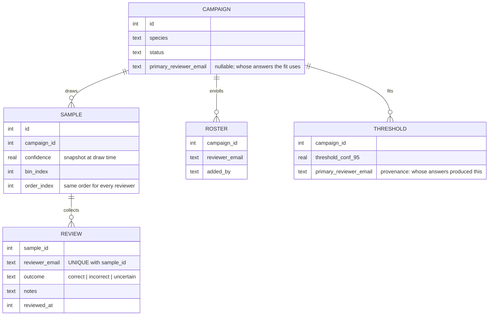
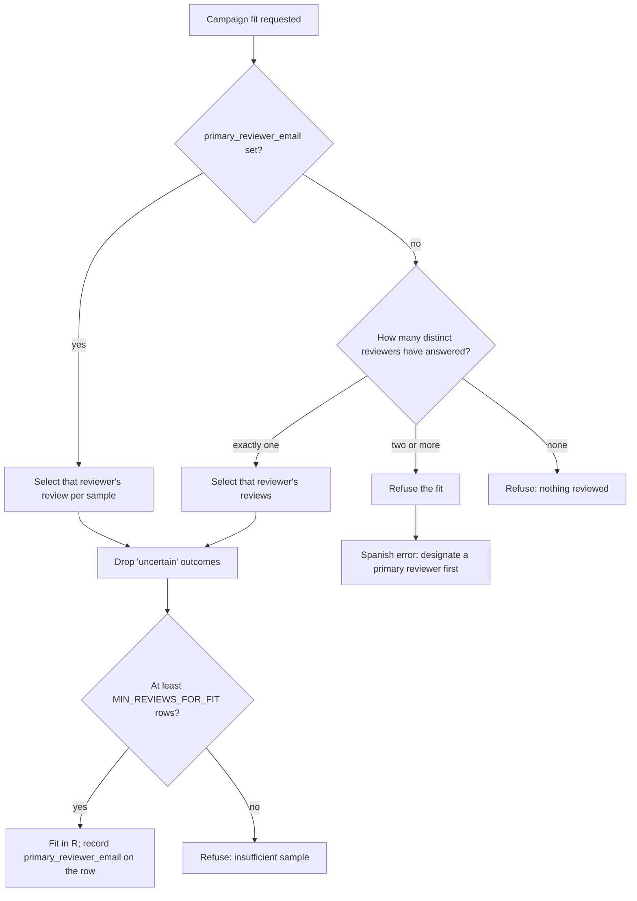

# feat: Multiple reviewers across the BirdNET validation workflow

## Summary

Rework the BirdNET threshold validation module so several people can review the
same species campaign. Every rostered reviewer answers every clip in the sample —
no partitioning, no claiming — and each answer is stored against its author
rather than overwriting the previous one. One reviewer is designated the campaign
expert; their answers alone feed the logistic fit, so a clip reviewed three times
still contributes one observation. The others' answers become inter-rater data:
percent agreement and Cohen's kappa against the expert, plus a browsable list of
the clips where they disagreed.

---

## Problem Frame

The validation module was built for one expert. `birdnet_validation_samples`
carries `review_outcome`, `reviewed_by`, `reviewed_at`, and `review_notes` as
columns on the sample row, so a clip has exactly one review and there is nowhere
to put a second opinion. Three concrete failures follow from that shape:

- **The queue hands everyone the same head.** `getReviewQueue` filters on
  `review_outcome IS NULL` with no reviewer predicate, so two people working
  simultaneously walk the identical list and duplicate each other for the whole
  session.
- **`recordReview` overwrites unconditionally.** If Juan marks a clip `correct`
  and a trainee later marks it `incorrect`, the second write silently wins. No
  error, no conflict flag, no record that the two disagreed.
- **Attribution is write-only.** `reviewed_by` is set on every review and read in
  exactly zero places — not the campaign page, not the fit, not the export.

Maia's plan brings Gloria, Gregory, and Tulane undergraduates into review after
Juan's first pass. Under the current shape a trainee's answer would silently
replace an expert's, and the threshold that answer helped set would be
indistinguishable from one Juan produced alone.

The precedent does not help here. Tebbutt et al. (2026) used three Colombian
experts and report no inter-rater statistic, no consensus rule, and no statement
of whether the three reviewed the same clips — their regional split (two Guaviare
experts, one Putumayo, with separately drawn regional samples) suggests they
divided the work. Full overlap is a deliberate step past that paper, not an
implementation of it.

The timing is favorable: the validation tables exist in dev but hold zero rows,
and the feature has never been committed or deployed. This is a schema edit, not
a migration.

---

## Requirements

### Roster and assignment

- R1. A campaign carries an explicit roster of reviewers. Any `grabaciones`
  editor can add or remove one.
- R2. Every rostered reviewer is served the same sample in the same order. There
  is no partitioning, claiming, or per-reviewer draw.
- R3. Recording a review auto-enrolls the reviewer, so the roster is a
  denominator rather than a gate.
- R4. One rostered reviewer may be designated primary. Their answers are the ones
  the model consumes.

### Review recording

- R5. A review is keyed to (clip, reviewer). A reviewer can revise their own
  answer; no action can create, alter, or delete another reviewer's.
- R6. The review UI never reveals another reviewer's answer, extending the
  existing score blinding.
- R7. A reviewer's queue serves only clips that reviewer has not personally
  answered.

### Fitting

- R8. The fit consumes exactly one outcome per clip. A clip reviewed by three
  people contributes one observation, not three.
- R9. When no primary is designated and more than one reviewer has answered, the
  fit is refused with a Spanish explanation rather than silently pooling.
- R10. A persisted fit records which reviewer's answers produced it.
- R11. Changing a campaign's primary reviewer records a system event and marks
  any existing fit as stale in the UI.
- R12. Triage go/no-go counts the fit-eligible review set, and the UI states that
  triage needs only one reviewer.

### Agreement

- R13. For each non-primary reviewer, the portal reports co-reviewed count,
  percent agreement, and Cohen's kappa against the primary.
- R14. Agreement is computed on read from stored reviews and never persisted.
- R15. When kappa is undefined — both reviewers used a single category, so chance
  agreement is 1 — the portal reports an explicit Spanish reason, not a number.
- R16. Clips where reviewers disagree are browsable with clip and spectrogram
  playback.

### Progress

- R17. Campaign progress reports per-reviewer completion counts and the
  fit-eligible totals as separate figures.
- R18. Bin progress reflects the fit-eligible review set, so the coverage chart
  matches what the fit will actually see.

---

## Key Technical Decisions

### KTD-1. Reviews move to a child table, keyed (sample, reviewer)

The clobbering bug is structural, so the fix should be structural. A
`birdnet_validation_reviews` table with `UNIQUE(sample_id, reviewer_email)`
makes "reviewer B overwrites reviewer A" unrepresentable rather than merely
forbidden by a guard someone could forget. The four review columns come off
`birdnet_validation_samples`.

Because the tables hold zero rows and the feature is uncommitted, this is an edit
to the `CREATE TABLE` statements in `scripts/push-schema.mjs`, not a migration.
No `DROP TABLE` belongs in the migrations array — it runs on every deploy and
would destroy live data later. Dev databases carrying the old shape get a
documented one-time manual drop.

### KTD-2. The fit consumes one outcome per clip, because pooling is pseudo-replication

This is the decision the whole plan turns on. Pooling every review into the GLM
is not merely a policy choice about whose judgment counts — it is statistically
invalid under full overlap. Three reviewers over 200 clips yields 600 rows, but
those rows carry the information of 200 independent observations, not 600. The
standard error of the fitted threshold scales roughly as `1/√n`, so the reported
confidence interval would come out about 42% narrower than the data supports
(`1 - 1/√3`).

The threshold's CI is the number that tells you whether 200 clips per species was
enough. Inflating its precision defeats the purpose of measuring it. So the fit
selects exactly one review per sample and the selection rule is explicit.

### KTD-3. The designated expert is authoritative, not a majority vote

With Juan as the contracted expert and trainees joining later, a 2-1 majority
could overrule him — which would let a trainee error rate move the threshold his
expertise exists to establish. The primary reviewer's answers feed the fit;
everyone else's are recorded and scored against his.

This is reversible in the direction that matters: once trainee agreement is
measured and found acceptable, switching a campaign to majority consumption is a
change to one selection query, and the raw reviews needed to recompute are all
still there. Starting with majority and discovering the trainees were unreliable
would mean refitting everything with no record of who said what.

### KTD-4. Full overlap, no partitioning

Every rostered reviewer answers every clip. This is what makes the reviewers
comparable at all — partial overlap gives agreement statistics on a subsample and
nothing on the rest.

The cost is real and should be stated rather than buried: three reviewers across
~200 species at 200 clips each is roughly 120,000 reviews instead of 40,000. Per
person the workload is unchanged (Symes' estimate of 5–10 species/hour still
applies, and reviewers work in parallel), so there is no wall-clock penalty — but
if reviewers are paid per detection rather than salaried, the line item triples.

### KTD-5. Agreement computed in TypeScript, on read, never persisted

Cohen's kappa is `(po − pe) / (1 − pe)` over a small contingency table — a few
hundred rows per campaign. It needs no R worker and no stored column. Computing
it on read means it is never stale after a reviewer revises an answer, and a pure
function is far easier to test against hand-worked examples than a persisted
aggregate.

### KTD-6. Reviewers stay blind to each other

The original plan blinds reviewers to the BirdNET score (KTD-7 there) because
seeing it first anchors the judgment and inflates the fitted slope. The same
reasoning applies with more force to another reviewer's answer: if a trainee can
see that Juan marked a clip `correct`, the agreement statistic measures deference
rather than independent skill, and the kappa it produces is meaningless. The
review queue and clip UI expose no other reviewer's outcome under any state.

### KTD-7. The roster is a denominator, not a gate

Enrolling a reviewer does not grant access — `grabaciones` editor permission
already does that — and recording a review auto-enrolls. The roster exists so the
campaign page can say "Gloria 0/200" for someone who has not started, which a
roster derived from existing reviews cannot express.

### KTD-8. Triage stays effectively single-reviewer

Triage exists to abandon hopeless species after ~10 clips. Running three
reviewers through it spends the effort the shortcut was meant to save. Triage
counts read from the fit-eligible set — the primary's answers, or the sole
reviewer's — and the UI says so. Full overlap applies to the main sample, where
the fit lives.

### KTD-9. `reviewer_email` stays free text with no foreign key

The original plan chose free text specifically so a future token-gated external
reviewer identity fits without a migration. Moving the field to a new table does
not change that reasoning, so no FK to `users` is added. The campaign page joins
to `users` for display names and tolerates a miss.

---

## High-Level Technical Design

### Data model

The four review columns leave `SAMPLE` entirely. Everything that reads a review
outcome goes through `REVIEW`.

### Fit input selection

The refusal at F is the load-bearing branch. Silently pooling there is exactly
the pseudo-replication KTD-2 rules out, and it would be invisible in the output —
the fit would succeed and report a falsely tight interval.

### Agreement, worked

For a primary reviewer P and a trainee T over their co-reviewed clips, the
contingency table drives both figures:

| | P: correct | P: incorrect | P: uncertain |
|---|---|---|---|
| **T: correct** | 84 | 6 | 3 |
| **T: incorrect** | 9 | 71 | 4 |
| **T: uncertain** | 2 | 5 | 16 |

Observed agreement `po` is the diagonal over the total — `(84+71+16)/200 =
0.855`. Expected agreement `pe` sums the products of the marginals —
`(0.465×0.475) + (0.42×0.41) + (0.115×0.115) ≈ 0.406`. Kappa is
`(0.855 − 0.406) / (1 − 0.406) ≈ 0.756`.

Three edge cases the implementation must handle rather than divide by zero: no
co-reviewed clips at all (report null), both reviewers using only one category so
`pe = 1` (kappa undefined — report the Spanish reason, since agreement is
trivially perfect and carries no information), and negative kappa (worse than
chance — a real, reportable result, not an error).

---

## Implementation Units

### U1. Reviews table, roster, and fit provenance

**Goal:** Reshape the schema so a clip can carry one review per reviewer, a
campaign can name its primary reviewer, and a fit records whose answers produced
it.

**Requirements:** R1, R4, R5, R10

**Dependencies:** none

**Files:**
- `src/db/schema.ts` — add `birdnetValidationReviews` and
  `birdnetValidationCampaignReviewers`; drop `reviewOutcome`, `reviewedBy`,
  `reviewedAt`, `reviewNotes` from `birdnetValidationSamples`; add
  `primaryReviewerEmail` to `birdnetValidationCampaigns` and to
  `birdnetSpeciesThresholds`
- `scripts/push-schema.mjs` — edit the three validation `CREATE TABLE` blocks in
  place; add the two new tables and their indexes
- `tests/helpers/test-db.ts` — mirror the DDL change
- `src/lib/birdnet-validation/types.ts` — add the fit-eligibility reason codes and
  their Spanish strings

**Approach:** `birdnet_validation_reviews` carries `sample_id`,
`reviewer_email`, `outcome` (CHECK-constrained to the three values), `notes`, and
`reviewed_at`, with `UNIQUE(sample_id, reviewer_email)`. Index
`(reviewer_email, sample_id)` for the per-reviewer queue's NOT EXISTS lookup, and
`(sample_id)` for the agreement and disagreement reads.
`birdnet_validation_campaign_reviewers` carries `campaign_id`, `reviewer_email`,
`added_by`, `added_at`, with `UNIQUE(campaign_id, reviewer_email)`.

The CHECK constraint on `outcome` must be written into the raw DDL — Drizzle's
`text({ enum })` is TypeScript-only, and a mismatch surfaces as a runtime
`SQLITE_CONSTRAINT_CHECK` that types and tests both miss.

No `DROP TABLE` goes into the migrations array. Dev databases carrying the old
shape are reset once by hand; note the command in the unit's verification rather
than automating a destructive step.

**Patterns to follow:** the existing validation DDL blocks in
`scripts/push-schema.mjs`; the `COALESCE(col, -1)` partial-index comment already
there explains why NULL-distinctness matters and should stay accurate after the
edit.

**Test scenarios:**
- Inserting two reviews for the same `(sample_id, reviewer_email)` raises a
  uniqueness error; two reviews of the same sample by different reviewers both
  persist.
- An `outcome` outside `correct | incorrect | uncertain` raises
  `SQLITE_CONSTRAINT_CHECK` at the DB layer, not just a type error.
- Deleting a campaign cascades to its samples, their reviews, and its roster rows.
- `push-schema.mjs` run twice against a scratch database is idempotent and leaves
  both new tables with their indexes.

**Verification:** A scratch database built from `push-schema.mjs` has both new
tables, the samples table has no review columns, and the full unit suite runs
against the updated `test-db.ts` DDL without schema errors.

---

### U2. Per-reviewer recording and queue

**Goal:** Each reviewer answers independently — their queue skips only what they
personally answered, and their write can never touch anyone else's.

**Requirements:** R2, R3, R5, R7, R11

**Dependencies:** U1

**Files:**
- `src/app/audio/validacion/actions.ts` — rewrite `recordReview` and
  `getReviewQueue`; add `addReviewer`, `removeReviewer`, `setPrimaryReviewer`
- `tests/integration/birdnet-multi-reviewer.test.ts` (new)
- `tests/integration/birdnet-campaign-actions.test.ts` — update the existing
  review-path assertions to the new shape
- `src/lib/system-events.ts` — no new job type; the primary-reviewer change is a
  plain `recordEvent` call from the action

**Approach:** `recordReview` upserts on `(sample_id, current user email)`,
preserving the existing idempotence rule — the same answer twice leaves
`reviewed_at` untouched — but scoped to the caller's own row. The unique index
makes cross-reviewer writes impossible, so no guard clause is needed and none
should be added; the constraint is the guard.

`getReviewQueue` filters with `NOT EXISTS (SELECT 1 FROM birdnet_validation_reviews
WHERE sample_id = … AND reviewer_email = <caller>)`, ordered by `order_index` as
before, so every reviewer walks the identical list in the identical order.

`setPrimaryReviewer` records a system event (source `audio`, the campaign as
target) because it silently changes what a subsequent fit will consume.
`addReviewer` and `removeReviewer` manage the roster; removing a reviewer leaves
their reviews intact — the roster is a denominator, and deleting recorded
judgments to tidy a list would destroy data.

**Patterns to follow:** the existing `requirePermission("grabaciones", "editor")`
gate and `ActionResult` shape used throughout `actions.ts`; `recordEvent` usage in
`applyThreshold` in the same file.

**Test scenarios:**
- Reviewer A marks a clip `correct`; reviewer B then marks the same clip
  `incorrect`. Both rows exist, each with its own author, and A's row is
  unchanged.
- Reviewer A revises their own answer from `correct` to `incorrect`. One row for
  A, updated outcome, updated timestamp.
- Reviewer A records the identical answer twice; `reviewed_at` does not move.
- Reviewer A has answered clips 1–5 of a 20-clip sample; A's queue starts at 6
  while B's, who has answered nothing, starts at 1. Both queues are in
  `order_index` order.
- A reviewer not on the roster records a review and appears on the roster
  afterward.
- Removing a reviewer from the roster leaves their recorded reviews readable.
- Setting the primary reviewer writes a `system_events` row naming the campaign
  and the new primary.
- Every new action rejects a caller without `grabaciones` editor permission.

**Verification:** Two simulated reviewers work the same campaign concurrently in
an integration test and neither loses an answer; each queue reflects only its own
author's progress.

---

### U3. Fit input selection

**Goal:** The logistic fit sees exactly one observation per clip, drawn from the
designated primary, and refuses rather than pooling when the choice is ambiguous.

**Requirements:** R8, R9, R10, R12

**Dependencies:** U1, U2

**Execution note:** Write the pseudo-replication test first — three reviewers
over N clips must produce N observations. It is the requirement most likely to
regress silently, because pooling produces a plausible-looking fit rather than an
error.

**Files:**
- `src/lib/birdnet-validation/fit-job.ts` — `loadObservations` selects by primary
  reviewer; `countUncertain` follows the same rule; `persistOne` records
  `primaryReviewerEmail`
- `src/app/audio/validacion/actions.ts` — `runFit` surfaces the refusal;
  `finalizeTriage` and `getCampaignProgress` adopt the same fit-eligible rule
- `tests/integration/birdnet-multi-reviewer.test.ts` — extend from U2

**Approach:** Introduce one shared helper that resolves a campaign's fit-eligible
review set and is the only path to a review outcome for scientific purposes. It
returns either the rows or a typed reason (`no_primary_reviewer`,
`nothing_reviewed`). Every consumer — the fit, triage counts, bin progress,
campaign totals — goes through it, so the number the coverage chart shows and the
number the fit uses cannot drift apart.

When `primary_reviewer_email` is null and exactly one reviewer has answered, that
reviewer is used. This keeps the single-reviewer case working unchanged, which
matters because most campaigns will start that way and only gain reviewers later.

The `uncertain` exclusion and `MIN_REVIEWS_FOR_FIT` gate are unchanged; they now
apply to the selected set rather than to every review.

**Patterns to follow:** the existing `loadObservations` / `countUncertain` split
in `fit-job.ts`; the typed `UnusableReasonCode` → Spanish map in
`src/lib/birdnet-validation/types.ts`.

**Test scenarios:**
- Three reviewers each answer all 200 clips; with a primary designated, the fit
  request carries exactly 200 observations and they are the primary's answers.
- Same setup with no primary designated: the fit is refused with the Spanish
  "designate a primary reviewer" message and no threshold row is written.
- One reviewer, no primary designated: the fit runs on that reviewer's answers.
- The primary has answered 40 of 200 clips while a trainee has answered all 200:
  the fit sees 40 observations, not 200.
- The primary marks 15 clips `uncertain`; those are excluded and counted
  separately, and the exclusion does not pull in the trainee's answers for the
  same clips.
- A persisted threshold row carries the primary reviewer's email.
- Triage true-positive count reflects the primary's answers when a trainee
  answered the triage clips differently.
- Changing the primary and refitting produces a new threshold row with the new
  email; the prior row is untouched.

**Verification:** The pseudo-replication test passes, and a campaign with three
full reviewers produces a threshold whose `n_reviewed` equals the sample size
rather than three times it.

---

### U4. Agreement statistics

**Goal:** A pure, tested function that turns two reviewers' answers into
co-reviewed count, percent agreement, and Cohen's kappa.

**Requirements:** R13, R14, R15

**Dependencies:** U1

**Execution note:** Test-first. The math has three degenerate cases that are
easier to specify before implementing than to discover afterward.

**Files:**
- `src/lib/birdnet-validation/agreement.ts` (new)
- `src/lib/birdnet-validation/__tests__/agreement.test.ts` (new)
- `src/lib/birdnet-validation/types.ts` — Spanish strings for the undefined-kappa
  reasons

**Approach:** A pure function over two aligned arrays of outcomes (or a list of
`{ sampleId, a, b }` pairs), returning `{ n, agreed, percentAgreement, kappa,
kappaReason }`. No database access, no I/O — the caller assembles the pairs.

Kappa is `(po − pe) / (1 − pe)` over the three-category outcome as recorded.
Categories are not collapsed and `uncertain` is not dropped: disagreement about
whether a clip is judgeable is exactly the signal a trainee-calibration statistic
should capture, and it is the category most likely to separate an expert from a
novice.

`kappa` is null with a reason code when `n` is zero or when `pe` is 1. A negative
kappa is returned as-is.

**Patterns to follow:** the pure-function-plus-Spanish-reason-map shape already
used by `src/lib/birdnet-validation/binning.ts` and the `UNUSABLE_REASON_ES` map.

**Test scenarios:**
- The worked contingency example from the plan's design section returns
  `percentAgreement = 0.855` and `kappa ≈ 0.7558` to a stated tolerance.
- Perfect agreement across all three categories returns `kappa = 1`.
- Both reviewers answer `correct` on every clip: `percentAgreement = 1`, `kappa`
  null with the "no variation" reason.
- Systematic opposite answers return a negative kappa rather than null or zero.
- No co-reviewed clips returns `n = 0` and null kappa with the "no overlap"
  reason.
- Agreement at chance level returns kappa near zero.
- A pair where one reviewer used `uncertain` and the other did not is counted as
  a disagreement, not skipped.

**Verification:** The worked example matches a hand computation, and every
degenerate branch returns a reason code rather than `NaN`, `Infinity`, or a
thrown error.

---

### U5. Campaign page: roster, primary selector, agreement panel

**Goal:** The campaign page shows who is reviewing, how far each has gotten, who
the fit listens to, and how well the others agree.

**Requirements:** R1, R4, R11, R13, R17, R18

**Dependencies:** U2, U3, U4

**Files:**
- `src/app/audio/validacion/[slug]/page.tsx` — load roster, per-reviewer
  progress, and agreement
- `src/app/audio/validacion/[slug]/reviewer-roster.tsx` (new) — roster list, add
  and remove controls, primary designation
- `src/app/audio/validacion/[slug]/agreement-panel.tsx` (new)
- `src/app/audio/validacion/[slug]/campaign-controls.tsx` — surface the stale-fit
  warning when the primary changed after the last fit
- `src/app/audio/validacion/actions.ts` — extend `CampaignProgress` with
  `reviewers[]` and fit-eligible totals
- `src/app/audio/validacion/[slug]/__tests__/reviewer-roster.test.ts` (new) — pure
  sorting and display helpers

**Approach:** `CampaignProgress` gains a `reviewers` array of
`{ email, name, reviewed, correct, incorrect, uncertain, isPrimary }`, joined to
`users` for display names with the email as fallback. The existing scalar totals
and `bins` come to mean the fit-eligible set explicitly, matching U3's shared
helper, so the coverage chart shows what the fit will consume.

The primary selector is a control on the roster, not a separate dialog — it is a
property of a reviewer's relationship to the campaign. Designating a primary when
a fit already exists shows a warning that the existing threshold was fitted from a
different reviewer's answers, using the `primary_reviewer_email` recorded on the
threshold row.

The agreement panel renders one row per non-primary reviewer against the primary,
with the co-reviewed count, percent agreement, and kappa, and shows the Spanish
reason in place of a number when kappa is undefined. It renders nothing when no
primary is designated, with a Spanish note explaining why.

**Patterns to follow:** the existing server-component-loads / client-component-
renders split in `[slug]/page.tsx`; `fit-summary.ts` as the precedent for pure
display helpers tested separately from the component.

**Test scenarios:**
- Per-reviewer counts sum correctly and a rostered reviewer who has answered
  nothing renders as `0 / N` rather than being omitted.
- The primary is visually distinguished and appears first in the roster.
- With no primary designated, the agreement panel renders its Spanish
  explanation, not an empty table or a crash.
- A campaign whose latest threshold row carries a different
  `primary_reviewer_email` than the campaign's current one renders the stale-fit
  warning.
- Undefined kappa renders the Spanish reason string, not `null`, `NaN`, or a
  blank cell.
- Bin progress totals equal the fit-eligible reviewed count, not the sum across
  all reviewers.

**Verification:** A campaign with three reviewers at different completion levels
renders correct per-reviewer progress, and the coverage chart's reviewed total
matches the `n_reviewed` of a fit run from the same state.

---

### U6. Disagreement browser

**Goal:** A page listing the clips where reviewers differed, playable, so
disagreements can be examined rather than merely counted.

**Requirements:** R16

**Dependencies:** U1, U2

**Files:**
- `src/app/audio/validacion/[slug]/desacuerdos/page.tsx` (new)
- `src/app/audio/validacion/[slug]/desacuerdos/disagreement-table.tsx` (new)
- `src/app/audio/validacion/actions.ts` — `getDisagreements(campaignId)`

**Approach:** Select samples with two or more distinct outcomes among their
reviews, returning each reviewer's answer alongside the clip's confidence, bin,
and site. Reuse the existing `/api/audio/validation-clip` and
`/api/audio/validation-spectrogram` endpoints unchanged — the clip cache is keyed
on the identification, not the reviewer, so no new caching work is needed.

The table is sortable per the project convention, following the client-side
`useState` pattern with the shared `SortIcon`. Sort by confidence by default,
descending — high-confidence disagreements are the most diagnostic, since those
are the clips a threshold would retain.

This view is diagnostic, not a workflow: because the designated expert is
authoritative (KTD-3), no adjudication step is needed and none is built.

**Patterns to follow:** `src/app/finance/expenses/expense-table.tsx` for the
client-side sortable table pattern with `SortIcon`; the blinding rules do not
apply here — this page is for inspection after review, and it necessarily shows
every reviewer's answer.

**Test scenarios:**
- A clip where two reviewers agree and a third differs appears once, listing all
  three answers.
- A clip all reviewers answered identically does not appear.
- A clip reviewed by only one person does not appear.
- A clip where one reviewer said `correct` and another `uncertain` appears —
  uncertain counts as a distinct answer.
- Each sortable column orders correctly in both directions with a stable
  tiebreaker.
- The page renders an empty state in Spanish when there are no disagreements.

**Verification:** The disagreement count on the page matches the co-reviewed
minus agreed figures the agreement panel reports for the same campaign.

---

### U7. Review page and campaign index

**Goal:** The review loop reflects the reviewer's own progress and reveals
nothing about anyone else's; the campaign list shows reviewer coverage.

**Requirements:** R6, R7, R17

**Dependencies:** U2, U3

**Files:**
- `src/app/audio/validacion/[slug]/revisar/page.tsx` — per-reviewer queue and
  progress header
- `src/app/audio/validacion/[slug]/revisar/review-client.tsx` — progress counts
  scoped to the caller
- `src/app/audio/validacion/campaign-table.tsx` — reviewer-count and
  primary-reviewer columns, sortable
- `src/app/audio/validacion/actions.ts` — `listCampaigns` returns reviewer counts
- `src/app/audio/validacion/__tests__/campaign-table.test.ts` — extend the pure
  sort helper tests

**Approach:** The review client's counters change meaning from campaign-wide to
"your progress", which is the only figure that makes sense when the denominator is
the same for everyone but the numerator is personal. The keyboard shortcuts,
optimistic advance, prefetch, and score blinding are untouched.

The blinding audit is the substantive part of this unit: no server action feeding
the review page may return another reviewer's outcome, including in prefetched
payloads and error states. This is easy to violate accidentally by reusing a query
written for the campaign page.

`campaign-table.tsx` gains a reviewer count and the primary reviewer's name, both
sortable via the existing pure `sortCampaignRows` helper.

**Patterns to follow:** the existing pure-helper-plus-client-component split in
`campaign-table.tsx` and `use-review-shortcuts.ts`; the sortable-table convention
in `CLAUDE.md`.

**Test scenarios:**
- The review page's progress header for reviewer B shows B's counts while A has
  answered a different number of clips.
- No payload reaching the review client contains another reviewer's outcome —
  assert on the action's return shape, not just the rendered output.
- Sorting the campaign index by reviewer count and by primary reviewer orders
  correctly in both directions.
- A campaign with no primary designated renders a Spanish placeholder in that
  column rather than an empty cell.
- The existing keyboard shortcuts and optimistic advance still behave as before.

**Verification:** Two reviewers at different progress levels each see their own
counts, and a review-path payload inspection confirms no cross-reviewer outcome
leaks.

---

## System-Wide Impact

The occupancy pipeline, species browser, CSV exports, and every audio surface read
thresholds through `loadActiveSpeciesThresholds` and the shared species filter.
None of them changes: a threshold is still one number per species, and this work
changes only *how* that number is produced. The provenance improves —
`birdnet_species_thresholds.primary_reviewer_email` now records whose judgment
stands behind each threshold, alongside the existing
`occupancy_runs.species_thresholds_json`.

The one behavioral change beyond the validation module is that a fit can now be
refused where it previously would have run. That only occurs in a state the
current code cannot reach (multiple reviewers with no designated primary), so no
existing campaign is affected.

This is the portal's first genuinely multi-reviewer surface. The camera-trap
detections and audio identifications tables both carry single `verified_by`
columns with the same clobbering exposure. Nothing here obliges fixing those, but
the reviews-child-table shape is the pattern to reach for if that ever matters.

---

## Risks & Dependencies

- **The blinding requirement is easy to violate and invisible when violated.** A
  reviewer who can see another's answer produces an agreement statistic that
  measures deference. R6 has an explicit test asserting on payload shape rather
  than rendered output, because a field can reach the client and never be
  displayed.
- **Pseudo-replication fails silently.** Pooling produces a successful fit with a
  plausible threshold and a too-narrow interval — nothing errors. U3's test-first
  execution note exists for this reason.
- **The dev database needs a manual reset.** `CREATE TABLE IF NOT EXISTS` will not
  reshape the existing empty tables, so a dev database keeps the old columns and
  the app fails at query time with a confusing error. Documented in U1's
  verification.
- **Reviewer effort is the real constraint, not the software.** Full overlap
  triples total expert time. If that proves impractical after the first few
  species, the fallback is partial overlap — a subset of clips assigned to
  everyone and the rest to the primary — which this schema supports without
  change, since the roster and the review keying make no assumption that every
  reviewer answers every clip.
- Depends on the unmerged BirdNET validation work in the current working tree.
  This plan edits files that exist only there.

---

## Scope Boundaries

### In scope

Roster, per-reviewer review recording and queues, fit input selection, agreement
statistics, the disagreement browser, and the progress and index surfaces that
report them.

### Deferred to follow-up work

- **Majority-vote or consensus consumption.** KTD-3 chooses expert-authoritative
  and notes the switch is a change to one selection query once trainee agreement
  is measured.
- **All-pairs agreement.** Only primary-versus-each is computed. Trainee-versus-
  trainee agreement is interesting for calibration but not for the fit.
- **Adjudication workflow.** Unnecessary while the expert is authoritative.
- **Reviewer performance across campaigns.** A per-reviewer view spanning every
  species would show whether a trainee is improving. Out of scope here; the data
  supports it.
- **Partial overlap.** The schema permits assigning a subset to everyone, but no
  UI expresses it.

### Outside this work

- The sampling design, the logistic fit itself, the R runner protocol, clip
  cutting and caching, and threshold application downstream. All unchanged.
- The single-`verified_by` shape on camera-trap detections and audio
  identifications. Same exposure, different module, not this plan's problem.
- Everything already listed as deferred or outside scope in the origin plan:
  per-detection probabilities, false-positive-tolerant occupancy models, spatial
  and temporal covariates, custom classifier training, bulk campaign creation,
  token-gated external reviewers, and per-recorder thresholds.

---

## Open Questions

- **Whether triage should stay single-reviewer.** KTD-8 says yes on efficiency
  grounds, but if triage decisions turn out to be contentious — a species one
  reviewer would abandon and another would keep — the go/no-go may deserve the
  same overlap as the main sample. Worth revisiting after the first several
  species.
- **Whether a low kappa should block applying a threshold.** Currently it is
  reported and nothing more. A trainee disagreeing sharply with the expert says
  something about the trainee, not the threshold, so blocking is probably wrong —
  but a very low kappa on a species where the expert also marked many clips
  `uncertain` may indicate the species is genuinely ambiguous and the threshold
  untrustworthy.
- **Whether `uncertain` belongs in the kappa.** U4 includes it as a third
  category, on the reasoning that expert-versus-novice differences show up there
  first. A binary variant excluding it would be more comparable to published
  figures. Both are cheap; the question is which to display by default.

---

## Sources & Research

- Tebbutt, C.A. et al. (2026, draft). *BirdNET Thresholds and a Custom Classifier
  for Vocalisations of Forest-Dependent Bird Species of the Colombian Amazon.*
  Methods lines 113–122 and the Technical Validation section — three named
  experts, no inter-rater statistic, no consensus rule, and a regional split
  suggesting divided rather than overlapping review. Establishes that full
  overlap goes beyond the precedent rather than following it.
- Wood, C.M. & Kahl, S. (2024). *Guidelines for appropriate use of BirdNET scores
  and other detector outputs.* J Ornithol 165, 777–782 — the logistic threshold
  method whose one-observation-per-clip assumption KTD-2 preserves.
- Collaborator correspondence (Symes, Hall, August 2026) — the 5–10 species/hour
  review rate behind KTD-4's cost estimate, and Hall's plan to bring trainees in
  after Juan's first pass, which is what makes reviewer tiering necessary.
- `docs/plans/2026-08-04-002-feat-birdnet-validation-thresholds-plan.md` — origin
  plan; KTD-7 there (blinding) extends to KTD-6 here, and its deferred
  "inter-reviewer agreement" item is what this plan implements.
- `src/lib/birdnet-validation/fit-job.ts`, `src/app/audio/validacion/actions.ts` —
  the current single-reviewer implementation these units reshape.
