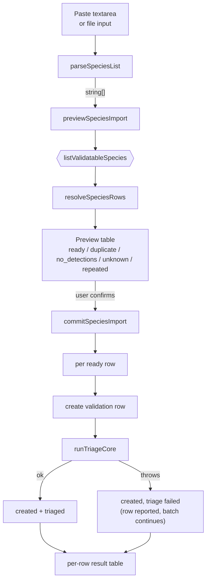
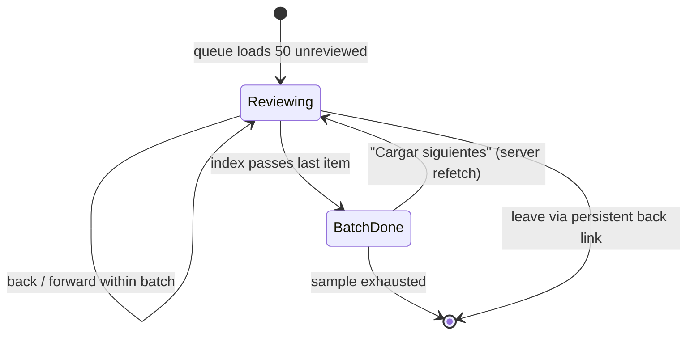

# feat: Species selection and review ergonomics for BirdNET threshold validation

## Summary

Rework how someone gets into, and moves through, a BirdNET threshold validation
review. Nothing about the sampling design, the logistic fit, or the multi-reviewer
model changes.

Three surfaces are affected. **Getting in**: the free-text species box becomes a
picker over the 554 species that actually have BirdNET detections, plus a
paste-or-upload path for a list of names that resolves each row, skips the ones
already present, and runs the triage pass automatically. **Finding your way**: the
word *campaña* leaves the interface entirely, the species table grows a direct
review action per row, and common names can be read in Spanish or English via a
preference that sticks across the module. **Reviewing**: the spectrogram gains a
playhead and a band marking where the detection sits, the clip's real recording
timestamp is shown, the arrow keys advertise themselves, and running out of a
50-clip batch offers the next batch instead of a dead end.

One correctness fix rides along because it blocks the rest: the review queue
currently walks the sample in ascending confidence order, which leaks the score
the blinding exists to hide.

---

## Problem Frame

The validation module shipped its statistics before its ergonomics. Four
concrete failures, in the order a user hits them:

**Starting a validation requires knowing the answer already.** The only way to
begin is to type a scientific name into an empty box. Nothing offers the 554
species that have detections, nothing says how many detections each has, and a
typo silently creates a campaign that can never draw a sample. The species list
in practice arrives as a spreadsheet column, and the interface has no way to
accept one.

**The vocabulary describes the implementation, not the task.** "Campaña",
"triaje", and raw status strings (`draft`, `sampled`, `fitted`) are rendered
directly. A user looking at the page cannot tell what a campaign is or what they
are supposed to do next. The species name doubling as the only navigation
affordance compounds this — there is no visible way to reach the thing you came
to do.

**The review screen withholds context the reviewer needs.** A 9-second clip is
shown with a static spectrogram and no indication of *where in it* BirdNET
claims to have heard the bird, no playback position, and no recording time. The
reviewer is asked to judge a detection whose location they must infer.

**Progress is durable but appears not to be.** Answers persist immediately and
the queue already filters out clips you have reviewed, so a reload resumes
correctly. Nothing says so. Worse, the queue loads 50 clips against a 200-clip
sample, and exhausting the batch renders "Cola completada" — which reads as
"campaign finished" when 150 clips remain, with no control to continue.

### Discovered during research

Two findings changed what this plan can promise, both verified against the dev
database rather than assumed.

**BirdNET does not record frequency bounds.** Of 2,491,919 rows in
`audio_detections`, 2,491,918 carry `min_freq = 0, max_freq = 15000` — a
placeholder, not a measurement. A frequency-axis box around the detection would
therefore be a full-height rectangle on every clip, and would additionally extend
past the top of an image whose display ceiling is 12 kHz. The detection outline
can only be a **time band**. This is recorded as a scope boundary, not a
deferral: no amount of implementation effort recovers data the model never wrote.

**The review queue is ordered by confidence.** `drawStratifiedSample` emits
candidates bin by bin in ascending order, and `orderIndex` is assigned from that
emission order, so a reviewer walks the sample from the lowest score band to the
highest. The first ~22 clips all fall in [0.1, 0.2); the last ~22 all fall in
[0.9, 1.0). The sample-composition table on the species page states the bands are
equal-sized, so position maps to score band by inspection. This is precisely the
anchoring the blinding was built to prevent, and it is worse than showing the
number would be — a reviewer notices monotonically improving audio within a dozen
clips whether or not they consciously reason about it. It also blocks R12: adding
a visible queue position would make the leak explicit.

---

## Requirements

Traced from the request. Each maps to at least one implementation unit.

| ID | Requirement | Units |
|----|-------------|-------|
| R1 | Selecting a species offers the species that have BirdNET detections, with detection counts, instead of an empty text field | U1, U3 |
| R2 | A species already under validation is visibly marked as such at selection time, not rejected after submission | U1, U3 |
| R3 | A list of species names can be pasted (one per line or a copied spreadsheet column) or uploaded as a file | U4 |
| R4 | Names already present are skipped rather than erroring; every input row reports what happened to it | U4 |
| R5 | The paste/upload control carries its own instructions — accepted formats and what will happen | U4 |
| R6 | Bulk-added species run their triage pass automatically as part of the same action | U4 |
| R7 | The word *campaña* does not appear in the interface; statuses read as plain language | U2 |
| R8 | Each row of the species table carries a direct control to reach the review screen | U2 |
| R9 | Common names can be read in Spanish or English, and the choice persists across the validation pages | U5 |
| R10 | Left/right arrow behaviour during review is visible on screen, not discovered by experiment | U9 |
| R11 | The reviewer can move backward and forward through the current batch, and revising an earlier answer is saved | U9 |
| R12 | The reviewer's position in the current batch is visible, and position carries no information about the score | U6, U9 |
| R13 | Returning to the species page is possible at any point during review, not only at the end | U9 |
| R14 | Exhausting a batch offers the next batch; progress-is-saved is stated rather than implied | U9 |
| R15 | The clip's recording date and time are shown during review | U7, U8 |
| R16 | A playback position indicator tracks the audio across the spectrogram | U8 |
| R17 | The detection's extent is marked on the spectrogram (time axis only — see Scope Boundaries) | U7, U8 |
| R18 | Blinding is preserved: nothing added reveals the BirdNET score before the reviewer answers | U6, U8, U9 |

---

## Key Technical Decisions

### KTD1 — The species catalog is one server action shared by the picker and the bulk import

Both the picker (U3) and the bulk preview (U4) need the same thing: every species
with BirdNET detections, its detection count, both display names, and whether it
is already under validation. Deriving it twice invites the two surfaces to
disagree about what is selectable. One action, `listValidatableSpecies`, feeds
both.

The catalog is sourced from `audio_identifications` and left-joined to
`biochoco_species`, **not** the other way round. The species table holds ~6k
BirdNET taxonomy labels of which only 554 have ever been detected here; listing
all 6k is the current failure in a different costume. One detected species has no
`biochoco_species` row at all, so the join must tolerate a miss and fall back to
the scientific name.

### KTD2 — Bulk import follows the finance preview→commit pattern, not a one-shot upload

`src/app/finance/data/sueldos-import-card.tsx` establishes the pattern: parse and
resolve server-side, return a preview the user reads, commit only on a second
explicit action. The alternative — resolve and create in one call — means a
misspelled name is discovered as a created-then-abandoned row. Since this action
also fires triage (R6), which draws real samples and hits ODK, an unreviewed
commit is expensive to undo.

The preview classifies every input row into exactly one outcome, and the commit
acts only on `ready` rows:

| Outcome | Meaning |
|---------|---------|
| `ready` | Resolves to a detected species with no active validation |
| `duplicate` | Already under validation — skipped per R4 |
| `no_detections` | Known species, zero BirdNET detections — cannot draw a sample |
| `unknown` | No species matched this text |
| `repeated` | Appears more than once in the pasted input itself |

### KTD3 — Bulk commit is fault-isolated per species and capped

One species failing triage — ODK unreachable, no detections in the caller's
accessible projects — must not roll back the other 29. The commit loops, catches
per species, and returns a per-row result. The batch is capped (50 rows) so a
single server action stays inside a sane request window.

The loop is safe to write sequentially because `loadSiteHabitatMap` is wrapped in
`React.cache`: all iterations inside one server action share a single ODK
round-trip. This is the reason bulk triage is affordable at all, and it is why
the triage core must be extracted as a plain helper rather than the bulk path
calling the `runTriagePass` server action in a loop (which would also re-run
`requirePermission` per species).

### KTD4 — Name language is a cookie read on the server, not client state

Every surface that renders a species name in this module is a Server Component.
The three candidates:

- **Client state + localStorage** — forces every display site to become or wrap a
  Client Component, and flashes the wrong language on first paint.
- **URL parameter** — must be threaded through every link, and collides with the
  existing `sortBy`/`sortDir` params.
- **Cookie** — the toggle writes it client-side and calls `router.refresh()`;
  each server page reads it and renders the right name. No prop drilling, no
  flash.

Cookie wins. Reading a cookie opts the route into dynamic rendering, which costs
nothing here — every one of these pages already calls `requirePermission`, which
reads headers.

Resolution is a pure function with an explicit fallback chain, because coverage
is not total: of 554 detected species, 553 have an English common name and 528
have a Spanish one. Spanish falls back to English then scientific; English falls
back to scientific. The scientific name is always rendered alongside, so a
fallback is never ambiguous.

### KTD5 — Presentation order is decoupled from confidence order

`orderIndex` is reassigned so queue position carries no score information, using
the campaign's existing `seed` through the same Knuth-hash construction the
sampler already uses for reproducibility. Confidence order is not *sorted away* —
it is replaced with a deterministic shuffle, so the ordering is still
reconstructible from the seed.

This applies to the triage block as well as the stratified sample. Triage's
purpose is *which* clips are drawn (the top N by score), not the order they are
shown; presenting them shuffled preserves the design and removes a rank leak.
Triage answers feed the fit exactly as sample answers do, so they carry the same
anchoring risk.

**This changes no sampled row's identity, only its `orderIndex`.** Which clips
were drawn, their confidence snapshots, and every recorded review are untouched,
so no fit changes. The dev database holds 2 campaigns / 210 samples / 15 reviews
and the feature has never been deployed, so backfilling existing rows is safe.

### KTD6 — Spectrogram overlay geometry is computed per sample, never assumed

The cached spectrogram is rendered from the cut clip, so image width maps exactly
onto the clip window — but the window is `[max(0, start − 3), min(duration,
end + 3)]`, and both bounds clamp. A detection at t=1.0s in a 60s file yields a
7-second window with the detection at 14–57%, not the 33–67% a 9-second window
would give. Hardcoding the midpoint produces a band that is subtly wrong exactly
on the edge cases, and looks right everywhere else — the worst failure shape.
Geometry travels with each queue item.

Two rendering facts the overlay depends on, both worth stating because changing
either silently breaks it:

- The image is painted with `object-fit: fill` and encoded with sharp's
  `fit: "fill"` — deliberately distorted to the box rather than letterboxed.
  A percentage-based overlay therefore maps linearly onto the rendered box.
  Switching to `contain` would introduce letterboxing the overlay does not model.
- The AAC encoder adds priming delay at the front of the clip (~20–45 ms), so the
  decoded timeline is marginally longer than the requested cut. The playhead uses
  `currentTime / duration` — both decoded, so both consistent. The band divides
  its computed offsets by `duration` once loaded, falling back to the computed
  span before metadata arrives. The residual error is under 10 px of 1600 and is
  accepted rather than corrected.

### KTD7 — Every added affordance is checked against blinding

The score stays hidden until the reviewer answers. Three additions were audited
against that:

- **Timestamp and site** carry no score information. Safe.
- **Detection time band** marks where BirdNET claims the call is, not how
  confident it was. Safe — and it is the same information the reviewer would get
  by listening, delivered faster.
- **Queue position** would leak the score band under today's ordering, which is
  why U6 precedes U9. `binIndex` already travels to the client in `ReviewItem`
  and is unused; it must stay unrendered.

---

## High-Level Technical Design

### Bulk import flow



The two boundaries that matter: `parseSpeciesList` and `resolveSpeciesRows` are
pure and testable without a database, and the `J -->|throws|` edge is the
fault-isolation requirement from KTD3 drawn explicitly.

### Spectrogram overlay geometry

Directional guidance for review, not implementation specification.

```
audio_detections:   start ────────── end          (always exactly 3.0 s)
                      │                │
clip window:  max(0, start-3) ──────────────── min(duration, end+3)
                      ├────────────────┤
                   win.start                   win.end
                      │<──── span ────────────────>│

spectrogram image (1600 px, object-fit: fill, 0–12 kHz linear, 0 Hz at bottom)
┌──────────────────────────────────────────────────────────────┐
│                    ░░░░░░░░░░░░░░░░                          │
│                    ░░ detection ░░           ▏playhead       │
│                    ░░░  band   ░░░           ▏               │
└──────────────────────────────────────────────────────────────┘
                     ↑                ↑        ↑
              bandLeft%         bandRight%   playhead%

bandLeft%   = (det.start - win.start) / span * 100
bandRight%  = (det.end   - win.start) / span * 100
playhead%   = currentTime / (audio.duration ?? span) * 100
```

No frequency dimension is used: `min_freq`/`max_freq` are placeholders (see
Problem Frame). The band spans the full image height.

### Review batch lifecycle



Today `BatchDone` is terminal and indistinguishable from sample-exhausted. U9
splits them.

---

## Implementation Units

### U1. Species catalog action

**Goal.** One server action returning every species with BirdNET detections, its
detection count, both display names, and its current validation state.

**Requirements.** R1, R2.

**Dependencies.** None.

**Files.**
- `src/app/audio/validacion/actions.ts` (add `listValidatableSpecies`)
- `src/app/audio/validacion/__tests__/species-catalog.test.ts` (new)

**Approach.** Group `audio_identifications` by species for counts, left-join
`biochoco_species` for names, left-join active validation rows for the
already-present flag. One query, not one per species — the picker renders 554
rows. `requirePermission("grabaciones", "viewer")`.

Scope detection counts to the caller's accessible camera-trap projects using the
existing `getUserCameraTrapProjects` helper, so the count shown at selection time
matches what a draw would actually find. A species whose only detections sit in
an inaccessible project must report zero, not a number the user cannot act on.

**Patterns to follow.** `listCampaigns` in the same file for shape and error
handling; `ActionResult<T>` per project convention.

**Test scenarios.**
- Returns one row per distinct species in `audio_identifications`, not one per
  detection.
- Detection count matches the row count for that species.
- A species with a `biochoco_species` row reports both `commonName` and
  `spanishName`.
- A detected species with **no** `biochoco_species` row still appears, with names
  falling back to the scientific name (this is a real case — 1 of 554).
- A species with an active validation row is flagged; one whose only validation
  row is abandoned is not.
- Detections in a project the caller cannot access are excluded from the count.
- Returns an empty array, not an error, when no detections exist.

**Verification.** The action returns 554 rows against the dev database, and the
sum of counts equals `SELECT COUNT(*) FROM audio_identifications` for an
all-projects user.

---

### U2. Retire "campaña" and add a direct review action per row

**Goal.** The interface talks about species and stages, not campaigns and status
enums, and every row of the table offers the action the user came for.

**Requirements.** R7, R8.

**Dependencies.** None.

**Files.**
- `src/app/audio/validacion/labels.ts` (new — shared status and stage vocabulary)
- `src/app/audio/validacion/campaign-table.tsx`
- `src/app/audio/validacion/page.tsx`
- `src/app/audio/validacion/[slug]/page.tsx`
- `src/app/audio/validacion/[slug]/campaign-controls.tsx`
- `src/app/audio/validacion/__tests__/labels.test.ts` (new)
- `src/app/audio/validacion/__tests__/campaign-table.test.ts` (extend)

**Approach.** Centralise the vocabulary in one module so the wording cannot drift
between the table, the detail page and the controls. The status map already
exists inline in `campaign-table.tsx` as `STATUS_LABEL`; move it, extend it with a
one-line "what happens next" hint per stage, and have `[slug]/page.tsx` render
that instead of the raw `campaign.status` it prints today.

Add an action column to the table. Per the project's Radix/portal gotcha the row
is not itself clickable here, so a plain `Link` is sufficient — but the control
must be a real link (right-click, middle-click, keyboard) rather than an onClick
handler. Which control shows depends on stage: species with a drawn sample get
"Revisar", species without get "Preparar".

The action column is deliberately **not** sortable — it holds no orderable value.
Every other column keeps its existing sort behaviour, and `SORTABLE_COLUMNS` is
unchanged.

Naming: file and symbol names containing `campaign` stay as they are. This unit
changes user-visible strings, not the schema, the actions, or the module layout;
renaming `campaign-table.tsx` and `CampaignRow` would balloon the diff across
every file in the module for no user-visible gain.

**Test scenarios.**
- Every status value that can reach the UI (`draft`, `triage`, `sampled`,
  `reviewing`, `fitted`, `unusable`, `applied`, `abandoned`) has a Spanish label;
  a coverage-style test asserts the map is total over the schema's enum.
- No label string contains "campaña" or "campaign" (case-insensitive) — the
  regression guard for R7, since the word is easy to reintroduce.
- The review link for a row points at `/audio/validacion/<slug>/revisar`.
- A row with `sampled === 0` renders the prepare control, not the review control.
- Existing sort behaviour is unchanged: the extended test file's current
  assertions all still pass, and `SORTABLE_COLUMNS` does not gain a member.

**Verification.** Grepping the module's rendered strings for "campaña" returns
nothing; the table shows a working per-row control at every stage.

---

### U3. Species picker replaces the free-text box

**Goal.** Adding a species is a search over what exists, not a typed guess.

**Requirements.** R1, R2.

**Dependencies.** U1, U2.

**Files.**
- `src/app/audio/validacion/new-campaign-dialog.tsx` (rewrite)
- `src/app/audio/validacion/species-picker.tsx` (new)
- `src/app/audio/validacion/__tests__/species-picker.test.ts` (new)

**Approach.** Follow `src/components/species-combobox.tsx` — the established
Command/Popover picker with keyword matching over scientific, common and Spanish
names. Each option shows its detection count; species already under validation
render disabled with the reason, satisfying R2 at selection time rather than as a
post-submit error.

The filter and ordering live in a pure exported function so the matching rules
are testable in the node environment without jsdom, matching the precedent set by
`sortCampaignRows` and `resolveReviewKey`.

Sample-size and triage-size inputs carry over from the current dialog unchanged.

**Test scenarios.**
- Matches on scientific name, English common name, and Spanish common name.
- Matching is diacritic- and case-insensitive (`"buho"` matches `"Búho"`).
- Species with more detections sort ahead of species with fewer at equal match
  quality; ties break on scientific name so ordering is stable.
- An already-validated species is present in the results but marked unselectable
  — it is not silently filtered out, which would read as "not in the list".
- A species with zero detections is excluded.
- Empty query returns the full catalog rather than nothing.

**Verification.** Typing a partial common name surfaces the species; selecting it
creates the validation row; a species already present cannot be selected twice.

---

### U4. Paste or upload a list of species

**Goal.** A spreadsheet column of species names becomes a set of prepared,
triaged species in two clicks.

**Requirements.** R3, R4, R5, R6.

**Dependencies.** U1, U2.

**Execution note.** Write `parseSpeciesList` and `resolveSpeciesRows` test-first.
They are pure, they carry the messy input space (Excel paste artefacts, quoting,
duplicates), and every downstream behaviour in this unit is a consequence of
their output.

**Files.**
- `src/app/audio/validacion/species-import.ts` (new — pure parse + resolve)
- `src/app/audio/validacion/import-actions.ts` (new — preview + commit)
- `src/app/audio/validacion/species-import-card.tsx` (new — UI)
- `src/app/audio/validacion/actions.ts` (extract `runTriageCore` from
  `runTriagePass`)
- `src/app/audio/validacion/__tests__/species-import.test.ts` (new)
- `tests/integration/birdnet-species-import.test.ts` (new)

**Approach.** `parseSpeciesList` accepts the union of what people actually paste:
newline-separated, comma-separated, tab-separated (the shape a copied Excel
column takes), optionally quoted, with a header row, with blank lines and
stray whitespace. It returns an ordered list of raw strings; it does not resolve
anything.

File upload accepts `.csv`, `.txt`, and `.xlsx`. `xlsx` is already a production
dependency used by the finance importers. Only the first column of the first
sheet is read — a spreadsheet of species names has no other meaningful shape, and
guessing at column semantics is how importers become unpredictable.

`resolveSpeciesRows` matches each raw string against the U1 catalog on scientific,
English, and Spanish names (normalised the same way the picker normalises) and
assigns exactly one outcome from KTD2. Ambiguity — one string matching two
species — resolves to `unknown` with both candidates named, rather than picking
one.

The instruction copy required by R5 lives in the card: accepted formats, that
existing species are skipped, and that triage runs automatically.

Commit creates each `ready` row and calls `runTriageCore` inside a try/catch per
species (KTD3), capped at 50 rows, returning a per-row result. `runTriageCore` is
the body of today's `runTriagePass` minus `requirePermission` and the campaign
load, taking the campaign row and the caller's accessible projects as arguments;
`runTriagePass` keeps its signature and delegates.

**Test scenarios.**

*`parseSpeciesList` (pure):*
- Newline-separated list returns one entry per line.
- Comma- and tab-separated single-line input splits correctly.
- A copied Excel column (trailing `\r\n`, trailing tab per row) parses to clean
  names.
- Quoted CSV values (`"Ramphastos ambiguus"`) have quotes stripped.
- Blank lines and whitespace-only lines are dropped.
- A header row (`Species`, `Especie`, `scientific_name`) is detected and dropped;
  a first row that is a real species name is **not** dropped.
- Input exceeding the cap returns the first 50 plus a truncation signal, rather
  than silently dropping the rest.
- Empty input returns an empty array, not a one-element array of `""`.

*`resolveSpeciesRows` (pure):*
- A scientific name matches; an English common name matches; a Spanish common
  name matches.
- Matching is case- and diacritic-insensitive.
- A species already under validation classifies `duplicate`, satisfying R4.
- A catalogued species with zero detections classifies `no_detections`.
- An unmatched string classifies `unknown` and preserves the original text for
  display.
- The same name twice in one input classifies the second as `repeated`, and the
  first keeps its real outcome.
- One string matching two catalog species classifies `unknown` with both
  candidates listed.
- Row order is preserved so the preview lines up with what the user pasted.

*Commit (integration):*
- Creates a validation row per `ready` entry and none for other outcomes.
- Runs triage per created row — samples exist afterward with `isTriage` true.
- A species whose triage throws still leaves its row created, is reported as
  triage-failed, and does **not** prevent the following species from being
  created and triaged (KTD3's fault isolation).
- Commit is idempotent against a concurrent duplicate: a species created between
  preview and commit classifies as duplicate at commit time rather than raising
  a unique-constraint error.
- Requires editor permission.

**Verification.** Pasting a column of ~10 names produces a preview whose per-row
outcomes are all correct, and committing leaves each new species at the triage
stage with samples drawn.

---

### U5. Spanish/English common-name preference

**Goal.** A reader can switch common names between Spanish and English, and the
choice holds across the validation pages.

**Requirements.** R9.

**Dependencies.** U2 (shares the header surfaces).

**Files.**
- `src/app/audio/validacion/name-language.ts` (new — pure resolver + cookie name)
- `src/app/audio/validacion/name-language-toggle.tsx` (new — client toggle)
- `src/app/audio/validacion/page.tsx`
- `src/app/audio/validacion/[slug]/page.tsx`
- `src/app/audio/validacion/[slug]/revisar/page.tsx`
- `src/app/audio/validacion/[slug]/desacuerdos/page.tsx`
- `src/app/audio/validacion/__tests__/name-language.test.ts` (new)

**Approach.** A cookie (KTD4) read by each server page and passed to the pure
resolver, which replaces the four hand-rolled `spanishName ?? commonName ??
scientificName` expressions currently duplicated across these files. The toggle
writes the cookie client-side and calls `router.refresh()`.

Scope is the validation module only, per the confirmed scope. The resolver is
written so nothing about it is validation-specific, so a later portal-wide
rollout is a matter of importing it elsewhere — but this plan does not do that.

The scientific name continues to render alongside the common name everywhere it
does today, which is what makes a fallback unambiguous.

**Test scenarios.**
- Spanish preference with a Spanish name present returns it.
- Spanish preference with a null Spanish name falls back to English (the real
  case for 26 of 554 species).
- Spanish preference with both names null falls back to the scientific name.
- English preference returns the English name even when a Spanish name exists.
- English preference with a null English name falls back to scientific.
- An empty-string name is treated as absent, not rendered as blank.
- An absent or unrecognised cookie value resolves to the Spanish default.

**Verification.** Toggling on the index page and navigating to a species page and
then to the review page shows the chosen language on all three.

---

### U6. Decouple queue position from confidence

**Goal.** Walking the queue in order reveals nothing about the score.

**Requirements.** R12, R18.

**Dependencies.** None. Precedes U9.

**Execution note.** Write the ordering test first. The current behaviour is
plausible-looking and passes every existing test — a test that fails against
today's ascending order is the only thing that proves the fix landed.

**Files.**
- `src/lib/birdnet-validation/sampling.ts` (add `presentationOrder`)
- `src/app/audio/validacion/actions.ts` (`runTriagePass`/`runTriageCore`,
  `drawSample` — assign `orderIndex` from it)
- `src/lib/birdnet-validation/__tests__/sampling-order.test.ts` (new)
- `scripts/reorder-validation-samples.mjs` (new — one-shot backfill)

**Approach.** A pure `presentationOrder(candidates, seed)` returning the
candidates permuted by the same Knuth-hash-over-`(seed, id)` construction the
sampler already uses. Both draw paths assign `orderIndex` from its output rather
than from loop position.

The `offset = excludeIds.length` arithmetic in `drawSample` is preserved so
triage clips keep the low indices and the sample follows — the shuffle happens
within each block, not across them. Per KTD5 the triage block is shuffled too.

A backfill script reorders the two existing dev campaigns. It touches only
`order_index`; per project convention it runs via `docker compose exec portal`,
never bare on the host against `data/portal.db`.

**Test scenarios.**
- Output is a permutation of the input: same length, same set of ids, nothing
  dropped or duplicated.
- The same `(candidates, seed)` produces the same order across calls
  (reproducibility is a property of the whole module).
- Different seeds produce different orders.
- Position correlates with confidence at essentially zero: given candidates whose
  confidences ascend, the Spearman correlation between output position and
  confidence is far from 1 — this is the assertion that fails against today's
  code and is the point of the unit.
- Input already in random order is still permuted deterministically, not passed
  through.
- An empty candidate list returns empty; a single candidate returns itself.

**Verification.** Loading a review queue for a freshly drawn sample shows clips
whose confidences do not ascend; the backfill leaves sample count and every
recorded review unchanged.

---

### U7. Clip geometry and recording timestamp in the queue payload

**Goal.** Each queue item carries what the overlay and the metadata row need,
computed once on the server.

**Requirements.** R15, R17.

**Dependencies.** None. Precedes U8.

**Files.**
- `src/lib/birdnet-validation/clip-geometry.ts` (new — pure)
- `src/app/audio/validacion/actions.ts` (extend `getReviewQueue`)
- `src/app/audio/validacion/[slug]/revisar/page.tsx` (widen `ReviewItem`)
- `src/lib/birdnet-validation/__tests__/clip-geometry.test.ts` (new)
- `tests/integration/birdnet-multi-reviewer.test.ts` (extend — the queue's
  blinding shape assertion already lives here)

**Approach.** `getReviewQueue` gains the join chain `sample → identification →
detection → file` that `loadClipSource` already uses, returning the detection
bounds, the clip window, the file duration and the filename. The window
computation reuses the exported `clipWindow` from `clip-cache.ts` rather than
restating the padding rule — two implementations of that clamp is exactly how the
band ends up wrong on edge cases.

Two pure functions:

- `detectionBand(window, detection)` → `{ leftPct, rightPct }` per KTD6.
- `recordingInstant(filename, offsetSeconds)` → the clip's wall-clock time.
  `parseRecordingTimestamp` yields date and time components; the detection offset
  is added to those components arithmetically. Audio timestamps are local Ecuador
  wall-clock with no timezone conversion — the same convention the iButton parser
  documents — so the arithmetic must not round-trip through a local-timezone
  `Date` constructor, which would shift the result by the host offset. Compose
  via `Date.UTC` and read back with UTC getters, or do component arithmetic
  directly.

Blinding note: this payload still returns no outcome field and no reviewer
identity. `binIndex` continues to travel and continues to go unrendered.

**Test scenarios.**

*`detectionBand`:*
- A mid-file detection in a full 9-second window lands at 33.3%–66.7%.
- A detection at t=0.5s clamps the window at 0 and yields a band that is **not**
  33%–67% — the specific case a hardcoded midpoint gets wrong.
- A detection ending at the file's final second clamps the right edge similarly.
- A null file duration leaves the right edge unclamped rather than producing NaN.
- Both percentages stay within 0–100 for every case above.
- `leftPct < rightPct` always, including the degenerate-window fallback that
  `clipWindow` produces for bad detection bounds.

*`recordingInstant`:*
- `2MM21842_20260210_145000.flac` at offset 0 yields 2026-02-10 14:50:00.
- Offset 30 yields 14:50:30.
- An offset crossing a minute boundary rolls the minute; crossing an hour rolls
  the hour; crossing midnight rolls the date.
- A filename that does not match the convention returns null, and the caller
  renders nothing rather than "Invalid Date".
- The result is identical regardless of the host machine's timezone — asserted by
  computing under a non-UTC `TZ`, since this is precisely the bug the Ecuador
  local-time convention invites.

*Queue (integration):*
- Every returned item carries geometry and, where the filename parses, a
  timestamp.
- The queue still excludes the caller's own reviewed samples.
- The payload contains no `outcome` field — the existing blinding shape assertion
  is extended to the new fields rather than replaced.

**Verification.** Queue items render with plausible timestamps matching their
source filenames, and band percentages differ between a mid-file and a
file-start detection.

---

### U8. Spectrogram overlay: playhead, detection band, timestamp

**Goal.** The reviewer sees where the detection is, where playback is, and when
the recording was made.

**Requirements.** R15, R16, R17, R18.

**Dependencies.** U7.

**Files.**
- `src/app/audio/validacion/[slug]/revisar/spectrogram-overlay.tsx` (new)
- `src/app/audio/validacion/[slug]/revisar/review-client.tsx`
- `src/app/audio/validacion/[slug]/revisar/__tests__/spectrogram-overlay.test.ts`
  (new)

**Approach.** The spectrogram `` is wrapped in a positioned container with
two absolutely-positioned children: a translucent band at the U7 percentages, and
a 2px playhead line. Percentages map linearly onto the box because the image is
painted `object-fit: fill` (KTD6).

The playhead is driven by `requestAnimationFrame` reading `audio.currentTime`,
not the `timeupdate` event — `timeupdate` fires roughly 4 times a second, which
reads as a stuttering line. The rAF loop starts on `play` and stops on
`pause`/`ended` so a paused clip costs nothing, and it is torn down on unmount.
The line is positioned via a style write on a ref rather than React state, so
playback does not re-render the component 60 times a second.

The band must remain legible against the magma colormap, whose bright end is
yellow-white. A light translucent fill plus a solid border reads on both the dark
low-energy background and the bright call itself; a pure fill does not.

The timestamp joins the existing metadata row alongside site and habitat, and is
absent — not "Invalid Date" — when the filename does not parse.

The percentage math is a pure exported function so it can be tested without a
DOM, matching how `resolveReviewKey` was factored for the same reason.

**Test scenarios.**
- `playheadPercent(0, 9)` is 0; `playheadPercent(9, 9)` is 100;
  `playheadPercent(4.5, 9)` is 50.
- A zero or null duration returns 0 rather than NaN or Infinity — this is the
  state before metadata loads, so it renders on every clip.
- `currentTime` exceeding duration clamps to 100 rather than overflowing the
  container.
- The band renders at the percentages U7 supplies, unmodified.
- A clip with no parsed timestamp renders no timestamp element.
- The rendered payload contains no confidence value while `revealed` is false —
  the existing blinding assertion extended to cover the overlay.

**Verification.** Playing a clip moves the line smoothly left to right, arriving
at the right edge as audio ends; the band sits over the audible call; a clip at
the very start of a recording shows a correctly offset band.

---

### U9. Review navigation, keyboard hints, and resume

**Goal.** The reviewer can see where they are, move both directions, leave and
return, and continue past a batch boundary.

**Requirements.** R10, R11, R12, R13, R14, R18.

**Dependencies.** U6 (position must not leak the score), U2 (shared vocabulary).

**Files.**
- `src/app/audio/validacion/[slug]/revisar/review-client.tsx`
- `src/app/audio/validacion/[slug]/revisar/page.tsx`
- `src/app/audio/validacion/[slug]/revisar/review-progress.ts` (new — pure)
- `src/app/audio/validacion/[slug]/revisar/__tests__/review-progress.test.ts`
  (new)
- `src/app/audio/validacion/[slug]/revisar/__tests__/use-review-shortcuts.test.ts`
  (extend)

**Approach.** Four changes to one screen.

*Keyboard hints (R10).* The answer buttons already advertise their keys
(`1 · S`); the navigation controls do not. Add the same treatment to
Anterior/Omitir/Repetir. The keymap in `use-review-shortcuts.ts` is unchanged —
`ArrowLeft` is back, `ArrowRight` is skip, both already work. This is a labelling
fix, not a behaviour change, and the extended shortcut tests assert the keymap
stayed put.

*Position (R12).* "Clip N de M en esta tanda", distinct from the campaign-total
readout already present. Safe only because U6 landed. `binIndex` stays unrendered.

*Persistent exit (R13).* The "Volver a la especie" link currently exists only on
the completion screen. It moves into the header, present throughout. The
accompanying copy states that answers are saved as they are given — true today,
merely unstated, and the reason R14 exists.

*Batch continuation (R14).* The completion screen distinguishes two cases the
current code conflates: batch exhausted with clips remaining (offer "Cargar
siguientes N", which refetches the queue) versus sample fully reviewed by this
reviewer (the genuine end). The distinction is a pure function of
`(reviewedByMe, sampled, batchSize)`, tested independently of the component.

Revising an earlier answer (R11) already works — `recordReview` upserts on
`(sampleId, reviewer)` and the local answer map re-sends. This unit adds the
visible affordance and a test pinning the behaviour, not new persistence.

**Test scenarios.**
- `batchState` reports `more-available` when the batch is exhausted but the
  reviewer's total is below the sampled count.
- It reports `complete` when the reviewer's total equals the sampled count.
- It reports `complete`, not `more-available`, when the reviewer's total exceeds
  the sampled count — a state reachable if the sample shrinks, and one that must
  not offer an empty next batch.
- Position is 1-indexed for display: the first clip reads "1 de 50", not "0".
- Position never exceeds the batch length.
- The shortcut keymap is unchanged: `ArrowLeft` at index 0 is still a no-op,
  `ArrowLeft` above 0 still resolves to back, `ArrowRight` still resolves to
  skip, and shortcuts are still suppressed in editable fields.
- Answering an already-answered clip re-sends the review rather than skipping the
  write (R11).

**Verification.** Reviewing 50 clips offers the next batch and loads it;
navigating away mid-batch and returning resumes at the first unreviewed clip;
the arrow hints match actual key behaviour.

---

## Scope Boundaries

**Not built — the data does not exist.**

- *Frequency outline around the detection.* `min_freq`/`max_freq` are constant
  placeholders on 2,491,918 of 2,491,919 rows (Problem Frame). Recovering real
  bounds means running spectral analysis over every detection — a different
  project with a different justification. The band is time-only.

**Deferred to follow-up work.**

- *Portal-wide name-language preference.* U5's resolver is written to be
  module-agnostic, but rolling it out to the audio species browser, camera-trap
  surfaces and the public pages is a separate change against a much larger
  surface. Confirmed as out of scope for this plan.
- *Renaming `campaign`-prefixed files, symbols and columns.* U2 changes what the
  user reads. A schema and module rename is a large mechanical diff with no
  user-visible effect.
- *Bulk operations beyond creation* — bulk draw-sample, bulk fit, bulk apply.
  U4 stops at triage per the confirmed scope.
- *Zoomable or scrubbable spectrogram.* The overlay reports position; it does not
  accept a click to seek.

**Explicit non-goals.**

- No change to sampling design, bin allocation, the logistic fit, threshold
  derivation, or the fit-eligibility rule.
- No change to the multi-reviewer model: full overlap, one primary reviewer's
  answers feeding the fit, agreement computed on read.
- No relaxation of blinding. The score stays hidden until the reviewer answers,
  and no reviewer sees another's answer.

---

## Risks

**A visible queue position makes an existing leak worse.** Ordering by ascending
confidence already leaks, quietly. Shipping U9 without U6 would make position an
explicit, readable proxy for the score band. Mitigation: U6 is a hard dependency
of U9, and its ordering test fails against today's code, so the sequencing cannot
be silently skipped.

**Bulk triage is the slowest action in the module.** Each species runs a
top-scoring draw plus an insert transaction. The ODK habitat fetch is shared
across the batch (KTD3), so the cost is dominated by SQL, but 50 species in one
request is still the largest unit of work here. Mitigation: the 50-row cap, per-row
fault isolation, and per-row reporting so a partial batch is legible rather than
ambiguous. If it proves too slow in practice, the loop is already shaped to move
behind a background job without changing its result type.

**The overlay depends on two rendering details that look incidental.**
`object-fit: fill` and the clip-window clamp are both easy to "clean up" into
something that breaks the band's alignment subtly. Mitigation: both are stated in
KTD6, the clamp is imported from `clip-cache.ts` rather than restated, and the
edge-clamped cases are explicit test scenarios rather than implied by the
mid-file case.

**Timezone handling in the timestamp.** Audio filenames encode Ecuador local
wall-clock with no offset. Constructing a `Date` from the parsed components in a
container running UTC and formatting in local time shifts every timestamp by five
hours — plausible-looking and wrong. Mitigation: the resolver does component
arithmetic, and one test asserts identical output under a non-UTC `TZ`.

**Name resolution is not fully covered.** 26 of 554 species have no Spanish name;
1 has no species row at all. Mitigation: the fallback chain is explicit, tested at
every link, and the scientific name always renders alongside.

---

## Deferred to Implementation

- Exact copy for the stage labels and the import instructions. The requirement is
  that no stage renders a raw enum and that the import box states its formats;
  the wording is settled at the keyboard.
- Whether the import card sits inline on the index page or behind a disclosure
  alongside the picker — a layout call best made against the rendered page.
- The band's exact fill and border values against the magma colormap. The
  constraint (legible over both the dark background and the bright call) is
  fixed; the values are picked by looking at real clips.
- Whether `runTriageCore` also needs extracting from `drawSample` for a future
  bulk-draw. Out of scope here; the shape will be obvious once U4 is written.

---

## Sources

- `docs/plans/2026-08-04-002-feat-birdnet-validation-thresholds-plan.md` — the
  module's origin plan; blinding and sampling rationale.
- `docs/plans/2026-08-04-003-feat-multi-reviewer-birdnet-validation-plan.md` —
  the multi-reviewer model this plan must not disturb.
- Dev database, 2026-08-05 — detection frequency bounds, name coverage, species
  and campaign counts (all figures in this plan are measured, not estimated).
- `src/app/finance/data/sueldos-import-card.tsx` — preview→commit import pattern.
- `src/components/species-combobox.tsx` — picker pattern.
- `src/lib/birdnet-validation/clip-cache.ts` — clip window and spectrogram
  rendering contract.
