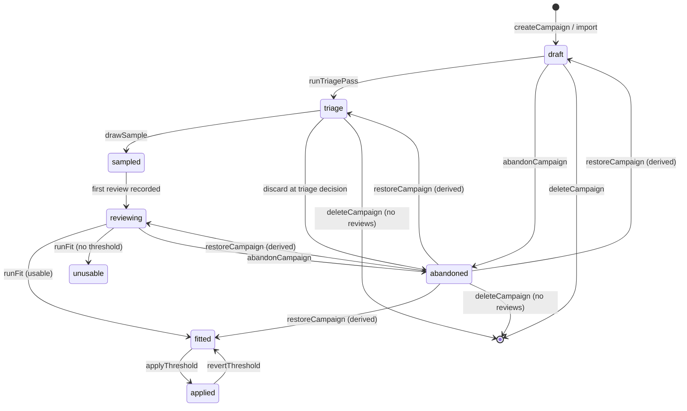
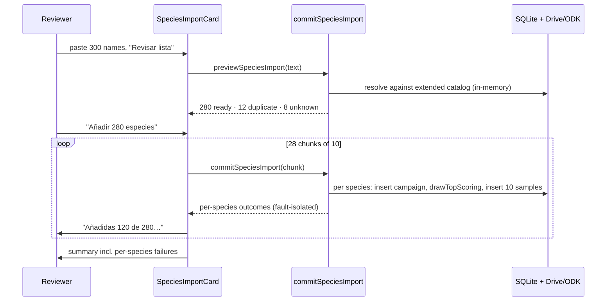

# feat: Species list management and workflow clarity for BirdNET validation

## Summary

Two clusters of work on `/audio/validacion`, both driven by a round of real use.

**Managing the species list.** The bulk importer caps at 50 species per paste; that cap comes off. A species added by mistake can currently only be marked "Descartada", never removed, and a discard cannot be undone — both change. The species table gets colour-coded stage tags, a status filter, and a search box.

**The review loop and the workflow around it.** The detection band is hard to read against the spectrogram. The spacebar restarts the clip instead of pausing it. Clicking a species name and clicking its row button go to two different pages with nothing saying so. And finishing a triage leaves the reviewer at a dead end with no indication that the next move is "extract the sample" — or that discarding the species is the other legitimate answer.

Two questions asked alongside the work are answered in **Findings** below and recorded in `CLAUDE.md` rather than left in chat.

---

## Problem Frame

The module shipped its first real usage round. Everything below came from that session, and each item is a place where the interface either blocks a legitimate action, teaches the wrong thing, or goes quiet at the exact moment a decision is due.

The most consequential is the triage dead end. Triage exists to answer one question — *are BirdNET's ten best guesses for this species ever right?* — so that a reviewer does not spend 200 clips on a species that has no true positives at any score. Today the reviewer answers those ten clips, lands on a "Tanda completada" screen, and is told nothing. The go/no-go the whole mechanism exists to produce is never asked. `finalizeTriage` was written to serve exactly this moment and is currently reachable only from tests.

---

## Findings

Both of these were measured against the dev database, not inferred. They change decisions in the plan and are recorded in `CLAUDE.md` under **U8**.

### F1. Triage clips are additive, not part of the 200

`drawStratifiedSample` targets `targetSampleSize` (200) and receives every already-drawn identification id as `excludeIds`, so the triage draw and the stratified draw never overlap. A fully drawn species therefore holds **210** clips, not 200.

Verified: *Ramphastos ambiguus* (campaign 2) has 10 `is_triage=1` rows and 200 `is_triage=0` rows.

The review screen's denominator is `progress.sampled` (the true total, 210), not `campaign.targetSampleSize`, so the progress bar is already honest — there is no over-100% bug to fix. Triage answers feed the logistic fit alongside the sample answers; `resolveFitEligibleReviews` returns them with an `isTriage` flag and only `finalizeTriage` filters on it.

### F2. Clip audio and spectrograms are built lazily, per clip, and cached

Nothing is fetched at draw time — sampling is pure SQL over `audio_identifications` and stores ids plus a confidence snapshot.

On the first request for `/api/audio/validation-clip?sample=N`, the server downloads that one source recording from Drive to a temp file, cuts detection ±3 s to a ~100 KB AAC via ffmpeg, atomically renames it into `data/cache/birdnet-clips/N.m4a`, and deletes the temp source. The spectrogram (`N.webp`) is rendered from the already-cut clip rather than the original, which is what guarantees the image and the audio cover the same window. Both are single-flighted (concurrent requests collapse onto one ffmpeg run) and LRU-evicted against `BIRDNET_CLIP_CACHE_MAX_GB` (default 5 GB). The review client warms two clips ahead of the current one.

### F3. Deployment stratification already works — for the sample, not for triage

`drawFromBin` ranks each deployment's candidates independently with `ROW_NUMBER() OVER (PARTITION BY af.deployment_id ...)` and orders the outer query by that rank, so it takes every site's first pick before any site's second.

Measured on *Ramphastos ambiguus*:

| | population | drawn sample |
|---|---|---|
| deployments represented | 68 | 55 |
| share from the single largest site | 6.2% | 4.5% |
| share from the top 5 sites | 23.8% | 20.0% |

Per bin the guarantee is exact: every one of the 9 bins drew 22–23 clips from 22–23 **distinct** deployments — a hard maximum of one clip per site per bin. The realised sample is *less* site-concentrated than the underlying data.

`drawTopScoring` (triage) has no such spread — it is score-descending only, and the 10 triage clips came from 5 sites. **This is left as-is by explicit decision** (see KTD-7). U8 records why, so it does not get "fixed" later by someone reading F3 and assuming an oversight.

---

## Requirements

| ID | Requirement | Source |
|---|---|---|
| R1 | The bulk species importer accepts lists longer than 50 | request |
| R2 | A species added by mistake can be removed from the list entirely | request ("Ramphas abiguus") |
| R3 | A "Descartada" status can be undone | request |
| R4 | The species table shows stage as a colour-coded tag | request |
| R5 | The species table can be filtered by stage | request |
| R6 | The species table can be searched by name | request |
| R7 | The detection band is legible against the spectrogram | request |
| R8 | Space toggles play/pause rather than restarting the clip | request |
| R9 | The two destinations reachable from a table row are each labelled | request |
| R10 | Finishing a triage presents its result and the next decision | request |
| R11 | That decision is explicitly discard-the-species or continue-to-full-validation | request |
| R12 | Drawing the 200-clip sample is not a separate unexplained manual step | request |
| R13 | The triage/sample relationship and the clip caching lifecycle are documented | request (questions) |
| R14 | Deployment stratification of the sample is verifiable by a reader | request (follow-up) |

---

## Key Technical Decisions

### KTD-1. The import cap comes off the batch, not off the request

One triage draw costs **0.2–1.3 s** measured against the 2,491,919-row `audio_identifications` table (1.35 s for *Ramphastos ambiguus* at 173 k detections; ~0.18 s for a typical species). `commitSpeciesImport` runs that draw serially per species inside one server action, so a 500-row paste would occupy a single request for minutes and be killed by the proxy long before finishing.

The batch limit is therefore removed, and the **request** limit stays: the client commits in chunks of 10 and shows aggregate progress. Total species per import becomes unbounded in practice; each HTTP request stays inside ~2–15 s.

Rejected: a background `processing_jobs` job. It would need a new job type registered in `JOB_LABELS`/`AUDIO_JOB_TYPES`, a progress poller, and a recovery path, to solve a problem that a client-side loop over an already-fault-isolated action solves outright. The per-species fault isolation that makes chunking safe is already in `commitSpeciesImport`.

### KTD-2. Delete is a real delete, and is refused once anyone has reviewed

Two different needs are being conflated by the single "Descartar" action today:

- *"I added this by mistake and it should never have existed"* — `Ramphas abiguus`, a typo for `Ramphastos ambiguus`, created before the species picker existed. Status `draft`, zero samples, zero reviews.
- *"We tried this species and it isn't worth continuing"* — a real outcome that should stay visible and reversible.

`deleteCampaign` serves the first and **refuses when the campaign has any reviews or any fits**, because the FK cascade would silently take another reviewer's work with it. `abandonCampaign` (unchanged) plus the new `restoreCampaign` serve the second.

The review guard counts reviews from *every* reviewer, not the caller's — the failure mode being prevented is one editor destroying a colleague's afternoon.

### KTD-3. Restoring a discard derives the status it returns to

`abandonCampaign` overwrites `status` and keeps no record of what it was, and adding a column to store it would be a migration in service of one action. The prior stage is fully derivable from rows that already exist:

```
active threshold          → applied
any fit rows              → unusable when the latest carries an unusableReason, else fitted
any reviews               → reviewing
sampledAt is set          → sampled
any samples               → triage
otherwise                 → draft
```

`deriveRestoredStatus` is a pure function over those facts and is unit-tested independently of the database.

The partial unique index `idx_birdnet_campaigns_species_scope` excludes abandoned rows, so a restore can collide with a live campaign started for the same species in the meantime. That is caught and reported in Spanish rather than surfacing a SQLite constraint string.

### KTD-4. "Sin umbral utilizable" is not styled as an error

Stage tag colours carry meaning, and the module's central claim is that most species BirdNET reports have no true positives at any score — `unusable` is the **expected** outcome, not a failure. It gets a neutral stone tone. Red is reserved for `abandoned`, which is a human decision to stop.

### KTD-5. The detection band dims its surroundings instead of tinting itself

The spectrogram uses the magma colormap: near-black at low energy, bright yellow-white at high. A darker-grey box disappears against the dark background; the current white box washes out against bright call energy — which is precisely where the detection is. Recolouring the box cannot win at both ends.

Instead the regions **outside** the detection get a dark scrim and the detection keeps full brightness, with solid high-contrast edges at the boundaries. This reads on any colormap because it works on relative luminance rather than a fixed colour, and it points at the detection by subtraction.

This is a deliberate departure from the literal "maybe like a darker grey color" — the stated goal was legibility, and a grey fill would have made the dark half worse.

### KTD-6. Triage's ending becomes a decision screen, not a new automatic step

Automatically drawing the 200 the moment triage finishes would delete the only thing triage produces. The point is the go/no-go.

So the manual "Extraer muestra" button stops being something the reviewer has to *discover*: when a campaign in `triage` status has all its triage clips reviewed, the review queue's end-of-batch screen becomes a decision panel reporting *"N de 10 correctas"* with two one-click paths — continue (calls `finalizeTriage` then `drawSample`) or discard (calls `finalizeTriage` then `abandonCampaign`). The same panel appears as a banner on the species page so it is reachable from either direction.

`finalizeTriage` already exists, already reads the fit-eligible review set, and is currently called only from tests. This wires it up rather than writing a second copy.

### KTD-7. The triage draw keeps its score-only ordering

`drawTopScoring` remains pure top-N with no deployment spread. Chosen explicitly: triage's question is "are BirdNET's very best guesses for this species ever right", and constraining the draw by site makes the clips no longer the best ones. The accepted cost is that a single noisy site can drive a discard decision. F3 and this decision are both recorded in `CLAUDE.md` so the gap reads as a choice rather than an oversight.

### KTD-8. Filtering and search live in the URL, matching the existing sort

The table's sort already round-trips through `?sortBy=&sortDir=`. Search and status filter join it as `?search=` and `?status=`, committed by a client filter bar that mirrors `src/app/grants/grants-filter-bar.tsx` — 300 ms debounce on the text box, instant commit on the select, `router.replace(..., { scroll: false })`, and every commit copies the existing params so sort survives filtering and vice versa.

The bar is written fresh inside the validation module rather than importing the grants one: the grants module is deliberately English-only, and pulling a shared component out of it would drag the grants pages into this diff.

Row matching is a pure `filterCampaignRows` over the already-loaded rows, applied before `sortCampaignRows`. It reuses `normalizeSpeciesName` so search is accent- and case-insensitive and agrees with how the picker and importer match names.

---

## High-Level Technical Design

### Campaign lifecycle with the new transitions

Existing transitions in black; this plan adds the dashed ones.



The triage decision point sits on the `triage` state: continuing takes the existing `triage → sampled` edge, discarding takes the new `triage → abandoned` edge, and both run `finalizeTriage` first so `triage_true_positives` is recorded either way.

### Delete vs. discard vs. restore

| Situation | Reviews exist | Fits exist | `deleteCampaign` | `abandonCampaign` | `restoreCampaign` |
|---|---|---|---|---|---|
| Added by mistake, nothing drawn | no | no | ✅ removes the row | ✅ | n/a |
| Triaged, nobody reviewed yet | no | no | ✅ removes row + samples | ✅ | n/a |
| Triage reviewed, discarded | yes | no | ❌ refused | already abandoned | ✅ → `triage` |
| Under review, discarded | yes | no | ❌ refused | already abandoned | ✅ → `reviewing` |
| Fitted or applied | yes | yes | ❌ refused | ✅ | ✅ → `fitted` / `applied` |

### Chunked import commit



A chunk that fails wholesale is reported and the loop continues; a species that fails inside a chunk is already isolated by the existing per-species `try`/`catch`.

---

## Implementation Units

### U1. Remove the import batch cap and commit in chunks

**Goal:** Paste or upload a species list of any realistic length and have it all imported, with visible progress.

**Requirements:** R1

**Dependencies:** none

**Files:**
- Modify `src/app/audio/validacion/species-import.ts`
- Modify `src/app/audio/validacion/import-actions.ts`
- Modify `src/app/audio/validacion/species-import-card.tsx`
- Test `src/app/audio/validacion/__tests__/species-import.test.ts`
- Test `tests/integration/birdnet-species-import.test.ts`

**Approach:**
Drop `IMPORT_ROW_CAP` from the parser. `parseSpeciesList` returns every parsed name; `truncated` and `cap` leave `ParsedSpeciesList` and `SpeciesImportPreview`. Keep one high sanity ceiling (`MAX_PASTE_ROWS`, 2000) that guards against a whole spreadsheet being pasted into the box — with an explicit Spanish message, not a silent trim. 2000 is far above the 554 species BirdNET has ever detected, so it is a paste-sanity guard rather than a batch limit.

`commitSpeciesImport` keeps a per-request bound as `COMMIT_CHUNK_SIZE = 10`, sized from the measured 0.2–1.3 s per triage draw so a request stays inside roughly 2–15 s. Requests over the bound are refused with a Spanish message naming the chunk size; the server does not silently truncate.

The card drives the loop: slice the ready rows into chunks, `await` them sequentially (not `Promise.all` — each request runs real Drive/ODK work and parallelism would multiply the load), accumulate `SpeciesImportCommitRow[]` across chunks, and render running progress. A chunk that rejects is recorded and the loop continues to the next one, matching the per-species fault isolation already inside the action. Refresh once at the end, not per chunk.

**Patterns to follow:** the existing per-species `try`/`catch` in `commitSpeciesImport`; the preview→commit shape borrowed from `src/app/finance/data/sueldos-import-card.tsx`; progress-readout conventions in `src/components/floating-job-progress.tsx`.

**Test scenarios:**
- `parseSpeciesList` on 120 newline-separated names returns all 120 with no truncation signal.
- `parseSpeciesList` on 2500 rows returns the ceiling message rather than a silent slice; `totalFound` still reports 2500.
- `parseSpeciesList` keeps its existing behaviour on the multi-row-first-field, single-row-split, quoted, and header cases (regression — these tests exist).
- `commitSpeciesImport` with 11 names returns a Spanish error naming the chunk size, and creates nothing.
- `commitSpeciesImport` with 10 names where the 4th has zero accessible detections: rows 1–3 and 5–10 are created and triaged, row 4 is reported `Sin detecciones accesibles`, and the action still returns `success: true`.
- `commitSpeciesImport` with a species whose triage throws: the campaign row survives, `triaged` is null, `error` is populated, and later names in the same chunk are still processed.

**Verification:** Pasting a 120-species list previews all 120 and imports them across 12 requests with a progress readout; no request exceeds ~15 s; every created species lands in `triage` with its clips drawn.

---

### U2. Delete a species, undo a discard

**Goal:** Remove a species added by mistake; bring back one discarded by accident.

**Requirements:** R2, R3

**Dependencies:** none

**Files:**
- Modify `src/app/audio/validacion/actions.ts`
- Create `src/app/audio/validacion/restore-status.ts`
- Modify `src/app/audio/validacion/[slug]/campaign-controls.tsx`
- Create `src/app/audio/validacion/species-row-actions.tsx`
- Test `src/app/audio/validacion/__tests__/restore-status.test.ts`
- Test `tests/integration/birdnet-campaign-lifecycle.test.ts`

**Approach:**
Add `deleteCampaign(campaignId)` and `restoreCampaign(campaignId)`, both `requirePermission("grabaciones", "editor")`.

`deleteCampaign` counts reviews across all reviewers and counts fit rows; a non-zero count on either returns a Spanish refusal that names "Descartar" as the alternative. Otherwise it deletes the campaign row and lets the existing `onDelete: "cascade"` FKs take the samples, reviewer roster, and (vacuously) thresholds. It calls `recordEvent` with `eventType: "birdnet_validation_deleted"`, `severity: "warn"`, `targetType: "species"` — destructive user actions are a default-yes for instrumentation per `CLAUDE.md`, and this one has no undo.

`restoreCampaign` reads the campaign's samples, `sampledAt`, reviews and fits, passes those facts to `deriveRestoredStatus`, writes the derived status, and clears `abandonedReason`. A `UNIQUE constraint` failure is translated into a Spanish message explaining that the species already has a live validation.

`deriveRestoredStatus(facts)` lives in `restore-status.ts` as a pure function over `{ hasActiveThreshold, latestFitUnusable, fitCount, reviewCount, sampledAt, sampleCount }` so the derivation is testable without a database — the same factoring as `fit-summary.ts` and `review-progress.ts`.

`species-row-actions.tsx` is a small client component rendering the per-row menu (Delete / Restore, gated on status and on the review count already present in `CampaignSummary`). The species page's `CampaignControls` gains the matching buttons. Delete asks for confirmation naming the species; the existing `window.prompt` used by "Descartar" is the local precedent for confirmation and is left alone.

**Patterns to follow:** `abandonCampaign` for shape and error strings; `applyThreshold`'s `recordEvent` call for event fields; `fit-summary.ts` for pure-derivation-plus-thin-caller factoring.

**Test scenarios:**
- `deriveRestoredStatus` returns `draft` for zero samples, `triage` for samples with no `sampledAt`, `sampled` for `sampledAt` set with no reviews, `reviewing` once reviews exist, `fitted` when a usable fit exists, `unusable` when the latest fit carries an `unusableReason`, and `applied` when a threshold is active — one case each, plus precedence when several are true at once.
- `deleteCampaign` on a `draft` campaign with no samples removes the row.
- `deleteCampaign` on a campaign with 10 triage samples and zero reviews removes the row and its samples.
- `deleteCampaign` on a campaign with one review from another reviewer is refused, and the campaign, its samples and that review all still exist afterwards.
- `deleteCampaign` on a campaign with an applied threshold is refused.
- `deleteCampaign` emits a system event naming the species.
- `restoreCampaign` on a campaign abandoned mid-review returns it to `reviewing` and clears `abandonedReason`.
- `restoreCampaign` when a live campaign already exists for that species returns a Spanish error and leaves both rows unchanged.
- `deleteCampaign` and `restoreCampaign` both reject a viewer-level caller.

**Verification:** `Ramphas abiguus` can be deleted from the list and does not come back on reload; a species discarded with reviews cannot be deleted but can be restored to the stage it was at.

---

### U3. Stage tags, status filter, and search on the species table

**Goal:** Read the table at a glance and narrow it.

**Requirements:** R4, R5, R6

**Dependencies:** U2 (the status filter's default hides `abandoned`, which only makes sense once restore exists)

**Files:**
- Modify `src/app/audio/validacion/labels.ts`
- Create `src/app/audio/validacion/stage-tag.tsx`
- Create `src/app/audio/validacion/species-filter-bar.tsx`
- Modify `src/app/audio/validacion/campaign-table.tsx`
- Modify `src/app/audio/validacion/page.tsx`
- Test `src/app/audio/validacion/__tests__/labels.test.ts`
- Test `src/app/audio/validacion/__tests__/campaign-table.test.ts`

**Approach:**
`labels.ts` gains `STAGE_TONE: Record<CampaignStatus, string>` — Tailwind classes, total over the status union, asserted by the existing totality test. Tones: `draft` slate, `triage` amber, `sampled` sky, `reviewing` blue, `fitted` violet, `unusable` stone, `applied` emerald, `abandoned` rose. `unusable` is deliberately neutral (KTD-4).

`StageTag` renders the shared `Badge` primitive with the tone class, so the pill shape matches the rest of the portal. It replaces the bare `stageLabel()` text in the table's Estado cell and on the species page header.

`filterCampaignRows(rows, { search, status })` joins `sortCampaignRows` as a second pure export from `campaign-table.tsx`. Search matches `displayName` and `species` through `normalizeSpeciesName`. `status` accepts a `CampaignStatus`, `"todas"`, or `"activas"` (everything except `abandoned`, the default).

`species-filter-bar.tsx` mirrors `grants-filter-bar.tsx` with Spanish labels: a stage `<select>` that commits instantly and a search `<input>` debounced at 300 ms, both preserving `sortBy`/`sortDir`, both deleting their param when cleared.

`page.tsx` reads `search` and `status` from `searchParams`, applies the filter before the sort, and fixes the `Especies en validación` stat to count non-abandoned rows rather than every row.

Sortable headers must carry the active filter params into their links, or clicking a header would silently reset the filter.

**Patterns to follow:** `src/app/grants/grants-filter-bar.tsx`; the URL-param SSR table pattern already in `page.tsx`; `SortIcon` per `CLAUDE.md`.

**Test scenarios:**
- `STAGE_TONE` is total over `CampaignStatus` (extend the existing totality test).
- No `STAGE_TONE` entry maps `unusable` to a red/rose tone (guards KTD-4 against a later "make errors red" edit).
- `filterCampaignRows` with `status: "activas"` drops abandoned rows and keeps all others.
- `filterCampaignRows` with `status: "triage"` keeps only triage rows.
- `filterCampaignRows` search matches on scientific name, on display name, case-insensitively, and accent-insensitively (`"buho"` matches `"Búho"`).
- `filterCampaignRows` with an empty search returns every row (does not collapse to zero).
- Filtering then sorting produces the same order as sorting the pre-filtered set — filter and sort compose without either reordering the other.
- A row whose display name matches but whose status is excluded does not appear.

**Verification:** The table opens showing only active species; the stage select and search narrow it; sorting a column keeps both; a shared URL reproduces the same view.

---

### U4. Space toggles playback

**Goal:** Space behaves the way every media player behaves.

**Requirements:** R8

**Dependencies:** none

**Files:**
- Modify `src/app/audio/validacion/[slug]/revisar/use-review-shortcuts.ts`
- Modify `src/app/audio/validacion/[slug]/revisar/review-client.tsx`
- Test `src/app/audio/validacion/[slug]/revisar/__tests__/use-review-shortcuts.test.ts`

**Execution note:** Test-first. The keymap change is one line in a pure resolver, and the regression it prevents (space silently reverting to replay) is exactly what a test pins.

**Approach:**
Two distinct causes produce the reported behaviour and both need fixing.

*Space is bound to replay.* `resolveReviewKey(" ")` returns `{ kind: "replay" }`, which sets `currentTime = 0` and plays — so a second press restarts rather than pauses. Space becomes `{ kind: "toggle" }`; the client handler plays when `audio.paused` and pauses otherwise. Replay moves to `r`/`R`, and the on-screen hints change from `Repetir (espacio)` to `Reproducir/pausar (espacio)` plus `Repetir (R)`.

*The native control double-handles.* `<audio controls>` is focusable. Once the reviewer clicks its pause button, that shadow-DOM button holds focus, and space reaches both the browser's own control handling and the window listener — which is why the keyboard starts behaving differently after a click. Add `isMediaTarget(target)` alongside `isEditableTarget` and suppress all shortcuts when the event originates inside the audio element, letting the browser own the keyboard while its control has focus. This also stops the arrow keys from seeking the clip and advancing the queue at the same time.

**Patterns to follow:** the existing pure-resolver / thin-hook split, kept because Vitest runs in `node` with no DOM.

**Test scenarios:**
- `resolveReviewKey(" ", ctx())` returns `{ kind: "toggle" }`.
- `resolveReviewKey("r", ctx())` and `resolveReviewKey("R", ctx())` return `{ kind: "replay" }`.
- Space returns `null` when the context reports focus inside the media element.
- Arrow keys likewise return `null` inside the media element, while still returning `back`/`skip` outside it.
- The answer keys (`1`/`s`, `2`/`n`, `3`/`u`, and capitals) are unchanged (regression).
- `ArrowLeft` at index 0 still returns `null` (regression).
- All shortcuts remain suppressed inside a text input (regression).

**Verification:** On a freshly loaded clip, space plays, space pauses, space resumes. After clicking the native pause button, space still toggles once per press rather than twice.

---

### U5. Make the detection band legible

**Goal:** See where the detection is without hunting for a white line.

**Requirements:** R7

**Dependencies:** none

**Files:**
- Modify `src/app/audio/validacion/[slug]/revisar/spectrogram-overlay.tsx`
- Test `src/app/audio/validacion/[slug]/revisar/__tests__/spectrogram-overlay.test.ts`

**Approach:**
Replace the single translucent white band with a three-part treatment: a dark scrim over the region left of `bandLeftPct`, a matching scrim right of `bandRightPct`, and solid high-contrast edges at the two boundaries. The detection itself is left untouched at full brightness.

The scrim geometry is derivable from the two percentages already passed in, but computing it inline in JSX would put the same arithmetic in three places. Add a pure `bandScrims(leftPct, rightPct)` returning the two scrim rectangles, guarding the degenerate cases (`left === 0`, `right === 100`, inverted input) that `detectionBand` can legitimately produce when a detection is clamped against a file end.

The playhead keeps its rose colour and stays above the scrims in stacking order, so it remains visible over the dimmed regions.

**Patterns to follow:** `clip-geometry.ts` for pure-geometry-plus-thin-component; the existing linear percentage mapping, valid only because the image is `object-fit: fill` at both render and display.

**Test scenarios:**
- `bandScrims(30, 70)` returns a left scrim spanning 0–30 and a right scrim spanning 70–100.
- `bandScrims(0, 40)` returns no left scrim (zero width is not rendered) and a right scrim spanning 40–100.
- `bandScrims(60, 100)` returns no right scrim.
- `bandScrims(0, 100)` returns no scrims at all.
- Inverted input is ordered before use rather than producing a negative width.
- `playheadPercent` behaviour is unchanged (regression, including the non-finite → 0 cases).

**Verification:** On a clip whose call sits in a bright region of the magma colormap, the detection reads clearly; on a clip whose detection is near-silent against a dark background, it still reads.

---

### U6. Close the triage dead end

**Goal:** Finishing a triage asks the question triage exists to answer.

**Requirements:** R10, R11, R12

**Dependencies:** U2 (the discard path shares the abandon/restore surface)

**Files:**
- Modify `src/app/audio/validacion/[slug]/revisar/review-client.tsx`
- Create `src/app/audio/validacion/[slug]/revisar/triage-decision.tsx`
- Modify `src/app/audio/validacion/[slug]/revisar/review-progress.ts`
- Modify `src/app/audio/validacion/[slug]/revisar/page.tsx`
- Modify `src/app/audio/validacion/[slug]/page.tsx`
- Modify `src/app/audio/validacion/labels.ts`
- Test `src/app/audio/validacion/[slug]/revisar/__tests__/review-progress.test.ts`
- Test `tests/integration/birdnet-triage-decision.test.ts`

**Approach:**
Add a pure `triageStage(facts)` to `review-progress.ts` returning `"not-triage" | "in-progress" | "decide"` from `{ campaignStatus, triageTotal, triageReviewedByFitReviewer }`. A campaign in `triage` status with every triage clip answered is the only state that yields `"decide"`.

When the review queue empties and `triageStage` says `"decide"`, `ReviewClient` renders `TriageDecision` instead of the generic "Tanda completada" screen. The panel calls `finalizeTriage` on mount to obtain and persist the true-positive count, then reports *"N de 10 correctas"* with one line of interpretation — zero correct means the species almost certainly admits no threshold — and two buttons:

- **Continuar con la validación completa** → `drawSample`, then navigate to the refreshed review queue.
- **Descartar esta especie** → `abandonCampaign` with a reason prefilled from the triage result, then navigate back to the species page.

Neither button is styled as the obvious default; both are legitimate outcomes and a zero-correct triage should not read as a failure.

The species page renders the same decision as a banner above `CampaignControls` when `triageStage` is `"decide"`, so the choice is reachable without re-entering the queue.

`finalizeTriage` refuses when the fit-eligible review set cannot be resolved — several reviewers with no primary designated. That Spanish reason is surfaced in the panel with a link to the species page's roster, rather than being swallowed.

`STAGE_HINT.triage` is reworded to describe the decision rather than the task.

**Patterns to follow:** the existing end-of-batch screen in `review-client.tsx`; `batchState`/`remainingForReviewer` for pure-state-plus-thin-render; `CampaignControls` for the action-with-message shape.

**Test scenarios:**
- `triageStage` returns `"not-triage"` for a campaign in `sampled` or `reviewing` status.
- `triageStage` returns `"in-progress"` when 7 of 10 triage clips are answered.
- `triageStage` returns `"decide"` at 10 of 10 in `triage` status.
- `triageStage` returns `"decide"` when triage drew fewer clips than requested (the *Ardea herodias* case — only 3 detections exist, so 3 of 3 is complete).
- `triageStage` does not return `"decide"` for a campaign with zero triage clips.
- `finalizeTriage` on a fully-reviewed triage records `triage_true_positives` and returns the count.
- `finalizeTriage` before the last clip is answered returns "El triaje aún no está completo" and writes nothing (regression).
- `finalizeTriage` with two reviewers and no primary returns the `no_primary_reviewer` reason (regression).
- Continue-path integration: `finalizeTriage` then `drawSample` leaves the campaign in `sampled` with 210 total samples and no identification drawn twice.
- Discard-path integration: `finalizeTriage` then `abandonCampaign` leaves the campaign `abandoned` with `triage_true_positives` still recorded, and `restoreCampaign` (U2) brings it back to `triage`.

**Verification:** Answering the last triage clip presents the count and the two choices; continuing draws the sample and drops the reviewer straight into it; discarding returns to the species page with the reason recorded and reversible.

---

### U7. Label both destinations reachable from a row

**Goal:** No surprise about where a click goes.

**Requirements:** R9

**Dependencies:** U3 (both touch the Acción cell)

**Files:**
- Modify `src/app/audio/validacion/campaign-table.tsx`
- Modify `src/app/audio/validacion/labels.ts`
- Test `src/app/audio/validacion/__tests__/labels.test.ts`

**Approach:**
The Acción cell renders **two** labelled controls rather than one: a primary action from `rowAction(sampled)` — `Revisar` when a sample exists, `Preparar` when it does not — and a secondary `Detalle` link to the species page. The species name stays a link to the same species page, so the familiar affordance survives and its destination is now also visible as a named button.

`rowAction` gains an icon identifier (a string, resolved to a component on the client — React components cannot cross the Server/Client boundary as props) and a `title` for the tooltip.

**Patterns to follow:** the existing real-`<Link>` choice in the Acción cell, kept so right-click, middle-click and keyboard activation all work.

**Test scenarios:**
- `rowAction(0)` returns the `Preparar` label with an empty suffix; `rowAction(210)` returns `Revisar` with `/revisar` (regression).
- `rowAction` returns an icon identifier that is a string, never a component (guards the Server→Client serialization rule).
- No label emitted by `labels.ts` contains the word "campaña" (regression — the existing vocabulary test).

**Verification:** Every clickable thing in a row states its destination; the review link still opens in a new tab on middle-click.

---

### U8. Per-site coverage panel and documentation

**Goal:** A reader can confirm the sample is spread across sites, and the two answered questions stop living in chat.

**Requirements:** R13, R14

**Dependencies:** none

**Files:**
- Modify `src/app/audio/validacion/[slug]/page.tsx`
- Modify `src/app/audio/validacion/actions.ts`
- Modify `CLAUDE.md`
- Test `tests/integration/birdnet-site-coverage.test.ts`

**Approach:**
`getCampaignProgress` gains a `sites` array — `{ siteName, drawn, reviewed }` grouped from `birdnet_validation_samples`, ordered by `drawn` descending. The species page renders it beside the existing "Composición de la muestra" bin table as **Cobertura por sitio**, with a one-line summary ("55 sitios · máximo 9 clips de un mismo sitio") above a scrollable list. Rows with a null `site_name` are labelled rather than dropped — one deployment in the current data has none.

This is the smallest thing that makes F3 checkable by a reader instead of taken on trust, which is what prompted the question.

`CLAUDE.md`'s BirdNET section gains four bullets:
- Triage clips are additive: a fully drawn species holds `triageSize + targetSampleSize` clips (210 by default), the review denominator is the true total, and triage answers feed the fit.
- The clip/spectrogram cache lifecycle: nothing at draw time; per-clip on first request; spectrogram rendered from the cut clip so image and audio share a window; single-flight, atomic rename, LRU under `BIRDNET_CLIP_CACHE_MAX_GB`.
- Deployment stratification is enforced inside each bin by the `ROW_NUMBER() PARTITION BY deployment_id` round-robin, with the measured per-bin one-clip-per-site result recorded; `drawTopScoring` deliberately does **not** spread, and why.
- Delete vs. discard: delete is refused once any review or fit exists; discard is reversible via a derived status.

**Patterns to follow:** the existing bin-composition table on the species page; `CLAUDE.md`'s existing BirdNET bullets for tone and length.

**Test scenarios:**
- `getCampaignProgress` returns one `sites` entry per distinct `site_name` with correct drawn counts.
- A sample row with a null `site_name` appears in `sites` rather than being dropped.
- `reviewed` per site counts only the fit-eligible reviewer's answers, matching every other scientific count in the module.
- A campaign with no samples returns an empty `sites` array rather than throwing.

**Verification:** The species page shows the per-site spread; the numbers reconcile with the bin table's total; `CLAUDE.md` explains the triage/sample relationship without needing this plan.

---

## Scope Boundaries

**Not in this work:**
- The stratified draw and the triage draw are unchanged. F3 confirms the sample is already deployment-stratified; KTD-7 records the deliberate choice to leave triage score-ordered.
- No changes to the fit, the threshold math, `applyThreshold`, or `applySpeciesConfidenceFilter`.
- No frequency-axis detection box. `audio_detections.min_freq`/`max_freq` are placeholders on 2,491,918 of 2,491,919 rows.
- No background-job infrastructure for the importer (KTD-1).
- No renaming of `campaign`-prefixed files, symbols, or columns. The user-facing vocabulary is already species-and-stages; internals stay.
- No portal-wide rollout of the name-language toggle; it stays scoped to the validation pages.

**Deferred to follow-up work:**
- A bulk "draw sample / fit / apply" across many species at once. The chunked-commit machinery in U1 is the natural foundation, but the triage decision in U6 is per-species by design and batching it would re-create the dead end at a larger scale.
- Storing the pre-abandon status explicitly instead of deriving it (KTD-3). Only worth a migration if a status becomes genuinely underivable.

---

## Risks and Dependencies

| Risk | Mitigation |
|---|---|
| A chunked import is interrupted midway, leaving a partial batch | Each species is independently created and triaged; a partial import is a shorter list, not a corrupt one. The card reports exactly which species were created. |
| `deleteCampaign` used on a species someone else is reviewing | Refused whenever any review exists, counted across all reviewers rather than the caller's. |
| Hiding abandoned rows by default makes a discarded species look deleted | The stage select carries an explicit "Todas" option and the row count reflects the filter; restore is available from the row menu once shown. |
| Suppressing shortcuts inside the audio element makes the keyboard feel dead after clicking the player | Clicking anywhere else in the page restores them; this matches how the annotation shortcuts already behave around inputs. |
| Wiring `finalizeTriage` changes when `triage_true_positives` gets written, and existing campaigns have it null | The column is nullable and only read for display; the decision panel writes it on first use for any campaign reaching the decision state. |

---

## Verification Strategy

- `npm test` — the module's unit suites (`labels`, `campaign-table`, `species-import`, `restore-status`, `review-progress`, `use-review-shortcuts`, `spectrogram-overlay`) plus the integration suites under `tests/integration/birdnet-*`.
- `npx tsc --noEmit` and `npm run lint` clean on touched files.
- `docker compose build` before committing, per `CLAUDE.md`.
- Manual pass on `http://localhost:3003/audio/validacion` as an editor: import a >50 list, delete `Ramphas abiguus`, discard and restore a species, filter and search with a sort active, walk a triage to its decision, and take both branches.

---

## Sources

- `src/lib/birdnet-validation/` — sampling, clip cache, fit eligibility, geometry
- `src/app/audio/validacion/` — actions, table, import, review queue
- `src/app/grants/grants-filter-bar.tsx` — URL-param filter bar pattern
- Dev database measurements (2026-08-05): 35 campaigns, 2,491,919 identifications, 554 detected species; per-bin deployment spread and triage-draw timings quoted in Findings and KTD-1.
