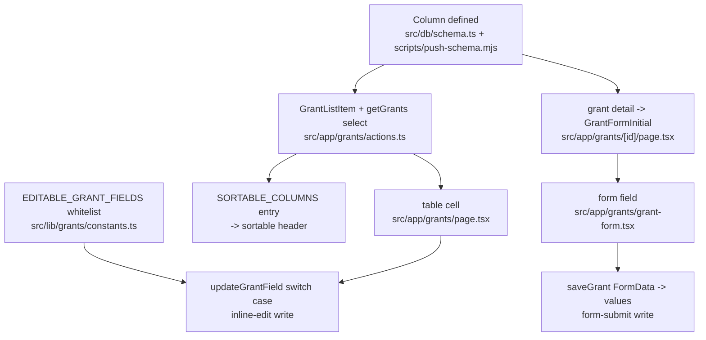

# feat: Record project title, period, awarded amount, and funding entity on grants

## Summary

Add four fields to the grant record — project title, start date, end date, and
funding entity (FCAT-Ecuador or FCAT-USA) — and give the awarded amount a column
it never had. All five are inline-editable in the grants table and present on the
Add/Edit Grant form. The table grows from 6 columns to 11 and scrolls
horizontally.

---

## Problem Frame

`/grants` tracks an opportunity from `to_research` through to a decision, then
stops. Once a grant is funded there is nowhere to record what it funds: the
project it pays for, the period it covers, and which legal entity received the
money. `grants.name` is the opportunity name ("NSF DEB"), not the project title,
so overloading it would break the funder-matching and search that already read it.

The awarded amount is a different problem. `amount_awarded` has been in the schema
since the module shipped, sits on the Add/Edit form, is already selected by
`getGrants`, is already in `GrantListItem`, and is already a `SORTABLE_COLUMNS`
key — it was simply never rendered. The table's only dollar column is "Requested",
so the amount FCAT actually won is invisible without opening each grant.

---

## Requirements

**Data**

- R1. A grant records a project title, stored separately from its grant/opportunity name.
- R2. A grant records a start date and an end date for the funded project period.
- R3. A grant records its funding entity as exactly one of FCAT-Ecuador or FCAT-USA.
- R4. The database rejects any `funding_entity` value outside that pair.

**Grants table**

- R5. The grants table shows project title, funding entity, awarded amount, start date, and end date as columns alongside the existing ones.
- R6. Each new column is inline-editable for editors and read-only for viewers, matching every other cell on the page.
- R7. Project title, funding entity, awarded amount, start date, and end date each have a sortable header.
- R8. The table scrolls horizontally rather than compressing or wrapping the existing columns.

**Form**

- R9. The Add/Edit Grant form accepts project title, start date, end date, and funding entity, and a save round-trips all four.

**Preservation**

- R10. Legacy grants keep working with every new column unset — unset is a valid state, not a validation failure.
- R11. Status pipeline, reminder cron, monthly digest, Analytics, and the Funders tab behave exactly as before.

---

## High-Level Technical Design

Each new field is threaded through the same path. The diagram is a completeness
checklist, not an architecture proposal — the shape is already set by the module.

Two omissions fail silently rather than loudly, which is why the checklist shape
matters:

- Missing `EDITABLE_GRANT_FIELDS` entry — the cell renders and accepts a click,
  then every save returns `Unknown field.` The whitelist is a server-side guard,
  so no client change routes around it.
- Missing `updateGrantField` switch case — the whitelist passes, the `set` object
  stays empty, and the write reports success while changing nothing.

---

## Key Technical Decisions

- **New columns via `ALTER TABLE … ADD COLUMN`, with the entity CHECK carried on the ADD COLUMN itself.**
  Verified locally against better-sqlite3: SQLite accepts a CHECK constraint on
  `ADD COLUMN`, `NULL` satisfies it, and an out-of-enum value fails with
  `SQLITE_CONSTRAINT_CHECK`. This avoids the table-recreation dance that the known
  Drizzle-enum-vs-SQLite-CHECK gotcha normally forces — that dance is only needed
  when an *existing* column's CHECK changes.

- **Funding entity is a two-value enum, nullable.** Nullable is what makes R10
  free: the ~118 imported rows and every unfunded opportunity are legitimately
  "not applicable", not "missing". `— none —` is already the shared
  `EditableSelect` default (`allowEmpty` defaults to `true`).

- **Project period dates reuse the UTC-midnight timestamp convention** —
  `integer(mode: "timestamp")` plus the existing `parseDate`/`toDateInput`
  helpers — not the `TEXT` `"YYYY-MM-DD"` shape `finance_salary_allocations`
  uses. Matching `due_date` inside the same table keeps `formatDate`,
  `toDateInput`, and the date `EditableField` working untouched, and stays on the
  side of the day-drift bug the coerce helpers already guard against.

- **Awarded amount needs no schema, action, or constants change.** It is already
  selected, already typed on `GrantListItem`, already whitelisted in
  `EDITABLE_GRANT_FIELDS`, and already mapped as the `awarded` sort key. It needs
  a `<TableHead>` and a `<TableCell>`, nothing more.

- **Every new field goes through the existing single-field inline-edit path**
  (`updateGrantField` + the `EDITABLE_GRANT_FIELDS` whitelist), not a new
  mechanism. `recordEvent` already fires inside that path, so the new fields
  inherit the `/admin/activity` audit trail with no instrumentation work.

- **The table stays a plain wide table with `overflow-x-auto` — no column toggle, no sticky column.**
  The Funders tab already runs 13 columns through the identical container in this
  same module (`src/app/grants/funders/page.tsx`), so 11 columns is inside proven
  range. Per-cell `max-w-*` and `whitespace-nowrap` are the density levers, as
  they are on Funders.

---

## Acceptance Examples

- AE1. **Given** an imported legacy grant with no project title, period, or
  entity, **when** the grants page loads, **then** the five new cells render `—`
  and the row is otherwise unchanged.
- AE2. **Given** an editor clicking the funding-entity cell on a grant, **when**
  they pick FCAT-USA, **then** the cell saves, shows a badge, and the summary
  cards re-sync via the existing `router.refresh()`.
- AE3. **Given** a direct call to `updateGrantField(id, "fundingEntity", "fcat_canada")`,
  **when** it executes, **then** it returns `success: false` before touching the
  database, and the same value inserted via raw SQL is rejected with
  `SQLITE_CONSTRAINT_CHECK`.
- AE4. **Given** a grant with start date 2026-01-01 stored at UTC midnight,
  **when** the table renders in a UTC-5 container, **then** the cell reads
  "Jan 1, 2026" — not Dec 31, 2025.

---

## Implementation Units

### U1. Schema columns and migration

**Goal:** Four new columns exist on `grants`, on both fresh and already-migrated databases, with the entity CHECK enforced.

**Requirements:** R1, R2, R3, R4, R10

**Dependencies:** none

**Files:**
- `src/db/schema.ts`
- `scripts/push-schema.mjs`

**Approach:** Add `grantFundingEntityEnum = ["fcat_ecuador", "fcat_usa"]` and its
exported type beside `grantStatusEnum`. Add to the `grants` table:
`projectTitle` (text), `startDate` / `endDate` (`integer(mode: "timestamp")`),
`fundingEntity` (`text({ enum: grantFundingEntityEnum })`, nullable).

In `push-schema.mjs`, both halves are required and neither substitutes for the
other: extend the `CREATE TABLE IF NOT EXISTS grants` block (fresh databases —
this never runs on prod) *and* add four `ALTER TABLE grants ADD COLUMN` entries to
the migration list (existing databases). Follow the existing grants ALTER block as
the shape precedent. The entity ALTER carries its CHECK inline, with the value
list matching `grantFundingEntityEnum` exactly.

**Patterns to follow:** `scripts/push-schema.mjs` grants DDL and the adjacent
`ALTER TABLE grants ADD COLUMN reminders_sent …` migration block; the
`grantStatusEnum` declaration in `src/db/schema.ts`.

**Test scenarios:** new `tests/unit/grants-schema-constraints.test.ts`, mirroring
`tests/unit/site-share-tokens-schema.test.ts`.
- Covers AE3. An in-memory `grants` table built from the same DDL accepts
  `'fcat_ecuador'` and `'fcat_usa'`.
- Covers AE1/AE3. It accepts a row with `funding_entity` omitted (NULL), and
  rejects `'fcat_canada'` with `SQLITE_CONSTRAINT_CHECK`.
- Drift guard: reading `scripts/push-schema.mjs` as text, every value in
  `grantFundingEntityEnum` appears inside the `funding_entity` CHECK clause, and
  the clause names no value outside the enum. This is the guard against the
  documented gotcha where the TS enum and the SQLite CHECK diverge silently.

**Verification:** `docker compose exec portal node scripts/push-schema.mjs` runs
clean twice in a row (idempotent), and `PRAGMA table_info(grants)` lists
`project_title`, `start_date`, `end_date`, `funding_entity`.

---

### U2. Funding-entity labels and the editable-field whitelist

**Goal:** The entity enum has display labels and badge colors, and all four new fields are writable through the inline editor.

**Requirements:** R3, R6

**Dependencies:** U1

**Files:**
- `src/lib/grants/constants.ts`
- `tests/unit/grants-constants.test.ts`

**Approach:** Add `GRANT_FUNDING_ENTITY_LABELS`, `GRANT_FUNDING_ENTITY_COLORS`,
and `GRANT_FUNDING_ENTITY_ORDER`, mirroring the existing status and priority
triples. Labels are English — this module is the deliberate exception to the
portal's Spanish-UI convention, and the file already carries that note. Append
`projectTitle`, `startDate`, `endDate`, and `fundingEntity` to
`EDITABLE_GRANT_FIELDS`; `amountAwarded` is already there.

**Patterns to follow:** `GRANT_STATUS_LABELS` / `GRANT_STATUS_COLORS` /
`GRANT_STATUS_ORDER` and `FUNDER_PRIORITY_*` in the same file.

**Test scenarios:** extend `tests/unit/grants-constants.test.ts`.
- Labels and colors are exhaustive over `grantFundingEntityEnum`, mirroring the
  existing "grant status maps are exhaustive" block.
- `EDITABLE_GRANT_FIELDS` contains `projectTitle`, `startDate`, `endDate`, and
  `fundingEntity` — the guard against the silent "Unknown field." failure mode.

**Verification:** `npx vitest run tests/unit/grants-constants.test.ts` passes.

---

### U3. Server reads, sorting, and writes

**Goal:** The four new fields are readable, sortable, and writable through both the inline editor and the form.

**Requirements:** R1, R2, R3, R7, R9, R11

**Dependencies:** U1, U2

**Files:**
- `src/app/grants/actions.ts`

**Approach:** Extend `GrantListItem` and the `getGrants` select with the four
fields. Add `projectTitle`, `fundingEntity`, `startDate`, and `endDate` to
`SORTABLE_COLUMNS` (`awarded` is already mapped). Add four cases to the
`updateGrantField` switch: `text()` for `projectTitle`, `parseDate()` +
`dateToInput()` for the two dates (matching the existing `dueDate` case), and an
enum-membership check for `fundingEntity` that returns `success: false` before
the write — matching how the `status` case validates against `grantStatusEnum`.
Read the four out of `FormData` in `saveGrant`'s `values` object.

Leave `getGrantsSummary`, `getGrantAnalytics`, and the reminder/digest queries
alone; each selects an explicit column list, so new columns do not leak into them.

**Patterns to follow:** the existing `dueDate` and `status` cases in
`updateGrantField`; the `values` object in `saveGrant`.

**Test scenarios:** the coercion helpers are module-private inside a `"use server"`
file, so the testable surface is the enum contract plus behavior reachable through
the action.
- Covers AE3. `updateGrantField` with `field: "fundingEntity"` and an
  out-of-enum value returns `success: false` and issues no `db.update`.
- `updateGrantField` with a valid entity value returns the canonical value and
  records a `grant_updated` event.
- Covers AE4. `updateGrantField` with `field: "startDate"` and `"2026-01-01"`
  stores UTC midnight and returns `"2026-01-01"` — not the previous day.
- Clearing a date (empty string) stores `null` and returns `null`.
- `updateGrantField` with an unrecognized field name still returns
  `Unknown field.` — the whitelist did not become permissive.

**Verification:** `npm run build` type-checks the widened `GrantListItem` against
every consumer; `npx vitest run` is green.

---

### U4. Grants table columns

**Goal:** All five fields appear as inline-editable, sortable columns in the grants table.

**Requirements:** R5, R6, R7, R8, R10

**Dependencies:** U3

**Files:**
- `src/app/grants/page.tsx`

**Approach:** Column order groups related fields:
`Grant | Project title | Status | Entity | Requested | Awarded | Due date | Start | End | Links | Notes`.
Project title uses `EditableField` with `kind="text"` under a `max-w-*` cell;
entity uses `EditableSelect` bound to the new label/color maps with `allowEmpty`
left at its default; awarded mirrors the existing Requested cell
(`kind="amount"`, `align="right"`); start and end mirror the Due date cell
(`kind="date"`, `whitespace-nowrap`), without the urgency badge — that badge is
about a submission deadline and means nothing on a project period. Each of the
five gets a `SortableHeader`. The `overflow-x-auto` container is already in place
and needs no change.

**Patterns to follow:** the funder-priority `EditableSelect` cell and the
per-cell width classes in `src/app/grants/funders/page.tsx`; the existing
Requested and Due date cells in this file.

**Test scenarios:** `Test expectation: none` — this unit is Server Component
composition over already-tested pieces. The sort mapping it depends on is covered
in U3; cell behavior is covered by the shared `editable-cell` component.

**Verification:** On `/grants` at `http://localhost:3003`: eleven columns render,
the table scrolls horizontally without the existing columns wrapping or
compressing, each new header toggles asc/desc and preserves the active status
filter and search term, editing a cell saves and shows the check mark, and a
viewer-role account sees formatted values with no click affordance. Legacy rows
show `—` in all five new cells (AE1).

---

### U5. Add/Edit Grant form

**Goal:** The four new fields are enterable at grant creation and editable on the detail page.

**Requirements:** R9

**Dependencies:** U3

**Files:**
- `src/app/grants/grant-form.tsx`
- `src/app/grants/[id]/page.tsx`

**Approach:** Extend `GrantFormInitial` with `projectTitle`, `startDate`,
`endDate` (both `string | null`, `YYYY-MM-DD`), and `fundingEntity`. Put project
title, start date, and end date in the existing "Grant" section under the grant
name — the project the money funds belongs beside what it is, not under links —
and the entity `<select>` in "Status & funding" beside the amounts, with a blank
first option so unset stays reachable. The detail page passes the four through,
running both dates via `toDateInput`.

**Patterns to follow:** the `dueDate` field and the status `<select>` in the same
form; the `toDateInput` calls already in `src/app/grants/[id]/page.tsx`.

**Test scenarios:** `Test expectation: none` for the form component itself
(uncovered surface in this repo); the `saveGrant` round-trip it depends on is
covered in U3.

**Verification:** Create a grant from `/grants/new` with all four fields set,
confirm the values appear in the table row and survive a reload; edit them from
`/grants/<id>`, save, and confirm the table reflects the change. Clear the entity
back to blank and confirm it persists as unset rather than snapping back.

---

## Scope Boundaries

- **Funders tab and Analytics are untouched.** Entity-split win rates and
  awarded-dollars-by-year are the obvious next questions, but this plan is
  table-and-form.
- **The two dollar summary cards keep showing *requested* amounts.** They already
  say so in their footnote. Switching them to awarded changes what those numbers
  mean and is a separate decision.
- **Reminder cron and the monthly digest are unchanged.** Both select an explicit
  column list and neither reads the new fields.
- **`scripts/import-grants.ts` is unchanged.** The source xlsx has no columns for
  any of this; the fields import as NULL, which is their valid unset state.
- **No per-entity amount split.** A grant records one entity, not a
  FCAT-Ecuador/FCAT-USA amount pair.

### Deferred to follow-up work

- A derived "currently active" filter or badge from start/end date, so the table
  can answer "what is running right now".
- Analytics dimensions on entity and awarded amount.
- Backfilling project title, period, and entity for the ~118 imported grants —
  a data-entry task, not an engineering one.

---

## Open Questions

- Should funding entity become **required when status is `funded`**, enforced
  server-side in `updateGrantField` and `saveGrant`? Leaving it optional keeps
  R10 simple and lets a grant be marked funded before the entity is decided;
  requiring it stops funded grants from sitting entity-less indefinitely. This
  plan implements the optional version; tightening it later is additive.

---

## Risks & Dependencies

- **The prod migration must actually run.** After deploy:
  `ssh digitalocean "cd /root/opt/fcat-portal && docker compose exec portal node scripts/push-schema.mjs"`.
  Until it does, every `/grants` read throws `no such column: project_title`.
  This is the highest-consequence step in the plan.
- **Never run `push-schema.mjs` from the host while the dev container is up.**
  Bare host `node` against `data/portal.db` over a macOS bind mount causes
  transient `IOERR_SHORT_READ` and phantom index corruption. Always
  `docker compose exec portal …`.
- **TS enum and SQLite CHECK can drift silently.** Adding a third entity later
  passes types and tests but throws `SQLITE_CONSTRAINT_CHECK` at runtime. U1's
  drift-guard test is the mitigation; without it this is a live footgun.
- **Widening `GrantListItem` is compile-time safe.** It is exported and consumed
  in `src/app/grants/page.tsx`; adding fields breaks nothing, and `npm run build`
  is the check.

---

## Sources & Research

- `src/app/grants/funders/page.tsx:143-158` — 13 columns through the same
  `overflow-x-auto` container, in this module. The precedent behind KTD6.
- `src/app/grants/actions.ts:41-48, 72, 353-469` — `SORTABLE_COLUMNS` already
  maps `awarded`; `getGrants` already selects `amountAwarded`;
  `updateGrantField`'s whitelist-then-switch shape.
- `src/components/editable-cell.tsx:232-238` — `EditableSelect` defaults
  `allowEmpty: true` with a `— none —` option, which is why the nullable entity
  needs no extra UI work.
- `scripts/push-schema.mjs:1010-1030` (grants CREATE) and `:1184-1188` (the
  grants ALTER precedent, including a `DROP COLUMN` — so this codebase already
  relies on SQLite ≥ 3.35 behavior here).
- `tests/unit/site-share-tokens-schema.test.ts` — the in-memory-SQLite
  constraint-locking test pattern U1 mirrors.
- Verified locally against better-sqlite3 for this plan:
  `ALTER TABLE … ADD COLUMN … CHECK(…)` succeeds, `NULL` passes the CHECK, a
  valid value inserts, and an out-of-enum value raises
  `SQLITE_CONSTRAINT_CHECK`. This is what rules out a table recreation.
- `docs/brainstorms/2026-06-22-grant-tracking-module-brainstorm.md` — module
  origin; the source spreadsheet had no project-title, period, or entity columns,
  which is why nothing exists to migrate.
