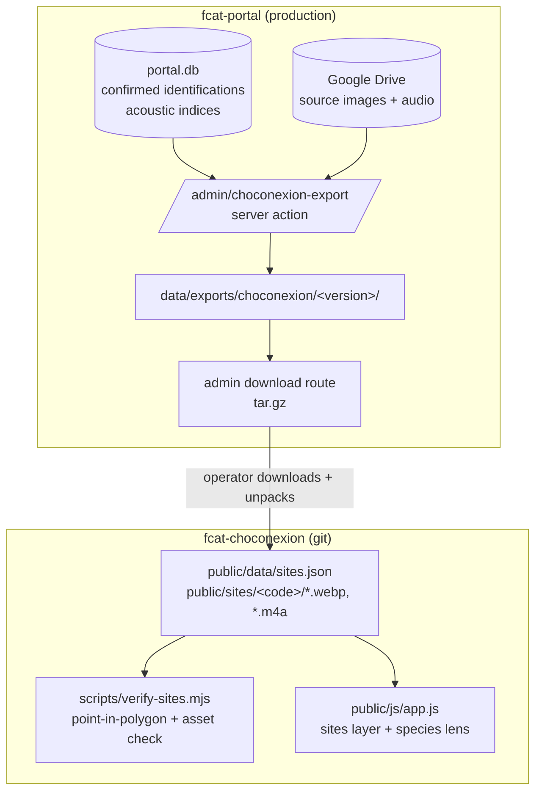
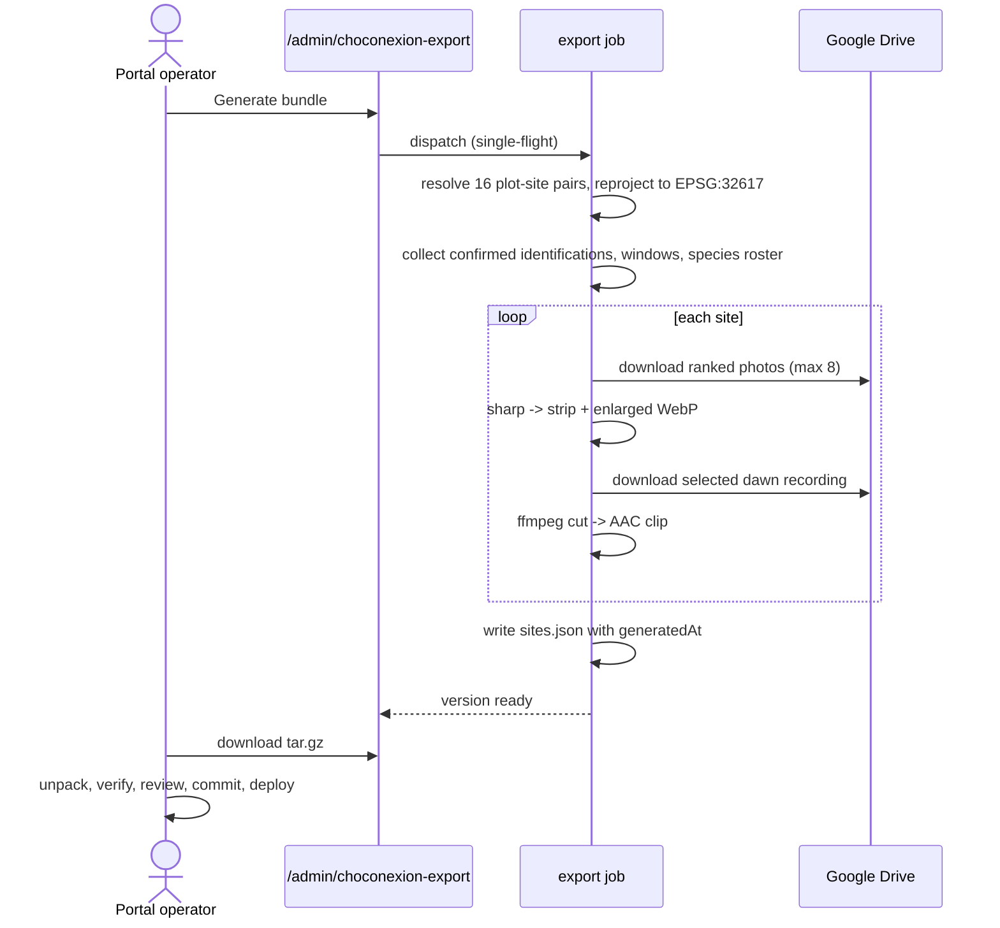
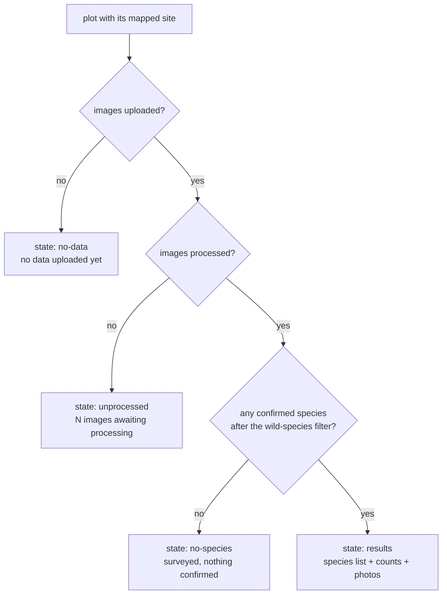

# feat: BioChoco results as a real layer in the Choconexión 3D viewer

**Repos:** this plan spans two. Units are tagged `[portal]` (`fcat-portal`, this
repo) or `[choconexion]` (`fcat-choconexion`). Paths are relative to the unit's
own repo.

## Summary

A portal admin action assembles a versioned bundle — one record per BioChoco
monitoring site, WebP photographs at two sizes, and one AAC soundscape clip per
site with processed audio — and hands the operator an archive to unpack into the
Choconexión repo. The viewer gains a sites layer: a marker at each site's true
camera position inside its plot, a panel with the deployment window, the
human-confirmed species and a photo strip, and a species lens that emphasises the
plots where a chosen animal was confirmed.

---

## Problem Frame

The Choconexión viewer carries two placeholder layers — twelve invented camera
stations and fabricated species counts — while the portal holds two years of the
real thing and no way to show it in this context. The join between the systems is
exact but invisible from either side: all 16 plots contain exactly one BioChoco
deployment, numbered `REF-00N` → `P0N` for the treatments, while the four control
plots carry habitat-coded sites (`PRI-003`, `SEC-001`, `PRI-002`, `SEC-002`).

The scientific payload is modest — 339 human-confirmed camera identifications
across 14 species — and the design already standardizes effort, with eleven of
twelve closed deployments running 29–31 days. This is a way to see and share what
was collected, and a test bed for putting monitoring results into a 3D landscape.
It is not an analysis, and the layer must say so.

Two findings from reading both repos shape the plan more than anything in the
brainstorm:

- **The export cannot be a maintenance script.** The production runner image
  copies `public`, `.next/standalone`, `.next/static` and `scripts/` — not
  `src/` — and the standalone trace prunes modules only scripts import, including
  `googleapis`. A `scripts/export-choconexion.mjs` reaching the database, Drive,
  sharp and ffmpeg is unrunnable in production, and no `npm install` fixes the
  missing `src/`. Anything with those dependencies has to run inside the Next app.
- **The viewer's "layer manifest" is dead.** `public/data/layers.json`,
  `camera-traps.json` and `bird-observations.json` are fetched by nothing; the
  real layer registry is the `layers` object literal in `public/js/app.js` plus
  hardcoded rows in `src/pages/viewer.astro`. Retiring the placeholders is a
  deletion, not a manifest edit.

---

## Requirements

R-IDs are carried verbatim from the origin document so traceability is 1:1. Three
carry a planning decision that changed them; each is marked.

**The bundle**

- R1. The export produces a single versioned bundle containing site records, photo
  assets, and audio assets, sufficient for the viewer to render the layer with no
  network call to the portal.
- R2. Each site record carries the plot identifier, the site code, the deployment
  start and end dates, the site's position in the viewer's coordinate system, and
  the confirmed species with per-species detection counts. **Changed:** the record
  does *not* carry the treatment combination; the viewer resolves it from the plot
  identifier against data it already loads (see KTD4).
- R3. Site records carry the deployment window and its duration in days, which is
  how this design standardizes effort.
- R4. Only human-confirmed identifications (verified or corrected) reach the
  bundle; unreviewed model output never does.
- R5. Bucket classes that are not species — `Aves`, `Unknown`, `Rodentia` — and
  domestic animals are excluded from species lists and counts.
- R6. The bundle carries site codes and never landowner names, consistent with the
  portal's existing public-output rule.

**The viewer layer**

- R7. A marker renders at each site's true recorded position, which falls inside
  its plot polygon.
- R8. Selecting a marker opens a panel naming the plot, its treatment or control
  status, the deployment window and its duration, and the confirmed species with
  counts.
- R9. The panel presents a scrollable strip of that site's camera-trap
  photographs, each enlargeable.
- R10. A species list, drawn from every species confirmed anywhere in the
  experiment, records how many plots each was confirmed in.
- R11. Selecting a species emphasises the markers for plots where it was confirmed
  and labels each with its detection count at that plot.
- R12. Deselecting returns the layer to its default state with all markers equally
  visible.
- R13. The sites layer registers in the viewer's layer registry and deep-link
  vocabulary, and the placeholder camera-trap and bird-observation data is
  removed. **Changed:** "registers in the manifest" resolves to the `layers`
  object in `public/js/app.js`, the sidebar row in `src/pages/viewer.astro`, and
  `LAYER_URL_NAMES`, because `public/data/layers.json` is read by no code and is
  deleted rather than updated.

**Photographs**

- R14. Photographs are exported as WebP at two sizes: a strip size and an enlarged
  size.
- R15. Photo selection for a site prefers starred images, then images carrying a
  confirmed identification, up to eight per site. Sites with fewer qualifying
  images ship fewer.
- R16. Each photograph displays the species confirmed in it and the date it was
  taken.
- R17. Photographs load only when their site panel is opened, so the layer costs
  nothing on initial page load.

**Soundscape**

- R18. Each site with processed audio carries one clip, selected reproducibly as a
  dawn-period recording with high acoustic complexity for that site.
- R19. Clips are encoded as AAC, which plays in mobile Safari.
- R20. The soundscape is presented as a recording from that site at a stated date
  and time, and makes no claim about which species are audible.
- R21. The soundscape is a first-class layer control alongside the sites layer,
  replacing the placeholder bird-observations entry.

**Coverage honesty**

- R22. Plots whose site has produced no results render as markers in a visibly
  distinct state and state why — no data uploaded, or uploaded but not yet
  processed.
- R23. Plots with no results are never omitted from the layer.
- R24. Photograph counts are never presented as a measure of survey effort, since
  they count only images retained through verification.
- R25. The layer states, where a visitor will encounter it, that the display is a
  record of what was detected and not a treatment comparison.
- R26. The bundle records the date it was generated, and the viewer surfaces it.

**Language**

- R27. Species names travel in the bundle as scientific, English common, and
  Spanish common, taken from the portal's species lookup.
- R28. The layer's own copy is English, matching the rest of the viewer.
  **Changed:** the origin required English and Spanish following the host locale.
  The viewer has no locale plumbing at all — `ViewerLayout.astro` hardcodes
  `lang="en"` and the Spanish site links straight to `/viewer` — so a bilingual
  layer would sit inside an English viewer. Deferred as a whole-viewer job; the
  bundle still carries Spanish names so that pass needs no re-export.
- R29. A species with no Spanish name falls back to its English common name, and a
  species with neither falls back to the scientific name. Applies to the bundle's
  name fields, which the deferred Spanish pass will consume.

---

## Key Technical Decisions

- KTD1. **The export is an admin server action, not a script.** The production
  runner image has no `src/` and prunes untraced modules, so a `scripts/*.mjs`
  reaching the database, Drive, sharp and ffmpeg cannot run there. A page under
  `/admin` plus a server action runs inside the traced Next server where all four
  already work. This follows `src/app/camera-trap/training-exports/actions.ts`,
  which builds a versioned dataset on disk the same way.

- KTD2. **The operator collects the bundle as a downloaded archive.** The export
  writes `data/exports/choconexion/<version>/` inside the portal's data volume and
  an admin-only route streams a `.tar.gz`. The operator unpacks it into their
  Choconexión checkout, runs the verification script, and commits. No portal
  credential, network path, or shared volume reaches the public site.

- KTD3. **Marker height is derived client-side from the containing plot's
  elevation.** The portal stores no elevation for a deployment, but
  `public/data/plots.json` carries one per plot (400–509 m across the cluster) and
  the viewer already uses it to place polygons. The bundle ships x/y only and the
  viewer computes `plot.elevation + SITE_Z_OFFSET`, matching the existing
  `PLOT_Z_OFFSET` / `REMNANT_Z_OFFSET` convention. This resolves the origin's open
  question: the approximation is per-plot rather than per-metre, which is the right
  granularity for a marker read from a camera distance of tens of metres.

- KTD4. **Treatment copy stays in the Choconexión repo.** `plots.json` already
  carries each plot's treatment and control flag, `treatments.json` carries the
  named copy, and `openPlotPanel` already renders both. The bundle carries the plot
  identifier and the site panel reuses `treatmentRowHtml`, so treatment naming has
  one source of truth and a copy edit does not require a portal re-export.

- KTD5. **The species lens emphasises markers only, never plot polygons.** Plot
  polygons are already colour-coded by the runtime-selectable treatment axis in
  `applyPlotColors`, and `highlightPlot` owns their selected state. A lens writing
  to the same materials would fight both. This resolves the origin's open question.

- KTD6. **One `sites.json`, media as separate files.** All 16 site records plus the
  experiment-wide species roster fit in a single small document fetched with the
  layer; photographs and clips are separate committed files the panel requests by
  URL when it opens. That satisfies lazy loading (R17) without a second index, and
  resolves the origin's open question about splitting the bundle.

- KTD7. **The plot↔site mapping is a checked-in 16-row table, not a computed
  join.** The correspondence is fixed for the life of the experiment and invisible
  from either side. A literal table is hand-checkable and reviewable in a diff; the
  point-in-polygon check that proves it right runs in the Choconexión repo at
  ingest (U7), where the polygons live, so neither repo has to carry a copy of the
  other's geometry.

- KTD8. **Reprojection uses `proj4`, promoted to a runtime dependency.** The portal
  stores WGS84 decimal degrees and the viewer's coordinate system is EPSG:32617.
  `proj4` is already installed but sits in `devDependencies`; server-code imports
  are traced into the standalone build regardless, but a runtime dependency
  belongs in `dependencies` rather than relying on that.

- KTD9. **The wild-species filter is extracted, not copied a third time.** The
  domestic-animal set and the real-species predicate exist twice already, in
  `src/app/public/biochoco-overview/download/route.ts` and `report-shell.tsx`. R5
  needs the same rule; the export imports a shared module and both existing call
  sites move to it.

---

## High-Level Technical Design

### Where the work happens



The operator is the transport. Nothing on the public site calls the portal, and
the portal never writes into the other repo.

### Producing one bundle



Review sits between the export and the commit by design: the operator can drop an
unsuitable photograph or clip by deleting a file and editing one JSON array.

### Classifying a site

Every plot renders. What it renders as is decided once, in the export, and
travels in the record — the viewer never infers state from an empty array.



`no-species` is a real outcome, not a failure: P01 ran a 12-day window and
confirmed nothing. Its panel must show the window and say so rather than reading
as a broken site.

### Photo ranking

Eleven starred images exist across all 16 sites, so the ranking must degrade
rather than depend on them: starred first, then images carrying a confirmed
identification (species-round-robin so one abundant animal cannot fill a strip),
capped at eight. Sites with fewer qualifying images ship fewer, and the panel
never presents the count as effort.

---

## Output Structure

New in `fcat-choconexion` (generated, committed):

```text
public/
  data/
    sites.json              # 16 site records + experiment-wide species roster + generatedAt
  sites/
    REF-007/
      photos/
        1234-strip.webp     # <imageId>-strip.webp
        1234-full.webp      # <imageId>-full.webp
        ...
      soundscape.m4a
    PRI-002/
      ...
scripts/
  verify-sites.mjs          # hand-written: point-in-polygon + asset presence
```

New in `fcat-portal`:

```text
src/lib/choconexion/
  plot-site-map.ts          # the 16 fixed pairs
  geo.ts                    # WGS84 -> EPSG:32617
  build-sites.ts            # site records from the database
  photos.ts                 # ranking + WebP export
  soundscape.ts             # clip selection + AAC encode
  types.ts                  # the bundle contract
src/lib/species-filters.ts  # extracted domestic + real-species rules
src/app/admin/choconexion-export/
  page.tsx
  actions.ts
  export-control.tsx
  download/[version]/route.ts
```

The per-unit `**Files:**` lists remain authoritative; this tree is the expected
shape, not a constraint.

---

## Implementation Units

Phase A (U1–U6) is the portal export and lands independently — its output is
reviewable as an archive before any viewer work exists. Phase B (U7–U9) consumes
a real bundle, so U7 depends on a successful U6 run.

### U1. Plot↔site mapping and reprojection `[portal]`

**Goal:** Turn a deployment's WGS84 coordinates into the viewer's coordinate
system, and name which plot each site belongs to.

**Requirements:** R2, R7 (position); enables R8, R22, R23.

**Dependencies:** none.

**Files:**
- `src/lib/choconexion/plot-site-map.ts` (create)
- `src/lib/choconexion/geo.ts` (create)
- `src/lib/choconexion/__tests__/geo.test.ts` (create)
- `src/lib/choconexion/__tests__/plot-site-map.test.ts` (create)
- `package.json` (modify — move `proj4` to `dependencies`)

**Approach:** `plot-site-map.ts` exports a frozen array of 16 `{ plotId, siteCode }`
pairs, control plots included, with a comment recording that `REF-00N` → `P0N`
holds for treatments and the four controls are habitat-coded. `geo.ts` wraps
`proj4` with the EPSG:32617 definition and exports `toViewerXY(lat, lng)`. Both
are pure; no database, no Drive.

**Patterns to follow:** `src/lib/odk-constants.ts` for a centralized constant
module; `scripts/prepare-choconexion-plots.py` (choconexion) for the CRS the
plot geometry was produced in.

**Test scenarios:**
- A known BioChoco site's WGS84 pair reprojects to an easting/northing within the
  bounding box of the plot cluster (roughly 648,600–649,300 E, 41,000–42,300 N).
- Reprojection round-trips: `toViewerXY` then the inverse returns the input
  latitude and longitude to within 1e-6 degrees.
- The map has exactly 16 entries, with unique plot identifiers and unique site
  codes and no blank values.
- Every plot identifier matches `P\d{2}` and covers `P01`–`P16` with no gaps.
- Looking up an unmapped site code returns `undefined` rather than throwing.

**Verification:** Unit tests pass; `proj4` resolves from a production-style build
(`npm run build` then confirm it is traced into `.next/standalone`).

### U2. Extract the shared wild-species filter `[portal]`

**Goal:** One implementation of "which identifications count as a wild species",
used by the two existing public surfaces and the new export.

**Requirements:** R5.

**Dependencies:** none.

**Files:**
- `src/lib/species-filters.ts` (create)
- `src/lib/__tests__/species-filters.test.ts` (create)
- `src/app/public/biochoco-overview/download/route.ts` (modify — import, drop local `DOMESTIC`)
- `src/app/public/biochoco-overview/report-shell.tsx` (modify — same)
- `src/app/public/biochoco-overview/lib/snapshot-transforms.ts` (modify — re-export `isRealSpecies` from the new module)

**Approach:** Move the `DOMESTIC` set and `isRealSpecies` into one module and add
`isWildSpecies(meta, scientificName)` combining both rules. Behaviour is
unchanged at the existing call sites — this is a pure extraction so R5 does not
create a third copy that can drift.

**Execution note:** Characterize first. Snapshot the current public-overview
species list before the move and assert it is byte-identical after, so the
extraction is provably behaviour-preserving.

**Patterns to follow:** `src/app/public/biochoco-overview/lib/snapshot-transforms.ts`
for the existing predicate shape.

**Test scenarios:**
- A mammal at species rank passes; the same metadata with `type: "system"` fails.
- `Aves` (class rank), `Rodentia` (order rank) and `Unknown` all fail.
- Each of the seven domestic names fails even though its metadata is a
  species-rank mammal or bird.
- A scientific name absent from the species lookup fails rather than throwing.
- The existing public-overview snapshot produces the same species list and counts
  before and after the extraction.

**Verification:** New and existing tests pass; the public BioChoco overview page
renders an unchanged species list.

### U3. Build site records from the database `[portal]`

**Goal:** The 16 site records — window, duration, state, species with counts and
names — plus the experiment-wide species roster.

**Requirements:** R2, R3, R4, R5, R6, R10, R22, R23, R26, R27, R29.

**Dependencies:** U1, U2.

**Files:**
- `src/lib/choconexion/types.ts` (create)
- `src/lib/choconexion/build-sites.ts` (create)
- `src/lib/choconexion/__tests__/build-sites.test.ts` (create)

**Approach:** Query `biochoco_deployments` for the 16 mapped sites, joining
`biochoco_images` → `biochoco_detections` → `biochoco_identifications` filtered to
`verification_status IN ('verified','corrected')` with the effective label
`COALESCE(corrected_species, species)`, then apply the U2 filter. Duration comes
from the QA-validated window (`valid_start ?? date_start` to `valid_end ??
date_end`), matching how `build-snapshot.ts` computes published effort; an open
deployment reports a null end and no duration. Site state is classified once, per
the decision flow above. Names resolve from `biochoco_species` with the R29
fallback chain. The roster tallies, per species, the number of plots it was
confirmed in.

Keep the record assembly pure and inject query results, so the transformations are
testable without a database — the split `build-snapshot.ts` / `snapshot-transforms.ts`
already uses.

**Patterns to follow:** `src/app/public/biochoco-overview/lib/build-snapshot.ts`
(query shape, the site-codes-not-landowner-names rule, the `valid_*` window
preference); `src/app/public/biochoco-overview/lib/snapshot-transforms.ts` (pure
transforms).

**Test scenarios:**
- A site with confirmed identifications produces state `results`, a species list
  sorted by detection count descending, and per-species counts matching the input
  rows.
- A `corrected` identification is counted under its corrected species, not the
  model's original label.
- An `unverified` identification and a `rejected` one both contribute nothing to
  species lists or counts.
- A site whose only confirmed identifications are `Aves` and a horse produces
  state `no-species` with an empty list, not state `results`.
- A site with zero uploaded images produces state `no-data`; a site with uploaded
  but unprocessed images produces state `unprocessed` carrying the image count.
- A closed deployment reports duration in whole days from the validated window; an
  open deployment reports a null end date and null duration rather than a
  duration computed to today.
- A deployment carrying `valid_start`/`valid_end` narrower than
  `date_start`/`date_end` reports the narrower window.
- A species with a Spanish name emits all three name forms; one with English only
  falls back per R29; one absent from the lookup falls back to the scientific name.
- The roster counts plots, not detections: a species with 40 detections in one
  plot reports one plot.
- No record contains a landowner name — the assembled record's fields are the
  declared contract only.
- `generatedAt` is present and is the injected clock value, not read from the
  system clock inside the pure transform.

**Verification:** Unit tests pass; a dev-database run prints 16 records whose
species totals reconcile against a direct SQL count.

### U4. Photo selection and WebP export `[portal]`

**Goal:** Up to eight ranked photographs per site, each at a strip and an enlarged
size, with its species and date.

**Requirements:** R14, R15, R16, R24.

**Dependencies:** U3.

**Files:**
- `src/lib/choconexion/photos.ts` (create)
- `src/lib/choconexion/__tests__/photos.test.ts` (create)

**Approach:** Rank candidates starred-first, then images carrying a confirmed wild
species, drawing round-robin across species so one abundant animal cannot fill a
strip. Cap at eight. All 866 images at these sites have null `path` and null
`thumbnail_path`, so each chosen image is fetched with `downloadFileToBuffer` from
`drive_file_id` and encoded by `sharp` to two WebP sizes. Match the Choconexión
repo's own convention (`quality: 72`, `effort: 6`) with widths at 480 for the
strip and 1400 for the enlarged view. Caption data — effective species and capture
date — travels in `sites.json`, not in the filename.

**Patterns to follow:** `scripts/generate-thumbs.mjs` (choconexion) for the WebP
settings and the reasoning behind committing generated images;
`src/app/camera-trap/training-exports/actions.ts` for Drive-fetch → sharp →
disk with `pLimit` concurrency.

**Test scenarios:**
- Given twelve candidates of which three are starred, the three starred lead the
  ranking and the total is capped at eight.
- Given a site with two species at 40 and 3 confirmed images, the selection
  includes the rarer species rather than eight frames of the abundant one.
- A site with three qualifying images ships three entries, not eight, and the
  result carries no padding placeholder.
- A site in state `no-data`, `unprocessed` or `no-species` produces an empty photo
  list without attempting a Drive fetch.
- Ranking is deterministic: the same candidate set produces the same ordering
  across runs, with image id as the final tiebreaker.
- A Drive fetch failing for one image drops that image with a logged warning and
  does not abort the site or the run.
- Each emitted entry carries the effective species name and the capture date, and
  the record carries no field that could be read as survey effort.

**Verification:** Unit tests pass; a dev run writes both sizes for a known site and
the strip files are visibly smaller than the enlarged ones.

### U5. Soundscape clip selection and AAC encode `[portal]`

**Goal:** One reproducibly chosen dawn clip per site with processed audio.

**Requirements:** R18, R19, R20.

**Dependencies:** U3.

**Files:**
- `src/lib/choconexion/soundscape.ts` (create)
- `src/lib/choconexion/__tests__/soundscape.test.ts` (create)

**Approach:** For each site, select from `acoustic_indices` joined to `audio_files`
where `diel_period` is the dawn period, ordering by `acoustic_complexity_index`
descending with `audio_file_id` ascending as tiebreaker so the choice is
reproducible. Download the source with `downloadFileToBuffer`, cut a fixed window
from a fixed offset with ffmpeg, and encode mono AAC. Reuse the encoder settings
proven in `src/lib/birdnet-validation/clip-cache.ts`: `-ss` before `-i`,
`-c:a aac`, `-ac 1`, `-movflags +faststart`. Clip length and bitrate are module
constants — they are the levers if the committed bundle gets too large (see Risks).
Sites without processed audio ship no clip and no placeholder.

**Patterns to follow:** `src/lib/birdnet-validation/clip-cache.ts` (ffmpeg
invocation, timeout, atomic write); `src/lib/birdnet-validation/clip-geometry.ts`
(window clamping at file ends).

**Test scenarios:**
- Given several dawn recordings, the one with the highest acoustic complexity is
  chosen; running twice on the same input chooses the same file.
- Two recordings tied on complexity resolve by audio file id, deterministically.
- Recordings outside the dawn period are never chosen even when their complexity
  is higher.
- A site with no rows in `acoustic_indices` yields no clip and no error.
- The requested window is clamped when the source is shorter than the window, and
  the emitted clip metadata reflects the actual window.
- The emitted record carries site, date and time of day and no species field of
  any kind.
- ffmpeg exiting non-zero for one site drops that site's clip with a logged
  warning and does not abort the run.

**Verification:** Unit tests pass; a dev run produces a playable `.m4a` that opens
in Safari, and the clip's timestamp matches the chosen recording.

### U6. Export orchestration, admin page, and archive download `[portal]`

**Goal:** The operator can generate a versioned bundle and download it.

**Requirements:** R1, R6, R26.

**Dependencies:** U3, U4, U5.

**Files:**
- `src/app/admin/choconexion-export/page.tsx` (create)
- `src/app/admin/choconexion-export/actions.ts` (create)
- `src/app/admin/choconexion-export/export-control.tsx` (create)
- `src/app/admin/choconexion-export/download/[version]/route.ts` (create)
- `src/lib/job-types.ts` (modify — add the job type to `JOB_TYPES`)
- `src/lib/system-events.ts` (modify — add the matching entry to `JOB_LABELS`)
- `src/app/admin/page.tsx` (modify — link the new page)
- `src/app/admin/choconexion-export/__tests__/actions.test.ts` (create)

**Approach:** `requireAdmin()` on the page, the action and the download route. The
action dispatches a background job (single-flight, one export at a time) writing
`data/exports/choconexion/<YYYY-MM-DD>/` with `sites.json` and the media tree,
then tars it. Progress follows the portal's job convention — determinate `X de Y`
over sites, a client ETA, and phase messages via `statusMessage`. The download
route validates the version against a strict pattern before touching the path and
streams the archive. Emit a system event on completion via `buildJobCompletionEvent`.

No schema migration is needed and the precedent file says otherwise. On
`biochoco_processing_jobs`, `job_type` is bare `TEXT` with no `CHECK` constraint
and `deployment_id` is nullable — verified in `scripts/push-schema.mjs:256` and
the Drizzle definition. The docstring in `training-exports/actions.ts` claiming
`deployment_id` is `NOT NULL`, and its conclusion that a job row is not worth the
migration churn, is stale. This export gets a real job row.

Page copy is Spanish (portal convention); the bundle's own content is English per
R28.

**Execution note:** The version segment reaches the filesystem. Validate it against
a strict pattern in both the action and the route before any path join, following
the allowlist guard in `packageAndUploadExport`.

**Patterns to follow:** `src/app/camera-trap/training-exports/actions.ts`
(versioned on-disk export, single-flight job, tar via `execFile`);
`src/app/admin/biochoco-overview/page.tsx` (admin page shape, last-generated
line); `src/components/floating-job-progress.tsx` (progress + ETA).

**Test scenarios:**
- A non-admin calling the action is refused; a non-admin requesting the download
  route is refused.
- A version segment containing `..` or a slash is rejected by the download route
  before any filesystem access.
- Requesting a version that does not exist on disk returns a clear error, not a
  stream of nothing.
- Dispatching while an export is already pending or processing returns the
  single-flight error rather than starting a second run.
- A completed run writes `sites.json` with 16 records and a `generatedAt` matching
  the run, and the archive contains both the JSON and the media tree.
- A site failing mid-run (Drive error) leaves the other 15 intact and the failure
  named in the job's status.
- Job completion emits a system event with the new job type resolving to a label
  (the `system-events` coverage-guard test must pass).

**Verification:** A dev run produces a downloadable archive whose unpacked contents
match the Output Structure tree; the job appears in the activity log with a
readable label.

### U7. Ingest the bundle and retire the placeholders `[choconexion]`

**Goal:** The bundle lands in the repo with a check that proves the markers sit
where they claim, and the fake data is gone.

**Requirements:** R7, R13, R23.

**Dependencies:** U6 (needs a real bundle to verify against).

**Files:**
- `public/data/sites.json` (add — generated)
- `public/sites/**` (add — generated)
- `scripts/verify-sites.mjs` (create)
- `public/data/camera-traps.json` (delete)
- `public/data/bird-observations.json` (delete)
- `public/data/layers.json` (delete)
- `scripts/generate-placeholder-data.py` (modify or delete — it writes the three deleted files)
- `docs/` (add — a short note on refreshing the bundle)

**Approach:** `verify-sites.mjs` reads `sites.json` and `plots.json` and asserts,
for every record: the plot identifier exists, the point falls inside that plot's
polygon (reusing the ray-casting test already in `app.js`), every referenced photo
and clip file exists on disk, and all 16 plots are present. It exits non-zero on
any failure so a bad bundle is caught before the commit. Deleting the three dead
data files is safe — nothing fetches them, confirmed by search across `src/`,
`public/js/` and the Astro pages.

**Patterns to follow:** `scripts/intake-project.mjs` (a repo script producing and
validating committed JSON); the `pointInPolygon` implementation in
`public/js/app.js`.

**Test scenarios:** the verification script *is* the test for this unit and must
be exercised against deliberately broken inputs before it is trusted:
- The real bundle passes cleanly.
- A record whose x/y is nudged outside its polygon fails with the plot named.
- A record referencing a missing photo file fails naming the file.
- A bundle missing one of the 16 plots fails.
- A record naming a plot identifier absent from `plots.json` fails rather than
  throwing an unhandled error.

**Verification:** `node scripts/verify-sites.mjs` exits zero on the real bundle and
non-zero on each broken fixture; `npm run build` succeeds with the three files
deleted; the site serves with no 404s in the console.

### U8. The sites layer: markers, panel, photographs, soundscape `[choconexion]`

**Goal:** Sixteen markers, each opening a panel with the plot's treatment, window,
species and evidence.

**Requirements:** R8, R9, R16, R17, R19, R20, R21, R22, R23, R24, R25, R26, R28.

**Dependencies:** U7.

**Files:**
- `public/js/app.js` (modify — layer registry, loader, markers, picking, panel)
- `src/pages/viewer.astro` (modify — sidebar rows for sites and soundscape, panel container)
- `src/styles/` (modify — panel, photo strip, lightbox, empty-state styles)

**Approach:** Register `sites` in the `layers` object and add a sidebar row
following `row-remnant`, including its lazy-load-on-first-toggle behaviour. Build
markers as a `THREE.Points` cloud with the existing circle texture, at
`plot.elevation + SITE_Z_OFFSET` per KTD3, with sites in a no-results state using a
visibly distinct muted colour. Extend `onViewerClick` to raycast the sites layer
before plots, so a marker click opens the site panel rather than the plot panel
underneath it. The panel reuses `treatmentRowHtml` for treatment naming (KTD4) and
adds the window with its duration, the species list with counts, a lazily
populated photo strip, a lightbox on the enlarged size, and an `<audio>` element
for the clip. Each empty state renders its own reason from the record's state
field. The honesty statement (R25) sits in the panel where a visitor reads the
species list, and the generation date (R26) sits in the sidebar row.

The soundscape gets its own sidebar row (R21) toggling clip playback affordances;
it shares `sites.json` rather than fetching a second document.

**Patterns to follow:** `loadRemnant` (lazy layer load, points + toggle wiring);
`openPlotPanel` / `treatmentRowHtml` (panel construction and treatment copy);
`pickPlot` (raycast then geometry test).

**Test scenarios:** `Test expectation: none — the Choconexión repo has no test
runner.` Verified manually against this checklist, which stands in for the
acceptance examples:
- All 16 markers render; P08 reads "no data uploaded" and P12 reads "259 images
  awaiting processing"; neither shows a bare empty species list.
- P16 lists 12 species with no `Aves` or `Unknown` entry; P10 lists one, not two.
- P16 and P13 both show a 31-day window; P01 shows 12 days.
- No panel labels its photograph count as effort.
- Opening the viewer with the layer off issues no photo or clip requests; opening
  one panel requests only that site's assets.
- The clip plays in Safari on an iPhone and is labelled with site, date and time
  of day, with no species named.
- Clicking a marker opens the site panel, not the plot panel beneath it; clicking
  bare ground closes it.
- Stopping the portal changes nothing about what renders.

**Verification:** The manual checklist above passes on desktop Chrome and iOS
Safari; no console errors; the layer toggles cleanly on and off.

### U9. The species lens `[choconexion]`

**Goal:** Selecting a species shows where in the experiment it was confirmed.

**Requirements:** R10, R11, R12, R13.

**Dependencies:** U8.

**Files:**
- `public/js/app.js` (modify — species list, emphasis state, count labels, deep link)
- `src/pages/viewer.astro` (modify — species list container in the sidebar)
- `src/styles/` (modify — species list and emphasis styles)

**Approach:** Render the roster from `sites.json` in the sidebar, each row naming
the species and the plot count. Selecting one emphasises the markers where it was
confirmed — size and opacity on the points material, per KTD5, never the plot
polygons — and attaches a text sprite labelling each with its detection count at
that plot, following `makeTextSprite` and the per-frame rescaling in
`updateLabelScales`. Deselecting restores the default material and removes the
sprites. Extend `LAYER_URL_NAMES` and the share-link builder so `?layer=sites`,
`?site=<code>` and `?species=<scientific>` round-trip.

**Patterns to follow:** `buildPicker` (sidebar list with click wiring and active
state); `makeTextSprite` + `updateLabelScales` (labels that stay readable);
`highlightPlot` / `unhighlightPlots` (an emphasis state that restores cleanly);
the existing `urlParams` deep-link block.

**Test scenarios:** `Test expectation: none — the Choconexión repo has no test
runner.` Verified manually:
- Selecting ocelot emphasises exactly five markers — P04, P11, P13, P15, P16 —
  labelled 2, 1, 3, 9 and 3; the other eleven recede.
- Deselecting returns all 16 markers to equal visibility with no leftover labels.
- Selecting a second species while one is active replaces the emphasis rather than
  compounding it.
- Plot polygon colours are unchanged throughout, including while a treatment axis
  is switched with a lens active.
- A species confirmed in one plot emphasises exactly one marker.
- The share button produces a URL that reopens the same layer, site and species.
- Toggling the sites layer off with a lens active leaves no orphaned label sprites.

**Verification:** The manual checklist passes; the lens survives a plot-panel open
and close, a colour-axis switch, and a layer toggle.

---

## Scope Boundaries

### Deferred for later

Carried from the origin document:

- Occupancy model predictions draped over the LiDAR surface. The models run
  BioChoco-wide across seven habitat strata; 16 sites within one stratum will not
  support a per-plot fit. This is the most interesting eventual use of the viewer
  and it needs its own brainstorm.
- An audio species layer. It becomes possible once species carry applied
  confidence thresholds from the validation module. Today zero do.
- Detection rates, richness estimators, or any statistical comparison between
  treatments and controls.
- Automatic or scheduled refresh of the bundle.
- Other result types in the viewer — vegetation surveys, seed rain, acoustic
  indices as a mapped layer. The bundle format should not preclude them.

### Deferred to follow-up work

Plan-local, from this planning pass:

- **A bilingual viewer.** The viewer hardcodes `lang="en"` and the Spanish site
  links straight to it, so the whole viewer — not just this layer — is the unit of
  work. The bundle carries Spanish names so that pass needs no re-export.
- **Processing P12's 259 images.** It fills that plot with no change to this
  design. Operational, not a dependency.
- **Filling `public/data/species.json`.** The four planted-tree codes still show
  bare in the viewer. Adjacent, unrelated to this bundle.
- **Retiring `scripts/generate-placeholder-data.py`** beyond whatever U7 needs to
  keep the build green.

### Outside this scope

- A live API from the portal to the public site. The portal's existing
  public-report decision is that the database is never exposed to the public
  internet.
- Replacing or duplicating the portal's existing public BioChoco surfaces. Those
  answer a BioChoco-wide question; this answers a reforestation-experiment
  question.

---

## Risks & Dependencies

- **Committed bundle size.** Roughly 250 WebP files plus 14 clips lands in the
  region of 15–25 MB, the largest single addition this repo has taken. The levers
  are clip duration and bitrate (U5 constants) and the eight-photo cap (U4). Check
  the produced size before the first commit and tune there rather than after the
  history has it.
- **Drive egress and run time.** The export downloads up to 128 full-resolution
  images and 14 audio files per run. Bounded and infrequent, but the job needs
  per-item failure isolation (U4, U5) so one bad file does not cost the whole run.
- **`proj4` and the standalone trace.** Being in `dependencies` is necessary but
  not sufficient — the runner ships only what Next traced. Confirm it resolves
  from a production-style build during U1 rather than discovering it on the
  operator's first production run.
- **Open deployments move.** Four windows are still open, so a re-export changes
  those plots' durations and species. Expected; the generation date is what makes
  it legible.
- **Marker height is approximate by construction.** Per-plot elevation across
  400–509 m of relief means a marker can float or sink relative to true ground at
  close camera range. Acceptable at the viewer's default distance; if it reads
  badly, the fix is sampling the point cloud, not a different bundle format.
- **The plot↔site mapping is asserted, then checked.** U7's point-in-polygon
  verification is what makes KTD7 safe. It must run before the first commit, not
  after.

---

## System-Wide Impact

- **Public-output rules.** This is a new outward-facing surface. It inherits the
  site-codes-not-landowner-names rule (R6) and the cached-not-live decision from
  the prior public-report work.
- **Shared species filter.** U2 changes two existing public surfaces by
  extraction. Behaviour must be provably unchanged, which is why that unit
  characterizes first.
- **System events.** A new job type extends both `JOB_TYPES` and `JOB_LABELS`; the
  coverage-guard unit test fails if the label is missing.
- **A second consumer of camera identifications.** After this, verification
  decisions reach the public Choconexión site as well as the BioChoco overview.
  Nothing here re-verifies; correcting an identification requires a re-export.

---

## Open Questions

- Whether the soundscape deserves its own sidebar row (R21) or reads better as a
  control inside the site panel. Resolvable once the panel exists in U8; the
  bundle format is unaffected either way.
- Whether the operator wants the archive as `.tar.gz` (matching the existing
  training-export precedent) or `.zip` (friendlier on a Mac double-click). U6
  ships tar.gz; switching is a one-line change to the packaging call.

---

## Acceptance Examples

Carried from the origin document. AE7 is revised for the English-only decision.

- AE1. **Covers R22, R23.** A visitor opens the viewer and sees 16 markers.
  Clicking P08's marker shows a panel stating that no data has been uploaded from
  this site yet. Clicking P12's shows that 259 images are awaiting processing.
  Neither panel shows an empty species list without a reason.
- AE2. **Covers R5.** Clicking P16, the richest plot, lists 12 species; the `Aves`
  and `Unknown` entries recorded there do not appear. P10 shows one species, not
  two — the horse recorded there is excluded — and P02 shows one, not four.
- AE3. **Covers R10, R11.** Selecting ocelot from the species list emphasises five
  markers — P04, P11, P13, P15, P16 — labelled 2, 1, 3, 9 and 3. The other eleven
  recede.
- AE4. **Covers R3, R8, R24, R25.** Comparing P16 (control, 12 species) with P13
  (treatment, 1 species): both panels show a 31-day deployment window, so the
  comparison rests on equal survey time. Neither panel labels its photograph count
  as effort. P01 shows a 12-day window, making the one genuinely short deployment
  visible.
- AE5. **Covers R4, R19, R20.** A visitor opens the viewer on an iPhone, taps a
  site marker, and plays its soundscape clip. It plays. The clip is labelled with
  its site, date, and time of day and lists no species — none of the site's
  ~30,000 unreviewed BirdNET identifications reach the bundle.
- AE6. **Covers R1.** The portal is stopped. The full layer renders — markers,
  panels, photographs, and soundscape.
- AE7. **Covers R27, R29.** Clicking P05 shows Central American agouti, paca and
  crested guan in English. `sites.json` carries Guatusa, Guanta and Pava crestada
  alongside them, unrendered, so the deferred Spanish pass needs no re-export.
  *Crypturellus soui* carries "Little tinamou" and no Spanish name.

---

## Sources & Research

Portal (`fcat-portal`):

- `src/db/schema.ts` — `biochoco_deployments` (latitude/longitude, `valid_start`/
  `valid_end`, no elevation), `biochoco_images` (`path` and `thumbnail_path` both
  null for these sites; `starred`), `biochoco_detections`,
  `biochoco_identifications` (`verification_status`, `corrected_species`),
  `biochoco_species` (`spanish_name`, `type`, `taxonomic_rank`), `audio_files`,
  `acoustic_indices` (`diel_period`, `acoustic_complexity_index`).
- `src/app/camera-trap/training-exports/actions.ts` — the closest existing
  precedent: an admin-triggered versioned on-disk export that pulls from Drive,
  transcodes with sharp, writes a manifest, and packages with `execFile` tar under
  a single-flight job.
- `src/app/public/biochoco-overview/lib/build-snapshot.ts` — outward-safe payload
  computation, the site-codes rule, and the `valid_*`-preferred effort window.
- `src/app/public/biochoco-overview/download/route.ts:37` and `report-shell.tsx:23`
  — the domestic-animal set, currently duplicated; `lib/snapshot-transforms.ts:54`
  — `isRealSpecies`.
- `src/lib/birdnet-validation/clip-cache.ts:162` — the proven ffmpeg AAC cut
  (`-ss` before `-i`, mono, faststart) and why FLAC cannot be served directly.
- `src/lib/drive-client.ts:751` — `downloadFileToBuffer`.
- `Dockerfile:51,75,93` — ffmpeg present in both dev and runner; the runner copies
  `public`, `.next/standalone`, `.next/static`, `scripts/` and not `src/`.
- `docs/brainstorms/2026-07-14-biochoco-public-report-requirements.md` — the prior
  decision that public output is cached rather than live.

Choconexión (`fcat-choconexion`):

- `public/js/app.js` — the real layer registry (`layers` object, line 127), lazy
  layer loading (`loadRemnant`, line 771), z-offset conventions (`PLANT_Z_OFFSET`
  2.0, `PLOT_Z_OFFSET` 3.0, `REMNANT_Z_OFFSET` 3.0), raycast picking
  (`onViewerClick`, `pickPlot`), panel construction (`openPlotPanel`,
  `treatmentRowHtml`), label sprites (`makeTextSprite`, `updateLabelScales`), and
  the deep-link block (`urlParams`, `LAYER_URL_NAMES`, share button) at line 1153.
- `public/data/plots.json` — 16 polygons with `center`, `elevation`, `control` and
  `treatment`, `crs: EPSG:32617`.
- `public/data/layers.json`, `camera-traps.json`, `bird-observations.json` — read
  by no code; searched across `src/`, `public/js/` and the Astro pages.
- `src/pages/viewer.astro` — the hardcoded sidebar layer rows;
  `src/layouts/ViewerLayout.astro` — `lang="en"`, the reason the layer ships
  English-only.
- `src/pages/es/index.astro:32` and `src/components/Nav.astro:14` — the Spanish
  site links straight to `/viewer`.
- `scripts/generate-thumbs.mjs` — WebP settings (quality 72, effort 6) and the
  reasoning for committing generated images; `scripts/intake-project.mjs` — the
  precedent for data arriving as committed JSON produced by a script.
- `package.json` — no test runner, which is why U7–U9 verify by script and
  checklist.

Measured against production on 2026-08-12 (recorded in the origin document): the
16/16 plot↔site point-in-polygon join; 339 confirmed camera identifications, all
verified; 377,429 audio identifications with zero human verification and zero
active species thresholds; 866 retained images with no local path; 11 starred;
deployment durations of 29–31 days for eleven of twelve closed windows.
