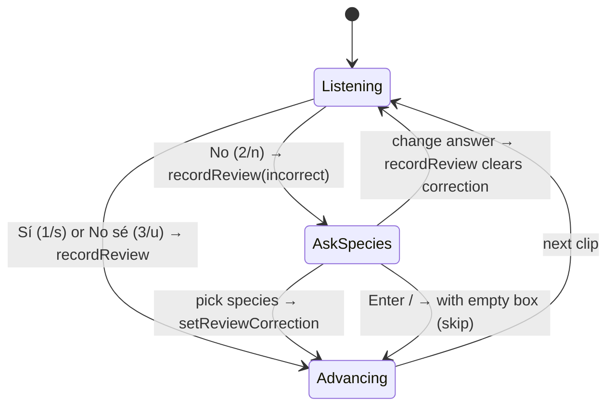

# feat: BirdNET validation — reviewer feedback round

## Summary

Four changes to `/audio/validacion` requested by a reviewer after the first validation sittings, plus a one-off data cleanup their question uncovered:

- A reviewer who marks a clip **incorrect** can name the species it really was, from a typo-proof search list. The correction lives on their review and surfaces on that species' validation page.
- A **"Requiere experto"** tag, separate from Prioridad.
- **Download** buttons on the review page for the clip and for the full source recording, plus the real filename.
- A **sites-with-correct-clips** view on each species' page, from the same reviews the fit reads.
- **Cleanup**: remove 1,180 house-test recordings that were uploaded into `CCN-003_V1`'s audio folder, together with their detections and the 38 validation clips drawn from them.

---

## Problem Frame

The reviewer is listening carefully and hearing things the tool can't record. A false positive is often a *different, identifiable* species. Today that knowledge is lost at the "No" keypress, because `birdnet_validation_reviews` has only an outcome and an unused `notes` column. Some species can't be judged by the current reviewers at all, and nothing marks them. When a clip is surprising, the reviewer has no route to the whole minute: the review page shows `site · habitat · recording start + detection offset` (e.g. `09:00:58`), but the Drive file is named after the recording start (`…_090000.flac`), so searching Drive for what the page displays finds nothing.

The question that prompted this was a White-throated Sparrow heard on a Broad-winged Hawk clip "at CCN-003, 2025-11-23". Investigation showed the recording is not from CCN-003:

- The deployment ran 2026-01-24 → 02-12 on recorder `2MM21842`.
- The same Drive folder holds 1,180 files from recorder `2MM20630`, dated 2025-11-17 → 11-23.
- Both sets were uploaded in one session on 2026-02-26 and synced together on 2026-03-02.
- The set is dominated by town species (House Sparrow 112 detections, Great-tailed Grackle, Rock Pigeon, Peregrine, Barn Owl).

This is the user's own house test. It contributes 210 detections across 37 species to CCN-003, and 38 clips across 18 validation species.

---

## Requirements

- R1. A reviewer who answers **incorrect** may optionally record the true species. They pick it from a controlled list, so no free text reaches the record.
- R2. The correction is stored on that reviewer's own review. It never writes to `audio_identifications.corrected_species`, so it changes no count, chart, export or occupancy input.
- R3. Clips corrected to species X appear on X's validation page as reviewer suggestions. They never enter X's sample, bin coverage or fit.
- R4. Only the **incorrect** outcome carries a correction. Changing the answer to correct or uncertain clears it.
- R5. After "No", the clip pauses with an optional species box. Choosing a species, or skipping, advances. Correct and uncertain keep today's auto-advance.
- R6. Editors can tag a species "Requiere experto", independently of Prioridad. The table can filter and sort by the tag.
- R7. The review page offers a download of the clip (.m4a) and of the full source recording under its original filename, and shows that filename.
- R8. Each species page shows which sites have correct clips. It uses the primary reviewer's answers via `resolveFitEligibleReviews`, never pooled answers.
- R9. The 1,180 `2MM20630` recordings filed under `CCN-003_V1`, and everything derived from them, are removed without being re-imported by the next sync.
- R10. Blinding holds throughout. Nothing new sent to the review client carries a BirdNET score or another reviewer's answer.

---

## Scope Boundaries

- No automatic guard against out-of-window or wrong-serial recordings (chosen: one-off cleanup only). The monthly `biochoco-data-review` skill is the natural place to flag this pattern.
- The two `2MM20630` files in `GIZ-005_V1` (13 s total, 2026-05-21) are not part of the cleanup. They are listed in the dry run for the user to decide.
- No free-text "species not in the list" entry.
- No change to `recordReview`'s notes-clearing behaviour, because notes are unused.
- A correction does not propagate to the portal-wide annotation (`assignAudioSpecies`), which stays an editor action.

### Deferred to Follow-Up Work

- Surfacing, on the *source* species page, how many of its false positives were attributed to which species (a "confused with" summary).
- Promoting an agreed correction into `audio_identifications.corrected_species` by an editor.

---

## Context & Research

### Relevant Code and Patterns

- Review write path: `recordReview` in `src/app/audio/validacion/actions.ts` (viewer, upsert per `(sample_id, reviewer_email)`). The client's optimistic `answer()` and 320 ms advance are in `src/app/audio/validacion/[slug]/revisar/review-client.tsx`.
- Shortcuts: `resolveReviewKey` in `use-review-shortcuts.ts` binds 1/s, 2/n, 3/u, Space, r, ←, →. All of them are suppressed on editable targets, so an input-focused picker is safe. A focused popover button or list item is not.
- Queue payload and blinding test: `getReviewQueue` returns an allowlisted key set, asserted in `tests/integration/birdnet-multi-reviewer.test.ts` ("never returns a review outcome to the review client"). Any added field must be allowlisted there deliberately.
- Species vocabulary: `src/lib/birdnet-taxonomy.ts` (`loadBirdnetNames`, `resolveBirdnetName`, `isNonSpeciesLabel`) over `data/birdnet-species-names.csv`, which has about 6.5k labels in scientific, English and Spanish. The existing cmdk combobox is `src/components/species-combobox.tsx`. The search normalizer is `normalizeSpeciesName` in `species-import.ts`.
- Species page: `src/app/audio/validacion/[slug]/page.tsx`. Its "Cobertura por sitio" card is fed by `getCampaignProgress` → `bySite`, keyed on `birdnet_validation_samples.site_name` (drawn and reviewed counts only).
- Priority pattern to mirror for the tag: column + `push-schema.mjs` ALTER in the `migrations` array, `updateCampaignPriority` (editor, not audited), `priority-cell.tsx`, `labels.ts` (`PRIORITY_*`), and `filterCampaignRows` + `species-filter-bar.tsx` URL params.
- Downloads:
  - `serveCachedM4a` in `src/lib/audio-serve.ts` already supports `download: true`.
  - `src/app/api/audio/stream/route.ts` streams from Drive with `?download=true`.
  - `loadClipSource` in `src/app/api/audio/validation-clip-shared.ts` already resolves `driveFileId`.
- Deletion: FKs cascade `audio_files → audio_detections → audio_identifications → birdnet_validation_samples → birdnet_validation_reviews`, and `acoustic_indices` also cascades. Sync (`audio-sync-internals.ts`) re-inserts any Drive file whose id isn't in the DB.

### Institutional Learnings

- Drizzle `text({ enum })` is TS-only. Any CHECK lives in `push-schema.mjs`, so the new columns use plain text/integer without a CHECK.
- Raw `.mjs` scripts write Drizzle timestamps in **seconds**, and must run inside the container (host writes corrupt SQLite on the macOS bind mount).
- A prod container has no `src/`, so the cleanup script is a self-contained better-sqlite3 `.mjs`.
- Client-module helpers can't be called from Server Components. Keep any new label/format helper out of `"use client"` files.
- `"use server"` files must not `export type {…} from`.

---

## Key Technical Decisions

- **The correction is a column on the review, not a note or a detection field.** Add `corrected_species` to `birdnet_validation_reviews`. Per-reviewer storage matches the multi-reviewer model: two reviewers can disagree without overwriting each other. `notes` is unsuitable because `recordReview` clears it on every later call.
- **A separate viewer-gated action writes the correction** (e.g. `setReviewCorrection(sampleId, species | null)`), rather than widening `recordReview`. The answer is saved the instant "No" is pressed, exactly as today, and the species arrives as a second, optional write. It refuses unless the caller's own review of that sample is `incorrect`, and refuses a species equal to the campaign's own. `recordReview` clears the column whenever the outcome changes away from `incorrect`.
- **The vocabulary is BirdNET's label list, stored as the scientific name.** It matches `audio_identifications.species` and campaign species exactly, so "the page for that species" is a plain equality lookup. It also covers species with no campaign or no `biochoco_species` row. The server re-resolves the submitted name through `resolveBirdnetName` and rejects non-species labels, so the client list is a convenience, not the guard. Species already detected in the caller's projects rank first in the picker.
- **Suggested clips never join the target species' sample.** They are a separate, clearly labelled section ("Sugeridos por revisores", with source species, site and reviewer). They are playable through the existing `validation-clip` route and absent from every `resolveFitEligibleReviews` consumer. Mixing them in would break the score-bin stratification the fit depends on.
- **Where suggestions appear when the target species has no campaign:** as a count on the validation table, reached through the species slug page. That page renders a minimal suggestions-only view when no campaign exists, and editors see "Añadir especie". The exact rendering is deferred to implementation.
- **"Requiere experto" is a boolean column on the campaign** (`needs_expert`, default 0), editable and filterable like priority. Editor-only, not audited: like priority, it is flipped in triage sittings. Its pill tone avoids every `STAGE_TONE` and `PRIORITY_TONE` hue.
- **Downloads go through `validation-clip`, keyed by sample id,** e.g. `?sample=N&download=1` for the clip and `?sample=N&source=1` for the full recording. The review client never needs `driveFileId`, and one route keeps the viewer + `requireDeploymentAccess` check. The full recording streams from Drive with its original filename. It is downloaded, not played, so the FLAC-on-iOS limitation doesn't apply. The only new queue field is `filename`, which carries no score.
- **Sites with correct clips extend `bySite`** with a `correct` count from fit-eligible reviews, rendered in "Cobertura por sitio", which must be sortable. Nothing else computes site correctness, so the numbers cannot drift from the fit.
- **Cleanup deletes the `audio_files` rows and lets FKs cascade, after the Drive files leave the folder.** Otherwise the next sync re-inserts and re-analyses them. The script is dry-run by default, and it reports any reviews and fits it would take with it before touching anything.

---

## High-Level Technical Design

The review flow after this change. This is directional; exact state names are the implementer's.

---

## Implementation Units

### U1. Schema: review correction and expert tag

**Goal:** Add `birdnet_validation_reviews.corrected_species` (nullable text) and `birdnet_validation_campaigns.needs_expert` (integer boolean, NOT NULL default 0).

**Requirements:** R2, R6

**Dependencies:** none

**Files:**
- Modify: `src/db/schema.ts`
- Modify: `scripts/push-schema.mjs` (CREATE TABLE and the `migrations` ALTERs)
- Test: `tests/integration/birdnet-review-schema.test.ts`

**Approach:** Mirror the `priority` column's addition. Add an index on `corrected_species` for the target-species lookup. No CHECK constraint.

**Test scenarios:**
- Pushing the schema twice on an existing DB is idempotent, and existing reviews read back `corrected_species = null`.
- Existing campaigns read back `needs_expert = false`.

**Verification:** Schema push succeeds in the dev container against a copy of the current DB.

### U2. Correction write path

**Goal:** A viewer can attach, change or clear the true species on their own incorrect review.

**Requirements:** R1, R2, R4, R10

**Dependencies:** U1

**Files:**
- Modify: `src/app/audio/validacion/actions.ts` (new correction action; `recordReview` clears the correction when the outcome leaves `incorrect`; a viewer-gated picker-list action)
- Test: `tests/integration/birdnet-corrected-species.test.ts` (new)
- Test: `tests/integration/birdnet-review-permissions.test.ts`

**Approach:**
- Server-side resolution through `resolveBirdnetName`. Reject non-species labels and the campaign's own species.
- The picker-list action returns BirdNET labels with the project-detected species ranked first. It is fetched once per review session, not per clip.
- Return `ActionResult<T>`. No `recordEvent`, because this is a per-clip write.

**Test scenarios:**
- Happy path: after `recordReview(incorrect)`, setting "Zonotrichia albicollis" stores the canonical scientific name.
- Clearing with `null` removes it.
- A misspelled name or a non-species label is rejected with a Spanish error.
- The campaign's own species is rejected.
- Refused when the caller has no review of the sample, or their outcome is `correct` or `uncertain`.
- Reviewer A's correction is untouched when reviewer B reviews or corrects the same sample.
- `recordReview(correct)` after a correction clears it. `recordReview(incorrect)` again, unchanged, preserves it.
- Refused on an abandoned campaign, as `recordReview` is.
- The permissions test asserts the new action asks for `viewer` on `grabaciones`.

**Verification:** All scenarios pass. The multi-reviewer blinding test is unchanged.

### U3. Review page: pause on "No" with species picker

**Goal:** After "No", the clip stays up with an optional search box. A species pick or a skip advances.

**Requirements:** R1, R5, R10

**Dependencies:** U2

**Files:**
- Modify: `src/app/audio/validacion/[slug]/revisar/review-client.tsx`
- Modify: `src/app/audio/validacion/[slug]/revisar/use-review-shortcuts.ts`
- Create: a correction-picker component beside them (reuse `src/components/species-combobox.tsx` if its `Species` shape can take BirdNET labels; otherwise a thin cmdk picker using the same normalizer)
- Test: `src/app/audio/validacion/[slug]/revisar/__tests__/use-review-shortcuts.test.ts`
- Test: `src/app/audio/validacion/[slug]/revisar/__tests__/` (new picker-flow test)

**Approach:**
- "No" writes immediately, then enters the ask-species state instead of the 320 ms advance, and focuses the input.
- Enter on an empty box, or →, skips. Selecting a species writes it and advances.
- Going back (←) to an answered "No" shows the reviewer's own correction from client state.
- Names display through the existing name-language cookie.
- Keep focus inside the input while the list is open, so s/n/u/r can't fire from a focused list item.

**Test scenarios:**
- "No" does not auto-advance. "Sí" and "No sé" still do.
- Typing "s" or "n" in the picker input doesn't answer the clip.
- Enter with an empty input advances without a correction write.
- Choosing a species calls the correction action once, then advances.
- A failed write keeps the clip up with the typed text and a Spanish error.
- Changing a "No" to "Sí" via ← hides the picker and clears the stored correction.

**Verification:** A reviewer can complete a batch keyboard-only. Viewed with Playwright at desktop and phone widths, the picker doesn't overlap the spectrogram axes or the progress readout.

### U4. Suggested clips on the target species' page

**Goal:** Clips that reviewers attributed to species X appear on X's validation page, and in the table where X has no campaign.

**Requirements:** R3, R10

**Dependencies:** U2

**Files:**
- Modify: `src/app/audio/validacion/actions.ts` (read: suggestions for a species; suggestion counts for the table)
- Modify: `src/app/audio/validacion/[slug]/page.tsx`
- Create: a suggestions section component in `src/app/audio/validacion/[slug]/`
- Modify: `src/app/audio/validacion/campaign-table.tsx` (suggestion count indicator)
- Modify: `src/app/audio/validacion/labels.ts`
- Test: `tests/integration/birdnet-corrected-species.test.ts`

**Approach:**
- Join reviews → samples → campaigns on `corrected_species = X`.
- Show: source species, site, recording time, reviewer, and a play control via `validation-clip?sample=N`.
- Viewer-visible, and scoped to the caller's projects like `listValidatableSpecies`.
- Never read by the fit, bin coverage, site coverage or totals.
- If a sortable list, follow the client-table sort pattern with `SortIcon`.

**Test scenarios:**
- A correction to X appears on X's page with the right source species and site.
- It is absent from X's `getCampaignProgress` totals and fit-eligible reviews.
- Two reviewers correcting the same clip to X show once per reviewer, labelled.
- A clip corrected by one reviewer and marked correct by another still appears.
- Clearing the correction removes it.
- A species with no campaign shows the count on the table and a suggestions-only slug page.
- Clips from projects the caller can't access are excluded.

**Verification:** On dev data, a seeded correction round-trips from the review page to the target page.

### U5. "Requiere experto" tag

**Goal:** Editors can mark species needing an expert, independent of priority, and filter and sort the table by it.

**Requirements:** R6

**Dependencies:** U1

**Files:**
- Modify: `src/app/audio/validacion/actions.ts` (editor toggle, `revalidatePath` like priority)
- Modify: `src/app/audio/validacion/campaign-table.tsx`, `species-filter-bar.tsx`, `page.tsx`, `labels.ts`
- Modify: `src/app/audio/validacion/[slug]/page.tsx` (tag + toggle beside Prioridad)
- Modify: `src/lib/birdnet-validation/types.ts` if the row type lives there
- Test: `src/app/audio/validacion/__tests__/campaign-table.test.ts`
- Test: `tests/integration/birdnet-review-permissions.test.ts`

**Approach:**
- The toggle sits beside the priority pill. The filter is a URL param preserved alongside status, priority and search.
- The column is sortable, with ties broken by name and then id, like priority.
- A viewer sees the tag but no toggle, following the `canEdit` split.

**Test scenarios:**
- The filter shows only tagged species and combines with the priority and status filters.
- Sorting puts tagged species first, with an alphabetical tiebreak.
- The toggle action requires `editor`.
- A viewer's row renders the tag without the control.

**Verification:** Tagging from the table and from the species page agree after revalidation.

### U6. Clip and full-recording downloads

**Goal:** The reviewer can download the clip and the full 1-minute source file, and sees its filename.

**Requirements:** R7, R10

**Dependencies:** none

**Files:**
- Modify: `src/app/api/audio/validation-clip/route.ts`
- Modify: `src/app/api/audio/validation-clip-shared.ts` if the filename isn't already returned
- Modify: `src/app/audio/validacion/actions.ts` (`getReviewQueue` adds `filename`)
- Modify: `src/app/audio/validacion/[slug]/revisar/review-client.tsx`
- Test: `tests/integration/birdnet-multi-reviewer.test.ts` (allowlist gains `filename`)
- Test: a route test beside the existing validation-clip coverage

**Approach:**
- `download=1` passes `download: true` to `serveCachedM4a`.
- `source=1` streams the original from Drive (reuse the stream route's Drive streaming helper, not a second copy), with `Content-Disposition: attachment` and the original filename.
- Same viewer + `requireDeploymentAccess` gate.
- The filename appears in the metadata line under the clip, with the two download buttons.

**Test scenarios:**
- `download=1` returns an attachment header named `validacion-N.m4a`.
- `source=1` returns an attachment with the original `.flac`/`.wav` name.
- A viewer without access to the deployment's project gets 403 for both.
- A non-integer sample gets 400.
- The queue payload contains `filename` and still no outcome or score-bearing field.

**Verification:** Downloading the Broad-winged Hawk sample's source in dev yields `2MM20630_20251123_090000.flac`, if run before U8.

### U7. Sites with correct clips

**Goal:** Each species page shows which sites have correct clips, from primary-reviewer answers.

**Requirements:** R8

**Dependencies:** none

**Files:**
- Modify: `src/app/audio/validacion/actions.ts` (`getCampaignProgress` → `bySite` gains `correct`)
- Modify: `src/app/audio/validacion/[slug]/page.tsx` ("Cobertura por sitio")
- Test: `tests/integration/birdnet-site-coverage.test.ts`

**Approach:**
- Map fit-eligible reviews back to their sample's `site_name`.
- Add a "Correctos" column and a one-line summary ("Confirmada en N de M sitios").
- The table is sortable per the tables convention.

**Test scenarios:**
- With a primary reviewer set, a site counts correct only from the primary's answers. A second reviewer's "correct" at another site does not add it.
- With a sole reviewer, their answers count.
- With multiple reviewers and no primary, the card shows the existing refusal state, not a pooled count.
- A site with only incorrect or uncertain answers shows 0.

**Verification:** The site counts sum to the fit's correct total.

### U8. Remove the house-test recordings from CCN-003

**Goal:** Remove the 1,180 `2MM20630` files dated 2025-11-17 → 11-23 from `CCN-003_V1`, together with their 210 detections and 38 validation samples, permanently.

**Requirements:** R9

**Dependencies:** none. Run before U6's manual check, or re-pick the example.

**Files:**
- Create: `scripts/remove-stray-audio.mjs` (self-contained better-sqlite3, dry-run by default)
- Test expectation: none. This is a one-off, operator-run script; its dry-run report is the verification.

**Approach:**
- Order of operations:
  1. Take a backup via the `db-backup-restore` skill.
  2. The user moves the 1,180 files out of the CCN-003 audio folder in Drive to a non-deployment folder.
  3. Run the dry run. It selects rows by deployment + serial prefix + filename date before `valid_start`, and reports files, detections, validation samples per species, reviews that would be deleted (by reviewer), and any fitted or applied threshold on an affected species. It also lists the two GIZ-005 strays, without acting on them.
  4. Run with the apply flag: delete the `audio_files` rows and let FKs cascade, then `recordEvent`-equivalent insert into system events with the counts.
  5. Run in prod via `docker compose exec portal`.
- Affected species keep a sample one clip short in some bins, which is accepted. A fitted species touched by the cleanup gets a re-fit prompt in the report, not an automatic re-fit.

**Verification:**
- The dry run on the dev copy reports 1,180 / 210 / 38.
- After apply, a re-run finds zero rows.
- The next nightly audio sync does not re-import them.
- The deployment's detection counts drop accordingly.

---

## System-Wide Impact

- **Blinding (R10):** the only queue payload change is `filename`. Corrections and suggestions are never returned by `getReviewQueue`. The suggestions section shows other reviewers' "incorrect" judgments of a *different* species' clips, which does not bias a reviewer's judgment of this species' sample.
- **Permissions:** the correction write joins review as the second viewer-level write, bounded to the caller's own review row. The expert toggle stays editor. `birdnet-review-permissions.test.ts` pins both.
- **Fit integrity:** suggestions and corrections never pass through `resolveFitEligibleReviews`, so thresholds, CIs and occupancy inputs are unchanged by U2–U4.
- **Data cleanup (U8):** removes detections from portal-wide species counts, charts, exports and the public/Choconexión stats for CCN-003. Occupancy is already unaffected, because it filters by `valid_start/valid_end`.

---

## Risks & Dependencies

| Risk | Mitigation |
|---|---|
| Deleting stray rows while the files are still in Drive → sync re-imports and BirdNET re-analyses them | Drive move is a required first step. The dry run states it, and the post-sync check verifies it |
| U8 cascade deletes a colleague's reviews silently | Dry run lists every affected review by reviewer, and any fitted species, before apply |
| Picker list (~6.5k labels) is heavy on a phone | Fetched once per session. Project-detected species ranked first. Pruned to species-rank labels |
| Focus lands on a list item and a single-letter shortcut answers the next clip | Keep focus in the input. Shortcut test covers it |
| Reviewers now pause on every "No" — slower batches for species with many false positives | Skip is one key (Enter/→). The user chose this over auto-advance |

---

## Documentation / Operational Notes

- Update the BirdNET validation section of `CLAUDE.md`:
  - The correction column and why it lives on the review, not the detection.
  - That suggestions never enter the fit.
  - The expert tag.
  - The two download params.
- After U8, note the incident and its cause (house-test files uploaded alongside a field retrieval) in the memory index. Suggest the monthly data review flag recorder-serial mismatches within a deployment folder.
